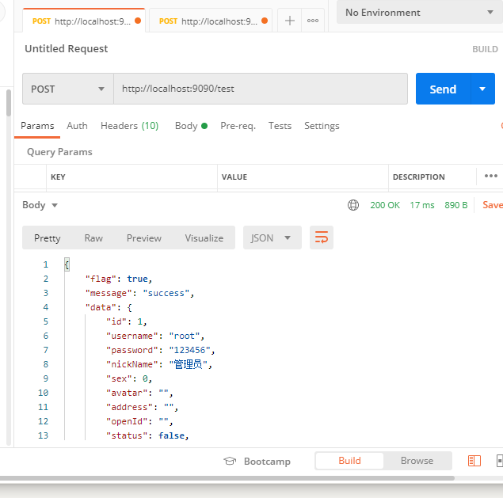
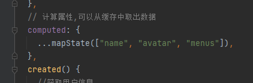
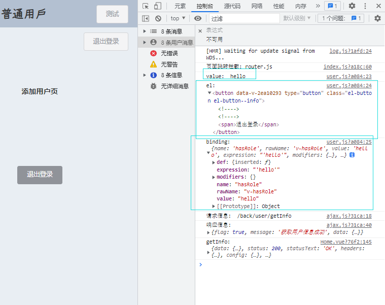
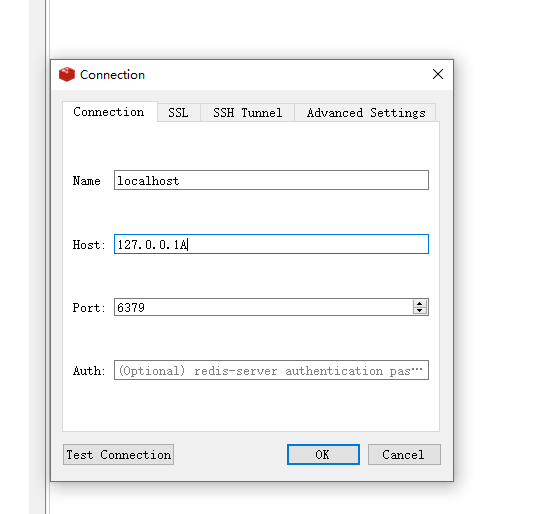
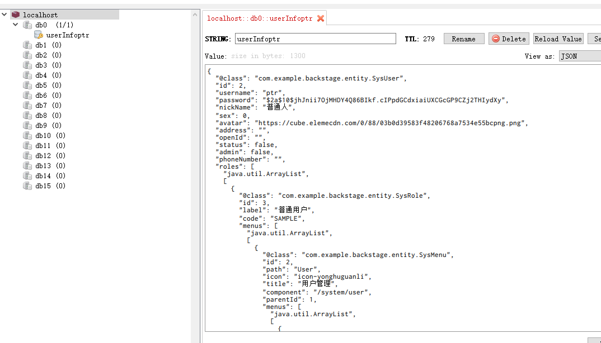

2022年10月3日 重制:

视频链接:https://www.bilibili.com/video/BV1Mq4y1W747/?p=4&spm_id_from=pageDriver&vd_source=32131508025bddf2cd86c3bbf5b572cb

## 一、创建java项目

创建一个Spring Initializr--->> 选择路径-->>选择java版本java8 和jdk版本jdk1.8

下一步,暂时添加两个依赖,Lombok和spring web


## 二、测试java项目

1.新建一个controller.TestController文件

```java
@RestController
/*
    @RestController == @Controller + @ResponseBody
    @Controller 将当前修饰的类注入SpringBoot IOC容器
    @ResponseBody 该类中所有的API接口返回的数据,它会以Json字符串的形式返回给客户端
 */
public class TestController {
    @RequestMapping("/test")
    /*
        @RequestMapping注解是一个用来处理请求地址映射的注解，可用于映射一个请求或一个方法，可以用在类或方法上。
        用于方法上，表示在类的父路径下追加方法上注解中的地址将会访问到该方法
        用于类上，表示类中的所有响应请求的方法都是以该地址作为父路径。
     */

    public String test(){
        return "你好";
    }
}
```

2.启动项目

3.在浏览器中输入http://localhost:8080/test

4.看结果,如浏览器上显示你好,则没问题

## 三.搭建vue

1.打开命令提示符窗口,输入vue ui


2.浏览器会打开管理平台,然后打开左下角的项目管理器


3.输入项目路径,回车,点击再次创建新项目


4.输入项目名,包管理器,点击下一步


5.选择手动,也可以选择之前配置好的


6.选择添加Router(路由),Vuex(存储),Linter/FOrmatter(代码检查)


7.选择代码规范 ESLint+Prettier


8.创建,不保存预设,然后等它创建成功


9.创建成功后,切换到依赖

看是否有axios,element-ui,有则不管,没有就安装


10.运行vue,切换到任务,点击serve,点击运行


11.运行成功画面


## 四.创建微信小程序项目

1.如果未安装,先进行下载安装

https://blog.csdn.net/weixin_41645135/article/details/125242331

2.新建一个项目,设置项目名称和目录


AppID在小程序官方网站,登录进去,在开发栏有开发管理,开发管理里有开发设置,复制下来即可.


项目创建成功:


## 五.前端发送请求后端数据测试

### 1.vue写一个方法,如

```vue
click() {
  axios
    .get("http://localhost:9090/test")
    .then((res) => {
      console.log(res);
    })
    .catch((err) => {
      console.log(err);
    });
},
```

绑定到图片上:

```vue

```

### 2.运行前端和后端并打开浏览器测试


说明路由跨域有问题

### 3.解决跨域问题

3.1.从后端上解决

3.1.1 新建一个配置类WebConfig,如下,重新启动

```java
@Configuration
public class WebConfig implements WebMvcConfigurer {
    // 重写跨域方法
    @Override
    public void addCorsMappings(CorsRegistry registry) {
        registry
                // 允许访问路径为所有路径
                .addMapping("/**")
                // 配置请求来源
                .allowedOrigins("http://localhost:8080")
                // 允许跨域访问的方法
                .allowedMethods("GET", "POST", "DELETE","PUT","OPTION")
                // 是否允许请求头,如token
                .allowCredentials(true)
                // 最大响应时间为一个小时
                .maxAge(3600);
        //WebMvcConfigurer.super.addCorsMappings(registry);
    }
}
```

响应成功


## 六.java工具类

### 6.1 响应工具类

用来响应前端发送请求,后端返回结果

```java
@Data
public class Result {
    // 响应给前端是否成功的标志
    private boolean flag;
    // 响应信息
    private String message;
    // 响应数据
    private Object data;
    public Result(boolean flag, String message, Object data){
        this.flag=flag;
        this.message=message;
        this.data=data;
    }
    public Result(boolean flag, String message){
        this.flag=flag;
        this.message=message;
    }
    // 响应成功
    public static Result success(String message, Object data){
         return new Result(true,message,data);
    }
    public static Result success(){
        return new Result(true,"返回成功",null);
    }
    // 响应失败
    public static Result fail(String message){
        return new Result(false, message);
    }
    public static Result fail(){
        return new Result(false, "返回失败");
    }
}
```

### 6.2 数据分页工具类

```java
@Data
public class PageResult {
    // 总记录数
    private long total;
    // 分页数据
    private List list;
}
```

### 6.3 查询工具类

```java
@Data
public class QueryInfo {
    // 第几页
    private Integer pageNumber;
    // 一页多少条数据
    private Integer pageSize;
    // 查询内容
    private String queryString;
}
```


### 6.4 设置根目录

新建一个工具类js

```js
import Vue from "vue";
import axios from "axios";

const ajax = axios.create({
  //根路径,设置根路径请求时直接写子路径就行了
  //如:http://localhost:9090/test 只需要写/test
  baseURL: "http://localhost:9090",
});
// 挂载到全局
Vue.prototype.$ajax = ajax;
```


引入到main.js中

```js
import Vue from "vue";
import App from "./App.vue";
import router from "./router";
import store from "./store";
import "@/util/ajax";
Vue.config.productionTip = false;

new Vue({
  router,
  store,
  render: (h) => h(App),
}).$mount("#app");
```


使用axios

```vue
// 点击图标,给后端发送请求
click() {
    axios
    .get("http://localhost:9090/test")
    .then((res) => {
      console.log(res);
    })
    .catch((err) => {
      console.log(err);
    });
},
```

使用自定义方法:

与直接使用axios区别:设置了根目录,可直接下子路径

```vue
    // 点击图标,给后端发送请求
    click() {
      // 可以使用工具类方法$ajax,此方法设置了根目录
      this.$ajax
        // axios
        // .get("http://localhost:9090/test")
        .get("/test")
        .then((res) => {
          console.log(res);
        })
        .catch((err) => {
          console.log(err);
        });
    },
```

## 七.登录页面

### 1.新建一个login.vue文件

,先简单得写一些页面信息

```vue
<template>
  <div>
    <span>hello</span>
  </div>
</template>

<script>
export default {
  name: "login",
  data(){
    return {}
  },
  created(){

  },
  methods:{

  }
};
</script>

<style scoped></style>
```

### 2.在路由中加入路径

router.index.js

```js
const routes = [
  {
    path: "/login",
    name: "Login",
    component: Login,
    // component: () => {
    //   import("../views/login.vue")
    // },
  },
];
```

### 3.运行测试

注意app.vue中得<router-view />要保留

### 4.登录界面优化

首先,在element-ui上找一个表单,进行修改

```heml
<el-form
        :model="form"
        status-icon
        :rules="rules"
        ref="form"
        label-width="40px"
        class="demo-ruleForm"
      >
        
        <el-form-item label="账号" prop="account">
          <el-input v-model="form.account" autocomplete="off"></el-input>
        </el-form-item>
        <el-form-item label="密码" prop="password">
          <el-input
            type="password"
            v-model="form.password"
            autocomplete="off"
          ></el-input>
        </el-form-item>
        <!--<el-form-item label="确认密码" prop="checkPassword">-->
        <!--  <el-input v-model.number="form.age"></el-input>-->
        <!--</el-form-item>-->
        <el-form-item>
          <el-button type="primary" @click="submit('form')">提交</el-button>
          <el-button @click="reset('form')">重置</el-button>
        </el-form-item>
      </el-form>
```

设置其属性及方法

```js

ata() {
    return {
      form: {
        account: "",
        password: "",
        checkPassword: "",
      },
      rules: {
        // 用户名表单校验
        account: [
          { require: true, message: "请输入用户名", trigger: "blur" },
          { min: 2, max: 20, message: "长度在2到20个字符", trigger: "blur" }],
        password: [{ require: true, message: "请输入用户名", trigger: "blur" },
          { min: 2, max: 20, message: "长度在2到20个字符", trigger: "blur" }],
      },
    };
  },
  methods: {
    // 登录方法
   submit(form) {
      this.$refs[form].validate((valid) => {
        // valid:表单校验结果
        if (valid) {
          console.log("success");
        } else {
          return this.$message({
            showClose: true,
            message: "数据校验失败",
            type: "error",
          });
        }
      });
    },
    // 重置方法
    reset(form) {
      // 将整个表单进行重置,并移除校验效果,有$ref属性的有用
      this.$refs[form].resetFields();
    },
  },
```


### 5.添加警告信息

提交方法添加了验证失败效果:

```js
submit(form) {
  this.$refs[form].validate((valid) => {
    // valid:表单校验结果
    if (valid) {
      console.log("success");
    } else {
      return this.$message({
        showClose: true,
        message: "数据校验失败",
        type: "error",
      });
    }
  });
},
```


## 八.数据库设计

### 8.1 用户表

AUTO_INCREMENT 自增

字段用``,字符串用''

```sql
-- 判断用户表是否存在,存在则删除
DROP TABLE IF EXISTS `sys_user`;
-- 创建用户表
CREATE TABLE `sys_user`(
	`id` BIGINT(20) NOT NULL PRIMARY KEY AUTO_INCREMENT COMMENT'主键',
	`user_name` VARCHAR(20) COMMENT'登录名',
	`password` VARCHAR(20) COMMENT'密码',
	`nike_name` VARCHAR(20) COMMENT'昵称',
	`sex` TINYINT(1) COMMENT'性别(0男,1女,2未知)',
	`avatar` VARCHAR(100) COMMENT'用户头像',
	`address` VARCHAR(100) COMMENT'地址'

);
```

## 九.连接并测试数据库

### 9.1 导入mysql依赖

```xml
        <!--        数据库依赖-->
        <dependency>
            <groupId>org.springframework.boot</groupId>
            <artifactId>spring-boot-starter-data-jdbc</artifactId>
        </dependency>

        <dependency>
            <groupId>mysql</groupId>
            <artifactId>mysql-connector-java</artifactId>
            <version>5.1.49</version>
        </dependency>
```

### 9.2 新建mapper用户操作类

```java
package com.example.backend.mapper;

import com.example.backend.entity.SysUser;

import java.util.List;

/**
 * @author HuaRunSheng
 * @date 2022/10/11 22:18
 * @description :用户相关操作
 */
public interface SysUserMapper {
    List<SysUser> findAll();
}

```

### 9.3 新建实体类

```java
package com.example.backend.entity;

import lombok.Data;

/**
 * @author HuaRunSheng
 * @date 2022/10/11 22:19
 * @description :实体类
 */
@Data
public class SysUser {
    private Long id;
    private String password;
    private String userName;
    private Integer sex;
    private String avatar;
    private String address;
    private String openId;
    private boolean status;
    private boolean admin;
    private String phoneNumber;
}

```

### 9.5 新建操作数据库的xml文件

在资源文件夹下,新建mapper文件夹,再新建SysUserMapper.xml文件

```xml
<?xml version="1.0" encoding="UTF-8" ?>
<!DOCTYPE mapper  PUBLIC "-//mybatis.org//DTD Mapper 3.0//EN"
        "http://mybatis.org/dtd/mybatis-3-mapper.dtd">
<mapper namespace="com.example.backend.mapper.SysUserMapper">
    <select id="findAll" resultType="com.example.backend.entity.SysUser">
        select * from sys_user;
    </select>

</mapper>
```


### 9.6 新建service类,用户操作类

```java
package com.example.backend.service;

import com.example.backend.util.Result;

/**
 * @author HuaRunSheng
 * @date 2022/10/11 22:34
 * @description :用户操作的逻辑接口
 */
public interface SysUserService {
    // 获取用户的所有信息
    Result findAll();
}

```

### 9.7 新建impl类用户类的实现类

```java
package com.example.backend.service.impl;

import com.example.backend.mapper.SysUserMapper;
import com.example.backend.service.SysUserService;
import com.example.backend.util.Result;
import lombok.extern.slf4j.Slf4j;
import org.springframework.beans.factory.annotation.Autowired;
import org.springframework.stereotype.Service;

/**
 * @author HuaRunSheng
 * @date 2022/10/11 22:36
 * @description :Service实现类
 */
@Service
@Slf4j
public class SysUserServiceImpl implements SysUserService {
    @Autowired
    private SysUserMapper userMapper;
    @Override
    public Result findAll() {
        log.info("获取用户信息");
        return Result.success("获取用户信息成功", userMapper.findAll());
    }
}

```

### 9.8 编辑配置文件

```yaml
# 配置数据库
spring:
  datasource:
    driver-class-name: com.mysql.jdbc.Driver
    username: root
    password: 123456
    url: jdbc:mysql://localhost:3306/20220516_sport?useUnicode=true&characterEncoding=utf8&useSSL=false

mybatis:
  mapper-locations: classpath:mapper/*.xml
  #配置映射类所在的包名
  type-aliases-package: com.example.backstage.entity
  configuration:
    map-underscore-to-camel-case: true
    log-impl: org.apache.ibatis.logging.stdout.StdOutImpl
```

### 9.9 配置扫描mapper路径

在启动文件中加入注解: @MapperScan("com.example.backend.mapper")

不然启动会找不到SysUserMapper

```java
package com.example.backend;

import org.mybatis.spring.annotation.MapperScan;
import org.springframework.boot.SpringApplication;
import org.springframework.boot.autoconfigure.SpringBootApplication;

@MapperScan("com.example.backend.mapper")
@SpringBootApplication
public class BackEndApplication {

    public static void main(String[] args) {
        SpringApplication.run(BackEndApplication.class, args);
    }

}

```


### 9.10  编写测试代码

```java
package com.example.backend.controller;

import com.example.backend.service.SysUserService;
import com.example.backend.util.Result;
import org.springframework.beans.factory.annotation.Autowired;
import org.springframework.web.bind.annotation.RequestMapping;
import org.springframework.web.bind.annotation.RestController;

/**
 * @author HuaRunSheng
 * @date 2022/10/8 18:45
 * @description :
 */
@RestController
/*
    @RestController == @Controller + @ResponseBody
    @Controller 将当前修饰的类注入SpringBoot IOC容器
    @ResponseBody 该类中所有的API接口返回的数据,它会以Json字符串的形式返回给客户端
 */
public class TestController {

    @Autowired
    private SysUserService userService;
    @RequestMapping("/test")
    /*
        @RequestMapping注解是一个用来处理请求地址映射的注解，可用于映射一个请求或一个方法，可以用在类或方法上。
        用于方法上，表示在类的父路径下追加方法上注解中的地址将会访问到该方法
        用于类上，表示类中的所有响应请求的方法都是以该地址作为父路径。
     */
    public Result test(){
        return Result.success();
    }
    @RequestMapping("/test/login")
    public Result login(){
        return userService.findAll();
    }
}
```

### 9.11 启动


## 十. 配置spring security

### 10.1 导入依赖

```xml
        <!--  spring security  -->
        <dependency>
            <groupId>org.springframework.boot</groupId>
            <artifactId>spring-boot-starter-security</artifactId>
        </dependency>
        <dependency>
            <groupId>org.springframework.security</groupId>
            <artifactId>spring-security-test</artifactId>
            <scope>test</scope>
        </dependency>
```

### 10.2 测试

导入security依赖后,运行,进入到http://localhost:9090,会自动跳转到security自带的登录界面


### 10.3 实现权限框架接口

实体类SysUser实现UserDetail权限框架接口,并重写接口方法

F:\Java\PracticeProject\20220515个人运动管理平台\20221003重制\code\BackEnd\src\main\java\com\example\backend\entity\SysUser.java

### 10.4 编写LoginController类

```java
package com.example.backend.controller;

import com.example.backend.service.SysUserService;
import com.example.backend.util.Result;
import com.example.backend.vo.LoginVo;
import org.springframework.beans.factory.annotation.Autowired;
import org.springframework.web.bind.annotation.PostMapping;
import org.springframework.web.bind.annotation.RequestBody;
import org.springframework.web.bind.annotation.RequestMapping;
import org.springframework.web.bind.annotation.RestController;

/**
 * @author HuaRunSheng
 * @date 2022/10/12 11:13
 * @description :
 */
@RestController
@RequestMapping("/user")
public class LoginController {
    @Autowired
    private SysUserService userService;
    @PostMapping("/login")
    public Result login(@RequestBody LoginVo loginVo){
        return userService.login(loginVo);
    }
}

```

### 10.5 配置jwt

jwt: json web token

首先,注入依赖

```xml
        <!--  生成Json格式的token  -->
        <dependency>
            <groupId>io.jsonwebtoken</groupId>
            <artifactId>jjwt</artifactId>
            <version>0.9.1</version>
        </dependency>
```

在application.yml中配置持久化信息:

```yaml
# jwt配置
jwt:
  #  请求头
  tokenHeader: Authorization
  # 签名校验
  secret: hrsxcl0205
  # jwt过期时间,秒为单位
  expiration: 1800
  # token头部
  tokenHead: 'Bearer '
```

### 10.6 编写token的工具类

```java
package com.example.backend.util;

import io.jsonwebtoken.Claims;
import io.jsonwebtoken.Jwts;
import io.jsonwebtoken.SignatureAlgorithm;
import org.springframework.beans.factory.annotation.Value;
import org.springframework.security.core.userdetails.UserDetails;
import org.springframework.stereotype.Component;

import java.util.Date;
import java.util.HashMap;
import java.util.Map;

/**
 * @author HuaRunSheng
 * @date 2022/10/12 15:53
 * @description :
 */
@Component
public class TokenUtil {
    @Value("${jwt.secret}")
    private String secret;
    @Value("${jwt.expiration}")
    private long expiration;

    /**
     * 传入登录信息,生成token
     * @param details
     * @return
     */
    public String GenerateToken(UserDetails details){
        Map<String, Object> map=new HashMap<>(2);
        map.put("username", details.getUsername());
        map.put("created", new Date());
        return generateJwt(map);
    }

    private String generateJwt(Map<String, Object> map){
        return Jwts.builder()
                .setClaims(map)
                // 签名
                .signWith(SignatureAlgorithm.HS512, secret)
                // 过期时间
                .setExpiration(new Date(System.currentTimeMillis()+ expiration*1000))
                .compact();
    }
    /**
     * 通过token,获取token的主体
     * @param token
     * @return
     */
    public Claims getTokenBody(String token){
        try {
            return Jwts.parser()
                    .setSigningKey(secret)
                    .parseClaimsJws(token)
                    .getBody();
        }catch (Exception e){
            return null;
        }
    }

    /**
     * 根据token得到用户名
     * @param token
     * @return
     */
    public String getUsernameByToken(String token){
        return (String) this.getTokenBody(token).get("username");
    }

    /**
     * 根据token判断当前时间内,token是否过期
     * @param token
     * @return
     */
    public boolean isExpiration(String token){
        return this.getTokenBody(token).getExpiration().before(new Date());
    }

    /**
     * 刷新token
     * @param token
     * @return
     */
    public String refreshToken(String token){
        Claims claims=this.getTokenBody(token);
        claims.setExpiration(new Date());
        return this.generateJwt(claims);
    }

}

```

### 10.7 配置403返回信息

```java
package com.example.backend.config.security.handler;

import com.example.backend.util.Result;
import com.fasterxml.jackson.databind.ObjectMapper;
import org.springframework.security.access.AccessDeniedException;
import org.springframework.security.web.access.AccessDeniedHandler;
import org.springframework.stereotype.Component;

import javax.servlet.ServletException;
import javax.servlet.http.HttpServletRequest;
import javax.servlet.http.HttpServletResponse;
import java.io.IOException;
import java.io.PrintWriter;

/**
 * @author HuaRunSheng
 * @date 2022/10/13 21:58
 * @description :将403代码,换成自己的返回信息
 */
@Component
public class JwtAccessDeniedHandler implements AccessDeniedHandler {
    @Override
    public void handle(HttpServletRequest request, HttpServletResponse response, AccessDeniedException accessDeniedException) throws IOException, ServletException {
        response.setStatus(403);
        response.setCharacterEncoding("UTF-8");
        response.setContentType("application/json");
        PrintWriter writer=response.getWriter();
        writer.write(new ObjectMapper().writeValueAsString(Result.fail("权限不足,请联系管理员!")));
        writer.flush();
        writer.close();
    }
}

```

### 10.8 配置401返回信息

```java
package com.example.backend.config.security.handler;

import com.example.backend.util.Result;
import com.fasterxml.jackson.databind.ObjectMapper;
import org.springframework.security.core.AuthenticationException;
import org.springframework.security.web.AuthenticationEntryPoint;
import org.springframework.stereotype.Component;

import javax.servlet.ServletException;
import javax.servlet.http.HttpServletRequest;
import javax.servlet.http.HttpServletResponse;
import java.io.IOException;
import java.io.PrintWriter;

/**
 * @author HuaRunSheng
 * @date 2022/10/13 11:12
 * @description :当用户未登录和token过期的情况下访问资源
 */
@Component
public class JwtAuthenticationEntryPoint implements AuthenticationEntryPoint {
    @Override
    public void commence(HttpServletRequest request, HttpServletResponse response, AuthenticationException authException) throws IOException, ServletException {
        response.setStatus(401);
        response.setCharacterEncoding("UTF-8");
        response.setContentType("application/json");
        PrintWriter writer=response.getWriter();
        writer.write(new ObjectMapper().writeValueAsString(Result.fail("登陆失败")));
        writer.flush();
        writer.close();

    }
}

```

### 10.9 查询SySUser

```xml
<?xml version="1.0" encoding="UTF-8" ?>
<!DOCTYPE mapper  PUBLIC "-//mybatis.org//DTD Mapper 3.0//EN"
        "http://mybatis.org/dtd/mybatis-3-mapper.dtd">
<mapper namespace="com.example.backend.mapper.SysUserMapper">
    <select id="findAll" resultType="com.example.backend.entity.SysUser">
        select * from sys_user;
    </select>
    <!-- 获取用户信息  -->
    <!--<select id="findByUsername" resultType="com.example.backend.entity.SysUser">-->
    <!--    select * from sys_user where user_name=#{username};-->
    <!--</select>-->

    <select id="findByUsername" resultMap="mainMap">
        select * from sys_user where user_name=#{username};
    </select>

    <resultMap id="mainMap" type="com.example.backend.entity.SysUser">
        <id column="id" property="id"/>
        <result column="user_name" property="username"/>
        <result column="password" property="password"/>
        <result column="sex" property="sex"/>
        <result column="avatar" property="avatar"/>
        <result column="address" property="address"/>
        <result column="open_id" property="openId"/>
        <result column="status" property="status"/>
        <result column="admin" property="admin"/>
        <result column="phone_number" property="phoneNumber"/>
        <!--  根据id查询roles  -->
        <collection property="roles" ofType="com.example.backend.entity.SysRole"
                    select="findRoles" column="id"/>
        <!--  根据id查询permissions  -->
        <!--<collection property="permissions" ofType="com.example.backend.entity.SysPermission"-->
        <!--            resultMap="permissionMap" select="findPermission" column="id"/>-->
        <!--  resultMap="permissionMap"不能写在collection中,不然会报错,编译过不去  -->
    </resultMap>

    <resultMap id="roleMap" type="com.example.backend.entity.SysRole">
        <id column="id" property="id"/>
        <result column="label" property="label"/>
        <result column="code" property="code"/>
        <collection property="menus" select="findMenus"
                    column="id" ofType="com.example.backend.entity.SysMenu"/>
        <collection property="permissions" select="findPermission"
                    column="id" ofType="com.example.backend.entity.SysPermission"/>
    </resultMap>

    <!-- select: user_role为中间表,一个user对应一种roles  -->
    <select id="findRoles" parameterType="int" resultMap="roleMap">
        select * from sys_role where id in (select role_id from user_role where user_id=#{id})
    </select>

    <!--  resultMap: 为一个结果集  -->
    <resultMap id="menuMap" type="com.example.backend.entity.SysMenu">
        <id column="id" property="id"/>
        <result column="path" property="path"/>
        <result column="icon" property="icon"/>
        <result column="title" property="title"/>
        <result column="component" property="component"/>
        <result column="parent_id" property="parentId"/>
        <collection property="menus" ofType="com.example.backend.entity.SysMenu"
                    select="findChildMenus" column="id"/>
    </resultMap>


    <select id="findMenus" resultMap="menuMap">
        select * from sys_menu where id in (select menu_id from roles_menus where role_id=#{id}) and parent_id is null
    </select>

    <select id="findChildMenus" resultType="com.example.backend.entity.SysMenu">
        select * from sys_menu where id=#{id}
    </select>

    <resultMap id="permissionMap" type="com.example.backend.entity.SysPermission">
        <id column="id" property="id"/>
        <result column="label" property="label"/>
        <result column="code" property="code"/>
    </resultMap>

    <select id="findPermission" resultMap="permissionMap">
        select * from sys_permission where id in (select permission_id from role_permission where role_id=#{id})
    </select>

</mapper>
```


### 10.10 重写User Details Service

```java
package com.example.backend.config.security.service;

import com.example.backend.entity.SysUser;
import com.example.backend.mapper.SysUserMapper;
import org.springframework.beans.factory.annotation.Autowired;
import org.springframework.security.core.userdetails.UserDetails;
import org.springframework.security.core.userdetails.UserDetailsService;
import org.springframework.security.core.userdetails.UsernameNotFoundException;
import org.springframework.stereotype.Service;

/**
 * @author HuaRunSheng
 * @date 2022/10/16 13:47
 * @description :
 */
@Service
public class UserDetailsServiceImpl implements UserDetailsService {
    @Autowired
    private SysUserMapper sysUserMapper;
    @Override
    public UserDetails loadUserByUsername(String username) throws UsernameNotFoundException {
        // 在mapper中自定义登录,根据用户获取用户信息
        SysUser user = sysUserMapper.findByUsername(username);
        if (user==null){
            throw new RuntimeException("用户名或密码错误");
        }
        return user;
    }
}

```


### 10.11 配置在接口访问前进行过滤

```java
package com.example.backend.config.security.handler;

import com.example.backend.config.security.service.UserDetailsServiceImpl;
import com.example.backend.util.TokenUtil;
import org.springframework.beans.factory.annotation.Autowired;
import org.springframework.beans.factory.annotation.Value;
import org.springframework.security.authentication.UsernamePasswordAuthenticationToken;
import org.springframework.security.core.context.SecurityContextHolder;
import org.springframework.security.core.userdetails.UserDetails;
import org.springframework.security.core.userdetails.UserDetailsService;
import org.springframework.security.web.authentication.WebAuthenticationDetailsSource;
import org.springframework.stereotype.Component;
import org.springframework.web.filter.OncePerRequestFilter;

import javax.servlet.FilterChain;
import javax.servlet.ServletException;
import javax.servlet.http.HttpServletRequest;
import javax.servlet.http.HttpServletResponse;
import java.io.IOException;

/**
 * @author HuaRunSheng
 * @date 2022/10/13 22:38
 * @description :在接口访问前进行过滤
 */

@Component
public class JwtAuthenticationFilter extends OncePerRequestFilter {
    @Autowired
    private TokenUtil tokenUtil;
    @Value("${jwt.tokenHead}")
    private String tokenHead;
    @Autowired
    private UserDetailsServiceImpl userDetailsService;
    @Override
    protected void doFilterInternal(HttpServletRequest request, HttpServletResponse response, FilterChain filterChain) throws ServletException, IOException {
        // 1.获取token
        String header=request.getHeader(tokenHead);
        //2.判断token是否存在
        if (null != header && header.startsWith(tokenHead)){
            // 拿到token主体
            String token=header.substring(tokenHead.length());
            // 根据token获取用户名
            String username=tokenUtil.getUsernameByToken(token);
            // 3.token存在,但是没有登录信息
            if (null!=username && null == SecurityContextHolder.getContext().getAuthentication()){
                // 没有登录信息,直接登录
                UserDetails userDetails=userDetailsService.loadUserByUsername(username);
                // 判断token是否有效
                if (!tokenUtil.isExpiration(token) && username.equals(userDetails.getUsername())){
                    // 刷新security中的用户信息
                    UsernamePasswordAuthenticationToken authenticationToken = new UsernamePasswordAuthenticationToken(userDetails, null, userDetails.getAuthorities());
                    // 加入认证信息
                    authenticationToken.setDetails(new WebAuthenticationDetailsSource().buildDetails(request));
                    SecurityContextHolder.getContext().setAuthentication(authenticationToken);

                }
            }
        }
        //过滤放行
        filterChain.doFilter(request,response);
    }
}

```

### 10.12 security配置类

```java
package com.example.backend.config.security;

import com.example.backend.config.security.handler.JwtAccessDeniedHandler;
import com.example.backend.config.security.handler.JwtAuthenticationEntryPoint;
import com.example.backend.config.security.handler.JwtAuthenticationFilter;
import com.example.backend.config.security.service.UserDetailsServiceImpl;
import com.example.backend.entity.SysUser;
import com.example.backend.service.SysUserService;
import org.springframework.beans.factory.annotation.Autowired;
import org.springframework.context.annotation.Bean;
import org.springframework.context.annotation.Configuration;
import org.springframework.security.config.annotation.authentication.builders.AuthenticationManagerBuilder;
import org.springframework.security.config.annotation.method.configuration.EnableGlobalMethodSecurity;
import org.springframework.security.config.annotation.web.builders.HttpSecurity;
import org.springframework.security.config.annotation.web.builders.WebSecurity;
import org.springframework.security.config.annotation.web.configuration.EnableWebSecurity;
import org.springframework.security.config.annotation.web.configuration.WebSecurityConfiguration;
import org.springframework.security.config.annotation.web.configuration.WebSecurityConfigurerAdapter;
import org.springframework.security.config.http.SessionCreationPolicy;
import org.springframework.security.core.userdetails.UserDetailsService;
import org.springframework.security.core.userdetails.UsernameNotFoundException;
import org.springframework.security.crypto.bcrypt.BCryptPasswordEncoder;
import org.springframework.security.crypto.password.PasswordEncoder;
import org.springframework.security.web.authentication.UsernamePasswordAuthenticationFilter;

/**
 * @author HuaRunSheng
 * @date 2022/10/12 16:27
 * @description :
 */

@Configuration
@EnableWebSecurity
// 是否使用权限注解,在方法上注解,可以控制是否能访问方法
@EnableGlobalMethodSecurity(prePostEnabled = true)
public class SecurityConfig extends WebSecurityConfigurerAdapter {
    @Autowired
    private UserDetailsServiceImpl userDetailsService;
    @Autowired
    private JwtAccessDeniedHandler jwtAccessDeniedHandler;
    @Autowired
    private JwtAuthenticationEntryPoint jwtAuthenticationEntryPoint;
    @Autowired
    private JwtAuthenticationFilter authenticationFilter;


    /**
     * 一般用来配置白名单,可以没有权限也可以访问的资源
     * @param web
     * @throws Exception
     */
    @Override
    public void configure(WebSecurity web) throws Exception {
        super.configure(web);
    }

    /**
     * security的核心配置
     * @param http
     * @throws Exception
     */
    @Override
    protected void configure(HttpSecurity http) throws Exception {
        //1.使用jwt,首先关闭跨域攻击
        http.csrf().disable();
        // 2.关闭session
        http.sessionManagement().sessionCreationPolicy(SessionCreationPolicy.STATELESS);
        //3.请求都需要就进行认证后才能访问,除白名单以外的资源
        http.authorizeRequests().anyRequest().authenticated();
        //4.关闭缓存
        http.headers().cacheControl();
        //5.token过滤器校验token
        http.addFilterBefore(authenticationFilter, UsernamePasswordAuthenticationFilter.class);
        //6.没有登录.没有权限访问的资源自定义返回结果
        http.exceptionHandling()
                // 没有权限
                .authenticationEntryPoint(jwtAuthenticationEntryPoint)
                // 没有登录
                .accessDeniedHandler(jwtAccessDeniedHandler);
    }

    /**
     * 自定义登录逻辑的配置,也即是配置到security中进行配置
     * @param auth
     * @throws Exception
     */
    @Override
    protected void configure(AuthenticationManagerBuilder auth) throws Exception {
        auth.userDetailsService(userDetailsService).passwordEncoder(passwordEncoder());
    }
    // 注入到spring容器中
    @Bean
    public PasswordEncoder passwordEncoder(){
        return new BCryptPasswordEncoder();
    }

}

```

### 10.13 编写SysUserServiceImpl实现类

```java
package com.example.backend.service.impl;

import com.example.backend.config.security.service.UserDetailsServiceImpl;
import com.example.backend.entity.SysUser;
import com.example.backend.mapper.SysUserMapper;
import com.example.backend.service.SysUserService;
import com.example.backend.util.Result;
import com.example.backend.util.TokenUtil;
import com.example.backend.vo.LoginVo;
import lombok.extern.slf4j.Slf4j;
import org.springframework.beans.factory.annotation.Autowired;
import org.springframework.beans.factory.annotation.Value;
import org.springframework.security.authentication.UsernamePasswordAuthenticationToken;
import org.springframework.security.core.context.SecurityContextHolder;
import org.springframework.security.core.userdetails.UserDetails;
import org.springframework.security.core.userdetails.UserDetailsService;
import org.springframework.security.crypto.password.PasswordEncoder;
import org.springframework.stereotype.Service;

import java.util.HashMap;
import java.util.Map;

/**
 * @author HuaRunSheng
 * @date 2022/10/11 22:36
 * @description :Service实现类
 */
@Service
@Slf4j
public class SysUserServiceImpl implements SysUserService {
    @Autowired
    private SysUserMapper userMapper;

    // Spring Security 自带的登录类
    @Autowired
    private UserDetailsServiceImpl userDetailsService;
    @Autowired
    private PasswordEncoder passwordEncoder;

    @Autowired
    private TokenUtil tokenUtil;
    // 注入jwt信息
    @Value("${jwt.tokenHead}")
    private String tokenHead;

    @Override
    public Result findAll() {
        log.info("获取用户信息");
        return Result.success("获取用户信息成功", userMapper.findAll());
    }
    /**
     * 登录接口
     *
     * @param loginVo: 登录参数:账号和密码
     * @return :
     */
    @Override
    public Result login(LoginVo loginVo) {
        log.info("1.开始登录");
        /* 获取账户信息
            loginVo是前端发送的登录信息,根据用户名找到数据库内的信息,并进行判断处理
         */
        UserDetails userDetails = userDetailsService.loadUserByUsername(loginVo.getUsername());
        log.info("2.判断账户是否存在,和密码是否匹配");
        if (userDetails == null || !passwordEncoder.matches(loginVo.getPassword(), userDetails.getPassword())) {
            return Result.fail("账号或密码输入错误,请重新输入.");
        }
        if (!userDetails.isEnabled()) {
            return Result.fail("该账号已禁用,请联系管理员");
        }
        log.info("登录成功,在security对象中存入登录者信息");
        UsernamePasswordAuthenticationToken authenticationToken = new UsernamePasswordAuthenticationToken(userDetails, null, userDetails.getAuthorities());
        //设置权限信息,加入token
        SecurityContextHolder.getContext().setAuthentication(authenticationToken);
        log.info("根据登录信息获取token");
        // 需要借助jwt来生成token
        String token = tokenUtil.GenerateToken(userDetails);
        Map<String, String> map = new HashMap<>(2);
        map.put("tokenHead", tokenHead);
        map.put("token", token);
        return Result.success("登录成功", map);
    }
  
      @Override
    public ResultUtil logout() {
        // 将认证信息清空,清空token
        Authentication authentication = SecurityContextHolder.getContext().getAuthentication();
        if (authentication != null){
            SecurityContextHolder.getContext().setAuthentication(null);
        }
        return ResultUtil.success("退出成功");
    }
  
    @Override
    public SysUser findByUsername(String username) {
        return userMapper.findByUsername(username);
    }
}
```

### 10.14 测试


没有登录,被拦截.需要把登录页面放行

### 10.15 配置白名单

在SecurityConfig中配置

```java

    /**
     * 一般用来配置白名单,可以没有权限也可以访问的资源
     * @param web
     * @throws Exception
     */
    @Override
    public void configure(WebSecurity web) throws Exception {
        web.ignoring()
                .mvcMatchers("/test/**","/user/login");
    }
```

"/test/**"包括/test

### 10.16 测试

使用postman测试

http://localhost:9090/test




http://localhost:9090/user/login

这个接口有SysUserVO参数,点击Body->row-->json-->输入数据


通过debug,发现密码判断有点问题,


```
if (userDetails == null || !passwordEncoder.matches(loginVo.getPassword(), userDetails.getPassword())) {
    return Result.fail("账号或密码输入错误,请重新输入.");
}
```

如:loginVo.getPassword()为123456,而userDetails.getPassword()为加密后的密码

所以,入库时就要把密码加密

```java
 @Test
    void contextLoads() {
        System.out.println("加密后:"+passwordEncoder.encode("123456"));
    }
```

慢慢调试bug,一直到登录成功


### 10.17 将登录token加入到其他的接口中

用postman测试接口时用,如果其他接口没有配置白名单,要在头信息加入认证信息


### 10.18接口配置角色

```java
    @PreAuthorize("hasAnyRole('admin')")
    // 拥有admin角色才能访问这个接口
    @RequestMapping("/test")
    /*
        @RequestMapping注解是一个用来处理请求地址映射的注解，可用于映射一个请求或一个方法，可以用在类或方法上。
        用于方法上，表示在类的父路径下追加方法上注解中的地址将会访问到该方法
        用于类上，表示类中的所有响应请求的方法都是以该地址作为父路径。
     */
    public Result test(){

        return Result.success("success", userService.findByUsername("root"));
    }
```


报错信息: An Authentication object was not found in the SecurityContext

## 十一.Swagger接口文档

可以不用


## 十二.前端登录功能

```vue
<template>
  <div class="form-class">
    
    <!--el-card: 实现阴影效果-->
    <el-card>
      <el-form
        :model="form"
        status-icon
        :rules="rules"
        ref="form"
        label-width="100px"
      >
        <el-form-item label="账号" prop="checkPass">
          <el-input
            type="primary"
            v-model="form.username"
            autocomplete="off"
          ></el-input>
        </el-form-item>
        <el-form-item label="密码" prop="password">
          <el-input
            type="password"
            v-model="form.password"
            autocomplete="off"
          ></el-input>
        </el-form-item>

        <el-form-item>
          <el-button type="primary" @click="submitForm('form')">提交</el-button>
          <el-button @click="resetForm('form')">重置</el-button>
        </el-form-item>
      </el-form>
    </el-card>
  </div>
</template>

<script>
export default {
  name: "login",
  data() {
    return {
      // 账户数据
      form: {
        username: "",
        password: "",
      },
      // 表单验证
      rules: {
        //required:必填
        //trigger: 'blur' 触发条件失去焦点
        username: [
          { required: true, message: "请输入用户名", trigger: "blur" },
          {
            min: 2,
            max: 15,
            message: "长度在 2 到 15 个字符",
            trigger: "blur",
          },
        ],
        password: [
          { required: true, message: "请输入密码", trigger: "blur" },
          {
            min: 4,
            max: 20,
            message: "长度在 4 到 20 个字符",
            trigger: "blur",
          },
        ],
      },
    };
  },
  methods: {
    // 提交表单数据
    submitForm() {
      //validate:数据校验函数, valid为表单校验的结果,为true或false
      this.$refs.form.validate((valid) => {
        if (valid) {
          // 自己配置的提交关键字
          this.$ajax({
            method: "post",
            url: "/back/user/login",
            data: this.form,
          }).then((res) => {
            // 从这里开始res被拦截,详见util/ajax.js
            // res.data是返回的数据,data是应该object
            if (res.data.flag){
              // res.data里面有一个返回名为data的对象
              let token = res.data.data.token;
              let tokenHead = res.data.data.tokenHead;
              //  存储token到浏览器
              this.$store.commit("setToken", tokenHead + token);
              // 登录成功,转到home界面,可以用replace或push
              this.$router.push("/");
            } else {
              // 登录失败,打印失败信息
              console.log(res.data.message);
              this.$message.error(res.data.message);
            }
          });
        } else {
          this.$message.error("验证失败,请注意格式.");
          return false;
        }
      });
    },
    resetForm() {
      this.$message({
        message: "重置成功",
        type: "success",
      });
      this.$refs.form.resetFields();
    },
  },
};
</script>

<style scoped>
.form-class {
  /* 边框线*/
  /*border: 1px solid red;*/
  min-width: 350px;
  width: 30%;
  /* 300px: 上边,200px: 左边*/
  margin: 100px 150px auto;
}
.logo {
  height: 100px;
  width: 100px;
}
</style>

```

## 十三.请求发送配置

发送请求前,将token带上

返回结果时,也可以进行处理,打印错误信息

```js
import Vue from "vue";
import axios from "axios";
import { Message } from "element-ui";
import store from "@/store/index";
const ajax = axios.create({
  //
  // baseURL:"http://localhost:9090"
});
ajax.interceptors.request.use((res) => {
  // console.log("请求信息: ", res);
  // 这里判断localStorage里面是否存在token，如果有则在请求头里面设置
  if (store.state.token != null) {
    // res.headers.Authorization = getLocalStorage("jwtToken");
    // console.log(store.state.token);
    // 设置token认证
    res.headers.Authorization = store.state.token;
  }
  // 放行,不让下面的方法拿不到参数
  return res;
});
// ajax拦截器,响应
ajax.interceptors.response.use((res) => {
  console.log("响应信息:", res.data);
  if (res.data.flag) {
    Message({
      message: res.data.message,
      type: "success",
    });
  } else {
    Message.error(res.data.message);
  }
  // 放行,不让下面的方法拿不到参数
  return res;
});
// 挂载后,全局可以用$ajax对象
Vue.prototype.$ajax = ajax;
```

## 十四.页面跳转处理

```js
import Vue from "vue";
import VueRouter from "vue-router";
import Home from "../views/Home.vue";
import Login from "@/views/login";
import store from "@/store/index";
Vue.use(VueRouter);

const routes = [
  {
    path: "/login",
    component: Login,
  },
  {
    path: "/",
    component: Home,
    children: [
      {
        path: "/home/login",
        component: Login,
      },
    ],
  },
];

const router = new VueRouter({
  routes,
});
router.beforeEach((to, from, next) => {
  console.log("页面跳转拦截: router.js");
  // to:请求路径信息
  // console.log('to: ',to)
  // from,原来的路径信息
  // console.log('from: ',from);
  // 
  // next:放行,如果登录了有token则放行
  if (store.state.token != null) {
    next();
  } else if (to.path == "/login") {
    next();
  } else {
    console.log("info: don't login...");
    // 也可以指向某一个url,否则到登录页面
    next("/login");
  }
});

export default router;

```

## 十五.持久化存储

首先,store文件里要有存储方法,

建议使用sessionStorage.setItem("avatar", data);永久存储

```js
import Vue from "vue";
import Vuex from "vuex";

Vue.use(Vuex);

export default new Vuex.Store({
  state: {
    // 字段,相当与vue中的data
    token: sessionStorage.getItem("token") || "",
    name: sessionStorage.getItem("name") || "",
    avatar: sessionStorage.getItem("avatar") || "",
    // sessionStorage.getItem()取出来的是字符串,要用JSON.parse()转为对象
    roles: (sessionStorage.getItem("roles") || ""),
    menus: (sessionStorage.getItem("menus") || ""),
    // permissions: [],
  },
  mutations: {
    // 保存方法
    setToken(state, data) {
      state.token = data;
      // console.log("vuex中的token: ", data);
      // 永久存储
      sessionStorage.setItem("token", data);
    },
    setName(state, data) {
      state.name = data;
      sessionStorage.setItem("name", data);
    },
    setAvatar(state, data) {
      state.avatar = data;
      sessionStorage.setItem("avatar", data);
    },
    // Roles是一个List
    setRoles(state, data){
      state.roles = data;
      // sessionStorage只能保存字符串,需要用将Json数据转成字符串
      sessionStorage.setItem("roles", JSON.stringify(data));
      console.log("setRoles,存储成功: ", data);
    },
    setMenus(state, data){
      state.roles = data;
      // sessionStorage只能保存字符串,需要用将Json数据转成字符串
      sessionStorage.setItem("menus", JSON.stringify(data));
      console.log("setMenus存储成功: ", data);
    },
    // setPermissions(state, data){
    //   state.permissions = data;
    //   // sessionStorage只能保存字符串,需要用将Json转成字符串
    //   sessionStorage.setItem("token", JSON.stringify(data));
    // },
  },
  actions: {},
  modules: {},
});
```

存储方法;

store.commit("setName", res.data.data.username);

setName为store的方法, res.data.data.username为要存储的数据

然后在其他地方调用存储方法,如:

```
//获取用户信息
this.$ajax({
  method: "get",
  url: "/back/user/getInfo",
}).then((res) => {
  console.log("getInfo: ", res);
  if (res.data.data != null && res.data.flag) {
    this.userInfo.id = res.data.data.id;
    this.userInfo.username = res.data.data.username;
    this.userInfo.admin = res.data.data.admin;
    this.userInfo.avatar = res.data.data.avatar;
    this.$store.commit("setName", res.data.data.username);
    this.$store.commit("setRoles", res.data.data.roles);
    if (res.data.data.roles.menus.length > 0) {
      this.$store.commit("setMenus", res.data.data.roles.menus);
    }
    this.$store.commit("setAvatar", res.data.data.avatar);
    // this.$store.commit("setPermissions", res.data.data.username);
  } else {
    Message.error("未登录,请先登录!");
    this.$router.push("/login");
  }
});
```


## 十六.主页面

使用elementUI,稍加配置

```vue
<template>
  <!--主容器-->
  <el-container class="main-class">
    <!--头部信息-->
    <el-header>
      <el-row style="height: 100%">
        <!--:span="1" 占多少比例,一共24份-->
        <el-col :span="2" style="height: 100%">
          <!--头像-->
          <el-avatar
            :size="60"
            src="https://cube.elemecdn.com/0/88/03b0d39583f48206768a7534e55bcpng.png"
          ></el-avatar>
        </el-col>
        <!--项目名称-->
        <el-col :span="15" class="title">
          <b>&nbsp;个人运动管理平台<span>--管理员--{{ userInfo.username }}</span></b>
        </el-col>
        <!--退出按钮-->
        <el-col :span="7" class="logout-but">
          <el-button type="info" plain @click="logout">退出登录</el-button>
        </el-col>
      </el-row>
    </el-header>
    <!--主体-->
    <el-container>
      <!--侧边栏:asideIsActive为true值就是200px,否则为65px -->
      <el-aside :width="asideIsActive ? '200px' : '65px'">
        <!--  点击事件,asideIsActive取反  -->
        <div class="aside-show-div" @click="asideIsActive = !asideIsActive">
          <!--  根据asideIsActive值选择图标  -->
          <span
            :class="!asideIsActive ? 'el-icon-s-unfold' : 'el-icon-s-fold'"
          ></span>
        </div>
        <!--unique-opened: 只展开一个子菜单,
            router: 让菜单为路径模式,会让菜单中的index属性为path
        -->
        <el-menu
          default-active="2"
          class="el-menu-vertical-demo"
          background-color="#545c64"
          text-color="#fff"
          :collapse="!asideIsActive"
          active-text-color="#ffd04b"
          unique-opened
          router
        >
          <!--@open="handleOpen"-->
          <!--@close="handleClose"-->
          <el-submenu index="1">
            <template slot="title">
              <i class="el-icon-location"></i>
              <span>导航一</span>
            </template>
            <el-menu-item-group>
              <el-menu-item index="/home/login">选项1</el-menu-item>
              <el-menu-item index="1-2">选项2</el-menu-item>
              <el-menu-item index="1-3">选项3</el-menu-item>
            </el-menu-item-group>
          </el-submenu>
          <el-submenu index="2">
            <template slot="title">
              <i class="el-icon-location"></i>
              <span>导航二</span>
            </template>
            <el-menu-item-group>
              <el-menu-item index="2-1">选项1</el-menu-item>
              <el-menu-item index="2-2">选项2</el-menu-item>
              <el-menu-item index="2-3">选项3</el-menu-item>
            </el-menu-item-group>
          </el-submenu>
        </el-menu>
      </el-aside>


      <!--主体-->
      <el-container>
        <el-main>
          <div style="padding: 5px 0; margin: 0px 0">
            <!--  面包屑  -->
            <el-breadcrumb separator-class="el-icon-arrow-right">
              <el-breadcrumb-item>首页</el-breadcrumb-item>
              <el-breadcrumb-item>活动管理</el-breadcrumb-item>
              <el-breadcrumb-item>活动列表</el-breadcrumb-item>
              <el-breadcrumb-item>活动详情</el-breadcrumb-item>
            </el-breadcrumb>
            <!--  作为主体子路由  -->
            <router-view/>
          </div>
        </el-main>
        <!--  页脚  -->
        <el-footer>Footer</el-footer>
      </el-container>
    </el-container>
  </el-container>
</template>

<script>
// import mapState from "vuex/dist/vuex.mjs";

export default {
  name: "Home",
  components: {},
  data() {
    return {
      asideWidth: 200,
      asideIsActive: true,
      userInfo: {
        id: 0,
        username: "未登录",
        admin: false,
      },
    };
  },
  computed: {
    // ...mapState(["name","avatar","menus"])
  },
  created() {
    //获取用户信息
    this.$ajax({
      method: "get",
      url: "/back/user/getInfo",
    }).then((res) => {
      console.log("getInfo: ", res);
      if (res.data.data != null) {
        this.userInfo.id = res.data.data.id;
        this.userInfo.username = res.data.data.username;
        this.userInfo.admin = res.data.data.admin;
        this.$store.commit("setName", res.data.data.username);
        this.$store.commit("setRoles", res.data.data.roles);
        // this.$store.commit("setPermissions", res.data.data.username);
      }
    });

    console.log("菜单: ", this.menus);
  },
  methods: {
    logout() {
      this.$confirm("是否退出登录?", "提示", {
        confirmButtonText: "确定",
        cancelButtonText: "取消",
        type: "warning",
      })
        .then(() => {
          this.$ajax({
            method: "get",
            url: "/back/user/logout",
          }).then((res) => {
            console.log(res);
            // 清空本地缓存
            sessionStorage.clear();
            // 跳转到登录页面
            this.$router.replace("/login");
          });
        })
        .catch(() => {
          this.$message({
            type: "info",
            message: "已取消删除",
          });
        });
    },
  },
};
</script>
<style scoped>
.el-header,
.el-footer {
  background-color: #b3c0d1;
  color: #333;
  text-align: center;
  line-height: 60px;
}

.el-aside {
  background-color: #d3dce6;
  color: #333;
}

.el-main {
  background-color: #e9eef3;
  color: #333;
  text-align: center;
  line-height: 160px;
}
/*主容器样式*/
.main-class {
  height: 100%;
}
.title {
  text-align: left;
  font-size: 25px;
  font-family: 悠哉字体;
}
.logout-but {
  text-align: right;
}
.aside-show-div {
  flex: 1;
  /*图标大小*/
  font-size: 30px;
  text-align: center;
  /*移动到上面有鼠标样式*/
  cursor: pointer;
}
</style>

```

主页样式global.css :

```css
/*全局样式*/

/*主页样式*/
html,body,#map{
    height: 100%;
    margin: 0;
    padding: 0;
}
```

## 十七.给请求加token

```js
//请求拦截器
ajax.interceptors.request.use((res) => {
  // console.log("请求信息: ", res.url);
  // 方式一:这里判断localStorage里面是否存在token，如果有则在请求头里面设置
  if (store.state.token != null && res.url !== "/back/user/login") {
    // res.headers.Authorization = getLocalStorage("jwtToken");
    // console.log(store.state.token);
    // 设置token认证
    res.headers.Authorization = store.state.token;
  }

  // 方式二,用sessionStorage
  const token = sessionStorage.getItem("token");
  if (token) {
    //  给请求头加上token
    res.headers["Authorization"] = token;
  }
  // 放行,不让下面的方法拿不到参数
  return res;
});
```

## 十八.取出缓存数据并使用

首先引入mapState

```
import mapState from "vuex/dist/vuex.mjs";
```


然后在计算属性上引入store.js文件的数据

```
// 计算属性,可以从缓存中取出数据
computed: {
  ...mapState(["name", "avatar", "menus"]),
},
```



注意,name,avatar,menus都是store文件里的属性,

```js
export default new Vuex.Store({ 
state: {
    // 字段,相当与vue中的data
    token: sessionStorage.getItem("token") || "",
    name: sessionStorage.getItem("name") || "",
    avatar: sessionStorage.getItem("avatar") || "",
    roles: JSON.stringify(sessionStorage.getItem("roles") || ""),
    menus: JSON.stringify(sessionStorage.getItem("menus") || ""),
    // permissions: [],
  },
}
```

使用:

直接把属性名,打在双括号里,和data使用方法一直


 注意:取值,直接到sessionStorage中取

```java
    test() {
      console.log("测试存储: ");
      console.log("name: " + store.state.name);
      console.log("avatar: " + store.state.avatar);
      // 对象用store取不出来,直接用sessionStorage取
      console.log("menus: " + store.state.menus);
      console.log("roles: " + store.state.roles);
      // // sessionStorage.getItem()取出来的是字符串,要用JSON.parse()转为对象
      console.log(
        "sessionStorage.getItem('roles')",
        sessionStorage.getItem("roles")
      );
      // 取出的是对象
      console.log("json,roles: ", JSON.parse(sessionStorage.getItem("roles")));
    },
```

## 十九.导航栏完善


### 1.导航栏是什么

导航栏就是数据库的menus表信息,与之对应

### 2.menus表设计


如图:menus表是一个树状结构,通过parentId来找到父节点

### 3.menus表实体类结构

由于是树结构,所以menus的实体类应该是嵌套的


### 4.vue获取menus信息

首先,用menus:[] 作为变量接收


然后,从后端读取到menus信息,并进行赋值


### 5.使用

用v-for关键字来便利menus对象

```vue
<!--unique-opened: 只展开一个子菜单,
            router: 让菜单为路径模式,会让菜单中的index属性为path

            使用v-for便利导航栏,导航栏的信息都在menus信息里.
        -->
        <el-menu
          default-active="2"
          class="el-menu-vertical-demo"
          background-color="#545c64"
          text-color="#fff"
          :collapse="!asideIsActive"
          active-text-color="#ffd04b"
          unique-opened
          router
          v-for="(menu, menuIndex) in userInfo.menus"
          :key="menuIndex"
        >
          <!--@open="handleOpen"-->
          <!--@close="handleClose"-->
          <!--  :index="menu.path": 是导航栏标识符,唯一,不能与其他栏目一样,不然会同时打开和关闭-->
          <el-submenu :index="menu.path">
            <template slot="title">
              <i class="el-icon-location"></i>
              <span>{{ menu.title }}</span>
            </template>

            <!--  子menu: -->
            <el-menu-item-group v-for="(childMenu, childMenuIndex) in menu.menus" :key="childMenuIndex">
              <el-menu-item :index="childMenu.path">
                {{ childMenu.title }}
              </el-menu-item>
              <!--<el-menu-item index="1-2">选项2</el-menu-item>-->
            </el-menu-item-group>
          </el-submenu>

        </el-menu>
 
```

注意,有嵌套.


如图,menus数据结构


## 二十.动态路由

没有成功

```js
/**
 * 格式化菜单,将菜单转化为组件
 * @param menus
 */
import router from "@/router";
import Home from "@/views/Home";


export const formatMenu = (menus, route) => {
  // 迭代菜单,并对菜单进行改造,并返回格式化后的菜单
  menus.forEach((item) => {
    if (item.component !== "home") {
      // 处理父级menu
      const subRoute = {
        path: item.component === "home" ? "/" : item.component,
        name: item.path,
        component: item.component === "home" ? Home : loadView(item.component),
      };
      // routes[0].children.push(subRoute);
      route.push(subRoute);
    }
    // 处理子菜单
    // router.addRoute(item.component);
    if (item.menus && item.menus.length > 0) {
      formatMenu(item.menus, route);
    }
  });
  return route;
};
export const generateRoute = (menus) => {
  const childRoute = [];
  return formatMenu(menus, childRoute);


};
/**
 * 路由懒加载
 * @param view: 组件路由
 * @returns {*}: 组件
 */
const loadView = (view) => {

  return require(`@/views${view}.vue`);
};
// 返回一个文件
// export const test = require("@/views/system/user.vue");

```

```js
import User from "@/views/system/user.vue";    
const rou={path: "/system/user", component: require("@/views/system/user.vue")};
router.addRoute(rou);
      router.addRoute({path: "/system/user", component: User});
      console.log("router: ", router.options.routes);
```

都无效,只能一个一个写了

## 二十一.侧边栏选择事件

如图,单机删除用户


出发一个事件


注意在主目录上绑定


## 二十二.自定义指令

https://www.php.cn/website-design-ask-495386.html

### 1.指令是什么

Vue.js指令 (Directives) 是带有 v- 前缀的特殊特性。指令特性的值预期是单个 JavaScript 表达式 (v-for 是例外情况)。

Vue.js作用于HTML元素，指令提供了一些特殊的特性，将指令绑定在元素上时，指令会为绑定的目标元素添加一些特殊的行为，我们可以将指令看作特殊的HTML特性（attribute）。

指令的作用是：当表达式的值改变时，将其产生的连带影响，响应式地作用于 DOM。

**指令的语法是**：`v-指令:参数="表达式"`（参数并不是绝对需要的）

### 2.创建指令

```js
import Vue from "vue";

/**
 * directive自定义指令的方法
 * 第一个参数是指令名称
 * 第二个实现方法
 */
Vue.directive("hasRole", {
  /**
   *
   * @param el：用于直接操作 DOM，表示指令绑定到的元素
   * @param binding对象：包含以下6个属性
   *                    instance:使用指令的组件实例
   *                    value: 传递给指令的值
   *                    oldValue:先前的值
   *                    arg:传递给指令的参数
   *                    modifiers: 传递给指令的修饰符
   *                    dir: 一个对象,其实就是注册指令时传递的配置对象.
   */
  inserted(el, binding) {
    //    获取指令传递进来的参数
    const { value } = binding;
    console.log("value: ",value);
    // 获取vue中的角色信息
    const roles = JSON.parse(sessionStorage.getItem("roles"));
    console.log("roles:", roles);
    //    定义超级管理员可以查看所有
    const admin="SUPER_ADMIN";
    // 判断指令是否传值,传递的值是否是一个数组,数组是否大于0
    if (value && value instanceof Array && value.length > 0){
      /**
       * some用于检测数组中的元素是否满足指定的条件,并不会改变原来的数组,返回true/false
       * 因为这里roles只是一个对象,不是数组,所以不能用some方法
       */
      // const hasRole=roles.some(item=>{
      //   /**
      //    * includes: 用于判断字符串是否包含指定的字符串
      //    */
      //   return item.code === admin || value.includes(item.code);
      // });

      // 如果没有该权限,比如roles是个普通用户,且value没有设置SAMPLE,则标签会删除
      if (!(roles.code === admin || value.includes(roles.code))){
        // 把对应的元素删除,但是el元素不能删除自己,所以要先定位到父元素,再删除当前元素
        el.parentNode.removeChild(el);
      }
    }
  },
});

```

### 3.将js文件引入到main.js中


### 4.使用自定义指令

```
<el-button type="info" v-hasRole="'hello'">退出登录</el-button>
```


### 5.效果

有普通人标签


button初始化就会执行指令,如图




没有普通人标签:


按钮会被删除:


## 二十三.矢量图标的使用

使用阿里巴巴矢量库

### 1.将需要的图标加入到购物车


### 2.将购物车里面的图标添加到项目


### 3.将项目下载到本地

### 4.解压项目

将样式文件复制到前端项目的静态文件夹中


### 5.引入iconfont.css文件

在main.js文件引入即可


### 6.使用

使用格式

```
<i class="iconfont 图标代码"></i>
```

如图标代码为icon-xitongguanli,则

```
<i class="iconfont icon-xitongguanli"></i>
```

图标代码,获取


### 7.效果


### 8.注意

如果添加新的图标,要重新下载iconfont包,并重复第四步,不然图标出不来


## 二十三.reids缓存

将redis加入到缓存中,就可以不用打开exe文件,直接使用

### 1.安装


安装完成之后,可以查看到redis服务


再安装redis可视化应用


### 2.连接redis




### 3.在java中2配置redis

引入maven依赖

```xml
    <!--    reids依赖,spring下的依赖可以不写版本,让框架匹配最适合的版本  -->
        <!-- https://mvnrepository.com/artifact/org.springframework.boot/spring-boot-starter-data-redis -->
        <dependency>
            <groupId>org.springframework.boot</groupId>
            <artifactId>spring-boot-starter-data-redis</artifactId>
            <!--<version>2.4.9</version>-->
        </dependency>
```

配置application.yaml文件

```
spring:
#    redis相关配置
  redis:
#    配置主机
    host: 127.0.0.1
#    配置使用的数据库
    database: 0
```

编写配置类,RedisConfig

```java
package com.example.backstage.config;

import com.fasterxml.jackson.annotation.JsonAutoDetect;
import com.fasterxml.jackson.annotation.JsonTypeInfo;
import com.fasterxml.jackson.annotation.PropertyAccessor;
import com.fasterxml.jackson.databind.ObjectMapper;
import com.fasterxml.jackson.databind.jsontype.impl.LaissezFaireSubTypeValidator;
import org.springframework.context.annotation.Bean;
import org.springframework.context.annotation.Configuration;
import org.springframework.data.redis.connection.RedisConnectionFactory;
import org.springframework.data.redis.core.RedisTemplate;
import org.springframework.data.redis.serializer.Jackson2JsonRedisSerializer;
import org.springframework.data.redis.serializer.StringRedisSerializer;

/**
 * @Author 阿杰
 * @create 2021-04-25 8:53
 */
@Configuration
public class RedisConfig {

    @Bean
    public RedisTemplate<String, Object> redisTemplate(RedisConnectionFactory redisConnectionFactory) {
        RedisTemplate<String, Object> template = new RedisTemplate<>();
        //建立redis连接
        template.setConnectionFactory(redisConnectionFactory);
        // json序列号
        Jackson2JsonRedisSerializer<Object> serializer = new Jackson2JsonRedisSerializer<Object>(Object.class);
        ObjectMapper mapper = new ObjectMapper();
        mapper.setVisibility(PropertyAccessor.ALL, JsonAutoDetect.Visibility.ANY);
        mapper.activateDefaultTyping(LaissezFaireSubTypeValidator.instance, ObjectMapper.DefaultTyping.NON_FINAL, JsonTypeInfo.As.PROPERTY);
        serializer.setObjectMapper(mapper);
        //string序列号
        StringRedisSerializer stringRedisSerializer = new StringRedisSerializer();
        // key采用string的序列化方式
        template.setKeySerializer(stringRedisSerializer);
        // Hash的key 采用string的序列化方式
        template.setHashKeySerializer(stringRedisSerializer);
        // value采用Jackson2JsonRedisSerializer的序列化方式
        template.setValueSerializer(serializer);
        // Hash的value 采用Jackson2JsonRedisSerializer的序列化方式
        template.setHashValueSerializer(serializer);
        // 配置具体的序列化方式
        template.afterPropertiesSet();
        return template;
    }
}

```

### 4.编写工具类

```java
package com.example.backstage.util;

import lombok.extern.slf4j.Slf4j;
import org.springframework.beans.factory.annotation.Autowired;
import org.springframework.data.redis.core.RedisTemplate;
import org.springframework.stereotype.Component;

import javax.annotation.Resource;
import java.util.concurrent.TimeUnit;

/**
 * @author HuaRunSheng
 * @date 2022/10/23 15:04
 * @description :
 */
@Component
@Slf4j
public class RedisUtil {
    @Resource
    private RedisTemplate<String, Object> redisTemplate;

    /**
     * 向redis存值
     * @param key: 键
     * @param value: 值
     * @return :是否存入成功
     */
    public boolean setValue(String key, Object value){
        try {
            redisTemplate.opsForValue().set(key, value);
            return true;
        } catch (Exception e){
            log.error("向redis中存入值时异常-->{}", e.getMessage());
            return false;
        }
    }

    /**
     * 向redis中存值并指定过期时间
     * @param key: 键
     * @param value: 值
     * @param time: 时间,分为单位
     * @return :是否存入成功
     */
    public boolean setValueTime(String key, Object value, long time){
        try {
            if (time > 0){
                redisTemplate.opsForValue().set(key, value, time, TimeUnit.MINUTES);
            }else{
                redisTemplate.opsForValue().set(key, value);
            }

        } catch (Exception e){
            log.error("设置缓存并指定过期事件异常-->{}", e.getMessage());
            return false;
        }
        return true;
    }

    /**
     * 根据key获取redis中的值
     * @param key
     * @return
     */
    public Object getValue(String key){
        return key == null ? null : redisTemplate.opsForValue().get(key);
    }

    public void delKey(String... keys){
        if (keys != null && keys.length > 0){
            if (keys.length == 1){
                redisTemplate.delete(keys[0]);
            }else{
                for (int i = 0; i < keys.length; i++) {
                    redisTemplate.delete(keys[i]);
                }
            }
        }
    }

    public boolean hasKey(String key){
        try {
            return Boolean.TRUE.equals(redisTemplate.hasKey(key));
        } catch (Exception e){
            log.error("redis值不存在-->{}", e.getMessage());
            return false;
        }
    }

    /**
     * 0代表永久有效,大于0就代表多少分钟失效
     * @param key
     * @return
     */
    public Long isExpire(String key){
        return redisTemplate.getExpire(key, TimeUnit.MINUTES);
    }

    /**
     * 给key加过期时间
     * @param key
     * @param time
     * @return
     */
    public boolean expire(String key, long time){
        try {
            if (time > 0){
                redisTemplate.expire(key, time, TimeUnit.MINUTES);
            }
            return true;
        }catch (Exception e){
            log.error("给旧的缓存设置新的过期时间异常-->{}", e.getMessage());
            return false;
        }
    }

}

```


### 5.注意事项

实体类中如果继承了其他的类,有@Override注解的方法,要加入@JsonIgnore


因为重写的方法不是实体类本身的,json序列化时会找不到


### 6.使用

1.注入RedisUtil

```
@Autowired
private RedisUtil redisUtil;
```

2.写入数据

```
redisUtil.setValueTime("userInfo"+username, user, 5);
```

3.查看





## 二十四.权限类后端编写

首先,编写数据库查询操作

```xml
<?xml version="1.0" encoding="UTF-8" ?>
<!DOCTYPE mapper  PUBLIC "-//mybatis.org//DTD Mapper 3.0//EN"
        "http://mybatis.org/dtd/mybatis-3-mapper.dtd">
<mapper namespace="com.example.backstage.mapper.SysPermissionMapper">
    <update id="update" parameterType="com.example.backstage.entity.SysPermission">
        update sys_permission permission
--         set用来连接if语句内的表达式,注释--得在开头不然会报错
        <set>
            <if test="label != null">
                permission.label=#{label},
            </if>
            <if test="code != null">
                permission.code = #{code}
            </if>
        </set>
        where id=#{id}
    </update>


    <delete id="delete">
        delete from sys_permission where id = #{id};
    </delete>


    <select id="findById" parameterType="int" resultType="com.example.backstage.entity.SysPermission">
        select * from sys_permission where id=#{id};
    </select>


    <select id="findAll" resultType="com.example.backstage.entity.SysPermission">
        select * from sys_permission;
    </select>


    <select id="findPage" resultType="com.example.backstage.entity.SysPermission">
        select * from sys_permission limit #{pageNo}, #{pageSize};
    </select>


    <select id="findByInfo" resultType="com.example.backstage.entity.SysPermission">
        select * from sys_permission
        <if test="info != null and info.length > 0">
--             concat: 自带的字符串拼接函数, % 代表匹配所有字符,且字符长度不固定
            where label like concat('%', #{info}, '%') or code like concat('%', #{info}, '%')
        </if>
    </select>


    <insert id="insert" parameterType="com.example.backstage.entity.SysPermission">
        insert into sys_permission(`label`, `code`) values (#{label}, #{code});
    </insert>


</mapper>
```

然后是service层

```java
package com.example.backstage.service.implement;

import com.example.backstage.entity.SysPermission;
import com.example.backstage.mapper.SysPermissionMapper;
import com.example.backstage.service.SysPermissionService;
import com.example.backstage.util.ResultUtil;
import org.springframework.beans.factory.annotation.Autowired;

import java.sql.SQLException;
import java.util.List;

/**
 * @author HuaRunSheng
 * @date 2022/10/24 11:36
 * @description :
 */
public class SysPermissionServiceImpl implements SysPermissionService {
    @Autowired
    private SysPermissionMapper sysPermissionMapper;

    @Override
    public ResultUtil findById(int id) {
        SysPermission user = sysPermissionMapper.findById(id);
        if (user!=null)
            return ResultUtil.success("查询Id为"+id+"的权限成功", user);
        else
            return ResultUtil.fail("无法查找到Id="+id+"的用户");
    }

    @Override
    public ResultUtil findAll() {
        return ResultUtil.success("查找所有用户成功", sysPermissionMapper.findAll());
    }

    @Override
    public ResultUtil findPage(int pageNo, int pageSize) {
        return ResultUtil.success("分页查询权限成功", sysPermissionMapper.findPage(pageNo, pageSize));
    }

    @Override
    public ResultUtil findByInfo(String info) {
        return ResultUtil.success("查找与"+info+"相关的权限成功", sysPermissionMapper.findByInfo(info));
    }

    @Override
    public ResultUtil insert(SysPermission sysPermission) {
        sysPermissionMapper.insert(sysPermission);
        return ResultUtil.success("插入权限成功");
    }

    @Override
    public ResultUtil update(SysPermission sysPermission) {
        sysPermissionMapper.update(sysPermission);
        return ResultUtil.success("修改权限成功");
    }

    @Override
    public ResultUtil delete(int id) {
        sysPermissionMapper.delete(id);
        return ResultUtil.success("删除权限成功");
    }
}

```

最后是controller层

```java
package com.example.backstage.controller;

import com.example.backstage.entity.SysPermission;
import com.example.backstage.mapper.SysPermissionMapper;
import com.example.backstage.service.SysPermissionService;
import com.example.backstage.util.ResultUtil;
import org.springframework.beans.factory.annotation.Autowired;
import org.springframework.web.bind.annotation.*;

import javax.annotation.Resource;

/**
 * @author HuaRunSheng
 * @date 2022/10/24 11:50
 * @description :
 */

@RestController
@RequestMapping("/permission")
public class PermissionController {
    @Resource
    private SysPermissionService sysPermissionService;
    @PostMapping("/findByInfo")
    public ResultUtil findByInfo(@RequestBody String info){
        return sysPermissionService.findByInfo(info);
    }
    @GetMapping("/findAll")
    public ResultUtil findAll(){
        return sysPermissionService.findAll();
    }
    @PostMapping("/findPage")
    public ResultUtil findPage(@RequestParam  Integer pageNo, @RequestParam  Integer pageSize){
        return sysPermissionService.findPage(pageNo, pageSize);
    }
    @GetMapping("/findById/{id}")
    public ResultUtil findById(@PathVariable Integer id){
        return sysPermissionService.findById(id);
    }
    @PostMapping("/insert")
    public ResultUtil insert(@RequestBody SysPermission sysPermission){
        return sysPermissionService.insert(sysPermission);
    }
    @PostMapping("/update")
    public ResultUtil update(@RequestBody SysPermission sysPermission){
        return sysPermissionService.update(sysPermission);
    }
    @DeleteMapping("/delete/{id}")
    public ResultUtil delete(@PathVariable Integer id){
        return sysPermissionService.delete(id);
    }
}

```


## 25.文件上传

文件服务器使用七牛云:

G:\Document\mdNote\Java\tools\文件服务器.md

前端使用**el-upload**

G:\Document\mdNote\Java\tools


## 26.邮件

G:\Document\mdNote\Java\tools\邮件.md


