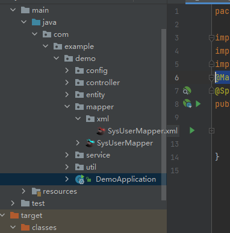
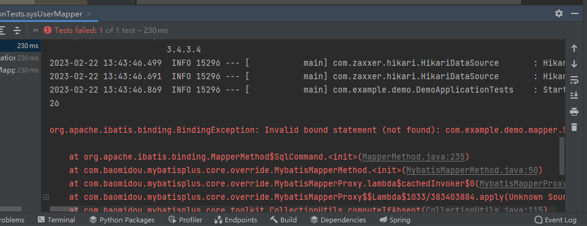
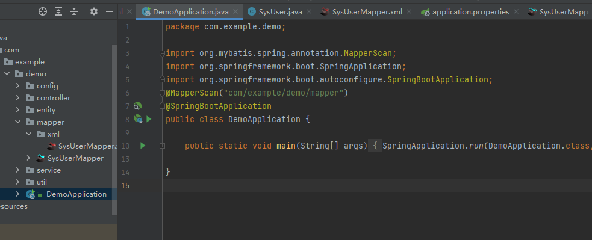
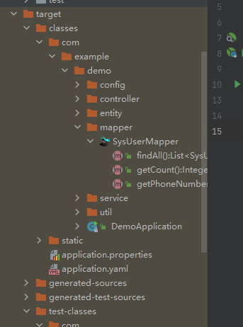
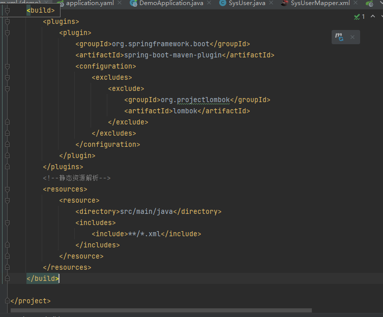
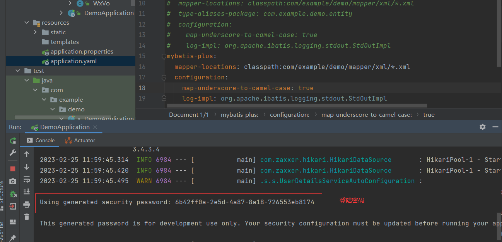
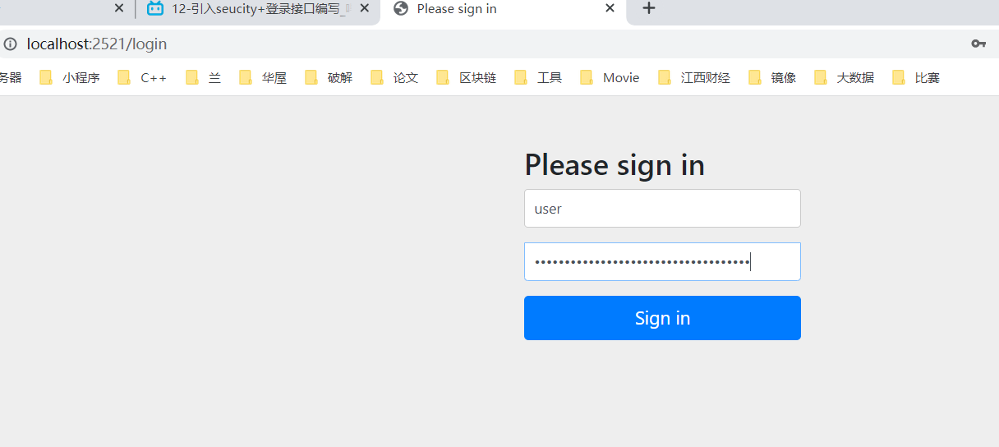
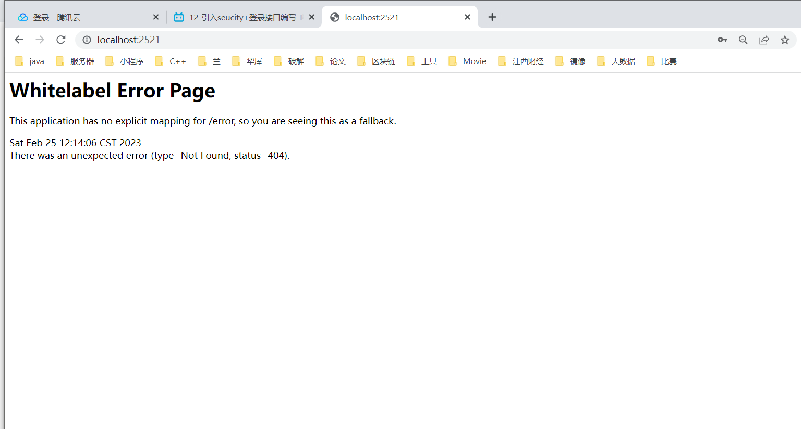
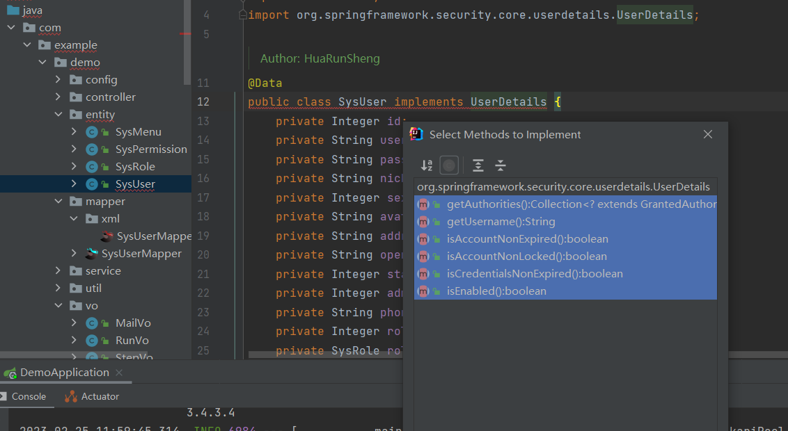
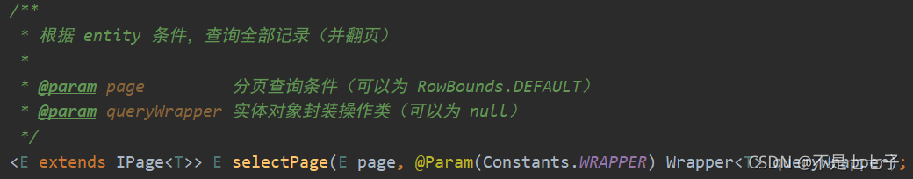

# idea快捷操作

## 1.显示子父类关系

Ctrl+H


## 2.项目中查找类

shift+shift


## 3.Debug

#### 4.网页模板

IntelliJ IEDA->preferences ( win上file->settings)，找到File and Code Templates


点击 + 号新建一个模板名称为Name:VueHEML, Extension扩展名为html，copy模板代码，点击OK
新建一个刚刚定义的模板


然后就可以了


## 5.自动在文件头添加项目信息

```java
/**
 * @description: 
 * @author: HuaRunSheng
 * @date: ${DATE} ${TIME}
 */
```


## 6.热更新

https://www.jb51.net/article/185288.htm

添加依赖:

```xml
		<dependency>
			<groupId>org.springframework.boot</groupId>
			<artifactId>spring-boot-devtools</artifactId>
			<optional>true</optional>
		</dependency>
```

添加插件:

```xml
		<plugin>
			<groupId>org.springframework.boot</groupId>
			<artifactId>spring-boot-maven-plugin</artifactId>
			<configuration>
				<fork>true</fork>
			</configuration>
		</plugin>
```

3.在IDEA中打开 File → Settings，将 Compiler 中的 Build project automatically 勾选，点击 Apply。


4.修改静态文件后,按Ctrl+F9即可

# SpringBoot2学习

## **一基础入门**

### **01.课程介绍**

1.SpringBoot2核心技术

2.SpringBoot2响应式编程

3.环境要求

- Java8及以上
- Maven 3.3及以上

4.学习资料

- [Spring Boot官网](https://spring.io/projects/spring-boot)
- [Spring Boot官方文档](https://docs.spring.io/spring-boot/docs/)
- [本课程文档地址](https://www.yuque.com/atguigu/springboot)
- [视频地址1](http://www.gulixueyuan.com/)、[视频地址2](https://www.bilibili.com/video/BV19K4y1L7MT?p=1)
- [源码地址](https://gitee.com/leifengyang/springboot2)

### **02.Spring生态圈**

覆盖了：

- web开发
- 数据访问
- 安全控制
- 分布式
- 消息服务
- 移动开发
- 批处理
- …

基于Java8的一些新特性，如：接口默认实现。重新设计源码架构。

### **03.为什么要用SpringBoot**

Spring Boot makes it easy to create stand-alone, production-grade Spring based Applications that you can “just run”.[link](https://spring.io/projects/spring-boot)

能快速创建出生产级别的Spring应用。

#### **优点:**

- Create stand-alone Spring applications
  - 创建独立Spring应用
- Embed Tomcat, Jetty or Undertow directly (no need to deploy WAR files)
  - 内嵌web服务器
- Provide opinionated ‘starter’ dependencies to simplify your build configuration
  - 自动starter依赖，简化构建配置
- Automatically configure Spring and 3rd party libraries whenever possible
  - 自动配置Spring以及第三方功能
- Provide production-ready features such as metrics, health checks, and externalized configuration
  - 提供生产级别的监控、健康检查及外部化配置
- Absolutely no code generation and no requirement for XML configuration
  - 无代码生成、无需编写XML
- SpringBoot是整合Spring技术栈的一站式框架
- SpringBoot是简化Spring技术栈的快速开发脚手架

#### 缺点

- 人称版本帝，迭代快，需要时刻关注变化
- 封装太深，内部原理复杂，不容易精通

### **04.SpringBoot的大时代背景**

#### **--微服务**

- 微服务是一种架构风格
- 一个应用拆分为一组小型服务
- 每个服务运行在自己的进程内，也就是可独立部署和升级
- 服务之间使用轻量级HTTP交互
- 服务围绕业务功能拆分
- 可以由全自动部署机制独立部署
- 去中心化，服务自治。服务可以使用不同的语言、不同的存储技术

#### **--分布式**

##### **分布式的困难**

- 远程调用
- 服务发现
- 负载均衡
- 服务容错
- 配置管理
- 服务监控
- 链路追踪
- 日志管理
- 任务调度
- …

##### 分布式的解决

- SpringBoot + SpringCloud

### **04、基础入门-SpringBoot官方文档架构**

- [Spring Boot官网](https://spring.io/projects/spring-boot)
- [Spring Boot官方文档](https://docs.spring.io/spring-boot/docs/)

https://docs.spring.io/spring-boot/docs/current/reference/html/application-properties.html#application-properties.cache

### **05.HelloSpringBoot项目**

#### 1.新建一个Maven基本工程

#### 2.引入SpringBoot依赖

```xml
<parent>
        <groupId>org.springframework.boot</groupId>
        <artifactId>spring-boot-starter-parent</artifactId>
        <version>2.3.4.RELEASE</version>
    </parent>


    <dependencies>
        <dependency>
            <groupId>org.springframework.boot</groupId>
            <artifactId>spring-boot-starter-web</artifactId>
        </dependency>

    </dependencies>
```

#### 3.创建主程序

```java
/**
 * 主程序类
 * @SpringBootApplication：这是一个SpringBoot应用
 */
@SpringBootApplication
public class MainApplication {

    public static void main(String[] args) {
        SpringApplication.run(MainApplication.class,args);
    }
}
```

4.编写业务代码

```java
@RestController
public class HelloController {


    @RequestMapping("/hello")
    public String handle01(){
        return "Hello, Spring Boot 2!";
    }
}
```

#### 5.测试

直接运行main方法


#### 6.简化配置

所有配置均在application.properties中配置

参考官方配置文档:https://docs.spring.io/spring-boot/docs/current/reference/html/application-properties.html#application-properties.cache

#### 7.简化部署

首先加入依赖

```xml
 <build>
        <plugins>
            <plugin>
                <groupId>org.springframework.boot</groupId>
                <artifactId>spring-boot-maven-plugin</artifactId>
            </plugin>
        </plugins>
    </build>
```

将项目打包成jar包,先清除,再打包


打包完成后再命令提示符窗口中运行(先把idea运行关闭):


完成:


### 06.**了解自动配置**

#### 06.1.依赖管理

##### a.父项目做依赖管理

```xml
依赖管理    
<parent>
        <groupId>org.springframework.boot</groupId>
        <artifactId>spring-boot-starter-parent</artifactId>
        <version>2.3.4.RELEASE</version>
</parent>

他的父项目
 <parent>
    <groupId>org.springframework.boot</groupId>
    <artifactId>spring-boot-dependencies</artifactId>
    <version>2.3.4.RELEASE</version>
  </parent>

几乎声明了所有开发中常用的依赖的版本号,自动版本仲裁机制
```

##### b.开发导入starter场景启动器

```xml
1、见到很多 spring-boot-starter-* ： *就某种场景
2、只要引入starter，这个场景的所有常规需要的依赖我们都自动引入
3、SpringBoot所有支持的场景
https://docs.spring.io/spring-boot/docs/current/reference/html/using-spring-boot.html#using-boot-starter
4、见到的  *-spring-boot-starter： 第三方为我们提供的简化开发的场景启动器。
5、所有场景启动器最底层的依赖
<dependency>
  <groupId>org.springframework.boot</groupId>
  <artifactId>spring-boot-starter</artifactId>
  <version>2.3.4.RELEASE</version>
  <scope>compile</scope>
</dependency>
```

##### c.无需关注版本号,自动版本仲裁

```xml
1、引入依赖默认都可以不写版本
2、引入非版本仲裁的jar，要写版本号。
```

##### d.也可以使用自己需要的版本

```xml
1、查看spring-boot-dependencies里面规定当前依赖的版本 用的 key。
2、在当前项目里面重写配置
    <properties>
        <mysql.version>5.1.43</mysql.version>
    </properties>
```

如需要改java的版本时,先在父配置中找到java.version


然后在pom文件中,写入自己需要的版本即可


#### 06.2 自动配置

##### a.web场景启动器中已经自动配置好了tomcat


```xml
<dependency>
      <groupId>org.springframework.boot</groupId>
      <artifactId>spring-boot-starter-tomcat</artifactId>
      <version>2.3.4.RELEASE</version>
      <scope>compile</scope>
    </dependency>
```

##### b.自动配置好SpringMVC

引入SpringMVC全套组件

自动配好SpringMVC常用组件(视图解析器,Mapping适配器,乱码拦截器,AOP切入......)

##### c.默认的包结构

主程序所在包及其下面的所有子包里面的组件都会被默认扫描出来

省略了扫描包配置

也可以自己设置扫描包的路径

如:当文件在主程序之外,将不被扫描,因为自动配置默认扫描主程序所在包,及boot包


如果想要在主程序以外被扫描,则需加入

```
@SpringBootApplication(scanBasePackages = "com.hrs")
```


此时,exception类被扫描到


或者也可以这样

```xml
@SpringBootApplication
等同于
@SpringBootConfiguration
@EnableAutoConfiguration
@ComponentScan("com.atguigu.boot")
```

##### d.所有配置都有默认值

有需求也可以在application.properties中更改

##### e.按需加载所有自动配置项

​			非常多的starter
​			引入了哪些场景这个场景的自动配置才会开启
​			SpringBoot所有的自动配置功能都在 spring-boot-autoconfigure 包里面

### **07.容器-**

#### 07.1.@Configuration

##### 1.作用

```
/**配置类本身也是一个组件
 * 配置类里面用Bean标注在方法上,给容器注册组件,默认是单例
 */
@Configuration()//告诉SpringBoot这是一个配置类 也就是配置文件
```

##### 2.Full模式和Lite模式

proxyBeanMethods = true为Full模式,表示MyConfig代理文件调用方法时,先搜索容器中有没有,有就用容器里的组件,没有就调用方法.

proxyBeanMethods = false为Lite模式,表示Myconfig代理文件调用方法时,直接调用方法.

默认是Full模式

适用场景

​	Lite模式适用于配置类组件之间无依赖关系,可以减少判断,加速容器启动

​	Full模式适用于配置类之间有依赖关系

```java
@SpringBootApplication(scanBasePackages = "com.hrs")
public class MainApplication {
    public static void main(String[] args){
        //返回IOC容器:主程序,参数
        ConfigurableApplicationContext run = SpringApplication.run(MainApplication.class, args);
        //2.查看容器里面的组件
        String[] name=run.getBeanDefinitionNames();
        for (String s : name) {
            System.out.println(s);
        }
        //3.从容器中获取组件
        Person person = run.getBean("person", Person.class);
        Pet pet = run.getBean("旺财", Pet.class);
        System.out.println(person);
        System.out.println(pet);

        //MyConfig本事也是个组件,增强代理组件
        MyConfig myConfig = run.getBean("myConfig", MyConfig.class);
        System.out.println(myConfig);
        //它有一个默认属性proxyBeanMethods = true,有了这个属性,代理对象调用方法时.
        // SpringBoot总会检查容器中有没有注册方法,如果注册了,则从容器中取(单实例),
        // 如果没有或者值为false不用代理,则会执行方法,每次返回的对象都不一样
        Person person1 = myConfig.person();
        System.out.println(person1 == person);

    }
}

/**配置类本身也是一个组件
 * 配置类里面用Bean标注在方法上,给容器注册组件,默认是单例
 */
@Configuration()//告诉SpringBoot这是一个配置类 也就是配置文件
//@Configuration(proxyBeanMethods = true):即优先从容器中找组件
public class MyConfig {
    @Bean//给容器中添加组件,以方法名作为组件的id,返回类型就是组件类型,返回的值就是组件在容器的实例
    public Person person(){
        return new Person("tom", pet());
        //如果proxyBeanMethods = true则代表Person组件依赖了pet()组件,从容器中获取pet()
        //如果proxyBeanMethods = false则代表跳过从容器中查找pet()直接调用pet()方法
    }
    @Bean("旺财")//也可以设置组件id,不建议设置中文
    public Pet pet(){
        return new Pet("旺财");
    }
}

```

#### 07.2.@Import导入组件

有时需要在类中引入其它类中的组件,写在@Configration,@Component、@Controller、@Service、@Repositoryde的上面,然后就可以在类中使用导入的外部组件.

@Import({Person.class, DBHelper.class})//给容器中自动创建出这两个类型的组件、默认组件的名字就是全类名
		@Configuration()

```java
        String[] beanNamesForType = run.getBeanNamesForType(Person.class);
        for (String s : beanNamesForType) {
            System.out.println(s);
        }

结果:
com.hrs.boot.pojo.Person
person1
```

#### 07.3.@Conditional条件装配

**条件装配：满足Conditional指定的条件，则进行组件注入**


@ConditionalOnBean(name="tom"):表示有tom这个bean就装配,没有就不装配

@ConditionalOnMissingBean(name="tom"):与上相反,没有才装配

**作用范围(需配合@Bean使用):**

​	作用在类上,则表示满足条件,这个类中的方法才装配

​	作用在方法上:满足条件,这个方法才装配

举例说明

```java
@Configuration(proxyBeanMethods = false)
@ConditionalOnMissingBean(name = "tom")//没有tom名字的Bean时，MyConfig类的Bean才能生效。
public class MyConfig {

    @Bean
    public User user01(){
        User zhangsan = new User("zhangsan", 18);
        zhangsan.setPet(tomcatPet());
        return zhangsan;
    }

    @Bean("tom22")
    public Pet tomcatPet(){
        return new Pet("tomcat");
    }
}

public static void main(String[] args) {
    //1、返回我们IOC容器
    ConfigurableApplicationContext run = SpringApplication.run(MainApplication.class, args);

    //2、查看容器里面的组件
    String[] names = run.getBeanDefinitionNames();
    for (String name : names) {
        System.out.println(name);
    }

    boolean tom = run.containsBean("tom");
    System.out.println("容器中Tom组件："+tom);//false

    boolean user01 = run.containsBean("user01");
    System.out.println("容器中user01组件："+user01);//true

    boolean tom22 = run.containsBean("tom22");
    System.out.println("容器中tom22组件："+tom22);//true

}

```

#### 07.4.@ImportResource()

**作用:导入配置文件,引入用xml方式注册的容器**


使用:@ImportResource("classpath:beans.xml")

```java
@Configuration()
@ImportResource("classpath:beans.xml")
public class MyConfig {
    @Bean
    public Person person1(){
        return new Person("tom", pet());

    }
    @Bean("旺财")
    public Pet pet(){
        return new Pet("旺财");
    }
}

@SpringBootApplication(scanBasePackages = "com.hrs")
public class MainApplication {
    public static void main(String[] args){
        //返回IOC容器:主程序,参数
        ConfigurableApplicationContext run = SpringApplication.run(MainApplication.class, args);
        Person hello = run.getBean("hello", Person.class);
        System.out.println(hello);

    }
}


```

##### 07.05.@ConfigurationProperties()

作用:引入application.properties配置资源,注入bean时才有用

方式一:@ConfigurationProperties + @Component  直接注入

```java
@Component
@ConfigurationProperties(prefix = "mycar")
@Data
@AllArgsConstructor
@NoArgsConstructor
public class Car {
    private String brand;
    private Integer price;
}

application.properties文件
    mycar.brand=BYD
	mycar.price=1000
```

注入bean时,brand,price会去application.properties文件中找到对应的值

方式二:@EnableConfigurationProperties + @ConfigurationProperties

```java
@ConfigurationProperties(prefix = "mycar")
@Data
@AllArgsConstructor
@NoArgsConstructor
public class Car {
    private String brand;
    private Integer price;
}

@Configuration()
@EnableConfigurationProperties(Car.class)
//开启Car配置绑定功能
//把这个Car这个组件自动注册到容器中
public class MyConfig {
    @Bean
    public Person person1(){
        return new Person("tom", pet());
    }
    @Bean("旺财")//也可以设置组件id,不建议设置中文
    public Pet pet(){
        return new Pet("旺财");
    }
}
```

#### 07.6.源码分析-@SpringBootApplication

##### 1.组成

@SpringBootApplication

由以下注解组成

```
@SpringBootConfiguration	//表示这个类是一个配置类
@EnableAutoConfiguration	//自动配置
@ComponentScan	//扫描包
```

##### 2.分析下`@EnableAutoConfiguration`

```java
@Target(ElementType.TYPE)
@Retention(RetentionPolicy.RUNTIME)
@Documented
@Inherited
@AutoConfigurationPackage
@Import(AutoConfigurationImportSelector.class)
public @interface EnableAutoConfiguration {
    String ENABLED_OVERRIDE_PROPERTY = "spring.boot.enableautoconfiguration";

    Class<?>[] exclude() default {};

    String[] excludeName() default {};
}

```

重点分析`@AutoConfigurationPackage`，`@Import(AutoConfigurationImportSelector.class)`。

###### 2.1.@AutoConfigurationPackage

标签名直译为：自动配置包，指定了默认的包规则。

```java
@Target(ElementType.TYPE)
@Retention(RetentionPolicy.RUNTIME)
@Documented
@Inherited
@Import(AutoConfigurationPackages.Registrar.class)//给容器中导入一个组件
public @interface AutoConfigurationPackage {
    String[] basePackages() default {};

    Class<?>[] basePackageClasses() default {};
}

```

进入AutoConfigurationPackage

```java
    static class Registrar implements ImportBeanDefinitionRegistrar, DeterminableImports {
        Registrar() {
        }

        public void registerBeanDefinitions(AnnotationMetadata metadata, BeanDefinitionRegistry registry) {
//registry注入器
//AutoConfigurationPackages.PackageImports(metadata)).getPackageNames() 
            //主程序所在包,即遍历整个包,全部注入
            AutoConfigurationPackages.register(registry, (String[])(new AutoConfigurationPackages.PackageImports(metadata)).getPackageNames().toArray(new String[0]));
        }

        public Set<Object> determineImports(AnnotationMetadata metadata) {
            return Collections.singleton(new AutoConfigurationPackages.PackageImports(metadata));
        }
    }
```

###### 2.2@Import(AutoConfigurationImportSelector.class)

1. 利用`getAutoConfigurationEntry(annotationMetadata);`给容器中批量导入一些组件

2. 调用`List<String> configurations = getCandidateConfigurations(annotationMetadata, attributes)`获取到所有需要导入到容器中的配置类

3. 利用工厂加载 `Map<String, List<String>> loadSpringFactories(@Nullable ClassLoader classLoader);`得到所有的组件

4. 从

   ```
   META-INF/spring.factories
   ```

   位置来加载一个文件。

   - 默认扫描我们当前系统里面所有`META-INF/spring.factories`位置的文件
   - `spring-boot-autoconfigure-2.3.4.RELEASE.jar`包里面也有`META-INF/spring.factories`


```java
# 文件里面写死了spring-boot一启动就要给容器中加载的所有配置类
# spring-boot-autoconfigure-2.3.4.RELEASE.jar/META-INF/spring.factories
# Auto Configure
org.springframework.boot.autoconfigure.EnableAutoConfiguration=\
org.springframework.boot.autoconfigure.admin.SpringApplicationAdminJmxAutoConfiguration,\
org.springframework.boot.autoconfigure.aop.AopAutoConfiguration,\
...
```

虽然我们127个场景的所有自动配置启动的时候默认全部加载，但是`xxxxAutoConfiguration`按照条件装配规则（`@Conditional`），最终会按需配置。

#### 07.7 自动化配置流程

以`DispatcherServletAutoConfiguration`的内部类`DispatcherServletConfiguration`为例子:

```java
@Bean
@ConditionalOnBean(MultipartResolver.class)  //容器中有这个类型组件
@ConditionalOnMissingBean(name = DispatcherServlet.MULTIPART_RESOLVER_BEAN_NAME) //容器中没有这个名字 multipartResolver 的组件
public MultipartResolver multipartResolver(MultipartResolver resolver) {
	//给@Bean标注的方法传入了对象参数，这个参数的值就会从容器中找。
	//SpringMVC multipartResolver。防止有些用户配置的文件上传解析器不符合规范
	// Detect if the user has created a MultipartResolver but named it incorrectly
	return resolver;//给容器中加入了文件上传解析器；
}

```

就是用户自己配了,就用用户的,每配置就用默认的

SpringBoot默认会在底层配好所有的组件，但是**如果用户自己配置了以用户的优先**。

**总结**：

- SpringBoot先加载所有的自动配置类 xxxxxAutoConfiguration
- 每个自动配置类按照条件进行生效，默认都会绑定配置文件指定的值。（xxxxProperties里面读取，xxxProperties和配置文件进行了绑定）
- 生效的配置类就会给容器中装配很多组件
- 只要容器中有这些组件，相当于这些功能就有了
- 定制化配置
  - 用户直接自己@Bean替换底层的组件
  - 用户去看这个组件是获取的配置文件什么值就去修改。(看官方文档,或自己看底层源码都可以)

**xxxxxAutoConfiguration —> 组件 —> xxxxProperties里面拿值 ----> application.properties**

#### 07.8最佳实践-更改banner图


##### 1.引入场景依赖

https://docs.spring.io/spring-boot/docs/current/reference/html/using.html#using.build-systems.starters

##### 2.查看自动配置了哪些（选做）

- 自己分析，引入场景对应的自动配置一般都生效了
- 配置文件中debug=true开启自动配置报告。
  - Negative（不生效）
  - Positive（生效）

##### 3.是否需要修改

- 参照文档修改配置项
  - [官方文档](https://docs.spring.io/spring-boot/docs/current/reference/html/appendix-application-properties.html#common-application-properties)
  - 自己分析。xxxxProperties绑定了配置文件的哪些。
- 自定义加入或者替换组件
  - @Bean、@Component…
- 自定义器 XXXXXCustomizer；
- …

##### 这里以banner为例

更改banner中的image不过现在只能是是txt格式的,不然显示不出来


#### 07.9.半热加载

```java
 <dependency>
        <groupId>org.springframework.boot</groupId>
        <artifactId>spring-boot-devtools</artifactId>
        <optional>true</optional>
    </dependency>
```

在IDEA中，项目或者页面修改以后：Ctrl+F9。或rebuild

## 二 配置文件

### **01.YAML的使用**

#### 01.1基本语法

- key: value；kv之间有空格
- 大小写敏感
- 使用缩进表示层级关系
- 缩进不允许使用tab，只允许空格
- 缩进的空格数不重要，只要相同层级的元素左对齐即可
- '#'表示注释
- 字符串无需加引号，如果要加，单引号’’、双引号""表示字符串内容会被 转义、不转义

#### **01.2 数据类型**

字面量：单个的、不可再分的值。date、boolean、string、number、null

k: v

对象：键值对的集合。map、hash、set、object

```yaml
#行内写法：  

k: {k1:v1,k2:v2,k3:v3}

#或

k: 
  k1: v1
  k2: v2
  k3: v3

```

数组：一组按次序排列的值。array、list、queue

```yaml
#行内写法：  

k: [v1,v2,v3]

#或者

k:
 - v1
 - v2
 - v3

```

#### 01.3 实例

```java
@Data
public class Person {
    private String userName;
    private Boolean boss;
    private Date birth;
    private Integer age;
    private Pet pet;
    private String[] interests;
    private List<String> animal;
    private Map<String, Object> score;
    private Set<Double> salarys;
    private Map<String, List<Pet>> allPets;
}

@Data
public class Pet {
    private String name;
    private Double weight;
}
```

用yaml表示以上对象:

```yaml
person:
#  单引号会将 \n作为字符串输出   双引号会将\n 作为换行输出
#  双引号不会转义，单引号会转义

#  String userName;
  user-name: zhangsan

#  Boolean boss;
  boss: true

#  Date birth; 默认时间格式是/
  birth: 2019/12/9

#  Integer age;
  age: 18

#  String[] interests;
#  数组表示方式一
#  interests: [篮球,足球]
#  方式二
  interests:
    - 篮球
    - 足球
    - 18
#  List<String> animal; 集合列表和数组一样,表示方式有两种
  animal: [阿猫,阿狗]

#  Map<String, Object> score;Map表示方式也有两种
#  方式一:
#  score:
#    english: 80
#    math: 90
#  方式二:{english:80,math:90}是json数据,所以可以不用空格
  score: {english:80,math:90}
  salarys:
    - 9999.98
    - 9999.99

#  Pet pet; 引用对象
  pet:
    name: 阿狗
    weight: 99.99

# Map<String, List<Pet>> allPets; 复杂的引用对象
  allPets:
#    首先是String
    sick:
#      然后是List
      - {name: 阿狗,weight: 99.99}
      - name: 阿猫
        weight: 88.88
      - name: 阿虫
        weight: 77.77
    health:
      - {name: 阿花,weight: 199.99}
      - {name: 阿明,weight: 199.99}
```

结果:

### **02.自定义类绑定的配置提示**


You can easily generate your own configuration metadata file from items annotated with `@ConfigurationProperties` by using the `spring-boot-configuration-processor` jar. The jar includes a Java annotation processor which is invoked as your project is compiled.——[link](https://docs.spring.io/spring-boot/docs/2.4.2/reference/htmlsingle/#configuration-metadata-annotation-processor)

自定义的类和配置文件绑定一般没有提示。若要提示，添加如下依赖：

```xml
<dependency>
    <groupId>org.springframework.boot</groupId>
    <artifactId>spring-boot-configuration-processor</artifactId>
    <optional>true</optional>
</dependency>


<build>
    <plugins>
        <plugin>
            <groupId>org.springframework.boot</groupId>
            <artifactId>spring-boot-maven-plugin</artifactId>
            <configuration>
                <excludes>
                    <!-- 下面插件作用是工程打包时，不将spring-boot-configuration-processor打进包内，让其只在编码的时候有用 -->
                    <exclude>
                        <groupId>org.springframework.boot</groupId>
                        <artifactId>spring-boot-configuration-processor</artifactId>
                    </exclude>
                </excludes>
            </configuration>
        </plugin>
    </plugins>
</build>

```

### 03.静态资源配置规则

#### 03.1静态资源默认目录


默认这几个目录文件下的资源可以直接http://localhost:8080/4.jpg访问,4.jpg是资源名字

只要静态资源放在类路径下： called `/static` (or `/public` or `/resources` or `/META-INF/resources`

访问 ： 当前项目根路径/ + 静态资源名

原理： 静态映射/**。

请求进来，先去找Controller看能不能处理。不能处理的所有请求又都交给静态资源处理器。静态资源也找不到则响应404页面。

#### 03.2 修改

改变默认的静态资源路径

改变后,会导致`/static`，`/public`,`/resources`, `/META-INF/resources`失效

```yml
resources:
  static-locations: [classpath:/haha/]
# 可以是数组,
```

为防止Controller层与静态资源冲突,可以给静态资源加上访问前缀

路径:当前项目 + static-path-pattern + 静态资源名 = 静态资源文件夹下找

```yml
spring:
  mvc:
    static-path-pattern: /res/**

```

如,当访问public下的2.jpg时,地址为http://localhost:8080/res/4.jpg

#### 03.3 导入webjar

作用:用jar方式添加css，js等资源文件，

依赖地址:https://www.webjars.org/

例如,添加jquery

```xml
<dependency>
    <groupId>org.webjars</groupId>
    <artifactId>jquery</artifactId>
    <version>3.5.1</version>
</dependency>
```


访问地址:当前项目 +  静态资源名(不受前缀影响)

[http://localhost:8080/webjars/**jquery/3.5.1/jquery.js**](http://localhost:8080/webjars/jquery/3.5.1/jquery.js) 后面地址要按照依赖里面的包路径。

### **04.webcome页与favicon图标**

#### 1.欢迎页

静态资源路径下 index.html。

- 可以配置静态资源路径
- 但是不可以配置静态资源的访问前缀。否则导致 index.html不能被默认访问

- controller能处理/index。

#### 2.自定义Favicon

指网页标签上的小图标。

favicon.ico 放在静态资源目录下即可。

### 05.源码分析-静态资源原理


SpringBoot启动默认加载 xxxAutoConfiguration 类（自动配置类）

找到相关的配置,如SpringMVC这里也叫WebMVC


#### 1.首先进入WebMVC配置类

```java
@ConditionalOnClass({Servlet.class, DispatcherServlet.class, WebMvcConfigurer.class})
@ConditionalOnMissingBean({WebMvcConfigurationSupport.class})
@AutoConfigureOrder(-2147483638)
@AutoConfigureAfter({DispatcherServletAutoConfiguration.class, TaskExecutionAutoConfiguration.class, ValidationAutoConfiguration.class})
public class WebMvcAutoConfiguration {
...
}
```

#### 2.进入适配器

配置文件的相关属性的绑定：WebMvcProperties==**spring.mvc**、ResourceProperties==**spring.resources**

```java
@Configuration(proxyBeanMethods = false)
    @Import({WebMvcAutoConfiguration.EnableWebMvcConfiguration.class})
    @EnableConfigurationProperties({WebMvcProperties.class, ResourceProperties.class})
    @Order(0)
    public static class WebMvcAutoConfigurationAdapter implements WebMvcConfigurer {
    ......
    }
```

其构造器,及对应配置

```java
        public WebMvcAutoConfigurationAdapter(ResourceProperties resourceProperties, WebMvcProperties mvcProperties, ListableBeanFactory beanFactory, ObjectProvider<HttpMessageConverters> messageConvertersProvider, ObjectProvider<WebMvcAutoConfiguration.ResourceHandlerRegistrationCustomizer> resourceHandlerRegistrationCustomizerProvider, ObjectProvider<DispatcherServletPath> dispatcherServletPath, ObjectProvider<ServletRegistrationBean<?>> servletRegistrations) {
            this.resourceProperties = resourceProperties;
            this.mvcProperties = mvcProperties;
            this.beanFactory = beanFactory;
            this.messageConvertersProvider = messageConvertersProvider;
            this.resourceHandlerRegistrationCustomizer = (WebMvcAutoConfiguration.ResourceHandlerRegistrationCustomizer)resourceHandlerRegistrationCustomizerProvider.getIfAvailable();
            this.dispatcherServletPath = dispatcherServletPath;
            this.servletRegistrations = servletRegistrations;
        }
```

- ResourceProperties resourceProperties；获取和spring.resources绑定的所有的值的对象
- WebMvcProperties mvcProperties 获取和spring.mvc绑定的所有的值的对象
- ListableBeanFactory beanFactory Spring的beanFactory
- HttpMessageConverters 找到所有的HttpMessageConverters
- ResourceHandlerRegistrationCustomizer 找到 资源处理器的自定义器。
- DispatcherServletPath
- ServletRegistrationBean 给应用注册Servlet、Filter…

#### 3.资源处理默认规则

```java
...
public class WebMvcAutoConfiguration {
    ...
	public static class EnableWebMvcConfiguration extends DelegatingWebMvcConfiguration implements ResourceLoaderAware {
        ...
		@Override
		protected void addResourceHandlers(ResourceHandlerRegistry registry) {
			super.addResourceHandlers(registry);
			if (!this.resourceProperties.isAddMappings()) {
				logger.debug("Default resource handling disabled");
				return;
			}
			ServletContext servletContext = getServletContext();
			addResourceHandler(registry, "/webjars/**", "classpath:/META-INF/resources/webjars/");
			addResourceHandler(registry, this.mvcProperties.getStaticPathPattern(), (registration) -> {
				registration.addResourceLocations(this.resourceProperties.getStaticLocations());
				if (servletContext != null) {
					registration.addResourceLocations(new ServletContextResource(servletContext, SERVLET_LOCATION));
				}
			});
		}
        ...
        
    }
    ...
}

@ConfigurationProperties(prefix = "spring.resources", ignoreUnknownFields = false)
public class ResourceProperties {

    private static final String[] CLASSPATH_RESOURCE_LOCATIONS = { "classpath:/META-INF/resources/",
            "classpath:/resources/", "classpath:/static/", "classpath:/public/" };

    /**
     * Locations of static resources. Defaults to classpath:[/META-INF/resources/,
     * /resources/, /static/, /public/].
     */
    private String[] staticLocations = CLASSPATH_RESOURCE_LOCATIONS;
    ...
}


```

根据上述代码，我们可以同过配置禁止所有静态资源规则。

```yaml
spring:
  resources:
    add-mappings: false   #禁用所有静态资源规则

```

## 三 Web开发

### 06.请求处理-【源码分析】-Rest映射及源码解析

#### 1.请求映射

- @xxxMapping;
  - @GetMapping
  - @PostMapping
  - @PutMapping
  - @DeleteMapping

- Rest风格支持（使用**HTTP**请求方式动词来表示对资源的操作）
  - 以前：
    - /getUser 获取用户
    - /deleteUser 删除用户
    - /editUser 修改用户
    - /saveUser保存用户
  - 现在： /user
    - GET-获取用户
    - DELETE-删除用户
    - PUT-修改用户
    - POST-保存用户
  - 核心Filter；HiddenHttpMethodFilter
- **用法**
  - 开启页面表单的Rest功能
  - 页面 form的属性method=post，隐藏域 _method=put、delete等（如果直接get或post，无需隐藏域）
  - 编写请求映射

```yaml
spring:
  mvc:
    hiddenmethod:
      filter:
        enabled: true   #开启页面表单的Rest功能

```

```html
<form action="/user" method="get">
    <input value="REST-GET提交" type="submit" />
</form>

<form action="/user" method="post">
    <input value="REST-POST提交" type="submit" />
</form>

<form action="/user" method="post">
    <input name="_method" type="hidden" value="DELETE"/>
    <input value="REST-DELETE 提交" type="submit"/>
</form>

<form action="/user" method="post">
    <input name="_method" type="hidden" value="PUT" />
    <input value="REST-PUT提交"type="submit" />
<form>

```

```java
@GetMapping("/user")
//@RequestMapping(value = "/user",method = RequestMethod.GET)
public String getUser(){
    return "GET-张三";
}

@PostMapping("/user")
//@RequestMapping(value = "/user",method = RequestMethod.POST)
public String saveUser(){
    return "POST-张三";
}

@PutMapping("/user")
//@RequestMapping(value = "/user",method = RequestMethod.PUT)
public String putUser(){
    return "PUT-张三";
}

@DeleteMapping("/user")
//@RequestMapping(value = "/user",method = RequestMethod.DELETE)
public String deleteUser(){
    return "DELETE-张三";
}

```

- Rest原理（表单提交要使用REST的时候）
  - 表单提交会带上`\_method=PUT`
  - 请求过来被HiddenHttpMethodFilter拦截
    - 请求是否正常，并且是POST
      - 获取到`\_method`的值。
      - 兼容以下请求；**PUT**.**DELETE**.**PATCH**
      - **原生request（post），包装模式requesWrapper重写了getMethod方法，返回的是传入的值。**
      - **过滤器链放行的时候用wrapper。以后的方法调用getMethod是调用requesWrapper的。**

```java
public class HiddenHttpMethodFilter extends OncePerRequestFilter {

	private static final List<String> ALLOWED_METHODS =
			Collections.unmodifiableList(Arrays.asList(HttpMethod.PUT.name(),
					HttpMethod.DELETE.name(), HttpMethod.PATCH.name()));

	/** Default method parameter: {@code _method}. */
	public static final String DEFAULT_METHOD_PARAM = "_method";

	private String methodParam = DEFAULT_METHOD_PARAM;


	/**
	 * Set the parameter name to look for HTTP methods.
	 * @see #DEFAULT_METHOD_PARAM
	 */
	public void setMethodParam(String methodParam) {
		Assert.hasText(methodParam, "'methodParam' must not be empty");
		this.methodParam = methodParam;
	}

	@Override
	protected void doFilterInternal(HttpServletRequest request, HttpServletResponse response, FilterChain filterChain)
			throws ServletException, IOException {

		HttpServletRequest requestToUse = request;

		if ("POST".equals(request.getMethod()) && request.getAttribute(WebUtils.ERROR_EXCEPTION_ATTRIBUTE) == null) {
			String paramValue = request.getParameter(this.methodParam);
			if (StringUtils.hasLength(paramValue)) {
				String method = paramValue.toUpperCase(Locale.ENGLISH);
				if (ALLOWED_METHODS.contains(method)) {
					requestToUse = new HttpMethodRequestWrapper(request, method);
				}
			}
		}

		filterChain.doFilter(requestToUse, response);
	}


	/**
	 * Simple {@link HttpServletRequest} wrapper that returns the supplied method for
	 * {@link HttpServletRequest#getMethod()}.
	 */
	private static class HttpMethodRequestWrapper extends HttpServletRequestWrapper {

		private final String method;

		public HttpMethodRequestWrapper(HttpServletRequest request, String method) {
			super(request);
			this.method = method;
		}

		@Override
		public String getMethod() {
			return this.method;
		}
	}

}

```

- Rest使用客户端工具。
  - 如PostMan可直接发送put、delete等方式请求。

### 07.修改默认的_method

#### 首先,源码分析:

```java
WebMvcAutoConfiguration:
    @Bean
//HiddenHttpMethodFilter.class没有这个自定义这个bean时才生效
    @ConditionalOnMissingBean({HiddenHttpMethodFilter.class})
    @ConditionalOnProperty(
        prefix = "spring.mvc.hiddenmethod.filter",
        name = {"enabled"},
        matchIfMissing = false
    )
    public OrderedHiddenHttpMethodFilter hiddenHttpMethodFilter() {
        return new OrderedHiddenHttpMethodFilter();
    }

```

```java
public class HiddenHttpMethodFilter extends OncePerRequestFilter {    
	private String methodParam = "_method";
//而这个类可以自定义methodParam
    public void setMethodParam(String methodParam) {
        Assert.hasText(methodParam, "'methodParam' must not be empty");
        this.methodParam = methodParam;
    }
}
```

#### 2,自定义HiddenHttpMethodFilter

新建一个web配置类,然后将HiddenHttpMethodFilter注册到容器中

```java
@Configuration(proxyBeanMethods = false)
public class WebConfig {
    
    //自定义filter
    @Bean
    public HiddenHttpMethodFilter hiddenHttpMethodFilter(){
        HiddenHttpMethodFilter methodFilter = new HiddenHttpMethodFilter();
        methodFilter.setMethodParam("_m");
        return methodFilter;
    }

}
```

再修改对应得网页代码

```html
<form action="/user" method="post">
    <input name="_m" type="hidden" value="DELETE"/>
    <input value="REST-DELETE 提交" type="submit"/>
</form>

```

### **08.请求映射原理**

#### 1.首先,找到DispatchServlet,查看其父子关系(Ctrl+H)


#### 2.SpringMVC功能分析

从 `org.springframework.web.servlet.DispatcherServlet` -> `doDispatch()`

```java
protected void doDispatch(HttpServletRequest request, HttpServletResponse response) throws Exception {
    HttpServletRequest processedRequest = request;
    HandlerExecutionChain mappedHandler = null;
    boolean multipartRequestParsed = false;

    WebAsyncManager asyncManager = WebAsyncUtils.getAsyncManager(request);

    try {
        ModelAndView mv = null;
        Exception dispatchException = null;

        try {
            processedRequest = checkMultipart(request);
            multipartRequestParsed = (processedRequest != request);

            // 找到当前请求使用哪个Handler（Controller的方法）处理
            mappedHandler = getHandler(processedRequest);

            //HandlerMapping：处理器映射。/xxx->>xxxx
    ...
}

```

**debug模式,查看getHandler参数**

`getHandler()`方法如下

```java
@Nullable
protected HandlerExecutionChain getHandler(HttpServletRequest request) throws Exception {
    if (this.handlerMappings != null) {
        for (HandlerMapping mapping : this.handlerMappings) {
            HandlerExecutionChain handler = mapping.getHandler(request);
            if (handler != null) {
                return handler;
            }
        }
    }
    return null;
}

```

`this.handlerMappings`在Debug模式下展现的内容：


其中，保存了所有`@RequestMapping` 和`handler`的映射规则。


### **09.访问静态资源**

https://blog.csdn.net/qq_41647999/article/details/83690696

https://blog.csdn.net/qq_41647999/article/details/83788265

#### 1.首先,添加 thymeleaf 的依赖

通过 thymeleaf 来实现页面跳转。

在pom.xml的文件中加入thymelaf的依赖文件。

```xml
<dependency>
    <groupId>org.springframework.boot</groupId>
    <artifactId>spring-boot-starter-thymeleaf</artifactId>
</dependency>
```

#### 2.配置application.yml

```yaml
  thymeleaf:
    prefix:
      classpath: /templates   # 访问template下的html文件需要配置模板，映射
    cache: false # 开发时关闭缓存,不然没法看到实时页面
```

#### 3.编写Controller代码

```java
@Controller
@RequestMapping("/page")
public class PageController {
    @RequestMapping("/toMethod")
    public String methodPage(){
        return "method.html";
    }
}
```

#### 4.访问

http://localhost:8080/page/toMethod


解释：@RestController注解表示该类中的所有方法都会返回json格式。

​      @Controller返回的是字符格式，实现页面跳转。

#### 5.注意

##### 1、 规则

在讲页面渲染之前，先了解一下静态资源 （访问js、css、图片）。一般我们在做项目都会涉及到动静分离的问题。在传统的项目里面静态资源是放在webapp下的，在SpringBoot里面没有webapp而是classpath，但classpath不是文件夹。

classpath目录名需符合如下规则：

(1)/static (2) /public (3) /resources  (4)/META-INF/resources

##### 2、 示例

我们可以在src/main/resources/目录下创建static，在该位置放一张图片，启动程序后尝试访问http://localhost:8080/图片名.jpg。若能成功显示，则配置成功。

### **10.静态资源无法加载**

如图,如果target下无法生成src下的文件,则就是加载出问题了.加载资源的时候被mvc拦截,因此要配置一下拦截器.


拦截器

```java
@Configuration
public class UsingStaticController extends WebMvcConfigurationSupport {

    public void addResourceHandlers(ResourceHandlerRegistry registry) {
// classpath表示在resource目录下，/static/** 表示在URL路径中访问如
// http://localhost:8080/static/ 即可访问到resource下的static目录
        registry.addResourceHandler("/static/**").addResourceLocations("classpath:/static/");
    }
}
```

但是,ieda中ctrl+单击并不能进入静态文件中.要运行测试.

### 11.**请求处理-常用参数注解使用**

- `@PathVariable` 路径变量
- `@RequestHeader` 获取请求头
- `@RequestParam` 获取请求参数（指问号后的参数，url?a=1&b=2）
- `@CookieValue` 获取Cookie值
- `@RequestAttribute` 获取request域属性
- `@RequestBody` 获取请求体[POST]
- `@MatrixVariable` 矩阵变量
- `@ModelAttribute`

前端html

#### 1.@PathVariable,@PathVariable和表单@RequestBody

```html
<!DOCTYPE html>
<html lang="en">
<head>
    <meta charset="UTF-8">
    <title>Title</title>
</head>
<body>
测试基本注解：
<ul>
<!--    -->
    <a href="car/3/owner/lisi">car/{id}/owner/{username}</a>
    <li>@PathVariable（路径变量）</li>
    <a href="map/3/owner/lisi">map/{id}/owner/{username}</a>
    <li>@PathVariable（路径变量）</li>
<!--    <a href="car/3/owner/lisi?age=18&inters=basketball&inters=game">car/{id}/owner/{username}</a>-->
    <a href="header/test">header/test</a>
    <li>@RequestHeader（获取请求头）</li>

    <a href="bus?price=200&color=blue&color=white">bus?price=200&color=blue&color=white</a>
    <li>@RequestParam（获取请求参数）</li>

    <a href="cookie/test">cookie/test</a>
    <li>@CookieValue（获取cookie值）</li>
</ul>
<form action="/save" method="post">
    测试@RequestBody获取数据 <br/>
    @RequestBody（获取请求体[POST]）,要使用Post接收<br/>
    用户名：<input name="userName"/> <br>
    邮箱：<input name="email"/>
    <input type="submit" value="提交"/>
</form>
</body>
</html>
```

后端:

```java
package com.hrs.boot.controller;
import com.hrs.boot.bean.Person;
import org.springframework.web.bind.annotation.*;
import javax.servlet.http.Cookie;
import javax.websocket.server.PathParam;
import java.util.HashMap;
import java.util.List;
import java.util.Map;
@RestController
public class ParameterTestController {
    /**
     * 数据绑定：页面提交的请求数据（GET、POST）都可以和对象属性进行绑定
     * @param person
     * @return
     */
    @PostMapping("/saveuser")
    public Person saveuser(Person person){

        return person;
    }

    //    @PathVariable请求路径变量:大括号括起来的是可获取的参数 id,username
    //<a href="car/3/owner/lisi">car/{id}/owner/{username}</a>
    @GetMapping("car/{id}/owner/{username}")
    public Map<String,Object> getIdName(@PathVariable("id") Integer id,
                            @PathVariable("username") String name){
        Map<String,Object> map = new HashMap<>();
        map.put("id",id);//可以单独提取出来
        map.put("name",name);
        return map;
    }
//    Map直接用@PathVariable标注即可
    @GetMapping("map/{id}/owner/{username}")
    public Map<String,Object> getIdName1(@PathVariable  Map<String,String> pv){
        Map<String,Object> map = new HashMap<>();
        map.put("pv",pv);//也可以作为map一起提取出来
        return map;
    }

//    @RequestHeader请求头参数
    @GetMapping("header/test")
    public Map<String,Object> getHeader(@RequestHeader("User-Agent") String userAgent,
                                        @RequestHeader Map<String,String> header){
        Map<String,Object> map = new HashMap<>();
        map.put("User-Agent",userAgent);//获取请求头中的其中的一个参数
        map.put("header",header);//获取整个请求头
        return map;
    }

//    @PathParam()获取请求参数,所带的参数
//    bus?price=200&color=blue&color=white
    @GetMapping("bus")
    public Map<String,Object> getBus(@RequestParam("price") Integer price,
                                     @RequestParam("color") List<String> colors,
                                     @RequestParam Map<String,List<String>> params){
        Map<String,Object> map = new HashMap<>();
        //price=200是一个整形变量啊
        map.put("price",price);
        //color=blue&color=white可以是一个数组也可以是列表
        map.put("color",colors);

        //请求参数也可以用map装配
        map.put("params",params);
        return map;
    }

//    @CookieValue("JSESSIONID")  获取cookie的值
    @GetMapping("cookie/test")
    public Map<String,Object> getCookie(@CookieValue("JSESSIONID") Cookie cookie,
                                        @CookieValue("JSESSIONID") String JSESSIONID){
        Map<String,Object> map = new HashMap<>();
        map.put("cookie",cookie);//可以同过Cookie对象获取整个cookie
        map.put("JSESSIONID",JSESSIONID);//也可以通过String来接收cookie
        return map;
    }

    //  car/2/owner/zhangsan
    @GetMapping("/bus/{id}/owner/{username}")
    public Map<String,Object> getCar(@PathVariable("id") Integer id,
                                    //
                                     @PathVariable("username") String name,
                                     @PathVariable Map<String,String> pv,

                                     @RequestHeader("User-Agent") String userAgent,
                                     @RequestHeader Map<String,String> header,

                                     @RequestParam("age") Integer age,
                                     @RequestParam("inters") List<String> inters,
                                     @RequestParam Map<String,String> params,

                                     @CookieValue("_ga") String _ga,
                                     @CookieValue("_ga") Cookie cookie){
        Map<String,Object> map = new HashMap<>();
        map.put("age",age);
        map.put("inters",inters);
        map.put("params",params);
        map.put("_ga",_ga);
        System.out.println(cookie.getName()+"===>"+cookie.getValue());
        return map;
    }


    //获取表单数据
    @PostMapping("/save")
    public Map postMethod(@RequestBody String content){
        Map<String,Object> map = new HashMap<>();
        map.put("content",content);
        return map;
    }


    //1、语法： 请求路径：/cars/sell;low=34;brand=byd,audi,yd
    //2、SpringBoot默认是禁用了矩阵变量的功能
    //      手动开启：原理。对于路径的处理。UrlPathHelper进行解析。
    //              removeSemicolonContent（移除分号内容）支持矩阵变量的
    //3、矩阵变量必须有url路径变量才能被解析
    @GetMapping("/cars/{path}")
    public Map carsSell(@MatrixVariable("low") Integer low,
                        @MatrixVariable("brand") List<String> brand,
                        @PathVariable("path") String path){
        Map<String,Object> map = new HashMap<>();

        map.put("low",low);
        map.put("brand",brand);
        map.put("path",path);
        return map;
    }

    // /boss/1;age=20/2;age=10

    @GetMapping("/boss/{bossId}/{empId}")
    public Map boss(@MatrixVariable(value = "age",pathVar = "bossId") Integer bossAge,
                    @MatrixVariable(value = "age",pathVar = "empId") Integer empAge){
        Map<String,Object> map = new HashMap<>();

        map.put("bossAge",bossAge);
        map.put("empAge",empAge);
        return map;
    }

}
```

#### 2.@RequestAttribute

就是HTTPServletRequest

```java
@Controller
public class RequestController {

    @GetMapping("/goto")
    public String goToPage(HttpServletRequest request){

        request.setAttribute("msg","成功了...");
        request.setAttribute("code",200);
        return "forward:/success";  //转发到  /success请求
    }

    @GetMapping("/params")
    public String testParam(Map<String,Object> map,
                            Model model,
                            HttpServletRequest request,
                            HttpServletResponse response){
        map.put("hello","world666");
        model.addAttribute("world","hello666");
        request.setAttribute("message","HelloWorld");

        Cookie cookie = new Cookie("c1","v1");
        response.addCookie(cookie);
        return "forward:/success";
    }

    ///<-----------------主角@RequestAttribute在这个方法
    @ResponseBody
    @GetMapping("/success")
    public Map success(@RequestAttribute(value = "msg",required = false) String msg,
                       @RequestAttribute(value = "code",required = false)Integer code,
                       HttpServletRequest request){
        Object msg1 = request.getAttribute("msg");

        Map<String,Object> map = new HashMap<>();
        Object hello = request.getAttribute("hello");
        Object world = request.getAttribute("world");
        Object message = request.getAttribute("message");

        map.put("reqMethod_msg",msg1);
        map.put("annotation_msg",msg);
        map.put("hello",hello);
        map.put("world",world);
        map.put("message",message);

        return map;
    }
}
```

#### 3.@MatrixVariable与UrlPathHelper

矩阵变量

1. 语法： 请求路径：`/cars/sell;low=34;brand=byd,audi,yd`
2. SpringBoot默认是禁用了矩阵变量的功能
   - 手动开启：原理。对于路径的处理。UrlPathHelper的removeSemicolonContent设置为false，让其支持矩阵变量的。
3. 矩阵变量**必须**有url路径变量才能被解析

**手动开启矩阵变量**：

方式一:实现`WebMvcConfigurer`接口：

```java
@Configuration(proxyBeanMethods = false)
public class WebConfig implements WebMvcConfigurer {
    @Override
    public void configurePathMatch(PathMatchConfigurer configurer) {

        UrlPathHelper urlPathHelper = new UrlPathHelper();
        // 不移除；后面的内容。矩阵变量功能就可以生效
        urlPathHelper.setRemoveSemicolonContent(false);
        configurer.setUrlPathHelper(urlPathHelper);
    }
}
```

方式二:创建返回WebMvcConfigurerBean：

```java
@Configuration(proxyBeanMethods = false)
public class WebConfig{
    @Bean
    public WebMvcConfigurer webMvcConfigurer(){
        return new WebMvcConfigurer() {
                        @Override
            public void configurePathMatch(PathMatchConfigurer configurer) {
                UrlPathHelper urlPathHelper = new UrlPathHelper();
                // 不移除；后面的内容。矩阵变量功能就可以生效
                urlPathHelper.setRemoveSemicolonContent(false);
                configurer.setUrlPathHelper(urlPathHelper);
            }
        }
    }
}

```

使用,controller层代码:

```java
@RestController
public class ParameterTestController {

    ///cars/sell;low=34;brand=byd,audi,yd
    @GetMapping("/cars/{path}")
    public Map carsSell(@MatrixVariable("low") Integer low,
                        @MatrixVariable("brand") List<String> brand,
                        @PathVariable("path") String path){
        Map<String,Object> map = new HashMap<>();

        map.put("low",low);
        map.put("brand",brand);
        map.put("path",path);
        return map;
    }

    // /boss/1;age=20/2;age=10

    @GetMapping("/boss/{bossId}/{empId}")
    public Map boss(@MatrixVariable(value = "age",pathVar = "bossId") Integer bossAge,
                    @MatrixVariable(value = "age",pathVar = "empId") Integer empAge){
        Map<String,Object> map = new HashMap<>();

        map.put("bossAge",bossAge);
        map.put("empAge",empAge);
        return map;

    }

}
```

html层代码:

```java
<!DOCTYPE html>
<html lang="en">
<head>
    <meta charset="UTF-8">
    <title>矩阵变量</title>
</head>
<body>
/cars/{path}?xxx=xxx&aaa=ccc queryString 查询字符串。@RequestParam；<br/>
/cars/sell;low=34;brand=byd,audi,yd  ；矩阵变量 <br/>
页面开发，cookie禁用了，session里面的内容怎么使用；
session.set(a,b)---> jsessionid ---> cookie ----> 每次发请求携带。
url重写：/abc;jsesssionid=xxxx 把cookie的值使用矩阵变量的方式进行传递.

/boss/1/2

/boss/1;age=20/2;age=20
<br/>
<a href="/cars/sell;low=34;brand=byd,audi,yd">@MatrixVariable（矩阵变量）</a>
<br/>
<a href="/cars/sell;low=34;brand=byd;brand=audi;brand=yd">@MatrixVariable（矩阵变量）</a>
<br/>
<a href="/boss/1;age=20/2;age=10">@MatrixVariable（矩阵变量）/boss/{bossId}/{empId}</a>
<br/>
<ol>
    <li>矩阵变量需要在SpringBoot中手动开启</li>
    <li>根据RFC3986的规范，矩阵变量应当绑定在路径变量中！</li>
    <li>若是有多个矩阵变量，应当使用英文符号;进行分隔。</li>
    <li>若是一个矩阵变量有多个值，应当使用英文符号,进行分隔，或之命名多个重复的key即可。</li>
    <li>如：/cars/sell;low=34;brand=byd,audi,yd</li>
</ol>
</body>
</html>
```

### 12.请求处理-各种类型参数解析原理

#### 1.这要从`DispatcherServlet`开始说起：

```java
public class DispatcherServlet extends FrameworkServlet {
    
    protected void doDispatch(HttpServletRequest request, HttpServletResponse response) throws Exception {
        HttpServletRequest processedRequest = request;
        HandlerExecutionChain mappedHandler = null;
        boolean multipartRequestParsed = false;

        WebAsyncManager asyncManager = WebAsyncUtils.getAsyncManager(request);

        try {
            ModelAndView mv = null;
            Exception dispatchException = null;

            try {
                processedRequest = checkMultipart(request);
                multipartRequestParsed = (processedRequest != request);

                // Determine handler for the current request.
                mappedHandler = getHandler(processedRequest);
                if (mappedHandler == null) {
                    noHandlerFound(processedRequest, response);
                    return;
                }

                // Determine handler adapter for the current request.
                HandlerAdapter ha = getHandlerAdapter(mappedHandler.getHandler());
                ...

```

- `HandlerMapping`中找到能处理请求的`Handler`（Controller.method()）。
- 为当前Handler 找一个适配器 `HandlerAdapter`，用的最多的是**RequestMappingHandlerAdapter**。
- 适配器执行目标方法并确定方法参数的每一个值。

#### 2.HandlerAdapter

默认会加载所有`HandlerAdapter`处理适配器

```java
public class DispatcherServlet extends FrameworkServlet {

    /** Detect all HandlerAdapters or just expect "handlerAdapter" bean?. */
    private boolean detectAllHandlerAdapters = true;

    ...
    
    private void initHandlerAdapters(ApplicationContext context) {
        this.handlerAdapters = null;

        if (this.detectAllHandlerAdapters) {
            // Find all HandlerAdapters in the ApplicationContext, including ancestor contexts.
            Map<String, HandlerAdapter> matchingBeans =
                BeanFactoryUtils.beansOfTypeIncludingAncestors(context, HandlerAdapter.class, true, false);
            if (!matchingBeans.isEmpty()) {
                this.handlerAdapters = new ArrayList<>(matchingBeans.values());
                // We keep HandlerAdapters in sorted order.
                AnnotationAwareOrderComparator.sort(this.handlerAdapters);
            }
        }
     ...

```

有这些`HandlerAdapter`：有这些`HandlerAdapter`：


1. 支持方法上标注`@RequestMapping`
2. 支持函数式编程的
3. …
4. …

#### 3.执行目标方法

```java
public class DispatcherServlet extends FrameworkServlet {
    
	protected void doDispatch(HttpServletRequest request, HttpServletResponse response) throws Exception {
        ModelAndView mv = null;
        
        ...

        // Determine handler for the current request.
        mappedHandler = getHandler(processedRequest);
        if (mappedHandler == null) {
            noHandlerFound(processedRequest, response);
            return;
        }

        // Determine handler adapter for the current request.
        HandlerAdapter ha = getHandlerAdapter(mappedHandler.getHandler());

        ...
		//本节重点
        // Actually invoke the handler.
        mv = ha.handle(processedRequest, response, mappedHandler.getHandler());
```

`HandlerAdapter`接口实现类`RequestMappingHandlerAdapter`（主要用来处理`@RequestMapping`）

```java
public class RequestMappingHandlerAdapter extends AbstractHandlerMethodAdapter
		implements BeanFactoryAware, InitializingBean {

    ...
    
    //AbstractHandlerMethodAdapter类的方法，RequestMappingHandlerAdapter继承AbstractHandlerMethodAdapter
	public final ModelAndView handle(HttpServletRequest request, HttpServletResponse response, Object handler)
        throws Exception {

        return handleInternal(request, response, (HandlerMethod) handler);
    }

	@Override
	protected ModelAndView handleInternal(HttpServletRequest request,
			HttpServletResponse response, HandlerMethod handlerMethod) throws Exception {
    	ModelAndView mav;
        //handleInternal的核心
        mav = invokeHandlerMethod(request, response, handlerMethod);//解释看下节
		//...
		return mav;
    }
}

```

`HandlerAdapter`接口实现类`RequestMappingHandlerAdapter`（主要用来处理`@RequestMapping`）

```java
public class RequestMappingHandlerAdapter extends AbstractHandlerMethodAdapter
		implements BeanFactoryAware, InitializingBean {

    ...
    
    //AbstractHandlerMethodAdapter类的方法，RequestMappingHandlerAdapter继承AbstractHandlerMethodAdapter
	public final ModelAndView handle(HttpServletRequest request, HttpServletResponse response, Object handler)
        throws Exception {

        return handleInternal(request, response, (HandlerMethod) handler);
    }

	@Override
	protected ModelAndView handleInternal(HttpServletRequest request,
			HttpServletResponse response, HandlerMethod handlerMethod) throws Exception {
    	ModelAndView mav;
        //handleInternal的核心
        mav = invokeHandlerMethod(request, response, handlerMethod);//解释看下节
		//...
		return mav;
    }
}

```

#### 4.参数解析器

确定将要执行的目标方法的每一个参数的值是什么;

SpringMVC目标方法能写多少种参数类型。取决于**参数解析器argumentResolvers**。

```java
@Nullable
protected ModelAndView invokeHandlerMethod(HttpServletRequest request,
                                           HttpServletResponse response, HandlerMethod handlerMethod) throws Exception {

    ServletWebRequest webRequest = new ServletWebRequest(request, response);
    try {
        WebDataBinderFactory binderFactory = getDataBinderFactory(handlerMethod);
        ModelFactory modelFactory = getModelFactory(handlerMethod, binderFactory);

        ServletInvocableHandlerMethod invocableMethod = createInvocableHandlerMethod(handlerMethod);
        if (this.argumentResolvers != null) {//<-----关注点
            invocableMethod.setHandlerMethodArgumentResolvers(this.argumentResolvers);
        }
        
        ...
```

`this.argumentResolvers`在`afterPropertiesSet()`方法内初始化

```java
public class RequestMappingHandlerAdapter extends AbstractHandlerMethodAdapter
		implements BeanFactoryAware, InitializingBean {
	
    @Nullable
    private HandlerMethodArgumentResolverComposite argumentResolvers;
    
    @Override
    public void afterPropertiesSet() {
        ...
    	if (this.argumentResolvers == null) {//初始化argumentResolvers
        	List<HandlerMethodArgumentResolver> resolvers = getDefaultArgumentResolvers();
            this.argumentResolvers = new HandlerMethodArgumentResolverComposite().addResolvers(resolvers);
        }
        ...
    }

    //初始化了一堆的实现HandlerMethodArgumentResolver接口的
	private List<HandlerMethodArgumentResolver> getDefaultArgumentResolvers() {
		List<HandlerMethodArgumentResolver> resolvers = new ArrayList<>(30);

		// Annotation-based argument resolution
		resolvers.add(new RequestParamMethodArgumentResolver(getBeanFactory(), false));
		resolvers.add(new RequestParamMapMethodArgumentResolver());
		resolvers.add(new PathVariableMethodArgumentResolver());
		resolvers.add(new PathVariableMapMethodArgumentResolver());
		resolvers.add(new MatrixVariableMethodArgumentResolver());
		resolvers.add(new MatrixVariableMapMethodArgumentResolver());
		resolvers.add(new ServletModelAttributeMethodProcessor(false));
		resolvers.add(new RequestResponseBodyMethodProcessor(getMessageConverters(), this.requestResponseBodyAdvice));
		resolvers.add(new RequestPartMethodArgumentResolver(getMessageConverters(), this.requestResponseBodyAdvice));
		resolvers.add(new RequestHeaderMethodArgumentResolver(getBeanFactory()));
		resolvers.add(new RequestHeaderMapMethodArgumentResolver());
		resolvers.add(new ServletCookieValueMethodArgumentResolver(getBeanFactory()));
		resolvers.add(new ExpressionValueMethodArgumentResolver(getBeanFactory()));
		resolvers.add(new SessionAttributeMethodArgumentResolver());
		resolvers.add(new RequestAttributeMethodArgumentResolver());

		// Type-based argument resolution
		resolvers.add(new ServletRequestMethodArgumentResolver());
		resolvers.add(new ServletResponseMethodArgumentResolver());
		resolvers.add(new HttpEntityMethodProcessor(getMessageConverters(), this.requestResponseBodyAdvice));
		resolvers.add(new RedirectAttributesMethodArgumentResolver());
		resolvers.add(new ModelMethodProcessor());
		resolvers.add(new MapMethodProcessor());
		resolvers.add(new ErrorsMethodArgumentResolver());
		resolvers.add(new SessionStatusMethodArgumentResolver());
		resolvers.add(new UriComponentsBuilderMethodArgumentResolver());
		if (KotlinDetector.isKotlinPresent()) {
			resolvers.add(new ContinuationHandlerMethodArgumentResolver());
		}

		// Custom arguments
		if (getCustomArgumentResolvers() != null) {
			resolvers.addAll(getCustomArgumentResolvers());
		}

		// Catch-all
		resolvers.add(new PrincipalMethodArgumentResolver());
		resolvers.add(new RequestParamMethodArgumentResolver(getBeanFactory(), true));
		resolvers.add(new ServletModelAttributeMethodProcessor(true));

		return resolvers;
	}
    
}

```

`HandlerMethodArgumentResolverComposite`类如下：（众多**参数解析器argumentResolvers**的包装类）。

```java
public class HandlerMethodArgumentResolverComposite implements HandlerMethodArgumentResolver {

	private final List<HandlerMethodArgumentResolver> argumentResolvers = new ArrayList<>();
    
    ...
    
	public HandlerMethodArgumentResolverComposite addResolvers(
			@Nullable HandlerMethodArgumentResolver... resolvers) {

		if (resolvers != null) {
			Collections.addAll(this.argumentResolvers, resolvers);
		}
		return this;
	}
    
    ...
}
```

我们看看`HandlerMethodArgumentResolver`的源码：

```java
public interface HandlerMethodArgumentResolver {

    //当前解析器是否支持解析这种参数
	boolean supportsParameter(MethodParameter parameter);

	@Nullable//如果支持，就调用 resolveArgument
	Object resolveArgument(MethodParameter parameter, @Nullable ModelAndViewContainer mavContainer,
			NativeWebRequest webRequest, @Nullable WebDataBinderFactory binderFactory) throws Exception;

}
```

#### 5.返回值处理器

```java
@Nullable
protected ModelAndView invokeHandlerMethod(HttpServletRequest request,
                                           HttpServletResponse response, HandlerMethod handlerMethod) throws Exception {

    ServletWebRequest webRequest = new ServletWebRequest(request, response);
    try {
        WebDataBinderFactory binderFactory = getDataBinderFactory(handlerMethod);
        ModelFactory modelFactory = getModelFactory(handlerMethod, binderFactory);

        ServletInvocableHandlerMethod invocableMethod = createInvocableHandlerMethod(handlerMethod);
        if (this.argumentResolvers != null) {
            invocableMethod.setHandlerMethodArgumentResolvers(this.argumentResolvers);
        }
        if (this.returnValueHandlers != null) {//<---关注点
            invocableMethod.setHandlerMethodReturnValueHandlers(this.returnValueHandlers);
        }
     ...


```

`this.returnValueHandlers`在`afterPropertiesSet()`方法内初始化

```java
public class RequestMappingHandlerAdapter extends AbstractHandlerMethodAdapter
		implements BeanFactoryAware, InitializingBean {
	
	@Nullable
	private HandlerMethodReturnValueHandlerComposite returnValueHandlers;
    
	@Override
	public void afterPropertiesSet() {

        ...
        
		if (this.returnValueHandlers == null) {
			List<HandlerMethodReturnValueHandler> handlers = getDefaultReturnValueHandlers();
			this.returnValueHandlers = new HandlerMethodReturnValueHandlerComposite().addHandlers(handlers);
		}
	}
    
    //初始化了一堆的实现HandlerMethodReturnValueHandler接口的
    private List<HandlerMethodReturnValueHandler> getDefaultReturnValueHandlers() {
		List<HandlerMethodReturnValueHandler> handlers = new ArrayList<>(20);

		// Single-purpose return value types
		handlers.add(new ModelAndViewMethodReturnValueHandler());
		handlers.add(new ModelMethodProcessor());
		handlers.add(new ViewMethodReturnValueHandler());
		handlers.add(new ResponseBodyEmitterReturnValueHandler(getMessageConverters(),
				this.reactiveAdapterRegistry, this.taskExecutor, this.contentNegotiationManager));
		handlers.add(new StreamingResponseBodyReturnValueHandler());
		handlers.add(new HttpEntityMethodProcessor(getMessageConverters(),
				this.contentNegotiationManager, this.requestResponseBodyAdvice));
		handlers.add(new HttpHeadersReturnValueHandler());
		handlers.add(new CallableMethodReturnValueHandler());
		handlers.add(new DeferredResultMethodReturnValueHandler());
		handlers.add(new AsyncTaskMethodReturnValueHandler(this.beanFactory));

		// Annotation-based return value types
		handlers.add(new ServletModelAttributeMethodProcessor(false));
		handlers.add(new RequestResponseBodyMethodProcessor(getMessageConverters(),
				this.contentNegotiationManager, this.requestResponseBodyAdvice));

		// Multi-purpose return value types
		handlers.add(new ViewNameMethodReturnValueHandler());
		handlers.add(new MapMethodProcessor());

		// Custom return value types
		if (getCustomReturnValueHandlers() != null) {
			handlers.addAll(getCustomReturnValueHandlers());
		}

		// Catch-all
		if (!CollectionUtils.isEmpty(getModelAndViewResolvers())) {
			handlers.add(new ModelAndViewResolverMethodReturnValueHandler(getModelAndViewResolvers()));
		}
		else {
			handlers.add(new ServletModelAttributeMethodProcessor(true));
		}

		return handlers;
	}
}
```

`HandlerMethodReturnValueHandlerComposite`类如下：

```java
public class HandlerMethodReturnValueHandlerComposite implements HandlerMethodReturnValueHandler {

	private final List<HandlerMethodReturnValueHandler> returnValueHandlers = new ArrayList<>();

    ...
    
	public HandlerMethodReturnValueHandlerComposite addHandlers(
			@Nullable List<? extends HandlerMethodReturnValueHandler> handlers) {

		if (handlers != null) {
			this.returnValueHandlers.addAll(handlers);
		}
		return this;
	}

}
```

`HandlerMethodReturnValueHandler`接口：

```java
public interface HandlerMethodReturnValueHandler {

	boolean supportsReturnType(MethodParameter returnType);

	void handleReturnValue(@Nullable Object returnValue, MethodParameter returnType,
			ModelAndViewContainer mavContainer, NativeWebRequest webRequest) throws Exception;

}
```

#### 6.回顾执行目标方法

```java
public class DispatcherServlet extends FrameworkServlet {
    ...
	protected void doDispatch(HttpServletRequest request, HttpServletResponse response) throws Exception {
        ModelAndView mv = null;
		...
        mv = ha.handle(processedRequest, response, mappedHandler.getHandler());

```

`RequestMappingHandlerAdapter`的`handle()`方法：

```java
public class RequestMappingHandlerAdapter extends AbstractHandlerMethodAdapter
		implements BeanFactoryAware, InitializingBean {

    ...
    
    //AbstractHandlerMethodAdapter类的方法，RequestMappingHandlerAdapter继承AbstractHandlerMethodAdapter
	public final ModelAndView handle(HttpServletRequest request, HttpServletResponse response, Object handler)
        throws Exception {

        return handleInternal(request, response, (HandlerMethod) handler);
    }

	@Override
	protected ModelAndView handleInternal(HttpServletRequest request,
			HttpServletResponse response, HandlerMethod handlerMethod) throws Exception {
    	ModelAndView mav;
        //handleInternal的核心
        mav = invokeHandlerMethod(request, response, handlerMethod);//解释看下节
		//...
		return mav;
    }
}
```

`RequestMappingHandlerAdapter`的`invokeHandlerMethod()`方法：

```java
public class RequestMappingHandlerAdapter extends AbstractHandlerMethodAdapter
		implements BeanFactoryAware, InitializingBean {
    
	protected ModelAndView invokeHandlerMethod(HttpServletRequest request,
			HttpServletResponse response, HandlerMethod handlerMethod) throws Exception {

		ServletWebRequest webRequest = new ServletWebRequest(request, response);
		try {
			...
            
            ServletInvocableHandlerMethod invocableMethod = createInvocableHandlerMethod(handlerMethod);
			if (this.argumentResolvers != null) {
				invocableMethod.setHandlerMethodArgumentResolvers(this.argumentResolvers);
			}
			if (this.returnValueHandlers != null) {
				invocableMethod.setHandlerMethodReturnValueHandlers(this.returnValueHandlers);
			}
			...

            //关注点：执行目标方法
			invocableMethod.invokeAndHandle(webRequest, mavContainer);
			if (asyncManager.isConcurrentHandlingStarted()) {
				return null;
			}

			return getModelAndView(mavContainer, modelFactory, webRequest);
		}
		finally {
			webRequest.requestCompleted();
		}
	}

```

`invokeAndHandle()`方法如下：

```java
public class ServletInvocableHandlerMethod extends InvocableHandlerMethod {

	public void invokeAndHandle(ServletWebRequest webRequest, ModelAndViewContainer mavContainer,
			Object... providedArgs) throws Exception {

		Object returnValue = invokeForRequest(webRequest, mavContainer, providedArgs);

        ...
        
		try {
            //returnValue存储起来
			this.returnValueHandlers.handleReturnValue(
					returnValue, getReturnValueType(returnValue), mavContainer, webRequest);
		}
		catch (Exception ex) {
			...
		}
	}
    
    @Nullable//InvocableHandlerMethod类的，ServletInvocableHandlerMethod类继承InvocableHandlerMethod类
	public Object invokeForRequest(NativeWebRequest request, @Nullable ModelAndViewContainer mavContainer,
			Object... providedArgs) throws Exception {

        获取方法的参数值
		Object[] args = getMethodArgumentValues(request, mavContainer, providedArgs);

        ...
       
		return doInvoke(args);
	}

    @Nullable
	protected Object doInvoke(Object... args) throws Exception {
		Method method = getBridgedMethod();//@RequestMapping的方法
		ReflectionUtils.makeAccessible(method);
		try {
			if (KotlinDetector.isSuspendingFunction(method)) {
				return CoroutinesUtils.invokeSuspendingFunction(method, getBean(), args);
			}
            //通过反射调用
			return method.invoke(getBean(), args);//getBean()指@RequestMapping的方法所在类的对象。
		}
		catch (IllegalArgumentException ex) {
			...
		}
		catch (InvocationTargetException ex) {
			...
		}
	}
    
}   

```

#### 7.如何确定目标方法每一个参数的值

重点分析`ServletInvocableHandlerMethod`的`getMethodArgumentValues`方法

```java
public class ServletInvocableHandlerMethod extends InvocableHandlerMethod {
    ...

	@Nullable//InvocableHandlerMethod类的，ServletInvocableHandlerMethod类继承InvocableHandlerMethod类
	public Object invokeForRequest(NativeWebRequest request, @Nullable ModelAndViewContainer mavContainer,
			Object... providedArgs) throws Exception {

        获取方法的参数值
		Object[] args = getMethodArgumentValues(request, mavContainer, providedArgs);

        ...
       
		return doInvoke(args);
	}
 
    //本节重点，获取方法的参数值
	protected Object[] getMethodArgumentValues(NativeWebRequest request, @Nullable ModelAndViewContainer mavContainer,
			Object... providedArgs) throws Exception {

		MethodParameter[] parameters = getMethodParameters();
		if (ObjectUtils.isEmpty(parameters)) {
			return EMPTY_ARGS;
		}

		Object[] args = new Object[parameters.length];
		for (int i = 0; i < parameters.length; i++) {
			MethodParameter parameter = parameters[i];
			parameter.initParameterNameDiscovery(this.parameterNameDiscoverer);
			args[i] = findProvidedArgument(parameter, providedArgs);
			if (args[i] != null) {
				continue;
			}
            //查看resolvers是否有支持
			if (!this.resolvers.supportsParameter(parameter)) {
				throw new IllegalStateException(formatArgumentError(parameter, "No suitable resolver"));
			}
			try {
                //支持的话就开始解析吧
				args[i] = this.resolvers.resolveArgument(parameter, mavContainer, request, this.dataBinderFactory);
			}
			catch (Exception ex) {
				....
			}
		}
		return args;
	}
    
}

```

`this.resolvers`的类型为`HandlerMethodArgumentResolverComposite`（在[参数解析器](https://blog.csdn.net/u011863024/article/details/113667634#)章节提及）

```java
public class HandlerMethodArgumentResolverComposite implements HandlerMethodArgumentResolver {
    
	@Override
	public boolean supportsParameter(MethodParameter parameter) {
		return getArgumentResolver(parameter) != null;
	}

	@Override
	@Nullable
	public Object resolveArgument(MethodParameter parameter, @Nullable ModelAndViewContainer mavContainer,
			NativeWebRequest webRequest, @Nullable WebDataBinderFactory binderFactory) throws Exception {

		HandlerMethodArgumentResolver resolver = getArgumentResolver(parameter);
		if (resolver == null) {
			throw new IllegalArgumentException("Unsupported parameter type [" +
					parameter.getParameterType().getName() + "]. supportsParameter should be called first.");
		}
		return resolver.resolveArgument(parameter, mavContainer, webRequest, binderFactory);
	}
    
    
    @Nullable
	private HandlerMethodArgumentResolver getArgumentResolver(MethodParameter parameter) {
		HandlerMethodArgumentResolver result = this.argumentResolverCache.get(parameter);
		if (result == null) {
            //挨个判断所有参数解析器那个支持解析这个参数
			for (HandlerMethodArgumentResolver resolver : this.argumentResolvers) {
				if (resolver.supportsParameter(parameter)) {
					result = resolver;
					this.argumentResolverCache.put(parameter, result);//找到了，resolver就缓存起来，方便稍后resolveArgument()方法使用
					break;
				}
			}
		}
		return result;
	}
}

```

#### 8.小结

本节描述，一个请求发送到DispatcherServlet后的具体处理流程，也就是SpringMVC的主要原理。

本节内容较多且硬核，对日后编程很有帮助，需耐心对待。

可以运行一个示例，打断点，在Debug模式下，查看程序流程。

### 13.请求处理-【源码分析】-Servlet API参数解析原理

 

- WebRequest
- ServletRequest
- MultipartRequest
- HttpSession
- javax.servlet.http.PushBuilder
- Principal
- InputStream
- Reader
- HttpMethod
- Locale
- TimeZone
- ZoneId

**ServletRequestMethodArgumentResolver**用来处理以上的参数

```java
public class ServletRequestMethodArgumentResolver implements HandlerMethodArgumentResolver {

	@Nullable
	private static Class<?> pushBuilder;

	static {
		try {
			pushBuilder = ClassUtils.forName("javax.servlet.http.PushBuilder",
					ServletRequestMethodArgumentResolver.class.getClassLoader());
		}
		catch (ClassNotFoundException ex) {
			// Servlet 4.0 PushBuilder not found - not supported for injection
			pushBuilder = null;
		}
	}


	@Override
	public boolean supportsParameter(MethodParameter parameter) {
		Class<?> paramType = parameter.getParameterType();
		return (WebRequest.class.isAssignableFrom(paramType) ||
				ServletRequest.class.isAssignableFrom(paramType) ||
				MultipartRequest.class.isAssignableFrom(paramType) ||
				HttpSession.class.isAssignableFrom(paramType) ||
				(pushBuilder != null && pushBuilder.isAssignableFrom(paramType)) ||
				(Principal.class.isAssignableFrom(paramType) && !parameter.hasParameterAnnotations()) ||
				InputStream.class.isAssignableFrom(paramType) ||
				Reader.class.isAssignableFrom(paramType) ||
				HttpMethod.class == paramType ||
				Locale.class == paramType ||
				TimeZone.class == paramType ||
				ZoneId.class == paramType);
	}

	@Override
	public Object resolveArgument(MethodParameter parameter, @Nullable ModelAndViewContainer mavContainer,
			NativeWebRequest webRequest, @Nullable WebDataBinderFactory binderFactory) throws Exception {

		Class<?> paramType = parameter.getParameterType();

		// WebRequest / NativeWebRequest / ServletWebRequest
		if (WebRequest.class.isAssignableFrom(paramType)) {
			if (!paramType.isInstance(webRequest)) {
				throw new IllegalStateException(
						"Current request is not of type [" + paramType.getName() + "]: " + webRequest);
			}
			return webRequest;
		}

		// ServletRequest / HttpServletRequest / MultipartRequest / MultipartHttpServletRequest
		if (ServletRequest.class.isAssignableFrom(paramType) || MultipartRequest.class.isAssignableFrom(paramType)) {
			return resolveNativeRequest(webRequest, paramType);
		}

		// HttpServletRequest required for all further argument types
		return resolveArgument(paramType, resolveNativeRequest(webRequest, HttpServletRequest.class));
	}

	private <T> T resolveNativeRequest(NativeWebRequest webRequest, Class<T> requiredType) {
		T nativeRequest = webRequest.getNativeRequest(requiredType);
		if (nativeRequest == null) {
			throw new IllegalStateException(
					"Current request is not of type [" + requiredType.getName() + "]: " + webRequest);
		}
		return nativeRequest;
	}

	@Nullable
	private Object resolveArgument(Class<?> paramType, HttpServletRequest request) throws IOException {
		if (HttpSession.class.isAssignableFrom(paramType)) {
			HttpSession session = request.getSession();
			if (session != null && !paramType.isInstance(session)) {
				throw new IllegalStateException(
						"Current session is not of type [" + paramType.getName() + "]: " + session);
			}
			return session;
		}
		else if (pushBuilder != null && pushBuilder.isAssignableFrom(paramType)) {
			return PushBuilderDelegate.resolvePushBuilder(request, paramType);
		}
		else if (InputStream.class.isAssignableFrom(paramType)) {
			InputStream inputStream = request.getInputStream();
			if (inputStream != null && !paramType.isInstance(inputStream)) {
				throw new IllegalStateException(
						"Request input stream is not of type [" + paramType.getName() + "]: " + inputStream);
			}
			return inputStream;
		}
		else if (Reader.class.isAssignableFrom(paramType)) {
			Reader reader = request.getReader();
			if (reader != null && !paramType.isInstance(reader)) {
				throw new IllegalStateException(
						"Request body reader is not of type [" + paramType.getName() + "]: " + reader);
			}
			return reader;
		}
		else if (Principal.class.isAssignableFrom(paramType)) {
			Principal userPrincipal = request.getUserPrincipal();
			if (userPrincipal != null && !paramType.isInstance(userPrincipal)) {
				throw new IllegalStateException(
						"Current user principal is not of type [" + paramType.getName() + "]: " + userPrincipal);
			}
			return userPrincipal;
		}
		else if (HttpMethod.class == paramType) {
			return HttpMethod.resolve(request.getMethod());
		}
		else if (Locale.class == paramType) {
			return RequestContextUtils.getLocale(request);
		}
		else if (TimeZone.class == paramType) {
			TimeZone timeZone = RequestContextUtils.getTimeZone(request);
			return (timeZone != null ? timeZone : TimeZone.getDefault());
		}
		else if (ZoneId.class == paramType) {
			TimeZone timeZone = RequestContextUtils.getTimeZone(request);
			return (timeZone != null ? timeZone.toZoneId() : ZoneId.systemDefault());
		}

		// Should never happen...
		throw new UnsupportedOperationException("Unknown parameter type: " + paramType.getName());
	}


	/**
	 * Inner class to avoid a hard dependency on Servlet API 4.0 at runtime.
	 */
	private static class PushBuilderDelegate {

		@Nullable
		public static Object resolvePushBuilder(HttpServletRequest request, Class<?> paramType) {
			PushBuilder pushBuilder = request.newPushBuilder();
			if (pushBuilder != null && !paramType.isInstance(pushBuilder)) {
				throw new IllegalStateException(
						"Current push builder is not of type [" + paramType.getName() + "]: " + pushBuilder);
			}
			return pushBuilder;

		}
	}
}

```

用例：

```java
@Controller
public class RequestController {

    @GetMapping("/goto")
    public String goToPage(HttpServletRequest request){

        request.setAttribute("msg","成功了...");
        request.setAttribute("code",200);
        return "forward:/success";  //转发到  /success请求
    }
}

```

### 14.-Model、Map原理

复杂参数：

- **Map**
- **Model（map、model里面的数据会被放在request的请求域 request.setAttribute）**
- Errors/BindingResult
- **RedirectAttributes（ 重定向携带数据）**
- **ServletResponse（response）**
- SessionStatus
- UriComponentsBuilder
- ServletUriComponentsBuilder

用例：

```java
@GetMapping("/params")
public String testParam(Map<String,Object> map,
                        Model model,
                        HttpServletRequest request,
                        HttpServletResponse response){
    //下面三位都是可以给request域中放数据
    map.put("hello","world666");
    model.addAttribute("world","hello666");
    request.setAttribute("message","HelloWorld");

    Cookie cookie = new Cookie("c1","v1");
    response.addCookie(cookie);
    return "forward:/success";
}

@ResponseBody
@GetMapping("/success")
public Map success(@RequestAttribute(value = "msg",required = false) String msg,
                   @RequestAttribute(value = "code",required = false)Integer code,
                   HttpServletRequest request){
    Object msg1 = request.getAttribute("msg");

    Map<String,Object> map = new HashMap<>();
    Object hello = request.getAttribute("hello");//得出testParam方法赋予的值 world666
    Object world = request.getAttribute("world");//得出testParam方法赋予的值 hello666
    Object message = request.getAttribute("message");//得出testParam方法赋予的值 HelloWorld

    map.put("reqMethod_msg",msg1);
    map.put("annotation_msg",msg);
    map.put("hello",hello);
    map.put("world",world);
    map.put("message",message);

    return map;
}
```

- `Map<String,Object> map`
- `Model model`
- `HttpServletRequest request`

上面三位都是可以给request域中放数据，用`request.getAttribute()`获取

接下来我们看看，`Map<String,Object> map`与`Model model`用什么参数处理器。

------

`Map<String,Object> map`参数用`MapMethodProcessor`处理：

```java
public class MapMethodProcessor implements HandlerMethodArgumentResolver, HandlerMethodReturnValueHandler {

	@Override
	public boolean supportsParameter(MethodParameter parameter) {
		return (Map.class.isAssignableFrom(parameter.getParameterType()) &&
				parameter.getParameterAnnotations().length == 0);
	}

	@Override
	@Nullable
	public Object resolveArgument(MethodParameter parameter, @Nullable ModelAndViewContainer mavContainer,
			NativeWebRequest webRequest, @Nullable WebDataBinderFactory binderFactory) throws Exception {

		Assert.state(mavContainer != null, "ModelAndViewContainer is required for model exposure");
		return mavContainer.getModel();
	}
    
    ...
    
}

```

`mavContainer.getModel()`如下：

```java
public class ModelAndViewContainer {

    ...

	private final ModelMap defaultModel = new BindingAwareModelMap();

	@Nullable
	private ModelMap redirectModel;

    ...

	public ModelMap getModel() {
		if (useDefaultModel()) {
			return this.defaultModel;
		}
		else {
			if (this.redirectModel == null) {
				this.redirectModel = new ModelMap();
			}
			return this.redirectModel;
		}
	}
    
    private boolean useDefaultModel() {
		return (!this.redirectModelScenario || (this.redirectModel == null && !this.ignoreDefaultModelOnRedirect));
	}
    ...
    
}

```

`Model model`用`ModelMethodProcessor`处理：

```java
public class ModelMethodProcessor implements HandlerMethodArgumentResolver, HandlerMethodReturnValueHandler {

	@Override
	public boolean supportsParameter(MethodParameter parameter) {
		return Model.class.isAssignableFrom(parameter.getParameterType());
	}

	@Override
	@Nullable
	public Object resolveArgument(MethodParameter parameter, @Nullable ModelAndViewContainer mavContainer,
			NativeWebRequest webRequest, @Nullable WebDataBinderFactory binderFactory) throws Exception {

		Assert.state(mavContainer != null, "ModelAndViewContainer is required for model exposure");
		return mavContainer.getModel();
	}
    ...
}

```

`return mavContainer.getModel();`这跟`MapMethodProcessor`的一致


`Model`也是另一种意义的`Map`。

**接下来看看**`Map<String,Object> map`与`Model model`值是如何做到用`request.getAttribute()`获取的。

众所周知，所有的数据都放在 **ModelAndView**包含要去的页面地址View，还包含Model数据。

先看**ModelAndView**接下来是如何处理的？

```java
public class DispatcherServlet extends FrameworkServlet {
    
    ...
    
	protected void doDispatch(HttpServletRequest request, HttpServletResponse response) throws Exception {
		...

		try {
			ModelAndView mv = null;
            
            ...

			// Actually invoke the handler.
			mv = ha.handle(processedRequest, response, mappedHandler.getHandler());
            
            ...
            
			}
			catch (Exception ex) {
				dispatchException = ex;
			}
			catch (Throwable err) {
				// As of 4.3, we're processing Errors thrown from handler methods as well,
				// making them available for @ExceptionHandler methods and other scenarios.
				dispatchException = new NestedServletException("Handler dispatch failed", err);
			}
        	//处理分发结果
			processDispatchResult(processedRequest, response, mappedHandler, mv, dispatchException);
		}
        ...

	}

	private void processDispatchResult(HttpServletRequest request, HttpServletResponse response,
			@Nullable HandlerExecutionChain mappedHandler, @Nullable ModelAndView mv,
			@Nullable Exception exception) throws Exception {
        ...

		// Did the handler return a view to render?
		if (mv != null && !mv.wasCleared()) {
			render(mv, request, response);
			...
		}
		...
	}

	protected void render(ModelAndView mv, HttpServletRequest request, HttpServletResponse response) throws Exception {
		...

		View view;
		String viewName = mv.getViewName();
		if (viewName != null) {
			// We need to resolve the view name.
			view = resolveViewName(viewName, mv.getModelInternal(), locale, request);
			if (view == null) {
				throw new ServletException("Could not resolve view with name '" + mv.getViewName() +
						"' in servlet with name '" + getServletName() + "'");
			}
		}
		else {
			// No need to lookup: the ModelAndView object contains the actual View object.
			view = mv.getView();
			if (view == null) {
				throw new ServletException("ModelAndView [" + mv + "] neither contains a view name nor a " +
						"View object in servlet with name '" + getServletName() + "'");
			}
		}
		view.render(mv.getModelInternal(), request, response);
        
        ...
	}

}

```

在Debug模式下，`view`属为`InternalResourceView`类。

```java
public class InternalResourceView extends AbstractUrlBasedView {
    
 	@Override//该方法在AbstractView，AbstractUrlBasedView继承了AbstractView
	public void render(@Nullable Map<String, ?> model, HttpServletRequest request,
			HttpServletResponse response) throws Exception {
		
        ...
        
		Map<String, Object> mergedModel = createMergedOutputModel(model, request, response);
		prepareResponse(request, response);
        
        //看下一个方法实现
		renderMergedOutputModel(mergedModel, getRequestToExpose(request), response);
	}
    
    @Override
	protected void renderMergedOutputModel(
			Map<String, Object> model, HttpServletRequest request, HttpServletResponse response) throws Exception {

		// Expose the model object as request attributes.
        // 暴露模型作为请求域属性
		exposeModelAsRequestAttributes(model, request);//<---重点

		// Expose helpers as request attributes, if any.
		exposeHelpers(request);

		// Determine the path for the request dispatcher.
		String dispatcherPath = prepareForRendering(request, response);

		// Obtain a RequestDispatcher for the target resource (typically a JSP).
		RequestDispatcher rd = getRequestDispatcher(request, dispatcherPath);
		
        ...
	}
    
    //该方法在AbstractView，AbstractUrlBasedView继承了AbstractView
    protected void exposeModelAsRequestAttributes(Map<String, Object> model,
			HttpServletRequest request) throws Exception {

		model.forEach((name, value) -> {
			if (value != null) {
				request.setAttribute(name, value);
			}
			else {
				request.removeAttribute(name);
			}
		});
	}
    
}

```

`exposeModelAsRequestAttributes`方法看出，`Map<String,Object> map`，`Model model`这两种类型数据可以给request域中放数据，用`request.getAttribute()`获取。

### 15.对象传输

#### 1.首先,定义pojo对象

```java
/**
 *     姓名： <input name="userName"/> <br/>
 *     年龄： <input name="age"/> <br/>
 *     生日： <input name="birth"/> <br/>
 *     宠物姓名：<input name="pet.name"/><br/>
 *     宠物年龄：<input name="pet.age"/>
 */
@Data
public class Person {
    
    private String userName;
    private Integer age;
    private Date birth;
    private Pet pet;
    
}

@Data
public class Pet {

    private String name;
    private String age;

}

```

#### 2.静态代码

```html
<!DOCTYPE html>
<html lang="en">
<head>
    <meta charset="UTF-8">
    <title>Title</title>
</head>
<body>
测试复杂类型：<hr/>
测试封装POJO；<br/>
<form action="/saveuser" method="post">
  姓名： <input name="userName" value="zhangsan"/> <br/>
  年龄： <input name="age" value="18"/> <br/>
  生日： <input name="birth" value="2019/12/10"/> <br/>
  宠物姓名：<input name="pet.name" value="阿猫"/><br/>
  宠物年龄：<input name="pet.age" value="5"/>
<!--  宠物： <input name="pet" value="啊猫,5"/>-->
  <input type="submit" value="保存"/>
</form>
</body>
</html>
```

#### 3.controller层代码

```java
@RestController
public class ParameterTestController {

    /**
     * 数据绑定：页面提交的请求数据（GET、POST）都可以和对象属性进行绑定
     * @param person
     * @return
     */
    @PostMapping("/saveuser")
    public Person saveuser(Person person){
        return person;
    }
}

```

#### 4.原理

穿进来得可以是多个普通变量,spring找到对象模板,将普通对象封装.

其实传进来得参数被ServletModelAttributeMethodProcessor封装,数据类型也可以被转换convert

```java
public class ServletModelAttributeMethodProcessor extends ModelAttributeMethodProcessor {
	
    @Override//本方法在ModelAttributeMethodProcessor类，
	public boolean supportsParameter(MethodParameter parameter) {
		return (parameter.hasParameterAnnotation(ModelAttribute.class) ||
				(this.annotationNotRequired && !BeanUtils.isSimpleProperty(parameter.getParameterType())));
	}

	@Override
	@Nullable//本方法在ModelAttributeMethodProcessor类，
	public final Object resolveArgument(MethodParameter parameter, @Nullable ModelAndViewContainer mavContainer,
			NativeWebRequest webRequest, @Nullable WebDataBinderFactory binderFactory) throws Exception {

		...

		String name = ModelFactory.getNameForParameter(parameter);
		ModelAttribute ann = parameter.getParameterAnnotation(ModelAttribute.class);
		if (ann != null) {
			mavContainer.setBinding(name, ann.binding());
		}

		Object attribute = null;
		BindingResult bindingResult = null;

		if (mavContainer.containsAttribute(name)) {
			attribute = mavContainer.getModel().get(name);
		}
		else {
			// Create attribute instance
			try {
				attribute = createAttribute(name, parameter, binderFactory, webRequest);
			}
			catch (BindException ex) {
				...
			}
		}

		if (bindingResult == null) {
			// Bean property binding and validation;
			// skipped in case of binding failure on construction.
			WebDataBinder binder = binderFactory.createBinder(webRequest, attribute, name);
			if (binder.getTarget() != null) {
				if (!mavContainer.isBindingDisabled(name)) {
                    //web数据绑定器，将请求参数的值绑定到指定的JavaBean里面**
					bindRequestParameters(binder, webRequest);
				}
				validateIfApplicable(binder, parameter);
				if (binder.getBindingResult().hasErrors() && isBindExceptionRequired(binder, parameter)) {
					throw new BindException(binder.getBindingResult());
				}
			}
			// Value type adaptation, also covering java.util.Optional
			if (!parameter.getParameterType().isInstance(attribute)) {
				attribute = binder.convertIfNecessary(binder.getTarget(), parameter.getParameterType(), parameter);
			}
			bindingResult = binder.getBindingResult();
		}

		// Add resolved attribute and BindingResult at the end of the model
		Map<String, Object> bindingResultModel = bindingResult.getModel();
		mavContainer.removeAttributes(bindingResultModel);
		mavContainer.addAllAttributes(bindingResultModel);

		return attribute;
	}
}

```

**WebDataBinder 利用它里面的 Converters 将请求数据转成指定的数据类型。再次封装到JavaBean中**

**在过程当中，用到GenericConversionService：在设置每一个值的时候，找它里面的所有converter那个可以将这个数据类型（request带来参数的字符串）转换到指定的类型**

### 16.自定义Converter原理

未来我们可以给WebDataBinder里面放自己的Converter；

下面演示将字符串`“啊猫,3”`转换成`Pet`对象。

public Pet convert(String source)

String(前端传入数据)  --->>  Pet(convert返回值)

```java
    //1、WebMvcConfigurer定制化SpringMVC的功能
    @Bean
    public WebMvcConfigurer webMvcConfigurer(){
        return new WebMvcConfigurer() {

            @Override
            public void addFormatters(FormatterRegistry registry) {
                registry.addConverter(new Converter<String, Pet>() {

                    @Override
                    public Pet convert(String source) {
                        // 啊猫,3
                        if(!StringUtils.isEmpty(source)){
                            Pet pet = new Pet();
                            String[] split = source.split(",");
                            pet.setName(split[0]);
                            pet.setAge(Integer.parseInt(split[1]));
                            return pet;
                        }
                        return null;
                    }
                });
            }
        };
    }

```

前端代码:

```html
<!DOCTYPE html>
<html lang="en">
<head>
    <meta charset="UTF-8">
    <title>Title</title>
</head>
<body>
测试复杂类型：<hr/>
测试封装POJO；<br/>
自定义参数；<br/>
<form action="/autoPrams" method="post">
    姓名： <input name="userName" value="zhangsan"/> <br/>
    年龄： <input name="age" value="18"/> <br/>
    生日： <input name="birth" value="2019/12/10"/> <br/>
      宠物： <input name="pet" value="啊猫,5"/>
    <input type="submit" value="保存"/>
</form>
</body>
</html>
```

17.ReturnValueHandler原理


#### 1.代码实现

假设给前端自动返回json数据，需要引入相关的依赖

```java
<dependency>
    <groupId>org.springframework.boot</groupId>
    <artifactId>spring-boot-starter-web</artifactId>
</dependency>

<!-- web场景自动引入了json场景 -->
<dependency>
    <groupId>org.springframework.boot</groupId>
    <artifactId>spring-boot-starter-json</artifactId>
    <version>2.3.4.RELEASE</version>
    <scope>compile</scope>
</dependency>

```

控制层代码如下：

```java
@Controller
public class ResponseTestController {
    
	@ResponseBody  //利用返回值处理器里面的消息转换器进行处理
    @GetMapping(value = "/test/person")
    public Person getPerson(){
        Person person = new Person();
        person.setAge(28);
        person.setBirth(new Date());
        person.setUserName("zhangsan");
        return person;
    }

}

```

#### 2.源码分析:

```java
public class RequestMappingHandlerAdapter extends AbstractHandlerMethodAdapter
		implements BeanFactoryAware, InitializingBean {

    ...
    
	@Nullable
	protected ModelAndView invokeHandlerMethod(HttpServletRequest request,
			HttpServletResponse response, HandlerMethod handlerMethod) throws Exception {

		ServletWebRequest webRequest = new ServletWebRequest(request, response);
		try {
			
            ...
            
            ServletInvocableHandlerMethod invocableMethod = createInvocableHandlerMethod(handlerMethod);
                
			if (this.argumentResolvers != null) {
				invocableMethod.setHandlerMethodArgumentResolvers(this.argumentResolvers);
			}
			if (this.returnValueHandlers != null) {//<----关注点
				invocableMethod.setHandlerMethodReturnValueHandlers(this.returnValueHandlers);
			}

            ...

			invocableMethod.invokeAndHandle(webRequest, mavContainer);//看下块代码
			if (asyncManager.isConcurrentHandlingStarted()) {
				return null;
			}

			return getModelAndView(mavContainer, modelFactory, webRequest);
		}
		finally {
			webRequest.requestCompleted();
		}
	}

```

到:

```java
public class ServletInvocableHandlerMethod extends InvocableHandlerMethod {
    
	public void invokeAndHandle(ServletWebRequest webRequest, ModelAndViewContainer mavContainer,
			Object... providedArgs) throws Exception {

		Object returnValue = invokeForRequest(webRequest, mavContainer, providedArgs);
		
        ...
        
		try {
            //看下块代码
			this.returnValueHandlers.handleReturnValue(
					returnValue, getReturnValueType(returnValue), mavContainer, webRequest);
		}
		catch (Exception ex) {
			...
		}
	}

```

到

```java
public class HandlerMethodReturnValueHandlerComposite implements HandlerMethodReturnValueHandler {
    
    ...
    
	@Override
	public void handleReturnValue(@Nullable Object returnValue, MethodParameter returnType,
			ModelAndViewContainer mavContainer, NativeWebRequest webRequest) throws Exception {

        //selectHandler()实现在下面
		HandlerMethodReturnValueHandler handler = selectHandler(returnValue, returnType);
		if (handler == null) {
			throw new IllegalArgumentException("Unknown return value type: " + returnType.getParameterType().getName());
		}
        //开始处理
		handler.handleReturnValue(returnValue, returnType, mavContainer, webRequest);
	}
    
   	@Nullable
	private HandlerMethodReturnValueHandler selectHandler(@Nullable Object value, MethodParameter returnType) {
		boolean isAsyncValue = isAsyncReturnValue(value, returnType);
		for (HandlerMethodReturnValueHandler handler : this.returnValueHandlers) {
			if (isAsyncValue && !(handler instanceof AsyncHandlerMethodReturnValueHandler)) {
				continue;
			}
			if (handler.supportsReturnType(returnType)) {
				return handler;
			}
		}
		return null;
	}
    

```

```java
public class HandlerMethodReturnValueHandlerComposite implements HandlerMethodReturnValueHandler {
    
    ...
    
	@Override
	public void handleReturnValue(@Nullable Object returnValue, MethodParameter returnType,
			ModelAndViewContainer mavContainer, NativeWebRequest webRequest) throws Exception {

        //selectHandler()实现在下面
		HandlerMethodReturnValueHandler handler = selectHandler(returnValue, returnType);
		if (handler == null) {
			throw new IllegalArgumentException("Unknown return value type: " + returnType.getParameterType().getName());
		}
        //开始处理
		handler.handleReturnValue(returnValue, returnType, mavContainer, webRequest);
	}
    
   	@Nullable
	private HandlerMethodReturnValueHandler selectHandler(@Nullable Object value, MethodParameter returnType) {
		boolean isAsyncValue = isAsyncReturnValue(value, returnType);
		for (HandlerMethodReturnValueHandler handler : this.returnValueHandlers) {
			if (isAsyncValue && !(handler instanceof AsyncHandlerMethodReturnValueHandler)) {
				continue;
			}
			if (handler.supportsReturnType(returnType)) {
				return handler;
			}
		}
		return null;
	}
    

```

到:

```java
public class HandlerMethodReturnValueHandlerComposite implements HandlerMethodReturnValueHandler {
    
    ...
    
	@Override
	public void handleReturnValue(@Nullable Object returnValue, MethodParameter returnType,
			ModelAndViewContainer mavContainer, NativeWebRequest webRequest) throws Exception {

        //selectHandler()实现在下面
		HandlerMethodReturnValueHandler handler = selectHandler(returnValue, returnType);
		if (handler == null) {
			throw new IllegalArgumentException("Unknown return value type: " + returnType.getParameterType().getName());
		}
        //开始处理
		handler.handleReturnValue(returnValue, returnType, mavContainer, webRequest);
	}
    
   	@Nullable
	private HandlerMethodReturnValueHandler selectHandler(@Nullable Object value, MethodParameter returnType) {
		boolean isAsyncValue = isAsyncReturnValue(value, returnType);
		for (HandlerMethodReturnValueHandler handler : this.returnValueHandlers) {
			if (isAsyncValue && !(handler instanceof AsyncHandlerMethodReturnValueHandler)) {
				continue;
			}
			if (handler.supportsReturnType(returnType)) {
				return handler;
			}
		}
		return null;
	}
    

```

`@ResponseBody` 注解，即`RequestResponseBodyMethodProcessor`，它实现`HandlerMethodReturnValueHandler`接口

```java
public class RequestResponseBodyMethodProcessor extends AbstractMessageConverterMethodProcessor {

    ...
    
	@Override
	public void handleReturnValue(@Nullable Object returnValue, MethodParameter returnType,
			ModelAndViewContainer mavContainer, NativeWebRequest webRequest)
			throws IOException, HttpMediaTypeNotAcceptableException, HttpMessageNotWritableException {

		mavContainer.setRequestHandled(true);
		ServletServerHttpRequest inputMessage = createInputMessage(webRequest);
		ServletServerHttpResponse outputMessage = createOutputMessage(webRequest);

        // 使用消息转换器进行写出操作，本方法下一章节介绍：
		// Try even with null return value. ResponseBodyAdvice could get involved.
		writeWithMessageConverters(returnValue, returnType, inputMessage, outputMessage);
	}

}


```

### 17.-HTTPMessageConverter原理

返回值处理器ReturnValueHandler原理：

返回值处理器判断是否支持这种类型返回值 supportsReturnType
		返回值处理器调用 handleReturnValue 进行处理
		RequestResponseBodyMethodProcessor 可以处理返回值标了	@ResponseBody 注解的。
				利用 MessageConverters 进行处理 将数据写为json
						   内容协商（浏览器默认会以请求头的方式告诉服务器他能接受什么样的内容类型）
							服务器最终根据自己自身的能力，决定服务器能生产出什么样内容类型的数据，
							SpringMVC会挨个遍历所有容器底层的 HttpMessageConverter ，看谁能处理？
										   得到MappingJackson2HttpMessageConverter可以将对象写为json 
											利用MappingJackson2HttpMessageConverter将对象转为json再写出去。


HttpMessageConverter: 看是否支持将 此 Class类型的对象，转为MediaType类型的数据。

例子：Person对象转为JSON，或者 JSON转为Person，这将用到MappingJackson2HttpMessageConverter


```java
public class MappingJackson2HttpMessageConverter extends AbstractJackson2HttpMessageConverter {
	...
}

```

#### 关于HttpMessageConverters的初始化

```
DispatcherServlet`的初始化时会调用`initHandlerAdapters(ApplicationContext context)
```

```java
public class DispatcherServlet extends FrameworkServlet {
    
    ...
    
	private void initHandlerAdapters(ApplicationContext context) {
		this.handlerAdapters = null;

		if (this.detectAllHandlerAdapters) {
			// Find all HandlerAdapters in the ApplicationContext, including ancestor contexts.
			Map<String, HandlerAdapter> matchingBeans =
					BeanFactoryUtils.beansOfTypeIncludingAncestors(context, HandlerAdapter.class, true, false);
			if (!matchingBeans.isEmpty()) {
				this.handlerAdapters = new ArrayList<>(matchingBeans.values());
				// We keep HandlerAdapters in sorted order.
				AnnotationAwareOrderComparator.sort(this.handlerAdapters);
			}
		}
      ...

```

上述代码会加载`ApplicationContext`的所有`HandlerAdapter`，用来处理`@RequestMapping`的`RequestMappingHandlerAdapter`实现`HandlerAdapter`接口，`RequestMappingHandlerAdapter`也被实例化。

```java
public class RequestMappingHandlerAdapter extends AbstractHandlerMethodAdapter
		implements BeanFactoryAware, InitializingBean {
    
    ...

    private List<HttpMessageConverter<?>> messageConverters;
    
    ...
    
	public RequestMappingHandlerAdapter() {
		this.messageConverters = new ArrayList<>(4);
		this.messageConverters.add(new ByteArrayHttpMessageConverter());
		this.messageConverters.add(new StringHttpMessageConverter());
		if (!shouldIgnoreXml) {
			try {
				this.messageConverters.add(new SourceHttpMessageConverter<>());
			}
			catch (Error err) {
				// Ignore when no TransformerFactory implementation is available
			}
		}
		this.messageConverters.add(new AllEncompassingFormHttpMessageConverter());
	}

```

在构造器中看到**一堆**`HttpMessageConverter`。接着，重点查看`AllEncompassingFormHttpMessageConverter`类：

```java
public class AllEncompassingFormHttpMessageConverter extends FormHttpMessageConverter {

	/**
	 * Boolean flag controlled by a {@code spring.xml.ignore} system property that instructs Spring to
	 * ignore XML, i.e. to not initialize the XML-related infrastructure.
	 * <p>The default is "false".
	 */
	private static final boolean shouldIgnoreXml = SpringProperties.getFlag("spring.xml.ignore");

	private static final boolean jaxb2Present;

	private static final boolean jackson2Present;

	private static final boolean jackson2XmlPresent;

	private static final boolean jackson2SmilePresent;

	private static final boolean gsonPresent;

	private static final boolean jsonbPresent;

	private static final boolean kotlinSerializationJsonPresent;

	static {
		ClassLoader classLoader = AllEncompassingFormHttpMessageConverter.class.getClassLoader();
		jaxb2Present = ClassUtils.isPresent("javax.xml.bind.Binder", classLoader);
		jackson2Present = ClassUtils.isPresent("com.fasterxml.jackson.databind.ObjectMapper", classLoader) &&
						ClassUtils.isPresent("com.fasterxml.jackson.core.JsonGenerator", classLoader);
		jackson2XmlPresent = ClassUtils.isPresent("com.fasterxml.jackson.dataformat.xml.XmlMapper", classLoader);
		jackson2SmilePresent = ClassUtils.isPresent("com.fasterxml.jackson.dataformat.smile.SmileFactory", classLoader);
		gsonPresent = ClassUtils.isPresent("com.google.gson.Gson", classLoader);
		jsonbPresent = ClassUtils.isPresent("javax.json.bind.Jsonb", classLoader);
		kotlinSerializationJsonPresent = ClassUtils.isPresent("kotlinx.serialization.json.Json", classLoader);
	}


	public AllEncompassingFormHttpMessageConverter() {
		if (!shouldIgnoreXml) {
			try {
				addPartConverter(new SourceHttpMessageConverter<>());
			}
			catch (Error err) {
				// Ignore when no TransformerFactory implementation is available
			}

			if (jaxb2Present && !jackson2XmlPresent) {
				addPartConverter(new Jaxb2RootElementHttpMessageConverter());
			}
		}

		if (jackson2Present) {
			addPartConverter(new MappingJackson2HttpMessageConverter());//<----重点看这里
		}
		else if (gsonPresent) {
			addPartConverter(new GsonHttpMessageConverter());
		}
		else if (jsonbPresent) {
			addPartConverter(new JsonbHttpMessageConverter());
		}
		else if (kotlinSerializationJsonPresent) {
			addPartConverter(new KotlinSerializationJsonHttpMessageConverter());
		}

		if (jackson2XmlPresent && !shouldIgnoreXml) {
			addPartConverter(new MappingJackson2XmlHttpMessageConverter());
		}

		if (jackson2SmilePresent) {
			addPartConverter(new MappingJackson2SmileHttpMessageConverter());
		}
	}

}

public class FormHttpMessageConverter implements HttpMessageConverter<MultiValueMap<String, ?>> {
    
    ...
        
    private List<HttpMessageConverter<?>> partConverters = new ArrayList<>();
    
    ...
        
    public void addPartConverter(HttpMessageConverter<?> partConverter) {
		Assert.notNull(partConverter, "'partConverter' must not be null");
		this.partConverters.add(partConverter);
	}
    
    ...
}


```

在`AllEncompassingFormHttpMessageConverter`类构造器看到`MappingJackson2HttpMessageConverter`类的实例化，`AllEncompassingFormHttpMessageConverter`**包含**`MappingJackson2HttpMessageConverter`。

`ReturnValueHandler`是怎么与`MappingJackson2HttpMessageConverter`关联起来？请看下节。

### 18.ReturnValueHandler与MappingJackson2HttpMessageConverter关联

再次回顾`RequestMappingHandlerAdapter`

应用中`WebMvcAutoConfiguration`（底层是`WebMvcConfigurationSupport`实现）传入更多`messageConverters`，其中就包含`MappingJackson2HttpMessageConverter`。

### 19.内容协商原理

https://zhuanlan.zhihu.com/p/45456073

接收类型:

**Accept**:text/html,application/xhtml+**xml**,application/xml;q=0.9,image/avif,image/webp,image/apng,*/*;q=0.8,application/signed-exchange;v=b3;q=0.9

根据客户端接收能力不同，返回不同媒体类型的数据。

比如返回xml

引入XML依赖：

```ml
 <dependency>
     <groupId>com.fasterxml.jackson.dataformat</groupId>
     <artifactId>jackson-dataformat-xml</artifactId>
</dependency>

```

可用Postman软件分别测试返回json和xml：只需要改变请求头中Accept字段（application/json、application/xml）。

Http协议中规定的，Accept字段告诉服务器本客户端可以接收的数据类型。

**内容协商原理**：

1. 判断当前响应头中是否已经有确定的媒体类型`MediaType`。
2. 获取客户端（PostMan、浏览器）支持接收的内容类型。（获取客户端Accept请求头字段application/xml）（这一步在下一节有详细介绍）
   - `contentNegotiationManager` 内容协商管理器 默认使用基于请求头的策略
   - `HeaderContentNegotiationStrategy` 确定客户端可以接收的内容类型
3. 遍历循环所有当前系统的 `MessageConverter`，看谁支持操作这个对象（Person）
4. 找到支持操作Person的converter，把converter支持的媒体类型统计出来。
5. 客户端需要application/xml，服务端有10种MediaType。
6. 进行内容协商的最佳匹配媒体类型
7. 用 支持 将对象转为 最佳匹配媒体类型 的converter。调用它进行转化 。

```java
//RequestResponseBodyMethodProcessor继承这类
public abstract class AbstractMessageConverterMethodProcessor extends AbstractMessageConverterMethodArgumentResolver
		implements HandlerMethodReturnValueHandler {

    ...
    
    //跟上一节的代码一致
    protected <T> void writeWithMessageConverters(@Nullable T value, MethodParameter returnType,
                ServletServerHttpRequest inputMessage, ServletServerHttpResponse outputMessage)
                throws IOException, HttpMediaTypeNotAcceptableException, HttpMessageNotWritableException {

            Object body;
            Class<?> valueType;
            Type targetType;

            if (value instanceof CharSequence) {
                body = value.toString();
                valueType = String.class;
                targetType = String.class;
            }
            else {
                body = value;
                valueType = getReturnValueType(body, returnType);
                targetType = GenericTypeResolver.resolveType(getGenericType(returnType), returnType.getContainingClass());
            }

			...

            //本节重点
            //内容协商（浏览器默认会以请求头(参数Accept)的方式告诉服务器他能接受什么样的内容类型）
            MediaType selectedMediaType = null;
            MediaType contentType = outputMessage.getHeaders().getContentType();
            boolean isContentTypePreset = contentType != null && contentType.isConcrete();
            if (isContentTypePreset) {
                if (logger.isDebugEnabled()) {
                    logger.debug("Found 'Content-Type:" + contentType + "' in response");
                }
                selectedMediaType = contentType;
            }
            else {
                HttpServletRequest request = inputMessage.getServletRequest();
                List<MediaType> acceptableTypes = getAcceptableMediaTypes(request);
                //服务器最终根据自己自身的能力，决定服务器能生产出什么样内容类型的数据
                List<MediaType> producibleTypes = getProducibleMediaTypes(request, valueType, targetType);

                if (body != null && producibleTypes.isEmpty()) {
                    throw new HttpMessageNotWritableException(
                            "No converter found for return value of type: " + valueType);
                }
                List<MediaType> mediaTypesToUse = new ArrayList<>();
                for (MediaType requestedType : acceptableTypes) {
                    for (MediaType producibleType : producibleTypes) {
                        if (requestedType.isCompatibleWith(producibleType)) {
                            mediaTypesToUse.add(getMostSpecificMediaType(requestedType, producibleType));
                        }
                    }
                }
                if (mediaTypesToUse.isEmpty()) {
                    if (body != null) {
                        throw new HttpMediaTypeNotAcceptableException(producibleTypes);
                    }
                    if (logger.isDebugEnabled()) {
                        logger.debug("No match for " + acceptableTypes + ", supported: " + producibleTypes);
                    }
                    return;
                }

                MediaType.sortBySpecificityAndQuality(mediaTypesToUse);

                //选择一个MediaType
                for (MediaType mediaType : mediaTypesToUse) {
                    if (mediaType.isConcrete()) {
                        selectedMediaType = mediaType;
                        break;
                    }
                    else if (mediaType.isPresentIn(ALL_APPLICATION_MEDIA_TYPES)) {
                        selectedMediaType = MediaType.APPLICATION_OCTET_STREAM;
                        break;
                    }
                }

                if (logger.isDebugEnabled()) {
                    logger.debug("Using '" + selectedMediaType + "', given " +
                            acceptableTypes + " and supported " + producibleTypes);
                }
            }

        	
            if (selectedMediaType != null) {
                selectedMediaType = selectedMediaType.removeQualityValue();
                //本节主角：HttpMessageConverter
                for (HttpMessageConverter<?> converter : this.messageConverters) {
                    GenericHttpMessageConverter genericConverter = (converter instanceof GenericHttpMessageConverter ?
                            (GenericHttpMessageConverter<?>) converter : null);
                    
                    //判断是否可写
                    if (genericConverter != null ?
                            ((GenericHttpMessageConverter) converter).canWrite(targetType, valueType, selectedMediaType) :
                            converter.canWrite(valueType, selectedMediaType)) {
                        body = getAdvice().beforeBodyWrite(body, returnType, selectedMediaType,
                                (Class<? extends HttpMessageConverter<?>>) converter.getClass(),
                                inputMessage, outputMessage);
                        if (body != null) {
                            Object theBody = body;
                            LogFormatUtils.traceDebug(logger, traceOn ->
                                    "Writing [" + LogFormatUtils.formatValue(theBody, !traceOn) + "]");
                            addContentDispositionHeader(inputMessage, outputMessage);
							//开始写入
                            if (genericConverter != null) {
                                genericConverter.write(body, targetType, selectedMediaType, outputMessage);
                            }
                            else {
                                ((HttpMessageConverter) converter).write(body, selectedMediaType, outputMessage);
                            }
                        }
                        else {
                            if (logger.isDebugEnabled()) {
                                logger.debug("Nothing to write: null body");
                            }
                        }
                        return;
                    }
                }
            }
			...
        }

```

### 20.自定义内容协商管理器

自定义消息


#### 如返回Json

假设你想基于自定义请求参数的自定义内容协商功能。

换句话，在地址栏输入`http://localhost:8080/test/person?format=gg`返回数据，跟`http://localhost:8080/test/person`且请求头参数`Accept:application/x-guigu`的返回自定义协议数据的一致。

```java
@Configuration(proxyBeanMethods = false)
public class WebConfig /*implements WebMvcConfigurer*/ {

    //1、WebMvcConfigurer定制化SpringMVC的功能
    @Bean
    public WebMvcConfigurer webMvcConfigurer(){
        return new WebMvcConfigurer() {

            /**
             * 自定义内容协商策略
             * @param configurer
             */
            @Override
            public void configureContentNegotiation(ContentNegotiationConfigurer configurer) {
                //Map<String, MediaType> mediaTypes
                Map<String, MediaType> mediaTypes = new HashMap<>();
                mediaTypes.put("json",MediaType.APPLICATION_JSON);
                mediaTypes.put("xml",MediaType.APPLICATION_XML);
                //自定义媒体类型
                mediaTypes.put("gg",MediaType.parseMediaType("application/x-guigu"));
                //指定支持解析哪些参数对应的哪些媒体类型
                ParameterContentNegotiationStrategy parameterStrategy = new ParameterContentNegotiationStrategy(mediaTypes);
                //更改format为ff
//                parameterStrategy.setParameterName("ff");

                //还需添加请求头处理策略，否则accept:application/json、application/xml则会失效
                HeaderContentNegotiationStrategy headeStrategy = new HeaderContentNegotiationStrategy();

                configurer.strategies(Arrays.asList(parameterStrategy, headeStrategy));
            }
        }
    }
    
}

```

### 21.基于请求参数的内容协商原理

上一节内容协商原理的第二步：

获取客户端（PostMan、浏览器）支持接收的内容类型。（获取客户端Accept请求头字段application/xml）

- `contentNegotiationManager` 内容协商管理器 默认使用基于请求头的策略
- `HeaderContentNegotiationStrategy` 确定客户端可以接收的内容类型

```java
//RequestResponseBodyMethodProcessor继承这类
public abstract class AbstractMessageConverterMethodProcessor extends AbstractMessageConverterMethodArgumentResolver
		implements HandlerMethodReturnValueHandler {

    ...
    
    //跟上一节的代码一致
    protected <T> void writeWithMessageConverters(@Nullable T value, MethodParameter returnType,
                ServletServerHttpRequest inputMessage, ServletServerHttpResponse outputMessage)
                throws IOException, HttpMediaTypeNotAcceptableException, HttpMessageNotWritableException {

            Object body;
            Class<?> valueType;
            Type targetType;
        
        	...
        
                    //本节重点
            //内容协商（浏览器默认会以请求头(参数Accept)的方式告诉服务器他能接受什么样的内容类型）
            MediaType selectedMediaType = null;
            MediaType contentType = outputMessage.getHeaders().getContentType();
            boolean isContentTypePreset = contentType != null && contentType.isConcrete();
            if (isContentTypePreset) {
                if (logger.isDebugEnabled()) {
                    logger.debug("Found 'Content-Type:" + contentType + "' in response");
                }
                selectedMediaType = contentType;
            }
            else {
                HttpServletRequest request = inputMessage.getServletRequest();
                List<MediaType> acceptableTypes = getAcceptableMediaTypes(request);
                //服务器最终根据自己自身的能力，决定服务器能生产出什么样内容类型的数据
                List<MediaType> producibleTypes = getProducibleMediaTypes(request, valueType, targetType);
            ...
            
	}
    
    //在AbstractMessageConverterMethodArgumentResolver类内
   	private List<MediaType> getAcceptableMediaTypes(HttpServletRequest request)
			throws HttpMediaTypeNotAcceptableException {

        //内容协商管理器 默认使用基于请求头的策略
		return this.contentNegotiationManager.resolveMediaTypes(new ServletWebRequest(request));
	}
        
}

```

```java
public class ContentNegotiationManager implements ContentNegotiationStrategy, MediaTypeFileExtensionResolver {
	
    ...
    
    public ContentNegotiationManager() {
		this(new HeaderContentNegotiationStrategy());//内容协商管理器 默认使用基于请求头的策略
	}
    
    @Override
	public List<MediaType> resolveMediaTypes(NativeWebRequest request) throws HttpMediaTypeNotAcceptableException {
		for (ContentNegotiationStrategy strategy : this.strategies) {
			List<MediaType> mediaTypes = strategy.resolveMediaTypes(request);
			if (mediaTypes.equals(MEDIA_TYPE_ALL_LIST)) {
				continue;
			}
			return mediaTypes;
		}
		return MEDIA_TYPE_ALL_LIST;
	}
    ...
    
}

```

```java
//基于请求头的策略
public class HeaderContentNegotiationStrategy implements ContentNegotiationStrategy {

	/**
	 * {@inheritDoc}
	 * @throws HttpMediaTypeNotAcceptableException if the 'Accept' header cannot be parsed
	 */
	@Override
	public List<MediaType> resolveMediaTypes(NativeWebRequest request)
			throws HttpMediaTypeNotAcceptableException {

		String[] headerValueArray = request.getHeaderValues(HttpHeaders.ACCEPT);
		if (headerValueArray == null) {
			return MEDIA_TYPE_ALL_LIST;
		}

		List<String> headerValues = Arrays.asList(headerValueArray);
		try {
			List<MediaType> mediaTypes = MediaType.parseMediaTypes(headerValues);
			MediaType.sortBySpecificityAndQuality(mediaTypes);
			return !CollectionUtils.isEmpty(mediaTypes) ? mediaTypes : MEDIA_TYPE_ALL_LIST;
		}
		catch (InvalidMediaTypeException ex) {
			throw new HttpMediaTypeNotAcceptableException(
					"Could not parse 'Accept' header " + headerValues + ": " + ex.getMessage());
		}
	}

}

```

#### 开启浏览器参数方式内容协商功能

为了方便内容协商，开启基于请求参数的内容协商功能。

```yaml
spring:
  mvc:
    contentnegotiation:
      favor-parameter: true  #开启请求参数内容协商模式

```

内容协商管理器，就会多了一个`ParameterContentNegotiationStrategy`（由Spring容器注入）

```java
public class ParameterContentNegotiationStrategy extends AbstractMappingContentNegotiationStrategy {

	private String parameterName = "format";//


	/**
	 * Create an instance with the given map of file extensions and media types.
	 */
	public ParameterContentNegotiationStrategy(Map<String, MediaType> mediaTypes) {
		super(mediaTypes);
	}


	/**
	 * Set the name of the parameter to use to determine requested media types.
	 * <p>By default this is set to {@code "format"}.
	 */
	public void setParameterName(String parameterName) {
		Assert.notNull(parameterName, "'parameterName' is required");
		this.parameterName = parameterName;
	}

	public String getParameterName() {
		return this.parameterName;
	}


	@Override
	@Nullable
	protected String getMediaTypeKey(NativeWebRequest request) {
		return request.getParameter(getParameterName());
	}
    
    //---以下方法在AbstractMappingContentNegotiationStrategy类
    
    @Override
	public List<MediaType> resolveMediaTypes(NativeWebRequest webRequest)
			throws HttpMediaTypeNotAcceptableException {

		return resolveMediaTypeKey(webRequest, getMediaTypeKey(webRequest));
	}

	/**
	 * An alternative to {@link #resolveMediaTypes(NativeWebRequest)} that accepts
	 * an already extracted key.
	 * @since 3.2.16
	 */
	public List<MediaType> resolveMediaTypeKey(NativeWebRequest webRequest, @Nullable String key)
			throws HttpMediaTypeNotAcceptableException {

		if (StringUtils.hasText(key)) {
			MediaType mediaType = lookupMediaType(key);
			if (mediaType != null) {
				handleMatch(key, mediaType);
				return Collections.singletonList(mediaType);
			}
			mediaType = handleNoMatch(webRequest, key);
			if (mediaType != null) {
				addMapping(key, mediaType);
				return Collections.singletonList(mediaType);
			}
		}
		return MEDIA_TYPE_ALL_LIST;
	}
    

}

```

然后，浏览器地址输入带format参数的URL：

```text
http://localhost:8080/test/person?format=json
或
http://localhost:8080/test/person?format=xml

```

这样，后端会根据参数format的值，返回对应json或xml格式的数据。


### 22 视图解析与模板引擎

视图解析:SpringBoot默认不支持JSP,需要引入第三方模板引擎技术实现页面渲染

推荐使用(适用于后端,不适用于多线程):spring-boot-starter-thymeleaf

官方文档:https://www.thymeleaf.org/doc/tutorials/3.0/usingthymeleaf.html

首先,引入thymeleaf依赖

```xml
        <dependency>
            <groupId>org.springframework.boot</groupId>
            <artifactId>spring-boot-starter-thymeleaf</artifactId>
        </dependency>
```

然后就可以跳转页面了

```
package com.hrs.boot.controller;

import org.springframework.stereotype.Controller;
import org.springframework.web.bind.annotation.RequestMapping;

@Controller
//@RequestMapping("/page")
public class PageController {
    @RequestMapping("/toMethod")
    public String methodPage(){
        return "method.html";
    }

    @RequestMapping("/toPath")
    public String pathPage(){
        return "path.html";
    }

    @RequestMapping("/toMatrix")
    public String matricPage(){
        return "Matrix.html";
    }

    @RequestMapping("/toPerson")
    public String personPage(){
        return "person";
    }
}
```

也可以像jsp一样传递数据:

```
package com.hrs.boot.controller;


import org.springframework.stereotype.Controller;
import org.springframework.ui.Model;
import org.springframework.web.bind.annotation.GetMapping;

@Controller
public class ViewTestController {

    @GetMapping("/atguigu")
    public String atguigu(Model model){

        //model中的数据会被放在请求域中 request.setAttribute("a",aa)
        model.addAttribute("msg","你好 guigu");
        model.addAttribute("link","http://www.baidu.com");
        return "success";
    }
}
```

```
<head>
    <meta charset="UTF-8">
    <title>Title</title>
</head>
<body>
<!--取出msg的值,并替换哈哈-->
<h1 th:text="${msg}">哈哈</h1>
<h2>
<!--    用link的值替换href-->
    <a href="www.atguigu.com" th:href="${link}">去百度</a>  <br/>
<!--    访问当前路径下的/link,如果又前置路径则会加上前置路径-->
    <a href="www.atguigu.com" th:href="@{/link}">去百度2</a>
</h2>
</body>
</html>
```

### 23.admin项目实践

#### 1.首先,新建一个springboot项目,

#### 2.导入静态页面,

#### 3.新建一个controller包

#### 4.登录页面

##### 1,进入登录界面

进入登录界面可以通过http://localhost:8080,

或者http://localhost:8080/login进入

controller层通过GetMapping判断,并打开login界面

```java
  /**
     * 来登录页
     * @return
     */
    @GetMapping(value = {"/","/login"})
    public String loginPage(){

        return "login";
    }
```

##### 2.获取登录数据

登录数据通过表单得形式发送到后端,因此后端用PostMapping

并进行简单得判断,满足条件得用户保存到session中,并重定向到main.html中,这里用重定向是为了防止出现,页面到main界面,但是地址栏还是http://localhost:8080/login,刷新时,会重复提交表单.

并添加一个网页版得拦截器,防止未登入进入主页

```java
    @PostMapping("/login")
    public String main(User user, HttpSession session, Model model){ //RedirectAttributes

        if(StringUtils.hasLength(user.getUserName()) && "123456".equals(user.getPassword())){
            //把登陆成功的用户保存起来
            session.setAttribute("loginUser",user);
            //登录成功重定向到main.html;  重定向防止表单重复提交
            return "redirect:/main.html";
        }else {
            model.addAttribute("msg","账号密码错误");
            //回到登录页面
            return "login";
        }
        
        /**
     * 去main页面
     * @return
     */
    @GetMapping("/main.html")

    public String mainPage(HttpSession session,Model model){

        log.info("当前方法是：{}","mainPage");
        //是否登录。  拦截器，过滤器
        Object loginUser = session.getAttribute("loginUser");
        if(loginUser != null){
            return "main";
        }else {
            //回到登录页面
            model.addAttribute("msg","请重新登录");
            return "login";
        }
    }
        
```

#### 5.主页

##### 1.显示用户名

从session中取出userName  [[${session.loginUser.userName}]]

```html
                <a  href="#" class="btn btn-default dropdown-toggle" data-toggle="dropdown">
                    
                    [[${session.loginUser.userName}]]
                    <span class="caret"></span>
```

#### 6.合并公共资源

#### 方式一:th:fragment

footer.html

```html
<html xmlns:th="http://www.thymeleaf.org"> 
    <body> <div th:fragment="copy">
        &copy; 2011 The Good Thymes Virtual Grocery 
        </div> 
    </body> 
</html>
```

1.将需要引用的内容用容器包装好,再通过  th:fragment 给容器设一个标识,于html原生的id(选择器)功能相似

```html
<body>
    ...
    <div th:insert="~{footer :: copy}">
    </div> 
</body>
```

2.在需要引入的地方用 th:insert 插入,引用标识的footer为文件名,copy为引用标识名称.

#### 方式二:选择器

```java
<div id="copy-section">
    &copy; 2011 The Good Thymes Virtual Grocery 
</div>
```

使用

```html
<body> 
    ... 
    <div th:insert="~{footer :: #copy-section}">
    </div> 
</body>
```

#### 7.**Difference between** **th:insert** **and** **th:replace** **(and** **th:include)** 

```html
<footer th:fragment="copy"> 
    &copy; 2011 The Good Thymes Virtual Grocery 
</footer>
```

插入操作:

```html
<body> 
    ...
    <div th:insert="footer :: copy"></div> 
    使用div将copy内容括起来
    
    <div th:replace="footer :: copy"></div> 
    移除div,直接将copy内容拿出
    
    <div th:include="footer :: copy"></div>
    将copy中的外标签用div代替
</body>
```

结果:

```html
<body> 
    ... 
    <div>
        <footer> 
            &copy; 2011 The Good Thymes Virtual Grocery 
        </footer> 
    </div> 
    
    <footer>
        &copy; 2011 The Good Thymes Virtual Grocery 
    </footer> 
    
    <div> 
        &copy; 2011 The Good Thymes Virtual Grocery 
    </div>
</body>
```

#### 8.给前端遍历数据

首先,前端给后端发送请求

```html
<li th:class="${num == users.current?'active':''}" 	th:each="num:${#numbers.sequence(1,users.pages)}" >
	<a th:href="@{/dynamic_table(pn=${num})}">[[${num}]]</a>
</li>
```

后端收到请求后,给前端返回数据

```java
    @GetMapping("/dynamic_table")
    public String dynamic_table(Model model){
        //表格内容的遍历
//        response.sendError
     List<User> users = Arrays.asList(new User("zhangsan", "123456"),
                new User("lisi", "123444"),
                new User("haha", "aaaaa"),
                new User("hehe ", "aaddd"));
        model.addAttribute("users",users);
        return "table/dynamic_table";
    }
```

前端接收到数据,开始遍历:

```html
<thead>
            <tr>
                <th>#</th>
                <th>用户名</th>
                <th>密码</th>
            </tr>
        </thead>
        <tbody>
            //model.addAttribute("users",users);
            <tr class="gradeX" th:each="user: ${users}">
                <td>Trident</td>
                //取出方式一:  ${user.userName}
                <td th:text="${user.userName}"></td>
                //取出方式二: [[${user.password}]]
                <td>[[${user.password}]]</td>
            </tr>
        </tbody>
    </table>
```

#### 9.拦截器

实现HandlerInterceptor接口就是拦截器,具体实现就看需求,这里只要登入后,session中有user就会放行.

```java
package com.hrs.boot.interceptor;

import lombok.extern.slf4j.Slf4j;
import org.springframework.web.servlet.HandlerInterceptor;
import org.springframework.web.servlet.ModelAndView;

import javax.servlet.http.HttpServletRequest;
import javax.servlet.http.HttpServletResponse;
import javax.servlet.http.HttpSession;

/**
 * 登录检查
 * 1、配置好拦截器要拦截哪些请求
 * 2、把这些配置放在容器中
 */
@Slf4j
public class LoginInterceptor implements HandlerInterceptor {

    /**
     * 目标方法执行之前
     * @param request
     * @param response
     * @param handler
     * @return
     * @throws Exception
     */
    @Override
    public boolean preHandle(HttpServletRequest request, HttpServletResponse response, Object handler) throws Exception {

        String requestURI = request.getRequestURI();
        log.info("preHandle拦截的请求路径是{}",requestURI);

        //登录检查逻辑
        HttpSession session = request.getSession();

        Object loginUser = session.getAttribute("loginUser");

        if(loginUser != null){
            //放行
            return true;
        }

        //拦截住。未登录。跳转到登录页
        request.setAttribute("msg","请先登录");
//        re.sendRedirect("/");
        request.getRequestDispatcher("/").forward(request,response);
        return false;
    }

    /**
     * 目标方法执行完成以后
     * @param request
     * @param response
     * @param handler
     * @param modelAndView
     * @throws Exception
     */
    @Override
    public void postHandle(HttpServletRequest request, HttpServletResponse response, Object handler, ModelAndView modelAndView) throws Exception {
        log.info("postHandle执行{}",modelAndView);
    }

    /**
     * 页面渲染以后
     * @param request
     * @param response
     * @param handler
     * @param ex
     * @throws Exception
     */
    @Override
    public void afterCompletion(HttpServletRequest request, HttpServletResponse response, Object handler, Exception ex) throws Exception {
        log.info("afterCompletion执行异常{}",ex);
    }
}

```

再将拦截器放入配置文件中

```
* 1、编写一个拦截器实现HandlerInterceptor接口
* 2、拦截器注册到容器中（实现WebMvcConfigurer的addInterceptors）
* 3、指定拦截规则【如果是拦截所有，静态资源也会被拦截】
```

```java
@Configuration
public class AdminWebConfig implements WebMvcConfigurer{
        @Override
    public void addInterceptors(InterceptorRegistry registry) {
        registry.addInterceptor(new LoginInterceptor())
                .addPathPatterns("/**")  //所有请求都被拦截包括静态资源
                .excludePathPatterns("/","/login","/css/**","/fonts/**","/images/**",
                        "/js/**","/aa/**"); //放行的请求
    }
```

#### 10.文件上传

html页面

默认 支持单文件,multiple支持多文件

```html
        <div class="form-group">
            <label for="exampleInputFile">头像</label>
            <input type="file" name="headerImg" id="exampleInputFile">
        </div>
        <div class="form-group">
            <label for="exampleInputFile">生活照</label>
            <input type="file" name="photos" multiple>
        </div>
```

controller层代码

```java
@GetMapping("/form_layouts")
    public String form_layouts(){
        return "form/form_layouts";
    }

    /**
     * MultipartFile 自动封装上传过来的文件
     * @param email
     * @param username
     * @param headerImg
     * @param photos
     * @return
     */
    @PostMapping("/upload")
    public String upload(@RequestParam("email") String email,
                         @RequestParam("username") String username,
                         @RequestPart("headerImg") MultipartFile headerImg,
                         @RequestPart("photos") MultipartFile[] photos) throws IOException {

        log.info("上传的信息：email={}，username={}，headerImg={}，photos={}",
                email,username,headerImg.getSize(),photos.length);

        if(!headerImg.isEmpty()){
            //保存到文件服务器，OSS服务器
            String originalFilename = headerImg.getOriginalFilename();
            headerImg.transferTo(new File("F:\\Java\\cache\\"+originalFilename));
        }

        if(photos.length > 0){
            for (MultipartFile photo : photos) {
                if(!photo.isEmpty()){
                    String originalFilename = photo.getOriginalFilename();
                    photo.transferTo(new File("F:\\Java\\cache\\"+originalFilename));
                }
            }
        }


        return "main";
    }
```

这里使用了MultipartFile工具类,见工具类详解.

photo.transferTo(File dest)表示将 MultipartFile 转换换成 File,返回一个File


### 24.MultipartFile工具类

MultipartFile是SpringMVC提供简化上传操作的工具类。

在不使用框架之前，都是使用原生的HttpServletRequest来接收上传的数据，文件是以二进制流传递到后端的，然后需要我们自己转换为File类。使用了MultipartFile工具类之后，我们对文件上传的操作就简便许多了。

接口方法:

```java
package org.springframework.web.multipart;

import java.io.File;
import java.io.IOException;
import java.io.InputStream;
import java.nio.file.Files;
import java.nio.file.Path;
import org.springframework.core.io.InputStreamSource;
import org.springframework.core.io.Resource;
import org.springframework.lang.Nullable;
import org.springframework.util.FileCopyUtils;

public interface MultipartFile extends InputStreamSource {
//getName() 返回参数的名称
    String getName();
//获取源文件的昵称
    @Nullable
    String getOriginalFilename();
//getContentType() 返回文件的内容类型
    @Nullable
    String getContentType();
//isEmpty() 判断是否为空，或者上传的文件是否有内容
    boolean isEmpty();
//getSize() 返回文件大小 以字节为单位
    long getSize();
//getBytes() 将文件内容转化成一个byte[] 返回
    byte[] getBytes() throws IOException;
//getInputStream() 返回InputStream读取文件的内容
    InputStream getInputStream() throws IOException;

    default Resource getResource() {
        return new MultipartFileResource(this);
    }
//transferTo(File dest) 用来把 MultipartFile 转换换成 File
    void transferTo(File var1) throws IOException, IllegalStateException;

    default void transferTo(Path dest) throws IOException, IllegalStateException {
        FileCopyUtils.copy(this.getInputStream(), Files.newOutputStream(dest));
    }
}

```

InputStreamSource 这个接口本质上返回的还是一个InputStream 流对象

```java
package org.springframework.core.io;

import java.io.IOException;
import java.io.InputStream;

public interface InputStreamSource {
	//定位并打开资源，返回资源对应的输入流。
    //每次调用都会返回新的输入流，调用者在使用完毕后必须关闭该资源。 
    InputStream getInputStream() throws IOException;
}
```

当然Java中也可以写一些校验相关的帮助类，帮助我们筛选，如下：仅供参考

```java
//简单的分享一下吧，仅仅给参考
    private String validateImg(MultipartFile file) {
        if (file == null) {
            throw new RuntimeException("图片不能为空");
        }
        if (file.getSize() >= 20 * 1024 * 1024) {
            throw new RuntimeException("图片大小超出最大限制");
        }
        boolean isPic = FileUtil.isPic(file.getOriginalFilename());
        if (!isPic) {
            throw new RuntimeException("图片格式错误");
        }
        String fileName = Objects.requireNonNull(file.getOriginalFilename()).length() > 50 ? file.getOriginalFilename().substring(0, 50) : file.getOriginalFilename();
        return fileName;
    }

```

### 23.Web原生组件注入(Servlet,Filter,Listener)

#### 1.方式一,使用Servlet API注解

##### 1.ServletComponentScan

主程序入口要有一个ServletComponentScan注解

@ServletComponentScan(basePackages = "com.atguigu.admin") :指定原生Servlet组件都放在哪里

```java
import org.springframework.boot.SpringApplication;
import org.springframework.boot.autoconfigure.SpringBootApplication;
import org.springframework.boot.web.servlet.ServletComponentScan;
//指定原生的Servlet组件都放在哪里
@ServletComponentScan(basePackages = "com.hrs.boot")
@SpringBootApplication
public class P4AdminTestApplication {

    public static void main(String[] args) {
        SpringApplication.run(P4AdminTestApplication.class, args);
    }

}
```

##### 2,@WebServlet

@WebServlet注解的作用等价于 在web.xml中配置的该servlet的<servlet-mapping>元素中<url-pattern>的配置

@WebServlet(urlPatterns = "/my")：效果：直接响应，没有经过Spring的拦截器？


此时,有两个servlet,DispatchServlet处理/下的请求,即全部请求,且配置了session拦截器,

MyServlet的拦截器不拦截,只打印,

按照精确优先原则,使用的是MyServlet映射,所以没有被拦截

```java
@WebServlet(urlPatterns = "/my")
//效果,直接响应,没有被SpringBoot拦截器拦截
public class MyServlet extends HttpServlet {
    @Override
    protected void doGet(HttpServletRequest req, HttpServletResponse resp) throws ServletException, IOException {
        resp.getWriter().write("666666");
    }
}
```


##### 3.Filter过滤器

过滤器:按照过滤规则过滤一些请求,如字符过滤

@WebFilter(urlPatterns={"/css/*","/images/*"})

```java
@Slf4j
@WebFilter(urlPatterns = {"/css/*","/images/*","/js/*","/fonts/*"})
//放行静态资源
public class MyFilter implements Filter {


    @Override
    public void init(FilterConfig filterConfig) throws ServletException {
        Filter.super.init(filterConfig);
        log.info("MyFilter初始化完成");
    }

    @Override
    public void doFilter(ServletRequest servletRequest, ServletResponse servletResponse, FilterChain filterChain) throws IOException, ServletException {
        log.info("MyFilter工作");
        filterChain.doFilter(servletRequest,servletResponse);
    }

    @Override
    public void destroy() {
        Filter.super.destroy();
        log.info("MyFilter销毁");
    }
}

```

#### 2.方式二,使用配置类

将对应的对象注入到容器中即可.

```java
@Configuration
public class MyRegistConfig {

    @Bean
    public ServletRegistrationBean myServlet(){
        MyServlet myServlet = new MyServlet();

        return new ServletRegistrationBean(myServlet,"/my","/my02");
    }


    @Bean
    public FilterRegistrationBean myFilter(){

        MyFilter myFilter = new MyFilter();
//        return new FilterRegistrationBean(myFilter,myServlet());
        FilterRegistrationBean filterRegistrationBean = new FilterRegistrationBean(myFilter);
        filterRegistrationBean.setUrlPatterns(Arrays.asList("/my","/css/*"));
        //拦截/my和css下的文件
        return filterRegistrationBean;
    }

    @Bean
    public ServletListenerRegistrationBean myListener(){
        MyServletContextListener mySwervletContextListener = new MyServletContextListener();
        return new ServletListenerRegistrationBean(mySwervletContextListener);
    }
}
```

### 24.定制Servlet容器

●实现  WebServerFactoryCustomizer<ConfigurableServletWebServerFactory> 
			○把配置文件的值和ServletWebServerFactory 进行绑定
		●修改配置文件 server.xxx
		●直接自定义 ConfigurableServletWebServerFactory 

xxxxxCustomizer：定制化器，可以改变xxxx的默认规则

```java
import org.springframework.boot.web.server.WebServerFactoryCustomizer;
import org.springframework.boot.web.servlet.server.ConfigurableServletWebServerFactory;
import org.springframework.stereotype.Component;

@Component
public class CustomizationBean implements WebServerFactoryCustomizer<ConfigurableServletWebServerFactory> {

    @Override
    public void customize(ConfigurableServletWebServerFactory server) {
        server.setPort(9000);
    }

}
```

#### 2.定制化常见方式

●修改配置文件；

**●**xxxxxCustomizer；

**●**编写自定义的配置类   xxxConfiguration；+ @Bean替换、增加容器中默认组件；视图解析器 

**●**Web应用 编写一个配置类实现 WebMvcConfigurer 即可定制化web功能；+ @Bean给容器中再扩展一些组件

```java
@Configuration
public class AdminWebConfig implements WebMvcConfigurer
```

●@EnableWebMvc + WebMvcConfigurer —— @Bean  可以全面接管SpringMVC，所有规则全部自己重新配置； 实现定制和扩展功能

```java
@EnableWebMvc
@Configuration
public class AdminWebConfig implements WebMvcConfigurer{
       /**
     * 定义静态资源行为
     * @param registry
     */
    @Override
    public void addResourceHandlers(ResourceHandlerRegistry registry) {
        /**
         * 访问  /aa/** 所有请求都去 classpath:/static/ 下面进行匹配
         */
        registry.addResourceHandler("/aa/**")
                .addResourceLocations("classpath:/static/");
    }
}
```


○原理

○1、WebMvcAutoConfiguration  默认的SpringMVC的自动配置功能类。静态资源、欢迎页.....

○2、一旦使用 @EnableWebMvc 、。会 @Import(DelegatingWebMvcConfiguration.class)

○3、DelegatingWebMvcConfiguration 的 作用，只保证SpringMVC最基本的使用

■把所有系统中的 WebMvcConfigurer 拿过来。所有功能的定制都是这些 WebMvcConfigurer  合起来一起生效

■自动配置了一些非常底层的组件。RequestMappingHandlerMapping、这些组件依赖的组件都是从容器中获取

■public class DelegatingWebMvcConfiguration extends WebMvcConfigurationSupport

○4、WebMvcAutoConfiguration 里面的配置要能生效 必须  @ConditionalOnMissingBean(WebMvcConfigurationSupport.class)

○5、@EnableWebMvc  导致了 WebMvcAutoConfiguration  没有生效。

●... ...


 2、原理分析套路 

场景starter - xxxxAutoConfiguration - 导入xxx组件 - 绑定xxxProperties -- 绑定配置文件项 


### 26.获取当前url

找到url最后一个单词

```
HttpServletRequest req
req.getRequestURL()
//get url       http://localhost:8080/cart/get
        String url = String.valueOf(req.getRequestURL());
        int lastIndex = url.lastIndexOf('/'); //找到最后一个'/'所在位置
        int length=url.length();
        String lastWord = url.substring(lastIndex+1,length);//截取出最后一个分号到末尾的字符串
        System.out.println(lastWord);
```


## 四.数据访问

### 1.配置MYSQL

#### 1.数据源的自动配置-HikariDataSource

##### **1、导入JDBC场景**

```xml
        <dependency>
            <groupId>org.springframework.boot</groupId>
            <artifactId>spring-boot-starter-data-jdbc</artifactId>
        </dependency>
```


##### 2.导入数据库驱动

为什么导入JDBC场景，官方不导入驱动？官方不知道我们接下要操作什么数据库。

##### 3,注意

数据库版本和驱动版本对应

```xml
默认版本：<mysql.version>8.0.22</mysql.version>

        <dependency>
            <groupId>mysql</groupId>
            <artifactId>mysql-connector-java</artifactId>
<!--            <version>5.1.49</version>-->
        </dependency>
想要修改版本
1、直接依赖引入具体版本（maven的就近依赖原则）
2、重新声明版本（maven的属性的就近优先原则）
    <properties>
        <java.version>1.8</java.version>
        <mysql.version>5.1.49</mysql.version>
    </properties>
```

#### **2、分析自动配置**

●DataSourceAutoConfiguration ： 数据源的自动配置
		○修改数据源相关的配置：spring.datasource
		○数据库连接池的配置，是自己容器中没有DataSource才自动配置的
		○底层配置好的连接池是：HikariDataSource

```java
	@Configuration(proxyBeanMethods = false)
	@Conditional(PooledDataSourceCondition.class)
	@ConditionalOnMissingBean({ DataSource.class, XADataSource.class })
	@Import({ DataSourceConfiguration.Hikari.class, DataSourceConfiguration.Tomcat.class,
			DataSourceConfiguration.Dbcp2.class, DataSourceConfiguration.OracleUcp.class,
			DataSourceConfiguration.Generic.class, DataSourceJmxConfiguration.class })
	protected static class PooledDataSourceConfiguration
```

●DataSourceTransactionManagerAutoConfiguration： 事务管理器的自动配置
	   ●JdbcTemplateAutoConfiguration： JdbcTemplate的自动配置，可以来对数据库进行crud
			○可以修改这个配置项@ConfigurationProperties(prefix = "spring.jdbc") 来修改JdbcTemplate
			○@Bean@Primary    JdbcTemplate；容器中有这个组件
		●JndiDataSourceAutoConfiguration： jndi的自动配置
		●XADataSourceAutoConfiguration： 分布式事务相关的

##### 修改配置项

```yaml
#Mysql5配置文件
#mysql数据库连接
spring: 
  datasource:
    driver-class-name: com.mysql.jdbc.Driver
    url: jdbc:mysql://localhost:3306/ceshi?useUnicode=true&characterEncoding=utf8&useSSL=false
    username: root
    password: root

#Mysql6以上配置文件,mysql-connector-java 6以上需要在配置文件中加入时区
spring: 
  datasource:
    driver-class-name: com.mysql.cj.jdbc.Driver
    url: jdbc:mysql://localhost:3306/ceshi?useUnicode=true&characterEncoding=utf8&useSSL=false&serverTimezone=GMT%2B8
    username: root
    password: root

```

##### 测试

```java
@Slf4j
@SpringBootTest
class Boot05WebAdminApplicationTests {

    @Autowired
    JdbcTemplate jdbcTemplate;


    @Test
    void contextLoads() {

//        jdbcTemplate.queryForObject("select * from account_tbl")
//        jdbcTemplate.queryForList("select * from account_tbl",)
        Long aLong = jdbcTemplate.queryForObject("select count(*) from account_tbl", Long.class);
        log.info("记录总数：{}",aLong);
    }

}
```

### 3.使用Druid数据源

#### 1、druid官方github地址

​		https://github.com/alibaba/druid

整合第三方技术的两种方式
		●自定义
		●找starter

#### 2.自定义方式

##### 2.1.创建数据源

```xml
        <dependency>
            <groupId>com.alibaba</groupId>
            <artifactId>druid</artifactId>
            <version>1.1.17</version>
        </dependency>

<bean id="dataSource" class="com.alibaba.druid.pool.DruidDataSource"
		destroy-method="close">
		<property name="url" value="${jdbc.url}" />
		<property name="username" value="${jdbc.username}" />
		<property name="password" value="${jdbc.password}" />
		<property name="maxActive" value="20" />
		<property name="initialSize" value="1" />
		<property name="maxWait" value="60000" />
		<property name="minIdle" value="1" />
		<property name="timeBetweenEvictionRunsMillis" value="60000" />
		<property name="minEvictableIdleTimeMillis" value="300000" />
		<property name="testWhileIdle" value="true" />
		<property name="testOnBorrow" value="false" />
		<property name="testOnReturn" value="false" />
		<property name="poolPreparedStatements" value="true" />
		<property name="maxOpenPreparedStatements" value="20" />
```

##### 2.2、StatViewServlet

​		StatViewServlet的用途包括：
​			●提供监控信息展示的html页面
​			●提供监控信息的JSON API

```java
	<servlet>
		<servlet-name>DruidStatView</servlet-name>
		<servlet-class>com.alibaba.druid.support.http.StatViewServlet</servlet-class>
	</servlet>
	<servlet-mapping>
		<servlet-name>DruidStatView</servlet-name>
		<url-pattern>/druid/*</url-pattern>
	</servlet-mapping>
```

这里我们使用config文件配置

```java
//@Deprecated
@Configuration
public class MyDataSourceConfig {

    // 默认的自动配置是判断容器中没有才会配@ConditionalOnMissingBean(DataSource.class)
    @ConfigurationProperties("spring.datasource")
    @Bean
    public DataSource dataSource() throws SQLException {
        DruidDataSource druidDataSource = new DruidDataSource();
//        druidDataSource.setUrl();
//        druidDataSource.setUsername();
//        druidDataSource.setPassword();
        //加入监控和防火墙功能
        druidDataSource.setFilters("stat,wall");
//        druidDataSource.setMaxActive(10);
        return druidDataSource;
    }

    /**
     * 配置 druid的监控页功能
     * @return
     */
    @Bean
    public ServletRegistrationBean statViewServlet(){
        StatViewServlet statViewServlet = new StatViewServlet();
        ServletRegistrationBean<StatViewServlet> registrationBean = new ServletRegistrationBean<>(statViewServlet, "/druid/*");
        registrationBean.addInitParameter("loginUsername","root");
        registrationBean.addInitParameter("loginPassword","123456");
        return registrationBean;
    }

    /**
     * WebStatFilter 用于采集web-jdbc关联监控的数据。
     */
    @Bean
    public FilterRegistrationBean webStatFilter(){
        WebStatFilter webStatFilter = new WebStatFilter();

        FilterRegistrationBean<WebStatFilter> filterRegistrationBean = new FilterRegistrationBean<>(webStatFilter);
//        拦截配置,拦截所有请求
        filterRegistrationBean.setUrlPatterns(Arrays.asList("/*"));
//        初始化配置,移除静态资源请求,及数据库查询请求druid
        filterRegistrationBean.addInitParameter("exclusions","*.js,*.gif,*.jpg,*.png,*.css,*.ico,/druid/*");
        return filterRegistrationBean;
    }

}

```

初始化操作也可以用Map键值对来设置:

```java
        Map<String, String> initParams = new HashMap<>();
        initParams.put("loginUsername", "admin"); //后台管理界面的登录账号
        initParams.put("loginPassword", "123456"); //后台管理界面的登录密码
        //后台允许谁可以访问
        //initParams.put("allow", "localhost")：表示只有本机可以访问
        //initParams.put("allow", "")：为空或者为null时，表示允许所有访问
        initParams.put("allow", "");
        //deny：Druid 后台拒绝谁访问
        //initParams.put("kuangshen", "192.168.1.20");表示禁止此ip访问
//        filterRegistrationBean.addInitParameter("loginUsername","root");
//        filterRegistrationBean.addInitParameter("loginPassword","123456");
        filterRegistrationBean.setInitParameters(initParams);
```

连接数据库数据可以用ymal文件配置:

        druidDataSource.setUrl();
        druidDataSource.setUsername();
        druidDataSource.setPassword();

替换为
    @ConfigurationProperties("spring.datasource")
    

```ymal
spring:
  datasource:
    url: jdbc:mysql://localhost:3306/customproject?useUnicode=true&characterEncoding=utf8&useSSL=false
#    url: jdbc:mysql://localhost:3306/customproject
    username: root
    password: 123456
    driver-class-name: com.mysql.jdbc.Driver
```

##### 2.3.StatFilter

在上面的代码中中已经配好了

#### 3.使用官方的starter方式

1.引入druid-starter

```xml
        <dependency>
            <groupId>com.alibaba</groupId>
            <artifactId>druid-spring-boot-starter</artifactId>
            <version>1.1.17</version>
        </dependency>
```


2、分析自动配置
		●扩展配置项 spring.datasource.druid
		●DruidSpringAopConfiguration.class,   监控SpringBean的；配置项：		spring.datasource.druid.aop-patterns
		●DruidStatViewServletConfiguration.class, 监控页的配置：spring.datasource.druid.stat-view-servlet；默认开启
		● DruidWebStatFilterConfiguration.class, web监控配置；spring.datasource.druid.web-stat-filter；默认开启
		●DruidFilterConfiguration.class}) 所有Druid自己filter的配置

```java
    private static final String FILTER_STAT_PREFIX = "spring.datasource.druid.filter.stat";
    private static final String FILTER_CONFIG_PREFIX = "spring.datasource.druid.filter.config";
    private static final String FILTER_ENCODING_PREFIX = "spring.datasource.druid.filter.encoding";
    private static final String FILTER_SLF4J_PREFIX = "spring.datasource.druid.filter.slf4j";
    private static final String FILTER_LOG4J_PREFIX = "spring.datasource.druid.filter.log4j";
    private static final String FILTER_LOG4J2_PREFIX = "spring.datasource.druid.filter.log4j2";
    private static final String FILTER_COMMONS_LOG_PREFIX = "spring.datasource.druid.filter.commons-log";
    private static final String FILTER_WALL_PREFIX = "spring.datasource.druid.filter.wall";
```

```
#Mysql5配置文件
spring:
  datasource:
    url: jdbc:mysql://localhost:3306/customproject?useUnicode=true&characterEncoding=utf8&useSSL=false
#    url: jdbc:mysql://localhost:3306/customproject
    username: root
    password: 123456
    driver-class-name: com.mysql.jdbc.Driver
    druid:
#      开启防火墙，统计,日志
      filters: wall,stat,slf4j
      filter:
        stat:
#          慢查询的时间，超过1000毫秒为慢查询
          slow-sql-millis: 1000
#          日志是否要记录慢查询
          log-slow-sql: true
#          是否开启统计功能
          enabled: true
        wall:
          enabled: true
          config:
#            不允许删表操作
            drop-table-allow: false
#            配置监控页功能
      stat-view-servlet:
        enabled: true
        login-username: root
        login-password: 123456
#        是否有重置按钮
        reset-enable: false
      aop-patterns: com.hrs.boot.*
```

SpringBoot配置示例
https://github.com/alibaba/druid/tree/master/druid-spring-boot-starter

配置项列表[https://github.com/alibaba/druid/wiki/DruidDataSource%E9%85%8D%E7%BD%AE%E5%B1%9E%E6%80%A7%E5%88%97%E8%A1%A8](https://github.com/alibaba/druid/wiki/DruidDataSource配置属性列表)

### 4.整合Mybatis操作

参考地址:https://github.com/mybatis

starter格式:
			SpringBoot官方的Starter：spring-boot-starter-*
			第三方的： *-spring-boot-starter

```xml
        <dependency>
            <groupId>org.mybatis.spring.boot</groupId>
            <artifactId>mybatis-spring-boot-starter</artifactId>
            <version>2.1.4</version>
        </dependency>
```

#### 1、配置模式

 ●全局配置文件
		●SqlSessionFactory: 自动配置好了
		●SqlSession：自动配置了 SqlSessionTemplate 组合了SqlSession
		●@Import(AutoConfiguredMapperScannerRegistrar.class）；
		●Mapper： 只要我们写的操作MyBatis的接口标准了 @Mapper 就会被自动扫描进来

```xml
@EnableConfigurationProperties(MybatisProperties.class) ： MyBatis配置项绑定类。
@AutoConfigureAfter({ DataSourceAutoConfiguration.class, MybatisLanguageDriverAutoConfiguration.class })
public class MybatisAutoConfiguration{}

@ConfigurationProperties(prefix = "mybatis")
public class MybatisProperties
```

可以修改配置文件中 mybatis 开始的所有；

```yaml
# 配置mybatis规则
mybatis:
  config-location: classpath:mybatis/mybatis-config.xml  #全局配置文件位置
  mapper-locations: classpath:mybatis/mapper/*.xml  #sql映射文件位置
```

配置文件(Mapper接口--->绑定Xml):

```xml
<?xml version="1.0" encoding="UTF-8" ?>
<!DOCTYPE mapper
        PUBLIC "-//mybatis.org//DTD Mapper 3.0//EN"
        "http://mybatis.org/dtd/mybatis-3-mapper.dtd">
<mapper namespace="com.atguigu.admin.mapper.AccountMapper">
<!--    public Account getAcct(Long id); -->
    <select id="getAcct" resultType="com.atguigu.admin.bean.Account">
        select * from  account_tbl where  id=#{id}
    </select>
</mapper>
```

mybatis-config.xml文件,但这个配置文件的所有内容都可以用yaml配置:

```xml
<?xml version="1.0" encoding="UTF-8" ?>
<!DOCTYPE configuration
        PUBLIC "-//mybatis.org//DTD Mapper 3.0//EN"
        "http://mybatis.org/dtd/mybatis-3-config.dtd">
<configuration>
    <settings>
<!--        开启驼峰命名-->
        <setting name="mapUnderscoreToCamelCase" value="true"/>
    </settings>
</configuration>
```

等同于在ymal中写,但这两种方式只能保留一种:

```yaml
mybatis:
#  config文件和configuration配置只能存在一种
#  config-location: classpath:mybatis/mybatis-config.xml
  mapper-locations: classpath:mybatis/mapper/*.xml
  configuration:
#    开启驼峰命名
    map-underscore-to-camel-case: true
    
 可以不写全局；配置文件，所有全局配置文件的配置都放在configuration配置项中即可
```

#### 2.步骤

 ●导入mybatis官方starter
		●编写mapper接口。标准@Mapper注解

```java
@Mapper
public interface AccountMapper {
    public Account getAcct(Long id);
}
```

●编写sql映射文件并绑定mapper接口

```xml
<?xml version="1.0" encoding="UTF-8" ?>
<!DOCTYPE mapper
        PUBLIC "-//mybatis.org//DTD Mapper 3.0//EN"
        "http://mybatis.org/dtd/mybatis-3-mapper.dtd">
<mapper namespace="com.hrs.boot.mapper.AccountMapper">
    <!--    public Account getAcct(Long id); -->
    <select id="getAcct" resultType="com.hrs.boot.bean.Account">
        select * from  account_tb1 where  id=#{id}
    </select>
</mapper>
```

●在application.yaml中指定Mapper配置文件的位置，以及指定全局配置文件的信息 （建议；配			置在mybatis.configuration）

#### 3.使用注解

简单的sql语句可以直接使用注解

```java
@Mapper
public interface CityMapper {
    @Select("select * from city where id=#{id}")
    public City getById(Long id);
    public void insert(City city);
}
```

#### 4.MapperScan(包路径)

@MapperScan("com.hrs.boot.mapper")

表示mapper包下的所有文件都注解了@Mapper,接口不用标明@Mapper

#### 5.插入测试

首先,CityMapper接口写一个insert方法

```java
    public void insert(City city);
```

写一个CityMapper.xml配置文件

```java
<?xml version="1.0" encoding="UTF-8" ?>
<?xml version="1.0" encoding="UTF-8" ?>
<!DOCTYPE mapper
        PUBLIC "-//mybatis.org//DTD Mapper 3.0//EN"
        "http://mybatis.org/dtd/mybatis-3-mapper.dtd">
<mapper namespace="com.hrs.boot.mapper.CityMapper">
<!--   useGeneratedKeys="true" keyProperty="id"
        将自增组件的值重新放回City中,不至于出现返回的City没有id值
-->
    <insert id="insert" useGeneratedKeys="true" keyProperty="id" parameterType="com.hrs.boot.bean.City">
        insert into city(`name`,`state`,`country`) values(#{name},#{state},#{country})
    </insert>
</mapper>
```

创建service层实现类

```java
package com.hrs.boot.service;

import com.hrs.boot.bean.City;
import com.hrs.boot.mapper.CityMapper;
import org.springframework.beans.factory.annotation.Autowired;
import org.springframework.stereotype.Service;

@Service
public class CityService {
    @Autowired
    CityMapper cityMapper;
    public City getById(Long id){
        return cityMapper.getById(id);
    }

    public void saveCity(City city) {
        cityMapper.insert(city);
    }

}
```

前端代码City.html:

```html
<!DOCTYPE html>
<html lang="en">
<head>
    <meta charset="UTF-8">
    <title>Title</title>
</head>
<body>
<form action="/city" method="post">
    姓名：<input name="name"/> <br>
    状态：<input name="state"/>
    家乡：<input name="country"/>
    <input type="submit" value="提交"/>
</form>
</body>
</html>
```

controller层代码:

```java
	@Autowired
    CityService cityService;

    @RequestMapping("/cityTest")
    public String toCityPage(){
        return "City";
    }
    @ResponseBody
    @PostMapping("/city")
    public City saveCity(City city){

        cityService.saveCity(city);
        return city;
    }

    @ResponseBody
    @GetMapping("/city")
    public City getCityById(@RequestParam("id") Long id){
        return cityService.getById(id);
    }
```

操作:

输入:http://localhost:8080/cityText到前端页面,并输入数据


点击提交,插入成功.


同样,页可以用注解来实现:

```java
package com.hrs.boot.mapper;

import com.hrs.boot.bean.City;
import org.apache.ibatis.annotations.Insert;
import org.apache.ibatis.annotations.Mapper;
import org.apache.ibatis.annotations.Options;
import org.apache.ibatis.annotations.Select;
@Mapper
public interface CityMapper {
    @Select("select * from city where id=#{id}")
    public City getById(Long id);
    @Insert("insert into city(`name`,`state`,`country`) values(#{name},#{state},#{country})")
    @Options(useGeneratedKeys = true,keyProperty = "id")
    public void insert(City city);
}

```

### 5.Mybatis-plus

#### 5.1快速开始

中文文档:https://baomidou.com/pages/226c21/#%E5%88%9D%E5%A7%8B%E5%8C%96%E5%B7%A5%E7%A8%8B

##### 5.1.1 数据库建表

```mysql
DROP TABLE IF EXISTS user;

CREATE TABLE user
(
    id BIGINT(20) NOT NULL COMMENT '主键ID',
    name VARCHAR(30) NULL DEFAULT NULL COMMENT '姓名',
    age INT(11) NULL DEFAULT NULL COMMENT '年龄',
    email VARCHAR(50) NULL DEFAULT NULL COMMENT '邮箱',
    PRIMARY KEY (id)
);
DELETE FROM user;

INSERT INTO user (id, name, age, email) VALUES
(1, 'Jone', 18, 'test1@baomidou.com'),
(2, 'Jack', 20, 'test2@baomidou.com'),
(3, 'Tom', 28, 'test3@baomidou.com'),
(4, 'Sandy', 21, 'test4@baomidou.com'),
(5, 'Billie', 24, 'test5@baomidou.com');

```

##### 5.1.2 添加依赖

```xml
    <dependency>
        <groupId>com.baomidou</groupId>
        <artifactId>mybatis-plus-boot-starter</artifactId>
        <version>3.4.3.4</version>
    </dependency>
```

##### 5.1.3 配置数据源

```yaml
# DataSource Config
spring:
  datasource:
    driver-class-name: org.h2.Driver
    schema: classpath:db/schema-h2.sql
    data: classpath:db/data-h2.sql
    url: jdbc:h2:mem:test
    username: root
    password: test

```

##### 5.1.4 配置@MapperScan注解

在 Spring Boot 启动类中添加 `@MapperScan` 注解，扫描 Mapper 文件夹：

```java
@SpringBootApplication
@MapperScan("com.baomidou.mybatisplus.samples.quickstart.mapper")
public class Application {

    public static void main(String[] args) {
        SpringApplication.run(Application.class, args);
    }

}
```

##### 5.1.5 编写实体类

```java
package com.hrs.boot.bean;

import com.baomidou.mybatisplus.annotation.TableField;
import com.baomidou.mybatisplus.annotation.TableName;
import lombok.AllArgsConstructor;
import lombok.Data;
import lombok.NoArgsConstructor;

@AllArgsConstructor
@NoArgsConstructor
@Data
//@TableName("user_tbl")
public class User {

    /**
     * 所有属性都应该在数据库中
     */
    @TableField(exist = false)  //当前属性表中不存在
    private String userName;
    @TableField(exist = false)
    private String password;


    //以下是数据库字段
    private Long id;
    private String name;
    private Integer age;
    private String email;

    public User(String userName, String password) {
        this.userName = userName;
        this.password = password;
    }
}

```

注意,实体类的属性要与数据库表中的字段相对应,不然会找不到,

当实体类有属性表中没有时,要用@TableField(exist = false)声明,表示当前属性表中不存在

##### 5.1.6 编写 Mapper 类 

编写 Mapper 类 `UserMapper.java`

```java
public interface UserMapper extends BaseMapper<User> {

}

```

##### 5.1.7 测试

```java
@SpringBootTest
public class SampleTest {

    @Autowired
    private UserMapper userMapper;

    @Test
    public void testSelect() {
        System.out.println(("----- selectAll method test ------"));
        List<User> userList = userMapper.selectList(null);
        Assert.assertEquals(5, userList.size());
        userList.forEach(System.out::println);
    }

}
```

### 6.对数据进行分页

后端代码:

```java
    @GetMapping("/dynamic_table")
    public String dynamic_table(
            @RequestParam(value = "pn",defaultValue = "1") Integer pn,
            Model model){
        //分页查询数据
//        需要一个page对象,参数是页码,和每页的数量
        Page<User> userPage=new Page<>(pn,2);
        //page方法:分页,参数为一个Page和条件,条件可以为null
        Page<User> page = userService.page(userPage, null);
//        for (User user : page.getRecords()) {//获取查询出的user
//
//        }
//        page.getCurrent();//当前页
//        page.getTotal();//总页数
//        page.getSize();//每页的数量
        model.addAttribute("users",page);
        return "table/dynamic_table";
    }
```

还需要一个分页插件,相当于一个config文件:

```java
import com.baomidou.mybatisplus.extension.plugins.MybatisPlusInterceptor;
//import com.baomidou.mybatisplus.extension.plugins.PaginationInterceptor;
import com.baomidou.mybatisplus.extension.plugins.inner.PaginationInnerInterceptor;
import com.baomidou.mybatisplus.extension.plugins.pagination.optimize.JsqlParserCountOptimize;
import org.springframework.context.annotation.Bean;
import org.springframework.context.annotation.Configuration;

@Configuration
public class MyBatisConfig {


    /**分页插件
     * MybatisPlusInterceptor
     * @return
     */
    @Bean
    public MybatisPlusInterceptor paginationInterceptor() {
        MybatisPlusInterceptor mybatisPlusInterceptor = new MybatisPlusInterceptor();
        // 设置请求的页面大于最大页后操作， true调回到首页，false 继续请求  默认false
        // paginationInterceptor.setOverflow(false);
        // 设置最大单页限制数量，默认 500 条，-1 不受限制
        // paginationInterceptor.setLimit(500);
        // 开启 count 的 join 优化,只针对部分 left join

        //这是分页拦截器
        PaginationInnerInterceptor paginationInnerInterceptor = new PaginationInnerInterceptor();
        paginationInnerInterceptor.setOverflow(true);
        paginationInnerInterceptor.setMaxLimit(500L);
        mybatisPlusInterceptor.addInnerInterceptor(paginationInnerInterceptor);

        return mybatisPlusInterceptor;
    }
}

```

前端代码:

```html
<ul>
                                                <li class="prev disabled"><a href="#">← 前一页</a></li>
<!--                                                页码设置
                                                    num == users.current?'active':''
                                                    如果num等于当前页，者激活状态，不等于就没什么效果

-->
                                                <li th:class="${num == users.current?'active':''}" th:each="num:${#numbers.sequence(1,users.pages)}" >
<!--                                                    行内用双中括号，返回pn-->
                                                    <a th:href="@{/dynamic_table(pn=${num})}">[[${num}]]</a>
                                                </li>
                                                <li class="next disabled"><a href="#">下一页 → </a></li>
                                            </ul>
```

### 7.删除数据

```java
    @GetMapping("/user/delete/{id}")
    public String deleteUser(@PathVariable("id") Long id,
                             @RequestParam(value = "pn",defaultValue = "1")Integer pn,
                             RedirectAttributes ra){

        userService.removeById(id);
        //发过来的是第几页,传回去就是第几页
        ra.addAttribute("pn",pn);
        return "redirect:/dynamic_table";
    }
```


# 连接Mysql数据库

注意引入mybais和mybatis-plus的区别:

## 1.引入maven依赖

### 1.导入mybatis-plus

```xml
        <!--        数据库依赖-->
        <dependency>
            <groupId>org.springframework.boot</groupId>
            <artifactId>spring-boot-starter-data-jdbc</artifactId>
        </dependency>
        <dependency>
            <groupId>mysql</groupId>
            <artifactId>mysql-connector-java</artifactId>
            <version>5.1.49</version>
        </dependency>

        <!--        导入mybatis-plus依赖-->
        <dependency>
            <groupId>com.baomidou</groupId>
            <artifactId>mybatis-plus-boot-starter</artifactId>
            <version>3.4.3.4</version>
        </dependency>
```

### 2.导入mybatis

```xml
        <dependency>
            <groupId>mysql</groupId>
            <artifactId>mysql-connector-java</artifactId>
            <scope>runtime</scope>
        </dependency>
        <dependency>
            <groupId>org.mybatis.spring.boot</groupId>
            <artifactId>mybatis-spring-boot-starter</artifactId>
            <version>2.2.2</version>
        </dependency>
```


## 2.编写mapper



### 1.编写接口

```java
package com.example.demo.mapper;

import com.example.demo.entity.SysUser;
import org.apache.ibatis.annotations.Mapper;
import org.apache.ibatis.annotations.Select;

import java.util.List;

/**
 * @author HuaRunSheng
 * @date 2023/2/22 11:51
 * @description :
 */

@Mapper
public interface SysUserMapper {
    List<SysUser> findAll();
    @Select("select count(*) from sys_user")
}
```

### 2.编写xml

```xml
<?xml version="1.0" encoding="UTF-8" ?>
<!DOCTYPE mapper  PUBLIC "-//mybatis.org//DTD Mapper 3.0//EN"
        "http://mybatis.org/dtd/mybatis-3-mapper.dtd">
<mapper namespace="com.example.demo.mapper.SysUserMapper">
    <select id="findAll" resultType="com.example.demo.entity.SysUser">
        select * from sys_user
    </select>
</mapper>
```


## 3.编写连接数据库配置

### 1.mybatis-plus配置

```yaml
server:
  port: 2521
spring:
  datasource:
    driver-class-name: com.mysql.jdbc.Driver
    username: root
    password: 123456
    url: jdbc:mysql://localhost:3306/20220516_sport?useUnicode=true&characterEncoding=utf8&useSSL=false
mybatis-plus:
  mapper-locations: classpath:com/example/demo/mapper/xml/*.xml
  configuration:
    map-underscore-to-camel-case: true
    log-impl: org.apache.ibatis.logging.stdout.StdOutImpl
```

### 2.mybatis配置

```yaml
spring:
  datasource:
    driver-class-name: com.mysql.jdbc.Driver
    username: root
    password: 123456
    url: jdbc:mysql://localhost:3306/20220516_sport?useUnicode=true&characterEncoding=utf8&useSSL=false
mybatis:
  mapper-locations: classpath:com/example/demo/mapper/xml/*.xml
  type-aliases-package: com.example.demo.entity
  configuration:
    map-underscore-to-camel-case: true
    log-impl: org.apache.ibatis.logging.stdout.StdOutImpl
```

- mapper-locations:

  .xml文件位置

- type-aliases-package:

  实体类文件位置

- map-underscore-to-camel-case:

  下划线转驼峰

- log-impl:

  控制台显示查询指令

### 3.两个配置不能混用,不然会报错

**org.apache.ibatis.binding.BindingException: Invalid bound statement (not found): com.example.demo.mapper.SysUserMapper.getPhoneNumber**



## 4.配置mapper扫描路径

在主文件上加入这句话

```java
@MapperScan("com/example/demo/mapper")
```




## 5.配置静态文件扫描

如果不配置,运行时xml文件就不会解析.会报错



**org.apache.ibatis.binding.BindingException: Invalid bound statement (not found): com.example.demo.mapper.SysUserMapper.getPhoneNumber**

****


需要在pom.xml下配置:

```xml
        <!--静态资源解析-->
        <resources>
            <resource>
                <directory>src/main/java</directory>
                <includes>
                    <include>**/*.xml</include>
                </includes>
            </resource>
        </resources>
```




# 3.连接Oracle数据库

## 1.导入依赖

https://blog.csdn.net/weixin_45767596/article/details/122091544

### 1.找到jar包

D:/app/ppx/product/11.2.0/dbhome_1/jdbc/lib/ojdbc6.jar


### 2.打开cmd

执行,jar路径和版本号11.2.0.1.0是自己设置的:

```txt
mvn install:install-file -Dfile=/D:/app/ppx/product/11.2.0/dbhome_1/jdbc/lib/ojdbc6.jar -DgroupId=com.oracle -DartifactId=ojdbc6 -Dversion=11.2.0.1.0 -Dpackaging=jar -DgeneratePom=true
```


### 3.使用依赖

```xml
        <!--oracle-->
        <dependency>
            <groupId>com.oracle</groupId>
            <artifactId>ojdbc6</artifactId>
            <version>11.2.0.1.0</version>
        </dependency>
				<!-- Mybatis -->
        <dependency>
            <groupId>org.mybatis.spring.boot</groupId>
            <artifactId>mybatis-spring-boot-starter</artifactId>
            <version>2.2.2</version>
        </dependency>
        <!-- 与数据库操作相关依赖 -->
        <dependency>
            <groupId>org.springframework.boot</groupId>
            <artifactId>spring-boot-starter-jdbc</artifactId>
        </dependency>
```

## 2.配置Oracle


```yaml
spring:
  datasource:
    driver-class-name: oracle.jdbc.driver.OracleDriver
    url: jdbc:oracle:thin:@localhost:1521:orcl
#    url: jdbc:oracle:thin:@192.168.221.205:1521:orcl
    username: wateruser
    password: 123456
mybatis:
  mapper-locations: classpath:com/example/demo/mapper/xml/*.xml
  type-aliases-package: com.example.demo.entity
  configuration:
    map-underscore-to-camel-case: true
    log-impl: org.apache.ibatis.logging.stdout.StdOutImpl    
```

## 3.增加静态资源解析

```xml
        <!--静态资源解析-->
        <resources>
            <resource>
                <directory>src/main/java</directory>
                <includes>
                    <include>**/*.xml</include>
                </includes>
            </resource>
        </resources>
```


## 4.新建mapper及entiry


## 5.简单测试

```java
package com.example.demo.mapper;

import com.example.demo.entiry.Owner;
import org.apache.ibatis.annotations.Mapper;
import org.apache.ibatis.annotations.Select;

import java.util.List;

/**
 * @author HuaRunSheng
 * @date 2023/3/3 18:23
 * @description :
 */
@Mapper
public interface OwnerMapper {
    @Select("select count(*) from t_owners")
    Integer getCount();
}

```


## 6.编写xml

```xml
<?xml version="1.0" encoding="UTF-8" ?>
<!DOCTYPE mapper  PUBLIC "-//mybatis.org//DTD Mapper 3.0//EN"
        "http://mybatis.org/dtd/mybatis-3-mapper.dtd">
<mapper namespace="com.example.demo.mapper.OwnerMapper">
    <select id="findAll" resultType="com.example.demo.entity.Owner">
        select * from t_owners
    </select>
</mapper>
```


# SpringSecurity

## 1.导入依赖

```xml
        <dependency>
            <groupId>org.springframework.boot</groupId>
            <artifactId>spring-boot-starter-security</artifactId>
        </dependency>
        <dependency>
            <groupId>org.springframework.security</groupId>
            <artifactId>spring-security-test</artifactId>
            <scope>test</scope>
        </dependency>
```

## 2.启动项目

会出现security的登录密码:



输入项目地址:http://localhost:2521/login

出现登录界面:



账号是:user

密码是:6b42ff0a-2e5d-4a87-8a18-726553eb8174

因为没写登录界面的接口,所以进去后是404




## 3.实现UserDetails接口

在用户实体类中实现UserDetails接口,并实现接口中的几个方法




```java
    /**
     * 权限数据
     * @return
     */
    @Override
    @JsonIgnore
    public Collection<? extends GrantedAuthority> getAuthorities() {
        List<GrantedAuthority> list=new ArrayList<>();
        //role.forEach(item->list.add(new SimpleGrantedAuthority("ROLE_"+item.getCode())));
        //list.add(new SimpleGrantedAuthority("ROLE_admin"));
        list.add(new SimpleGrantedAuthority("ROLE_"+role.getCode()));
        return list;
    }

    /**
     * 获取用户名
     * @return
     */
    @Override
    public String getUsername() {
        return userName;
    }

    /**
     * 账号是否过期
     * @return
     */
    @Override
    @JsonIgnore
    public boolean isAccountNonExpired() {
        return false;
    }

    /**
     * 账号是否被锁定
     * @return
     */
    @Override
    @JsonIgnore
    public boolean isAccountNonLocked() {
        return false;
    }

    /**
     * 当前账号证书是否过期
     * @return
     */
    @Override
    @JsonIgnore
    public boolean isCredentialsNonExpired() {
        return false;
    }

    // 是否被禁用
    @Override
    @JsonIgnore
    public boolean isEnabled() {
        return false;
    }
```


## 4.登录处理

F:\Java\PracticeProject\20220515个人运动管理平台\20230218练习\demo\src\main\java\com\example\demo\service\implement\SysUserServiceImpl.java

处理从前端传过来的登录信息:

新建处理类--UserService

新建方法public Result login(UserLoginVo loginVo)

在实现类中实现方法

### 1.注入所需的spring security类:

```java
@Resource
private UserDetailsService userDetailsService;
@Resource
private PasswordEncoder passwordEncoder;
```

### 2.根据用户名生成UserDetails

loginVo.getUsername()是前端传过来的数据

userDetailsService.loadUserByUsername会从数据口中加载此用户的基本信息

passwordEncoder.matches(loginVo.getPassword(), userDetails.getPassword()):

判断密码是否正确,因为存入的是加密之后的密码,所以要用passwordEncoder进行匹配

```java
//根据前端传过来的User用户信息,从数据库加载此用户的所有信息
        UserDetails userDetails = userDetailsService.loadUserByUsername(loginVo.getUsername());
        if (userDetails == null){
            return Result.fail("该账号不存在.");
        }
/*
         * Verify the encoded password obtained from storage matches the submitted raw
         * password after it too is encoded. Returns true if the passwords match, false if
         * they do not. The stored password itself is never decoded.
         * @param rawPassword the raw password to encode and match
         * @param encodedPassword the encoded password from storage to compare with
         * @return true if the raw password, after encoding, matches the encoded password from
         * storage
         * boolean matches(CharSequence rawPassword, String encodedPassword);
         */
        else if ( !passwordEncoder.matches(loginVo.getPassword(), userDetails.getPassword())){
            return Result.fail("密码错误.");
        }else if (userDetails.isEnabled()){
            return Result.fail("该账号已经禁用,请联系管理员.");
        }
```


### 3.应用认证信息

此时可以生成一个认证token,参数是已经加载的userDtails,认证信息,和权限数据,除了userDetails其他可以为空.如下:

UsernamePasswordAuthenticationToken(userDetails, null, userDetails.getAuthorities());

然后将认证token存储应用到Security上下文容器中

```java
        //验证身份成功,在security对象中存入登录信息
        /*
         * This constructor should only be used by <code>AuthenticationManager</code> or
         * <code>AuthenticationProvider</code> implementations that are satisfied with
         * producing a trusted (i.e. {@link #isAuthenticated()} = <code>true</code>)
         * authentication token.
         * @param principal
         * @param credentials
         * @param authorities
         */
        UsernamePasswordAuthenticationToken authenticationToken=new UsernamePasswordAuthenticationToken(userDetails, null, userDetails.getAuthorities());
        // 为springsecurity容器设置认证信息
        SecurityContextHolder.getContext().setAuthentication(authenticationToken);


```

### 4.返回token

token生成在下一步:

```Java
        // 根据登录信息获取token,需要借助jwt来生成token
        String token = tokenUtil.generateToken(userDetails);
        Map<String, String> map=new HashMap<>(2);
        map.put("tokenHead", tokenHead);
        map.put("token", token);
        return Result.success("登录成功", map);
```


## 5.生成token

F:\Java\PracticeProject\20220515个人运动管理平台\20230218练习\demo\src\main\java\com\example\demo\util\TokenUtil.java

### 1.引入jwt依赖

```xml
        <dependency>
            <groupId>com.auth0</groupId>
            <artifactId>java-jwt</artifactId>
            <version>3.10.3</version>
        </dependency>
        <dependency>
            <groupId>io.jsonwebtoken</groupId>
            <artifactId>jjwt</artifactId>
            <version>0.9.1</version>
        </dependency>
```

### 2.写入jwt配置

由于签名,过期时间,token头可能在多出都需要用到,所以统一写入到application.yaml文件中.

```yaml
# jwt配置
jwt:
  # 请求头
  tokenHeader: Authorization
  #  签名
  secret: hrsxcl0205
  # jwt过期时间
  expiration: 18000
  # token头部,注意后面有个空格
  tokenHead: 'Bearer '
```

Java中使用:

@Value("${jwt.secret}")

private String secret;

### 2.新建TokenUtil

生成token

```java
    //  读取配置文件中的jwt.secret(签名)
    @Value("${jwt.secret}")
    private String secret;
    @Value("${jwt.expiration}")
    private long expiration;
    // 生成token
    public String generateToken(UserDetails userDetails){
        Map<String, Object> map=new HashMap<>(2);
        map.put("username",userDetails.getUsername());
        // 创建时间
        map.put("created",new Date());
        return this.generateJwt(map);
    }
    public String generateJwt(Map<String, Object> map){
        //System.out.println("map: "+map);
        // 生成加密信息
        return Jwts.builder()
                .setClaims(map)
                // 加密
                .signWith(SignatureAlgorithm.HS512,secret)
                // 设置过期时间
                .setExpiration(new Date(System.currentTimeMillis()+expiration*1000))
                // 生成jwt
                .compact();
    }

```


编写token的其他方法

```java

    /**
     * 获取token的主体,即generateToken的map(未加密)部分
     * @param token
     * @return
     */
    public Claims getTokenBody(String token){
        // 解密
        try {
            return Jwts.parser()
                    // 输入密钥签名
                    .setSigningKey(secret)
                    // 解密
                    .parseClaimsJws(token)
                    .getBody();
        }catch (Exception e){
            return null;
        }

    }

    /**
     * 根据token得到用户名
     * @param token
     * @return
     */
    public String getUsernameByToken(String token){
        /**
         * header={alg=HS512},body={exp=1652869860, created=1652868060488, username=root},signature=rIRMVQUsKew406Mb0jNMMWt-b4rmdPWqX94kM2apVqqev1qkQIb_1rNHMW9rQKwn4F-B7SGK9S7E0uAhZkC5bA
         * claims：  {exp=1652869860, created=1652868060488, username=root}
         */
        Claims claims=this.getTokenBody(token);
        //System.out.println("token："+token);
        //System.out.println("claims："+claims);
        //System.out.println(claims.get("username"));
        return this.getTokenBody(token).get("username").toString();
    }

    /**
     * 根据token判断当前时间内,该token是否过期
     * @param token
     * @return
     */
    public boolean isExpiration(String token){
        Claims tokenBody = this.getTokenBody(token);
        System.out.println("tokenBody: "+tokenBody);
        Date expiration = tokenBody.getExpiration();
        //System.out.println(expiration);
        //System.out.println(new Date());
        //System.out.println(expiration.before(new Date()));
        return expiration.before(new Date());
    }

    /**
     * 更新token
     * @param token
     * @return
     */
    public String refreshToken(String token){
        Claims claims=this.getTokenBody(token);
        claims.setExpiration(new Date());
        return this.generateJwt(claims);
    }

    /**
     * 验证token是否有效
     */
    public boolean validateToken(String token, UserDetails userDetails) {
        String username = getUsernameByToken(token);
        return username.equals(userDetails.getUsername()) && !isExpiration(token);
    }
```


## 6.Spring Security 配置

F:\Java\PracticeProject\20220515个人运动管理平台\20230218练习\demo\src\main\java\com\example\demo\config\security

### 1.新建一个配置类

```path
F:\Java\PracticeProject\20220515个人运动管理平台\20230218练习\demo\src\main\java\com\example\demo\config\security\SecurityConfig.java
```


### 2.配置白名单

```java
    /**
     * 一般用来配置白名单(没有权限也可以访问资源)
     * @param web
     * @throws Exception
     */
    @Override
    public void configure(WebSecurity web) throws Exception {
        web.ignoring()
                // 可以是String,也可以是字符数组
                .mvcMatchers(SecurityContentsUtil.WHITE_LIST);
    }
```

白名单可以是字符串数组,也可以封装成一个类:

封装成类:SecurityContentsUtil

```java
package com.example.demo.config.security.contents;

/**
 * @author HuaRunSheng
 * @date 2022/5/19 11:44
 * @description :
 */
public class SecurityContentsUtil {
    // 白名单
    public static final String[] WHITE_LIST={
            //后端接口
            "/test/hello",
            "/test/login",
            "/user/login",
            "/user/forgot",
            "/user/code/*",
            "/mini/login",
            "/mini/*",

            // swagger相关
            "/swagger-ui.html",
            "/**/api-docs",
            "/webjars/**",
            "/swagger-resources/**",
            "/doc.html",
            "/doc.html/**",
            "/favicon.ico",

            "/v2/**",
            "/configuration/ui",
            "/configuration/security",
            "/csrf/**",

            "/",
            //增加srs的过滤名单 2020-6-2 dev-api/v1/srs/
            "/srs/v1/**",
            "/druid/**",
            "/*/api-docs",
    };
}

```


### 3.自定义登录逻辑


```java

    /**
     * 自定义登录逻辑配置,也即是配置到security中进行认证
     * @param auth
     * @throws Exception
     */
    @Override
    protected void configure(AuthenticationManagerBuilder auth) throws Exception {
        auth.userDetailsService(userDetailsServiceImpl).passwordEncoder(passwordEncoder);
    }
```

userDetailsServiceImpl是重写的UserDetailService:

设置登录的逻辑,已经登录失败处理,  这里用到了redis缓存,也可以不用:

```java
package com.example.demo.config.security.service;

import com.example.demo.entity.SysRole;
import com.example.demo.entity.SysUser;
import com.example.demo.mapper.SysUserMapper;
import com.example.demo.util.RedisUtil;
import org.springframework.beans.factory.annotation.Autowired;
import org.springframework.security.core.userdetails.UserDetails;
import org.springframework.security.core.userdetails.UserDetailsService;
import org.springframework.security.core.userdetails.UsernameNotFoundException;
import org.springframework.stereotype.Service;

import java.util.ArrayList;
import java.util.List;

/**
 * @author HuaRunSheng
 * @description 实现UserDetailsService接口实现是定义登录逻辑,重写loadUserByUsername登录方法
 * @date 2022/5/18 10:55
 */
@Service
public class UserDetailsServiceImpl implements UserDetailsService {
    @Autowired
    private SysUserMapper userMapper;
    @Autowired
    private RedisUtil redisUtil;
    @Override
    public UserDetails loadUserByUsername(String username) throws UsernameNotFoundException {
        //1.在mapper中自定义登录,根据用户名获取用户信息
        SysUser user = userMapper.findUserInfoByName(username);

        if (redisUtil.hasKey("userInfo_"+username)){
            System.out.println("redis中取");
            // 缓存中存在用户信息,直接从redis中取出
            user = (SysUser) redisUtil.getValue("userInfo_"+username);
        }else{
            System.out.println("数据库中取");
            if (user==null){
                System.out.println("用户名或密码错误");
                return null;
                //throw new RuntimeException("用户名或密码错误");
            }

            // 设置用户的角色信息
            user.setRole(userMapper.findRole(user.getId()));
            //if (user.isAdmin()){
            //    List<SysRole> list=new ArrayList<>();
            //    SysRole sysRole = new SysRole();
            //    sysRole.setCode("admin");
            //    list.add(sysRole);
            //    user.setRoles(list);
            //}else{
            //    user.setRoles(userMapper.findRoles(user.getId()));
            //}
            // 将userInfo存储到缓存中
            redisUtil.setValueTime("userInfo_"+username, user, 5);
        }
        return user;
    }
}

```

### 4.核心配置


```java

    /**
     * 核心配置
     * @param http
     * @throws Exception
     */
    @Override
    protected void configure(HttpSecurity http) throws Exception {
        //1.使用jwt,首先关闭跨域攻击
        http.csrf().disable();
        //2.关闭session,前端传jwt过来
        http.sessionManagement().sessionCreationPolicy(SessionCreationPolicy.STATELESS);
        //3.请求头需要进行认证之后才能访问,除白名单以外的资源
        http.authorizeRequests().anyRequest().authenticated();
        //4.关闭缓存
        http.headers().cacheControl();
        //5.token过滤器,校验token
        http.addFilterBefore(jwtAuthenticationFilter, UsernamePasswordAuthenticationFilter.class);
        //6.没有登录,没有权限访问资源自定义返回结果
        http.exceptionHandling().authenticationEntryPoint(jwtAuthenticationEntryPoint).accessDeniedHandler(jwtAccessDeniedHandler);

    }
```

### 5.token过滤认证

jwtAuthenticationFilter:

在请求头,判断是否携带的token,携带的token是否有效,并检验token中的用户名,是否与UserDetailService中的用户名一致.

如果都检验通过,则更新认证,并放行

```java
package com.example.demo.config.security.handler;

import com.example.demo.config.security.service.UserDetailsServiceImpl;
import com.example.demo.util.TokenUtil;
import org.springframework.beans.factory.annotation.Autowired;
import org.springframework.beans.factory.annotation.Value;
import org.springframework.security.authentication.UsernamePasswordAuthenticationToken;
import org.springframework.security.core.context.SecurityContextHolder;
import org.springframework.security.core.userdetails.UserDetails;
import org.springframework.security.core.userdetails.UserDetailsService;
import org.springframework.security.web.authentication.WebAuthenticationDetailsSource;
import org.springframework.stereotype.Component;
import org.springframework.web.filter.OncePerRequestFilter;

import javax.servlet.FilterChain;
import javax.servlet.ServletException;
import javax.servlet.http.HttpServletRequest;
import javax.servlet.http.HttpServletResponse;
import java.io.IOException;

/**
 * @author HuaRunSheng
 * @description token认证过滤器，在接口访问前进行过滤
 * @date 2022/5/18 10:23
 */
@Component
public class JwtAuthenticationFilter extends OncePerRequestFilter {
    @Autowired
    private TokenUtil tokenUtil;
    @Value("${jwt.tokenHeader}")
    private String tokenHeader;
    @Value("${jwt.tokenHead}")
    private String tokenHead;
    @Autowired
    UserDetailsServiceImpl userDetailsService;
    /**
     * 请求前后去请求头信息token
     * @param request
     * @param response
     * @param filterChain
     * @throws ServletException
     * @throws IOException
     */
    @Override
    protected void doFilterInternal(HttpServletRequest request, HttpServletResponse response, FilterChain filterChain) throws ServletException, IOException {
        //1.获取token
        String header=request.getHeader(tokenHeader);
        //2.判断token是否存在
        if (null!=header && header.startsWith(tokenHead)){
            //拿到token主体
            String token = header.substring(tokenHead.length());
            //根据token主体获取用户名
            String username=tokenUtil.getUsernameByToken(token);
            //System.out.println("getContext: "+SecurityContextHolder.getContext());
            //System.out.println("getAuthentication:"+SecurityContextHolder.getContext().getAuthentication());
            //token存在,当没有登录信息
            if (null != username && null == SecurityContextHolder.getContext().getAuthentication()){
                //没有登录信息,直接登录
                UserDetails userDetails = userDetailsService.loadUserByUsername(username);
                System.out.println("userDetails: "+userDetails);
                System.out.println("getAuthorities: "+userDetails.getAuthorities());
                //判断token是否有效
                if (!tokenUtil.isExpiration(token) && username.equals(userDetails.getUsername())){
                    // 刷新security中的用户信息.
                    UsernamePasswordAuthenticationToken authenticationToken = new UsernamePasswordAuthenticationToken(userDetails, null, userDetails.getAuthorities());
                    authenticationToken.setDetails(new WebAuthenticationDetailsSource().buildDetails(request));
                    SecurityContextHolder.getContext().setAuthentication(authenticationToken);
                }
            }
        }
        // 过滤器放行
        filterChain.doFilter(request,response);
    }
}

```

### 6.也可以设置错误返回格式

```java
package com.example.demo.config.security.handler;

import com.example.demo.util.Result;
import com.fasterxml.jackson.databind.ObjectMapper;
import org.springframework.security.core.AuthenticationException;
import org.springframework.security.web.AuthenticationEntryPoint;
import org.springframework.stereotype.Component;

import javax.servlet.ServletException;
import javax.servlet.http.HttpServletRequest;
import javax.servlet.http.HttpServletResponse;
import java.io.IOException;
import java.io.PrintWriter;

/**
 * @description :当用户未登录和token过期的情况下访问资源
 * @author :HuaRunSheng
 * @date :2022/5/18 9:58
 */
@Component
public class JwtAuthenticationEntryPoint implements AuthenticationEntryPoint {
    @Override
    public void commence(HttpServletRequest request, HttpServletResponse response, AuthenticationException authException) throws IOException, ServletException {
        response.setStatus(401);
        System.out.println("response.setStatus(401);");
        response.setCharacterEncoding("UTF-8");
        // 返回的数据格式
        response.setContentType("application/json");
        PrintWriter writer = response.getWriter();
        writer.write(new ObjectMapper().writeValueAsString(Result.fail("您尚未登录,请登录后操作.")));
        writer.flush();
        writer.close();
    }
}

```

```java
package com.example.demo.config.security.handler;

import com.example.demo.util.Result;
import com.fasterxml.jackson.databind.ObjectMapper;
import org.springframework.security.access.AccessDeniedException;
import org.springframework.security.web.access.AccessDeniedHandler;
import org.springframework.stereotype.Component;

import javax.servlet.ServletException;
import javax.servlet.http.HttpServletRequest;
import javax.servlet.http.HttpServletResponse;
import java.io.IOException;
import java.io.PrintWriter;

/**
 * @description  没有权限访问时返回的结果
 * @author HuaRunSheng
 * @date 2022/5/18 10:14
 */
@Component
public class JwtAccessDeniedHandler implements AccessDeniedHandler {
    @Override
    public void handle(HttpServletRequest request, HttpServletResponse response, AccessDeniedException accessDeniedException) throws IOException, ServletException {
        response.setStatus(403);
        System.out.println("response.setStatus(403);");
        response.setCharacterEncoding("UTF-8");
        // 返回的数据格式
        response.setContentType("application/json");
        PrintWriter writer = response.getWriter();
        writer.write(new ObjectMapper().writeValueAsString(Result.fail("权限不足，请联系管理员。")));
        writer.flush();
        writer.close();
    }
}

```


```java
package com.example.demo.config.security;

import com.example.demo.config.security.contents.SecurityContentsUtil;
import com.example.demo.config.security.handler.JwtAccessDeniedHandler;
import com.example.demo.config.security.handler.JwtAuthenticationEntryPoint;
import com.example.demo.config.security.handler.JwtAuthenticationFilter;
import com.example.demo.config.security.service.UserDetailsServiceImpl;
import com.example.demo.entity.SysUser;
import com.example.demo.service.SysUserService;
import org.springframework.beans.factory.annotation.Autowired;
import org.springframework.context.annotation.Bean;
import org.springframework.context.annotation.Configuration;
import org.springframework.security.config.annotation.authentication.builders.AuthenticationManagerBuilder;
import org.springframework.security.config.annotation.method.configuration.EnableGlobalMethodSecurity;
import org.springframework.security.config.annotation.web.builders.HttpSecurity;
import org.springframework.security.config.annotation.web.builders.WebSecurity;
import org.springframework.security.config.annotation.web.configuration.EnableWebSecurity;
import org.springframework.security.config.annotation.web.configuration.WebSecurityConfiguration;
import org.springframework.security.config.annotation.web.configuration.WebSecurityConfigurerAdapter;
import org.springframework.security.config.http.SessionCreationPolicy;
import org.springframework.security.core.userdetails.UserDetailsService;
import org.springframework.security.core.userdetails.UsernameNotFoundException;
import org.springframework.security.crypto.bcrypt.BCryptPasswordEncoder;
import org.springframework.security.crypto.password.PasswordEncoder;
import org.springframework.security.web.authentication.UsernamePasswordAuthenticationFilter;

import javax.annotation.Resource;

/**
 * @description: 权限基本配置
 * @author: HuaRunSheng
 * @date: 2022/5/17 15:16
 */
@Configuration
//开启Spring Security
@EnableWebSecurity
//全局方法,权限测试
@EnableGlobalMethodSecurity(prePostEnabled = true)
public class SecurityConfig extends WebSecurityConfigurerAdapter {
    // 加密算法
    @Resource
    PasswordEncoder passwordEncoder;
    @Autowired
    private UserDetailsServiceImpl userDetailsServiceImpl;
    @Autowired
    private JwtAuthenticationEntryPoint jwtAuthenticationEntryPoint;
    @Autowired
    private JwtAccessDeniedHandler jwtAccessDeniedHandler;
    @Autowired
    private JwtAuthenticationFilter jwtAuthenticationFilter;

    /**
     * 自定义登录逻辑配置,也即是配置到security中进行认证
     * @param auth
     * @throws Exception
     */
    @Override
    protected void configure(AuthenticationManagerBuilder auth) throws Exception {
        auth.userDetailsService(userDetailsServiceImpl).passwordEncoder(passwordEncoder);
    }
    /**
     * 一般用来配置白名单(没有权限也可以访问资源)
     * @param web
     * @throws Exception
     */
    @Override
    public void configure(WebSecurity web) throws Exception {
        web.ignoring()
                // 可以是String,也可以是字符数组
                .mvcMatchers(SecurityContentsUtil.WHITE_LIST);
    }

    /**
     * 核心配置
     * @param http
     * @throws Exception
     */
    @Override
    protected void configure(HttpSecurity http) throws Exception {
        //1.使用jwt,首先关闭跨域攻击
        http.csrf().disable();
        //2.关闭session,前端传jwt过来
        http.sessionManagement().sessionCreationPolicy(SessionCreationPolicy.STATELESS);
        //3.请求头需要进行认证之后才能访问,除白名单以外的资源
        http.authorizeRequests().anyRequest().authenticated();
        //4.关闭缓存
        http.headers().cacheControl();
        //5.token过滤器,校验token
        http.addFilterBefore(jwtAuthenticationFilter, UsernamePasswordAuthenticationFilter.class);
        //6.没有登录,没有权限访问资源自定义返回结果
        http.exceptionHandling().authenticationEntryPoint(jwtAuthenticationEntryPoint).accessDeniedHandler(jwtAccessDeniedHandler);

    }
}

```


# 补充


## 1.SpringBoot属性

可以在properties配置文件中加入自定义属性,

然后在实体类中,加入@Value(value="${mycar.brand}")注解和@ConfigurationProperties(prefix = "mycar")


## 2.日志

lo4g新建了springboot项目后会自动开启.

日志配置;

```
#日志配置
logging.file.path=G:/Document/log/
loging.file.name=java_boot_log.log
#日志级别
logging.level.org.springframework.web=DEBUG
```

## 3.文件上传

页面

```html
<!DOCTYPE html>
<html lang="en">
<head>
    <meta charset="UTF-8">
    <title>用户管理</title>
</head>
<body>
  <h1>文件上传案例</h1>
<!--  上传路径-->
  <form action="/upload" method="post" enctype="multipart/form-data">
      <label>账号:</label><input type="text" name="username"><br/>
      <label>头像:</label><input type="file" name="file">
      <input type="submit" value="提交"/>
  </form>
</body>
</html>
```

后端代码:

```java
package com.hrs.controller;

import org.springframework.web.bind.annotation.RequestMapping;
import org.springframework.web.bind.annotation.RestController;
import org.springframework.web.multipart.MultipartFile;

import java.io.File;
import java.io.IOException;

/**
 * @description:
 * @author: HuaRunSheng
 * @date: 2022/3/27 16:35
 */
@RestController

public class UserController {
    @RequestMapping("/upload")
    public String fileUpload(String username, MultipartFile file) throws IOException {
        System.out.printf(username+" "+file.getName());
        //路径要写全,不写全路径默认是tomcat静态资源路径
        file.transferTo(new File("F:\\Java\\SpringBoot\\Study\\P6FileUpload\\src\\main\\resources\\static",file.getOriginalFilename()));
        return "success";
    }
}
```

配置文件:

```properties
#文件上传开关,默认允许
spring.servlet.multipart.enabled=true
#设置单个文件上传的大小
spring.servlet.multipart.max-file-size=20MB
#设置一次请求上传文件的总数大小
spring.servlet.multipart.max-request-size=200MB
```

## 4.Thymeleaf整合

基本操作:

加入依赖:


使用:

```;html
<html lang="en" xmlns:th="http://www.thymeleaf.org">
```

## 5.资源文件无法跳转:

Cannot find declaration to go to不能跳转到网页文件

会导致Thymeleaf也不能提示变量

在项目目录里把这个勾选上


## 6.URL操作(Thymeleaf):

```html
<h1>URL使用</h1>
<a href="https://www.baidu.com">百度</a><br>
<a th:href="@{https://www.baidu.com}">百度</a><br>
<hr>
<!--http://localhost:8080/show   因为此时就是在服务器根路径下-->
<a th:href="@{/show}">相对路径</a><br>
<!--http://localhost:8080/project2/app-->
<a th:href="@{~/project2/app}">相对服务器的根</a><br>
<!--http://localhost:8080/show?id=1&name=aaa-->
<a th:href="@{/show(id=1,name=aaa)}">相对路径--参数传递</a><br>
<!--http://localhost:8080/path/66/show?name=123-->
<a th:href="@{/path/{id}/show(id=66,name=123)}">RestFul支持</a><br>

```

## 7.MybatisGenerator逆向工程

教程:

https://www.cnblogs.com/youngyajun/p/14815788.html#2%E6%95%B4%E5%90%88%E6%96%B9%E5%BC%8F%E4%BD%BF%E7%94%A8

逆向工程项目路径:

F:\Java\Maven\MybatisGenerator

作用:用来生成pojo,mapper文件

记得直接将文件保存到工作项目中

配置myBatisGeneratorConfig.xml文件:


```
        <!-- 指定数据库哪张表需要逆向 -->
<!--        <table schema="数据库名" tableName="表名称"/>-->
	 <table tableName="表名" domainObjectName="java文件类名"/>
```

运行:


myBatisGeneratorConfig.xml配置信息:

```xml
<?xml version="1.0" encoding="UTF-8"?>
<!DOCTYPE generatorConfiguration
        PUBLIC "-//mybatis.org//DTD MyBatis Generator Configuration 1.0//EN"
        "http://mybatis.org/dtd/mybatis-generator-config_1_0.dtd">

<generatorConfiguration>
    <!--
    1.配置mysql数据库驱动路径，使用本地绝对路径;windows下，绝对路径不建议直接复制鼠标右键-属性-安全下的绝对路径，建议手打
    2.如果已经在maven mybatis-generator-maven-plugin插件添加数据库驱动依赖，此处不需要指定<classPathEntry />了
    -->
    <!--<classPathEntry location="D:\mybatis-generator\mysql-connector-java-5.1.47.jar"/>-->

    <!-- 上下文环境配置 -->
    <context id="Mybatis3Context" targetRuntime="MyBatis3">
        <!-- 指定生成的java文件的编码方式 -->
        <property name="javaFileEncoding" value="UTF-8"/>
        <commentGenerator>
            <!-- 是否去除自动生成的注释;true(是)/false(否) -->
            <property name="suppressAllComments" value="true" />
        </commentGenerator>
        <!--数据库连接的信息：驱动类、连接地址、用户名、密码；注意driverClass的值，mysql驱动8版本的带cj包名称 -->
        <!--                        connectionURL="jdbc:mysql://ip:端口/数据库名称?useSSL=false"-->
        <jdbcConnection driverClass="com.mysql.jdbc.Driver"
                        connectionURL="jdbc:mysql://localhost:3306/logistics?useSSL=false"
                        userId="root"
                        password="123456">
        </jdbcConnection>

        <!-- 默认false，把JDBC DECIMAL 和 NUMERIC 类型解析为 Integer;为true时把JDBC DECIMAL和
         NUMERIC类型解析为java.math.BigDecimal -->
        <javaTypeResolver>
            <property name="forceBigDecimals" value="false"/>
        </javaTypeResolver>

        <!-- 逆向生成的POJO类的配置；targetPackage(包名称)可以指定，也可以不指定；targetProject(逆向生成的文件保存目录) -->
        <javaModelGenerator targetPackage="pojo" targetProject="F:\Java\Maven\MybatisGenerator\src\main\java">
            <!-- enableSubPackages:是否让schema作为包的后缀 -->
            <property name="enableSubPackages" value="true"/>
            <!-- 此属性用于选择MyBatis生成器是否添加代码以从数据库返回的字符字段中修剪空白。如果数据库将数据存储在CHAR字段而不是VARCHAR字段中，这将非常有用。如果为true，MyBatis生成器将插入代码来修剪字符字段。可以使用或元素中的trimStrings属性重写。
默认值为false。 -->
            <property name="trimStrings" value="true"/>
        </javaModelGenerator>


        <!-- 逆向生成的xml文件的配置 -->
        <sqlMapGenerator targetPackage="mapper" targetProject="F:\Java\Maven\MybatisGenerator\src\main\java">
            <!-- enableSubPackages:是否让schema作为包的后缀 -->
            <property name="enableSubPackages" value="true"/>
        </sqlMapGenerator>

        <!-- 逆向生成的api接口类(mapper接口)的配置 -->
        <javaClientGenerator type="XMLMAPPER" targetPackage="mapper" targetProject="F:\Java\Maven\MybatisGenerator\src\main\java">
            <!-- enableSubPackages:是否让schema作为包的后缀 -->
            <property name="enableSubPackages" value="true"/>
        </javaClientGenerator>

        <!-- 指定数据库哪张表需要逆向 -->
<!--        <table schema="" tableName="表名称"/>-->
        <table tableName="t_basicdata" domainObjectName="BasicData"/>
        <table tableName="t_customer" domainObjectName="Customer"/>
        <table tableName="t_menu" domainObjectName="Menu"/>
        <table tableName="t_order" domainObjectName="Order"/>
        <table tableName="t_order_detail" domainObjectName="OrderDetail"/>
        <table tableName="t_role" domainObjectName="Role"/>

      <table tableName="t_user" domainObjectName="User"/>


    </context>
</generatorConfiguration>

```

## 8.JsonIgnore 

在实体类中的某个字段上使用,表示忽略某个字段,不返回到前端

数据库字段别名:

@TableField(value="avatar_url")

private String avatar;

## 9.反射机制 生成数组

F:\Java\PracticeProject\220502Vue2Boot\Vue\back_end\src\main\java\com\example\back_end\utils\MyUtil.java

```
public static String[] getFieldsName(Class<?> tClass){
    Field[] declaredFields = tClass.getDeclaredFields();
    String[] sysFields= (String[]) (Arrays.stream(declaredFields)
            .map(Field::getName)//获取简化字段名
            .filter(name -> !name.equals("serialVersionUID"))//筛选,不需要UID
            .collect(Collectors.toList()))//转为列表
            .toArray(new String[0]);//转为字符数组
    return sysFields;
}
```


## 10.获取数据库字段名

获取数据库的所有信息,包括字段名 ...

```java
package com.example.back_end.mapper;

import org.apache.ibatis.annotations.Mapper;
import org.apache.ibatis.annotations.Select;

import java.util.List;
import java.util.Map;

/**
 * @description: 获取数据库信息
 * @author: HuaRunSheng
 * @date: 2022/5/5 14:21
 */
@Mapper
public interface TableInfoMapper {
    // 获取数据库下所有得表,及其信息
    @Select("select * from information_schema.TABLES where TABLE_SCHEMA=(select database())")
    List<Map> listTable();
    //获取某个表,及其字段信息
    @Select("select * from information_schema.COLUMNS where TABLE_SCHEMA = (select database()) and TABLE_NAME=#{tableName}")
    List<Map> listTableColumn(String tableName);
}
```

使用:

```
public static List<FieldsName> generatorFieldsList(List<Map> tableMap){
    int minWidth=60;
    int maxWidth=250;
    List<FieldsName> list=new ArrayList<>();
    // 获取表字段信息
    for (Map map : tableMap) {

        String fieldName = (String) map.get("COLUMN_NAME");
        String label= (String) map.get("COLUMN_COMMENT");
        if(fieldName.equals("id"))
            continue;
        // 描述为空得字段跳过
        if (map.get("COLUMN_COMMENT").equals("")){
            System.out.println("描述为空");
            continue;
        }
        // 宽度处理
        int wid=minWidth;
        if (fieldName.equals("type")){
            // 一些特殊格式
            wid=minWidth;;
        }else{
            String typeWid= (String) map.get("COLUMN_TYPE");
            if (!typeWid.equals("")){
                //timestamp,tinyint,int,
                if (typeWid.contains("tinyint")){
                    continue;
                }
                if (typeWid.contains("(")) {
                    int parseWid=Integer.parseInt(typeWid.substring(typeWid.indexOf('(') + 1, typeWid.length() - 1))*4;
                    if (parseWid>minWidth){
                        if (parseWid<maxWidth){
                            wid=parseWid;
                        }else {
                            wid=maxWidth;
                        }
                    }
                }
                else if (typeWid.contains("timestamp")){
                    wid=120;
                }
            }else{
                continue;
            }
        }


        String width=""+wid;
        list.add(new FieldsName(fieldName,label,width));
        //System.out.println("COLUMN_NAME:"+map.get("COLUMN_NAME"));
        //System.out.println("COLUMN_COMMENT:"+map.get("COLUMN_COMMENT"));
        //System.out.println("COLUMN_TYPE:"+map.get("COLUMN_TYPE"));
        //System.out.println("DATA_TYPE:"+map.get("DATA_TYPE"));

    }
    return list;
}
```


## 11.获取一个包下所有的类

```
/**
 *     //获取一个包下所有的类
 *     // getClassName("top.lingkang.demohibernate.entity")
 * @param packageName:包路径
 * @return :类数组
 */
public static Class<?>[] getClassByPackage(String packageName) {
    try {
        Enumeration<URL> resources = ClassUtils.class.getClassLoader().getResources(packageName.replaceAll("\\.", "/"));
        while (resources.hasMoreElements()) {
            URL url = resources.nextElement();
            String[] file = new File(url.getFile()).list();
            Class<?>[] classList = new Class[file.length];
            for (int i = 0; i < file.length; i++) {
                classList[i] = Class.forName(packageName + "." + file[i].replaceAll("\\.class", ""));
            }
            return classList;
        }
    } catch (Exception e) {
        e.printStackTrace();
    }
    return null;
}
```


## 12.输入类名返回对应的实体类对象

```
/**输入类名,返回类对象
 *         String packageName="com.example.back_end.entity";
 *         System.out.println(MyUtil.getClassByName("SysFile", packageName));
 * @param className:类名
 * @param packageName:包路径
 * @return 类
 */
public static Class<?> getClassByName(String className, String packageName){
    try {
        Enumeration<URL> resources = ClassUtils.class.getClassLoader().getResources(packageName.replaceAll("\\.", "/"));
        while (resources.hasMoreElements()) {
            // url=com/example/back_end/entity
            URL url = resources.nextElement();

            // file[i] =  Article.class
            String[] file = new File(url.getFile()).list();

            for (String s : file) {
                //System.out.println(s);
                if (s.contains(className)){
                    return Class.forName(packageName + "." +s.replaceAll("\\.class", ""));
                }

            }
        }
    } catch (Exception e) {
        e.printStackTrace();
    }
    return null;
}
```


## 13.驼峰下划线互转

```
private static final char UNDERLINE='_';
/**
 * 下划线 转 驼峰
 * @param param
 * @return
 */
public static String underlineToCamel(String param){
    if (param==null||"".equals(param.trim())){
        return "";
    }
    int len=param.length();
    StringBuilder sb=new StringBuilder(len);
    for (int i = 0; i < len; i++) {
        char c = Character.toLowerCase(param.charAt(i));
        if (c == UNDERLINE){
            if (++i<len){
                sb.append(Character.toUpperCase(param.charAt(i)));
            }
        }else{
            sb.append(c);
        }
    }
    return sb.toString();
}

/**
 * 驼峰命名转为下划线命名
 * @param para
 * @return
 */
public static String HumpToUnderline(String para){
    StringBuilder sb=new StringBuilder(para);
    int temp=0;//定位
    if (!para.contains("_")) {
        for(int i=1;i<para.length();i++){
            if(Character.isUpperCase(para.charAt(i))){
                sb.insert(i+temp, "_");
                temp+=1;
            }
        }
    }
    return sb.toString().toLowerCase();
}
```

## 15.banner设置

https://www.cnblogs.com/cy0628/p/15148681.html

在resource文件夹下加入一个banner.txt即可.如:

```txt
${AnsiColor.BRIGHT_YELLOW}
////////////////////////////////////////////////////////////////////
//                          _ooOoo_                               //
//                         o8888888o                              //
//                         88" . "88                              //
//                         (| ^_^ |)                              //
//                         O\  =  /O                              //
//                      ____/`---'\____                           //
//                    .'  \\|     |//  `.                         //
//                   /  \\|||  :  |||//  \                        //
//                  /  _||||| -:- |||||-  \                       //
//                  |   | \\\  -  /// |   |                       //
//                  | \_|  ''\---/''  |   |                       //
//                  \  .-\__  `-`  ___/-. /                       //
//                ___`. .'  /--.--\  `. . ___                     //
//              ."" '<  `.___\_<|>_/___.'  >'"".                  //
//            | | :  `- \`.;`\ _ /`;.`/ - ` : | |                 //
//            \  \ `-.   \_ __\ /__ _/   .-` /  /                 //
//      ========`-.____`-.___\_____/___.-`____.-'========         //
//                           `=---='                              //
//      ^^^^^^^^^^^^^^^^^^^^^^^^^^^^^^^^^^^^^^^^^^^^^^^^^^        //
//            佛祖保佑       永不宕机      永无BUG                　　//
////////////////////////////////////////////////////////////////////
 :: Spring Boot :: (${spring-boot.version})     author: HuaRunSheng
```


## 16.SpringSecurity

### 1.导入依赖

```xml
        <dependency>
            <groupId>org.springframework.boot</groupId>
            <artifactId>spring-boot-starter-security</artifactId>
        </dependency>
        <dependency>
            <groupId>org.springframework.security</groupId>
            <artifactId>spring-security-test</artifactId>
            <scope>test</scope>
```

### 2.运行测试


运行时,会生成一个测试密码,用户名随便设置.

### 3.User实体类实现UserDetails接口


并实现对应的5个方法

```java
package com.example.backstage.entity;

import lombok.Data;
import org.springframework.security.core.GrantedAuthority;
import org.springframework.security.core.userdetails.UserDetails;

import java.io.Serializable;
import java.util.Collection;

/**
 * @description:
 * @author: HuaRunSheng
 * @date: 2022/5/16 17:17
 */
@Data
public class SysUser implements Serializable, UserDetails {
    //编号
    private int id;
    //登录名
    private String username;
    //密码
    private String password;
    //昵称
    private String nickName;
    //性别(0男,1女,2未知)
    private int sex;
    //用户头像
    private String avatar;
    //地址
    private String address;
    //微信小程序open_id,每个用户对应一个,且唯一
    private String openId;
    //状态是否禁用
    private boolean status;
    //状态是否禁用
    private boolean admin;
    //电话号码
    private String phoneNumber;

    /**
     * 权限数据
     * @return
     */
    @Override
    public Collection<? extends GrantedAuthority> getAuthorities() {
        return null;
    }

    /**
     * 账号是否过期
     * @return
     */
    @Override
    public boolean isAccountNonExpired() {
        return false;
    }

    /**
     * 账号是否被锁定
     * @return
     */
    @Override
    public boolean isAccountNonLocked() {
        return false;
    }

    @Override
    public boolean isCredentialsNonExpired() {
        return false;
    }
    // 是否被禁用
    @Override
    public boolean isEnabled() {
        return status;
    }
}

```


## 17.@Value注入外部数据

### 1.注入配置文件中的数据

如配置文件:

```yaml
# jwt配置
jwt:
  # 请求头
  tokenHeader: Authorization
  #  签名加盐
  secret: kjdaskdj
  # jwt过期时间
  expiration: 1800
  # token头部
  tokenHead: 'Bearer '
```

注入:

```java
    @Value("${jwt.tokenHead}")
    private String tokenHead;
```


## 18.@Autowired无法注入

https://blog.csdn.net/weixin_44387925/article/details/89530869

提示找不到Bean那就自己注入一个试一下

启动类中注入Bean PasswordEncoder

```java
    @Bean
    public PasswordEncoder passwordEncoder(){
        return new BCryptPasswordEncoder();
    }
```

完整代码

```java
package com.example.backstage;

import org.mybatis.spring.annotation.MapperScan;
import org.springframework.boot.SpringApplication;
import org.springframework.boot.autoconfigure.SpringBootApplication;
import org.springframework.context.annotation.Bean;
import org.springframework.security.crypto.bcrypt.BCryptPasswordEncoder;
import org.springframework.security.crypto.password.PasswordEncoder;

@MapperScan("com/example/backstage/mapper")
@SpringBootApplication

public class BackstageApplication {

    public static void main(String[] args) {
        SpringApplication.run(BackstageApplication.class, args);
    }
    @Bean
    public PasswordEncoder passwordEncoder(){
        return new BCryptPasswordEncoder();
    }
}

```

## 19.使用SpringSecurity

### 19.1.引入maven依赖

```xml
<dependency>
            <groupId>com.alibaba</groupId>
            <artifactId>fastjson</artifactId>
            <version>1.2.78</version>
        </dependency>
        <dependency>
            <groupId>org.springframework.boot</groupId>
            <artifactId>spring-boot-starter-security</artifactId>
        </dependency>
        <dependency>
            <groupId>org.springframework.security</groupId>
            <artifactId>spring-security-test</artifactId>
            <scope>test</scope>
        </dependency>
        <dependency>
            <groupId>com.auth0</groupId>
            <artifactId>java-jwt</artifactId>
            <version>3.10.3</version>
        </dependency>
        <dependency>
            <groupId>io.jsonwebtoken</groupId>
            <artifactId>jjwt</artifactId>
            <version>0.9.1</version>
        </dependency>
```

### 19.2.实体类中实现UserDetails接口

UserDetails接口源码:

```java
public interface UserDetails extends Serializable {
	
	// 权限
	// 用户的权限集， 默认需要添加ROLE_ 前缀
    Collection<? extends GrantedAuthority> getAuthorities();
	
	// 密码
	// 用户的加密后的密码， 不加密会使用{noop}前缀
    String getPassword();
	
	// 用户名
    String getUsername();
	
	// 帐户未过期
    boolean isAccountNonExpired();
 
    // 帐户未锁定
    boolean isAccountNonLocked();
	
	// 凭证是否过期
    boolean isCredentialsNonExpired();
	
	// 用户是否可用
    boolean isEnabled();
}

```


并实现对应的五个方法

```java
package com.example.backstage.entity;

import lombok.Data;
import org.springframework.security.core.GrantedAuthority;
import org.springframework.security.core.userdetails.UserDetails;

import java.io.Serializable;
import java.util.Collection;
import java.util.List;

/**
 * @description:
 * @author: HuaRunSheng
 * @date: 2022/5/16 17:17
 */
@Data
public class SysUser implements Serializable, UserDetails {
    //编号
    private int id;
    //登录名
    private String username;
    //密码
    private String password;
    //昵称
    private String nickName;
    //性别(0男,1女,2未知)
    private int sex;
    //用户头像
    private String avatar;
    //地址
    private String address;
    //微信小程序open_id,每个用户对应一个,且唯一
    private String openId;
    //状态是否禁用
    private boolean status;
    //状态是否禁用
    private boolean admin;
    //电话号码
    private String phoneNumber;
    private List<SysRole> roles;

    /**
     * 权限数据
     * @return
     */
    @Override
    public Collection<? extends GrantedAuthority> getAuthorities() {
        return null;
    }

    /**
     * 账号是否过期
     * @return
     */
    @Override
    public boolean isAccountNonExpired() {
        return false;
    }

    /**
     * 账号是否被锁定
     * @return
     */
    @Override
    public boolean isAccountNonLocked() {
        return false;
    }

    @Override
    public boolean isCredentialsNonExpired() {
        return false;
    }
    // 是否被禁用
    @Override
    public boolean isEnabled() {
        return status;
    }
}

```

### 19.3.实现UserDetailsService接口

当什么也没有配置的时候，账号和密码是由Spring Security定义生成的。而在实际项目中账号和密码都是从数据库中查询出来的。所以，我们要通过自定义控制认证逻辑。
如果需要自定义逻辑时，只需要实现`UserDetailsService`接口即可。

UserDetailsService即从数据库查找用户信息.

实现(注入到容器中):

```java
package com.example.backstage.config.security.service;

import com.example.backstage.entity.SysUser;
import com.example.backstage.mapper.SysUserMapper;
import org.springframework.beans.factory.annotation.Autowired;
import org.springframework.security.core.userdetails.UserDetails;
import org.springframework.security.core.userdetails.UserDetailsService;
import org.springframework.security.core.userdetails.UsernameNotFoundException;
import org.springframework.stereotype.Service;

/**
 * @author HuaRunSheng
 * @description 实现UserDetailsService接口实现是定义登录逻辑,重写loadUserByUsername登录方法
 * @date 2022/5/18 10:55
 */
@Service
public class UserDetailsServiceImpl implements UserDetailsService {
    @Autowired
    private SysUserMapper userMapper;
    @Override
    public UserDetails loadUserByUsername(String username) throws UsernameNotFoundException {
        //1.在mapper中自定义登录,根据用户名获取用户信息
        SysUser user = userMapper.findByUsername(username);
        if (user==null){
            throw new RuntimeException("用户名或密码错误");
        }
        return user;
    }
}

```

### 19.4.引入`PasswordEncoder` 接口

接口中的方法作用:


#### 19.4.1.将接口注入到容器中

```java
    @Bean
    public PasswordEncoder passwordEncoder(){
        return new BCryptPasswordEncoder();
    }


使用时,从容器中取出:
    @Autowired
    PasswordEncoder passwordEncoder;
```


```java
package com.example.backstage;

import org.mybatis.spring.annotation.MapperScan;
import org.springframework.boot.SpringApplication;
import org.springframework.boot.autoconfigure.SpringBootApplication;
import org.springframework.context.annotation.Bean;
import org.springframework.security.crypto.bcrypt.BCryptPasswordEncoder;
import org.springframework.security.crypto.password.PasswordEncoder;

@MapperScan("com/example/backstage/mapper")
@SpringBootApplication

public class BackstageApplication {

    public static void main(String[] args) {
        SpringApplication.run(BackstageApplication.class, args);
    }
    @Bean
    public PasswordEncoder passwordEncoder(){
        return new BCryptPasswordEncoder();
    }
}
```

### 19.5.登录处理配置

yaml文件中,jwt配置信息:

```yaml
# jwt配置
jwt:
  # 请求头
  tokenHeader: Authorization
  #  签名加盐
  secret: kjdaskdj
  # jwt过期时间
  expiration: 1800
  # token头部,注意后面有个空格
  tokenHead: 'Bearer '
```

0.token生成工具类:

```java
package com.example.backstage.util;

import io.jsonwebtoken.Claims;
import io.jsonwebtoken.Jwts;
import io.jsonwebtoken.SignatureAlgorithm;
import org.springframework.beans.factory.annotation.Value;
import org.springframework.security.core.userdetails.UserDetails;
import org.springframework.stereotype.Component;

import java.util.Date;
import java.util.HashMap;
import java.util.Map;

/** JSON Web Token:https://blog.csdn.net/sinat_29774479/article/details/89884500
 * @description: Token工具类,用于生成token
 * 用户登录拿到token,然后访问系统资源
 * @author: HuaRunSheng
 * @date: 2022/5/17 10:56
 */
@Component
public class TokenUtil {
    //  读取配置文件中的jwt.secret值
    @Value("${jwt.secret}")
    private String secret;
    @Value("${jwt.expiration}")
    private long expiration;
    // 生成token
    public String generateToken(UserDetails userDetails){
        Map<String, Object> map=new HashMap<>(2);
        map.put("username",userDetails.getUsername());
        // 创建时间
        map.put("created",new Date());
        return this.generateJwt(map);
    }
    private String generateJwt(Map<String, Object> map){
        return Jwts.builder()
                .setClaims(map)
                // 加密
                .signWith(SignatureAlgorithm.HS512,secret)
                // 设置过期时间
                .setExpiration(new Date(System.currentTimeMillis()+expiration*1000))
                // 生成jwt
                .compact();
    }

    /**
     * 获取token的主体,即generateToken的map(未加密)部分
     * @param token
     * @return
     */
    public Claims getTokenBody(String token){
        try {
            return Jwts.parser()
                    // 输入密钥
                    .setSigningKey(secret)
                    // 解密
                    .parseClaimsJws(token)
                    .getBody();
        }catch (Exception e){
            return null;
        }

    }

    /**
     * 根据token得到用户名
     * @param token
     * @return
     */
    public String getUsernameByToken(String token){
        return this.getTokenBody(token).getSubject();
    }

    /**
     * 根据token判断当前时间内,该token是否过期
     * @param token
     * @return
     */
    public boolean isExpiration(String token){
        return this.getTokenBody(token).getExpiration().before(new Date());
    }

    /**
     * 更新token
     * @param token
     * @return
     */
    public String refreshToken(String token){
        Claims claims=this.getTokenBody(token);
        claims.setExpiration(new Date());
        return this.generateJwt(claims);
    }
}

```


1.没有权限时:

```java
package com.example.backstage.config.security.handler;

import com.example.backstage.util.ResultUtil;
import com.fasterxml.jackson.databind.ObjectMapper;
import org.springframework.security.access.AccessDeniedException;
import org.springframework.security.web.access.AccessDeniedHandler;
import org.springframework.stereotype.Component;

import javax.servlet.ServletException;
import javax.servlet.http.HttpServletRequest;
import javax.servlet.http.HttpServletResponse;
import java.io.IOException;
import java.io.PrintWriter;

/**
 * @description  没有权限访问时返回的结果
 * @author HuaRunSheng
 * @date 2022/5/18 10:14
 */
@Component
public class JwtAccessDeniedHandler implements AccessDeniedHandler {
    @Override
    public void handle(HttpServletRequest request, HttpServletResponse response, AccessDeniedException accessDeniedException) throws IOException, ServletException {
        response.setStatus(403);
        response.setCharacterEncoding("UTF-8");
        // 返回的数据格式
        response.setContentType("application/json");
        PrintWriter writer = response.getWriter();
        writer.write(new ObjectMapper().writeValueAsString(ResultUtil.fail("权限不足，请联系管理员。")));
        writer.flush();
        writer.close();
    }
}

```

2.用户未登录和token过期:

```java
package com.example.backstage.config.security.handler;

import com.example.backstage.util.ResultUtil;
import com.fasterxml.jackson.databind.ObjectMapper;
import org.springframework.security.core.AuthenticationException;
import org.springframework.security.web.AuthenticationEntryPoint;
import org.springframework.stereotype.Component;

import javax.servlet.ServletException;
import javax.servlet.http.HttpServletRequest;
import javax.servlet.http.HttpServletResponse;
import java.io.IOException;
import java.io.PrintWriter;

/**
 * @description :当用户未登录和token过期的情况下访问资源
 * @author :HuaRunSheng
 * @date :2022/5/18 9:58
 */
@Component
public class JwtAuthenticationEntryPoint implements AuthenticationEntryPoint {
    @Override
    public void commence(HttpServletRequest request, HttpServletResponse response, AuthenticationException authException) throws IOException, ServletException {
        response.setStatus(401);
        response.setCharacterEncoding("UTF-8");
        // 返回的数据格式
        response.setContentType("application/json");
        PrintWriter writer = response.getWriter();
        writer.write(new ObjectMapper().writeValueAsString(ResultUtil.fail("您尚未登录,请登录后操作.")));
        writer.flush();
        writer.close();
    }
}

```

3.token认证过滤器:

```java
package com.example.backstage.config.security.handler;

import com.example.backstage.config.security.service.UserDetailsServiceImpl;
import com.example.backstage.util.TokenUtil;
import org.springframework.beans.factory.annotation.Autowired;
import org.springframework.beans.factory.annotation.Value;
import org.springframework.security.authentication.UsernamePasswordAuthenticationToken;
import org.springframework.security.core.context.SecurityContextHolder;
import org.springframework.security.core.userdetails.UserDetails;
import org.springframework.security.core.userdetails.UserDetailsService;
import org.springframework.security.web.authentication.WebAuthenticationDetailsSource;
import org.springframework.stereotype.Component;
import org.springframework.web.filter.OncePerRequestFilter;

import javax.servlet.FilterChain;
import javax.servlet.ServletException;
import javax.servlet.http.HttpServletRequest;
import javax.servlet.http.HttpServletResponse;
import java.io.IOException;

/**
 * @author HuaRunSheng
 * @description token认证过滤器，在接口访问前进行过滤
 * @date 2022/5/18 10:23
 */
@Component
public class JwtAuthenticationFilter extends OncePerRequestFilter {
    @Autowired
    private TokenUtil tokenUtil;
    @Value("${jwt.tokenHeader}")
    private String tokenHeader;
    @Value("${jwt.tokenHead}")
    private String tokenHead;
    @Autowired
    UserDetailsServiceImpl userDetailsService;
    /**
     * 请求前后去请求头信息token
     * @param request
     * @param response
     * @param filterChain
     * @throws ServletException
     * @throws IOException
     */
    @Override
    protected void doFilterInternal(HttpServletRequest request, HttpServletResponse response, FilterChain filterChain) throws ServletException, IOException {
        //1.获取token
        String header=request.getHeader(tokenHeader);
        //2.判断token是否存在
        if (null!=header && header.startsWith(tokenHead)){
            //拿到token主体
            String token = header.substring(tokenHead.length());
            //根据token主体获取用户名
            String username=tokenUtil.getUsernameByToken(token);
            //System.out.println("getContext: "+SecurityContextHolder.getContext());
            //System.out.println("getAuthentication:"+SecurityContextHolder.getContext().getAuthentication());
            //token存在,当没有登录信息
            if (null != username && null == SecurityContextHolder.getContext().getAuthentication()){
                //没有登录信息,直接登录
                UserDetails userDetails = userDetailsService.loadUserByUsername(username);
                System.out.println("userDetails: "+userDetails);
                System.out.println("getAuthorities: "+userDetails.getAuthorities());
                //判断token是否有效
                if (!tokenUtil.isExpiration(token) && username.equals(userDetails.getUsername())){
                    // 刷新security中的用户信息.
                    UsernamePasswordAuthenticationToken authenticationToken = new UsernamePasswordAuthenticationToken(userDetails, null, userDetails.getAuthorities());
                    authenticationToken.setDetails(new WebAuthenticationDetailsSource().buildDetails(request));
                    SecurityContextHolder.getContext().setAuthentication(authenticationToken);
                }
            }
        }
        // 过滤器放行
        filterChain.doFilter(request,response);
    }
}

```

### 19.6.SecurityConfig配置类

登录逻辑配置,配置白名单,核心配置:

```java
package com.example.backstage.config.security;

import com.example.backstage.config.security.handler.JwtAccessDeniedHandler;
import com.example.backstage.config.security.handler.JwtAuthenticationEntryPoint;
import com.example.backstage.config.security.handler.JwtAuthenticationFilter;
import com.example.backstage.config.security.service.UserDetailsServiceImpl;
import com.example.backstage.entity.SysUser;
import com.example.backstage.service.SysUserService;
import org.springframework.beans.factory.annotation.Autowired;
import org.springframework.context.annotation.Bean;
import org.springframework.context.annotation.Configuration;
import org.springframework.security.config.annotation.authentication.builders.AuthenticationManagerBuilder;
import org.springframework.security.config.annotation.method.configuration.EnableGlobalMethodSecurity;
import org.springframework.security.config.annotation.web.builders.HttpSecurity;
import org.springframework.security.config.annotation.web.builders.WebSecurity;
import org.springframework.security.config.annotation.web.configuration.EnableWebSecurity;
import org.springframework.security.config.annotation.web.configuration.WebSecurityConfiguration;
import org.springframework.security.config.annotation.web.configuration.WebSecurityConfigurerAdapter;
import org.springframework.security.config.http.SessionCreationPolicy;
import org.springframework.security.core.userdetails.UserDetailsService;
import org.springframework.security.core.userdetails.UsernameNotFoundException;
import org.springframework.security.crypto.bcrypt.BCryptPasswordEncoder;
import org.springframework.security.crypto.password.PasswordEncoder;
import org.springframework.security.web.authentication.UsernamePasswordAuthenticationFilter;

/**
 * @description: 权限基本配置
 * @author: HuaRunSheng
 * @date: 2022/5/17 15:16
 */
@Configuration
@EnableWebSecurity
//全局方法,
@EnableGlobalMethodSecurity(prePostEnabled = true)
public class SecurityConfig extends WebSecurityConfigurerAdapter {
    // 加密算法
    @Autowired
    PasswordEncoder passwordEncoder;
    @Autowired
    private UserDetailsServiceImpl userDetailsServiceImpl;
    @Autowired
    private JwtAuthenticationEntryPoint jwtAuthenticationEntryPoint;
    @Autowired
    private JwtAccessDeniedHandler jwtAccessDeniedHandler;
    @Autowired
    private JwtAuthenticationFilter jwtAuthenticationFilter;

    /**
     * 自定义登录逻辑配置,也即是配置到security中进行认证
     * @param auth
     * @throws Exception
     */
    @Override
    protected void configure(AuthenticationManagerBuilder auth) throws Exception {
        auth.userDetailsService(userDetailsServiceImpl).passwordEncoder(passwordEncoder);
    }
    /**
     * 一般用来配置白名单(没有权限也可以访问资源)
     * @param web
     * @throws Exception
     */
    @Override
    public void configure(WebSecurity web) throws Exception {
        web.ignoring()
                .mvcMatchers("/test/hello","/test/login","/login");


    }

    /**
     * 核心配置
     * @param http
     * @throws Exception
     */
    @Override
    protected void configure(HttpSecurity http) throws Exception {
        //1.使用jwt,首先关闭跨域攻击
        http.csrf().disable();
        //2.关闭session,前端传jwt过来
        http.sessionManagement().sessionCreationPolicy(SessionCreationPolicy.STATELESS);
        //3.请求头需要进行认证之后才能访问,除白名单以外的资源
        http.authorizeRequests().anyRequest().authenticated();
        //4.关闭缓存
        http.headers().cacheControl();
        //5.token过滤器,校验token
        http.addFilterBefore(jwtAuthenticationFilter, UsernamePasswordAuthenticationFilter.class);
        //6.没有登录,没有权限访问资源自定义返回结果
        http.exceptionHandling().authenticationEntryPoint(jwtAuthenticationEntryPoint).accessDeniedHandler(jwtAccessDeniedHandler);

    }
}

```

### 19.7.登录时使用

```java
package com.example.backstage.service.implement;

import com.example.backstage.config.security.service.UserDetailsServiceImpl;
import com.example.backstage.entity.SysUser;
import com.example.backstage.mapper.SysUserMapper;
import com.example.backstage.service.SysUserService;
import com.example.backstage.util.ResultUtil;
import com.example.backstage.util.TokenUtil;
import com.example.backstage.vo.UserLoginVo;
import org.springframework.beans.factory.annotation.Autowired;
import org.springframework.beans.factory.annotation.Value;
import org.springframework.security.authentication.UsernamePasswordAuthenticationToken;
import org.springframework.security.authentication.jaas.SecurityContextLoginModule;
import org.springframework.security.core.context.SecurityContext;
import org.springframework.security.core.context.SecurityContextHolder;
import org.springframework.security.core.userdetails.UserDetails;
import org.springframework.security.core.userdetails.UserDetailsService;
import org.springframework.security.crypto.password.PasswordEncoder;
import org.springframework.stereotype.Service;

import java.security.Security;
import java.util.HashMap;
import java.util.List;
import java.util.Map;

/**
 * @description:
 * @author: HuaRunSheng
 * @date: 2022/5/16 17:33
 */
@Service
public class SysUserServiceImplement implements SysUserService {
    @Autowired
    SysUserMapper sysUserMapper;
    // 使用自定义的UserDetailsService
    @Autowired
    UserDetailsServiceImpl userDetailsService;
    // 加密算法
    @Autowired
    PasswordEncoder passwordEncoder;
    @Value("${jwt.tokenHead}")
    private String tokenHead;
    @Autowired
    TokenUtil tokenUtil;
    @Override
    public ResultUtil findAll() {
        List<SysUser> userList = sysUserMapper.findAll();
        return new ResultUtil(true,"获取所有用户",userList);
    }

    @Override
    public ResultUtil login(UserLoginVo loginVo) {
        if (loginVo.getUsername().equals("")){
            return ResultUtil.fail("账号为空...");
        }else if (loginVo.getPassword().equals("")){
            return ResultUtil.fail("密码为空...");
        }
        UserDetails userDetails = userDetailsService.loadUserByUsername(loginVo.getUsername());
        if (userDetails == null){
            return ResultUtil.fail("无此用户...");
        }else if (!passwordEncoder.matches(loginVo.getPassword(), userDetails.getPassword())){
            return ResultUtil.fail("密码输入错误...");
        }
        if (!userDetails.isEnabled()){
            return ResultUtil.fail("该账号已禁用,请联系管理员.");
        }
        // 登录信息,密码,认证信息(权限数据)
        UsernamePasswordAuthenticationToken authenticationToken=new UsernamePasswordAuthenticationToken(userDetails,null,userDetails.getAuthorities());
        //给容器加入数据
        SecurityContextHolder.getContext().setAuthentication(authenticationToken);
        // 根据登录信息jwt获取token
        String token=tokenUtil.generateToken(userDetails);
        Map<String,String> map=new HashMap<>();
        map.put("tokenHead", tokenHead);
        map.put("token",token);
        return ResultUtil.success("登录成功", map);
    }

    @Override
    public SysUser findByUsername(String username) {
        return null;
    }
}

```

### 19.8.给接口加权限

@PreAuthorize("hasAnyRole('admin')")

需要admin权限.

```java
    @PreAuthorize("hasAnyRole('admin')")
    @RequestMapping("/hello")
    public ResultUtil test(){
        return ResultUtil.success("hello");
    }
```

没有权限时返回:


权限判断在doFilterInternal方法中（JwtAuthenticationFilter）类。

```java
                //判断token是否有效
                if (!tokenUtil.isExpiration(token) && username.equals(userDetails.getUsername())){
                    // 刷新security中的用户信息.
                    UsernamePasswordAuthenticationToken authenticationToken = new UsernamePasswordAuthenticationToken(userDetails, null, userDetails.getAuthorities());
                    authenticationToken.setDetails(new WebAuthenticationDetailsSource().buildDetails(request));
                    SecurityContextHolder.getContext().setAuthentication(authenticationToken);
                }
```


### 19.10.权限注解

```java
@PreAuthorize("hasAnyRole('admin')")hasRole(...) 为内容设置前缀-默认为 ROLE_
    @Override
    public Collection<? extends GrantedAuthority> getAuthorities() {
        List<GrantedAuthority> list=new ArrayList<>();
        list.add(new SimpleGrantedAuthority("ROLE_admin"));
        return list;
    }


@PreAuthorize(hasAuthority('admin'))检查内容而没有前缀，即仅是纯内容
        @Override
    public Collection<? extends GrantedAuthority> getAuthorities() {
        List<GrantedAuthority> list=new ArrayList<>();
        list.add(new SimpleGrantedAuthority("admin"));
        return list;
    }
```

## 20.Swagger

### 20.1.导入依赖

```xml
        <!--swagger 请求路径管理 接口文档
			路径 /swagger-ui.html-->
        <dependency>
            <groupId>io.springfox</groupId>
            <artifactId>springfox-swagger2</artifactId>
            <version>2.9.2</version>
        </dependency>
        <dependency>
            <groupId>io.springfox</groupId>
            <artifactId>springfox-swagger-ui</artifactId>
            <version>2.9.2</version>
        </dependency>

        <!--Knife4j swagger中文界面
			路径"/doc.html", -->
        <dependency>
            <groupId>com.github.xiaoymin</groupId>
            <artifactId>knife4j-spring-boot-starter</artifactId>
            <version>2.0.4</version>
        </dependency>
```

### 20.2.配置类

```java
package com.example.backstage.config;

import org.springframework.beans.factory.annotation.Value;
import org.springframework.context.annotation.Bean;
import org.springframework.context.annotation.Configuration;
import org.springframework.web.servlet.config.annotation.EnableWebMvc;
import org.springframework.web.servlet.config.annotation.ResourceHandlerRegistry;
import org.springframework.web.servlet.config.annotation.WebMvcConfigurationSupport;
import springfox.documentation.builders.ApiInfoBuilder;
import springfox.documentation.builders.PathSelectors;
import springfox.documentation.builders.RequestHandlerSelectors;
import springfox.documentation.service.*;
import springfox.documentation.spi.DocumentationType;
import springfox.documentation.spi.service.contexts.SecurityContext;
import springfox.documentation.spring.web.plugins.Docket;
import springfox.documentation.swagger2.annotations.EnableSwagger2;

import java.util.ArrayList;
import java.util.List;

/**
 * @author HuaRunSheng
 * @date 2022/5/19 10:45
 * @description :请求路径管理 接口文档配置
 */
@Configuration
// 启动swagger
@EnableSwagger2
@EnableKnife4j
//@EnableWebMvc
public class SwaggerConfig extends WebMvcConfigurationSupport {
    /**
     * 创建接口文档
     * @return 返回接口文档
     */
    @Value("${jwt.tokenHeader}")
    private String tokenHeader;
    @Override
    protected void addResourceHandlers(ResourceHandlerRegistry registry) {
        // 解决静态资源访问问题
        registry.addResourceHandler("/**").addResourceLocations("classpath:/static/");
        // 解决swagger访问问题
        registry.addResourceHandler("/swagger-ui.html").addResourceLocations("classpath:/META-INF/resources/");
        // 解决swagger的js文件访问问题
        registry.addResourceHandler("/webjars/**").addResourceLocations("classpath:/META-INF/resources/webjars/");

    }
    @Bean
    public Docket createRestApi() {
        return  new Docket(DocumentationType.SWAGGER_2)
                .useDefaultResponseMessages(false)
                .apiInfo(apiInfo())
                .select()
                .apis(RequestHandlerSelectors.basePackage("com.example.backstage.controller"))
                .paths(PathSelectors.any())
                .build()
                //默认swagger授权有权限测试接口
                .securityContexts(securityContexts())
                .securitySchemes(securitySchemes());

    }

    private ApiInfo apiInfo() {
        return new ApiInfoBuilder()
                .title("健康管理平台接口文档")
                .description("健康管理平台接口文档")
                .contact(new Contact("阿杰", "http://localhost:9000/doc.html", "ajie20999@163.com"))
                .version("1.0")
                .build();
    }

    private List<ApiKey> securitySchemes() {
        //设置请求头信息
        List<ApiKey> apiKeys = new ArrayList<>();
        ApiKey apiKey = new ApiKey("Authorization", "Authorization", "Header");
        apiKeys.add(apiKey);
        return apiKeys;
    }

    private List<SecurityContext> securityContexts() {
        List<SecurityContext> list = new ArrayList<>();
        list.add(getContextByPath("/hello/.*"));
        return list;
    }

    /**
     * 得到授权路径
     * @param pathRegex
     * @return
     */
    private SecurityContext getContextByPath(String pathRegex) {
        return SecurityContext
                .builder()
                .securityReferences(defaultAuth())
                .forPaths(PathSelectors.regex(pathRegex))
                .build();
    }

    /**
     * 默认swagger授权
     * @return
     */
    private List<SecurityReference> defaultAuth() {
        List<SecurityReference> list = new ArrayList<>();
        //授权范围和授权描述
        AuthorizationScope scope = new AuthorizationScope("global", "accessEverything");
        AuthorizationScope[] authorizationScopes = new AuthorizationScope[1];
        authorizationScopes[0] = scope;
        list.add(new SecurityReference("Authorization", authorizationScopes));
        return list;
    }
}
```

### 20.3.如果项目中引入了SpringSecurity

1.配置白名单

```java
    // 白名单
    public static final String[] WHITE_LIST={
            //后端接口
            "/test/hello",
            "/test/login",
            "/login",

            // swagger相关
            "/swagger-ui.html",
            "/webjars/**",
            "/swagger-resources/**",
            "/v2/**",
            "/configuration/ui",
            "/configuration/security",
            "/csrf/**",
            "/",
            //增加srs的过滤名单 2020-6-2 dev-api/v1/srs/
            "/srs/v1/**",
            "/druid/**",
            "/*/api-docs",
    };
    @Override
    public void configure(WebSecurity web) throws Exception {
        web.ignoring()
                .mvcMatchers(SecurityContentsUtil.WHITE_LIST);
    }
```


## 21.Swagger启动报错

https://blog.csdn.net/threelifeadv/article/details/122449850

Swagger启动报错Failed to start bean ‘documentationPluginsBootstrapper‘

```txt
SpringBoot项目中启动Swagger如果报以下错误，可以通过两种方案解决：

org.springframework.context.ApplicationContextException: Failed to start bean 'documentationPluginsBootstrapper'; nested exception is java.lang.NullPointerException
```


原因与解决方案:

```txt
这种错误是因为SpringBoot版本和Swagger版本不匹配导致的，博主Swagger和Swagger-UI用的都是Springfox 2.9.2的，SpringBoot是Idea中创建时自动提供的2.6.2的，Springfox使用的路径匹配是基于AntPathMatcher的，而Spring Boot 2.6.X使用的是PathPatternMatcher，两种解决方案如下：
1、修改SpringBoot的版本，去使用早期版本即可解决这个问题；

2、yml配置文件中添加配置：ant_path_matcherspring: mvc: pathmatch: matching-strategy: ant_path_matcher。
```

2、yml配置文件中添加配置:

```yaml
spring:
  # swagger配置
  mvc:
    pathmatch:
      matching-strategy: ant_path_matcher
```

## 22.swagger启动无反应

### 22.1.查看控制台

说明这些都被拦截了,所以要配置白名单


```java
    // 白名单
    public static final String[] WHITE_LIST={
            //后端接口
            "/test/hello",
            "/test/login",
            "/login",

            // swagger相关
            "/swagger-ui.html",
            "/webjars/**",
            "/swagger-resources/**",
            "/v2/**",
            "/configuration/ui",
            "/configuration/security",
            "/csrf",
            "/",

    };
```

配置白名单后,访问成功:


再又就是出现:


可能是因为路径没配好


路径是逗号:


# SpringBoot遇到的问题:

## 1.bean无法注入

SpringBoot项目初始化:

新建一个空项目,在空项目里新建dubbo-service和dubbo-web模块.


首先将service的依赖注入到web模块的pom配置文件中

这样,web模块就能用service里的文件.

注意:web模块要想用使用service模块里的bean,要修改配置类参数

如,service模块配置类默认代码:


它,默认扫描的是配置文件所在包及以下即(com.example.dubboservice)

而web模块默认扫描com.example.dubboweb包,当把service模块导入到web模块时,会出现bean注入失败问题.

解决:https://www.cnblogs.com/liyhbk/p/14230975.html

方法一:将默认扫描包路径设为com.example

```java
@SpringBootApplication(scanBasePackages = {"com.example"})
```

方法二:将com.example.dubboservice路径添加到配置类中

```java
@SpringBootApplication(scanBasePackages = {"com.example.dubboservice","com.example.dubboweb"})
```

## 2.父工程

'packaging' with value 'jar' is invalid. Aggregator projects require 'pom' as packaging.


父工程需要这两个元素:

```xml
<modules>
    <module>logistics-common</module>
</modules>
<packaging>pom</packaging>
```

子模块需要绑定父工程:

```xml
    <parent>
        <artifactId>logistics-parent</artifactId>
        <groupId>com.example</groupId>
        <version>0.0.1-SNAPSHOT</version>
    </parent>
```


## 3.静态资源无法访问

情况1:添加了thymeleaf模板依赖,没配置好

添加如下配置即可.

```yaml
spring:
  thymeleaf:
    cache: false
    mode: LEGACYHTML5
    prefix: classpath:/templates/
    suffix: .html

  mvc:
    static-path-pattern: /static/**
```


## 4.测试时Bean无法注入问题

因为springboot项目要运行起来才能找到注入的bean,所以在测试类上需要加上@SpringBootTest注解


## 5.无法访问网页

情况一:加入了thymeleaf模板,需要配置视图解析器


```yaml
thymeleaf:
  prefix: classpath:/templates/
  suffix: .html
```

## 6.Mapper中bean找不到

二选一即可,

### 方式1.直接扫描mapper包

```java
@MapperScan("com/example/component/mapper")
```


### 2.加入注解

在每个mapper接口中加入@Mapper或@Repository  注解


## 7.MyBatis Invalid bound statement (not found)

springboot整合Mybatis提示org.apache.ibatis.binding.BindingException: Invalid bound statement (not found)

```xml
  <build>
    <plugins>
      <plugin>
        <groupId>org.springframework.boot</groupId>
        <artifactId>spring-boot-maven-plugin</artifactId>
      </plugin>
    </plugins>

    <resources>
      <resource>
        <directory>src/main/resources</directory>
      </resource>
      <resource>
        <targetPath>${basedir}/target/classes/com/hgh/springcloud/admin/dao</targetPath>
        <directory>src/main/java/com/hgh/springcloud/admin/dao</directory>
        <filtering>true</filtering>
        <includes>
          <include>**/*.xml</include>
        </includes>
      </resource>
    </resources>

  </build>


```

```xml
        <!--静态资源解析-->
        <resources>
            <resource>
                <directory>src/main/java</directory>
                <includes>
                    <include>**/*.xml</include>
                </includes>
            </resource>
        </resources>
```


静态文件扫描忘了加

```properties
mybatis.config-location=classpath:/mybatis-config.xml
mybatis.mapper-locations=classpath:**/dao/**.xml

```

配置文件(mybatis):

```yaml
mybatis:
  mapper-locations: classpath:com/example/backstage/mapper/xml/*.xml
  #配置映射类所在的包名
  type-aliases-package: com.example.backstage.entity
  configuration:
    map-underscore-to-camel-case: true
    log-impl: org.apache.ibatis.logging.stdout.StdOutImpl
    
    
```

mybatis-plus:

```yaml
mybatis-plus:
  mapper-locations: classpath:com/example/back_end/mapper/xml/*.xml
  configuration:
    map-underscore-to-camel-case: true
    log-impl: org.apache.ibatis.logging.stdout.StdOutImpl
```

文件路径忘了设置,设置完后build一下


之后在target中就能看到


## 8.springboot no tests were found

**springboot单元测试报错：no tests were found，如图所示**：
	**原因分析**：
		**1、进行单元测试的方法不能有返回值
			2、方法不能私有化。**

以上两个问题都会报　no tests were found　错误。


## 9.mybatisplus分页查询功能

https://blog.csdn.net/weixin_43771998/article/details/121066102



#### 第一种方式：

```java
//分页查询
Page<Employee> employees = employeeMapper.selectPage(new Page<>(3, 2), null);
System.out.println("数据为："+employees.getRecords());
System.out.println("总数为："+employees.getTotal()+",总页数为："+employees.getPages());
System.out.println("当前页为："+employees.getCurrent()+",每页限制："+employees.getSize());

```


展示了所有的数据，也没有总数，并没有分页的效果。

#### 第二种方式：

```java
//分页查询
Page<Employee> employees = employeeMapper.selectPage(new Page<>(3, 2), null);
Integer count = employeeMapper.selectCount(null);
employees.setTotal(count);
System.out.println("数据为："+employees.getRecords());
System.out.println("总数为："+employees.getTotal()+",总页数为："+employees.getPages());
System.out.println("当前页为："+employees.getCurrent()+",每页限制："+employees.getSize());

```

结果为：


虽然有了总数和总页数，但依然没有分页的效果。

#### 第三种方式：

```java
//分页查询
Page<Employee> employees = employeeMapper.selectPage(new Page<>(3, 2), null);
System.out.println("数据为："+employees.getRecords());
System.out.println("总数为："+employees.getTotal()+",总页数为："+employees.getPages());
System.out.println("当前页为："+employees.getCurrent()+",每页限制："+employees.getSize());

```

增加[Mybatis](https://so.csdn.net/so/search?q=Mybatis&spm=1001.2101.3001.7020)-Plus插件，

```java
import com.baomidou.mybatisplus.extension.plugins.PaginationInterceptor;
import org.springframework.context.annotation.Bean;
import org.springframework.context.annotation.Configuration;

/**
 * @description:
 * @author: HuaRunSheng
 * @date: 2022/5/4 10:29
 */
@Configuration
public class MyBatisPlusConfig {
    @Bean
    public PaginationInterceptor paginationInterceptor(){
        PaginationInterceptor page = new PaginationInterceptor();
        return page;
    }
}

```


终于分页了！！！

#### 方式四:

自己写SQL语句:

SELECT id,name,type,size,url,md5,is_delete,enable FROM sys_file LIMIT ?,?


## 10.Vue跨域问题

```java
package com.example.backstage.config;

import org.springframework.context.annotation.Configuration;
import org.springframework.web.servlet.config.annotation.CorsRegistry;
import org.springframework.web.servlet.config.annotation.WebMvcConfigurer;

/**
 * @description: 前端跨域问题处理
 * @author: HuaRunSheng
 * @date: 2022/5/16 11:31
 */
@Configuration
public class WebConfig implements WebMvcConfigurer {
    @Override
    public void addCorsMappings(CorsRegistry registry) {
        registry
                //允许访问的路径
                .addMapping("/**")
                //配置请求来源
                .allowedOrigins("http://localhost:8080")
                //允许跨域访问的方法
                .allowedMethods("GET","POST","DELETE","PUT","OPTION")
                //是否允许请求头
                .allowCredentials(true)
                //最大响应时间
                .maxAge(3600);

        WebMvcConfigurer.super.addCorsMappings(registry);
    }
}

```


## 10.vue post 接收

### 后端代码:

```
// 不要写@RequestParam,不然前端传过来的对象名一定要obj名字
@PostMapping("/save")
public String saveData( Course obj){
    System.out.println("obj: "+obj);
    System.out.println("");
    //Course course= (Course) obj;
    //System.out.println("course: "+course);
    return "success";
}
```


### vue:

```
obj:{
  // id:1,
  name:"机器学习",
  score:90,
  times:"30",
  // state:false,
  teacherId:10
},
```

#### 方式一:

```
axios({
  url: fieldUrl,
  method: "post",
  params:  {
    obj:{
      name:"机器学习",
      score:90,
      times:"30",
      teacher_id:10
    }
  },
}).then((res) => {
  if (res.data.status == 200) {
    alert("测试用例更新成功");
  }
})
```

#### 方式二:

```
axios({
  method: "post",
  url: fieldUrl,
  data: this.obj,
  transformRequest: [function (obj) {
    return Qs.stringify(obj) //使用Qs将请求参数序列化
  }],
  headers: {
    'Content-Type': 'application/x-www-form-urlencoded' //必须设置传输方式
  }
}).then((res) => {
  console.log(res.data)
  //逻辑代码
})
```

也可以少参数:


## 11.postman post请求

请求体(Body)为raw+json:

请求表单数据为:

```json
{
    "username": "root",
    "password": "123456"
}
```


后端接收时要用@RequestBody:

```java
public ResultUtil login(@RequestBody UserLoginVo userLoginVo){
    return userService.login(userLoginVo);
}
```


## 12.无法注入

Could not autowire.No beans of ‘ ‘ type found


https://blog.csdn.net/loler15/article/details/114924159

### 解决1:启动类位置

	启动类一般要放在最外层的根目录位置
	这样才能扫到同级别以及子级的
	类可以查看本地启动类放置位置


同上图，如果你的类放在gdcp包外，启动类是扫描不到的

解决方法 ：将启动类或者要注入的类放到启动类的同级或子级包内


### 解决2:降低Bean的安全级别

此问题是建立在：**程序能正常运行，但是依旧有红色波浪线报错，但是无影响**单纯是看红色碍眼


降低安全级别后，恢复正常
**此问题是Spring扫描问题，不造成太大影响**

### 解决3：将@Autowired改为@Resource

两个注解的区别是一个是@Autowired是Spring，@Resource是J2EE的
使用@Resource能减少Spring耦合度
**@AutoWried按by type自动注入**，**而@Resource默认按byName自动注入。**
@Resource的查询注入顺序是，去Bean中查找Name，如果查不到就去查Class，其次再从属性去查找，如果我们定义的类中有相同的Name可能会报错，因为查询到了多个。


# Spring注解合集

## **@SpringBootApplication**：

### 包含了@ComponentScan、@Configuration和@EnableAutoConfiguration注解。

@ComponentScan让spring Boot扫描到Configuration类并把它加入到程序上下文。

**@Configuration** 等同于spring的XML配置文件；使用Java代码可以检查类型安全。

**@EnableAutoConfiguration** 自动配置。

**@ComponentScan** 组件扫描，可自动发现和装配一些Bean。

**@Component** 可配合CommandLineRunner使用，在程序启动后执行一些基础任务。

**@RestController** 注解是@Controller和@ResponseBody的合集,表示这是个控制器bean,并且是将函数的返回值直 接填入HTTP响应体中,是REST风格的控制器。

**@Autowired** 自动导入。

**@PathVariable** 获取参数。

**@JsonBackReference** 解决嵌套外链问题。

**@RepositoryRestResourcepublic** 配合spring-boot-starter-data-rest使用。

**@ResponseBody：**表示该方法的返回结果直接写入HTTP response body中

在使用@RequestMapping后，返回值通常解析为跳转路径，加上@responsebody后返回结果不会被解析为跳转路径，而是直接写入HTTP response body中。

**@Controller：**用于定义控制器类，在spring 项目中由控制器负责将用户发来的URL请求转发到对应的服务接口（service层）

**@RestController：**用于标注控制层组件(如struts中的action)，@ResponseBody和@Controller的合集。

**@RequestMapping：**提供路由信息，负责URL到Controller中的具体函数的映射。

**@EnableAutoConfiguration：** Spring Boot自动配置（auto-configuration）：尝试根据你添加的jar依赖自动配置你的Spring应用。

你可以将@EnableAutoConfiguration或者@SpringBootApplication注解添加到一个@Configuration类上来选择自动配置。

**@ComponentScan：** 表示将该类自动发现扫描组件。

个人理解相当于，如果扫描到有@Component、@Controller、@Service等这些注解的类，并注册为Bean，可以自动收集所有的Spring组件，包括@Configuration类。

我们经常使用@ComponentScan注解搜索beans，并结合@Autowired注解导入。可以自动收集所有的Spring组件，包括@Configuration类。

**@Import：** 用来导入其他配置类。

**@ImportResource：** 用来加载xml配置文件。

**@Autowired：** 自动导入依赖的bean

**@Service：** 一般用于修饰service层的组件

**@Repository：** 使用@Repository注解可以确保DAO或者repositories提供异常转译，这个注解修饰的DAO或者repositories类会被ComponetScan发现并配置，同时也不需要为它们提供XML配置项。

**@Bean：** 用@Bean标注方法等价于XML中配置的bean。

**@Value：** 注入Spring boot application.properties配置的属性的值。

**@Inject：** 等价于默认的@Autowired，只是没有required属性；

**@Component：** 泛指组件，当组件不好归类的时候，我们可以使用这个注解进行标注。

**@Bean：** 相当于XML中的,放在方法的上面，而不是类，意思是产生一个bean,并交给spring管理。

**@Qualifier：** 当有多个同一类型的Bean时，可以用@Qualifier(“name”)来指定。与@Autowired配合使用。@Qualifier限定描述符除了能根据名字进行注入，但能进行更细粒度的控制如何选择候选者，具体使用方式如下：

**@RequestMapping：**@RequestMapping(“/path”)表示该控制器处理所有“/path”的UR L请求。

**@RequestParam：** 用在方法的参数前面。

@RequestParam

String a =request.getParameter(“a”)。

**@PathVariable:** 路径变量。如

GetMapping设置多个路径

​    @GetMapping(value = {"/", "/main"})

## 导入其它模块的bean

```
@SpringBootApplication(scanBasePackages = {"com.example.revive", "com.example.service"})
```


## 与其它模块建立依赖

两个模块进行操作,要先建立依赖(POM文件中),如:revive模块要操作service的方法,


## @PostMapping

@PostMapping是@RequestMapping(method = RequestMethod.POST)缩写的组合注解，用于将 HTTP 的post 请求映射到特定处理程序的方法注解。

一般情况下我们开发可能都是用@RequestMapping,当然这样写的话也有弊端，笼统的全用@RequestMapping, 不便于其他人对代码的阅读和理解！

### 1.Object

前端传递参数如果是一个object的话,如{id:'1',name:'2222'},即json格式

后端参数接收的话，需要使用@RequestBody,requestBody里面放置的是一个实体类

```java
@PostMapping(value = "/generatedData")    
public Result<?> generatedData(@RequestBody ApplyObject applyObject){

}
```

### 2.拼接字符串

前端传递的参数如果是一个拼接的带?的字符串的话：如 xxx/generatedData?id=1&name=222

 后端的参数接收就需要使用 @RequestParam("id") String id,@RequestParam 加上问号后面对应的字段名称

```java
@PostMapping(value = "/generatedData")
public Result<?> generatedData( @RequestParam("id") String id, @RequestParam("name") String name) throws Exception {
   
    }
```

### 3.如果拼接的字符串是一个对象

前端传递的参数如果是一个拼接的带?的字符串的话：如 xxx/generatedData?id=1&name=222

```java
@PostMapping(value = "/generatedData")
public Result<?> generatedData(User user) throws Exception {
   
    }
```


## @GetMapping

@GetMapping是@RequestMapping(method = RequestMethod.GET)缩写的组合注解，用于将 HTTP 的get 请求映射到特定处理程序的方法注解。

### 1.Object

前端传递参数如果是一个object的话,如{id:'1',name:'2222'}

后端参数接收的话，里面放置的是一个实体类

```java
		@GetMapping(value = "/generatedData")
    public Result<?> generatedData(ApplyObject applyObject) throws Exception {
       
    }
```

### 2.拼接字符串

前端传递的参数如果是一个拼接的带?的字符串的话：如 xxx/generatedData?id=1&name=222

后端的参数接收就需要使用 也是使用@RequestParam("id") String id   @RequestParam 加上问号后面对应的字段名称

```java
		@GetMapping(value = "/generatedData")
    public Result<?> generatedData( @RequestParam("id") String id, @RequestParam("name") String name) throws Exception {
   
    }
```

### 3.路径

前端传递的参数如果是一个拼接的带?的字符串的话：如 xxx/generatedData?/id=1/name=222

后端参数接收的话，需要使用@PathVariable String id  

```java
@GetMapping(value = "/generatedData/{id}/{name}")    
public Result<?> generatedData(@PathVariable("id") String id, @PathVariable("id") String name) throws Exception {          }


```

## 4.请求类型和参数的对应表


# 工具类


