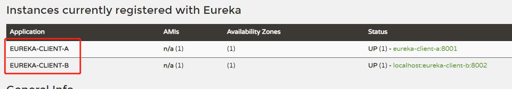

# Eureka(注册发现中心)

## 1.创建spring项目


## 2.选择SpringBoot版本

学习的话用2.3.12,如果没有这个版本就随便选一个最近的,后面修改

再选择eureka,


创建之后再修改版本


## 3.配置文件


## 4.添加注解

### 1.更改Application文件名


### 2.开启eureka的注册中心功能

@EnableEurekaServer


## 5.运行

### 1.运行结果


### 2.运行页面

localhost:8761


## 6.管理页面的内容


## 7.再新建一个注册中心

### 1.创建一个客户端注册中心, 项目名要与其他区别开


选Eureka Discovery Client和Web


然后修改版本配置,与上一个一样,开启注册功能


注意开启的是客户端


再创建一个EurekaClientBApplication ... 


## 8.注册集群

集群,就是项目名是一样的;然后端口不一样;

点击Edit Configurations,再点击copy


然后就有两台机器


## 9.注册中心与客户端关系


## 10.常用配置

### 1.server

```yaml
#单机
server:
    port: 8761  # eureka的默认端口  6379  8080  3306   8848
spring:
    application:
        name: eureka-server  # 应用名称 不要使用特殊字符
eureka: # eureka的配置分为三类 server  client  实例的  eureka-server既是服务端又是客户端
    server:
        eviction-interval-timer-in-ms: 10000 # 服务端间隔多少毫秒做定期删除的操作
        renewal-percent-threshold: 0.85 # 续约百分比 超过85%的应用没有和你续约 那么eureka会保护服务 不会剔除任何一个
    instance: # 实例的配置
        instance-id: ${eureka.instance.hostname}:${spring.application.name}:${server.port}   # 主机名称 : 应用名称 : 端口号
        hostname: localhost  # 主机名称 或者服务的ip
        prefer-ip-address: true # 以ip的形式显示具体的服务信息
        lease-renewal-interval-in-seconds: 5  # 服务实例的续约的时间间隔
    client:
        service-url:
            defaultZone: ${EUREKA_SERVER_URL:http://localhost:8761/eureka}
        register-with-eureka: ${REGISTER_WITH_EUREKA:true}  # 先将server自己注册自己的开关 关掉
        fetch-registry: true
# docker run -p 端口  -d 后台运行 --link 指定网络host文件映射的  -e MYSQL_ROOT_PASSWORD=123456 -v 文件挂载

# 集群
#server:
#    port: 8761  # eureka的默认端口  6379  8080  3306   8848
#spring:
#    application:
#        name: eureka-server  # 应用名称 不要使用特殊字符
#eureka:
#    client:
#        service-url: # 你不写 默认 8761
#            defaultZone: http://peer2:8762/eureka,http://peer3:8763/eureka
#    instance: # 实例的配置
#        instance-id: ${eureka.instance.hostname}:${spring.application.name}:${server.port}   # 主机名称 : 应用名称 : 端口号
#        hostname: peer1  # 主机名称 或者服务的ip
#        prefer-ip-address: true # 以ip的形式显示具体的服务信息
#        lease-renewal-interval-in-seconds: 5  # 服务实例的续约的时间间隔

#集群的终极方案
#server:
#    port: 8761  # eureka的默认端口  6379  8080  3306   8848
#spring:
#    application:
#        name: eureka-server  # 应用名称 不要使用特殊字符
#eureka:
#    client:
#        service-url: # 你不写 默认 8761
#            defaultZone: http://peer1:8761/eureka,http://peer2:8762/eureka,http://peer3:8763/eureka
#    instance: # 实例的配置
#        instance-id: ${spring.application.name}:${server.port}   # 主机名称 : 应用名称 : 端口号
##        hostname: peer1  # 主机名称 或者服务的ip
#        prefer-ip-address: true # 以ip的形式显示具体的服务信息
#        lease-renewal-interval-in-seconds: 5  # 服务实例的续约的时间间隔
```


### 2.client

```yaml
#单机
server:
    port: 8761  # eureka的默认端口  6379  8080  3306   8848
spring:
    application:
        name: eureka-server  # 应用名称 不要使用特殊字符
eureka: # eureka的配置分为三类 server  client  实例的  eureka-server既是服务端又是客户端
    server:
        eviction-interval-timer-in-ms: 10000 # 服务端间隔多少毫秒做定期删除的操作
        renewal-percent-threshold: 0.85 # 续约百分比 超过85%的应用没有和你续约 那么eureka会保护服务 不会剔除任何一个
    instance: # 实例的配置
        instance-id: ${eureka.instance.hostname}:${spring.application.name}:${server.port}   # 主机名称 : 应用名称 : 端口号
        hostname: localhost  # 主机名称 或者服务的ip
        prefer-ip-address: true # 以ip的形式显示具体的服务信息
        lease-renewal-interval-in-seconds: 5  # 服务实例的续约的时间间隔
    client:
        service-url:
            defaultZone: ${EUREKA_SERVER_URL:http://localhost:8761/eureka}
        register-with-eureka: ${REGISTER_WITH_EUREKA:true}  # 先将server自己注册自己的开关 关掉
        fetch-registry: true
# docker run -p 端口  -d 后台运行 --link 指定网络host文件映射的  -e MYSQL_ROOT_PASSWORD=123456 -v 文件挂载

# 集群
#server:
#    port: 8761  # eureka的默认端口  6379  8080  3306   8848
#spring:
#    application:
#        name: eureka-server  # 应用名称 不要使用特殊字符
#eureka:
#    client:
#        service-url: # 你不写 默认 8761
#            defaultZone: http://peer2:8762/eureka,http://peer3:8763/eureka
#    instance: # 实例的配置
#        instance-id: ${eureka.instance.hostname}:${spring.application.name}:${server.port}   # 主机名称 : 应用名称 : 端口号
#        hostname: peer1  # 主机名称 或者服务的ip
#        prefer-ip-address: true # 以ip的形式显示具体的服务信息
#        lease-renewal-interval-in-seconds: 5  # 服务实例的续约的时间间隔

#集群的终极方案
#server:
#    port: 8761  # eureka的默认端口  6379  8080  3306   8848
#spring:
#    application:
#        name: eureka-server  # 应用名称 不要使用特殊字符
#eureka:
#    client:
#        service-url: # 你不写 默认 8761
#            defaultZone: http://peer1:8761/eureka,http://peer2:8762/eureka,http://peer3:8763/eureka
#    instance: # 实例的配置
#        instance-id: ${spring.application.name}:${server.port}   # 主机名称 : 应用名称 : 端口号
##        hostname: peer1  # 主机名称 或者服务的ip
#        prefer-ip-address: true # 以ip的形式显示具体的服务信息
#        lease-renewal-interval-in-seconds: 5  # 服务实例的续约的时间间隔
```


## 11.构建高可用Eurka-Server集群


### 1.再新建两个eureka服务端

步骤与以前一样,项目名不一样,当配置文件中的应用名称要一致


```yaml
server:
    port: 8762
spring:
    application:
        name: eureka-server # 应用名称不能改
eureka:
    client:
        service-url:
            defaultZone: http://peer1:8761/eureka,http://peer3:8763/eureka
    instance: # 实例的配置
        instance-id: ${eureka.instance.hostname}:${spring.application.name}:${server.port}   # 主机名称 : 应用名称 : 端口号
        hostname: peer2  # 主机名称 或者服务的ip
        prefer-ip-address: true # 以ip的形式显示具体的服务信息
        lease-renewal-interval-in-seconds: 5  # 服务实例的续约的时间间隔
```

peer1,peer2,peer3 就是localhost

http://localhost:8761/eureka/,http://localhost:8762/eureka/
这样写，eureka 认为只有一个机器，就是 localhost
所以这里面不能写成一样
修改 hosts 文件： C:\Windows\System32\drivers\etc
如果你修改了 hosts 文件 发现没有生效 记得在 cmd 里面刷新一下
ipconfig /flushdns  


### 2.注册服务器集群运行结果


### 3.搭建集群终极方案

#### 1.修改配置文件

先将第一个eureka server的配置文件改为

即,少了主机名称,主机名称

instance-id: ${spring.application.name}:${server.port}   # 主机名称 : 应用名称 : 端口号 也少了主机名称

```yaml
#集群的终极方案
#server:
#    port: 8761  # eureka的默认端口  6379  8080  3306   8848
#spring:
#    application:
#        name: eureka-server  # 应用名称 不要使用特殊字符
#eureka:
#    client:
#        service-url: # 你不写 默认 8761
#            defaultZone: http://peer1:8761/eureka,http://peer2:8762/eureka,http://peer3:8763/eureka
#    instance: # 实例的配置
#        instance-id: ${spring.application.name}:${server.port}   # 主机名称 : 应用名称 : 端口号
##        hostname: peer1  # 主机名称 或者服务的ip
#        prefer-ip-address: true # 以ip的形式显示具体的服务信息
#        lease-renewal-interval-in-seconds: 5  # 服务实例的续约的时间间隔
```

#### 2.Copy EurekaServerApplication

复制两个,并修改端口


#### 3.修改客户端集群配置


将客户端注册到所有集群中


## 12.分布式数据一致性协议  

即,选举谁当主节点

zk 是 Paxos
eureka 没有分布式数据一致性的机制 节点都是相同的
nacos raft
在有主从模式的集群中 一般都要遵循这样的协议 才可以稳定对外提供服务
Zookeeper Paxos
Nacos raft  

### 1.raft  

和共识算法差不多,就谁先运行完程序,就给其他节点发送信息,其他节点同意,然后第一个运行完的就当上了主节点.

如果出现多个节点同时运行完,就再选举一次


当有数据要同步时,先将同步内容写进日志中.主节点会通知其他节点,如果大部分回应,就进行同步,如果少部分回应就不进行同步.


## 13.服务发现

### 1.什么是服务发现  

根据服务名称发现服务的实例过程,客户端会在本地缓存服务端的列表拉取列表是有间隔周期的 （导致服务上线 客户端不能第一时间感知到 （可以容忍））,其实每次做服务发现 都是从本地的列表来进行的  


### 2.测试服务发现  

启动 eureka-server 一台

启动服务 a

启动服务 b

确保服务都上线了  




### 3.在 a 服务里面做服务发现  

```java
package com.bjpowernode.controller;
import org.springframework.beans.factory.annotation.Autowired;
import org.springframework.cloud.client.ServiceInstance;
import org.springframework.cloud.client.discovery.DiscoveryClient;
import org.springframework.web.bind.annotation.GetMapping;
import org.springframework.web.bind.annotation.RestController;
import java.util.List;
/**
* @Author: 北京动力节点
*/
@RestController
public class TestController {
/**
* 注入服务发现组件，我们的 eureka 已经实现了这个接口，所以 IOC 里面有这个对象
*/
@Autowired
private DiscoveryClient discoveryClient;
/**
* 服务发现
**
@param serviceId
* @return
*/
@GetMapping("find")
public String find(String serviceId) {
//调用服务发现
List<ServiceInstance> instances = discoveryClient.getInstances(serviceId);
instances.forEach(System.out::print);
return instances.toString();
}
}
```


## 14.docker修改挂载配置

### 1.常用指令

-p 端口

-d 后台运行

--link指定网络host 文件映射

-e 修改配置 如:

register-with-eureka: ${REGISTER_WITH_EUREKA:true}

想修改register-with-eureka为false, 就可以

-e REGISTER_WITH_EUREKA=false,

yaml文件要提前写好${REGISTER_WITH_EUREKA:true},咋样docker就能找到

```yaml
#单机
server:
    port: 8761  # eureka的默认端口  6379  8080  3306   8848
spring:
    application:
        name: eureka-server  # 应用名称 不要使用特殊字符
eureka: # eureka的配置分为三类 server  client  实例的  eureka-server既是服务端又是客户端
    server:
        eviction-interval-timer-in-ms: 10000 # 服务端间隔多少毫秒做定期删除的操作
        renewal-percent-threshold: 0.85 # 续约百分比 超过85%的应用没有和你续约 那么eureka会保护服务 不会剔除任何一个
    instance: # 实例的配置
        instance-id: ${eureka.instance.hostname}:${spring.application.name}:${server.port}   # 主机名称 : 应用名称 : 端口号
        hostname: localhost  # 主机名称 或者服务的ip
        prefer-ip-address: true # 以ip的形式显示具体的服务信息
        lease-renewal-interval-in-seconds: 5  # 服务实例的续约的时间间隔
    client:
        service-url:
            defaultZone: ${EUREKA_SERVER_URL:http://localhost:8761/eureka}
        register-with-eureka: ${REGISTER_WITH_EUREKA:true}  # 先将server自己注册自己的开关 关掉
        fetch-registry: true

```

