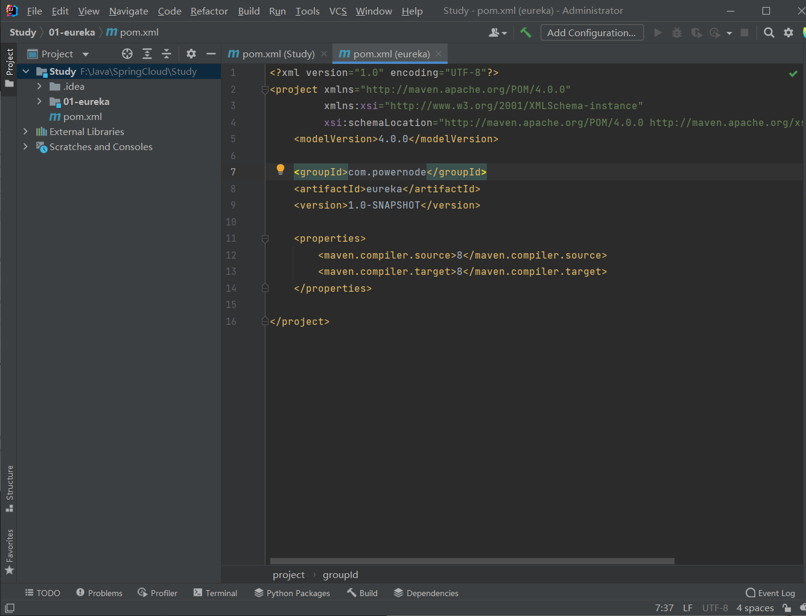
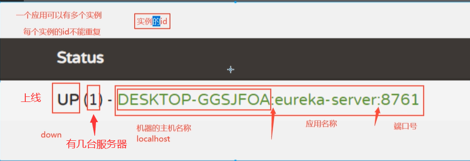
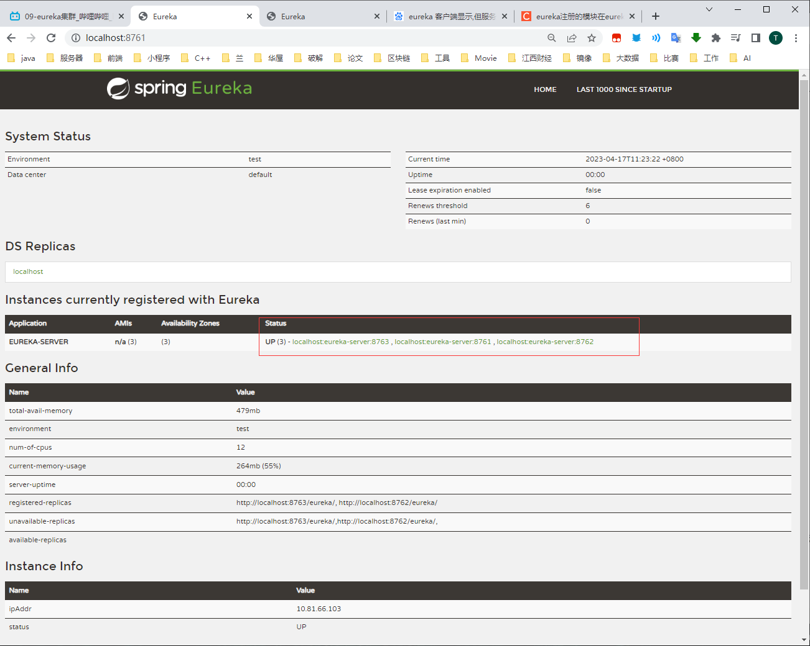
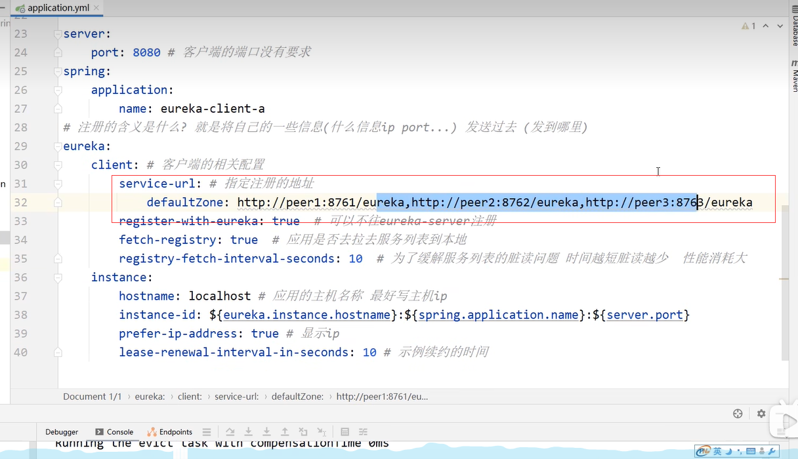
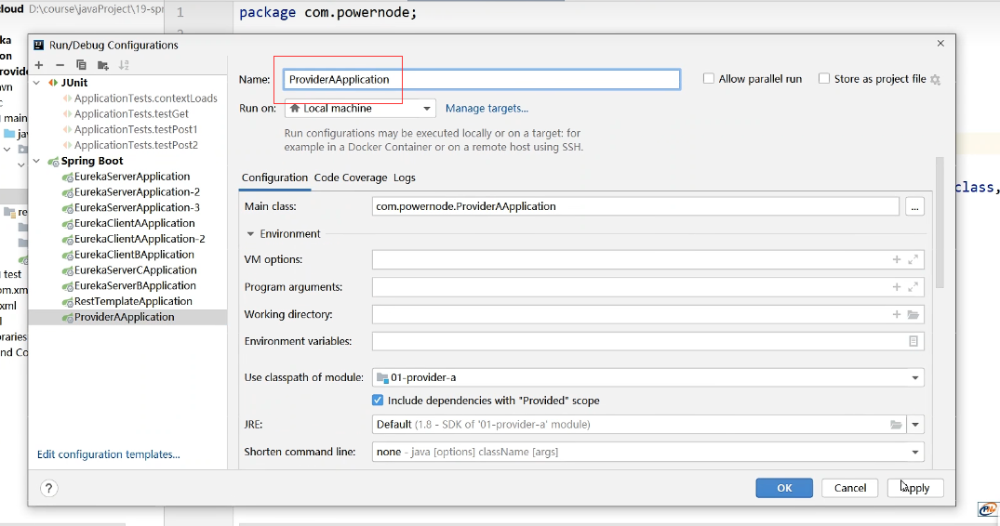

Spring Initializr Server URL

 

```https://start.aliyun.com/```阿里巴巴

```https://start.spring.io ```Spring原生

# 前期准备

## 1.先新建一个maven新项目

建好后删除其他文件,只留idea和pom文件


## 2.建一个eureka父项目(空)

先不要依赖study 


# Eureka(注册发现中心)

## 1.步骤总结

### 1.创建项目

#### 1.服务端

只需要选择eureka-server

版本

#### 2.客户端

需要eureka-client 和 Spring Web

### 2.spring boot和cloud 版本

```
<spring-boot.version>2.3.12.RELEASE</spring-boot.version>
<spring-cloud.version>Hoxton.SR12</spring-cloud.version>
```

### 3.配置文件

#### 1.服务端

一般服务端只需要配置端口和应用名称,也可以自己注册自己

```yaml
server:
  port: 9761
spring:
  application:
    name: eureka-server
```

#### 2.客户端

客户端除了应用名称和端口,还需要绑定服务端

```yaml
server:
  port: 9090
spring:
  application:
    name: eureka-client-a
eureka:
  client:
    service-url:
      defaultZone: http://localhost:9761/eureka
```

### 4.修改启动类名称和加入注解

服务端有服务端的注解,客户端有客户端的注解

```java
@SpringBootApplication
@EnableEurekaClient
public class EurekaClientBApplication {

    public static void main(String[] args) {
        SpringApplication.run(EurekaClientBApplication.class, args);
    }

}
```

### 5.搭建集群环境

集群就是应用名称不变,端口变

可以新建项目,也可以通过复制配置文件的方式实现


修改启动类名称和端口


## 2.eureka项目搭建

### 1.创建spring项目


### 2.选择SpringBoot版本

学习的话用2.3.12,如果没有这个版本就随便选一个最近的,后面修改

选择2.3.12.RELEASE版本,如果美酒就随便选一个,新建好项目之后改就行

Spring-Cloud-Version改为Hoxton-SR12版本

再选择eureka,(eureka包含了Web)


创建之后再修改版本


```xml
<parent>
        <groupId>org.springframework.boot</groupId>
        <artifactId>spring-boot-starter-parent</artifactId>
        <version>2.3.12.RELEASE</version>
        <relativePath/> <!-- lookup parent from repository -->
    </parent>
    <groupId>com.powernode</groupId>
    <artifactId>eureka-server</artifactId>
    <version>0.0.1-SNAPSHOT</version>
    <name>01-eureka-server</name>
    <description>01-eureka-server</description>
    <properties>
        <java.version>1.8</java.version>
        <spring-cloud.version>Hoxton.SR12</spring-cloud.version>
    </properties>
```

### 3.配置文件


```yaml
server:
  port: 8761 # eureka默认端口
spring:
  application:
    name: eureka-server #应用名称,不要使用特殊字符
```

### 5.修改启动类和应用名称

设置为为EurekaServerApplication

且添加eureka注解

#### 1.更改Application文件名


#### 2.开启eureka的注册中心功能

@EnableEurekaServer


### 5.运行

#### 1.运行结果


#### 2.运行页面

localhost:8761


### 6.管理页面的内容




```txt
	UP (1) - DESKTOP-IO48VPB:eureka-server:8761
```


### 7.再新建eureka客户端

#### 1.创建一个客户端注册中心, 项目名要与其他区别开


选Eureka Discovery Client和Web


然后修改版本配置,与上一个一样,开启注册功能

```xml

    <parent>
        <groupId>org.springframework.boot</groupId>
        <artifactId>spring-boot-starter-parent</artifactId>
        <version>2.3.12.RELEASE</version>
        <relativePath/> <!-- lookup parent from repository -->
    </parent>
    <groupId>com.powernode</groupId>
    <artifactId>eureka-client-a</artifactId>
    <version>0.0.1-SNAPSHOT</version>
    <name>02-eureka-client-a</name>
    <description>02-eureka-client-a</description>
    <properties>
        <java.version>1.8</java.version>
        <spring-cloud.version>Hoxton.SR12</spring-cloud.version>
    </properties>
```


```yaml
server:
  port: 9090  # 客户端的端口没有要求
spring:
  application:
    name: eureka-client-a

# 注册的含义就是将自己的一些信息(如ip,端口)发送到服务端
eureka:
  client:
    service-url: # 往哪里注册
      defaultZone: http://localhost:8761/eureka
```


注意开启的是客户端


再创建一个EurekaClientBApplication ... 


### 8.注册集群

集群,就是项目名是一样的;然后端口不一样;

点击Edit Configurations,再点击copy


然后就有两台机器


## 3.常用配置

eureka配置分为三类: server,client,instance(实例)

### 0.注册中心与客户端关系


客户端与服务端的联系: 心跳机制,客户端给服务端发请求,服务端响应. 确认对方在线

客户端访问其他的客户端: 需要从服务端中拉取服务列表,将其他客户端的信息拉去到本客户端

### 1.server

```yaml
#单机
server:
    port: 8761  # eureka的默认端口  6379  8080  3306   8848
spring:
    application:
        name: eureka-server  # 应用名称 不要使用特殊字符
eureka: # eureka的配置分为三类 server  client  实例的  eureka-server既是服务端又是客户端
    server:
        eviction-interval-timer-in-ms: 10000 # 服务端间隔多少毫秒做定期删除的操作
        renewal-percent-threshold: 0.85 # 续约百分比 超过85%的应用没有和你续约 那么eureka会保护服务 不会剔除任何一个
    instance: # 实例的配置
        instance-id: ${eureka.instance.hostname}:${spring.application.name}:${server.port}   # 主机名称 : 应用名称 : 端口号
        hostname: localhost  # 主机名称 或者服务的ip
        prefer-ip-address: true # 以ip的形式显示具体的服务信息
        lease-renewal-interval-in-seconds: 5  # 服务实例的续约的时间间隔
    client:
        service-url:
            defaultZone: ${EUREKA_SERVER_URL:http://localhost:8761/eureka}
        register-with-eureka: ${REGISTER_WITH_EUREKA:true}  # 先将server自己注册自己的开关 关掉
        fetch-registry: true
# docker run -p 端口  -d 后台运行 --link 指定网络host文件映射的  -e MYSQL_ROOT_PASSWORD=123456 -v 文件挂载

# 集群
#server:
#    port: 8761  # eureka的默认端口  6379  8080  3306   8848
#spring:
#    application:
#        name: eureka-server  # 应用名称 不要使用特殊字符
#eureka:
#    client:
#        service-url: # 你不写 默认 8761
#            defaultZone: http://peer2:8762/eureka,http://peer3:8763/eureka
#    instance: # 实例的配置
#        instance-id: ${eureka.instance.hostname}:${spring.application.name}:${server.port}   # 主机名称 : 应用名称 : 端口号
#        hostname: peer1  # 主机名称 或者服务的ip
#        prefer-ip-address: true # 以ip的形式显示具体的服务信息
#        lease-renewal-interval-in-seconds: 5  # 服务实例的续约的时间间隔

#集群的终极方案
#server:
#    port: 8761  # eureka的默认端口  6379  8080  3306   8848
#spring:
#    application:
#        name: eureka-server  # 应用名称 不要使用特殊字符
#eureka:
#    client:
#        service-url: # 你不写 默认 8761
#            defaultZone: http://peer1:8761/eureka,http://peer2:8762/eureka,http://peer3:8763/eureka
#    instance: # 实例的配置
#        instance-id: ${spring.application.name}:${server.port}   # 主机名称 : 应用名称 : 端口号
##        hostname: peer1  # 主机名称 或者服务的ip
#        prefer-ip-address: true # 以ip的形式显示具体的服务信息
#        lease-renewal-interval-in-seconds: 5  # 服务实例的续约的时间间隔
```


### 2.client

```yaml
#单机
server:
    port: 8761  # eureka的默认端口  6379  8080  3306   8848
spring:
    application:
        name: eureka-server  # 应用名称 不要使用特殊字符
eureka: # eureka的配置分为三类 server  client  实例的  eureka-server既是服务端又是客户端
    server:
        eviction-interval-timer-in-ms: 10000 # 服务端间隔多少毫秒做定期删除的操作
        renewal-percent-threshold: 0.85 # 续约百分比 超过85%的应用没有和你续约 那么eureka会保护服务 不会剔除任何一个
    instance: # 实例的配置
        instance-id: ${eureka.instance.hostname}:${spring.application.name}:${server.port}   # 主机名称 : 应用名称 : 端口号
        hostname: localhost  # 主机名称 或者服务的ip
        prefer-ip-address: true # 以ip的形式显示具体的服务信息
        lease-renewal-interval-in-seconds: 5  # 服务实例的续约的时间间隔
    client:
        service-url:
            defaultZone: ${EUREKA_SERVER_URL:http://localhost:8761/eureka}
        register-with-eureka: ${REGISTER_WITH_EUREKA:true}  # 先将server自己注册自己的开关 关掉
        fetch-registry: true
# docker run -p 端口  -d 后台运行 --link 指定网络host文件映射的  -e MYSQL_ROOT_PASSWORD=123456 -v 文件挂载

# 集群
#server:
#    port: 8761  # eureka的默认端口  6379  8080  3306   8848
#spring:
#    application:
#        name: eureka-server  # 应用名称 不要使用特殊字符
#eureka:
#    client:
#        service-url: # 你不写 默认 8761
#            defaultZone: http://peer2:8762/eureka,http://peer3:8763/eureka
#    instance: # 实例的配置
#        instance-id: ${eureka.instance.hostname}:${spring.application.name}:${server.port}   # 主机名称 : 应用名称 : 端口号
#        hostname: peer1  # 主机名称 或者服务的ip
#        prefer-ip-address: true # 以ip的形式显示具体的服务信息
#        lease-renewal-interval-in-seconds: 5  # 服务实例的续约的时间间隔

#集群的终极方案
#server:
#    port: 8761  # eureka的默认端口  6379  8080  3306   8848
#spring:
#    application:
#        name: eureka-server  # 应用名称 不要使用特殊字符
#eureka:
#    client:
#        service-url: # 你不写 默认 8761
#            defaultZone: http://peer1:8761/eureka,http://peer2:8762/eureka,http://peer3:8763/eureka
#    instance: # 实例的配置
#        instance-id: ${spring.application.name}:${server.port}   # 主机名称 : 应用名称 : 端口号
##        hostname: peer1  # 主机名称 或者服务的ip
#        prefer-ip-address: true # 以ip的形式显示具体的服务信息
#        lease-renewal-interval-in-seconds: 5  # 服务实例的续约的时间间隔
```


## 4.构建高可用Eurka-Server集群


### 集群方案

#### 1.中心化集群

就是一个nginx 托管 N个tomcat


#### 2.主从模式

主机作为主要的服务器(如: 做比较重要的事--写),从机作为读的服务器


#### 3.去中心化模式

通过一个算法,可以将数据转发给其他机器进行同步,更高可用.

eureka使用此模式,将数据进行广播和扩散


### 1.再新建两个eureka服务端

步骤与以前一样,项目名不一样,当配置文件中的应用名称要一致


### 2.yaml配置要修改

注意:要往其他主机注册,如eureka-server要往eureka-server-b和eureka-server-c中注册

端口需要不一样,应用名称一样

```yaml
# 不写,默认往8761里面注册
    service-url:
      defaultZone: http://localhost:8762/eureka,http://localhost:8763/eureka
```

eureka-server

```yaml
# 集群配置
server:
  port: 8761
spring:
  application:
    name: eureka-server
eureka:
  client:
# 不写,默认往8761里面注册
    service-url:
      defaultZone: http://localhost:8762/eureka,http://localhost:8763/eureka
  instance:
#    主机名称 : 应用名称 : 端口号
    instance-id: ${eureka.instance.hostname}:${spring.application.name}:${server.port}
#    主机名称 或者服务的ip
    hostname: localhost
    # 以ip的形式显示具体的服务信息
    prefer-ip-address: true
    # 服务实例的续约的时间间隔
    lease-renewal-interval-in-seconds: 5

```

eureka-server-b

```yaml
# 集群配置
server:
  port: 8762
spring:
  application:
    name: eureka-server
eureka:
  client:
    # 不写,默认往8761里面注册
    service-url:
      defaultZone: http://localhost:8761/eureka,http://localhost:8763/eureka
  instance:
    #    主机名称 : 应用名称 : 端口号
    instance-id: ${eureka.instance.hostname}:${spring.application.name}:${server.port}
    #    主机名称 或者服务的ip
    hostname: localhost
    # 以ip的形式显示具体的服务信息
    prefer-ip-address: true
    # 服务实例的续约的时间间隔
    lease-renewal-interval-in-seconds: 5
```

eureka-server-c

```yaml
# 集群配置
server:
  port: 8763
spring:
  application:
    name: eureka-server
eureka:
  client:
    # 不写,默认往8761里面注册
    service-url:
      defaultZone: http://localhost:8761/eureka,http://localhost:8762/eureka
  instance:
    #    主机名称 : 应用名称 : 端口号
    instance-id: ${eureka.instance.hostname}:${spring.application.name}:${server.port}
    #    主机名称 或者服务的ip
    hostname: localhost
    # 以ip的形式显示具体的服务信息
    prefer-ip-address: true
    # 服务实例的续约的时间间隔
    lease-renewal-interval-in-seconds: 5
```

### 3.修改启动类名称及加入注解

```java
package com.example;

import org.springframework.boot.SpringApplication;
import org.springframework.boot.autoconfigure.SpringBootApplication;
import org.springframework.cloud.netflix.eureka.server.EnableEurekaServer;

@SpringBootApplication
@EnableEurekaServer
public class EurekaServerBApplication {

    public static void main(String[] args) {
        SpringApplication.run(EurekaServerBApplication.class, args);
    }

}
```

### 4.启动三个服务端



发现并没有出现集群信息，只是同一个服务 server 启动了多台 没有数据交互 不是真正意义上的集群

原因是因为：  

http://localhost:8761/eureka/,http://localhost:8762/eureka/

这样写，eureka 认为只有一个机器，就是 localhost所以这里面不能写成一样修改 hosts 文件： C:\Windows\System32\drivers\etc


如果你修改了 hosts 文件 发现没有生效 记得在 cmd 里面刷新一下  

peer1,peer2,peer3 就是localhost

```ipconfig /flushdns```  


修改注册地址信息:

三个yaml文件都要修改


```yaml
# 集群配置
server:
  port: 8761
spring:
  application:
    name: eureka-server
eureka:
  client:
# 不写,默认往8761里面注册
    service-url:
      defaultZone: http://peer2:8762/eureka,http://peer3:8763/eureka
  instance:
#    主机名称 : 应用名称 : 端口号
    instance-id: ${eureka.instance.hostname}:${spring.application.name}:${server.port}
#    主机名称 或者服务的ip
    hostname: peer1
    # 以ip的形式显示具体的服务信息
    prefer-ip-address: true
    # 服务实例的续约的时间间隔
    lease-renewal-interval-in-seconds: 5

```


### 2.注册服务器集群运行结果


### 3.搭建集群终极方案

思想: 不用再新建项目,而是通过复制配置,修改端口的方式来实现集群

#### 1.修改配置文件

将eureka server的配置文件改为


即,少了主机名称,主机名称

instance-id: ${spring.application.name}:${server.port}   # 主机名称 : 应用名称 : 端口号 也少了主机名称

```yaml
# 集群终极方案配置
server:
  port: 8761
spring:
  application:
    name: eureka-server
eureka:
  client:
# 不写,默认往8761里面注册
    service-url:
      defaultZone: http://peer1:8761/eureka,http://peer2:8762/eureka,http://peer3:8763/eureka
  instance:
#    主机名称 : 应用名称 : 端口号
    instance-id: ${spring.application.name}:${server.port}
#    instance-id: ${eureka.instance.hostname}:${spring.application.name}:${server.port}
#    主机名称 或者服务的ip
#    hostname: peer1
    # 以ip的形式显示具体的服务信息
    prefer-ip-address: true
    # 服务实例的续约的时间间隔
    lease-renewal-interval-in-seconds: 5
```

#### 2.Copy EurekaServerApplication

复制两个,并修改端口

--server.port=8762

--server.port=8763


#### 3.修改客户端集群配置



将客户端注册到所有集群中

```yaml
server:
  port: 9090
spring:
  application:
    name: eureka-client-a
eureka:
  client:
    service-url:
      defaultZone: http://peer1:8761/eureka,http://peer2:8762/eureka,http://peer3:8763/eureka
    #   是否往eureka里面注册
    register-with-eureka: true
    #    是否去拉去服务列表
    fetch-registry: true
    #    每隔多少秒去拉取一次列表,为了防止脏读,时间越短,脏读越小,但资源消耗越多
    registry-fetch-interval-seconds: 10
  instance:
    hostname: localhost
    instance-id: ${eureka.instance.hostname}:${spring.application.name}:${server.port}
    prefer-ip-address: true
    lease-renewal-interval-in-seconds: 10
```

运行效果


## 5.分布式数据一致性协议  

即,选举谁当主节点

zk 是 Paxos
eureka 没有分布式数据一致性的机制 节点都是相同的
nacos raft
在有主从模式的集群中 一般都要遵循这样的协议 才可以稳定对外提供服务
Zookeeper Paxos
Nacos raft  

### 1.raft  

和共识算法差不多,就谁先运行完程序,就给其他节点发送信息,其他节点同意,然后第一个运行完的就当上了主节点.

如果出现多个节点同时运行完,就再选举一次


当有数据要同步时,先将同步内容写进日志中.主节点会通知其他节点,如果大部分回应,就进行同步,如果少部分回应就不进行同步.


## 6.服务发现

### 1.什么是服务发现  

根据服务名称发现服务的实例过程,客户端会在本地缓存服务端的列表拉取列表是有间隔周期的 （导致服务上线 客户端不能第一时间感知到 （可以容忍））,其实每次做服务发现 都是从本地的列表来进行的  


### 2.测试服务发现  

启动 eureka-server 一台

启动服务 a

启动服务 b

确保服务都上线了  


### 3.在 a 服务里面做服务发现  

```java
package com.bjpowernode.controller;
import org.springframework.beans.factory.annotation.Autowired;
import org.springframework.cloud.client.ServiceInstance;
import org.springframework.cloud.client.discovery.DiscoveryClient;
import org.springframework.web.bind.annotation.GetMapping;
import org.springframework.web.bind.annotation.RestController;
import java.util.List;
/**
* @Author: 北京动力节点
*/
@RestController
public class TestController {
/**
* 注入服务发现组件，我们的 eureka 已经实现了这个接口，所以 IOC 里面有这个对象
*/
@Autowired
private DiscoveryClient discoveryClient;
/**
* 服务发现
**
@param serviceId
* @return
*/
@GetMapping("find")
public String find(String serviceId) {
//调用服务发现
List<ServiceInstance> instances = discoveryClient.getInstances(serviceId);
instances.forEach(System.out::print);
return instances.toString();
}
}
```

### 4.测试

服务名称大小写都可以:**EUREKA-CLIENT-B**

```http://localhost:9090/test?serverName=eureka-client-b```


## 7.docker修改挂载配置

### 1.常用指令

-p 端口

-d 后台运行

--link指定网络host 文件映射

-e 修改配置 如:

register-with-eureka: ${REGISTER_WITH_EUREKA:true}

想修改register-with-eureka为false, 就可以

-e REGISTER_WITH_EUREKA=false,

yaml文件要提前写好${REGISTER_WITH_EUREKA:true},咋样docker就能找到

```yaml
#单机
server:
    port: 8761  # eureka的默认端口  6379  8080  3306   8848
spring:
    application:
        name: eureka-server  # 应用名称 不要使用特殊字符
eureka: # eureka的配置分为三类 server  client  实例的  eureka-server既是服务端又是客户端
    server:
        eviction-interval-timer-in-ms: 10000 # 服务端间隔多少毫秒做定期删除的操作
        renewal-percent-threshold: 0.85 # 续约百分比 超过85%的应用没有和你续约 那么eureka会保护服务 不会剔除任何一个
    instance: # 实例的配置
        instance-id: ${eureka.instance.hostname}:${spring.application.name}:${server.port}   # 主机名称 : 应用名称 : 端口号
        hostname: localhost  # 主机名称 或者服务的ip
        prefer-ip-address: true # 以ip的形式显示具体的服务信息
        lease-renewal-interval-in-seconds: 5  # 服务实例的续约的时间间隔
    client:
        service-url:
            defaultZone: ${EUREKA_SERVER_URL:http://localhost:8761/eureka}
        register-with-eureka: ${REGISTER_WITH_EUREKA:true}  # 先将server自己注册自己的开关 关掉
        fetch-registry: true

```


## 8.RestTemplate

G:\Document\mdNote\Java\tools\请求.md


# Ribbon


## 1.Ribbon 概述  

Spring Cloud Ribbon 是一个基于 HTTP 和 TCP 的客户端负载均衡工具。通过 Spring Cloud 的封装，可以让我们轻松地将面向服务的 REST 模版请求自动转换成客户端负载均衡的服务调用。  

主要任务就是远程调用方法同时完成负载均衡.

## 2.服务器的负载均衡


## 3.Ribbon 快速入门  

### 1.本次调用设计图  


### 2.项目搭建  

consumer 和 provider-1 和 provider-2 都是 eureka-client

注意这三个依赖是 eureka-client

注意 provider-1 和 provider-2 的 spring.application.name=provider

注意启动类的注解和配置文件的端口以及服务名称  


### 3.创建 provider-1 和 provider-2  


#### provider-1:

修改application名称为ProviderAApplication

```yaml
server:
    port: 8080
spring:
    application:
# 应用名称
        name: provider
eureka:
    client:
        service-url:
# 注册到注册中心
            defaultZone: http://peer1:8761/eureka
# 实例信息
    instance:
        hostname: localhost
        prefer-ip-address: true
        instance-id: ${eureka.instance.hostname}:${spring.application.name}:${server.port}

```




#### provider-2

修改application名称为ProviderBApplication

只需要改端口,应用名称不能改,改了就不是一个应用,不能实现负载均衡效果

```yaml
server:
    port: 8081
spring:
    application:
# 应用名称
        name: provider
eureka:
    client:
        service-url:
# 注册到注册中心
            defaultZone: http://peer1/eureka
# 实例信息
    instance:
        hostname: localhost
        prefer-ip-address: true
        instance-id: ${eureka.instance.hostname}:${spring.application.name}:${server.port}

```


## 4.编写 provider-1 和 provider-2  


## 5.创建 consumer  


```xml

<dependency>
<groupId>org.springframework.cloud</groupId>
<artifactId>spring-cloud-starter-netflix-ribbon</artifactId>
<version>2.2.9.RELEASE</version>
</dependency>
```

```yaml
server:
    port: 8082
spring:
    application:
        name: consumer
eureka:
    client:
        service-url:
            defaultZone: http://peer1:8761/eureka
    instance:
        hostname: localhost
        prefer-ip-address: true
        instance-id: ${eureka.instance.hostname}:${spring.application.name}:${server.port}
# 访问不用的服务可以使用不用的算法规则
#provider:  # 先写服务提供者的应用名称
#    ribbon:
#        NFLoadBalancerRuleClassName: com.netflix.loadbalancer.RandomRule    #几种算法的全限定类名
ribbon:
    eager-load:
        enabled: false # ribbon它只有自己的话 能不能做服务发现 借助eureka  # ribbon需要去eureka中获取服务列表 如果false就懒加载
    eureka:
        enabled: true
    http:  # 我们使用ribbon 用的restTemplate发请求 java.net.HttpUrlConnection 发的请求  很方便 但是它不支持连接池
        client:  # 发请求的工具有很多 httpClient  它支持连接池 效率更好  如果你想改请求的工具 记得加这个依赖即可
            enabled: false
    okhttp: # 这个也是请求工具 移动端用的比较多 轻量级的请求
        enabled: false

```

最后修改application为ConsumerApplicaiton


## 6.编写consumer启动类

```java
package com.powernode;

import com.netflix.loadbalancer.IRule;
import com.netflix.loadbalancer.RandomRule;
import org.springframework.boot.SpringApplication;
import org.springframework.boot.autoconfigure.SpringBootApplication;
import org.springframework.cloud.client.loadbalancer.LoadBalanced;
import org.springframework.cloud.netflix.eureka.EnableEurekaClient;
import org.springframework.context.annotation.Bean;
import org.springframework.web.client.RestTemplate;

@SpringBootApplication
@EnableEurekaClient
public class ConsumerApplication {

    public static void main(String[] args) {
        SpringApplication.run(ConsumerApplication.class, args);
    }

    /**
     * 这个RestTemplate 已经变了
     * LoadBalanced 他就会被ribbon来操作
     * @return
     */
    @Bean
    @LoadBalanced
    public RestTemplate restTemplate(){
        return new RestTemplate();
    }

    /**
     * 往容器中放一个rule对象
     * 你访问任何一个提供者 都是这个算法
     * @return
     */
    @Bean
    public IRule myRule(){
        return new RandomRule();
    }

}

```

注意: @LoadBalanced,它会将请求交给ribbon来操作

## 7.编写controller类

```Java
package com.powernode.controller;

import org.springframework.beans.factory.annotation.Autowired;
import org.springframework.cloud.client.ServiceInstance;
import org.springframework.cloud.client.loadbalancer.LoadBalancerClient;
import org.springframework.web.bind.annotation.GetMapping;
import org.springframework.web.bind.annotation.RestController;
import org.springframework.web.client.RestTemplate;

@RestController
public class ConsumerController {

    @Autowired
    private RestTemplate restTemplate;

    @Autowired
    private LoadBalancerClient loadBalancerClient;

    /**
     * 思考 ribbon是怎么将 http://provider/hello 路径请求成功的
     * http://127.0.0.1:8080/hello
     * 1.拦截这个请求
     * 2.截取主机名称
     * 3.借助eureka来做服务发现 list<>
     * 4.通过负载均衡算法 拿到一个服务ip port
     * 5.reConstructURL
     * 6.发起请求
     *
     * @param serviceName
     * @return
     */
    @GetMapping("testRibbon")
    public String testRibbon(String serviceName){
        // 正常来讲 需要 拿到ip和port 以及 路径 才可以用
        // http://provider/hello
        String result = restTemplate.getForObject("http://" + serviceName + "/hello", String.class);
        // 只要你给restTemplate 加了ribbon的注解 项目中这个对象发起的请求 都会走ribbon的代理
        // 如果你想使用原生的restTemplate 就需要重新创建一个对象
//        RestTemplate myRest = new RestTemplate();
//        String forObject = myRest.getForObject("http://localhost:8888/aaa", String.class);
        return result;
    }


    // 轮训的算法 怎么去实现
    // 两台机器   A B
    // A
    // B
    // A
    // B
    // 代码实现轮训的算法  List<机器>
    // 请求次数
    //  int index =   1 % size    list.get(index);
    // % 取模 取余好处是一个周期函数 让得到的结果 总是小于 除数的
    //  1 / 2    1 % 2
    // 1%2=1
    // 2%2=0
    // 3%2=1
    // 4%2=0
    // 全局顶一个int i = 0
    // i++  线程不安全的
    // i % size
    // 怎么能做一个线程安全的轮训算法   加锁 效率极低  CAS 自旋锁 没有线程的等待和唤醒的开销
    // CAS 优点 性能好 java层面无锁的状态  但是在jvm层面 有锁的cmpxchg
    // CAS 缺点 会导致短暂时间内 CPU 飙升  还有ABA 问题


    /**
     * 核心是负载均衡
     * @param serviceName
     * @return
     */
    @GetMapping("testRibbonRule")
    public String testRibbonRule(String serviceName){
        ServiceInstance choose = loadBalancerClient.choose(serviceName);
        return choose.toString();
    }

}

```


运行效果: localhost:8082/testRibbon?serviceName=provider


### 1.如何将provider编程ip地址

思考 ribbon是怎么将 http://provider/hello 路径请求成功的

```txt
     * 1.拦截这个请求
     * 2.截取主机名称
     * 3.借助eureka来做服务发现 list<>
     * 4.通过负载均衡算法 拿到一个服务ip port
     * 5.reConstructURL
     * 6.发起请求
```

## 8.不经过负载均衡

如果不希望经过负载均衡,而是直接调用restTemplate发送正常的请求,如发送'http://localhost:8080/test',这时候就要重新new 一个RestTemplate


## 9.ribbon的一些配置

```yaml
ribbon: #全局的设置
eager-load:
enabled: false # ribbon 一启动不会主动去拉取服务列表，当实际使用时才
去拉取 是否立即加载
http:
client:
enabled: false # 在 ribbon 最后要发起 Http 的调用调用，我们认为是
RestTemplate 完成的，其实最后是 HttpURLConnection 来完成的，这里面设置为 true ，
可以把 HttpUrlConnection->HttpClient
okhttp:
enabled: false #HttpUrlConnection 来完成的，这里面设置为 true ，可以
把 HttpUrlConnection->OkHttpClient(也是发 http 请求的，它在移动端的开发用的多)
provider: #提供者的服务名称,那么访问该服务的时候就会按照自定义的负载均衡算法
ribbon:
NFLoadBalancerRuleClassName: com.netflix.loadbalancer.RandomRule
#修改默认负载均衡算法，几种算法的全限定类名
# NFLoadBalancerClassName: #loadBalance 策略
# NFLoadBalancerPingClassName: #ping 机制策略
# NIWSServerListClassName: #服务列表策略
# NIWSServerListFilterClassName: #服务列表过滤策略
ZonePreferenceServerListFilter 默认是优先过滤非一个区的服务列表
```


# OpenFeign

## 1.简介

Feign 是声明性(注解)Web 服务客户端。它使编写 Web 服务客户端更加容易。要使用 Feign， 请创建一个接口并对其进行注解。它具有可插入注解支持(声明式开发)

Feign 是一个远程调用的组件 (接口，注解) 

http 调用的 Feign 集成了 ribbon, ribbon 里面集成了 eureka

在项目中一般不使用ribbon,而是使用OpenFeign,OpenFeign封装了ribbon


## 2.OpenFeign实例

### 1.设计图

Feign的作用是远程调用,因为微服务的各个模块都是分离的,如当用户订单时,此时发生在用户模块上,但它并不会做这个事,而是将下单的任务远程交给订单模块.

这里用户模块相当于一个客户端,而订单模块相当于一个服务端.


### 2.先启动eureka-server服务


### 3.创建order-service,订单服务

#### 1.添加依赖


```yaml
server:
port: 8081
spring:
application:
name: consumer-user-service
eureka:
client:
service-url:
defaultZone: http://localhost:8761/eureka
instance:
instance-id: ${spring.application.name}:${server.port}
prefer-ip-address: true
```

#### 2.修改启动类名称


#### 3.增加一个访问接口

```java
package com.bjpowernode.controller;
import org.springframework.web.bind.annotation.GetMapping;
import org.springframework.web.bind.annotation.RestController;
/**
* @Author: 动力节点
*/
@RestController
public class OrderController {
/**
* 订单服务下单接口
* *
@return
*/
@GetMapping("doOrder")
public String doOrder() {
System.out.println("有用户来下单了");
return "下单成功";
}
}
```

#### 4.启动测试访问


### 4.创建user-server 用户服务

#### 1.选择依赖


```yaml
server:
port: 8081
spring:
application:
name: consumer-user-service
eureka:
client:
service-url:
defaultZone: http://localhost:8761/eureka
instance:
instance-id: ${spring.application.name}:${server.port}
prefer-ip-address: true
```

#### 2.修改启动类名称并开启openFeign


#### 3.创建一个接口(重点)


用于调用远程方法

```java
package com.bjpowernode.feign;
import org.springframework.cloud.openfeign.FeignClient;
import org.springframework.web.bind.annotation.GetMapping;
/**
* @Author: 动力节点
**
@FeignClient 声明是 feign 的调用
* value = "provider-order-service" value 后面的值必须和提供者的服
务名一致
将UserOrderFeign注入到容器中
*/
@FeignClient(value = "provider-order-service")
public interface UserOrderFeign {
/**
* 描述: 下单的方法 这里的路径必须和提供者的路径一致
**
@param :
* @return java.lang.String
@GetMapping("userDoOrder")与远程方法一样
*/
@GetMapping("doOrder")
String doOrder();
}
```

#### 4.创建controller

用于用户下单

```java
package com.bjpowernode.controller;
import com.bjpowernode.feign.UserOrderFeign;
import org.springframework.beans.factory.annotation.Autowired;
import org.springframework.web.bind.annotation.GetMapping;
import org.springframework.web.bind.annotation.RestController;
/**
* @Author: 动力节点
*/
@RestController
public class UserController {
@Autowired
private UserOrderFeign userOrderFeign;
/**
* 用户远程调用下单的接口
* *
@return
*/
@GetMapping("userDoOrder")
public String userDoOrder() {
String result = userOrderFeign.doOrder();
System.out.println(result);
return result;
}
} 
```

### 5.启动类加上feign注解


```java
@SpringBootApplication
@EnableEurekaClient
@EnableFeignClients //标记 feign 的客户端
public class ConsumerUserServiceApplication {
public static void main(String[] args) {
SpringApplication.run(ConsumerUserServiceApplication.class, args);
}
} 
```


## 3.总结

consumer-user-service---》 /userDoOrder ---》通过 feign 调用 /doOrder ---》
provider-order-service 下单成功  

返回的超时时间默认是1秒,如果一秒后还未返回结果,就或报500的错误.

修改超时时间,修改的是ribbon,因为feign主要实现还是ribbon.

```yaml
ribbon: #feign 默认调用 1s 超时
ReadTimeout: 5000 #修改调用时长为 5s
ConnectTimeout: 5000 #修改连接时长为 5s
```

## 4.手动实现openfeign

### 1.openFeign原理

根据上面的案例，我们知道 feign 是接口调用，接口如果想做事，必须要有实现类 

可是我们并没有写实现类，只是加了一个@FeignClient(value=”xxx-service”)的注解   

所以我们猜测 feign 帮我们创建了代理对象，然后完成真实的调用。  

### 2.动态代理

有两种一种是jdk,另一种是cglib 子类继承的  

@FeignClient() 是用动态代理来实现的,和dao层一样在接口上写一个注解.

步骤:

- 给接口创建代理对象（启动扫描）  
- 代理对象执行进入 invoke 方法  
- 在 invoke 方法里面做远程调用  

### 3.具体流程

#### 1.给接口创建代理对象

调用的接口

```java
@FeignClient(value = "order-server")
public interface UserOrderFeign {
    /**
     * 远程方法的方法名,复制过来
     * 需要调用哪个controller就写它的方法签名
     * @return
     */
    @GetMapping("doOrder")
    public String doOrder();
}
```

创建代理对象


```java
 /**
         * 代理方法需要用到的类,即接口多对应的具体实现方法所在类
         * ClassLoader loader, --> UserController.class.getClassLoader()
         *
         * 具体代理的接口
         * Class<?>[] interfaces, --> new Class[]{UserOrderFeign.class}
         *
         * 代理的具体实现,可以使用Lombardi表达式,也可以懒汉式
         * InvocationHandler h --> new InvocationHandler() {}
         */
        UserOrderFeign userOrderFeign = (UserOrderFeign)Proxy.newProxyInstance(UserController.class.getClassLoader(), new Class[]{UserOrderFeign.class}, new InvocationHandler() {
            /**
             * Method method: 就是传入接口的方法,这里传入的是UserOrderFeign,
             * 当代理对象调用方法时,就会经过invoke方法
             * 通过invoke方法可以获取该方法(包括注解),和类对象
             * @param proxy
             * @param method
             * @param args
             * @return
             * @throws Throwable
             */
            @Override
            public Object invoke(Object proxy, Method method, Object[] args) throws Throwable {
                String name = method.getName();
                System.out.println("name: " + name);
                //System.out.println("proxy:"+proxy);
                System.out.println("method: " + method);
                System.out.println("args: " + args);
                return "null";
            }
        });
        userOrderFeign.doOrder();
    }
```


#### 2.在 invoke 方法里面做远程调用 

##### 1.分析

远程调用的话,需要拿到host和ip及路径,如地址:

 http://127.0.0.1:9090/doOrder

而host和ip可以根据模块名称再通过eureka拿到

路径值getMapping注解上可以拿到

而模块名称和路径在UserOrderFeign接口上就有,这也就是为什么要使UserOrderFeign和Order模块中的controller层对象相对应的原因.


##### 2.获取模块名称和路径


```java
@Override
            public Object invoke(Object proxy, Method method, Object[] args) throws Throwable {
                String name = method.getName();
                System.out.println(name + "方法调用了动态代理方法");
                // 获取方法上的getmapping注解
                GetMapping getMapping = method.getAnnotation(GetMapping.class);
                String path = getMapping.value()[0];
                // 获取该方法所在类对象
                Class<?> aClass = method.getDeclaringClass();
                // 获取类对象上的Feign注解
                FeignClient feignClient = aClass.getAnnotation(FeignClient.class);
                String applicationName = feignClient.value();
                String url = "http://" + applicationName + "/" + path;
                System.out.println("远程获取地址: " + url);
                return "null";
            }
```

##### 3.根据负载均衡算法发送请求

首先注入一个RestTemplate,且需要实现负载均衡算法.


```java
    @Bean
    @LoadBalanced
    public RestTemplate getRestTemplate(){
        return new RestTemplate();
    }
```

然后注入到需要用到RestTemplate的类,并调用getForObject方法


```java
@Override
            public Object invoke(Object proxy, Method method, Object[] args) throws Throwable {
                String name = method.getName();
                System.out.println(name + "方法调用了动态代理方法");
                // 获取方法上的getmapping注解
                GetMapping getMapping = method.getAnnotation(GetMapping.class);
                String path = getMapping.value()[0];
                // 获取该方法所在类对象
                Class<?> aClass = method.getDeclaringClass();
                // 获取类对象上的Feign注解
                FeignClient feignClient = aClass.getAnnotation(FeignClient.class);
                String applicationName = feignClient.value();
                String url = "http://" + applicationName + "/" + path;
                System.out.println("远程获取地址: " + url);
                String result = restTemplate.getForObject(url, String.class);
                System.out.println("返回结果为: "+result);
                return result;
            }
        });
```

## 5.openFeign调用参数处理

### 1.注意

Feign的请求要加参数注解,不然会放到请求体里面

Feign 传参确保消费者和提供者的参数列表一致 包括返回值 方法签名要一致  

1. 通过 URL 传参数，GET 请求，参数列表使用@PathVariable（“”）  
1.  如果是 GET 请求，每个基本参数必须加@RequestParam（“”）  
1. 如果是 POST 请求，而且是对象集合等参数，必须加@Requestbody 或者@RequestParam  

在spring低版本中,@RequestParam需要指定value值

https://blog.csdn.net/sliver1836/article/details/119295387

```
@GetMapping("oneParam")
public String oneParam(@RequestParam(value = "name") String name);
```

如果不指定,会启动不起来,如:

```java
@GetMapping("oneParam")
public String oneParam(@RequestParam String name);
```


### 2.各种请求类型

```txt
 * get 路径 /doOrder/热干面/add/油条/aaa
 
 * get传递一个参数 /doOrder?food=热干面
 
 * get传递多个参数 /doOrder?food=热干面&price=10
 
 * post传递一个对象
 
 * post传递一个对象+一个基本参数
```

#### 1.路径

```java
@GetMapping("testUrl/{name}/and/{age}")
    public String testUrl(@PathVariable("name") String name, @PathVariable("age") Integer age) {
        System.out.println(name + ":" + age);
        return "ok";
    }
```

#### 2.get传递一个参数

```java
/**
     * @RequestParam(required = false)
     * 默认一定要传,不穿就会报错,设为false就可以不传,还可以设置默认值
     * @param name
     * @return
     */
    @GetMapping("oneParam")
    public String oneParam(@RequestParam(required = false, defaultValue = "unknown user") String name) {
        System.out.println(name);
        return "ok";
    }
```

#### 3.get传递多个参数

```java
@GetMapping("twoParam")
    public String twoParam(@RequestParam(required = false) String name, @RequestParam(required = false) Integer age) {
        System.out.println(name);
        System.out.println(age);
        return "ok";
    }
```

#### 4.post传递一个对象

```java
@PostMapping("oneObj")
    public String oneObj(@RequestBody Order order) {
        System.out.println(order);
        return "ok";
    }
```

#### 5.post传递一个对象+一个基本参数

```java
@PostMapping("oneObjOneParam")
    public String oneObjOneParam(@RequestBody Order order,@RequestParam("name") String name) {
        System.out.println(name);
        System.out.println(order);
        return "ok";
    }
```

### 3.在order模块创建接口和实体类

实体类:

供应者模式: Builder注解可以不用set设置不行,而是通过builder来设置属性

```java
Order order = Order.builder()
                .name("牛排")
                .price(188D)
                .time(new Date())
                .id(1)
                .build();
```


```java
package com.example.domain;

import lombok.AllArgsConstructor;
import lombok.Builder;
import lombok.Data;
import lombok.NoArgsConstructor;

import java.util.Date;

@Data
@AllArgsConstructor
@NoArgsConstructor
@Builder
public class Order {

    private Integer id;
    private String name;
    private Double price;
    private Date time;

}

```


```java
package com.example.controller;


import com.example.domain.Order;
import org.springframework.web.bind.annotation.*;

import javax.annotation.PostConstruct;
import java.util.Date;


/**
 * url    /doOrder/热干面/add/油条/aaa
 * get传递一个参数
 * get传递多个参数
 * post传递一个对象
 * post传递一个对象+一个基本参数
 */
@RestController
public class ParamController {

    @GetMapping("testUrl/{name}/and/{age}")
    public String testUrl(@PathVariable("name") String name, @PathVariable("age") Integer age) {
        System.out.println(name + ":" + age);
        return "ok";
    }

    /**
     * @RequestParam(required = false)
     * 默认一定要传,不穿就会报错,设为false就可以不传
     * @param name
     * @return
     */
    @GetMapping("oneParam")
    public String oneParam(@RequestParam(required = false) String name) {
        System.out.println(name);
        return "ok";
    }


    @GetMapping("twoParam")
    public String twoParam(@RequestParam(required = false) String name, @RequestParam(required = false) Integer age) {
        System.out.println(name);
        System.out.println(age);
        return "ok";
    }

    @PostMapping("oneObj")
    public String oneObj(@RequestBody Order order) {
        System.out.println(order);
        return "ok";
    }


    @PostMapping("oneObjOneParam")
    public String oneObjOneParam(@RequestBody Order order,@RequestParam("name") String name) {
        System.out.println(name);
        System.out.println(order);
        return "ok";
    }


    ////////////////// 单独传递时间对象

    @GetMapping("testTime")
    public String testTime(@RequestParam Date date){
        System.out.println(date);
        return "ok";
    }
}

```

### 4.在feign接口中加入这些方法

```java
package com.example.feign;

import com.example.domain.Order;
import org.springframework.cloud.openfeign.FeignClient;
import org.springframework.web.bind.annotation.*;

import java.util.Date;

/**
 * @author HuaRunSheng
 * @date 2023/4/18 9:53
 * @description :
 */
// 服务提供者的应用名称,即application.name

/**
 * 接口是不能做事情的,如果想要做事情,就必须要有对象,
 * 那么这个接口肯定是被创建出代理的对象
 * 动态代理 jdk(Java interface 接口$proxy) cglib( 子类)
 */
@FeignClient(value = "order-server")
public interface UserOrderFeign {
    /**
     * 远程方法的方法名,复制过来
     * 需要调用哪个controller就写它的方法签名
     * @return
     */
    @GetMapping("doOrder")
    public String doOrder();

    @GetMapping("testUrl/{name}/and/{age}")
    public String testUrl(@PathVariable("name") String name, @PathVariable("age") Integer age);
    /**
     * @RequestParam(required = false)
     * 默认一定要传,不穿就会报错,设为false就可以不传
     * @param name
     * @return
     */
    @GetMapping("oneParam")
    public String oneParam(@RequestParam(value = "name", required = false) String name);
    @GetMapping("twoParam")
    public String twoParam(@RequestParam(required = false, value = "name") String name, @RequestParam(required = false, value = "age") Integer age);

    @PostMapping("oneObj")
    public String oneObj(@RequestBody Order order);
    @PostMapping("oneObjOneParam")
    public String oneObjOneParam(@RequestBody Order order,@RequestParam("name") String name);
    ////////////////// 单独传递时间对象
    @GetMapping("testTime")
    public String testTime(@RequestParam(value = "date") Date date);
}

```

### 5.在接口中测试

因为只要交给feign,索引调用的方法相对比较简单,不用写url而是直接输入参数,如

url发送请求: ```http://localhost:9090/twoParam?name=雷哥&age=31```

feign发送: userOrderFeign.twoParam("雷哥", 31);

```java
package com.example.controller;

import com.example.domain.Order;
import com.example.feign.UserOrderFeign;
import org.springframework.web.bind.annotation.GetMapping;
import org.springframework.web.bind.annotation.RestController;

import javax.annotation.Resource;
import java.time.LocalDate;
import java.time.LocalDateTime;
import java.util.Date;

/**
 * @author HuaRunSheng
 * @date 2023/4/18 9:42
 * @description :
 */
@RestController
public class UserController {
    @Resource
    private UserOrderFeign userOrderFeign;

    /**
     * 总结: 浏览器 --> user-service --> RPC(feign) --> order-service
     * feign默认等待时间为1s,超过1s就会报错超时
     * @return
     */
    @GetMapping("userDoOrder")
    public String userDoOrder(){
        System.out.println("有用户进来了");
        // 这里需要发起一个远程调用
        String result = userOrderFeign.doOrder();
        return result;
    }


    @GetMapping("testParam")
    public String testParam(){
        String cxs = userOrderFeign.testUrl("cxs", 18);
        System.out.println(cxs);

        String t = userOrderFeign.oneParam("老唐");
        System.out.println(t);

        String lg = userOrderFeign.twoParam("雷哥", 31);
        System.out.println(lg);

        Order order = Order.builder()
                .name("牛排")
                .price(188D)
                .time(new Date())
                .id(1)
                .build();

        String s = userOrderFeign.oneObj(order);
        System.out.println(s);

        String param = userOrderFeign.oneObjOneParam(order, "稽哥");
        System.out.println(param);
        return "ok";
    }

    /**
     * Sun Mar 20 10:24:13 CST 2022
     * Mon Mar 21 00:24:13 CST 2022  +- 14个小时
     * 1.不建议单独传递时间参数
     * 2.转成字符串   2022-03-20 10:25:55:213 因为字符串不会改变
     * 3.jdk LocalDate 年月日    LocalDateTime 会丢失s
     * 4.改feign的源码
     *
     * @return
     */
    @GetMapping("time")
    public String time(){
        Date date = new Date();
        System.out.println(date);
        String s = userOrderFeign.testTime(date);

        LocalDate now = LocalDate.now();
        LocalDateTime now1 = LocalDateTime.now();

        return s;
    }
}

```

## 6.OpenFeign 的日志功能  

从前面的测试中我们可以看出，没有任何关于远程调用的日志输出，如请头，参数  

### 1.日志级别


```txt
NONE 默认的，不显示日志
BASE 仅记录请求方法，URL ，响应状态码及执行时间
HEADERS 在 BASE 之上增加了请求和响应头的信息
FULL 在 HEADERS 之上增加了请求和响应的正文及无数据
```

### 2.创建配置类  

```java
package com.example.config;

import feign.Logger;
import org.springframework.context.annotation.Bean;
import org.springframework.context.annotation.Configuration;

/**
 * @author HuaRunSheng
 * @date 2023/4/18 15:15
 * @description :
 */
@Configuration
public class FeignConfig {
    @Bean
    Logger.Level feignLogger(){
        return Logger.Level.FULL;
    }
}

```

### 3.修改配置文件  


```yaml
logging:
  level:
#    表示打印这个接口下的日志
    com/example/feign/UserOrderFeign: debug
```


## 7.供应者模式

属性比较多的时候用,就不用总写set了


# Hystrix  

## 1.服务雪崩  

### 1.什么是服务雪崩

服务雪崩的本质：线程没有及时回收。  

不管是调用成功还是失败，只要线程可以及时回收，就可以解决服务雪崩  


### 2.服务雪崩怎么解决  

#### 1.修改调用的超时时间

将服务间的调用超时时长改小，这样就可以让线程及时回收，保证服务可用  

优点：非常简单，也可以有效的解决服务雪崩  

缺点：不够灵活，有的服务需要更长的时间去处理（写库，整理数据）  


#### 2.设置拦截器  


## 2.Hystrix  简介

熔断器，也叫断路器！（正常情况下 断路器是关的 只有出了问题才打开）用来保护微服务不雪崩的方法。思想和我们上面画的拦截器一样。
Hystrix 是 Netflix 公司开源的一个项目，它提供了熔断器功能，能够阻止分布式系统中出现联动故障。Hystrix 是通过隔离服务的访问点阻止联动故障的，并提供了故障的解决方案，从而提高了整个分布式系统的弹性。微博 弹性云扩容 Docker K8s


## 3.快速入门

当有服务调用的时候，才会出现服务雪崩，所以 Hystrix 常和 OpenFeign，Ribbon 一起出现  


### 1.新建consumer-service


### 2.新建02-rent-car-service


## 4.手写断路器

### 思路

断路器怎么实现:

一个请求接口在一段时间内失效多次,就会被判定为无效接口.当一个接口的状态为无效后,当再有请求进来时,就可以直接返回,或走备选方案.与拦截器的作用有点类似. 所以需要使用aop技术来完成


### 1.新建一个项目

这里只是演示,就不用eureka,和feign

只需要选web,lombok,还有aop


### 2.新建一个断路器实体类

```java
@Data
public class Truck {
    // 时间窗口,等待时间
    public static final Integer WINDOW_TIME = 20;
    // 最大失败次数
    public static final Integer MAX_FAIL_COUNT = 3;
    //断路器状态
    private TruckStatus status = TruckStatus.CLOSE;
    /*
    AtomicInteger 线程安全的Integer
     */
    private AtomicInteger currentFailCount = new AtomicInteger(0);

    /**
     *  第一个参数:线程池核心线程的个数
     *
     *    第二个参数:线程池中的最大线程数，超过最大线程会把其他线程任务放进第四个参数也就是队列里等待调度
     *
     *    第三个和第四个结合起来使用，第三个是线程空闲等待的时间 long 类型，第四个是时间的单位，TimeUnit里有各种时间单位。
     *
     * 当线程空闲后会等待这里设置的时间数，如果到达任然没有调用就进行销毁，销毁至核心线程的个数，
     */
    private ThreadPoolExecutor poolExecutor = new ThreadPoolExecutor(
            4,
            8,
            30,
            TimeUnit.SECONDS,
            new LinkedBlockingQueue<>(2000),
            Executors.defaultThreadFactory(),
            new ThreadPoolExecutor.AbortPolicy()
    );

    Object lock = new Object();
    // 定期清零 ,一直让currentFailCount累加,会出现误判,在一段时间内多次失败才打开断路器
    {
        poolExecutor.execute(()->{
            while (true){
                try {
                    TimeUnit.SECONDS.sleep(WINDOW_TIME);
                } catch (InterruptedException e) {
                    e.printStackTrace();
                }
                // 清零
                if (this.getStatus().equals(TruckStatus.CLOSE)){
                    this.currentFailCount.set(0);
                }else{
                    // 断路器开启或半开,这个线程就可以不工作
                    synchronized (lock){
                        try {
                            // 当断路器关闭时,再唤醒线程
                            lock.wait();
                        } catch (InterruptedException e) {
                            e.printStackTrace();
                        }
                    }
                }

            }
        });
    }

    // 记录失败次数
    public void addFailCount(){
        int i=currentFailCount.incrementAndGet(); // ++i
        if (i >= MAX_FAIL_COUNT){
            // 失败次数已经到达了阈值了,修改当前状态为OPEN
            this.setStatus(TruckStatus.OPEN);

            // 当前断路器打开以后,就不能去访问了,等待一段时间后,让断路器变成半开
            poolExecutor.execute(()->{
                try {
                    TimeUnit.SECONDS.sleep(WINDOW_TIME);
                } catch (InterruptedException e) {
                    e.printStackTrace();
                }
                // 状态变成半开
                this.setStatus(TruckStatus.HALF_OPEN);
                // 重置次数
                this.currentFailCount.set(0);
            });
            //new Thread(()->{
            //    try {
            //        TimeUnit.SECONDS.sleep(WINDOW_TIME);
            //    } catch (InterruptedException e) {
            //        e.printStackTrace();
            //    }
            //    // 状态变成半开
            //    this.setStatus(TruckStatus.HALF_OPEN);
            //    // 重置次数
            //    this.currentFailCount.set(0);
            //}).start();

        }
    }
}

```

以及断路器状态,用枚举类型

```java
package com.example.entiry;

/**
 * @author HuaRunSheng
 * @date 2023/4/23 21:53
 * @description :
 */
public enum TruckStatus {
    CLOSE,
    OPEN,
    HALF_OPEN
}

```

### 3.新建一个controller类

```java
@RestController
public class RpcController {
    @Resource
    private RestTemplate restTemplate;
    @BigTruck
    @GetMapping("doRpc")
    public String doRpc(){
        String result = restTemplate.getForObject("http://localhost:9090/test", String.class);
        return result;
    }
}
```

### 4.新建一个注解

```java
// 作用域,这里是方法,也可以是类
@Target(ElementType.METHOD)
// 运行时有效
@Retention(RetentionPolicy.RUNTIME)
// 是否生成文档
@Documented
// 可集成的
@Inherited
public @interface BigTruck {

}
```

注解的使用方法就是,放到 需要用到的地方(类或方法上),然后通过获取该注解,就可以拿到具体是那些地方用到了该注解 

这样就可以做切点,那些方法需要被切面处理等

### 5.切面代码

```java
 */
@Component
@Aspect
public class TruckAspect {
    /**
     * com.example.controller.RpcController.doRpc(..) : doRpc(..) 表示方法中的所有参数
     * com.example.controller.RpcController.*(..) 表示这个包下的所有方法
     */
    //public static final String Point_Cut = "execution (* com.example.controller.RpcController.doRpc(..))";

    // 切点页可以用注解的方式实现,注解方式实现还要方便一点,直接在需要的方法上加入注解,
    // 加入注解后,环绕通知就可以根据注解找到加了注解的方法,使用方法见下面的环绕通知

    /**
     * 因为一个雄安飞者可以去调用多个提供者,每个停供者都有自己的断路器
     * 在消费者里创建一个断路器容器,并在进行初始化
      */
    public static Map<String, Truck> truckMap=new HashMap<>();
    static {
        // 假设 需要调用order-service的服务,真实场景中这里要通过eureka来完成
        truckMap.put("order-service", new Truck());
    }


    private Random random;

    /**
     * 环绕通知
     * 判断当前断路器状态,根据状态决定是否调用方法
     * @param joinPoint
     * @return
     */
    @Around(value = "@annotation(com.example.anno.BigTruck)")
    public Object truckAround(ProceedingJoinPoint joinPoint){
        Object result = null;
        Truck truck=truckMap.get("order-service");
        TruckStatus status=truck.getStatus();
        switch (status){
            // 正常,直接执行目标方法
            case CLOSE:
                try {
                    result = joinPoint.proceed();
                    return result;
                } catch (Throwable throwable) {
                    // 调用失败,记录次数
                    truck.addFailCount();
                    return "我是备胎";
                }

            //    不能调用,直接执行备用方案
            case OPEN:
                return "我是备胎";

            //    可以少许流量进入
            case HALF_OPEN:
                if (random.nextInt(5) == 1){
                    // 20% 的几率调用
                    try {
                        result=joinPoint.proceed();
                        // 说明成功了
                        truck.setStatus(TruckStatus.CLOSE);
                        // 唤醒等待线程
                        truck.getLock().notifyAll();
                        return result;
                    } catch (Throwable throwable) {
                        return "我是备胎";
                    }
                }

        }
        return result;
    }
}
```

truckMap.put("order-service", new Truck());

这里本应通过eureka和openfeign做的,根据eureka 来定位到具体服务,再根据feign定位到具体的方法 .然后对每个方法进行监听


# feign工程化架构分析

## 1.项目架构


整个系统有3种模块:

1. domain: 所有业务模块的实体类,本身不依赖任何模块
1. api: 公共的接口,如本模块的请求需要被其他模块调用时, 本模块负责实现,调用模块注入
1. 其他独立模块,独立模块的内容不需要调用其他模块的东西

优点:

去耦合,各个模块独立

缺点: 

其他独立模块都需要把domain和domain加载,不过就开启项目的时候耗时多一点,问题不大

## 1.新建一个父项目

先新建一个maven空项目,在其基础上改成SpringBoot项目,来管理依赖

父项目maven

```xml
<?xml version="1.0" encoding="UTF-8"?>
<project xmlns="http://maven.apache.org/POM/4.0.0"
         xmlns:xsi="http://www.w3.org/2001/XMLSchema-instance"
         xsi:schemaLocation="http://maven.apache.org/POM/4.0.0 http://maven.apache.org/xsd/maven-4.0.0.xsd">
    <modelVersion>4.0.0</modelVersion>

    <parent>
        <artifactId>spring-boot-starter-parent</artifactId>
        <groupId>org.springframework.boot</groupId>
        <version>2.3.12.RELEASE</version>
        <!--从仓库中查找parent-->
        <relativePath/>
    </parent>

    <groupId>org.example</groupId>
    <artifactId>05-project-structure</artifactId>
    <version>1.0-SNAPSHOT</version>

    <!-- 属性 公共的版本依赖,版本控制 -->
    <properties>
        <maven.compiler.source>8</maven.compiler.source>
        <maven.compiler.target>8</maven.compiler.target>
        <java.version>1.8</java.version>
        <project.build.sourceEncoding>UTF-8</project.build.sourceEncoding>
        <project.reporting.outputEncoding>UTF-8</project.reporting.outputEncoding>
        <spring-boot.version>2.3.12.RELEASE</spring-boot.version>
        <spring-cloud.version>Hoxton.SR12</spring-cloud.version>
    </properties>

    <!--  打包方式 pom,jar,war 这里因为不用打包,所以用pom-->
    <packaging>pom</packaging>

    <!-- 这里的依赖所有的子模块都会有-->
    <dependencies>
        <dependency>
            <groupId>org.projectlombok</groupId>
            <artifactId>lombok</artifactId>
        </dependency>
    </dependencies>

    <!--  加载在这里的依赖不会被引入到项目中,这里只是做一些版本控制-->
    <dependencyManagement>
        <dependencies>
            <dependency>
                <groupId>org.springframework.cloud</groupId>
                <artifactId>spring-cloud-dependencies</artifactId>
                <version>${spring-cloud.version}</version>
                <type>pom</type>
                <scope>import</scope>
            </dependency>
            <dependency>
                <groupId>org.springframework.boot</groupId>
                <artifactId>spring-boot-dependencies</artifactId>
                <version>${spring-boot.version}</version>
                <type>pom</type>
                <scope>import</scope>
            </dependency>
        </dependencies>
    </dependencyManagement>

    <!--  打包 仓库  等, 父项目不需要打包-->
    <build>

    </build>

</project>
```

## 2.新建模块

用maven空项目创建

依次建立 domain,common-api, user-center, order-center模块


## 3.建立依赖关系

根据项目构架可知

- domain不依赖任何模块
- common-api依赖domain
- 其他独立模块依赖common-api

common-api依赖domain,所以common-api的xml文件需要引进domain

```xml
<?xml version="1.0" encoding="UTF-8"?>
<project xmlns="http://maven.apache.org/POM/4.0.0"
         xmlns:xsi="http://www.w3.org/2001/XMLSchema-instance"
         xsi:schemaLocation="http://maven.apache.org/POM/4.0.0 http://maven.apache.org/xsd/maven-4.0.0.xsd">
    <parent>
        <artifactId>05-project-structure</artifactId>
        <groupId>org.example</groupId>
        <version>1.0-SNAPSHOT</version>
    </parent>
    <modelVersion>4.0.0</modelVersion>

    <artifactId>common-api</artifactId>

    <properties>
        <maven.compiler.source>8</maven.compiler.source>
        <maven.compiler.target>8</maven.compiler.target>
    </properties>

    <dependencies>
        <dependency>
            <groupId>org.example</groupId>
            <artifactId>domain</artifactId>
            <version>1.0-SNAPSHOT</version>
        </dependency>
    </dependencies>

</project>
```

然后其他模块依赖common-api

```xml
<?xml version="1.0" encoding="UTF-8"?>
<project xmlns="http://maven.apache.org/POM/4.0.0"
         xmlns:xsi="http://www.w3.org/2001/XMLSchema-instance"
         xsi:schemaLocation="http://maven.apache.org/POM/4.0.0 http://maven.apache.org/xsd/maven-4.0.0.xsd">
    <parent>
        <artifactId>05-project-structure</artifactId>
        <groupId>org.example</groupId>
        <version>1.0-SNAPSHOT</version>
    </parent>
    <modelVersion>4.0.0</modelVersion>

    <artifactId>order-center</artifactId>

    <properties>
        <maven.compiler.source>8</maven.compiler.source>
        <maven.compiler.target>8</maven.compiler.target>
    </properties>
    <dependencies>
        <dependency>
            <groupId>org.example</groupId>
            <artifactId>common-api</artifactId>
            <version>1.0-SNAPSHOT</version>
        </dependency>
    </dependencies>
</project>
```

# gateway


F:\Java\SpringCloud\动力节点\文档\06Gateway.pdf

## 1.网关测试

两种方式共存

### 第一种方式,yaml配置

```yaml
server:
  port: 80 # 网关一般是80
spring:
  application:
    name: gateway-server
  cloud:
    gateway:
      enabled: true # =只要加了依赖 默认开启
      routes: # 如果一个服务里面有100个路径  如果我想做负载均衡 ??   动态路由
        -   id: login-service-route  # 这个是路由的id 保持唯一即可
          #                    uri: http://localhost:8080   # uri统一资源定位符   url 统一资源标识符
            uri: http://localhost:8080   # uri统一资源定位符   url 统一资源标识符
            predicates: # 断言是给某一个路由来设定的一种匹配规则 默认不能作用在动态路由上
              - Path=/doLogin  # 匹配规则  只要你Path匹配上了/doLogin 就往 uri 转发 并且将路
```


### 第二种方式,配置类


```java
package com.example.config;

import org.springframework.cloud.gateway.route.RouteLocator;
import org.springframework.cloud.gateway.route.builder.RouteLocatorBuilder;
import org.springframework.context.annotation.Bean;
import org.springframework.context.annotation.Configuration;

import java.time.ZonedDateTime;

@Configuration
public class RouteConfig {

    /**
     * 代码的路由  和yml不冲突  都可以用
     * 如果你的uri后面给了一个访问地址 和匹配地址相同 那么就不会再凭借
     * @param builder
     * @return
     */
    @Bean
    public RouteLocator customRouteLocator(RouteLocatorBuilder builder) {
        /**
         * id: guochuang-id 路由的标识,保证每个id不一样即可
         * path: 路径,后面可以加路径,也可以不加路径
         *      如/guochuang则会匹配 -> http://127.0.0.1:80/guochuang/*
         * uri: 转发的路径, 当匹配到path时,就会转发到uri中
         */
        return  builder.routes()
                .route("guochuang-id",r->r.path("/guochuang").uri("https://www.bilibili.com/guochuang"))
                .route("dance-id",r->r.path("/v/dance").uri("https://www.bilibili.com"))
                .route("kichiku-id",r->r.path("/v/kichiku").uri("https://www.bilibili.com"))
                .build();
    }

    public static void main(String[] args) {
        ZonedDateTime now = ZonedDateTime.now();
        System.out.println(now);
    }


}
```


## 2.处理转发路径过多

在一个服务中的路径path中加一个前缀

如用户服务 匹配规则是 path-> /userServer/**


## 3.处理负载均衡

如此时一个服务有多个实例, 地址分别是:

```txt
http://localhost:8080
http://localhost:8081
http://localhost:8082
```

需要借助eureka

### 1.网关服务模块配置

首先加入eureka依赖,

uri配置:

```
uri: lb://login-service
```

修改配置项:

```yaml
server:
  port: 80 # 网关一般是80
spring:
  application:
    name: gateway-server
  cloud:
    gateway:
      enabled: true # =只要加了依赖 默认开启
      discovery:
        locator:
          enabled: true # 开启动态路由
          lower-case-service-id: true # 开启服务名称小写
      routes: # 如果一个服务里面有100个路径  如果我想做负载均衡 ??   动态路由
        -   id: login-service-route  # 这个是路由的id 保持唯一即可
          #                    uri: http://localhost:8080   # uri统一资源定位符   url 统一资源标识符
            uri: lb://login-service   # uri统一资源定位符   url 统一资源标识符
            predicates: # 断言是给某一个路由来设定的一种匹配规则 默认不能作用在动态路由上
              - Path=/doLogin  # 匹配规则  只要你Path匹配上了/doLogin 就往 uri 转发 并且将路
eureka:
  client:
    service-url:
      defaultZone: http://peer1:8761/eureka
    #   是否往eureka里面注册
    register-with-eureka: true
    #    是否去拉去服务列表
    fetch-registry: true
    #    每隔多少秒去拉取一次列表,为了防止脏读,时间越短,脏读越小,但资源消耗越多
    registry-fetch-interval-seconds: 3
  instance:
    hostname: localhost
    instance-id: ${eureka.instance.hostname}:${spring.application.name}:${server.port}
    prefer-ip-address: true
    lease-renewal-interval-in-seconds: 10
```

注意:

      discovery:
        locator:
          enabled: true # 开启动态路由
          lower-case-service-id: true # 开启服务名称小写

服务拉取时间也可以设小一点

registry-fetch-interval-seconds: 3


### 2.用户登录模块配置

```yaml
server:
  port: 8585
spring:
  application:
    name: login-service
eureka:
  client:
    service-url:
      defaultZone: http://peer1:8761/eureka
    #   是否往eureka里面注册
    register-with-eureka: true
    #    是否去拉去服务列表
    fetch-registry: true
    #    每隔多少秒去拉取一次列表,为了防止脏读,时间越短,脏读越小,但资源消耗越多
    registry-fetch-interval-seconds: 10
  instance:
    hostname: localhost
    instance-id: ${eureka.instance.hostname}:${spring.application.name}:${server.port}
    prefer-ip-address: true
    lease-renewal-interval-in-seconds: 10
```

记得开启eureka

### 3.开启eureka服务端

如果不开启服务端,那和之前是一样的


### 4.测试

当有只有一个服务时,两种方式都可以

http://localhost/doLogin


http://localhost/login-service/doLogin


## 4.断言工厂

```
predicates: # 断言是给某一个路由来设定的一种匹配规则 默认不能作用在动态路由上
  - Path=/doLogin  # 匹配规则  只要你Path匹配上了/doLogin 就往 uri 转发 并且将路
  - After=2024-03-22T08:42:59.521+08:00[Asia/Shanghai]  # 时间要在这之后
  - Method=GET,POST # 只允许Get和Post请求
  - Query=name,/^[0-9]{3}/  # 查询必须带参数,Query后面的是参数名称name,name后的是正则表达式
```


## 5.filter过滤器

### 1.概述

gateway 里面的过滤器和 Servlet 里面的过滤器，功能差不多，路由过滤器可以用于修改进入
Http 请求和返回 Http 响应  


### 2.过滤器使用

## 1.单一过滤器（31 个）  

https://docs.spring.io/spring-cloud-gateway/docs/2.2.5.RELEASE/reference/html/#gatewayfilter-factories  


## 2.全局过滤器（9 个）  


## 3.自定义网关过滤器  

### 1.过滤器信息


```java
package com.example.filter;

import com.fasterxml.jackson.core.JsonProcessingException;
import com.fasterxml.jackson.databind.ObjectMapper;
import org.springframework.cloud.gateway.filter.GatewayFilterChain;
import org.springframework.cloud.gateway.filter.GlobalFilter;
import org.springframework.core.Ordered;
import org.springframework.core.io.buffer.DataBuffer;
import org.springframework.http.HttpHeaders;
import org.springframework.http.HttpStatus;
import org.springframework.http.server.reactive.ServerHttpRequest;
import org.springframework.http.server.reactive.ServerHttpResponse;
import org.springframework.stereotype.Component;
import org.springframework.web.server.ServerWebExchange;
import reactor.core.publisher.Mono;

import java.util.HashMap;

/**
 * 定义了一个过滤器
 * 十个过滤器
 */
@Component
public class MyGlobalFilter implements GlobalFilter, Ordered {

    /**
     * 这个就是过滤的方法
     * 过滤器链模式
     * 责任链模式
     * 网关里面有使用  mybatis的 二级缓存有变种责任链模式
     *
     * @param exchange
     * @param chain
     * @return
     */
    @Override
    public Mono<Void> filter(ServerWebExchange exchange, GatewayFilterChain chain) {
        // 针对请求的过滤  拿到请求  header  url 参数 ....
        ServerHttpRequest request = exchange.getRequest();
        // HttpServletRequest  这个是web里面的
        // ServerHttpRequest  webFlux里面 响应式里面的
        String path = request.getURI().getPath();
        System.out.println(path);
        HttpHeaders headers = request.getHeaders();
        System.out.println(headers);
        String methodName = request.getMethod().name();
        System.out.println(methodName);
        String ip = request.getHeaders().getHost().getHostString();
        System.out.println(ip);
        // 响应相关的数据
        ServerHttpResponse response = exchange.getResponse();
        // 用了微服务 肯定是前后端分离的 前后端分离 一般前后通过 json
        // {"code":200,"msg":"ok"}
        // 设置编码 响应头里面置
//        response.getHeaders().set("content-type","application/json;charset=utf-8");
//        // 组装业务返回值
//        HashMap<String, Object> map = new HashMap<>(4);
//        map.put("code", HttpStatus.UNAUTHORIZED.value());
//        map.put("msg","你未授权");
//        ObjectMapper objectMapper = new ObjectMapper();
//        // 把一个map转成一个字节
//        byte[] bytes = new byte[0];
//        try {
//            bytes = objectMapper.writeValueAsBytes(map);
//        } catch (JsonProcessingException e) {
//            e.printStackTrace();
//        }
//        // 通过buffer工厂将字节数组包装成 一个数据包
//        DataBuffer wrap = response.bufferFactory().wrap(bytes);
//        return response.writeWith(Mono.just(wrap));
        // 放行 到下一个过滤器了
        return chain.filter(exchange);
    }

    /**
     * 指定顺序的方法
     * 越小越先执行
     * @return
     */
    @Override
    public int getOrder() {
        return 0;
    }
}
```

这一段是拦截的代码:

```java
response.getHeaders().set("content-type","application/json;charset=utf-8");
// 组装业务返回值
HashMap<String, Object> map = new HashMap<>(4);
map.put("code", HttpStatus.UNAUTHORIZED.value());
map.put("msg","你未授权");
ObjectMapper objectMapper = new ObjectMapper();
// 把一个map转成一个字节
byte[] bytes = new byte[0];
try {
    bytes = objectMapper.writeValueAsBytes(map);
} catch (JsonProcessingException e) {
    e.printStackTrace();
}
// 通过buffer工厂将字节数组包装成 一个数据包
DataBuffer wrap = response.bufferFactory().wrap(bytes);
return response.writeWith(Mono.just(wrap));
```


# spring-cloud-alibaba

```https://github.com/alibaba/spring-cloud-alibaba```

```https://spring.io/projects/spring-cloud-alibaba```

## 1.版本说明

```https://github.com/alibaba/spring-cloud-alibaba/wiki/%E7%89%88%E6%9C%AC%E8%AF%B4%E6%98%8E```

### 2022.x 分支

| Spring Cloud Alibaba Version | Spring Cloud Version  | Spring Boot Version |
| ---------------------------- | --------------------- | ------------------- |
| 2022.0.0.0-RC2*              | Spring Cloud 2022.0.0 | 3.0.2               |
| 2022.0.0.0-RC1               | Spring Cloud 2022.0.0 | 3.0.0               |


### 2021.x 分支

| Spring Cloud Alibaba Version | Spring Cloud Version  | Spring Boot Version |
| ---------------------------- | --------------------- | ------------------- |
| 2021.0.5.0*                  | Spring Cloud 2021.0.5 | 2.6.13              |
| 2021.0.4.0                   | Spring Cloud 2021.0.4 | 2.6.11              |
| 2021.0.1.0                   | Spring Cloud 2021.0.1 | 2.6.3               |
| 2021.1                       | Spring Cloud 2020.0.1 | 2.4.2               |


### 2.2.x 分支

| Spring Cloud Alibaba Version      | Spring Cloud Version        | Spring Boot Version |
| --------------------------------- | --------------------------- | ------------------- |
| 2.2.10-RC1*                       | Spring Cloud Hoxton.SR12    | 2.3.12.RELEASE      |
| 2.2.9.RELEASE                     | Spring Cloud Hoxton.SR12    | 2.3.12.RELEASE      |
| 2.2.8.RELEASE                     | Spring Cloud Hoxton.SR12    | 2.3.12.RELEASE      |
| 2.2.7.RELEASE                     | Spring Cloud Hoxton.SR12    | 2.3.12.RELEASE      |
| 2.2.6.RELEASE                     | Spring Cloud Hoxton.SR9     | 2.3.2.RELEASE       |
| 2.2.1.RELEASE                     | Spring Cloud Hoxton.SR3     | 2.2.5.RELEASE       |
| 2.2.0.RELEASE                     | Spring Cloud Hoxton.RELEASE | 2.2.X.RELEASE       |
| 2.1.4.RELEASE                     | Spring Cloud Greenwich.SR6  | 2.1.13.RELEASE      |
| 2.1.2.RELEASE                     | Spring Cloud Greenwich      | 2.1.X.RELEASE       |
| 2.0.4.RELEASE(停止维护，建议升级) | Spring Cloud Finchley       | 2.0.X.RELEASE       |
| 1.5.1.RELEASE(停止维护，建议升级) | Spring Cloud Edgware        | 1.5.X.RELEASE       |
|                                   |                             |                     |


## 组件版本关系

| Spring Cloud Alibaba Version                              | Sentinel Version | Nacos Version | RocketMQ Version | Dubbo Version | Seata Version    |
| --------------------------------------------------------- | ---------------- | ------------- | ---------------- | ------------- | ---------------- |
| 2022.0.0.0-RC2                                            | 1.8.6            | 2.2.1         | 4.9.4            | ~             | 1.7.0-native-rc2 |
| 2021.0.5.0                                                | 1.8.6            | 2.2.0         | 4.9.4            | ~             | 1.6.1            |
| 2.2.10-RC1                                                | 1.8.6            | 2.2.0         | 4.9.4            | ~             | 1.6.1            |
| 2022.0.0.0-RC1                                            | 1.8.6            | 2.2.1-RC      | 4.9.4            | ~             | 1.6.1            |
| 2.2.9.RELEASE                                             | 1.8.5            | 2.1.0         | 4.9.4            | ~             | 1.5.2            |
| 2021.0.4.0                                                | 1.8.5            | 2.0.4         | 4.9.4            | ~             | 1.5.2            |
| 2.2.8.RELEASE                                             | 1.8.4            | 2.1.0         | 4.9.3            | ~             | 1.5.1            |
| 2021.0.1.0                                                | 1.8.3            | 1.4.2         | 4.9.2            | ~             | 1.4.2            |
| 2.2.7.RELEASE                                             | 1.8.1            | 2.0.3         | 4.6.1            | 2.7.13        | 1.3.0            |
| 2.2.6.RELEASE                                             | 1.8.1            | 1.4.2         | 4.4.0            | 2.7.8         | 1.3.0            |
| 2021.1 or 2.2.5.RELEASE or 2.1.4.RELEASE or 2.0.4.RELEASE | 1.8.0            | 1.4.1         | 4.4.0            | 2.7.8         | 1.3.0            |
| 2.2.3.RELEASE or 2.1.3.RELEASE or 2.0.3.RELEASE           | 1.8.0            | 1.3.3         | 4.4.0            | 2.7.8         | 1.3.0            |
| 2.2.1.RELEASE or 2.1.2.RELEASE or 2.0.2.RELEASE           | 1.7.1            | 1.2.1         | 4.4.0            | 2.7.6         | 1.2.0            |
| 2.2.0.RELEASE                                             | 1.7.1            | 1.1.4         | 4.4.0            | 2.7.4.1       | 1.0.0            |
| 2.1.1.RELEASE or 2.0.1.RELEASE or 1.5.1.RELEASE           | 1.7.0            | 1.1.4         | 4.4.0            | 2.7.3         | 0.9.0            |
| 2.1.0.RELEASE or 2.0.0.RELEASE or 1.5.0.RELEASE           | 1.6.3            | 1.1.1         | 4.4.0            | 2.7.3         | 0.7.1            |


# Nacos 注册中心  

```https://nacos.io/zh-cn/```

F:\Java\SpringCloud\动力节点\文档\08-springCloud-alibaba-nacos注册中心.pdf


## NacosServer 的安装和启动  

### NacosServer 的下载  

根据目前 alibaba 稳定版来选择nacos版本  

alibaba版本:

https://spring.io/projects/spring-cloud-alibaba#learn

这里用alibaba 稳定版 2.2.6.RELEASE  

根据版本分析,nacos选择1.4.2


去nacos中找到对应版本

https://github.com/alibaba/nacos/tags

也可以直接输入对应的版本

https://github.com/alibaba/nacos/releases/tag/1.4.2


最后下载jar包


下载后解压即可


### 目录说明


```txt
bin：可执行文件夹目录，包含：启动、停止命令等等
conf：配置文件目录
target：存放 naocs-server.jar
LICENSE：授权信息，Nacos 使用 Apache License Version 2.0 授权
NOTICE：公告信息
```

### Mysql 表的导入  

在 config 目录下找到对应的 sql 脚本，提示：Nacos 建议使用 5.7 的 Mysql 数据库，版本
较低或者较高可能存储兼容性问题  


### 修改配置文件【重点】  

进入${Nacos}/conf 目录里面，使用文件编辑器打开 application.properties 文件，  

 


### 修改启动方式

startup.cmd默认是以集群的方式启动,如果没有集群环境就会报错,所以先修改启动方式为单机


### 启动-双击startup.md

http://localhost:8848/nacos/#/login

账户nacos

密码nacos


## 快速入门

注意:使用alibba的库时,要导入web,不然启动项目时没有端口

### 版本管理

#### 框架版本

spring cloud alibaba + spring cloud + spring boot

| Spring Cloud Alibaba Version | Spring Cloud Version     | Spring Boot Version |
| ---------------------------- | ------------------------ | ------------------- |
| 2.2.7.RELEASE                | Spring Cloud Hoxton.SR12 | 2.3.12.RELEASE      |

#### 组件版本

| Spring Cloud Alibaba Version | Sentinel Version | Nacos Version | RocketMQ Version | Dubbo Version | Seata Version |
| ---------------------------- | ---------------- | ------------- | ---------------- | ------------- | ------------- |
| 2.2.7.RELEASE                | 1.8.1            | 2.0.3         | 4.6.1            | 2.7.13        | 1.3.0         |


### 新建父目录

建立一个maven空项目即可


### 新建一个nacos 客户端模块

创建项目使用alibaba的仓库


根据版本管理,修改spring boot 和 spring cloud alibaba 的版本

```xml
    <properties>
        <java.version>1.8</java.version>
        <project.build.sourceEncoding>UTF-8</project.build.sourceEncoding>
        <project.reporting.outputEncoding>UTF-8</project.reporting.outputEncoding>
        <spring-boot.version>2.3.12.RELEASE</spring-boot.version>
        <spring-cloud-alibaba.version>2.2.7.RELEASE</spring-cloud-alibaba.version>
    </properties>
```

编写配置

```yaml
server:
  port: 8888
spring:
  application:
    name: nacos-client-a
  cloud:
    nacos:
      server-addr: localhost:8848 # 往这个地址去注册自己
      username: nacos
      password: nacos
```

修改启动类名称


开启服务发现客户端

```java
// 开启服务发现客户端
@EnableDiscoveryClient
@SpringBootApplication
public class NacosClientAApplication {

    public static void main(String[] args) {
        SpringApplication.run(NacosClientAApplication.class, args);
    }

}
```


### 再新建一个nacos客户端

往car-space命名空间,A_GROUP注册

首先要拿到命名空间的id: ```e7344647-ef02-4981-92af-f63569a0599b```

```yaml
server:
  port: 8889
spring:
  application:
    name: nacos-client-b
  cloud:
    nacos:  # 如果不指定命名空间,会默认注册到public里面去,如果不指定分组会注册到DEFAULT_GROUP里面
      server-addr: http://localhost:8848 # 往这个地址去注册自己
      username: nacos
      password: nacos
      discovery:
        namespace: e7344647-ef02-4981-92af-f63569a0599b
        group: A_GROUP
        service: user-service # 这个才是注册的名字,不写的话默认是application.name

```


### 拉取服务列表

在a服务中拉取b服务信息

discoveryClient.getInstances("user-service");

只能拉取同命名空间,同组下的服务

```java
package com.example.controller;

//import com.powernode.feign.TestFeign;
import org.springframework.beans.factory.annotation.Autowired;
import org.springframework.beans.factory.annotation.Value;
import org.springframework.cloud.client.ServiceInstance;
import org.springframework.cloud.client.discovery.DiscoveryClient;
import org.springframework.web.bind.annotation.GetMapping;
import org.springframework.web.bind.annotation.RestController;

import java.util.List;

@RestController
public class TestController {

    @Autowired
    public DiscoveryClient discoveryClient;

    // # 读ioc容器的值
    // $ 读配置文件的值
    // 如果直接写字符串 那么就是一个简单赋值操作
    @Value("aaaa")
    public String data;

    //@Autowired
    //public TestFeign testFeign;

    @GetMapping("test")
    public String test() {
        List<ServiceInstance> instances = discoveryClient.getInstances("user-service");
        System.out.println(instances);
        int size = instances.size();
        return String.valueOf(size);
        //return testFeign.info();
    }


}
```


### 远程调用

a服务远程调用b服务的接口

#### 加入open feign依赖

首先要加入spring cloud ,做版本控制

再加入open feign

```xml
<?xml version="1.0" encoding="UTF-8"?>
<project xmlns="http://maven.apache.org/POM/4.0.0" xmlns:xsi="http://www.w3.org/2001/XMLSchema-instance"
         xsi:schemaLocation="http://maven.apache.org/POM/4.0.0 https://maven.apache.org/xsd/maven-4.0.0.xsd">
    <modelVersion>4.0.0</modelVersion>
    <groupId>com.example</groupId>
    <artifactId>nacos-client-a</artifactId>
    <version>0.0.1-SNAPSHOT</version>
    <name>01-nacos-client-a</name>
    <description>01-nacos-client-a</description>
    <properties>
        <java.version>1.8</java.version>
        <project.build.sourceEncoding>UTF-8</project.build.sourceEncoding>
        <project.reporting.outputEncoding>UTF-8</project.reporting.outputEncoding>
        <spring-boot.version>2.3.12.RELEASE</spring-boot.version>
        <spring-cloud-alibaba.version>2.2.7.RELEASE</spring-cloud-alibaba.version>
        <spring-cloud.version>Hoxton.SR12</spring-cloud.version>
    </properties>
    <dependencies>
        <dependency>
            <groupId>org.springframework.boot</groupId>
            <artifactId>spring-boot-starter-web</artifactId>
        </dependency>
        <dependency>
            <groupId>com.alibaba.cloud</groupId>
            <artifactId>spring-cloud-starter-alibaba-nacos-discovery</artifactId>
        </dependency>

        <dependency>
            <groupId>org.springframework.boot</groupId>
            <artifactId>spring-boot-starter-test</artifactId>
            <scope>test</scope>
            <exclusions>
                <exclusion>
                    <groupId>org.junit.vintage</groupId>
                    <artifactId>junit-vintage-engine</artifactId>
                </exclusion>
            </exclusions>
        </dependency>
        <dependency>
            <groupId>org.springframework.cloud</groupId>
            <artifactId>spring-cloud-starter-openfeign</artifactId>
        </dependency>
    </dependencies>
    <dependencyManagement>
        <dependencies>
            <dependency>
                <groupId>org.springframework.boot</groupId>
                <artifactId>spring-boot-dependencies</artifactId>
                <version>${spring-boot.version}</version>
                <type>pom</type>
                <scope>import</scope>
            </dependency>
            <dependency>
                <groupId>org.springframework.cloud</groupId>
                <artifactId>spring-cloud-dependencies</artifactId>
                <version>${spring-cloud.version}</version>
                <type>pom</type>
                <scope>import</scope>
            </dependency>
            <dependency>
                <groupId>com.alibaba.cloud</groupId>
                <artifactId>spring-cloud-alibaba-dependencies</artifactId>
                <version>${spring-cloud-alibaba.version}</version>
                <type>pom</type>
                <scope>import</scope>
            </dependency>
        </dependencies>
    </dependencyManagement>
</project>
```

#### 开启feign客户端

```
@SpringBootApplication
@EnableFeignClients
public class NacosClientAApplication {

    public static void main(String[] args) {
        SpringApplication.run(NacosClientAApplication.class, args);
    }

}
```

#### 编写接口

在b模块中随便新建一个接口

```java
@RestController
public class BController {
    @GetMapping("info")
    public String info(){
        return "hhh";
    }
}
```

#### 编写feign接口

在a模块中编写feign接口

```java
@FeignClient(value = "user-service")
public interface TestFeign {

    @GetMapping("info")
    public String info();

}
```

#### 测试

```java
package com.example.controller;

import com.example.feign.TestFeign;
import org.springframework.beans.factory.annotation.Autowired;
import org.springframework.beans.factory.annotation.Value;
import org.springframework.cloud.client.ServiceInstance;
import org.springframework.cloud.client.discovery.DiscoveryClient;
import org.springframework.web.bind.annotation.GetMapping;
import org.springframework.web.bind.annotation.RestController;

import java.util.List;

@RestController
public class TestController {

    @Autowired
    public DiscoveryClient discoveryClient;

    // # 读ioc容器的值
    // $ 读配置文件的值
    // 如果直接写字符串 那么就是一个简单赋值操作
    @Value("aaaa")
    public String data;

    @Autowired
    public TestFeign testFeign;

    @GetMapping("test")
    public String test() {
        List<ServiceInstance> instances = discoveryClient.getInstances("user-service");
        System.out.println(instances);
        int size = instances.size();
        //return String.valueOf(size);
        return testFeign.info();
    }


}
```


### 集成网关

#### 新建项目


## 集群

### 复制多个nacos

路径中不能有中文


### 修改配置文件

端口号不能一样


### 修改集群配置文件

#### 复制文件

将文件

F:\Java\SpringCloud\nacos\nacos-server-2.0.3\cluster\nacos\conf\cluster.conf.example

复制到(即将.example去掉)

F:\Java\SpringCloud\nacos\nacos-server-2.0.3\cluster\nacos\conf\cluster.conf


将当前的网络ip配置到文件中,最好不用8849


#### 查看ip

cmd --> ipconfig

10.81.66.103


如果显示太多网络连接,可以去关掉不需要的


选中点击禁用即可


### 重复以上步骤

所有的nacos配置都要修改


### 效果

有问题,中间那个运行不起来,也构不成集群


## 配置文件中心

配置文件中心也是一个项目,配置文件放在数据库中, 项目相当于一个管理系统, 别的项目会来订阅自己的配置文件,这样就可以在运行的时候修改配置文件了

### 新建配置文件


然后点击发布


### 新建配置客户端模块

依赖要选web和配置中心


### 配置文件

把原先的配置文件改成 bootstrap.yml


配置项为:

```yaml
server:
    port: 8082
spring:
    application:
        name: nacos-config-test
    cloud:
        nacos:
            config:
                server-addr: localhost:8848
                username: nacos
                password: nacos
#                namespace: c52e715f-3f00-4ad8-803b-9c8dba19a221 # 目前读取多配置文件的方式只支持在同一个命名空间下
#                group: A_GROUP
                prefix: nacos-config-a
                file-extension: yml
```

### 新建一个实体类

取数据时, 不能写错,不然运行不起来

```java
package com.example.domain;

import lombok.AllArgsConstructor;
import lombok.Data;
import lombok.NoArgsConstructor;
import org.springframework.beans.factory.annotation.Value;
import org.springframework.cloud.context.config.annotation.RefreshScope;
import org.springframework.stereotype.Component;

@Data
@AllArgsConstructor
@NoArgsConstructor
@Component
@RefreshScope
public class Hero {

    @Value("${hero.name}")
    private String name;

    @Value("${hero.age}")
    private Integer age;

    @Value("${hero.address}")
    private String address;
    //@Value("${hero.hobby}")
    //private String hobby;


}
```


### 测试效果

```java
@RestController
public class TestController {


    @Autowired
    private Hero hero;

    @GetMapping("info")
    public String getInfo() {
        return hero.getName() + ":" + hero.getAge() + ":" + hero.getAddress() ;
    }


}
```


### 修改


### 回滚


### 使用其他版本(dev)

nacos 配置中心通过 namespace、dataId 和 group 来唯一确定一条配置。

 Namespace：即命名空间。默认的命名空间为 public，我们可以在 Nacos 控制台中新建

命名空间；

 dataId：即配置文件名称

 Group ： 即 配 置 分 组 ， 默 认 为 DEFAULT_GROUP ， 可 以 通 过

spring.cloud.nacos.config.group 配置。

其中：dataId 是最关键的配置字段：格式如下：

**${prefix}** **-** **${spring.profiles.active}** **. ${file-extension}**

说明：

 prefix 默 认 为 spring.application.name 的 值 ， 也 可 以 通 过 配 置 项

spring.cloud.nacos.config.prefix 来配置；

 spring.profiles.active 即 为 当 前 环 境 对 应 的 profile 。 注 意 ， 当

spring.profiles.active 为空时，对应的连接符-也将不存在，dataId 的拼接格式变

成${prefix}.${file-extension}；

 file-extension 为 配 置 内 容 的 数 据 格 式 ， 可 以 通 过 配 置 项

spring.cloud.nacos.config.file-extension 来配置。


配置类中需要使用:

```yaml
spring:
    profiles:
        active: dev
```

新建配置时,配置名需要加后缀 .yml


### 读取多个配置文件(同一命名空间)

F:\Java\SpringCloud\Study\07-nacos\05-nacos-config-mary

一个模块要读取多个配置,配置必须在一个命名空间下,但是可以在不同组

#### 在一个命名空间下新建两个配置


#### 新建一个模块


#### 修改配置文件

配置多个文件,需要在 extension-configs:中配置

```yaml
server:
    port: 8083
spring:
#    profiles:
#        active: dev
    application:
        name: nacos-config-test
    cloud:
        nacos:
            config:
                server-addr: localhost:8848
                username: nacos
                password: nacos
                namespace: e7344647-ef02-4981-92af-f63569a0599b # 目前读取多配置文件的方式只支持在同一个命名空间下
                file-extension: yml
                extension-configs: # 可以读多个配置文件 需要在同一个命名空间下面 可以是不同的组
                    -   dataId: user-center-dev.yml
                        group: A_GROUP
                        refresh: true
                    -   dataId: member-center-dev.yml
                        group: B_GROUP
                        refresh: false  # 不去动态刷新配置文件
```

#### 效果


### 读取多个配置文件(不同命名空间)

配置文件一般分为 通用配置文件和独立配置文件,通用配置文件供所有模块使用.

```yaml
server:
    port: 8083
spring:
    profiles:
        active: dev
    application:
        name: nacos-config-many
    cloud:
        nacos:
            config:
                server-addr: localhost:8848
                username: nacos
                password: nacos
                namespace: e7344647-ef02-4981-92af-f63569a0599b # 目前读取多配置文件的方式只支持在同一个命名空间下
                group: A_GROUP
                prefix: user-center
                file-extension: yml
                shared-configs: # 也需要在这个命名空间下
#                    - application-dev.yml # 默认组,refresh 默认false
                    - dataId: application-dev.yml  # 这两种写法都可以
                      group: DEFAULT_GROUP
                      refresh: true
```


# 常用操作

## 查看ip

cmd --> ipconfig


## 查看端口

cmd --> netstat -ano |findstr 8848


## 清理端口

根据查询到的端口,找到对应的id,如id为15292

taskkill /f /t /im 15292


