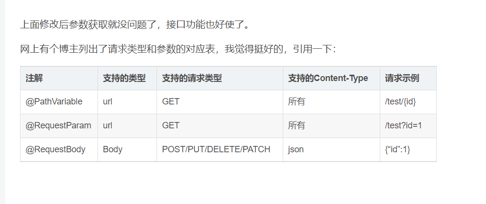

# Spring注解合集

## **@SpringBootApplication**：

### 包含了@ComponentScan、@Configuration和@EnableAutoConfiguration注解。

@ComponentScan让spring Boot扫描到Configuration类并把它加入到程序上下文。

**@Configuration** 等同于spring的XML配置文件；使用Java代码可以检查类型安全。

**@EnableAutoConfiguration** 自动配置。

**@ComponentScan** 组件扫描，可自动发现和装配一些Bean。

**@Component** 可配合CommandLineRunner使用，在程序启动后执行一些基础任务。

**@RestController** 注解是@Controller和@ResponseBody的合集,表示这是个控制器bean,并且是将函数的返回值直 接填入HTTP响应体中,是REST风格的控制器。

**@Autowired** 自动导入。

**@PathVariable** 获取参数。

**@JsonBackReference** 解决嵌套外链问题。

**@RepositoryRestResourcepublic** 配合spring-boot-starter-data-rest使用。

**@ResponseBody：**表示该方法的返回结果直接写入HTTP response body中

在使用@RequestMapping后，返回值通常解析为跳转路径，加上@responsebody后返回结果不会被解析为跳转路径，而是直接写入HTTP response body中。

**@Controller：**用于定义控制器类，在spring 项目中由控制器负责将用户发来的URL请求转发到对应的服务接口（service层）

**@RestController：**用于标注控制层组件(如struts中的action)，@ResponseBody和@Controller的合集。

**@RequestMapping：**提供路由信息，负责URL到Controller中的具体函数的映射。

**@EnableAutoConfiguration：** Spring Boot自动配置（auto-configuration）：尝试根据你添加的jar依赖自动配置你的Spring应用。

你可以将@EnableAutoConfiguration或者@SpringBootApplication注解添加到一个@Configuration类上来选择自动配置。

**@ComponentScan：** 表示将该类自动发现扫描组件。

个人理解相当于，如果扫描到有@Component、@Controller、@Service等这些注解的类，并注册为Bean，可以自动收集所有的Spring组件，包括@Configuration类。

我们经常使用@ComponentScan注解搜索beans，并结合@Autowired注解导入。可以自动收集所有的Spring组件，包括@Configuration类。

**@Import：** 用来导入其他配置类。

**@ImportResource：** 用来加载xml配置文件。

**@Autowired：** 自动导入依赖的bean

**@Service：** 一般用于修饰service层的组件

**@Repository：** 使用@Repository注解可以确保DAO或者repositories提供异常转译，这个注解修饰的DAO或者repositories类会被ComponetScan发现并配置，同时也不需要为它们提供XML配置项。

**@Bean：** 用@Bean标注方法等价于XML中配置的bean。

**@Value：** 注入Spring boot application.properties配置的属性的值。

**@Inject：** 等价于默认的@Autowired，只是没有required属性；

**@Component：** 泛指组件，当组件不好归类的时候，我们可以使用这个注解进行标注。

**@Bean：** 相当于XML中的,放在方法的上面，而不是类，意思是产生一个bean,并交给spring管理。

**@Qualifier：** 当有多个同一类型的Bean时，可以用@Qualifier(“name”)来指定。与@Autowired配合使用。@Qualifier限定描述符除了能根据名字进行注入，但能进行更细粒度的控制如何选择候选者，具体使用方式如下：

**@RequestMapping：**@RequestMapping(“/path”)表示该控制器处理所有“/path”的UR L请求。

**@RequestParam：** 用在方法的参数前面。

@RequestParam

String a =request.getParameter(“a”)。

**@PathVariable:** 路径变量。如

GetMapping设置多个路径

​    @GetMapping(value = {"/", "/main"})

## 导入其它模块的bean

```
@SpringBootApplication(scanBasePackages = {"com.example.revive", "com.example.service"})
```


## 与其它模块建立依赖

两个模块进行操作,要先建立依赖(POM文件中),如:revive模块要操作service的方法,


## @PostMapping

@PostMapping是@RequestMapping(method = RequestMethod.POST)缩写的组合注解，用于将 HTTP 的post 请求映射到特定处理程序的方法注解。

一般情况下我们开发可能都是用@RequestMapping,当然这样写的话也有弊端，笼统的全用@RequestMapping, 不便于其他人对代码的阅读和理解！

### 1.Object

前端传递参数如果是一个object的话,如{id:'1',name:'2222'}

后端参数接收的话，需要使用@RequestBody,requestBody里面放置的是一个实体类

```java
@PostMapping(value = "/generatedData")    
public Result<?> generatedData(@RequestBody ApplyObject applyObject){

}
```

### 2.拼接字符串

前端传递的参数如果是一个拼接的带?的字符串的话：如 xxx/generatedData?id=1&name=222

 后端的参数接收就需要使用 @RequestParam("id") String id,@RequestParam 加上问号后面对应的字段名称

```java
@PostMapping(value = "/generatedData")
public Result<?> generatedData( @RequestParam("id") String id, @RequestParam("name") String name) throws Exception {
   
    }
```


## @GetMapping

@GetMapping是@RequestMapping(method = RequestMethod.GET)缩写的组合注解，用于将 HTTP 的get 请求映射到特定处理程序的方法注解。

### 1.Object

前端传递参数如果是一个object的话,如{id:'1',name:'2222'}

后端参数接收的话，里面放置的是一个实体类

```java
		@GetMapping(value = "/generatedData")
    public Result<?> generatedData(ApplyObject applyObject) throws Exception {
       
    }
```

### 2.拼接字符串

前端传递的参数如果是一个拼接的带?的字符串的话：如 xxx/generatedData?id=1&name=222

后端的参数接收就需要使用 也是使用@RequestParam("id") String id   @RequestParam 加上问号后面对应的字段名称

```java
		@GetMapping(value = "/generatedData")
    public Result<?> generatedData( @RequestParam("id") String id, @RequestParam("name") String name) throws Exception {
   
    }
```

### 3.路径

前端传递的参数如果是一个拼接的带?的字符串的话：如 xxx/generatedData?/id=1/name=222

后端参数接收的话，需要使用@PathVariable String id  

```java
@GetMapping(value = "/generatedData/{id}/{name}")    
public Result<?> generatedData(@PathVariable("id") String id, @PathVariable("id") String name) throws Exception {          }


```

## 4.请求类型和参数的对应表



