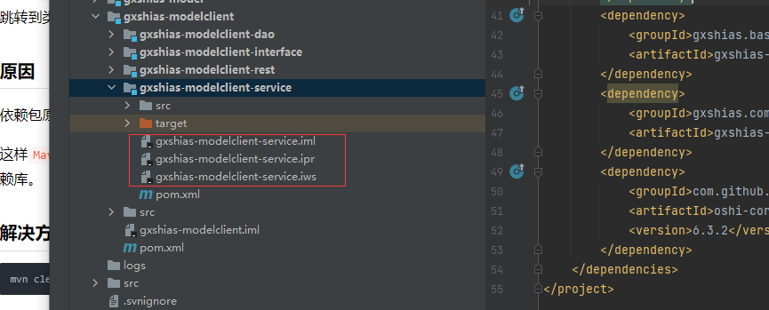
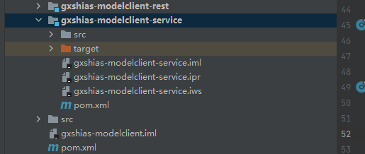

# SpringBoot遇到的问题:

## 1.bean无法注入

SpringBoot项目初始化:

新建一个空项目,在空项目里新建dubbo-service和dubbo-web模块.


首先将service的依赖注入到web模块的pom配置文件中

这样,web模块就能用service里的文件.

注意:web模块要想用使用service模块里的bean,要修改配置类参数

如,service模块配置类默认代码:


它,默认扫描的是配置文件所在包及以下即(com.example.dubboservice)

而web模块默认扫描com.example.dubboweb包,当把service模块导入到web模块时,会出现bean注入失败问题.

解决:https://www.cnblogs.com/liyhbk/p/14230975.html

方法一:将默认扫描包路径设为com.example

```java
@SpringBootApplication(scanBasePackages = {"com.example"})
```

方法二:将com.example.dubboservice路径添加到配置类中

```java
@SpringBootApplication(scanBasePackages = {"com.example.dubboservice","com.example.dubboweb"})
```

## 2.父工程

'packaging' with value 'jar' is invalid. Aggregator projects require 'pom' as packaging.


父工程需要这两个元素:

```xml
<modules>
    <module>logistics-common</module>
</modules>
<packaging>pom</packaging>
```

子模块需要绑定父工程:

```xml
    <parent>
        <artifactId>logistics-parent</artifactId>
        <groupId>com.example</groupId>
        <version>0.0.1-SNAPSHOT</version>
    </parent>
```


## 3.静态资源无法访问

情况1:添加了thymeleaf模板依赖,没配置好

添加如下配置即可.

```yaml
spring:
  thymeleaf:
    cache: false
    mode: LEGACYHTML5
    prefix: classpath:/templates/
    suffix: .html

  mvc:
    static-path-pattern: /static/**
```


## 4.测试时Bean无法注入问题

因为springboot项目要运行起来才能找到注入的bean,所以在测试类上需要加上@SpringBootTest注解


## 5.无法访问网页

情况一:加入了thymeleaf模板,需要配置视图解析器


```yaml
thymeleaf:
  prefix: classpath:/templates/
  suffix: .html
```

## 6.Mapper中bean找不到

二选一即可,

### 方式1.直接扫描mapper包

```java
@MapperScan("com/example/component/mapper")
```


### 2.加入注解

在每个mapper接口中加入@Mapper或@Repository  注解


## 7.MyBatis

springboot整合Mybatis提示org.apache.ibatis.binding.BindingException: Invalid bound statement (not found)

```xml
  <build>
    <plugins>
      <plugin>
        <groupId>org.springframework.boot</groupId>
        <artifactId>spring-boot-maven-plugin</artifactId>
      </plugin>
    </plugins>

    <resources>
      <resource>
        <directory>src/main/resources</directory>
      </resource>
      <resource>
        <targetPath>${basedir}/target/classes/com/hgh/springcloud/admin/dao</targetPath>
        <directory>src/main/java/com/hgh/springcloud/admin/dao</directory>
        <filtering>true</filtering>
        <includes>
          <include>**/*.xml</include>
        </includes>
      </resource>
    </resources>

  </build>


```

```xml
        <!--静态资源解析-->
        <resources>
            <resource>
                <directory>src/main/java</directory>
                <includes>
                    <include>**/*.xml</include>
                </includes>
            </resource>
        </resources>
```


静态文件扫描忘了加

```properties
mybatis.config-location=classpath:/mybatis-config.xml
mybatis.mapper-locations=classpath:**/dao/**.xml

```

配置文件(mybatis):

```yaml
mybatis:
  mapper-locations: classpath:com/example/backstage/mapper/xml/*.xml
  #配置映射类所在的包名
  type-aliases-package: com.example.backstage.entity
  configuration:
    map-underscore-to-camel-case: true
    log-impl: org.apache.ibatis.logging.stdout.StdOutImpl
    
    
```

mybatis-plus:

```yaml
mybatis-plus:
  mapper-locations: classpath:com/example/back_end/mapper/xml/*.xml
  configuration:
    map-underscore-to-camel-case: true
    log-impl: org.apache.ibatis.logging.stdout.StdOutImpl
```

文件路径忘了设置,设置完后build一下


之后在target中就能看到


## 8.springboot no tests were found

**springboot单元测试报错：no tests were found，如图所示**：
	**原因分析**：
		**1、进行单元测试的方法不能有返回值
			2、方法不能私有化。**

以上两个问题都会报　no tests were found　错误。


## 9.mybatisplus分页查询功能

https://blog.csdn.net/weixin_43771998/article/details/121066102


#### 第一种方式：

```java
//分页查询
Page<Employee> employees = employeeMapper.selectPage(new Page<>(3, 2), null);
System.out.println("数据为："+employees.getRecords());
System.out.println("总数为："+employees.getTotal()+",总页数为："+employees.getPages());
System.out.println("当前页为："+employees.getCurrent()+",每页限制："+employees.getSize());

```


展示了所有的数据，也没有总数，并没有分页的效果。

#### 第二种方式：

```java
//分页查询
Page<Employee> employees = employeeMapper.selectPage(new Page<>(3, 2), null);
Integer count = employeeMapper.selectCount(null);
employees.setTotal(count);
System.out.println("数据为："+employees.getRecords());
System.out.println("总数为："+employees.getTotal()+",总页数为："+employees.getPages());
System.out.println("当前页为："+employees.getCurrent()+",每页限制："+employees.getSize());

```

结果为：


虽然有了总数和总页数，但依然没有分页的效果。

#### 第三种方式：

```java
//分页查询
Page<Employee> employees = employeeMapper.selectPage(new Page<>(3, 2), null);
System.out.println("数据为："+employees.getRecords());
System.out.println("总数为："+employees.getTotal()+",总页数为："+employees.getPages());
System.out.println("当前页为："+employees.getCurrent()+",每页限制："+employees.getSize());

```

增加[Mybatis](https://so.csdn.net/so/search?q=Mybatis&spm=1001.2101.3001.7020)-Plus插件，

```java
import com.baomidou.mybatisplus.extension.plugins.PaginationInterceptor;
import org.springframework.context.annotation.Bean;
import org.springframework.context.annotation.Configuration;

/**
 * @description:
 * @author: HuaRunSheng
 * @date: 2022/5/4 10:29
 */
@Configuration
public class MyBatisPlusConfig {
    @Bean
    public PaginationInterceptor paginationInterceptor(){
        PaginationInterceptor page = new PaginationInterceptor();
        return page;
    }
}

```


终于分页了！！！

#### 方式四:

自己写SQL语句:

SELECT id,name,type,size,url,md5,is_delete,enable FROM sys_file LIMIT ?,?


## 10.Vue跨域问题

```java
package com.example.backstage.config;

import org.springframework.context.annotation.Configuration;
import org.springframework.web.servlet.config.annotation.CorsRegistry;
import org.springframework.web.servlet.config.annotation.WebMvcConfigurer;

/**
 * @description: 前端跨域问题处理
 * @author: HuaRunSheng
 * @date: 2022/5/16 11:31
 */
@Configuration
public class WebConfig implements WebMvcConfigurer {
    @Override
    public void addCorsMappings(CorsRegistry registry) {
        registry
                //允许访问的路径
                .addMapping("/**")
                //配置请求来源
                .allowedOrigins("http://localhost:8080")
                //允许跨域访问的方法
                .allowedMethods("GET","POST","DELETE","PUT","OPTION")
                //是否允许请求头
                .allowCredentials(true)
                //最大响应时间
                .maxAge(3600);

        WebMvcConfigurer.super.addCorsMappings(registry);
    }
}

```


## 10.vue post 接收

### 后端代码:

```
// 不要写@RequestParam,不然前端传过来的对象名一定要obj名字
@PostMapping("/save")
public String saveData( Course obj){
    System.out.println("obj: "+obj);
    System.out.println("");
    //Course course= (Course) obj;
    //System.out.println("course: "+course);
    return "success";
}
```


### vue:

```
obj:{
  // id:1,
  name:"机器学习",
  score:90,
  times:"30",
  // state:false,
  teacherId:10
},
```

#### 方式一:

```
axios({
  url: fieldUrl,
  method: "post",
  params:  {
    obj:{
      name:"机器学习",
      score:90,
      times:"30",
      teacher_id:10
    }
  },
}).then((res) => {
  if (res.data.status == 200) {
    alert("测试用例更新成功");
  }
})
```

#### 方式二:

```
axios({
  method: "post",
  url: fieldUrl,
  data: this.obj,
  transformRequest: [function (obj) {
    return Qs.stringify(obj) //使用Qs将请求参数序列化
  }],
  headers: {
    'Content-Type': 'application/x-www-form-urlencoded' //必须设置传输方式
  }
}).then((res) => {
  console.log(res.data)
  //逻辑代码
})
```

也可以少参数:


## 11.postman post请求

请求体(Body)为raw+json:

请求表单数据为:

```json
{
    "username": "root",
    "password": "123456"
}
```


后端接收时要用@RequestBody:

```java
public ResultUtil login(@RequestBody UserLoginVo userLoginVo){
    return userService.login(userLoginVo);
}
```


## 12.无法注入

Could not autowire.No beans of ‘ ‘ type found


https://blog.csdn.net/loler15/article/details/114924159

### 解决1:启动类位置
	启动类一般要放在最外层的根目录位置
	这样才能扫到同级别以及子级的
	类可以查看本地启动类放置位置


同上图，如果你的类放在gdcp包外，启动类是扫描不到的

解决方法 ：将启动类或者要注入的类放到启动类的同级或子级包内


### 解决2:降低Bean的安全级别

此问题是建立在：**程序能正常运行，但是依旧有红色波浪线报错，但是无影响**单纯是看红色碍眼


降低安全级别后，恢复正常
**此问题是Spring扫描问题，不造成太大影响**

### 解决3：将@Autowired改为@Resource

两个注解的区别是一个是@Autowired是Spring，@Resource是J2EE的
使用@Resource能减少Spring耦合度
**@AutoWried按by type自动注入**，**而@Resource默认按byName自动注入。**
@Resource的查询注入顺序是，去Bean中查找Name，如果查不到就去查Class，其次再从属性去查找，如果我们定义的类中有相同的Name可能会报错，因为查询到了多个。


# Java xx包不存在

xx包已经导入,没有报红,且本地有这个依赖

https://www.zhangbj.com/p/1213.html

定位到所在模块,将imi文件删除



在该路径终端下执行下面命令

`-U`：强制更新。

`-e`：详细异常。

```cmd
mvn clean install -U -e 
```

再执行

```cmd
mvn -U idea:idea
```

就会重新生成imi文件



