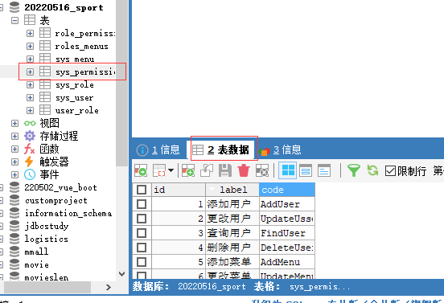

# MySQL

创建表之前,分析数据结构,如:


## 1.新建数据库

使用SQLyog,右击localhost:


输入数据库基本信息:


## 2.新建表

### 2.1.定位到数据库中

```mysql
USE `20220516_sport`;
```

### 2.2.判断表是否存在

```mysql
DROP TABLE IF EXISTS `sys_user`;
```

### 2.3.新建表

```mysql
# 定位到数据库中
USE `20220516_sport`;
# 判断表是否存在
DROP TABLE IF EXISTS `sys_user`;
# 新建用户表
CREATE TABLE sys_user(
  `id` BIGINT(10) NOT NULL PRIMARY KEY AUTO_INCREMENT COMMENT'编号',
  `username` VARCHAR(20) COMMENT'登录名',
  `password` VARCHAR(20) COMMENT'密码',
  `nick_name` VARCHAR(30) COMMENT'昵称',
  `sex` TINYINT(1) COMMENT'性别(0男,1女,2未知)',
  `avatar` VARCHAR(100) COMMENT'用户头像',
  `address` VARCHAR(100) COMMENT'地址'
)ENGINE=INNODB DEFAULT CHARSET=utf8;

-- 创建角色表
DROP TABLE IF EXISTS `sys_role`;
CREATE TABLE sys_role(
  `id` BIGINT(20) NOT NULL PRIMARY KEY AUTO_INCREMENT COMMENT'编号',
  `lable` VARCHAR(50) COMMENT'角色描述',
  `code` VARCHAR(10) COMMENT'角色对应的标签值' 
)ENGINE=INNODB DEFAULT CHARSET=utf8;

-- 创建用户和角色关联表
DROP TABLE IF EXISTS `user_role`;
-- 尽量不适用外键,可能会出现问题
CREATE TABLE `user_role`(
  `user_id` BIGINT(20) COMMENT'用户ID',
  `role_id` BIGINT(20) COMMENT'角色ID'
)ENGINE=INNODB DEFAULT CHARSET=utf8;

-- 创建数据权限表
DROP TABLE IF EXISTS `sys_permission`;
CREATE TABLE `sys_permission`(
  `id` BIGINT(20) NOT NULL PRIMARY KEY AUTO_INCREMENT COMMENT'编号',
  `lable` BIGINT(50) COMMENT'权限标签',
  `code` VARCHAR(20) COMMENT'数据权限标签值'
)ENGINE=INNODB DEFAULT CHARSET=utf8;

-- 创建权限与角色的关系表
DROP TABLE IF EXISTS `role_permission`;
CREATE TABLE `role_permission`(
  `role_id` BIGINT(20) COMMENT'角色ID',
  `permission_id` BIGINT(20) COMMENT'权限ID'
)ENGINE=INNODB DEFAULT CHARSET=utf8;

-- 创建菜单表
DROP TABLE IF EXISTS `sys_menu`;
CREATE TABLE `sys_menu`(
  `id` BIGINT(20) NOT NULL PRIMARY KEY AUTO_INCREMENT COMMENT'编号',
  `path` VARCHAR(100) COMMENT'菜单路径',
  `icon` VARCHAR (100) COMMENT'图标路径',
  `title` VARCHAR(50) COMMENT'菜单名称',
  `component` VARCHAR(50) COMMENT'菜单主键',
  `parent_id` BIGINT(20) COMMENT'父级菜单'
)ENGINE=INNODB DEFAULT CHARSET=utf8;

-- 创建角色和菜单权限表
DROP TABLE IF EXISTS `roles_menus`;
CREATE TABLE `roles_menus`(
  `role_id` BIGINT(20) COMMENT'角色ID',
  `menu_id` BIGINT(20) COMMENT'菜单ID'
)ENGINE=INNODB DEFAULT CHARSET=utf8;
```


## 3.给表添加数据

表结构:

```mysql
CREATE TABLE `teacher` (
  `id` INT(10) NOT NULL,
  `name` VARCHAR(30) DEFAULT NULL,
  PRIMARY KEY (`id`)
) ENGINE=INNODB DEFAULT CHARSET=utf8
```

添加数据语句:

```mysql
INSERT INTO teacher(`id`, `name`) VALUES (1, '秦老师'); 
```

也可直接:

```mysql
INSERT INTO `teacher` VALUES (1, '秦老师'); 
```

添加多条数据:

```mysql
INSERT INTO teacher(`id`, `name`) VALUES (1, '秦老师'),(2, '刘老师'),(3, '张老师'); 
```

## 3.查询表

```mysql
SELECT * FROM `sys_menu`;
```

## 4.根据Id查询

```
select * from sys_permission where id=#{id};
```


# 查询操作

以sys_permission表为例:



## 1.查询所有

```java
// 查找所有
    List<SysPermission> findAll();
```

查询参数为空,查询结果是SysPermission

```xml
    <select id="findAll" resultType="com.example.backstage.entity.SysPermission">
        select * from sys_permission;
    </select>
```

## 2.根据Id查询

```java
    // 根据Id查询权限信息
    SysPermission findById(int id);
```

查询参数是int,查询结果是SysPermission

```
<select id="findById" parameterType="int" resultType="com.example.backstage.entity.SysPermission">
    select * from sys_permission where id=#{id};
</select>
```

## 3.分页查询

```java
    /**
     * 分页查询
     * @param pageNo: 第几页
     * @param pageSize: 一页有几条数据
     * @return : 返回权限列表
     */
    List<SysPermission> findPage(int pageNo, int pageSize);
```


```xml
    <select id="findPage" resultType="com.example.backstage.entity.SysPermission">
        select * from sys_permission limit #{pageNo}, #{pageSize};
    </select>
```

## 4.模糊查询like

```java
    /**
     * 模糊查询
     * @param info: 要查询的信息
     * @return
     */
    List<SysPermission> findByInfo(String info);
```

```xml
    <select id="findByInfo" resultType="com.example.backstage.entity.SysPermission">
        select * from sys_permission
        <if test="info != null and info.length > 0">
--         concat: 自带的字符串拼接函数, % 代表匹配所有字符,且字符长度不固定
            where label like concat('%', #{info}, '%') or code like concat('%', #{info}, '%')
        </if>
    </select>
```

## 5.插入数据

```java
    // 添加权限
    void insert(SysPermission sysPermission);
```

```xml
    <insert id="insert" parameterType="com.example.backstage.entity.SysPermission">
        insert into sys_permission(`label`, `code`) values (#{label}, #{code});
    </insert>

```

## 6.修改数据

```java
// 更改权限
    void update(SysPermission sysPermission);
```

```xml
    <update id="update" parameterType="com.example.backstage.entity.SysPermission">
        update sys_permission permission
--         set用来连接if语句内的表达式,注释--得在开头不然会报错
        <set>
            <if test="label != null">
                permission.label=#{label},
            </if>
            <if test="code != null">
                permission.code = #{code}
            </if>
        </set>
        where id=#{id}
    </update>
```

## 7.删除数据

```java
    // 删除权限
    void delete(int id);
```

```xml
<delete id="delete">
        delete from sys_permission where id = #{id};
    </delete>
```


