# MQ安装及其使用


## 安装

https://blog.csdn.net/limingqiang007/article/details/126486368

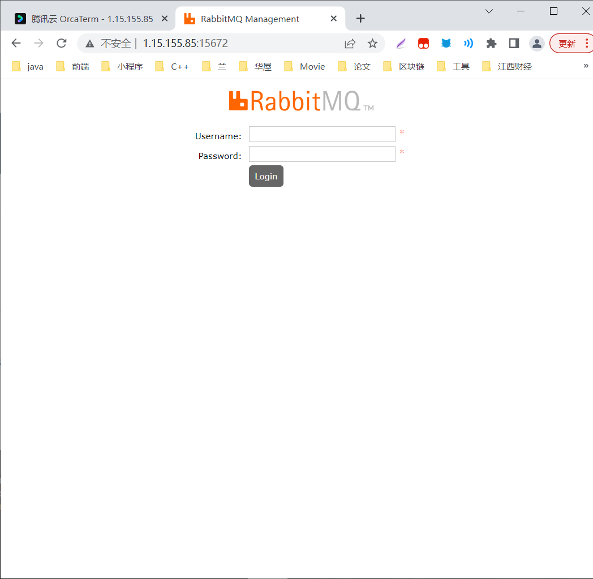


开机自启动:https://blog.csdn.net/weixin_42166515/article/details/125529010

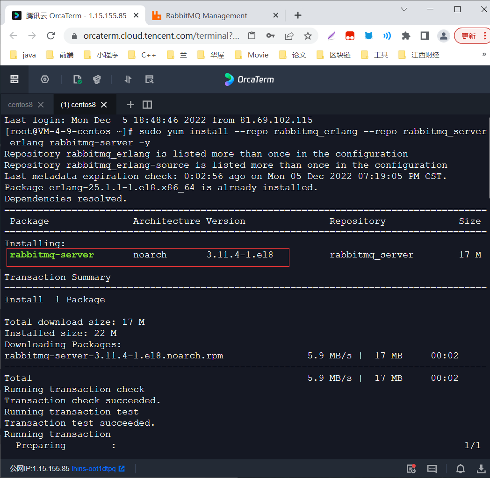

按i编辑,esc退出编辑,:wq保存

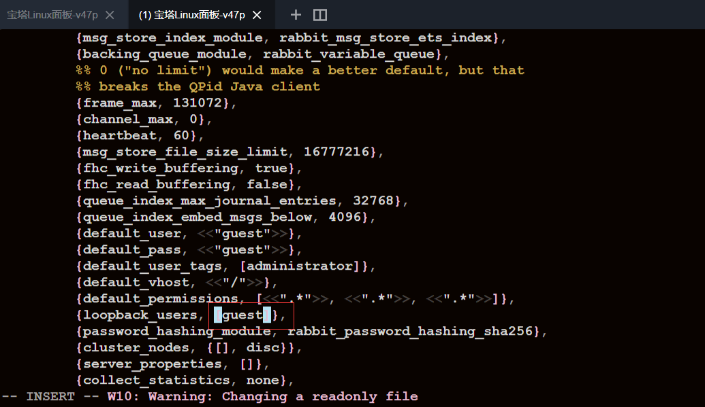


## 使用

因为是centos8,开启命令与centos不同

开启:systemctl start rabbitmq-server

停止:systemctl stop rabbitmq-server

重启:systemctl restart rabbitmq-server

状态:systemctl status rabbitmq-server.service

查看进程:ps -ef | grep rabbitmq

查看占用的端口:

```txt
lsof -i | grep rabbit
# 或者
netstat -tunlp | grep rabbitmq
```

启用网页管理:

```txt
rabbitmq-plugins enable rabbitmq_management
```

## 3.问题

### 1.外网访问不了

内网能访问,外网访问不了,大概率是服务器的防火墙问题

关闭防火墙

https://blog.csdn.net/qq_33468857/article/details/124588889

*Centos8关闭防火墙*

systemctl status firewalld.service（查看防火墙状态）

active表示当前防火墙处于开启状态 inactive表示关闭状态

systemctl stop firewalld.service （关闭防火墙）

systemctl start firewalld.service （开启防火墙）

systemctl disable firewalld.service （禁止防火墙自启动）

systemctl enable firewalld.service （防火墙随系统开启启动）


开启端口

https://blog.csdn.net/weixin_42362496/article/details/103383501

1.使用命令 firewall-cmd --state查看防火墙状态。得到结果是running或者not running

2.在running 状态下，向firewall 添加需要开放的端口
命令为 firewall-cmd --permanent --zone=public --add-port=8080/tcp //永久的添加该端口。去掉–permanent则表示临时。

4.firewall-cmd --reload //加载配置，使得修改有效。

5.使用命令 firewall-cmd --permanent --zone=public --list-ports //查看开启的端口，出现8080/tcp这开启正确

6.再次使用外部浏览器访问，这出现tomcat的欢迎界面。


# MQ学习代码

## 0.新建项目

新建空白module -- rabbitmq,并删掉src文件夹

在rabbitmq下面在新建一个module-- mode1-helloworld,为模式1

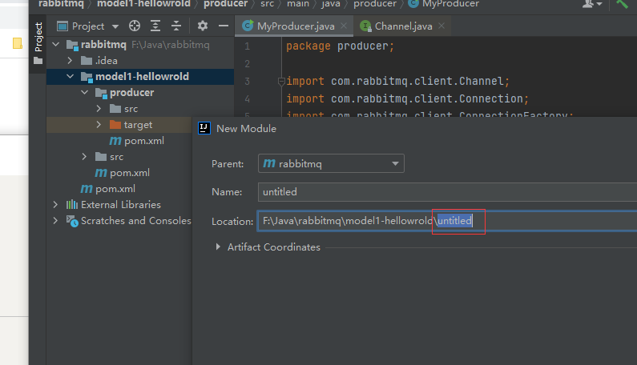

在mode1-helloworld下面再新建一个module-- producer,为简单队列模式的生产者

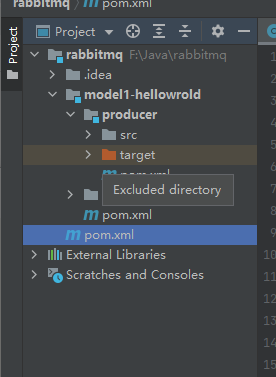


## 1.六种模式

https://rabbitmq.com/getstarted.html

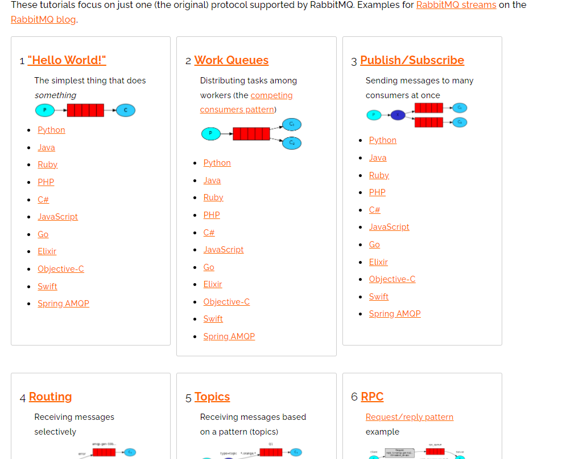


## 2.Hello World模式-简单队列模式

https://rabbitmq.com/tutorials/tutorial-one-java.html

![(P) -> [|||] -> (C)](https://rabbitmq.com/img/tutorials/python-one.png)


### 1.引入依赖

```xml
        <dependency>
            <groupId>com.rabbitmq</groupId>
            <artifactId>amqp-client</artifactId>
            <version>5.10.0</version>
        </dependency>
```

### 2.编写生产者


```java
package producer;

import com.rabbitmq.client.Channel;
import com.rabbitmq.client.Connection;
import com.rabbitmq.client.ConnectionFactory;

import java.io.IOException;
import java.nio.charset.StandardCharsets;
import java.util.concurrent.TimeoutException;

/**
 * @author HuaRunSheng
 * @date 2022/12/6 14:22
 * @description :hello world队列模式(简单队列模式的生产者)
 */
public class MyProducer {
    public static  final String QUEUE_NAME="my_queue";
    public static void main(String[] args) throws IOException, TimeoutException {

        //1.获取连接工厂
        ConnectionFactory factory = new ConnectionFactory();
        //设置服务器ip地址
        factory.setHost("1.15.155.85");
        //设置端口号
        factory.setPort(5672);
        //设置虚拟机
        factory.setVirtualHost("/test1");
        //设置用户名和密码
        factory.setUsername("admin");
        factory.setPassword("123456");

        //2.从连接工厂获得连接对象
        Connection connection = factory.newConnection();
        //3.获得Channel,用于之后的发送消息的对象
        Channel channel = connection.createChannel();
        //4.声明队列(如果队列不存在则创建队列,如果队列存在则使用队列)
        /**
         * queue: 队列的成名 the name of the queue
         * durable: 是否持久化,即存储到硬盘 true if we are declaring a durable queue
         * exclusive: 是否独占: 是否只给当前客户端来使用
         * autoDelete: 是否自动删除
         * arguments: 用于描述队列的其他数据
         */
        channel.queueDeclare(QUEUE_NAME, false, false, false, null);
        //5.发送消息
        StringBuilder message=new StringBuilder("hello rabbitmq!");
        //6.发送消息
        /**
         * Publish a message.
         * @param exchange-交换机,HelloWorld模式交换机为空字符串"",不能是null the exchange to publish the message to
         * @param routingKey:路由键 当exchange是空的时候,此时routingkey==队列的名称 the routing key
         * @param mandatory 强制的 true if the 'mandatory' flag is to be set
         * @param immediate true if the 'immediate' flag is to be
         * set. Note that the RabbitMQ server does not support this flag.
         * @param props other properties for the message - routing headers etc
         * @param body the message body
         * @throws IOException if an error is encountered
         */
        channel.basicPublish("", QUEUE_NAME,null,message.toString().getBytes(StandardCharsets.UTF_8));
        System.out.println("发送完毕");
        //7.断开连接
        channel.close();
        connection.close();

    }
}

```

发送了三次:

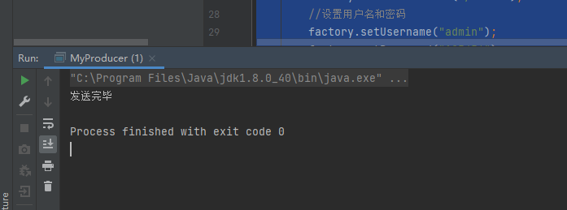


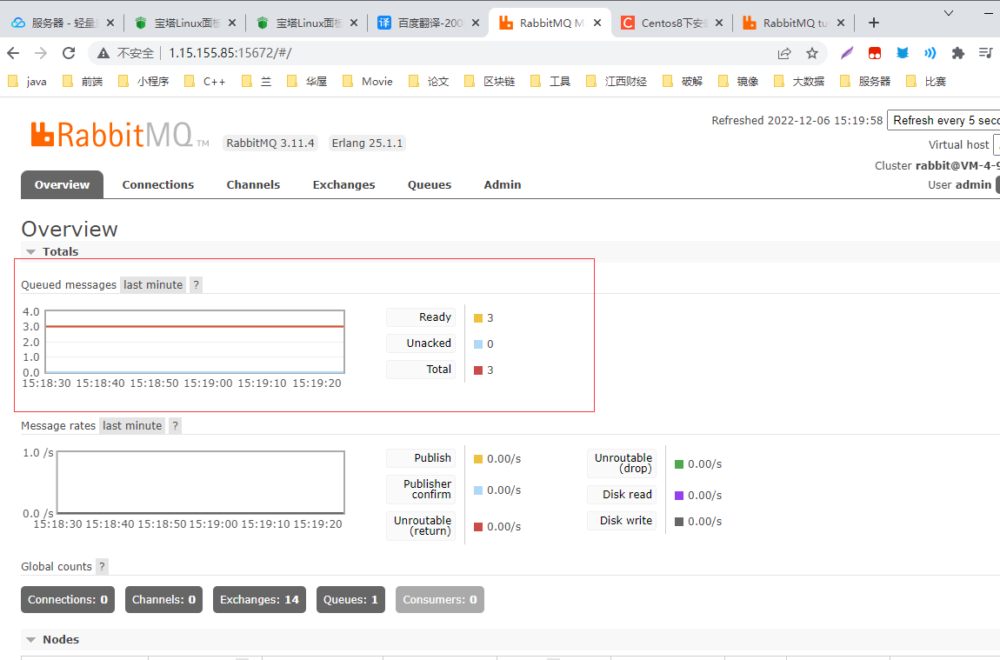

由图可知,共有三条消息为消费

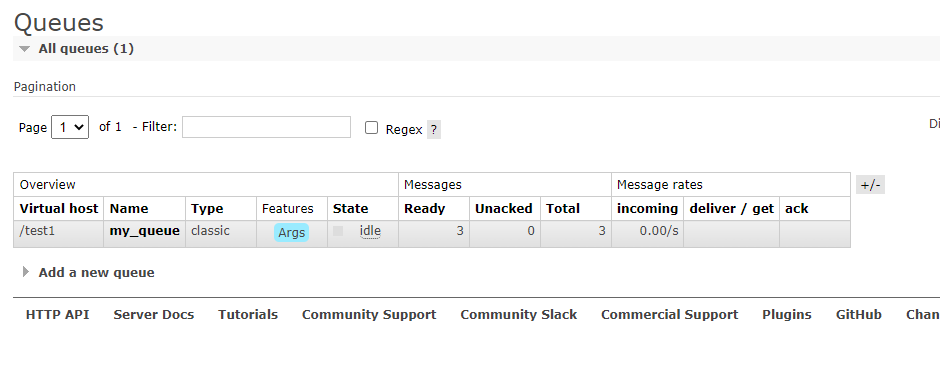


### 3.编写消费者


```java
package com.qf.consumer;

import com.rabbitmq.client.*;

import java.io.IOException;
import java.util.concurrent.TimeoutException;

/**
 * @author HuaRunSheng
 * @date 2022/12/6 15:29
 * @description :简单工厂模式消费者
 */
public class MyConsumer {
    public static  final String QUEUE_NAME="my_queue";

    public static void main(String[] args) throws IOException, TimeoutException {
        //1.获取连接工厂
        ConnectionFactory factory = new ConnectionFactory();
        //设置服务器ip地址
        factory.setHost("1.15.155.85");
        //设置端口号
        factory.setPort(5672);
        //设置虚拟机
        factory.setVirtualHost("/test1");
        //设置用户名和密码
        factory.setUsername("admin");
        factory.setPassword("123456");

        //2.从连接工厂获得连接对象
        Connection connection = factory.newConnection();
        //3.获得Channel
        Channel channel=connection.createChannel();
        //4.创建一个Consumer对象,指明具体处理消息的程序
        Consumer consumer = new DefaultConsumer(channel){
            //具体处理消息

            /**
             * @param consumerTag the <i>consumer tag</i> associated with the consumer
             * @param envelope packaging data for the message
             * @param properties content header data for the message
             * @param body:消息本体 the message body (opaque, client-specific byte array)
             * @throws IOException
             */
            @Override
            public void handleDelivery(String consumerTag,
                                       Envelope envelope,
                                       AMQP.BasicProperties properties,
                                       byte[] body) throws IOException {
                System.out.println("获取到消息: " + new String(body));
            }
        };


        /*5.设置消费者监听某个队列
         * @param queue:指定监听的队列 the name of the queue
         * @param autoAck:是否自动签收,默认不签收 true if the server should consider messages
         * acknowledged once delivered; false if the server should expect
         * explicit acknowledgements
         * @param consumer:消费者处理方法 
         */
        
        channel.basicConsume(QUEUE_NAME, consumer);
    }
}

```

消费者可以不关闭,有消息时消费,没有消息时等待

消费者处理消息的方法要重写

```java
 //4.创建一个Consumer对象,指明具体处理消息的程序
        Consumer consumer = new DefaultConsumer(channel){
            //具体处理消息

            /**
             * @param consumerTag the <i>consumer tag</i> associated with the consumer
             * @param envelope packaging data for the message
             * @param properties content header data for the message
             * @param body:消息本体 the message body (opaque, client-specific byte array)
             * @throws IOException
             */
            @Override
            public void handleDelivery(String consumerTag,
                                       Envelope envelope,
                                       AMQP.BasicProperties properties,
                                       byte[] body) throws IOException {
                System.out.println("获取到消息: " + new String(body));
            }
        };
```

消费者不自动签收消息,如这里消息都处理完了

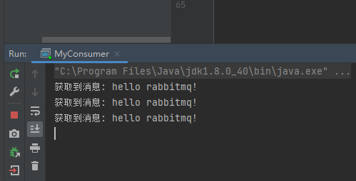


但是还有三个消息未签收,未签收的消息可以再次处理

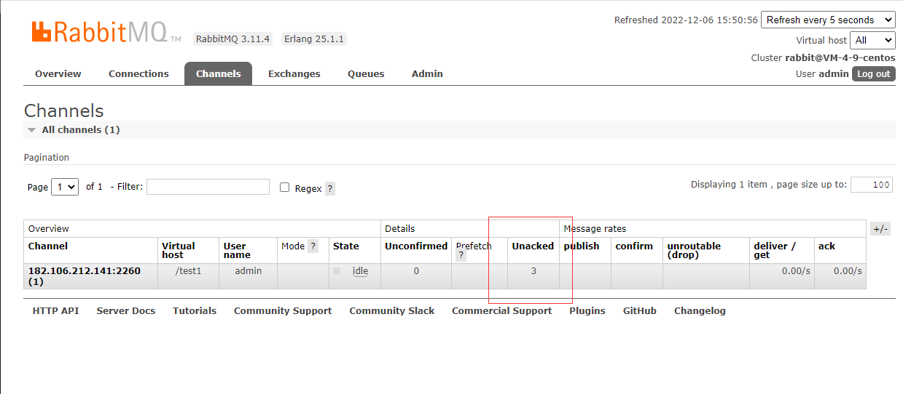


开启自动签收:

```java
channel.basicConsume(QUEUE_NAME, true, consumer);
```

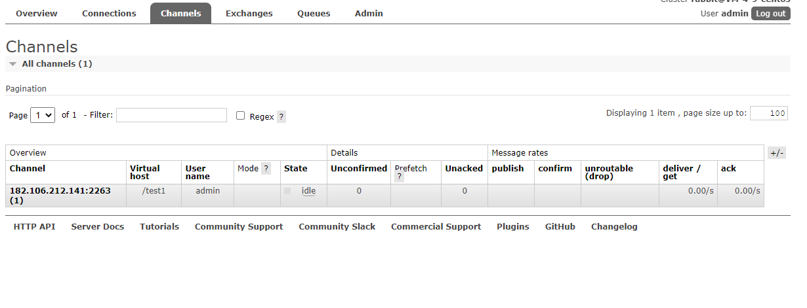

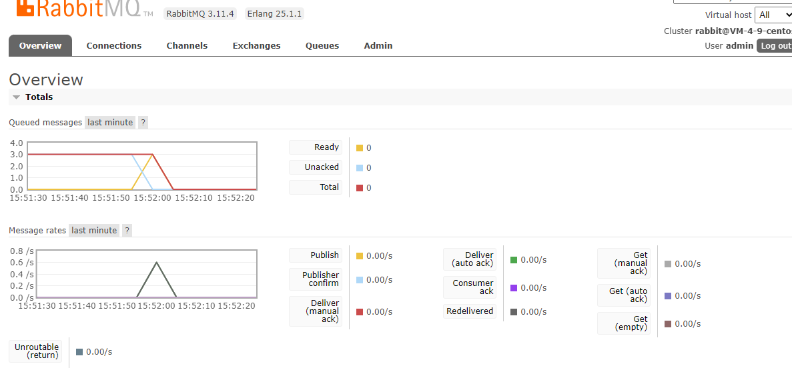


也可以用表达式方式进行消费

```java
        //方式二, 用表达式方式
        DeliverCallback deliverCallback=((consumerTag, message) -> {
            //处理消息内容
            System.out.println(new String(message.getBody()));
        });
        channel.basicConsume(QUEUE_NAME, true, deliverCallback,consumerTag -> {});
```

### 4.简单队列模式的问题

当多个消费者消费同⼀个队列时。这个时候rabbitmq的公平调度机制就开启了，于是，⽆论消费者的消费能⼒如何，每个消费者都能公平均分到相同数量的消息，⽽不能出现能者多劳的情况。  

如图:consumer1还在慢慢消费,而consumer已经消费完了


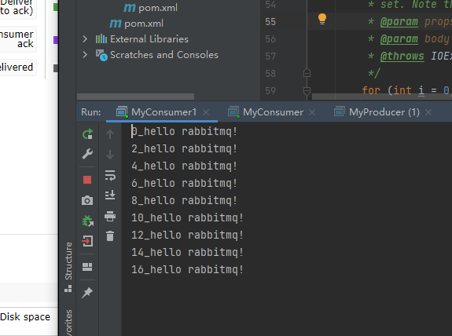


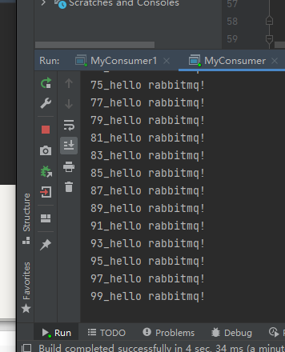


因为简单队列模式采用自动签收,一有消息送过来就签收,即使没处理完,采用先签收再处理方式

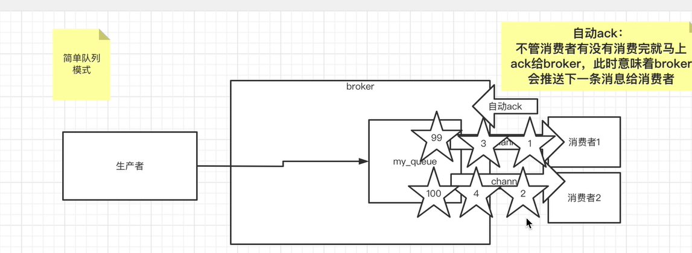


## 3.工作者模式

即能者多劳模式,将自动签收改为手动签收即可

消费者代码

```java
      
        //声明一次只接受一条消息
        channel.basicQos(1);//方式二, 用表达式方式
        DeliverCallback deliverCallback=((consumerTag, message) -> {
            try {
                Thread.sleep(300);
            } catch (InterruptedException e) {
                e.printStackTrace();
            }
            //处理消息内容
            System.out.println(new String(message.getBody()));
            //手动ack,消息的ID:message.getEnvelope().getDeliveryTag(),是否要批量签收,一次处理多条消息可以设置未true
            channel.basicAck(message.getEnvelope().getDeliveryTag(), false);
        });
        //不自动签收
        channel.basicConsume(QUEUE_NAME, false, deliverCallback,consumerTag -> {});
```


```java
package mode2_work.consumer;

import com.rabbitmq.client.Channel;
import com.rabbitmq.client.Connection;
import com.rabbitmq.client.ConnectionFactory;
import com.rabbitmq.client.DeliverCallback;

import java.io.IOException;
import java.util.concurrent.TimeoutException;

/**
 * @author HuaRunSheng
 * @date 2022/12/6 20:02
 * @description :
 */
public class WorkConsumer {
    public static  final String QUEUE_NAME="my_work_queue";

    public static void main(String[] args) throws IOException, TimeoutException {
        //1.获取连接工厂
        ConnectionFactory factory = new ConnectionFactory();
        //设置服务器ip地址
        factory.setHost("1.15.155.85");
        //设置端口号
        factory.setPort(5672);
        //设置虚拟机
        factory.setVirtualHost("/test1");
        //设置用户名和密码
        factory.setUsername("admin");
        factory.setPassword("123456");

        //2.从连接工厂获得连接对象
        Connection connection = factory.newConnection();
        //3.获得Channel
        Channel channel=connection.createChannel();
        //声明一次只接受一条消息
        channel.basicQos(1);


        //方式二, 用表达式方式
        DeliverCallback deliverCallback=((consumerTag, message) -> {
            try {
                Thread.sleep(300);
            } catch (InterruptedException e) {
                e.printStackTrace();
            }
            //处理消息内容
            System.out.println(new String(message.getBody()));
            //手动ack,消息的ID:message.getEnvelope().getDeliveryTag(),是否要批量签收,一次处理多条消息可以设置未true
            channel.basicAck(message.getEnvelope().getDeliveryTag(), false);
        });
        //不自动签收
        channel.basicConsume(QUEUE_NAME, false, deliverCallback,consumerTag -> {});
    }
}

```


## 4.发布订阅者模式

对于之前的队列模式，是没有办法解决⼀条消息同时被多个消费者消费。于是使⽤发布订阅模式来实现。  

即只要订阅了某个交换机,就能接收到交换机里的所有消息.相当与订报纸一样,而且队列名称唯一,如果多个程序使用同一个队列名,会按简单队列处理.所以**要想每个程序都收到所有消息,队列名要一样**

创建交换机时,交换机类型设置为fanout模式


## 5.路由模式

在发布订阅者模式上增加了routingkey,指定消费者订阅

交换机的类型为direct

生产者

```java
package mode4_routing;

import com.rabbitmq.client.Channel;
import com.rabbitmq.client.Connection;
import util.RabbitUtil;

import java.io.IOException;
import java.nio.charset.StandardCharsets;
import java.util.concurrent.TimeoutException;

/**
 * @author HuaRunSheng
 * @date 2022/12/8 11:02
 * @description :路由模式的生产者
 * 交换机为direct
 * 且有路由
 */
public class MyProducer {
    private static final String EXCHANGE_NAME="my_route_exchange";
    private static final String ROUTING_KEY="apple";
    public static void main(String[] args) throws IOException, TimeoutException {
        //1.获得connection和channel
        Connection connection = RabbitUtil.getConnection();
        Channel channel = connection.createChannel();
        // 声明交换机为路由模式
        channel.exchangeDeclare(EXCHANGE_NAME, "direct");
        for (int i=0;i<10;i++) {
            //3.发送消息
            String message = "apple_message";
            channel.basicPublish(EXCHANGE_NAME, ROUTING_KEY, null, message.getBytes(StandardCharsets.UTF_8));
        }

        //关闭连接
        channel.close();
        connection.close();
    }
}

```


消费者0:

```java
package mode4_routing;

import com.rabbitmq.client.*;
import util.RabbitUtil;

import java.io.IOException;
import java.nio.charset.StandardCharsets;
import java.util.concurrent.TimeoutException;

/**
 * @author HuaRunSheng
 * @date 2022/12/8 13:10
 * @description :
 */
public class MyConsumer {
    private static final String EXCHANGE_NAME="my_route_exchange";
    private static final String ROUTING_KEY="apple";
    private static final String QUEUE_NAME="route_queue0";
    public static void main(String[] args) throws IOException, TimeoutException {
        //1.获得connection和channel
        Connection connection = RabbitUtil.getConnection();
        Channel channel = connection.createChannel();
        // 声明交换机为路由模式,与生产者一样
        channel.exchangeDeclare(EXCHANGE_NAME, "direct");
        //声明队列
        channel.queueBind(QUEUE_NAME, EXCHANGE_NAME, ROUTING_KEY);
        //创建消费者
        Consumer consumer=new DefaultConsumer(channel){
            @Override
            public void handleDelivery(String consumerTag, Envelope envelope, AMQP.BasicProperties properties, byte[] body) throws IOException {
                System.out.println("consumer0: "+new String(body));
            }
        };
        //6.消费者监听队列
        channel.basicConsume(QUEUE_NAME, consumer);


    }
}

```


消费者1:

```java
package mode4_routing;

import com.rabbitmq.client.*;
import util.RabbitUtil;

import java.io.IOException;
import java.util.concurrent.TimeoutException;

/**
 * @author HuaRunSheng
 * @date 2022/12/8 13:20
 * @description :
 */
public class MyConsumer1 {
    private static final String EXCHANGE_NAME="my_route_exchange";
    // 路由决定了能否订阅到消息,生产者指定路由为apple
    private static final String ROUTING_KEY="orange";
    private static final String QUEUE_NAME="route_queue1";
    public static void main(String[] args) throws IOException, TimeoutException {
        //1.获得connection和channel
        Connection connection = RabbitUtil.getConnection();
        Channel channel = connection.createChannel();
        // 声明交换机为路由模式,与生产者一样
        channel.exchangeDeclare(EXCHANGE_NAME, "direct");
        //声明队列
        channel.queueBind(QUEUE_NAME, EXCHANGE_NAME, ROUTING_KEY);
        //创建消费者
        Consumer consumer=new DefaultConsumer(channel){
            @Override
            public void handleDelivery(String consumerTag, Envelope envelope, AMQP.BasicProperties properties, byte[] body) throws IOException {
                System.out.println("consumer1: "+new String(body));
            }
        };
        //6.消费者监听队列
        channel.basicConsume(QUEUE_NAME, consumer);


    }
}

```

## 6.topic模式

在路由的模式上,增加了正则匹配路由

在routing模式的基础上，对routing-key使⽤了通配符，提⾼了匹配的范围，增加了可玩性。  

```txt
- *.orange.*
- *.*.rabbit 只⽀持单层级
- lazy.# 可以⽀持多层级的routing-key
```

绑定关系中如果使⽤了product.* ,那么在发送消息时：

```txt
product ok
product.add ok
product.del ok
product.add.one 不ok  
```

绑定关系中如果使⽤了product.#,那么在发送消息时：

```txt
product ok
product.add ok
product.add.one ok  
```

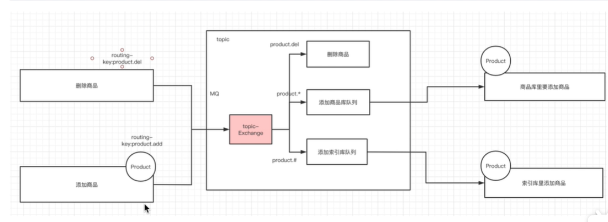

 注意:routekey避免使用user.xx,会使匹配无效

F:\Java\rabbitmq\src\main\java\mode5_topic

producer代码:

```java
package mode5_topic;

import com.rabbitmq.client.Channel;
import com.rabbitmq.client.Connection;
import util.RabbitUtil;

import java.io.IOException;
import java.nio.charset.StandardCharsets;
import java.util.concurrent.TimeoutException;

/**
 * @author HuaRunSheng
 * @date 2022/12/8 13:38
 * @description :
 */
public class MyProducer {
    //定义交换机名称
    private static final String EXCHANGE_NAME="topic_exchange1";
    //ROUTING_KEYS不能是user.... 尽量不免user作为开头
    private static final String[] ROUTING_KEYS={"product.add", "product.add.tom", "product.delete", "product.delete.tom"};

    public static void main(String[] args) throws IOException, TimeoutException {
        Connection connection = RabbitUtil.getConnection();
        Channel channel = connection.createChannel();
        //1.声明交换机
        channel.exchangeDeclare(EXCHANGE_NAME, "topic", true);
        for (int i = 0; i < 10; i++) {
            String message="test"+i+"_"+ROUTING_KEYS[i%4];
            //2.发送消息
            channel.basicPublish(EXCHANGE_NAME, ROUTING_KEYS[i%4], null, message.getBytes(StandardCharsets.UTF_8));
        }
        //3.关闭连接
        channel.close();
        connection.close();
    }
    
}

```

consumer 消费者:

```java
package mode5_topic;

import com.rabbitmq.client.*;
import util.RabbitUtil;

import java.io.IOException;
import java.util.concurrent.TimeoutException;

/**
 * @author HuaRunSheng
 * @date 2022/12/8 13:38
 * @description :
 */
public class MyConsumer {
    //定义交换机名称
    private static final String EXCHANGE_NAME="topic_exchange1";
    //定义交换机名称
    private static final String QUEUE_NAME="topic_queue";
    //定义user路由
    private static final String ROUTING_USER="product.#";
    //定义add和delete路由
    private static final String ROUTING_ADD_and_DELETE="product.*";
    //定义add.xxx路由
    private static final String ROUTING_ADD_XX="product.add.*";

    public static void main(String[] args) throws IOException, TimeoutException {
        Connection connection = RabbitUtil.getConnection();
        Channel channel = connection.createChannel();
        //声明交换机
        channel.exchangeDeclare(EXCHANGE_NAME, "topic", true);
        //1.声明队列
        channel.queueDeclare(QUEUE_NAME, false, false,false, null);
        //2.绑定队列
        //user.#: 所有user...的路由都能匹配
        //channel.queueBind(QUEUE_NAME, EXCHANGE_NAME, ROUTING_USER);
        //只能匹配user.add或user.delete
        //channel.queueBind(QUEUE_NAME, EXCHANGE_NAME, ROUTING_ADD_and_DELETE);
        //匹配user.add.xxx
        channel.queueBind(QUEUE_NAME, EXCHANGE_NAME, ROUTING_ADD_XX);
        //2.创建消费者
        Consumer consumer= new DefaultConsumer(channel){
            @Override
            public void handleDelivery(String consumerTag, Envelope envelope, AMQP.BasicProperties properties, byte[] body) throws IOException {
                System.out.println("consumer:"+new String(body));
            }
        };
        channel.basicConsume(QUEUE_NAME, true, consumer);
    }
}

```


## 7.手动ack

F:\Java\rabbitmq\src\main\java\acknack\MyConsumer1.java

没有ack,消息就还在队列里


```java
package acknack;

import com.rabbitmq.client.*;
import util.RabbitUtil;

import java.io.IOException;

/**
 * topic的消费者
 * @author Thor
 * @公众号 Java架构栈
 */
public class MyConsumer1 {
    //交换机的名称
    private static String EXCHANGE_NAME = "my_topic_exchange";
    //队列的名称
    private static String QUEUE_NAME = "my_topic_queue_1";

    public static void main(String[] args) throws Exception {
        Connection connection = RabbitUtil.getConnection();
        Channel channel = connection.createChannel();
        //声明交换机
        channel.exchangeDeclare(EXCHANGE_NAME,"topic",true);
        //声明队列
        channel.queueDeclare(QUEUE_NAME,false,false,false,null);
        //绑定
        channel.queueBind(QUEUE_NAME,EXCHANGE_NAME,"product.#");
        //创建消费者
        Consumer consumer = new DefaultConsumer(channel){
            @Override
            public void handleDelivery(String consumerTag, Envelope envelope, AMQP.BasicProperties properties, byte[] body) throws IOException {
                System.out.println("product.# 消费者："+new String(body));
                //手动ack
                //channel.basicAck(envelope.getDeliveryTag(),false);
                //nack
//                channel.basicNack(envelope.getDeliveryTag(),false,false);
                channel.basicReject(envelope.getDeliveryTag(), false);
            }

        };
        //让消费者监听队列
        channel.basicConsume(QUEUE_NAME,false,consumer);

    }

}

```


# SpringBoot代码

F:\Java\tools\MQ\RabbitMQ\qianfen\study

## 1.引入依赖

新建spring boot项目时,在消息那一栏,有自带的依赖可以选

```xml
				<dependency>
            <groupId>org.springframework.boot</groupId>
            <artifactId>spring-boot-starter-amqp</artifactId>
        </dependency>
        <dependency>
            <groupId>org.springframework.amqp</groupId>
            <artifactId>spring-rabbit-test</artifactId>
            <scope>test</scope>
        </dependency>
```


## 2.配置rabbitmq

```yaml
spring:
  rabbitmq:
    host: 1.15.155.85
    port: 5672
    username: admin
    password: 123456
    virtual-host: /test1
    # 关闭自动ack,设置成手动ack
    listener:
      simple:
        acknowledge-mode: manual
```

其中,如果是自动ack可以选择不写,如果手动ack就得加上


## 3.编写配置类

注意消费者和生产者的交换机要一致

### topic

topic 生产者配置类:

```java
package com.example.study_topic_producer.config;

import org.springframework.amqp.core.Queue;
import org.springframework.amqp.core.TopicExchange;
import org.springframework.context.annotation.Bean;
import org.springframework.context.annotation.Configuration;

/**
 * @author HuaRunSheng
 * @date 2022/12/8 20:15
 * @description :
 */
@Configuration
public class MyRabbitConfig {
    //topic模式: 交换机
    private static final String EXCHANGE_NAME="exchange_boot_topic";
    //声明交换机
    @Bean
    public TopicExchange exchange(){
        return new TopicExchange(EXCHANGE_NAME, true, false);
    }
}

```

topic 消费者配置类:

```java
package com.example.study_topic.config;

import org.springframework.amqp.core.Binding;
import org.springframework.amqp.core.BindingBuilder;
import org.springframework.amqp.core.Queue;
import org.springframework.amqp.core.TopicExchange;
import org.springframework.context.annotation.Bean;
import org.springframework.context.annotation.Configuration;

/**
 * @author HuaRunSheng
 * @date 2022/12/8 20:02
 * @description :
 */
@Configuration
public class MyRabbitConfig {
    //topic模式: 队列, 交换机, 绑定关系
    private static final String QUEUE_NAME="queue_boot_topic";
    private static final String EXCHANGE_NAME="exchange_boot_topic";
    //声明队列
    @Bean
    public Queue queue(){
        return new Queue(QUEUE_NAME, true, false,false);
    }
    //声明交换机
    @Bean
    public TopicExchange exchange(){
        return new TopicExchange(EXCHANGE_NAME, true, false);
    }
    //声明绑定关系,routingKey为producer.*
    @Bean
    public Binding queueBinding(Queue queue, TopicExchange exchange){
        return BindingBuilder.bind(queue).to(exchange).with("producer.*");
    }
}

```

### route

route消费者配置类:

把TopicExchange交换机换成DirectExchange

绑定时,路由为空即可return BindingBuilder.bind(queue).to(exchange).with("");


### fanout

消费者配置类

```java
package com.example.study_221208.config;

import org.springframework.amqp.core.Binding;
import org.springframework.amqp.core.BindingBuilder;
import org.springframework.amqp.core.FanoutExchange;
import org.springframework.amqp.core.Queue;
import org.springframework.context.annotation.Bean;
import org.springframework.context.annotation.Configuration;

/**
 * @author HuaRunSheng
 * @date 2022/12/8 19:07
 * @description :
 */
@Configuration
public class MyRabbitConfig {
    private static String EXCHANGE_NAME = "exchange_boot_221208";
    private static String QUEUE_NAME = "queue_boot_fanout";

    /**
     * 返回一个发布订阅者模式的交换机
     * @return
     */
    @Bean
    public FanoutExchange exchange(){
        return new FanoutExchange(EXCHANGE_NAME, true, false);
    }

    /**
     * 声明队列
     * @return
     */
    @Bean
    public Queue queue(){
        return new Queue(QUEUE_NAME, true, false, false);
    }

    /**
     * 声明绑定关系
     * @param queue
     * @param exchange
     * @return
     */
    @Bean
    public Binding queueBinding(Queue queue, FanoutExchange exchange){
        return BindingBuilder.bind(queue).to(exchange);
    }
}

```

生产者配置类

```java
package com.example.study_221208_producer.config;

import org.springframework.amqp.core.FanoutExchange;
import org.springframework.context.annotation.Bean;
import org.springframework.context.annotation.Configuration;

/**
 * @author HuaRunSheng
 * @date 2022/12/8 19:44
 * @description : 发送消息代码在测试那
 */
@Configuration
public class MyRabbitConfig {
    private static String EXCHANGE_NAME = "exchange_boot_221208";
    /**
     * 返回一个发布订阅者模式的交换机
     * @return
     */
    @Bean
    public FanoutExchange exchange(){
        return new FanoutExchange(EXCHANGE_NAME, true, false);
    }
}

```

## 4.发送消息

如topic下发送消息,如果fanout下就不需要路由

```
@Resource
private RabbitTemplate rabbitTemplate;
@Test
void contextLoads() {
    String message="topic message!!";
    rabbitTemplate.convertAndSend("exchange_boot_topic", "producer.add", message);
}
```

## 5.接收消息

自动ack

```java
package com.example.study_topic;

import org.springframework.amqp.core.Message;
import org.springframework.amqp.rabbit.annotation.RabbitListener;
import org.springframework.stereotype.Component;

/**
 * @author HuaRunSheng
 * @date 2022/12/8 20:11
 * @description :
 */
@Component
public class MyConsumer {
    @RabbitListener(queues="queue_boot_topic")
    public void process(Message message){
        byte[] body = message.getBody();
        System.out.println("接收到消息: "+new String(body));
    }
}

```


手动ack

```java
package com.example.study_topic;

import com.rabbitmq.client.Channel;
import org.springframework.amqp.core.Message;
import org.springframework.amqp.rabbit.annotation.RabbitListener;
import org.springframework.stereotype.Component;

import java.io.IOException;

/**
 * @author HuaRunSheng
 * @date 2022/12/8 20:11
 * @description :
 */
@Component
public class MyConsumer {
    @RabbitListener(queues="queue_boot_topic")
    public void process(Message message, Channel channel) throws IOException {
        byte[] body = message.getBody();
        System.out.println("接收到消息: "+new String(body));
        // 手动ack
        channel.basicAck(message.getMessageProperties().getDeliveryTag(), false);
    }
}

```

# 消息投递的可靠性


## 1.三个保障


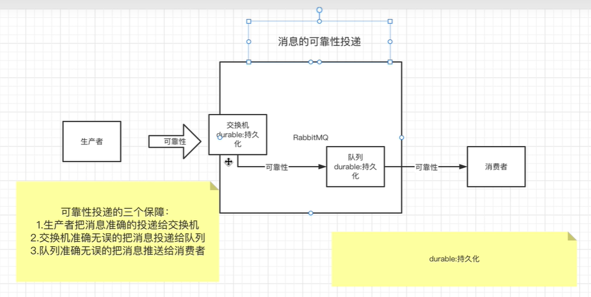

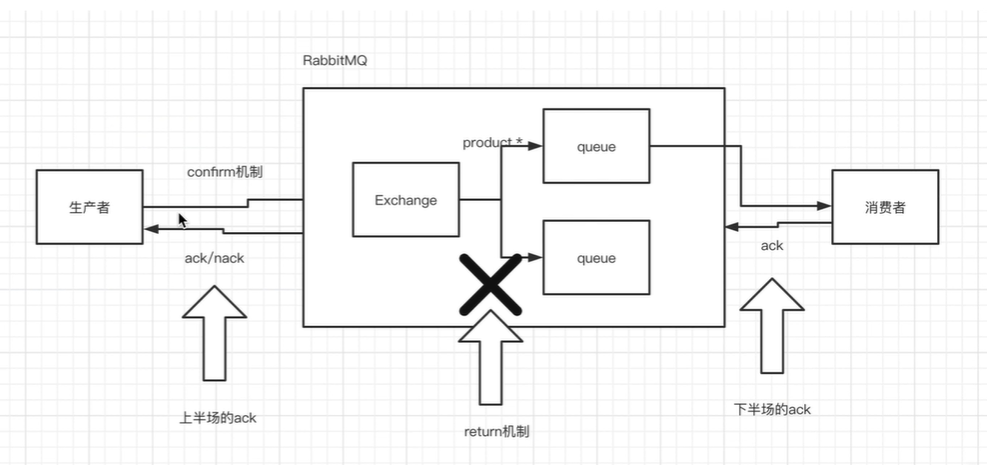


## 2.conform机制


发送消息后,返回状态是否成功

```java
package confirm;


import com.rabbitmq.client.*;
import util.RabbitUtil;

import java.io.IOException;
import java.nio.charset.StandardCharsets;
import java.util.concurrent.TimeoutException;

/**
 * Confirm机制,发送确认机制
 * @author Thor
 * @公众号 Java架构栈
 */
public class MyProducer {

    //定义交换机的名称
    private static String EXCHANGE_NAME = "my_topic_exchange";

    public static void main(String[] args) throws Exception {
        Connection connection = RabbitUtil.getConnection();
        Channel channel = connection.createChannel();
        channel.exchangeDeclare(EXCHANGE_NAME,"topic",true);
        //开启confirm机制
        channel.confirmSelect();
        //设置confirm的监听器
        channel.addConfirmListener(new ConfirmListener() {
            //当消息被broker签收了，会回调此方法
            @Override
            public void handleAck(long deliveryTag, boolean multiple) throws IOException {
                System.out.println("消息已经成功投递");
            }
            //当消息没有被broker签收了，会回调此方法
            @Override
            public void handleNack(long deliveryTag, boolean multiple) throws IOException {
                //开启重试机制，重试达到阈值 则人工介入。
                System.out.println("消息投递失败");
            }
        });
        //设置return机制
        channel.addReturnListener(new ReturnListener() {
            @Override
            public void handleReturn(int replyCode, String replyText, String exchange, String routingKey, AMQP.BasicProperties properties, byte[] body) throws IOException {
                //当消息没有到达队列会调用此方法
                System.out.println("消息没有到达队列");
            }
        });

        String message = "hello confirm message";
        //如果要开启return，则mandatory必须设置成true
        channel.basicPublish(EXCHANGE_NAME,"add",true,null,message.getBytes(StandardCharsets.UTF_8));


    }
}

```


### SpringBoot代码

#### 步骤⼀：修改⽣产者的配置  

```yaml
spring:
  rabbitmq:
    publisher-confirm-type: correlated
```

publisher-confirm-type:有三种配置：  

- simple:简单的执⾏ack的判断；在发布消息成功后使⽤rabbitTemplate调⽤
  waitForConfirms或waitForConfirmsOrDie⽅法等待broker节点返回发送结果，根
  据返回结果来判断下⼀步的逻辑。但是要注意的是当waitForConfirmsOrDie⽅法
  如果返回false则会关闭channel。
- correlated: 执⾏ack的时候还会携带数据（消息的元数据） ;
- none: 禁⽤发布确认模式， 默认的  

#### 步骤⼆：编写⼀个ConfirmCallback的实现类（监听器），并注⼊到R  

F:\Java\tools\MQ\RabbitMQ\qianfen\study\topic\study_topic_producer\src\main\java\com\example\study_topic_producer\confirm\RabbitConfirmConfig.java

```java
package com.example.study_topic_producer.confirm;

import jakarta.annotation.PostConstruct;
import jakarta.annotation.Resource;
import org.springframework.amqp.rabbit.connection.CorrelationData;
import org.springframework.amqp.rabbit.core.RabbitTemplate;
import org.springframework.stereotype.Component;

/**
 * @author HuaRunSheng
 * @date 2022/12/8 23:12
 * @description :
 */
@Component
public class RabbitConfirmConfig implements RabbitTemplate.ConfirmCallback {
    @Resource
    private RabbitTemplate rabbitTemplate;

    @PostConstruct
    public void init(){
        // 注入当前监听器到RabbitTemplate
        rabbitTemplate.setConfirmCallback(this);
    }
    @Override
    public void confirm(CorrelationData correlationData, boolean b, String s) {
        // b返回成功与否标志
        if (b){
            System.out.println("消息发送成功"+correlationData.getId());
        }else{
            System.out.println("消息发送失败"+correlationData.getId());
        }
    }
}

```


#### 步骤三: 发送消息

```java
package com.example.study_topic_producer.service.impl;

import com.example.study_topic_producer.service.ProducerService;
import jakarta.annotation.Resource;
import org.springframework.amqp.rabbit.connection.CorrelationData;
import org.springframework.amqp.rabbit.core.RabbitTemplate;
import org.springframework.stereotype.Service;

import java.util.UUID;

/**
 * @author HuaRunSheng
 * @date 2022/12/8 23:26
 * @description :
 */
@Service
public class ProducerServiceImpl implements ProducerService {
    @Resource
    private RabbitTemplate rabbitTemplate;
    @Override
    public String sendMessage(String message) {
        // confirm回馈的数据
        CorrelationData correlationData=new CorrelationData();
        correlationData.setId(UUID.randomUUID().toString());
        rabbitTemplate.convertAndSend("exchange_boot_topic", "producer.add", message, correlationData);
        return "success";
    }
}
```


## 3.return机制

### 1.Spring Boot中使用

#### 1.1修改配置文件

```xml
server:
  port: 8091
spring:
  rabbitmq:
    host: 1.15.155.85
    port: 5672
    username: admin
    password: 123456
    virtual-host: /test1
    # 关闭自动ack,设置成手动ack
    listener:
      simple:
        acknowledge-mode: manual
    # correlated:返回ack时能带其他数据, simple:简单执行ack判断
    publisher-confirm-type: correlated
    # 开启return机制
    publisher-returns: true
```

#### 1.2 在监听类中实现RabbitTemplate.ReturnCallable接口

F:\Java\tools\MQ\RabbitMQ\qianfen\study\topic\study_topic_producer\src\main\java\com\example\study_topic_producer\confirm\RabbitConfirmConfig.java

```java
package com.example.study_topic_producer.confirm;

import jakarta.annotation.PostConstruct;
import jakarta.annotation.Resource;
import org.springframework.amqp.core.Message;
import org.springframework.amqp.core.ReturnedMessage;
import org.springframework.amqp.rabbit.connection.CorrelationData;
import org.springframework.amqp.rabbit.core.RabbitTemplate;
import org.springframework.stereotype.Component;

/**
 * @author HuaRunSheng
 * @date 2022/12/8 23:12
 * @description :
 */
@Component
public class RabbitConfirmConfig implements RabbitTemplate.ConfirmCallback, RabbitTemplate.ReturnsCallback {
    @Resource
    private RabbitTemplate rabbitTemplate;

    @PostConstruct
    public void init(){
        // 注入当前监听器到RabbitTemplate
        rabbitTemplate.setConfirmCallback(this);
        rabbitTemplate.setReturnsCallback(this);
    }
    @Override
    public void confirm(CorrelationData correlationData, boolean b, String s) {
        // b返回成功与否标志
        if (b){
            System.out.println("消息发送成功"+correlationData.getId());
        }else{
            System.out.println("消息发送失败"+correlationData.getId());
        }
    }


    @Override
    public void returnedMessage(ReturnedMessage returnedMessage) {
        Message message = returnedMessage.getMessage();
        //String exchange = returnedMessage.getExchange();
        //String routingKey = returnedMessage.getRoutingKey();
        //int replyCode = returnedMessage.getReplyCode();
        System.out.println("消息没有投递到队列: "+message.toString());
    }
}

```


#### 1.3 测试

将routingKey设置成未使用过的Key,就会收不到消息

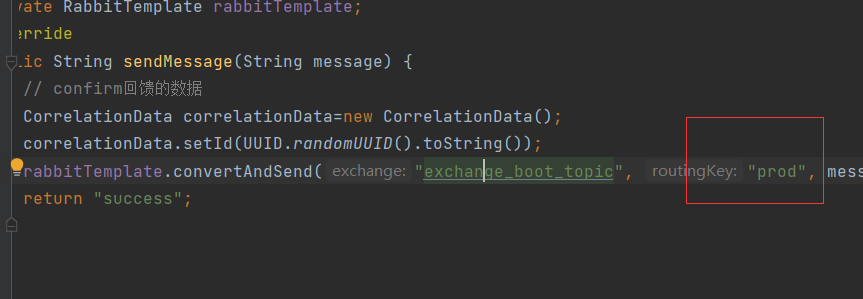


测试接口:http://localhost:8091/test

结果


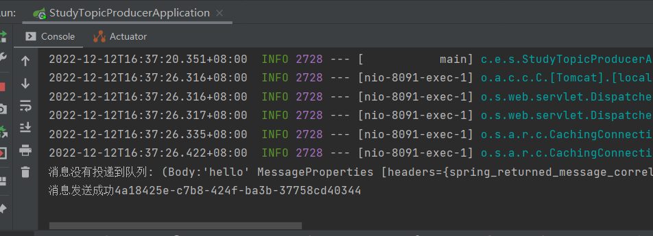


# 高级特性

## 1.发送Map对象,设置消息持久化

交换机,队列持久化并不代表消息持久化.

消息持久化要设置.deliveryMode(2) //消息是否支持持久化：1不支持，2支持

生产者:

```java
package properties;

import com.rabbitmq.client.AMQP;
import com.rabbitmq.client.Channel;
import com.rabbitmq.client.Connection;
import util.RabbitUtil;

import java.nio.charset.StandardCharsets;
import java.util.HashMap;
import java.util.Map;
import java.util.UUID;

/**
 * topic的生产者
 * @author Thor
 * @公众号 Java架构栈
 */
public class MyProducer {

    //定义交换机的名称
    private static String EXCHANGE_NAME = "my_topic_exchange";

    public static void main(String[] args) throws Exception {
        Connection connection = RabbitUtil.getConnection();
        Channel channel = connection.createChannel();
        //1.声明交换机
        channel.exchangeDeclare(EXCHANGE_NAME,"topic",true);

        //创建消息的元数据
        Map<String,Object> map = new HashMap<>();
        map.put("name","zhangsan");
        map.put("age",20);
        AMQP.BasicProperties properties = new AMQP.BasicProperties().builder()
                .deliveryMode(2) //消息是否支持持久化：1不支持，2支持
                .messageId(UUID.randomUUID().toString()) //定义消息的业务id
                .expiration("10000") //定义消息的过期时间,10s
                .headers(map)
                .build();


        //2.发送消息
        channel.basicPublish(EXCHANGE_NAME,"product.add.one",properties,"hello topic".getBytes(StandardCharsets.UTF_8));
        System.out.println("消息已发送");
        //3.关闭连接
        channel.close();
        connection.close();

    }
}

```

消费者:

```java
package properties;

import com.rabbitmq.client.*;
import util.RabbitUtil;

import java.io.IOException;
import java.util.Map;

/**
 * topic的消费者
 * @author Thor
 * @公众号 Java架构栈
 */
public class MyConsumer1 {
    //交换机的名称
    private static String EXCHANGE_NAME = "my_topic_exchange";
    //队列的名称
    private static String QUEUE_NAME = "my_topic_queue_1";

    public static void main(String[] args) throws Exception {
        Connection connection = RabbitUtil.getConnection();
        Channel channel = connection.createChannel();
        //声明交换机
        channel.exchangeDeclare(EXCHANGE_NAME,"topic",true);
        //声明队列
        channel.queueDeclare(QUEUE_NAME,false,false,false,null);
        //绑定
        channel.queueBind(QUEUE_NAME,EXCHANGE_NAME,"product.#");
        //创建消费者
        Consumer consumer = new DefaultConsumer(channel){
            @Override
            public void handleDelivery(String consumerTag, Envelope envelope, AMQP.BasicProperties properties, byte[] body) throws IOException {
                System.out.println("product.# 消费者："+new String(body));
                Map<String, Object> map = properties.getHeaders();
                System.out.println(map.get("name"));
                System.out.println(properties.getMessageId());
                //手动ack
                channel.basicAck(envelope.getDeliveryTag(),false);
                //nack
//                channel.basicNack(envelope.getDeliveryTag(),false,false);
            }

        };
        //让消费者监听队列
        channel.basicConsume(QUEUE_NAME,false,consumer);

    }

}
```

## 2.防止重复消费消息

发消息时,带上UUid

```
package com.example.study_topic_producer.service.impl;

import com.example.study_topic_producer.service.ProducerService;
import jakarta.annotation.Resource;
import org.springframework.amqp.rabbit.connection.CorrelationData;
import org.springframework.amqp.rabbit.core.RabbitTemplate;
import org.springframework.stereotype.Service;

import java.util.UUID;

/**
 * @author HuaRunSheng
 * @date 2022/12/8 23:26
 * @description :
 */
@Service
public class ProducerServiceImpl implements ProducerService {
    @Resource
    private RabbitTemplate rabbitTemplate;
    @Override
    public String sendMessage(String message) {
        // confirm回馈的数据
        CorrelationData correlationData=new CorrelationData();
        correlationData.setId(UUID.randomUUID().toString());
        rabbitTemplate.convertAndSend("exchange_boot_topic", "producer.add", message, correlationData);
        return "success";
    }
}
```

接收消息时,将Id取出,并判断是否消费过

```java
package com.example.study_topic;

import com.rabbitmq.client.Channel;
import org.springframework.amqp.core.Message;
import org.springframework.amqp.rabbit.annotation.RabbitListener;
import org.springframework.stereotype.Component;

import java.io.IOException;

/**
 * @author HuaRunSheng
 * @date 2022/12/8 20:11
 * @description :
 */
@Component
public class MyConsumer {
    //自动ack
    //@RabbitListener(queues="queue_boot_topic")
    //public void process(Message message){
    //    byte[] body = message.getBody();
    //    System.out.println("接收到消息: "+new String(body));
    //}
    @RabbitListener(queues="queue_boot_topic")
    public void process(Message message, Channel channel) throws IOException {
        byte[] body = message.getBody();
        String returnId = message.getMessageProperties().getHeader("spring_returned_message_correlation");
        // 可以将returnId储存到redis中,防止没有签收再次消费
        System.out.println("接收到消息: "+new String(body));
        // (Body:'hello' MessageProperties [headers={spring_listener_return_correlation=177da92c-82e0-450d-b12e-f5b3db8baaf2, spring_returned_message_correlation=39d625dd-39e0-4ded-b2c4-8f15735a670a}, contentType=text/plain, contentEncoding=UTF-8, contentLength=0, receivedDeliveryMode=PERSISTENT, priority=0, redelivered=false, receivedExchange=exchange_boot_topic, receivedRoutingKey=producer.add, deliveryTag=1, consumerTag=amq.ctag-FVudSOMCTZK5AI2KmnJzvw, consumerQueue=queue_boot_topic])
        System.out.println(message.toString());
        // 手动ack,要签收消息的id,是否批量签收
        channel.basicAck(message.getMessageProperties().getDeliveryTag(), false);
    }
}

```


spring_listener_return_correlation:该属性是⽤来确定消息被退回时调⽤哪个监
听器

spring_returned_message_correlation：该属性是指退回待确认消息的唯⼀标识  


## 3.死信队列

#### 1.介绍

死信队列 ，让⼀条消息，在满⾜⼀定的条件下，成为死信，会被发送到另⼀个交换
机上，再被消费。 这个过程就是死信队列的作⽤。

死信队列就可以做出“延迟”队列的效果。⽐如，在订单超时未⽀付 ，将订单状态改
成“已取消”，这个操作就可以使⽤死信队列来完成。设置消息的超时时间，当消息
超时则消息成为死信，于是通过监听死信队列的消费者来做取消订单的动作。  

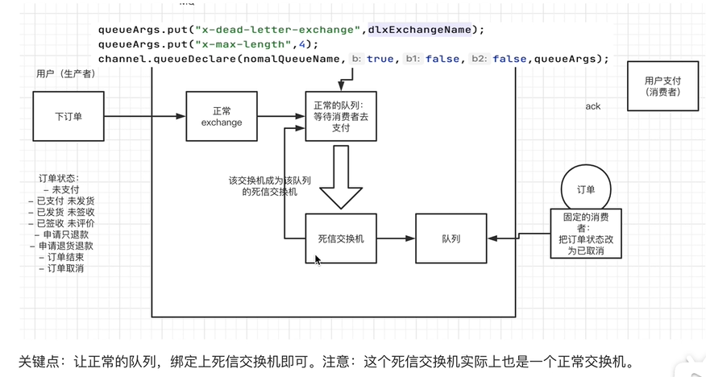


### 2.成为死信队列的条件

消息被拒签，并且没有重回队列，消息将成为死信。(消费者设置)

消息过期了，消息将成为死信。(生产者设置)

队列⻓度有限，存不下消息了，存不下的消息将会成为死信。 (消费者设置)


### 3.代码

生产者代码:

```java
package dix;

import com.rabbitmq.client.AMQP;
import com.rabbitmq.client.Channel;
import com.rabbitmq.client.Connection;
import util.RabbitUtil;

import java.io.IOException;
import java.nio.charset.StandardCharsets;
import java.util.UUID;
import java.util.concurrent.TimeoutException;

/**
 * @author HuaRunSheng
 * @date 2022/12/12 20:11
 * @description :死信队列
 */
public class MyProducer {
    //交换机的名称
    private static String NORMAL_EXCHANGE_NAME = "dix_normal_exchange";
    private static String NormalExchangeType = "topic";
    private static String NormalRoutingKey = "dix_normal";
    public static void main(String[] args) throws IOException, TimeoutException {
        Connection connection = RabbitUtil.getConnection();
        Channel channel = connection.createChannel();
        channel.exchangeDeclare(NORMAL_EXCHANGE_NAME, NormalExchangeType, true, false, null);
        String orderId= UUID.randomUUID().toString();
        AMQP.BasicProperties properties=new AMQP.BasicProperties().builder()
                .deliveryMode(2)
                .expiration("10000")
                .messageId(orderId)
                .build();
        String message="订单对象";
        channel.basicPublish(NORMAL_EXCHANGE_NAME, NormalRoutingKey, properties, message.getBytes(StandardCharsets.UTF_8));
        System.out.println("消息已发送");
        channel.close();
        connection.close();
    }
}

```

消费者代码:

```java
package dix;

import com.rabbitmq.client.*;
import util.RabbitUtil;

import java.io.IOException;
import java.util.HashMap;
import java.util.Map;
import java.util.concurrent.TimeoutException;

/**
 * @author HuaRunSheng
 * @date 2022/12/12 20:25
 * @description :
 */
public class MyConsumer {
    //正常交换机
    private static String NORMAL_EXCHANGE_NAME = "dix_normal_exchange";
    private static String ExchangeType = "topic";

    private static String NormalQueue = "dix_normal_queue";
    private static String RoutingKey = "dix_normal";

    //死信交换机
    private static String Dlx_EXCHANGE_NAME = "dix_death_exchange";
    private static String DlxQueue = "dix_death_queue";
    public static void main(String[] args) throws IOException, TimeoutException {
        Connection connection = RabbitUtil.getConnection();
        Channel channel = connection.createChannel();

        //声明正常交换机,绑定两个交换机
        channel.exchangeDeclare(NORMAL_EXCHANGE_NAME, ExchangeType, true, false, null);
        Map<String, Object> queueArgs=new HashMap<>();
        // 死信队列
        queueArgs.put("x-dead-letter-exchange", Dlx_EXCHANGE_NAME);
        // 最大消息长度
        queueArgs.put("x-max-length", 4);
        channel.queueDeclare(NormalQueue, true, false, false, queueArgs);
        channel.queueBind(NormalQueue, NORMAL_EXCHANGE_NAME, RoutingKey);

        // 创建死信队列
        channel.exchangeDeclare(Dlx_EXCHANGE_NAME, ExchangeType, true, false, null);
        channel.queueDeclare(DlxQueue, true, false, false, null);
        //#代表任何routekey都可以
        channel.queueBind(DlxQueue, Dlx_EXCHANGE_NAME, "#");

        //创建一个消费死信队列的消费者
        //Consumer consumer=new DefaultConsumer(channel){
        //    @Override
        //    public void handleDelivery(String consumerTag, Envelope envelope, AMQP.BasicProperties properties, byte[] body) throws IOException {
        //        // 处理消息
        //        String messageId = properties.getMessageId();
        //        System.out.println("当前订单 "+messageId +" , 已取消. ");
        //        // 签收
        //        channel.basicAck(envelope.getDeliveryTag(), false);
        //    }
        //};
        //// 消费死信队列
        //channel.basicConsume(DlxQueue, false, consumer);

        //拒签消息,让消息成为死信
        Consumer consumer1=new DefaultConsumer(channel){
            @Override
            public void handleDelivery(String consumerTag, Envelope envelope, AMQP.BasicProperties properties, byte[] body) throws IOException {
                //拒签消息
                channel.basicReject(envelope.getDeliveryTag(), false);
            }
        };
        channel.basicConsume(NormalQueue, false, consumer1);
    }
}

```


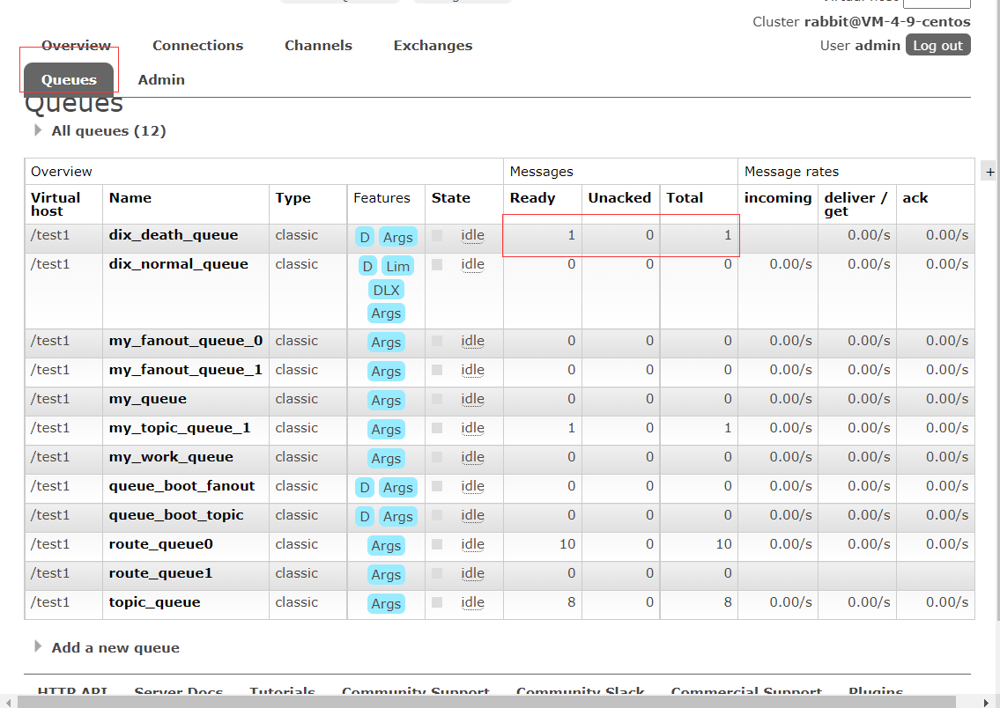


# 应用

## 使用rabbitmq实现提醒发送短信

1.定义好交换机，队列和路由键的名字。

```java
public class MqConst {
 
    /**
     * 短信
     */
    public static final String EXCHANGE_DIRECT_MSM = "exchange.direct.msm";
    public static final String ROUTING_MSM_ITEM = "msm.item";
    //队列
    public static final String QUEUE_MSM_ITEM  = "queue.msm.item";
 
}
```

2.消息转换器转换成json

```java
import org.springframework.amqp.support.converter.Jackson2JsonMessageConverter;
import org.springframework.amqp.support.converter.MessageConverter;
import org.springframework.context.annotation.Bean;
import org.springframework.context.annotation.Configuration;
 
@Configuration
public class MQConfig {
    @Bean
    public MessageConverter messageConverter(){
        return new Jackson2JsonMessageConverter();
    }
}
```

3.订单模块中提交订单（记得引入公共模块，以及MsmVo实现Serializable）：

```java
    @PostMapping("/auth/submitOrder/{scheduleId}/{patientId}")
    public Result submitOrder(@PathVariable Long scheduleId,
                              @PathVariable Long patientId){
        //一堆乱七八糟的业务流程
        //。。。。
 
        //短信提示
        MsmVo msmVo = new MsmVo();
        msmVo.setPhone(orderInfo.getPatientPhone());
        msmVo.setTemplateCode("SMS_194640721");
        rabbitTemplate.convertAndSend(MqConst.EXCHANGE_DIRECT_MSM, MqConst.ROUTING_MSM_ITEM, msmVo);
 
        return Result.ok(orderInfo);
    }
```

4.短信模块中加入component（记得引入公共模块）：

```Java
@Component
public class SmsReceiver {
    @Autowired
    private SmsService msmService;
 
    @RabbitListener(bindings = @QueueBinding(
            value = @Queue(value = MqConst.QUEUE_MSM_ITEM, durable = "true"),
            exchange = @Exchange(value = MqConst.EXCHANGE_DIRECT_MSM),
            key = {MqConst.ROUTING_MSM_ITEM}
    ))
    public void send(MsmVo msmVo, Message message, Channel channel) {
        msmService.send(msmVo);
    }
}
```


 
