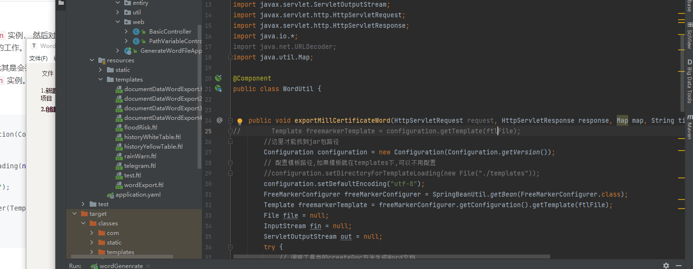

# 教程

https://blog.csdn.net/bskfnvjtlyzmv867/article/details/81099114/

F:\Java\tools\generateWordFile

# 1.新建一个spring boot项目

加入FreeMarker ,FreeMarker 不依赖于web容器，所以普通的java项目也可以使用FreeMarker 。

```xml
<dependency>
  <groupId>org.freemarker</groupId>
  <artifactId>freemarker</artifactId>
  <version>2.3.28</version>
</dependency>
```

如果是结合Spring使用FreeMarker，则需要额外添加依赖

```xml
<dependency>
    <groupId>org.springframework</groupId>
    <artifactId>spring-context-support</artifactId>
    <version>${spring.version}</version>
</dependency>
```


```xml
<?xml version="1.0" encoding="UTF-8"?>
<project xmlns="http://maven.apache.org/POM/4.0.0" xmlns:xsi="http://www.w3.org/2001/XMLSchema-instance"
         xsi:schemaLocation="http://maven.apache.org/POM/4.0.0 https://maven.apache.org/xsd/maven-4.0.0.xsd">
    <modelVersion>4.0.0</modelVersion>
    <groupId>com.example</groupId>
    <artifactId>generateWordFile</artifactId>
    <version>0.0.1-SNAPSHOT</version>
    <name>generateWordFile</name>
    <description>generateWordFile</description>
    <properties>
        <java.version>1.8</java.version>
        <project.build.sourceEncoding>UTF-8</project.build.sourceEncoding>
        <project.reporting.outputEncoding>UTF-8</project.reporting.outputEncoding>
        <spring-boot.version>2.3.12.RELEASE</spring-boot.version>
    </properties>
    <dependencies>
        <dependency>
            <groupId>org.springframework.boot</groupId>
            <artifactId>spring-boot-starter-web</artifactId>
        </dependency>

        <dependency>
            <groupId>org.projectlombok</groupId>
            <artifactId>lombok</artifactId>
            <optional>true</optional>
        </dependency>
        <dependency>
            <groupId>org.springframework.boot</groupId>
            <artifactId>spring-boot-starter-test</artifactId>
            <scope>test</scope>
            <exclusions>
                <exclusion>
                    <groupId>org.junit.vintage</groupId>
                    <artifactId>junit-vintage-engine</artifactId>
                </exclusion>
            </exclusions>
        </dependency>
    <!--    生成word 文档-->
        <dependency>
            <groupId>org.freemarker</groupId>
            <artifactId>freemarker</artifactId>
            <version>2.3.28</version>
        </dependency>
        <dependency>
            <groupId>org.springframework</groupId>
            <artifactId>spring-context-support</artifactId>
            <version>5.2.15.RELEASE</version>
        </dependency>
    </dependencies>

    <dependencyManagement>
        <dependencies>
            <dependency>
                <groupId>org.springframework.boot</groupId>
                <artifactId>spring-boot-dependencies</artifactId>
                <version>${spring-boot.version}</version>
                <type>pom</type>
                <scope>import</scope>
            </dependency>
        </dependencies>
    </dependencyManagement>

    <build>
        <plugins>
            <plugin>
                <groupId>org.apache.maven.plugins</groupId>
                <artifactId>maven-compiler-plugin</artifactId>
                <version>3.8.1</version>
                <configuration>
                    <source>1.8</source>
                    <target>1.8</target>
                    <encoding>UTF-8</encoding>
                </configuration>
            </plugin>
            <plugin>
                <groupId>org.springframework.boot</groupId>
                <artifactId>spring-boot-maven-plugin</artifactId>
                <version>${spring-boot.version}</version>
                <configuration>
                    <mainClass>com.example.GenerateWordFileApplication</mainClass>
                    <skip>true</skip>
                </configuration>
                <executions>
                    <execution>
                        <id>repackage</id>
                        <goals>
                            <goal>repackage</goal>
                        </goals>
                    </execution>
                </executions>
            </plugin>
        </plugins>
    </build>

</project>

```

# 2.创建工具类

```java
package com.example.util;

import freemarker.template.Configuration;
import freemarker.template.Template;
import org.springframework.beans.factory.annotation.Autowired;
import org.springframework.stereotype.Component;
import org.springframework.stereotype.Service;
import org.springframework.util.ResourceUtils;
import org.springframework.web.servlet.view.freemarker.FreeMarkerConfigurer;
import org.springframework.web.util.UriUtils;

import javax.annotation.PostConstruct;
import javax.servlet.ServletOutputStream;
import javax.servlet.http.HttpServletRequest;
import javax.servlet.http.HttpServletResponse;
import java.io.*;
import java.net.URLDecoder;
import java.util.Map;

@Component
public class WordUtil {


    public void exportMillCertificateWord(HttpServletRequest request, HttpServletResponse response, Map map, String title, String ftlFile) throws IOException {
//        Template freemarkerTemplate = configuration.getTemplate(ftlFile);
        //这里才能找到jar包路径
        Configuration configuration = new Configuration(Configuration.getVersion());
        // 配置模板路径,如果模板就在templates下,可以不用配置
        //configuration.setDirectoryForTemplateLoading(new File("./templates"));
        configuration.setDefaultEncoding("utf-8");
        FreeMarkerConfigurer freeMarkerConfigurer = SpringBeanUtil.getBean(FreeMarkerConfigurer.class);
        Template freemarkerTemplate = freeMarkerConfigurer.getConfiguration().getTemplate(ftlFile);
        File file = null;
        InputStream fin = null;
        ServletOutputStream out = null;
        try {
            // 调用工具类的createDoc方法生成Word文档
            file = createDoc(map,freemarkerTemplate);
            fin = new FileInputStream(file);

            response.setCharacterEncoding("UTF8");
            response.setContentType("application/msword");
            // 设置浏览器以下载的方式,处理该文件名
            String fileName = title + ".doc";
            response.setHeader("Content-Disposition", "attachment;filename="
                    .concat(String.valueOf(UriUtils.encode(fileName, "UTF-8"))));

            out = response.getOutputStream();
            byte[] buffer = new byte[512];
            int bytesToRead = -1;
            // 通过循环将读入的Word文件的内容输出到浏览器中
            while((bytesToRead = fin.read(buffer)) != -1) {
                out.write(buffer, 0, bytesToRead);
            }

        } finally {
            if(fin != null) fin.close();
            if(out != null) out.close();    //关闭对应流
            if(file != null) file.delete(); // 删除临时文件
        }
    }

    private static File createDoc(Map<?, ?> dataMap, Template template) {
        String name =  "sellPlan.doc";
        File f = new File(name);
        Template t = template;
        try {
            // 这个地方不能使用FileWriter因为需要指定编码类型否则生成的Word文档会因为有无法识别的编码而无法打开
            Writer w = new OutputStreamWriter(new FileOutputStream(f), "UTF8");
            t.process(dataMap, w);
            w.close();
        } catch (Exception ex) {
            ex.printStackTrace();
            throw new RuntimeException(ex);
        }
        return f;
    }
}

```


# 3.模板文件



如:test.ftl

```xml
<html>
<head>
    <title>欢迎  ${user.name}!</title>
</head>
<body>
<h1>欢迎 ${user.name}!</h1>
<h2>年龄: ${user.age}</h2>
</body>
</html>
```


# 4.简单实例

## 1.配置

在使用Freemark类中设置,

```
import org.springframework.web.servlet.view.freemarker.FreeMarkerConfigurer;
```

```java
// 创建Configuration实例，指定版本
Configuration configuration = new Configuration(Configuration.getVersion());
try {
    // 指定configuration对象模板文件存放的路径
    configuration.setDirectoryForTemplateLoading(new File("/where/you/store/templates"));
    // 设置config的默认字符集，一般是UTF-8
    configuration.setDefaultEncoding("UTF-8");
    // 设置错误控制器
    configuration.setTemplateExceptionHandler(TemplateExceptionHandler.RETHROW_HANDLER);
} catch (IOException e) {
    e.printStackTrace();
}
```

## 2.获取模板

```java
// 获取模版
Template template = configuration.getTemplate("hello.ftl");
```

## 3.定义类型

```java
public class User {
    private String username;
    private int age;
    private Record record;

    /** setter and getter **/
}

public class Record {
    private long id;
    private String name;

    /** setter and getter **/
}
```

## 4.构建数据

```java
// 准备数据
Map<String, User> map = new HashMap<>();

Record record = new Record();
record.setId(1L);
record.setName("记录一");

User user = new User();
user.setUsername("小明");
user.setAge(18);
user.setRecord(record);

map.put("user", user);
```


## 5.合并模板与数据

数据模型+模板=输出，这一过程是由模板的 `process` 方法完成的。它需要数据和 `Writer` 对象两部分作为参数，然后向 `Writer` 对象写入产生的内容。这里创建一个Writer对象，指定生成的文件保存的路径及文件名：

```java
// 创建一个Writer对象，指定生成的文件保存的路径及文件名
Writer writer = new FileWriter(new File("/where/you/store/outputs"));
template.process(map, writer);
```

这里用到了Java IO相关的操作，基于 `out` 对象，必须保证 `out.close()` 最后被调用。典型的Web应用程序中，不能关闭 `out` 对象，对此FreeMarker会在模板执行成功后调用 `out.flush()`，所以不必担心 (这一功能也可以在 `Configuration` 中禁用) 。

还有一点，一旦获得了 `Template` 实例， 就能将它和不同的数据模型进行不限次数的合并。此外， 当 `Template`实例创建之后的模板文件 (`hello.ftl`) 才能访问，而不是在调用 `process` 方法时。

## 6.可以生成的数据

根据模板可以生成word,html,java等等文件


# 5.模板数据类型

## 布尔型format

FreeMarker 无法直接对布尔型的值直接输出True、False，需要对其format才能输出。

```txt
${布尔变量名?string('yes', 'no')}
```


## 日期format

FreeMarker 对Java的Date类型对象取值分两种情形，当用的sql包下的Date可以直接取值；当用的是util包下的Date则需要进行format才能输出。因为Java API通常不区别 java.util.Date 只存储日期部分， 时间部分，或两者都存。 为了用本文正确显示值，FreeMarker必须知道 java.util.Date 的日期究竟要显示哪一部分。

```txt
${sqldate}
${utildate?string("yyyy/MM/dd HH:mm:ss")}
```

## null或missing

FreeMarker 不可以输出null，类似于空指针异常。同样，如果通过 ${变量名} 表达式取值，压根不存在变量名，FreeMarker也会报出错误。 FreeMarker 对此加入了判空操作，利用 ！ 可以在null或missing的情况下不输出或输出默认文本。

```txt
${nullVar!'默认输出'}
${missingVar!}
```


## 变量定义赋值运算

通过assign标签给变量进行赋值，赋值完的变量可以在 `${}` 中进行相应的运算。

```java
<#assign a=100 />
<#assign b=2 />
a + b = ${a + b}
a - b = ${a - b}
a x b = ${a * b}
a / b = ${a / b}
a % b = ${a % b}
```


## 遍历List

FreeMarker 可以采用list标签遍历Java中的List集合数据来输出文本，极为方便。

```java
<#list numList as item>
    list:${item}
</#list>
```


FreeMarker 也可以利用list标签来遍历map集合。需要取到map中的key，再通过key来取出相应的value。取map中的key可以通过 `map？keys` 来获取：

```java
<#list objectMap?keys as key>
    ${key}:${objectMap[key].username}
</#list>
```


## if-else

FreeMarker 提供了逻辑判断，采用if和else标签实现。满足条件则输出，不满足则忽略。

```java
<#list numList as item>
    <#if item!=2 >
        list:${item}
    </#if>
</#list>
```


```java
<#list numList as item>
    <#if item &gt; 3 >
        <font color="red">list:${item}</font>
    <#elseif item == 3>
        <font color="blue">list:${item}</font>
    <#else>
        <font color="green">list:${item}</font>
    </#if>
</#list>
```


其中>；是大于的转义，同样<；是小于的转义。利用双问号 `??` 或者 `？exists` 可以对对象进行判空，例如：

```java
<#if item??>
<#if item?exists>
```

同样FreeMarker 也支持多条件判断，用 `&&` 、`||` 、`！` 进行连接。

## switch

```java
<#assign str="java" />
<#switch str>
    <#case "python"> 学习python <#break>
    <#case "java"> 学习java <#break>
    <#default> 学习别的。。。
</#switch>

<#assign str="11.1" />
<#switch str>
    <#case "11.1"> 学习python <#break>
    <#case "11.11"> 学习java <#break>
    <#default> 学习别的。。。
</#switch>
```


## 使用函数

### 字符串内建函数

```java
<#assign a="hello"/>
<#assign b="world"/>
<li>连接</li>
${a + b}
<li>截取</li>
${(a + b)?substring(5, 8)}
<li>长度</li>
${(a + b)?length}
<li>大写</li>
${(a + b)?upper_case}
<li>小写</li>
${(a + b)?lower_case}
<li>index</li>
${(a + b)?index_of('o')}
<li>last_index</li>
${(a + b)?last_index_of('o')}
<li>替换</li>
${(a + b)?replace('o', 'xx')}
```


## list内建函数

```java
<#assign myList=[3, 4, 5, 6, 1, 3, 7, 9, 2] />
mySize大小：${myList?size}
mySize第三个元素：${myList[3]}
顺序：
<#list myList?sort as item>
    ${item_index} : ${item}
</#list>
逆序：
<#list myList?sort?reverse as item>
    ${item_index} : ${item}
</#list>
```


## 常用内建函数

处理字符串：

- substring cap_first ends_with contains
- date datetime time （字符串转日期时间）
- starts_with index_of last_index_of split trim

处理数字：

- string x?string(“0.##”) （保留两位小数）
- round floor ceiling

处理list：

- first last seq_contains seq_index_of
- size reverse sort sort_by
- chunk（分块处理）

其他：

- is函数：is_string is_number is_method
- has_content
- eval求值

## 自定义功能

### 标量

FreeMarker中定义了四种类型标量：布尔值，数字，字符串以及日期。每一种标量都是 `TemplateXxxModel` 接口的实现，`Xxx` 是Java中相关类型的名称。比如 `TemplateBooleanModel` 。这些接口中都只定义了一个方法用于转换类型为Java类型：`getAsXxx()` 。在名称上，只有字符串标量有些例外，字符串标量的接口是 `TemplateScalarModel`，而不是`TemplateStringModel`。

除了 `SimpleBoolean` 类型，这些接口的一个简单的实现是 `freemarker.template` 包下的 `SimpleXxx` 类。为了代表布尔值， 可以使用 `TemplateBooleanModel.TRUE` 和 `TemplateBooleanModel.FALSE` 来单独使用。 同样，字符串标量的实现类是 `SimpleScalar`，而不是 `SimpleString`。

### 容器

除了标量，对于Java的集合数组类型FreeMarker也定义了相关的数据类型称为容器。容器包括*哈希表*，*序列* 和*集合*三种类型。

- 哈希表

  哈希表是实现了 `TemplateHashModel` 接口的Java对象。`TemplateHashModel` 有两个方法： `TemplateModel get(String key)` 方法根据给定的名称返回子变量， `boolean isEmpty()`方法表明哈希表是否含有子变量。`get` 方法当在给定的名称没有找到子变量时返回null。

  `TemplateHashModelEx` 接口扩展了 `TemplateHashModel`。它增加了更多的方法，使得可以使用内建函数 values 和 keys 来枚举哈希表中的子变量。

  经常使用的实现类是 `SimpleHash`，该类实现了 `TemplateHashModelEx` 接口。从内部来说，它使用一个 `java.util.Hash` 类型的对象存储子变量。 `SimpleHash` 类的方法可以添加和移除子变量。 这些方法应该用来在变量被创建之后直接初始化。

- 序列(数组)

  序列是实现了 `TemplateSequenceModel` 接口的Java对象。它包含两个方法：`TemplateModel get(int index)` 和 `int size()`。

  经常使用的实现类是 `SimpleSequence`。该类内部使用一个 `java.util.List` 类型的对象存储它的子变量。 `SimpleSequence` 有添加子元素的方法。 在序列创建之后应该使用这些方法来填充序列。

- 集合

  集合是实现了 `TemplateCollectionModel` 接口的Java对象。这个接口定义了一个方法： `TemplateModelIterator iterator()`。`TemplateModelIterator` 接口和 `java.util.Iterator` 相似，但是它返回 `TemplateModels` 而不是 `Object`， 而且它能抛出 `TemplateModelException` 异常。

  通常使用的实现类是 `SimpleCollection`。


### 自定义函数

有时候FreeMarker内建函数不一定能够满足我们的处理需要，我们可以自定义函数来处理数据并展示。FreeMarker自定义函数需要自定义处理数据的类，该类需要实现 `TemplateMethodModel` 接口 ，接口中的 `TemplateModel exec(java.util.List arguments)` 方法也需要我们重新实现。当调用自定义函数时，自定义类的`exec` 方法将会被调用。 形参将会包含FTL方法调用形参的值。`exec` 方法的返回值给出了FTL方法调用表达式的返回值。

我们以自定义一个数组排序的函数为例，首先新建一个 `MySortMethod` 类实现 `TemplateMethodModel` 接口，并重写 `exec` 方法。

```java
public class MySortMethod implements TemplateMethodModelEx {

    /**
     * 自定义函数需要实现的方法
     * @param list 在.ftl模板中调用自定义方法传的参数
     * @return 返回结果
     * @throws TemplateModelException
     */
    @Override
    public Object exec(List list) throws TemplateModelException {

        // 接收传入的List
        DefaultListAdapter defaultListAdapter = (DefaultListAdapter) list.get(0);
        List<Integer> arrayList = (List<Integer>) defaultListAdapter.getAdaptedObject(Integer.class);

        // 接收传入的升序还是降序布尔值
        boolean asc = "yes".equals(((SimpleScalar) list.get(1)).getAsString()) ? true : false;

        Collections.sort(arrayList, new Comparator<Integer>() {
            @Override
            public int compare(Integer o1, Integer o2) {
                if(asc) {
                    return o1 - o2;
                }else {
                    return o2 - o1;
                }
            }
        });
        return arrayList;
    }
}
```

在调用函数前，我们需要在模板数据里添加：

```java
List<Integer> list = new ArrayList<>();
for (int i = 0; i < 5; i++) {
    list.add(i+1);
}
map.put("numList", list);
map.put("my_sort", new MySortMethod());
```

在模板中调用自定义函数 `my_sort` ，传入两个参数：

```java
顺序：
<#list my_sort(numList, true?string('yes', 'no')) as item>
${item_index} : ${item}
</#list>
逆序：
<#list my_sort(numList, false?string('yes', 'no')) as item>
${item_index} : ${item}
</#list>
```


### 自定义指令

类似自定义函数，我们也可以自定义指令，类似于if-else、assign这样的指令。自定义指令的需要使用 `@` 符号，而不是 `#` 符号。可以使用 `TemplateDirectiveModel` 接口在Java代码中实现自定义指令。`TemplateDirectiveModel` 在 FreeMarker 2.3.11 版本时才加入， 来代替快被废弃的 `TemplateTransformModel`。

下面举个栗子，自定义用来校验用户名密码的指令：

```java
public class MyValidationDirective implements TemplateDirectiveModel {

    /**
     *
     * @param environment 环境变量(实现复杂功能时可能会用)
     * @param map 在.ftl模板中使用自定义指令传的参数(key-value形式)
     * @param templateModels 返回值，数组形式
     * @param templateDirectiveBody 指令内容
     * @throws TemplateException
     * @throws IOException
     */
    @Override
    public void execute(Environment environment,
                        Map map,
                        TemplateModel[] templateModels,
                        TemplateDirectiveBody templateDirectiveBody)
            throws TemplateException, IOException {

        SimpleScalar username = (SimpleScalar) map.get("username");
        SimpleScalar password = (SimpleScalar) map.get("password");

        if("admin".equals(username.getAsString()) && "123456".equals(password.getAsString())) {
            templateModels[0] = TemplateBooleanModel.TRUE;
        } else {
            templateModels[0] = TemplateBooleanModel.FALSE;
        }

        List<String> rights = new ArrayList<>();
        rights.add("insert");
        rights.add("delete");
        rights.add("update");
        rights.add("select");
        templateModels[1] = new SimpleSequence(rights);

        templateDirectiveBody.render(environment.getOut());
    }
}
```

模板编写：


利用 `<@role />` 标签需要传入模版数据前进行添加：

```java
map.put("role", new MyValidationDirective());
```

或者在模板文件中使用内建函数 `new()` 将指令放到一个FTL库中：

```java
<#assign role="directive.MyValidationDirective"?new() />
```

输出结果：


## unction方法

function语法：

```html
<#function 方法名 param1 param2>
    <#return param1和param2的操作>
</#function>
```

调用语法：

```html
${方法名(param1, param2)}
```

下面举一些例子。

```html
<#function doAdd param1 param2>
    <#return param1+param2 />
</#function>
${doAdd(2, 3)}
```

