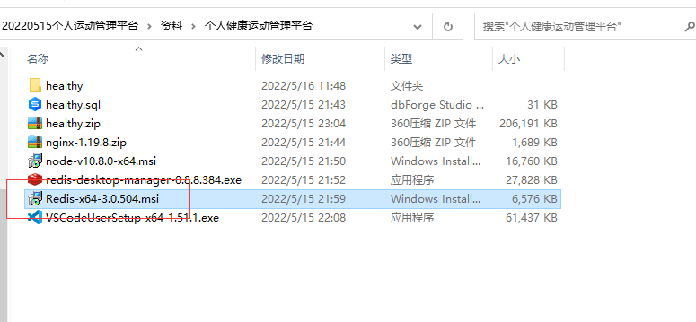
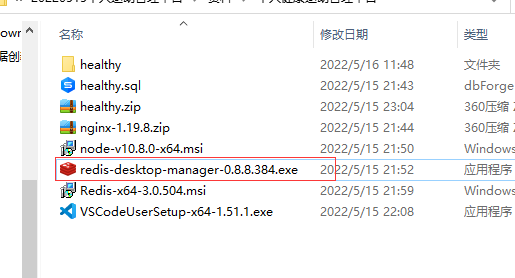
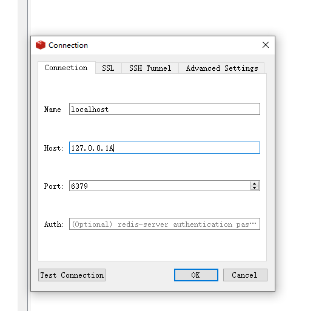
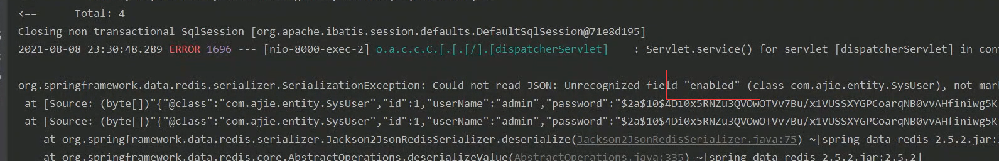
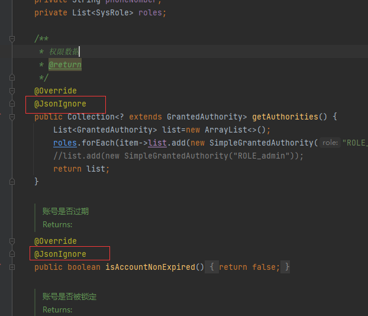
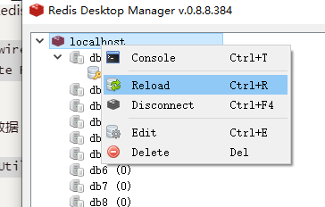
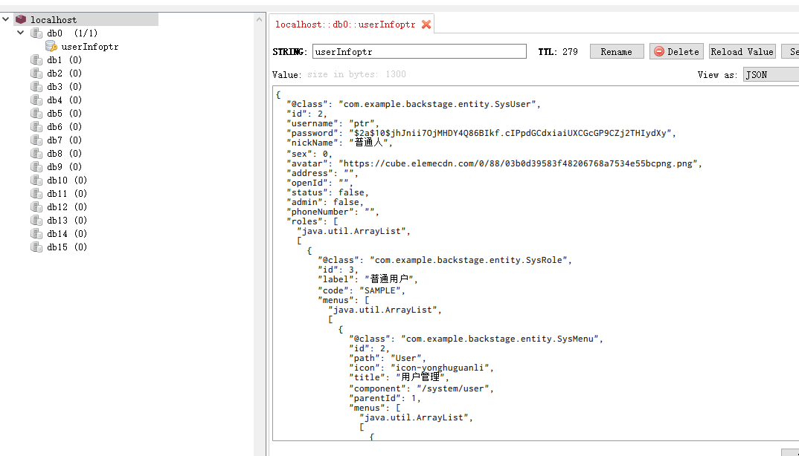

# redis

## 一 安装

网址:[Releases · tporadowski/redis · GitHub](https://github.com/tporadowski/redis/releases)

下到电脑上就可以使用.

F:\Environment\Redis-5.0.14

先打开:redis-server.exe,不能关

再打开:redis-cli.exe

然后就可以写东西了.

## 二 使用,练习

### 1.字符串的增删改查

```text
##增加一个值key为name,value为ay
127.0.0.1:6379> set name 'ay'
OK
##查询name的值
127.0.0.1:6379> get name
"ay"
##更新name的值为a1
127.0.0.1:6379> set name 'a1'
OK
##查询name的值
127.0.0.1:6379> get name
"a1"
##删除name的值
127.0.0.1:6379> del name
(integer) 1
##查询是否存在name,0代表不存在
127.0.0.1:6379> exists name
(integer) 0
127.0.0.1:6379>
```

### 2.List集合的增删改查

```text
##添加key为users,value为'ay','al'的list集合
127.0.0.1:6379> lpush users 'ay' 'al'
(integer) 2
##查询key为users的集合
127.0.0.1:6379> lrange users 0 -1
1) "al"
2) "ay"
##往list尾部添加love元素
127.0.0.1:6379> rpush users 'love'
(integer) 3
##往list头部添加hope元素
127.0.0.1:6379> lpush users 'hope'
(integer) 4
##查询
127.0.0.1:6379> lrange users 0 -1
1) "hope"
2) "al"
3) "ay"
4) "love"
##修改index为0的值为wish
127.0.0.1:6379> lset users 0 'wish'
OK
##查询
127.0.0.1:6379> lrange users 0 -1
1) "wish"
2) "al"
3) "ay"
4) "love"
##删除index为0的值
127.0.0.1:6379> lrem users 0 'wish'
(integer) 1
127.0.0.1:6379> lrange users 0 -1
1) "al"
2) "ay"
3) "love"
```

### 3.set集合的增删改查

```text
##添加key为rs,value为 "ay" "al" "love"的集合
127.0.0.1:6379> sadd rs "ay" "al" "love"
(integer) 3
##查询key为rs的集合,但关键字打错了,查不出来
127.0.0.1:6379> smenbers rs
(error) ERR unknown command `smenbers`, with args beginning with: `rs`,
##正确的查询关键字
127.0.0.1:6379> smembers rs
1) "ay"
2) "love"
3) "al"
##删除value为love的元素,返回1表示删除成功,0表示失败
127.0.0.1:6379> srem rs 'love'
(integer) 1
##查询
127.0.0.1:6379> smembers rs
1) "ay"
2) "al"
##添加love元素,set集合是没有顺序的,所以无法判断添加到哪个位置
127.0.0.1:6379> sadd rs 'love'
(integer) 1
### 查询set集合所有值,发现天道到第二个位置
127.0.0.1:6379> smembers rs
1) "ay"
2) "love"
3) "al"
##添加love元素,由于值已经存在,返回0代表添加不成功
127.0.0.1:6379> sadd rs 'love'
(integer) 0
```

### 4.Hash

```text
##清楚数据库
127.0.0.1:6379> flushdb
OK
##创建hash,key为uh,字段为user,值为ay
127.0.0.1:6379> hset uh "user" "ay"
(integer) 1
##往key为uh的hash添加字段user1值为al
127.0.0.1:6379> hset uh "user1" "al"
(integer) 1
##uh的字段长度
127.0.0.1:6379> hlen uh
(integer) 2
##uh的所有字段
127.0.0.1:6379> hkeys uh
1) "user"
2) "user1"
##uh的所有值
127.0.0.1:6379> hvals uh
1) "ay"
2) "al"
##查询字段为user的值
127.0.0.1:6379> hget uh "user"
"ay"
##获取所有的字段和值
127.0.0.1:6379> hgetall uh
1) "user"
2) "ay"
3) "user1"
4) "al"
更新user字段为new_ay
127.0.0.1:6379> hset uh "user" "new_ay"
(integer) 0
##查询所有字段和值
127.0.0.1:6379> hgetall uh
1) "user"
2) "new_ay"
3) "user1"
4) "al"
##删除字段user和对应的值
127.0.0.1:6379> hdel uh user
(integer) 1
```

### 5.SortedSet

```test
##SortedSet集合添加ay元素,分数为1
127.0.0.1:6379> zadd userss 1 "ay"
(integer) 1
##SortedSet集合添加al元素,分数为2
127.0.0.1:6379> zadd userss 2 "al"
(integer) 1
##SortedSet集合添加love元素,分数为3
127.0.0.1:6379> zadd userss 3 "love"
(integer) 1
##按照分数由大到小查询
127.0.0.1:6379> zrevrange userss 0 -1
1) "love"
2) "al"
3) "ay"
##按照分数由小到大查询
127.0.0.1:6379> zrange userss 0 -1
1) "ay"
2) "al"
3) "love"
##查询ay的分数
127.0.0.1:6379> zscore userss "ay"
"1"
##查询love的分数
127.0.0.1:6379> zscore userss "love"
"3"
```

## 三 集成redis缓存(SSM项目配置)

### 0.首先,打开redis

F:\Environment\Redis-5.0.14\redis-server.exe


### 1.导入maven依赖

```xml
        <dependency>
            <groupId>org.slf4j</groupId>
            <artifactId>slf4j-nop</artifactId>
            <version>1.7.2</version>
        </dependency>
        <!-- jedis依赖 -->
        <dependency>
            <groupId>redis.clients</groupId>
            <artifactId>jedis</artifactId>
            <version>2.9.0</version>
        </dependency>
        <dependency>
            <groupId>org.springframework.data</groupId>
            <artifactId>spring-data-redis</artifactId>
            <version>1.8.4.RELEASE</version>
        </dependency>
        <!-- jackson -->
        <dependency>
            <groupId>com.fasterxml.jackson.core</groupId>
            <artifactId>jackson-core</artifactId>
            <version>2.13.0</version>
        </dependency>
        <dependency>
            <groupId>com.fasterxml.jackson.core</groupId>
            <artifactId>jackson-databind</artifactId>
            <version>2.13.0</version>
        </dependency>
        <dependency>
            <groupId>com.fasterxml.jackson.core</groupId>
            <artifactId>jackson-annotations</artifactId>
            <version>2.13.0</version>
        </dependency>
```

### 2.redis.properties

```properties
#访问地址  
redis.host=127.0.0.1
#访问端口  
redis.port=6379
#注意，如果没有password，此处不设置值，但这一项要保留  
redis.password=

#最大空闲数，数据库连接的最大空闲时间。超过空闲时间，数据库连接将被标记为不可用，然后被释放。设为0表示无限制。  
redis.maxIdle=300
#连接池的最大数据库连接数。设为0表示无限制  
redis.maxActive=600
#最大建立连接等待时间。如果超过此时间将接到异常。设为-1表示无限制。  
redis.maxWait=1000
#在borrow一个jedis实例时，是否提前进行alidate操作；如果为true，则得到的jedis实例均是可用的；  
redis.testOnBorrow=false
```

注意不能有空格,不然会连接失败:

org.springframework.data.redis.RedisConnectionFailureException: Cannot get Jedis connection; nested exception is redis.clients.jedis.exceptions.JedisConnectionException: Could not get a resource from the pool


### 3.spring-redis.xml

```xml
<?xml version="1.0" encoding="UTF-8"?>
<beans xmlns:xsi="http://www.w3.org/2001/XMLSchema-instance"
       xmlns="http://www.springframework.org/schema/beans" xmlns:context="http://www.springframework.org/schema/context"
       xmlns:aop="http://www.springframework.org/schema/aop" xmlns:tx="http://www.springframework.org/schema/tx"
       xsi:schemaLocation="http://www.springframework.org/schema/beans http://www.springframework.org/schema/beans/spring-beans-3.0.xsd http://www.springframework.org/schema/context http://www.springframework.org/schema/context/spring-context-3.0.xsd http://www.springframework.org/schema/aop http://www.springframework.org/schema/aop/spring-aop-3.0.xsd http://www.springframework.org/schema/tx http://www.springframework.org/schema/tx/spring-tx-3.0.xsd ">

    <!-- 连接池基本参数配置，类似数据库连接池 -->
    <context:property-placeholder location="classpath:redis.properties"
                                  ignore-unresolvable="true" />

    <!-- redis连接池 -->
    <bean id="poolConfig" class="redis.clients.jedis.JedisPoolConfig">
        <property name="maxTotal" value="${redis.maxActive}" />
        <property name="maxIdle" value="${redis.maxIdle}" />
        <property name="testOnBorrow" value="${redis.testOnBorrow}" />
    </bean>

    <!-- 连接池配置，类似数据库连接池 -->
    <bean id="jedisConnectionFactory"
          class="org.springframework.data.redis.connection.jedis.JedisConnectionFactory">
        <property name="hostName" value="${redis.host}"></property>
        <property name="port" value="${redis.port}"></property>
         <property name="password" value="${redis.password}"></property>
        <property name="poolConfig" ref="poolConfig"></property>
    </bean>

    <!--redis操作模版,使用该对象可以操作redis  -->
    <bean id="redisTemplate" class="org.springframework.data.redis.core.RedisTemplate" >
        <property name="connectionFactory" ref="jedisConnectionFactory" />
        <!--如果不配置Serializer，那么存储的时候缺省使用String，如果用User类型存储，那么会提示错误User can't cast to String！！  -->
        <property name="keySerializer" >
            <bean class="org.springframework.data.redis.serializer.StringRedisSerializer" />
        </property>
        <property name="valueSerializer" >
            <bean class="org.springframework.data.redis.serializer.GenericJackson2JsonRedisSerializer" />
        </property>
        <property name="hashKeySerializer">
            <bean class="org.springframework.data.redis.serializer.StringRedisSerializer"/>
        </property>
        <property name="hashValueSerializer">
            <bean class="org.springframework.data.redis.serializer.GenericJackson2JsonRedisSerializer"/>
        </property>
        <!--开启事务  -->
        <property name="enableTransactionSupport" value="true"></property>
    </bean >


    <!-- 配置RedisCacheManager -->
<!--    <bean id="redisCacheManager" class="org.springframework.data.redis.cache.RedisCacheManager">-->
<!--        <constructor-arg name="redisOperations" ref="redisTemplate" />-->
<!--        <property name="defaultExpiration" value="${redis.expiration}" />-->
<!--    </bean>-->

    <!-- 配置RedisCacheConfig -->
<!--    <bean id="redisCacheConfig" class="cn.qlq.util.RedisCacheConfig">-->
<!--        <constructor-arg ref="jedisConnectionFactory"/>-->
<!--        <constructor-arg ref="redisTemplate"/>-->
<!--        <constructor-arg ref="redisCacheManager"/>-->
<!--    </bean>-->

    <!-- 下面这个是整合Mybatis的二级缓存使用的 -->
<!--    <bean id="redisCacheTransfer" class="cn.qlq.jedis.RedisCacheTransfer">-->
<!--        <property name="jedisConnectionFactory" ref="jedisConnectionFactory" />-->
<!--    </bean>-->

</beans>
```

注意,当一个项目中,有两个配置要读取properties文件资源时,要这样写

```
<context:property-placeholder location="classpath:redis.properties"
                              ignore-unresolvable="true" />
```

**ignore-unresolvable="true"**

不然会报错:定会出"Could not resolve placeholder"。

出现“Could not resolve placeholder 'redis.pool.maxTotal' in string value "${redis.pool.maxTotal}”，

注意两个都要加上ignore-unresolvable="true"，一个加另一个不加也是不行的

### 4.测试

RedisTest.java

```java
package com.hrs.test;

import com.hrs.util.getBean;
import org.junit.jupiter.api.Test;
import org.springframework.beans.factory.annotation.Autowired;
import org.springframework.data.redis.core.RedisTemplate;
import org.springframework.stereotype.Component;

import javax.annotation.Resource;

/** redis缓存测试
 * @author Ay
 * @create 2018/07/08
 **/
@Component
public class RedisTest{

    private RedisTemplate redisTemplate= getBean.redisTemplate;

    @Test
    public void testRedis(){
        redisTemplate.opsForValue().set("name", "ay");
        String name = (String) redisTemplate.opsForValue().get("name");
        System.out.println("value of name is:" + name);
    }
}

```

附上getBean工具类

```java
package com.hrs.util;

import com.hrs.service.*;
import org.apache.ibatis.session.SqlSession;
import org.springframework.beans.factory.annotation.Autowired;
import org.springframework.context.ApplicationContext;
import org.springframework.context.support.ClassPathXmlApplicationContext;
import org.springframework.data.redis.core.RedisTemplate;

public class getBean {
    public static ApplicationContext context=new ClassPathXmlApplicationContext("applicationContext.xml");

    public static RedisTemplate redisTemplate = context.getBean(RedisTemplate.class);
}

```

### 5.结果

如果程序运行成功,且结果如下则成功


6.在Service层中不能用getBean的方式获取,直接@Autowired即可

因为getBean先加载了service层,互相调用会起冲突

getBean还没初始化就被MoodServiceImpl调用

```
private RedisTemplate redisTemplate;
@Autowired
public void setRedisTemplate(RedisTemplate redisTemplate){
    this.redisTemplate=redisTemplate;
}
```


# 方式二

将redis加入到缓存中,就可以不用打开exe文件,直接使用

## 1.安装



安装完成之后,可以查看到redis服务


再安装redis可视化应用




## 2.连接redis




## 3.在java中2配置redis

引入maven依赖

```xml
    <!--    reids依赖,spring下的依赖可以不写版本,让框架匹配最适合的版本  -->
        <!-- https://mvnrepository.com/artifact/org.springframework.boot/spring-boot-starter-data-redis -->
        <dependency>
            <groupId>org.springframework.boot</groupId>
            <artifactId>spring-boot-starter-data-redis</artifactId>
            <!--<version>2.4.9</version>-->
        </dependency>
```

配置application.yaml文件

```
spring:
#    redis相关配置
  redis:
#    配置主机
    host: 127.0.0.1
#    配置使用的数据库
    database: 0
```

编写配置类,RedisConfig

```java
package com.example.backstage.config;

import com.fasterxml.jackson.annotation.JsonAutoDetect;
import com.fasterxml.jackson.annotation.JsonTypeInfo;
import com.fasterxml.jackson.annotation.PropertyAccessor;
import com.fasterxml.jackson.databind.ObjectMapper;
import com.fasterxml.jackson.databind.jsontype.impl.LaissezFaireSubTypeValidator;
import org.springframework.context.annotation.Bean;
import org.springframework.context.annotation.Configuration;
import org.springframework.data.redis.connection.RedisConnectionFactory;
import org.springframework.data.redis.core.RedisTemplate;
import org.springframework.data.redis.serializer.Jackson2JsonRedisSerializer;
import org.springframework.data.redis.serializer.StringRedisSerializer;

/**
 * @Author 阿杰
 * @create 2021-04-25 8:53
 */
@Configuration
public class RedisConfig {

    @Bean
    public RedisTemplate<String, Object> redisTemplate(RedisConnectionFactory redisConnectionFactory) {
        RedisTemplate<String, Object> template = new RedisTemplate<>();
        //建立redis连接
        template.setConnectionFactory(redisConnectionFactory);
        // json序列号
        Jackson2JsonRedisSerializer<Object> serializer = new Jackson2JsonRedisSerializer<Object>(Object.class);
        ObjectMapper mapper = new ObjectMapper();
        mapper.setVisibility(PropertyAccessor.ALL, JsonAutoDetect.Visibility.ANY);
        mapper.activateDefaultTyping(LaissezFaireSubTypeValidator.instance, ObjectMapper.DefaultTyping.NON_FINAL, JsonTypeInfo.As.PROPERTY);
        serializer.setObjectMapper(mapper);
        //string序列号
        StringRedisSerializer stringRedisSerializer = new StringRedisSerializer();
        // key采用string的序列化方式
        template.setKeySerializer(stringRedisSerializer);
        // Hash的key 采用string的序列化方式
        template.setHashKeySerializer(stringRedisSerializer);
        // value采用Jackson2JsonRedisSerializer的序列化方式
        template.setValueSerializer(serializer);
        // Hash的value 采用Jackson2JsonRedisSerializer的序列化方式
        template.setHashValueSerializer(serializer);
        // 配置具体的序列化方式
        template.afterPropertiesSet();
        return template;
    }
}

```

## 4.编写工具类

```java
package com.example.backstage.util;

import lombok.extern.slf4j.Slf4j;
import org.springframework.beans.factory.annotation.Autowired;
import org.springframework.data.redis.core.RedisTemplate;
import org.springframework.stereotype.Component;

import javax.annotation.Resource;
import java.util.concurrent.TimeUnit;

/**
 * @author HuaRunSheng
 * @date 2022/10/23 15:04
 * @description :
 */
@Component
@Slf4j
public class RedisUtil {
    @Resource
    private RedisTemplate<String, Object> redisTemplate;

    /**
     * 向redis存值
     * @param key: 键
     * @param value: 值
     * @return :是否存入成功
     */
    public boolean setValue(String key, Object value){
        try {
            redisTemplate.opsForValue().set(key, value);
            return true;
        } catch (Exception e){
            log.error("向redis中存入值时异常-->{}", e.getMessage());
            return false;
        }
    }

    /**
     * 向redis中存值并指定过期时间
     * @param key: 键
     * @param value: 值
     * @param time: 时间,分为单位
     * @return :是否存入成功
     */
    public boolean setValueTime(String key, Object value, long time){
        try {
            if (time > 0){
                redisTemplate.opsForValue().set(key, value, time, TimeUnit.MINUTES);
            }else{
                redisTemplate.opsForValue().set(key, value);
            }

        } catch (Exception e){
            log.error("设置缓存并指定过期事件异常-->{}", e.getMessage());
            return false;
        }
        return true;
    }

    /**
     * 根据key获取redis中的值
     * @param key
     * @return
     */
    public Object getValue(String key){
        return key == null ? null : redisTemplate.opsForValue().get(key);
    }

    public void delKey(String... keys){
        if (keys != null && keys.length > 0){
            if (keys.length == 1){
                redisTemplate.delete(keys[0]);
            }else{
                for (int i = 0; i < keys.length; i++) {
                    redisTemplate.delete(keys[i]);
                }
            }
        }
    }

    public boolean hasKey(String key){
        try {
            return Boolean.TRUE.equals(redisTemplate.hasKey(key));
        } catch (Exception e){
            log.error("redis值不存在-->{}", e.getMessage());
            return false;
        }
    }

    /**
     * 0代表永久有效,大于0就代表多少分钟失效
     * @param key
     * @return
     */
    public Long isExpire(String key){
        return redisTemplate.getExpire(key, TimeUnit.MINUTES);
    }

    /**
     * 给key加过期时间
     * @param key
     * @param time
     * @return
     */
    public boolean expire(String key, long time){
        try {
            if (time > 0){
                redisTemplate.expire(key, time, TimeUnit.MINUTES);
            }
            return true;
        }catch (Exception e){
            log.error("给旧的缓存设置新的过期时间异常-->{}", e.getMessage());
            return false;
        }
    }

}

```


## 5.注意事项

实体类中如果继承了其他的类,有@Override注解的方法,要加入@JsonIgnore



因为重写的方法不是实体类本身的,json序列化时会找不到




## 6.使用

1.注入RedisUtil

```
@Autowired
private RedisUtil redisUtil;
```

2.写入数据

```
redisUtil.setValueTime("userInfo"+username, user, 5);
```

3.查看






