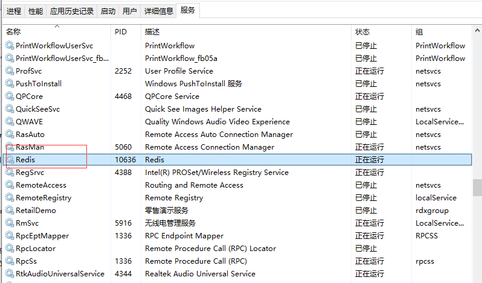

# redis

## 一 安装

网址:[Releases · tporadowski/redis · GitHub](https://github.com/tporadowski/redis/releases)

下到电脑上就可以使用.

F:\Environment\Redis-5.0.14

先打开:redis-server.exe,不能关

再打开:redis-cli.exe

然后就可以写东西了.

## 二 使用,练习

### 1.字符串的增删改查

```text
##增加一个值key为name,value为ay
127.0.0.1:6379> set name 'ay'
OK
##查询name的值
127.0.0.1:6379> get name
"ay"
##更新name的值为a1
127.0.0.1:6379> set name 'a1'
OK
##查询name的值
127.0.0.1:6379> get name
"a1"
##删除name的值
127.0.0.1:6379> del name
(integer) 1
##查询是否存在name,0代表不存在
127.0.0.1:6379> exists name
(integer) 0
127.0.0.1:6379>
```

### 2.List集合的增删改查

```text
##添加key为users,value为'ay','al'的list集合
127.0.0.1:6379> lpush users 'ay' 'al'
(integer) 2
##查询key为users的集合
127.0.0.1:6379> lrange users 0 -1
1) "al"
2) "ay"
##往list尾部添加love元素
127.0.0.1:6379> rpush users 'love'
(integer) 3
##往list头部添加hope元素
127.0.0.1:6379> lpush users 'hope'
(integer) 4
##查询
127.0.0.1:6379> lrange users 0 -1
1) "hope"
2) "al"
3) "ay"
4) "love"
##修改index为0的值为wish
127.0.0.1:6379> lset users 0 'wish'
OK
##查询
127.0.0.1:6379> lrange users 0 -1
1) "wish"
2) "al"
3) "ay"
4) "love"
##删除index为0的值
127.0.0.1:6379> lrem users 0 'wish'
(integer) 1
127.0.0.1:6379> lrange users 0 -1
1) "al"
2) "ay"
3) "love"
```

### 3.set集合的增删改查

```text
##添加key为rs,value为 "ay" "al" "love"的集合
127.0.0.1:6379> sadd rs "ay" "al" "love"
(integer) 3
##查询key为rs的集合,但关键字打错了,查不出来
127.0.0.1:6379> smenbers rs
(error) ERR unknown command `smenbers`, with args beginning with: `rs`,
##正确的查询关键字
127.0.0.1:6379> smembers rs
1) "ay"
2) "love"
3) "al"
##删除value为love的元素,返回1表示删除成功,0表示失败
127.0.0.1:6379> srem rs 'love'
(integer) 1
##查询
127.0.0.1:6379> smembers rs
1) "ay"
2) "al"
##添加love元素,set集合是没有顺序的,所以无法判断添加到哪个位置
127.0.0.1:6379> sadd rs 'love'
(integer) 1
### 查询set集合所有值,发现天道到第二个位置
127.0.0.1:6379> smembers rs
1) "ay"
2) "love"
3) "al"
##添加love元素,由于值已经存在,返回0代表添加不成功
127.0.0.1:6379> sadd rs 'love'
(integer) 0
```

### 4.Hash

```text
##清楚数据库
127.0.0.1:6379> flushdb
OK
##创建hash,key为uh,字段为user,值为ay
127.0.0.1:6379> hset uh "user" "ay"
(integer) 1
##往key为uh的hash添加字段user1值为al
127.0.0.1:6379> hset uh "user1" "al"
(integer) 1
##uh的字段长度
127.0.0.1:6379> hlen uh
(integer) 2
##uh的所有字段
127.0.0.1:6379> hkeys uh
1) "user"
2) "user1"
##uh的所有值
127.0.0.1:6379> hvals uh
1) "ay"
2) "al"
##查询字段为user的值
127.0.0.1:6379> hget uh "user"
"ay"
##获取所有的字段和值
127.0.0.1:6379> hgetall uh
1) "user"
2) "ay"
3) "user1"
4) "al"
更新user字段为new_ay
127.0.0.1:6379> hset uh "user" "new_ay"
(integer) 0
##查询所有字段和值
127.0.0.1:6379> hgetall uh
1) "user"
2) "new_ay"
3) "user1"
4) "al"
##删除字段user和对应的值
127.0.0.1:6379> hdel uh user
(integer) 1
```

### 5.SortedSet

```test
##SortedSet集合添加ay元素,分数为1
127.0.0.1:6379> zadd userss 1 "ay"
(integer) 1
##SortedSet集合添加al元素,分数为2
127.0.0.1:6379> zadd userss 2 "al"
(integer) 1
##SortedSet集合添加love元素,分数为3
127.0.0.1:6379> zadd userss 3 "love"
(integer) 1
##按照分数由大到小查询
127.0.0.1:6379> zrevrange userss 0 -1
1) "love"
2) "al"
3) "ay"
##按照分数由小到大查询
127.0.0.1:6379> zrange userss 0 -1
1) "ay"
2) "al"
3) "love"
##查询ay的分数
127.0.0.1:6379> zscore userss "ay"
"1"
##查询love的分数
127.0.0.1:6379> zscore userss "love"
"3"
```

## 三 集成redis缓存(SSM项目配置)

### 0.首先,打开redis

F:\Environment\Redis-5.0.14\redis-server.exe


### 1.导入maven依赖

```xml
        <dependency>
            <groupId>org.slf4j</groupId>
            <artifactId>slf4j-nop</artifactId>
            <version>1.7.2</version>
        </dependency>
        <!-- jedis依赖 -->
        <dependency>
            <groupId>redis.clients</groupId>
            <artifactId>jedis</artifactId>
            <version>2.9.0</version>
        </dependency>
        <dependency>
            <groupId>org.springframework.data</groupId>
            <artifactId>spring-data-redis</artifactId>
            <version>1.8.4.RELEASE</version>
        </dependency>
        <!-- jackson -->
        <dependency>
            <groupId>com.fasterxml.jackson.core</groupId>
            <artifactId>jackson-core</artifactId>
            <version>2.13.0</version>
        </dependency>
        <dependency>
            <groupId>com.fasterxml.jackson.core</groupId>
            <artifactId>jackson-databind</artifactId>
            <version>2.13.0</version>
        </dependency>
        <dependency>
            <groupId>com.fasterxml.jackson.core</groupId>
            <artifactId>jackson-annotations</artifactId>
            <version>2.13.0</version>
        </dependency>
```

### 2.redis.properties

```properties
#访问地址  
redis.host=127.0.0.1
#访问端口  
redis.port=6379
#注意，如果没有password，此处不设置值，但这一项要保留  
redis.password=

#最大空闲数，数据库连接的最大空闲时间。超过空闲时间，数据库连接将被标记为不可用，然后被释放。设为0表示无限制。  
redis.maxIdle=300
#连接池的最大数据库连接数。设为0表示无限制  
redis.maxActive=600
#最大建立连接等待时间。如果超过此时间将接到异常。设为-1表示无限制。  
redis.maxWait=1000
#在borrow一个jedis实例时，是否提前进行alidate操作；如果为true，则得到的jedis实例均是可用的；  
redis.testOnBorrow=false
```

注意不能有空格,不然会连接失败:

org.springframework.data.redis.RedisConnectionFailureException: Cannot get Jedis connection; nested exception is redis.clients.jedis.exceptions.JedisConnectionException: Could not get a resource from the pool


### 3.spring-redis.xml

```xml
<?xml version="1.0" encoding="UTF-8"?>
<beans xmlns:xsi="http://www.w3.org/2001/XMLSchema-instance"
       xmlns="http://www.springframework.org/schema/beans" xmlns:context="http://www.springframework.org/schema/context"
       xmlns:aop="http://www.springframework.org/schema/aop" xmlns:tx="http://www.springframework.org/schema/tx"
       xsi:schemaLocation="http://www.springframework.org/schema/beans http://www.springframework.org/schema/beans/spring-beans-3.0.xsd http://www.springframework.org/schema/context http://www.springframework.org/schema/context/spring-context-3.0.xsd http://www.springframework.org/schema/aop http://www.springframework.org/schema/aop/spring-aop-3.0.xsd http://www.springframework.org/schema/tx http://www.springframework.org/schema/tx/spring-tx-3.0.xsd ">

    <!-- 连接池基本参数配置，类似数据库连接池 -->
    <context:property-placeholder location="classpath:redis.properties"
                                  ignore-unresolvable="true" />

    <!-- redis连接池 -->
    <bean id="poolConfig" class="redis.clients.jedis.JedisPoolConfig">
        <property name="maxTotal" value="${redis.maxActive}" />
        <property name="maxIdle" value="${redis.maxIdle}" />
        <property name="testOnBorrow" value="${redis.testOnBorrow}" />
    </bean>

    <!-- 连接池配置，类似数据库连接池 -->
    <bean id="jedisConnectionFactory"
          class="org.springframework.data.redis.connection.jedis.JedisConnectionFactory">
        <property name="hostName" value="${redis.host}"></property>
        <property name="port" value="${redis.port}"></property>
         <property name="password" value="${redis.password}"></property>
        <property name="poolConfig" ref="poolConfig"></property>
    </bean>

    <!--redis操作模版,使用该对象可以操作redis  -->
    <bean id="redisTemplate" class="org.springframework.data.redis.core.RedisTemplate" >
        <property name="connectionFactory" ref="jedisConnectionFactory" />
        <!--如果不配置Serializer，那么存储的时候缺省使用String，如果用User类型存储，那么会提示错误User can't cast to String！！  -->
        <property name="keySerializer" >
            <bean class="org.springframework.data.redis.serializer.StringRedisSerializer" />
        </property>
        <property name="valueSerializer" >
            <bean class="org.springframework.data.redis.serializer.GenericJackson2JsonRedisSerializer" />
        </property>
        <property name="hashKeySerializer">
            <bean class="org.springframework.data.redis.serializer.StringRedisSerializer"/>
        </property>
        <property name="hashValueSerializer">
            <bean class="org.springframework.data.redis.serializer.GenericJackson2JsonRedisSerializer"/>
        </property>
        <!--开启事务  -->
        <property name="enableTransactionSupport" value="true"></property>
    </bean >


    <!-- 配置RedisCacheManager -->
<!--    <bean id="redisCacheManager" class="org.springframework.data.redis.cache.RedisCacheManager">-->
<!--        <constructor-arg name="redisOperations" ref="redisTemplate" />-->
<!--        <property name="defaultExpiration" value="${redis.expiration}" />-->
<!--    </bean>-->

    <!-- 配置RedisCacheConfig -->
<!--    <bean id="redisCacheConfig" class="cn.qlq.util.RedisCacheConfig">-->
<!--        <constructor-arg ref="jedisConnectionFactory"/>-->
<!--        <constructor-arg ref="redisTemplate"/>-->
<!--        <constructor-arg ref="redisCacheManager"/>-->
<!--    </bean>-->

    <!-- 下面这个是整合Mybatis的二级缓存使用的 -->
<!--    <bean id="redisCacheTransfer" class="cn.qlq.jedis.RedisCacheTransfer">-->
<!--        <property name="jedisConnectionFactory" ref="jedisConnectionFactory" />-->
<!--    </bean>-->

</beans>
```

注意,当一个项目中,有两个配置要读取properties文件资源时,要这样写

```
<context:property-placeholder location="classpath:redis.properties"
                              ignore-unresolvable="true" />
```

**ignore-unresolvable="true"**

不然会报错:定会出"Could not resolve placeholder"。

出现“Could not resolve placeholder 'redis.pool.maxTotal' in string value "${redis.pool.maxTotal}”，

注意两个都要加上ignore-unresolvable="true"，一个加另一个不加也是不行的

### 4.测试

RedisTest.java

```java
package com.hrs.test;

import com.hrs.util.getBean;
import org.junit.jupiter.api.Test;
import org.springframework.beans.factory.annotation.Autowired;
import org.springframework.data.redis.core.RedisTemplate;
import org.springframework.stereotype.Component;

import javax.annotation.Resource;

/** redis缓存测试
 * @author Ay
 * @create 2018/07/08
 **/
@Component
public class RedisTest{

    private RedisTemplate redisTemplate= getBean.redisTemplate;

    @Test
    public void testRedis(){
        redisTemplate.opsForValue().set("name", "ay");
        String name = (String) redisTemplate.opsForValue().get("name");
        System.out.println("value of name is:" + name);
    }
}

```

附上getBean工具类

```java
package com.hrs.util;

import com.hrs.service.*;
import org.apache.ibatis.session.SqlSession;
import org.springframework.beans.factory.annotation.Autowired;
import org.springframework.context.ApplicationContext;
import org.springframework.context.support.ClassPathXmlApplicationContext;
import org.springframework.data.redis.core.RedisTemplate;

public class getBean {
    public static ApplicationContext context=new ClassPathXmlApplicationContext("applicationContext.xml");

    public static RedisTemplate redisTemplate = context.getBean(RedisTemplate.class);
}

```

### 5.结果

如果程序运行成功,且结果如下则成功


6.在Service层中不能用getBean的方式获取,直接@Autowired即可

因为getBean先加载了service层,互相调用会起冲突

getBean还没初始化就被MoodServiceImpl调用

```
private RedisTemplate redisTemplate;
@Autowired
public void setRedisTemplate(RedisTemplate redisTemplate){
    this.redisTemplate=redisTemplate;
}
```


# 方式二

将redis加入到缓存中,就可以不用打开exe文件,直接使用

## 1.安装


安装完成之后,可以查看到redis服务



再安装redis可视化应用


## 2.连接redis


## 3.在java中2配置redis

引入maven依赖

```xml
    <!--    reids依赖,spring下的依赖可以不写版本,让框架匹配最适合的版本  -->
        <!-- https://mvnrepository.com/artifact/org.springframework.boot/spring-boot-starter-data-redis -->
        <dependency>
            <groupId>org.springframework.boot</groupId>
            <artifactId>spring-boot-starter-data-redis</artifactId>
            <!--<version>2.4.9</version>-->
        </dependency>
```

配置application.yaml文件

```
spring:
#    redis相关配置
  redis:
#    配置主机
    host: 127.0.0.1
#    配置使用的数据库
    database: 0
```

编写配置类,RedisConfig

```java
package com.example.backstage.config;

import com.fasterxml.jackson.annotation.JsonAutoDetect;
import com.fasterxml.jackson.annotation.JsonTypeInfo;
import com.fasterxml.jackson.annotation.PropertyAccessor;
import com.fasterxml.jackson.databind.ObjectMapper;
import com.fasterxml.jackson.databind.jsontype.impl.LaissezFaireSubTypeValidator;
import org.springframework.context.annotation.Bean;
import org.springframework.context.annotation.Configuration;
import org.springframework.data.redis.connection.RedisConnectionFactory;
import org.springframework.data.redis.core.RedisTemplate;
import org.springframework.data.redis.serializer.Jackson2JsonRedisSerializer;
import org.springframework.data.redis.serializer.StringRedisSerializer;

/**
 * @Author 阿杰
 * @create 2021-04-25 8:53
 */
@Configuration
public class RedisConfig {
    @Bean
    public RedisTemplate<String, Object> redisTemplate(RedisConnectionFactory redisConnectionFactory) {
        RedisTemplate<String, Object> template = new RedisTemplate<>();
        //建立redis连接
        template.setConnectionFactory(redisConnectionFactory);
        // json序列号
        Jackson2JsonRedisSerializer<Object> serializer = new Jackson2JsonRedisSerializer<Object>(Object.class);
        ObjectMapper mapper = new ObjectMapper();
        mapper.setVisibility(PropertyAccessor.ALL, JsonAutoDetect.Visibility.ANY);
        mapper.activateDefaultTyping(LaissezFaireSubTypeValidator.instance, ObjectMapper.DefaultTyping.NON_FINAL, JsonTypeInfo.As.PROPERTY);
        serializer.setObjectMapper(mapper);
        //string序列号
        StringRedisSerializer stringRedisSerializer = new StringRedisSerializer();
        // key采用string的序列化方式
        template.setKeySerializer(stringRedisSerializer);
        // Hash的key 采用string的序列化方式
        template.setHashKeySerializer(stringRedisSerializer);
        // value采用Jackson2JsonRedisSerializer的序列化方式
        template.setValueSerializer(serializer);
        // Hash的value 采用Jackson2JsonRedisSerializer的序列化方式
        template.setHashValueSerializer(serializer);
        // 配置具体的序列化方式
        template.afterPropertiesSet();
        return template;
    }
}

```

## 4.编写工具类

```java
package com.example.backstage.util;

import lombok.extern.slf4j.Slf4j;
import org.springframework.beans.factory.annotation.Autowired;
import org.springframework.data.redis.core.RedisTemplate;
import org.springframework.stereotype.Component;

import javax.annotation.Resource;
import java.util.concurrent.TimeUnit;

/**
 * @author HuaRunSheng
 * @date 2022/10/23 15:04
 * @description :
 */
@Component
@Slf4j
public class RedisUtil {
    @Resource
    private RedisTemplate<String, Object> redisTemplate;

    /**
     * 向redis存值
     * @param key: 键
     * @param value: 值
     * @return :是否存入成功
     */
    public boolean setValue(String key, Object value){
        try {
            redisTemplate.opsForValue().set(key, value);
            return true;
        } catch (Exception e){
            log.error("向redis中存入值时异常-->{}", e.getMessage());
            return false;
        }
    }

    /**
     * 向redis中存值并指定过期时间
     * @param key: 键
     * @param value: 值
     * @param time: 时间,分为单位
     * @return :是否存入成功
     */
    public boolean setValueTime(String key, Object value, long time){
        try {
            if (time > 0){
                redisTemplate.opsForValue().set(key, value, time, TimeUnit.MINUTES);
            }else{
                redisTemplate.opsForValue().set(key, value);
            }

        } catch (Exception e){
            log.error("设置缓存并指定过期事件异常-->{}", e.getMessage());
            return false;
        }
        return true;
    }

    /**
     * 根据key获取redis中的值
     * @param key
     * @return
     */
    public Object getValue(String key){
        return key == null ? null : redisTemplate.opsForValue().get(key);
    }

    public void delKey(String... keys){
        if (keys != null && keys.length > 0){
            if (keys.length == 1){
                redisTemplate.delete(keys[0]);
            }else{
                for (int i = 0; i < keys.length; i++) {
                    redisTemplate.delete(keys[i]);
                }
            }
        }
    }

    public boolean hasKey(String key){
        try {
            return Boolean.TRUE.equals(redisTemplate.hasKey(key));
        } catch (Exception e){
            log.error("redis值不存在-->{}", e.getMessage());
            return false;
        }
    }

    /**
     * 0代表永久有效,大于0就代表多少分钟失效
     * @param key
     * @return
     */
    public Long isExpire(String key){
        return redisTemplate.getExpire(key, TimeUnit.MINUTES);
    }

    /**
     * 给key加过期时间
     * @param key
     * @param time
     * @return
     */
    public boolean expire(String key, long time){
        try {
            if (time > 0){
                redisTemplate.expire(key, time, TimeUnit.MINUTES);
            }
            return true;
        }catch (Exception e){
            log.error("给旧的缓存设置新的过期时间异常-->{}", e.getMessage());
            return false;
        }
    }

}

```


## 5.注意事项

实体类中如果继承了其他的类,有@Override注解的方法,要加入@JsonIgnore


因为重写的方法不是实体类本身的,json序列化时会找不到


## 6.使用

1.注入RedisUtil

```
@Autowired
private RedisUtil redisUtil;
```

2.写入数据

```
redisUtil.setValueTime("userInfo"+username, user, 5);
```

3.查看


# 理论

## Redis 缓存问题

在高并发的业务场景下，数据库大多数情况下都是用户并发访问最薄弱的环节。所以，就需要使用 Redis 做一个缓存操作，让请求先访问到 Redis ，而不是直接访问 MySQL 等数据库。这样可以大大缓解数据库的压力。

- 缓存穿透
- 缓存击穿
- 缓存雪崩
- 缓存污染（或者满了）
- 缓存和数据库一致性

### 缓存穿透

#### **问题来源**

缓存穿透是指**缓存和数据库中都没有的数据**，**而用户不断发起请求**。由于缓存是不命中时被动写的，而且出于容错考虑，如果从 数据库 查不到数据则不写入缓存，这将导致这个不存在的数据每次请求都要到 数据库 去查询，失去了缓存的意义。

在流量大的时候，可能数据库就挂掉了，要是有人利用不存在的 key 频繁攻击我们的应用，这就是漏洞。

#### 案例

发起 id 为“-1”的数据 或者 id 为特别大不存在的数据，这时的用户很可能是攻击者，攻击会导致数据库压力过大。

#### **解决方案**

- 接口层增加校验。如用户鉴权校验，id 做基础校验，id <= 0 的直接拦截。
- 从缓存取不到的数据，在数据库中也没有取到，这时也可以将 key-value对 写为 key-null ，缓存有效时间可以设置 短点 ，如 30秒（设置太长会导致正常情况下也没法使用）。这样就可以防止攻击用户反复用一个 id 暴力攻击。
- 布隆过滤器。bloomfilter 就类似于一个 hash set ，用户快速判断某个元素是否存在于集合中，其典型的应用场景就是快速判断一个key是否存在于某容器，不存在就直接返回。布隆过滤器的关键就在于 hash算法 和 容器大小。


### 缓存击穿

#### **问题来源**

缓存击穿是指 **缓存中没有但数据库中有的数据（一般是缓存时间到期），这时由于并发用户特别多，同时读缓存没读到数据，又同时去数据库取数据，引起数据库压力瞬间增大，造成压力过大**。

#### **解决方案**

- **设置热点数据永不过期。**
- **接口限流与熔断、降级**。重要的接口一定要做好限流策略，防止用户恶意刷接口，同时要降级准备，当接口中的某些服务不可用时，进行熔断，失败快速返回机制。
- **加互斥锁**（redis 分布式锁 或 ReentrantLock），第一个请求的线程可以拿到锁，拿到锁的线程查询到了数据之后设置缓存，其他线程获取锁失败会等待 50ms ，然后重新到缓存拿数据，这样就可以避免大量请求落到数据库。


### 缓存雪崩

#### 问题来源

缓存雪崩是指 **缓存中大批量数据到过期时间，而查询数据量巨大，引起数据库压力过大甚至down机**。和缓存击穿不同的是，缓存击穿指并发查同一条数据，缓存雪崩是不同数据都过期了，很多数据都查不到从而查数据库。

#### 解决方案

1. 缓存数据的**过期时间设置随机**，防止同一时间大量数据过期现象的发生。
1. 如果缓存数据库是分布式部署，**将热点数据均匀分布在不同的缓存数据库中**。
1. **设置热点数据永不过期**。


### 缓存污染（或满了）

#### 问题来源

缓存区,存储了太多数据.导致空间不够用.

缓存污染问题说的是缓存中一些只会被访问一次或者几次的数据，被访问完后，再也不会被访问到，但这部分数据依然留存在缓存中，消耗缓存空间。

#### 解决方案

**建议把缓存容量设置为总数据量的** **15% 到 30%** **，兼顾访问性能和内存空间开销。**

需要缓存淘汰策略,根据淘汰策略去选择要淘汰的数据，然后进行删除操作。


### 数据库和缓存一致性

#### 问题来源

使用 Redis 做一个缓冲操作，让请求先访问到 Redis ，而不是直接访问 MySQL 数据库：

读取缓存步骤一般没有什么问题，但是一旦涉及到数据更新：**数据库和缓存更新**，就容易出现缓存（Redis）和数据库（MySQL）间的数据一致性问题。


**不管是先写 MySQL 数据库，再删除 Redis 缓存；还是先删除缓存，再写库，都有可能出现数据不一致的情况**。

#### 案例

1. 如果删除缓存 Redis，但还没来得及 写库 MySQL，另一个线程就来读取，发现缓存为空，则去数据库中读取数据写入缓存，此时缓存中为脏数据。
1. 如果先写了库，在删除缓存前，写库的线程宕机了，没有删除掉缓存，则也会出现数据不一致的情况。

#### *更新缓存的 Design Pattern* 

##### Cache Aside Pattern

- **读的时候**：先读缓存，缓存没有的话，就读数据库，然后取出数据后放入缓存，同时返回响应。
- **更新的时候**：先更新数据库，然后再删除缓存。

其具体逻辑如下：

- **失效：**应用程序先从 cache 取数据，没有的到，则从数据库中取数据，成功后，放到缓存中。
- **命中**：应用程序从 cache 中取数据，取到后返回。
- **更新**：先把数据存到数据库中，成功后，再让缓存淘汰。


## Redis是什么

数据类型、数据一致、效率、安全

Redis是一个key-value存储系统，它支持存储的value类型相对更多，包括string、list、set、zset和hash。为了保证数据一致，Redis中数据的操作都是原子性的。为了保证效率，数据都是缓存在内存中。为保证安全，Redis会周期性的把更新的数据写入磁盘或者把修改操作写入追加的记录文件，并且在此基础上实现了master-slave（主从）同步。


## Redis有哪些功能？

### 1.基于本机内存的缓存

当调用api访问数据库时，假如此过程需要2秒，如果每次请求都要访问数据库，那将对服务器造成巨大的压力，如果将此sql的查询结果存到Redis中，再次请求时，直接从Redis中取得，而不是访问数据库，效率将得到巨大的提升，Redis可以定时去更新数据（比如1分钟）。


### 2.持久化的功能

如果电脑重启，写入内存的数据是不是就失效了呢，这时Redis还提供了持久化的功能。

### 3、哨兵（Sentinel）和复制

Sentinel可以管理多个Redis服务器，它提供了监控、提醒以及自动的故障转移功能；

复制则是让Redis服务器可以配备备份的服务器；

Redis也是通过这两个功能保证Redis的高可用；

### 4、集群（Cluster）

单台服务器资源总是有上限的，CPU和IO资源可以通过主从复制，进行读写分离，把一部分CPU和IO的压力转移到从服务器上，但是内存资源怎么办，主从模式只是数据的备份，并不能扩充内存；

现在我们可以横向扩展，让每台服务器只负责一部分任务，然后将这些服务器构成一个整体，对外界来说，这一组服务器就像是集群一样。


## Redis为什么是单线程的？

1. 代码更清晰，处理逻辑更简单；
1. 不用考虑各种锁的问题，不存在加锁和释放锁的操作，没有因为可能出现死锁而导致的性能问题；
1. 不存在多线程切换而消耗CPU；
1. 无法发挥多核CPU的优势，但可以采用多开几个Redis实例来完善；


## Redis真的是单线程的吗？

Redis6.0之前是单线程的，Redis6.0之后开始支持多线程；
redis内部使用了基于epoll的多路复用，也可以多部署几个redis服务器解决单线程的问题；
redis主要的性能瓶颈是内存和网络；
内存好说，加内存条就行了，而网络才是大麻烦，所以redis6内存好说，加内存条就行了；
而**网络**才是大麻烦，所以redis6.0引入了多线程的概念，
redis6.0在网络IO处理方面引入了多线程，如网络数据的读写和协议解析等，需要注意的是，执行命令的核心模块还是单线程的。


## Redis持久化有几种方式？

redis提供了两种持久化的方式，分别是RDB（Redis DataBase）和AOF（Append Only File）。

RDB，简而言之，就是在不同的时间点，将redis存储的数据生成快照并存储到磁盘等介质上；

AOF，则是换了一个角度来实现持久化，那就是将redis执行过的所有写指令记录下来，在下次redis重新启动时，只要把这些写指令从前到后再重复执行一遍，就可以实现数据恢复了。

其实RDB和AOF两种方式也可以同时使用，在这种情况下，如果redis重启的话，则会优先采用AOF方式来进行数据恢复，这是因为AOF方式的数据恢复完整度更高。

## Redis支持的 java 客户端都有哪些？

Redisson、Jedis、lettuce 等等，官方推荐使用 Redisson。


## Redis怎么实现分布式锁？

使用Redis实现分布式锁

redis命令：set users 10 nx ex 12  原子性命令

```java
//使用uuid，解决锁释放的问题
@GetMapping
public void testLock() throws InterruptedException {
    String uuid = UUID.randomUUID().toString();
    Boolean b_lock = redisTemplate.opsForValue().setIfAbsent("lock", uuid, 10, TimeUnit.SECONDS);
    if(b_lock){
        Object value = redisTemplate.opsForValue().get("num");
        if(StringUtils.isEmpty(value)){
            return;
        }
        int num = Integer.parseInt(value + "");
        redisTemplate.opsForValue().set("num",++num);
        Object lockUUID = redisTemplate.opsForValue().get("lock");
        if(uuid.equals(lockUUID.toString())){
            redisTemplate.delete("lock");
        }
    }else{
        Thread.sleep(100);
        testLock();
    }
}
```

备注：可以通过lua脚本，保证分布式锁的原子性。

## Redis分布式锁有什么缺陷？

Redis 分布式锁不能解决超时的问题，分布式锁有一个超时时间，程序的执行如果超出了锁的超时时间就会出现问题。

Redis容易产生的几个问题：

1. 锁未被释放
1. B锁被A锁释放了
1. 数据库事务超时
1. 锁过期了，业务还没执行完
1. Redis主从复制的问题

## Redis如何做内存优化？

1、缩短键值的长度

1. 缩短值的长度才是关键，如果值是一个大的业务对象，可以将对象序列化成二进制数组；
1. 首先应该在业务上进行精简，去掉不必要的属性，避免存储一些没用的数据；
1. 其次是序列化的工具选择上，应该选择更高效的序列化工具来降低字节数组大小；
1. 以JAVA为例，内置的序列化方式无论从速度还是压缩比都不尽如人意，这时可以选择更高效的序列化工具，如: protostuff，kryo等

2、共享对象池

对象共享池指Redis内部维护[0-9999]的整数对象池。创建大量的整数类型redisObject存在内存开销，每个redisObject内部结构至少占16字节，甚至超过了整数自身空间消耗。所以Redis内存维护一个[0-9999]的整数对象池，用于节约内存。 除了整数值对象，其他类型如list,hash,set,zset内部元素也可以使用整数对象池。因此开发中在满足需求的前提下，尽量使用整数对象以节省内存。

3、字符串优化

4、编码优化

5、控制key的数量


## 数据类型

https://worktile.com/kb/ask/20474.html

### 1.string（字符串）；

**字符串**类型是Redis中最基本的数据存储类型，它是一个由字节组成的序列，在Rediss中是二进制安全的。这意味着该类型可以接受任何格式数据，如JPEG图像数据和Json对象说明信息。它是标准的key-value，通常用于存储字符串、整数和浮点。Value可容纳高达512MB的数据。

‎由于所有数据都在单个对象中，Redis 中的字符串操作速度非常快。‎**`‎基本的‎`**‎ Redis 命令（如 SET、‎**`‎GET‎`**‎ 和 ‎**`‎DEL‎`**‎）允许您对字符串值执行基本操作。‎

- **`‎SET 键值‎`‎ ‎**‎– 设置指定键的值。‎
- **`‎GET 键‎`‎ ‎**‎– 检索指定键的值。‎
- **`‎DEL 键‎`‎ ‎**‎– 删除给定键的值。‎

应用程序场景：非常常见的场景用于计算站点访问量、当前在线人数等

### 2.hash（哈希）；

**Redis hash** 是一个键值(key=>value)对集合。Redis hash 是一个 string 类型的 field 和 value 的映射表，hash 特别适合用于存储对象。Redis的Hash结构可以使你像在数据库中Update一个属性一样只修改某一项属性值。和String略像，但value中存放的是一张表，一般用于多个个体的详细事项排列，String也可以做到，但要比hash麻烦许多。

哈希命令允许您独立访问和更改单个或多个字段。‎

- **`‎HSET‎`**‎ – 将值映射到哈希中的键。‎
- **`‎HGET‎`**‎ – 检索与哈希中的键关联的各个值。‎
- **`‎HGETALL‎`‎ ‎**‎– 显示整个哈希内容。‎
- **`‎HDEL‎`**‎ – 从哈希中删除现有的键值对。‎

应用程序方案：存储部分更改数据，如用户信息、会话共享。

### 3.list（列表）；

**Redis 列表**是简单的字符串列表，按照插入顺序排序。你可以添加一个元素到列表的头部（左边）或者尾部（右边）。Redis的列表允许用户从序列的两端推入或者弹出元素，列表由多个字符串值组成的有序可重复的序列，是链表结构，所以向列表两端添加元素的时间复杂度为0(1)，获取越接近两端的元素速度就越快。这意味着，即使有数以千万计的元素列表，也可以极快地获得10条记录在头部或尾部。可列入名单的要素最多只有4294967295个。

此‎**‎字符串链表‎**‎允许您执行一组操作，例如：‎

- **`‎LPUSH‎`**‎ – 将值推送到列表的左端。‎
- **`‎RPUSH‎`**‎ – 将值推送到列表的尾端。‎
- **`‎LRANGE‎`**‎ – 检索一系列项目。‎
- **`‎LPOP/RPOP‎`‎ ‎**‎– 用于显示和删除两端的项目。‎
- **`‎LINDEX‎`‎ ‎**‎– 从列表中的特定位置获取值。‎

应用场景：最新消息排行榜；消息队列，以完成多程序之间的消息交换。

### 4、set（集合）

**Redis 的 Set** 是 string 类型的无序集合。集合是通过哈希表实现的，所以添加，删除，查找的复杂度都是 O(1)。所谓集合就是一堆不重复值的组合，并且是没有顺序的。在微博应用中，可以将一个用户所有的关注人存在一个集合中，将其所有粉丝存在一个集合。Redis还提供了诸如collection、union和differences等操作，使得实现诸如commandism、poperhike、secondfriends这样的功能变得很容易，或者选择是将结果返回给客户机，还是将它们保存到使用不同命令的新的集合中。

使用‎**‎以下命令‎**‎添加、删除、检索和检查集合中的各个项目：‎

- **`‎SADD‎`**‎ – 向集合中添加一个或多个项目。‎
- **`\**`SISMEMBER`\**`**‎ – 找出一个项目是否是集合的一部分。‎
- **`‎SMEMBERS‎`**‎ – 从集合中检索所有项目。‎
- **`‎SREM‎`**‎ – 从集合中删除现有项。‎


### 5.sort set （有序集合）

**sorted set**也叫Redis zset ，和set 一样也是string类型元素的集合，且不允许重复的成员。不同的是每个元素都会关联一个double类型的分数。redis正是通过分数来为集合中的成员进行从小到大的排序。zset的成员是唯一的,但分数(score)却可以重复。

您可以按成员、排序顺序和分数值访问排序集中的项目。基本命令允许您根据成员值和分数范围提取、添加、删除单个值或检索项目。‎

- **`‎ZADD‎`‎ ‎**‎– 将具有分数的成员添加到排序集。‎
- **`‎ZRANGE‎`‎ ‎**‎– 根据项目在排序顺序中的位置检索项目。‎**`‎withscores‎`‎ ‎**‎选项生成实际分数值。‎
- **`‎ZRANGEBYSCORE ‎`**‎– 根据定义的分数范围从排序集中提取项目。‎**`‎withscores‎`‎ ‎**‎选项生成实际分数值。‎
- **`‎ZREM‎`‎ –‎**‎从已排序的集中删除项目。‎

使用场景：带有权重的元素，比如一个游戏的用户得分排行榜；比较复杂的数据结构，一般用到的场景不算太多。

```java
# RedisTemplate
 
redisTemplate.opsForValue();//操作字符串
redisTemplate.opsForHash();//操作hash
redisTemplate.opsForList();//操作list
redisTemplate.opsForSet();//操作set
redisTemplate.opsForZSet();//操作有序set
 
 
//向redis里存入数据和设置缓存时间
//参数1：是key 键
//参数2：是值 是存入redis里的值
//参数3：时间，类型为long
//参数4：时间类型，
如：TimeUnit.MILLISECONDS 代表分钟  
RedisTemplate.opsForValue().set("baike", "100", 60 * 10, TimeUnit.SECONDS);
//根据key获取缓存中的val  
RedisTemplate.opsForValue().get("baike")
//根据key获取过期时间并指定返回形式  
RedisTemplate.opsForValue().getOperations.getExpire("baike",TimeUnit.HOURS);
//根据key获取过期时间并换算成指定单位
RedisTemplate.getExpire("baike",TimeUnit.SECONDS);
//根据key删除缓存  
RedisTemplate.delete("baike");
//检查key是否存在，返回boolean值  
RedisTemplate.hasKey("baike");
//向指定key中存放set集合  
RedisTemplate.opsForSet().add("baike", "1","2","3");
//设置过期时间  
RedisTemplate.expire("baike",1000 , TimeUnit.MILLISECONDS);
//根据key查看集合中是否存在指定数据  
RedisTemplate.opsForSet().isMember("baike", "1");
 
 
//time颗粒度
TimeUnit.DAYS          	//天  
TimeUnit.HOURS         	//小时  
TimeUnit.MINUTES       	//分钟  
TimeUnit.SECONDS      	//秒  
TimeUnit.MILLISECONDS  	//毫秒 
TimeUnit.NANOSECONDS   	//毫微秒
TimeUnit.MICROSECONDS  	//微秒
 

```


