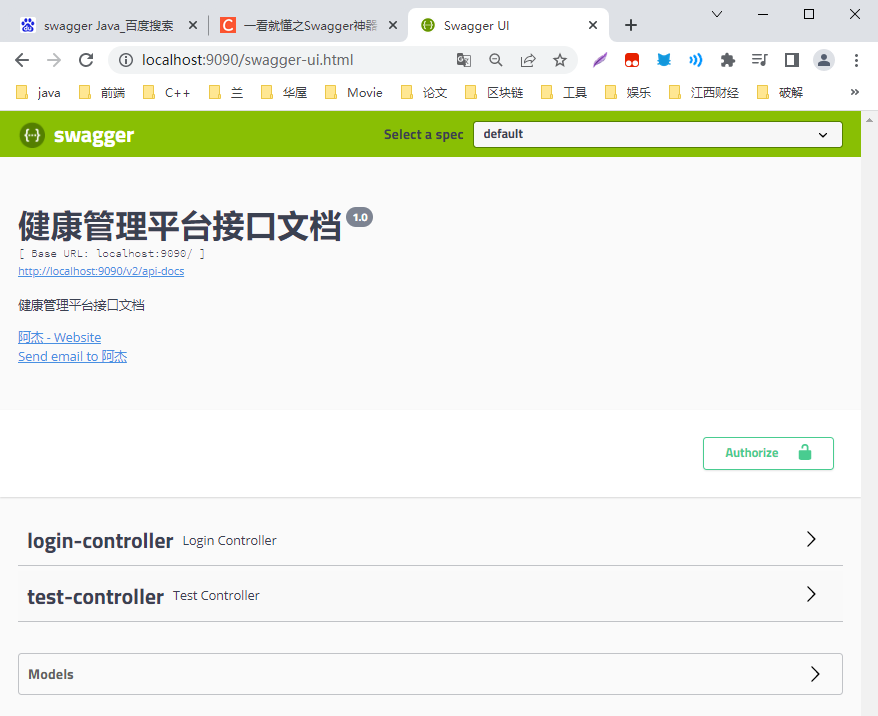

# 一、[Swagger](https://so.csdn.net/so/search?q=Swagger&spm=1001.2101.3001.7020)是什么？

Swagger 是一个规范且完整的[框架](https://so.csdn.net/so/search?q=框架&spm=1001.2101.3001.7020)，用于生成、描述、调用和可视化 RESTful 风格的 Web 服务。

- 支持 API 自动生成同步的在线文档：使用 Swagger 后可以直接通过代码生成文档，不再需要自己手动编写接口文档了，对程序员来说非常方便，可以节约写文档的时间去学习新技术。
- 提供 Web 页面在线测试 API：光有文档还不够，Swagger 生成的文档还支持在线测试。参数和格式都定好了，直接在界面上输入参数对应的值即可在线测试接口。


# 二、使用步骤

## 1.引入swagger依赖

```xml
<!--swagger依赖-->
        <dependency>
            <groupId>io.springfox</groupId>
            <artifactId>springfox-swagger2</artifactId>
            <version>2.9.2</version>
        </dependency>

        <dependency>
            <groupId>io.springfox</groupId>
            <artifactId>springfox-swagger-ui</artifactId>
            <version>2.9.2</version>
        </dependency>

```

## 2.编写代码

编写配置类:

```java
package com.example.backstage.config;

import com.github.xiaoymin.knife4j.spring.annotations.EnableKnife4j;
import org.springframework.beans.factory.annotation.Value;
import org.springframework.context.annotation.Bean;
import org.springframework.context.annotation.Configuration;
import org.springframework.web.servlet.config.annotation.EnableWebMvc;
import org.springframework.web.servlet.config.annotation.ResourceHandlerRegistry;
import org.springframework.web.servlet.config.annotation.WebMvcConfigurationSupport;
import springfox.documentation.builders.ApiInfoBuilder;
import springfox.documentation.builders.PathSelectors;
import springfox.documentation.builders.RequestHandlerSelectors;
import springfox.documentation.service.*;
import springfox.documentation.spi.DocumentationType;
import springfox.documentation.spi.service.contexts.SecurityContext;
import springfox.documentation.spring.web.plugins.Docket;
import springfox.documentation.swagger2.annotations.EnableSwagger2;

import java.util.ArrayList;
import java.util.List;

/**
 * @author HuaRunSheng
 * @date 2022/5/19 10:45
 * @description :请求路径管理 接口文档配置
 */
@Configuration
// 启动swagger
@EnableSwagger2
//@EnableKnife4j
//@EnableWebMvc
public class SwaggerConfig extends WebMvcConfigurationSupport {
    /**
     * 创建接口文档
     * @return 返回接口文档
     */
    @Value("${jwt.tokenHeader}")
    private String tokenHeader;
    @Override
    protected void addResourceHandlers(ResourceHandlerRegistry registry) {
        // 解决静态资源访问问题
        registry.addResourceHandler("/**").addResourceLocations("classpath:/static/");
        // 解决swagger访问问题
        registry.addResourceHandler("/swagger-ui.html").addResourceLocations("classpath:/META-INF/resources/");
        // 解决swagger的js文件访问问题
        registry.addResourceHandler("/webjars/**").addResourceLocations("classpath:/META-INF/resources/webjars/");

    }
    @Bean
    public Docket createRestApi() {
        return  new Docket(DocumentationType.SWAGGER_2)
                // 使用默认的返回信息
                .useDefaultResponseMessages(false)
                // 生成api
                .apiInfo(apiInfo())
                // 使用选择器，找到controller包
                .select()
                .apis(RequestHandlerSelectors.basePackage("com.example.backstage.controller"))
                // 扫描所有的接口
                .paths(PathSelectors.any())
                .build()
                //默认swagger授权有权限测试接口
                .securityContexts(securityContexts())
                // 配置接口文档
                .securitySchemes(securitySchemes());

    }
    // 生成api
    private ApiInfo apiInfo() {
        return new ApiInfoBuilder()
                .title("健康管理平台接口文档")
                .description("健康管理平台接口文档")
                .contact(new Contact("阿杰", "http://localhost:9000/doc.html", "ajie20999@163.com"))
                .version("1.0")
                .build();
    }

    //// 配置接口文档
    private List<ApiKey> securitySchemes() {
        //设置请求头信息
        List<ApiKey> apiKeys = new ArrayList<>();
        // 请求头：tokenHeader
        ApiKey apiKey = new ApiKey("Authorization", "Authorization", "Header");
        apiKeys.add(apiKey);
        return apiKeys;
    }

    private List<SecurityContext> securityContexts() {
        List<SecurityContext> list = new ArrayList<>();
        // 添加授权路径
        list.add(getContextByPath("/hello/.*"));
        return list;
    }

    /**
     * 得到授权路径
     * @param pathRegex
     * @return
     */
    private SecurityContext getContextByPath(String pathRegex) {
        return SecurityContext
                .builder()
                .securityReferences(defaultAuth())
                // 匹配路径
                .forPaths(PathSelectors.regex(pathRegex))
                .build();
    }

    /**
     * 默认swagger授权
     * @return
     */
    private List<SecurityReference> defaultAuth() {
        List<SecurityReference> list = new ArrayList<>();
        //授权范围和授权描述
        AuthorizationScope scope = new AuthorizationScope("global", "accessEverything");
        AuthorizationScope[] authorizationScopes = new AuthorizationScope[1];
        authorizationScopes[0] = scope;
        list.add(new SecurityReference("Authorization", authorizationScopes));
        return list;
    }

    //@Bean
    //public Docket createApi(){
    //    return new Docket(DocumentationType.SWAGGER_2)
    //            .useDefaultResponseMessages(false)
    //            .apiInfo(apiInfo())
    //            .select()
    //            // 查找接口
    //            .apis(RequestHandlerSelectors.basePackage("com/example/backstage/controller"))
    //            .paths(PathSelectors.any())
    //            .build()
    //            .securitySchemes(securitySchemes())
    //            .securityContexts(securityContexts());
    //}
    //
    ///**
    // * 设置文档信息
    // * @return
    // */
    //private ApiInfo apiInfo(){
    //    return new ApiInfoBuilder()
    //            .title("个人运动管理平台")
    //            .version("1.0.0")
    //            .contact(new Contact("hrs","http://localhost:9090/doc.html","1253088506@qq.com"))
    //            .description("个人运动管理平台接口文档")
    //            .build();
    //}
    //
    ///**
    // * 设置请求的信息
    // * @return
    // */
    //private List<ApiKey> securitySchemes(){
    //    List<ApiKey> list=new ArrayList<>();
    //
    //    ApiKey apiKey=new ApiKey(tokenHeader,tokenHeader,"Header");
    //    list.add(apiKey);
    //    return list;
    //}
    //
    ///**
    // * 配置security对swagger测试的权限
    // * @return
    // */
    //public List<SecurityContext> securityContexts(){
    //    //认证信息
    //    List<SecurityContext> list=new ArrayList<>();
    //    list.add(securityContext());
    //    return list;
    //}
    //
    ///**
    // * 得到授权路径
    // * @return
    // */
    //public SecurityContext securityContext(){
    //    return SecurityContext.builder()
    //            .securityReferences(securityReferences())
    //            // 匹配路径
    //            .forPaths(PathSelectors.regex("hello/.*"))
    //            .build();
    //}
    //
    ///**
    // * 给swagger授权,口音进行接口测试
    // * @return
    // */
    //private List<SecurityReference> securityReferences(){
    //    List<SecurityReference> list=new ArrayList<>();
    //    // 授权范围,global 全局
    //    AuthorizationScope scope=new AuthorizationScope("global", "accessEverything");
    //    AuthorizationScope[] scopes={scope};
    //    list.add(new SecurityReference(tokenHeader,scopes));
    //    return list;
    //}
}


```

### 3.配置swagger白名单

```java
// swagger相关
            "/swagger-ui.html",
            "/**/api-docs",
            "/webjars/**",
            "/swagger-resources/**",

            "/doc.html",
            "/favicon.ico",

            "/v2/**",
            "/configuration/ui",
            "/configuration/security",
            "/csrf/**",

            "/",
```


# 3.效果

http://localhost:9090/swagger-ui.html



# 4.swagger可视化工具

https://doc.xiaominfo.com/docs/quick-start


