# 打包项目

一个项目在开发阶段有本地环境,生产环境,测试环境,演示环境

本地环境就是开发者的环境,生产环境就是客户所用的环境


## 1.将SpringBoot项目打包

打包:https://blog.csdn.net/Box_clf/article/details/79966542

报错:https://blog.csdn.net/HKkkkkSky/article/details/124280771

### 1.点击maven

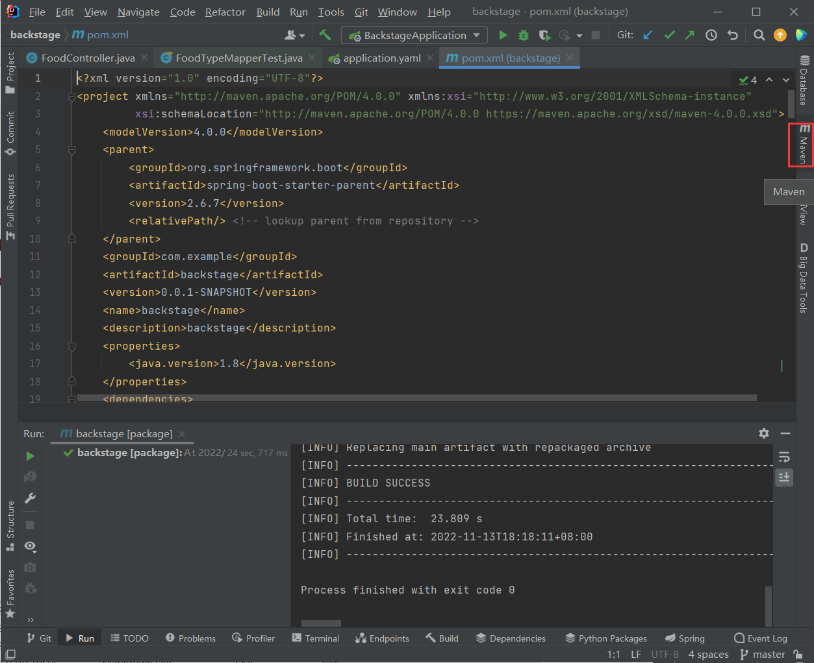

点击跳过test-->clean-->package

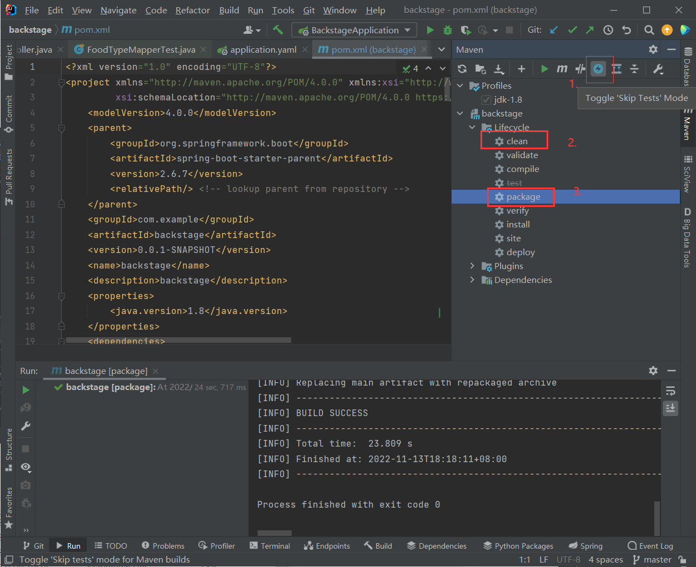


### 2.打包结果

打包成功信息:

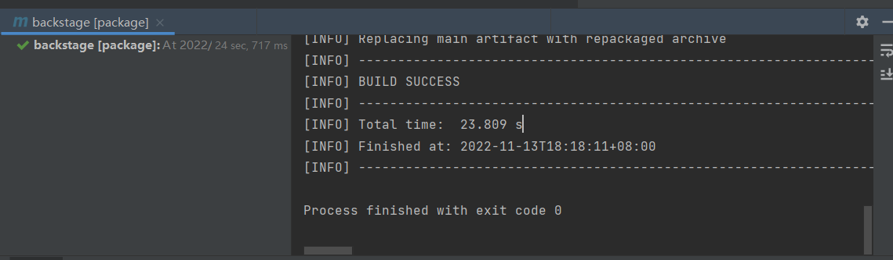

打包文件:

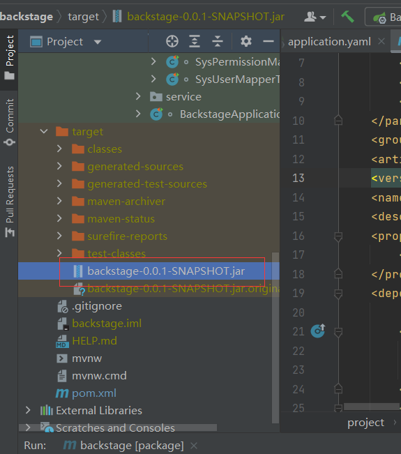


### 3.运行

2022-11-13 18:28:16.110 ERROR 852 --- [           main] o.s.b.web.embedded.tomcat.TomcatStarter  : Error starting Tomcat context. Exception: rg.springframework.beans.factory.UnsatisfiedDependencyException. Message: Error creating bean with name 'jwtAuthenticationFilter': Unsatisfied dependency expressed through field'tokenUtil'; nested exception is org.springframework.beans.factory.BeanCreationException: Error creating bean with name 'tokenUtil': Injection of autowired dependencies failed; nested exception is java.lang.IllegalArgumentException: Could not resolve placeholder 'jwt.secret' in value "${jwt.secret}"

### @Value无效

报错:

2022-11-13 18:28:16.110 ERROR 852 --- [           main] o.s.b.web.embedded.tomcat.TomcatStarter  : Error starting Tomcat context. Exception: rg.springframework.beans.factory.UnsatisfiedDependencyException. Message: Error creating bean with name 'jwtAuthenticationFilter': Unsatisfied dependency expressed through field'tokenUtil'; nested exception is org.springframework.beans.factory.BeanCreationException: Error creating bean with name 'tokenUtil': Injection of autowired dependencies failed; nested exception is java.lang.IllegalArgumentException: Could not resolve placeholder 'jwt.secret' in value "${jwt.secret}"

处理:https://blog.csdn.net/qq_34056683/article/details/121508414

https://blog.csdn.net/u014545085/article/details/107192597/

如:

```
@Value("${jwt.secret}")
```

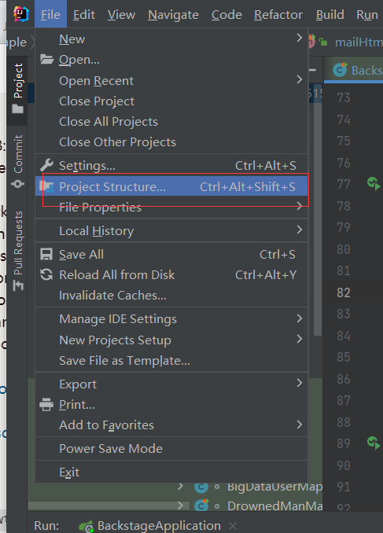


删除libraries

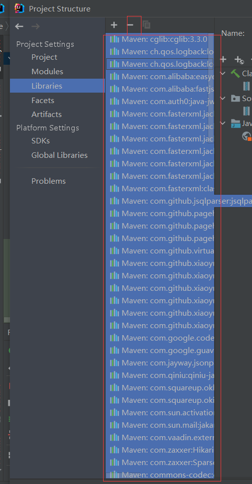

clean

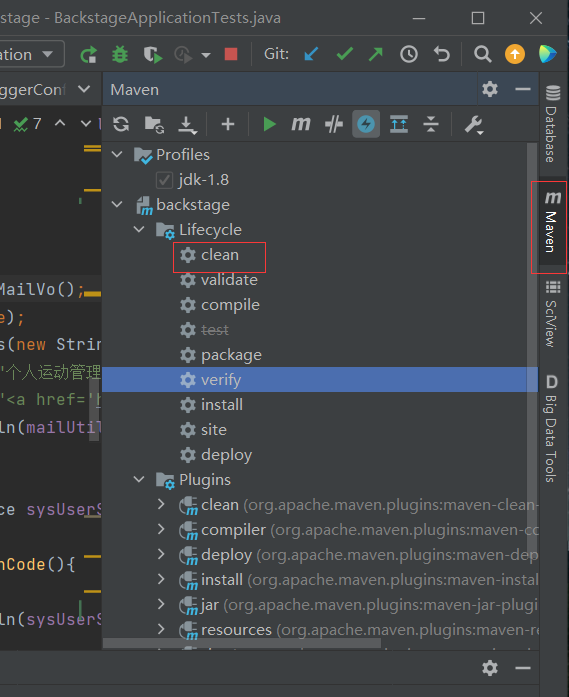


重新加载项目:

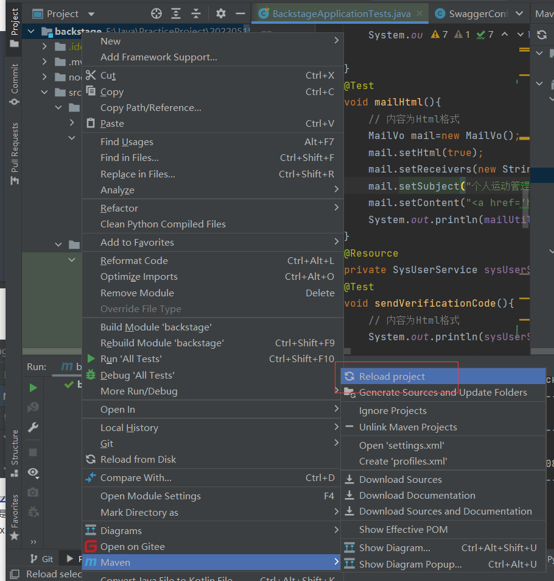


测试一下能不能重新运行,能就重新打包


### 5.将文件传输到服务器

使用向日葵的文件传输功能

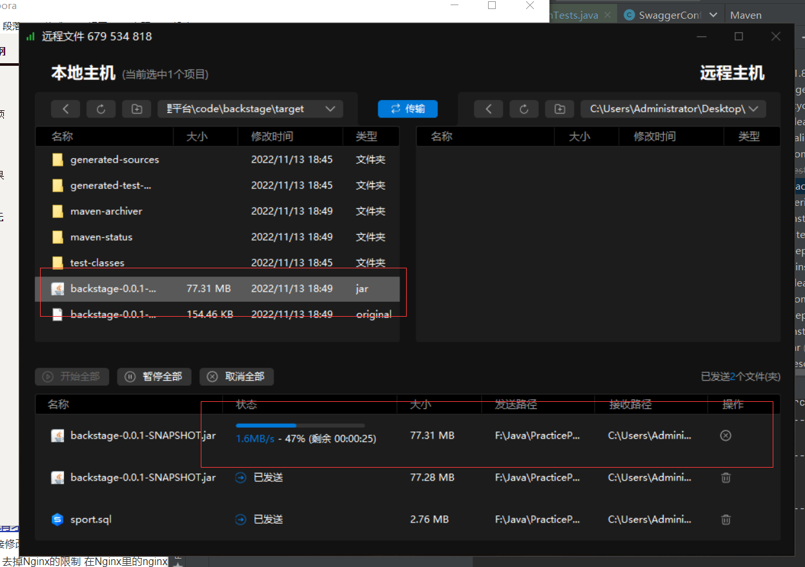


### 6.运行项目

**定位到文件目录运行测试 java -jar xxx.jar**

tab键可以快捷输入文件名

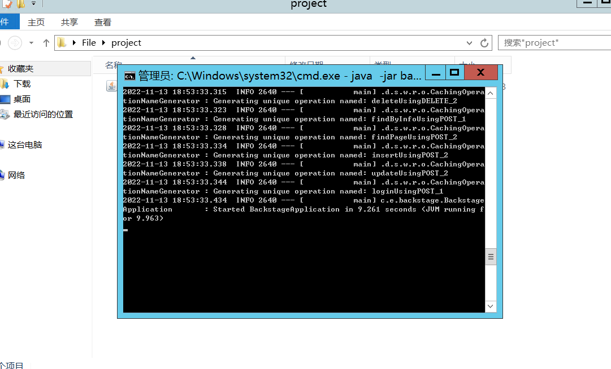


测试接口:http://localhost:9090/test/hello

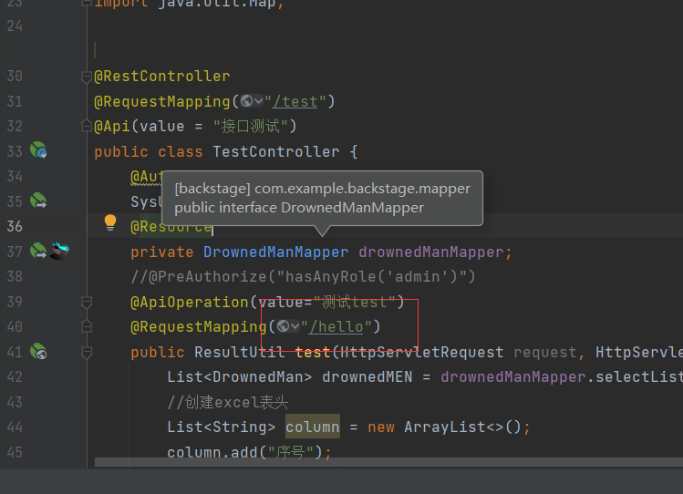

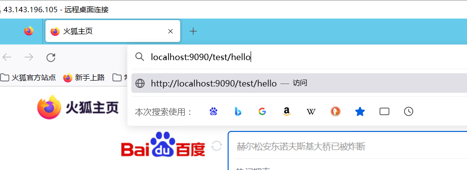


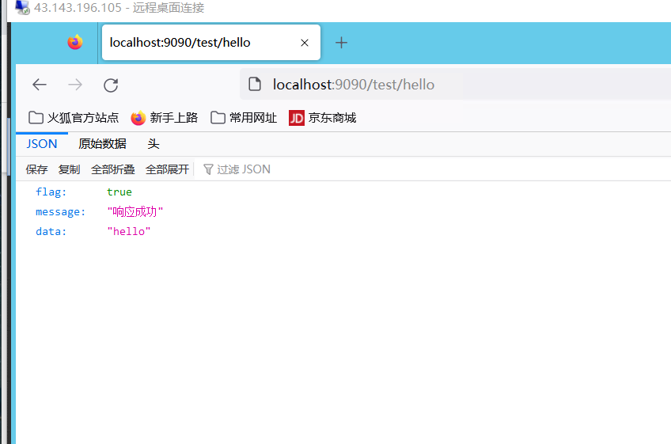


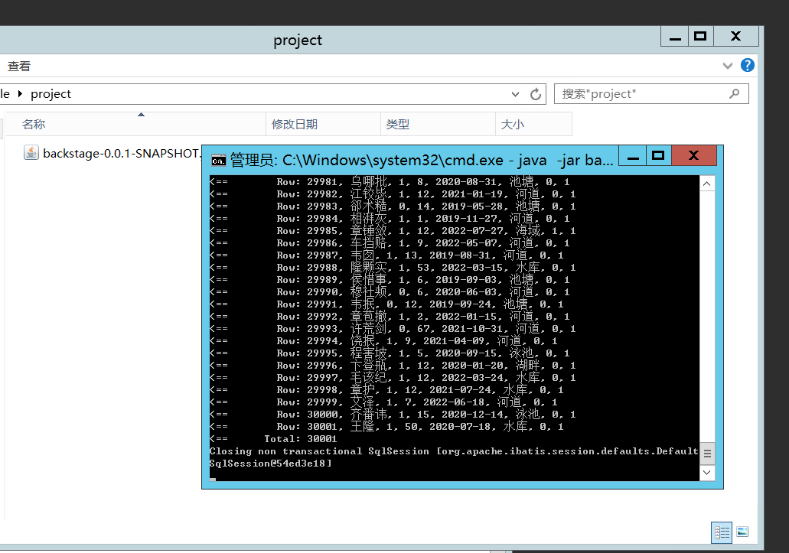