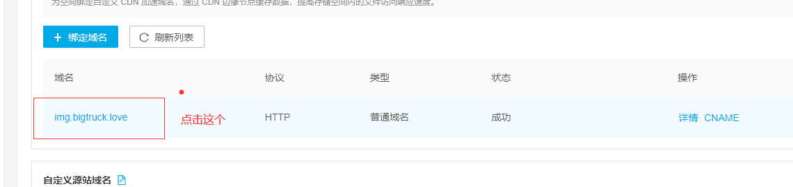
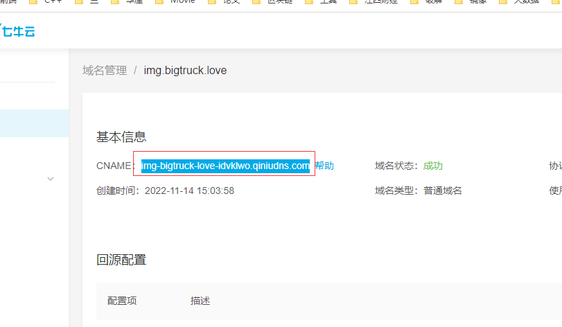
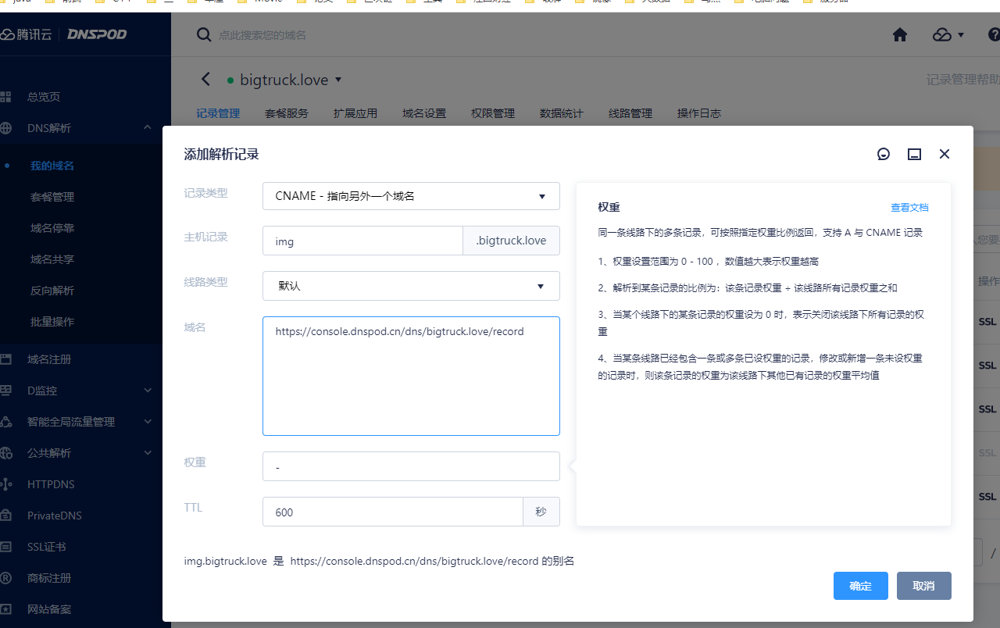
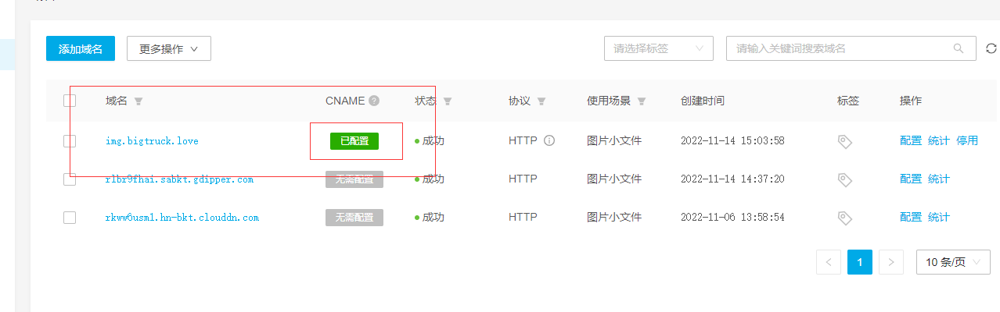
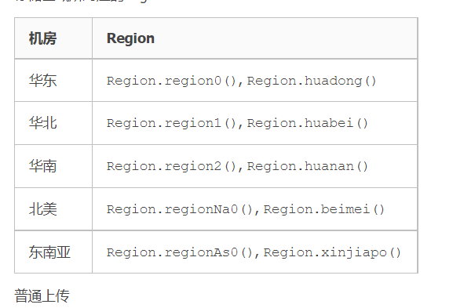

# 文件服务器

## 1.注册使用

https://blog.csdn.net/u011027547/article/details/122802402

## 2.后端使用

官方文档:

https://developer.qiniu.com/kodo/1239/java#install-by-maven

### 2.1引入maven依赖

```xml
       <!--    七牛云云存储    -->
        <dependency>
            <groupId>com.qiniu</groupId>
            <artifactId>qiniu-java-sdk</artifactId>
            <version>7.7.0</version>
            <exclusions>
                <exclusion>
                    <groupId>com.google.code.gson</groupId>
                    <artifactId>gson</artifactId>
                </exclusion>
            </exclusions>
        </dependency>
        <dependency>
            <groupId>com.google.code.gson</groupId>
            <artifactId>gson</artifactId>
            <version>2.8.6</version>
        </dependency>
```

如果依赖报错:


### 2.2 配置密钥

进入到个人中心的密钥管理:

https://portal.qiniu.com/user/key

复制密钥:


### 2.3 配置yaml文件

```yaml
# 配置七牛云
qiniu:
  # 公钥
  accessKey: RhtJDnIvHKXK6ukPrVbWFoKvyjtOdQ2E7BCCVArh
  # 密钥
  secretKey: 2F-FQURowVW70fsPjO1wJrndswgU7JETaqmdMHs4
  # 桶名称
  bucket: sport20221106
```

桶名称就是文件目录:


### 2.4 工具类

```java
package com.example.backstage.util;

import com.google.gson.Gson;
import com.qiniu.common.QiniuException;
import com.qiniu.http.Response;
import com.qiniu.storage.BucketManager;
import com.qiniu.storage.Configuration;
import com.qiniu.storage.Region;
import com.qiniu.storage.UploadManager;
import com.qiniu.storage.model.DefaultPutRet;
import com.qiniu.util.Auth;
import lombok.extern.slf4j.Slf4j;
import org.springframework.beans.factory.annotation.Value;
import org.springframework.stereotype.Component;

import java.io.InputStream;
import java.text.SimpleDateFormat;
import java.util.Date;

/**
 * @author HuaRunSheng
 * @date 2022/11/6 14:31
 * @description : 七牛云文件上传工具类
 */
@Component
@Slf4j
public class QiNiuUtils {
    @Value("${qiniu.accessKey}")
    private String accessKey;
    @Value("${qiniu.secretKey}")
    private String secretKey;
    // 桶的名称不能乱改
    @Value("${qiniu.bucket}")
    private String bucket;

    // 上传
    public String upload(InputStream stream, String fileName) {
        // 构造一个指定地区的配置类,地区是自己选的服务器,也就是华南对应的是Region.region2()
        Configuration configuration = new Configuration(Region.region2());
        UploadManager uploadManager = new UploadManager(configuration);
        // 鉴权
        Auth auth = Auth.create(accessKey, secretKey);
        String name = this.getName(fileName);
        // 文件名称可以带上路径
        name = "user_icon/" + name;
        String upToken = auth.uploadToken(bucket);
        try {
            Response response = uploadManager.put(stream, name, upToken, null, null);
            // 解析上传成功的结果
            DefaultPutRet putRet = new Gson().fromJson(response.bodyString(), DefaultPutRet.class);
            log.info("文件上传成功", putRet);
            return name;
        } catch (QiniuException e) {
            //log.error("文件上传失败");
            Response r = e.response;
            try {
                log.error("文件上传失败==>{}", r.bodyString());
            } catch (QiniuException qiniuException) {
                qiniuException.printStackTrace();
            }
            e.printStackTrace();
            return null;
        }
    }

    // 删除
    public void delete(String fileName) {
        // 构造一个指定地区的配置类,地区是自己选的服务器,也就是华南对应的是Region.region2()
        Configuration configuration = new Configuration(Region.region2());
        // 鉴权
        Auth auth = Auth.create(accessKey, secretKey);
        BucketManager bucketManager = new BucketManager(auth, configuration);

        try {
            bucketManager.delete(bucket, fileName);
        } catch (QiniuException e) {
            // 遇到异常,删除失败
            log.error("删除失败==>{}", e.code());
            log.error(e.response.toString());
            //e.printStackTrace();
        }
    }

    /**
     * 根据时间生成文件名
     *
     * @param fileName
     * @return
     */
    public String getName(String fileName) {
        SimpleDateFormat format = new SimpleDateFormat("yyyyMMddHHmmss");
        return format.format(new Date()) + fileName;
    }
}

```


## 3.使用域名

因为域名没有备案,所以只能用外网的存储器,外网存储器要配置加速域名

首先绑定一个域名,注意要有二级域名,自己指定即可,这里是img:

img.bigtruck.love

https://portal.qiniu.com/kodo/bucket/domain?bucketName=foreign20221106




复制这个:

https://portal.qiniu.com/cdn/domain/img.bigtruck.love



img-bigtruck-love-idvklwo.qiniudns.com

到腾讯云域名管理:

https://console.dnspod.cn/dns/bigtruck.love/record



等个十分钟,即可




## 4.区域对应代码




| 机房   | Region                                    |
| :----- | :---------------------------------------- |
| 华东   | `Region.region0()`, `Region.huadong()`    |
| 华北   | `Region.region1()`, `Region.huabei()`     |
| 华南   | `Region.region2()`, `Region.huanan()`     |
| 北美   | `Region.regionNa0()`, `Region.beimei()`   |
| 东南亚 | `Region.regionAs0()`, `Region.xinjiapo()` |

