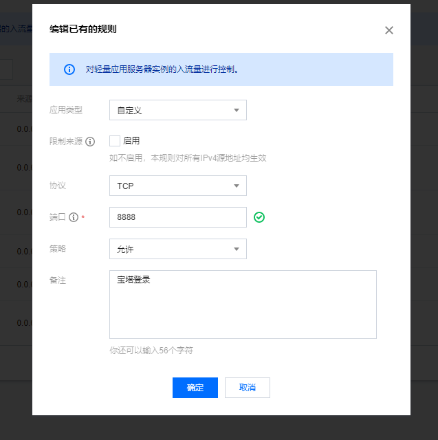
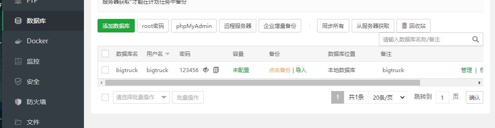

# 腾讯云服务器

#### 搭建本地服务器配置

https://blog.csdn.net/CpolarLisa/article/details/124453644


## 1.免费体验

https://cloud.tencent.com/act/free?fromSource=gwzcw.1293314.1293314.1293314&cps_key=90459ade9374b54875926edec02ff23c


## 2.购买成功


## 3.上传文件

可以下个浏览器,也可以使用向日葵

## 4.安装Java环境

Java JDK文件:

E:\install_bag\java\jdk-8u40-windows-x64.exe


## 5.tomcat 安装

### 1.注意JDK版本

tomcat版本要与JDK版本要一致,不然启动不成功

Java8可使用这个:

https://tomcat.apache.org/download-90.cgi

### 2.安装服务器版本

E:\install_bag\windows server 2012服务器

https://blog.csdn.net/qq_43967413/article/details/105975174/apache-tomcat-9.0.68-windows-x64.zip


### 3.安装


### 4.安装成功

测试: http://localhost:8080/


## 6.Mysql安装

https://blog.csdn.net/An0217313/article/details/119245960

### 1.首先查看服务器系统:


### 2.安装Mysql版本

本次Mysql可以安装5.7

E:\install_bag\java\mysql-5.7.19-winx64.zip

因为Mysql运行要有Visual C++ Redistributable Packages for Visual Studio 2013支持

https://blog.csdn.net/sinat_41836475/article/details/125875500

### 3.安装VS2013

E:\install_bag\windows server 2012服务器\vcredist_x64.exe

https://www.microsoft.com/zh-CN/download/confirmation.aspx?id=40784


### 4.mysql初始化

最好用管理员打开命令提示符:

命令: 

```txt
mysqld --initialize-insecure --user=mysql
```

2822-11-12T02:21:22.335464Z[Marning】 TINESTAMP with implicit DEFAULT value isdeprecated. Please use --explicit_defaults_for_timestanp server option (see documentation for more details> -

https://blog.51cto.com/laobaiv1/1951798

使用命令:

```txt
mysqld --initialize-insecure --user=mysql --explicit_defaults_for_timestamp=true
```


错误:https://blog.csdn.net/xiaopang_love_study/article/details/82698306

```txt
initialize specified but the data directory has files in it. Aborting 错误解决
```

**把mysql安装目录\data文件夹里的内容清空**（建议读者备份到其他地方）。再次执行"mysqld  --initialize"，没有报错了！


### 5.安装MySQL

切换到bin目录下:

mysqld --install


```txt
ALTER USER 'root'@'localhost' IDENTIFIED WITH mysql_native_password BY '123456';
```


### 6.启动Mysql

net start mysql


### 7.设置密码


- mysql -u root -p
- alter user 'root'@'localhost' identified by '123456'
- ；

退出是quit

### 8.导入数据

https://blog.csdn.net/m0_67390788/article/details/126803325

按F7查看历史输入命令:

```txt
 新建数据库
 create database 20220516_sport
 ;
 
 定位到20220516_sport数据库
 use 20220516_sport数据库
 导入数据资源
source C:\Users\Administrator\Desktop\File\sport.sql
显示数据库
 show tables;
```


## 7.redis安装

安装包：

E:\install_bag\windows server 2012服务器\Redis-x64-3.0.504.msi

安装步骤：

G:\Document\mdNote\Java\tools\redis中间件.md


## 8.打包后端项目

G:\Document\mdNote\Java\tools\打包.md


## 9.打包前端项目

```vue
  // 配置公共路径(必须的)
  publicPath: "./",
  // 打包到哪个文件夹
  outputDir: "dist",
  //将静态资源打包
  assetsDir: "static",
  // 去除打包后js的map文件
  productionSourceMap: false,
```

vue.config.js 设置代理:

服务器不存在跨域,所以直接使用IP加的口号


```js
proxy: {
      // port: 8080, //前端服务启动的端口号
      // host: "localhost", //前端服务启动后的访问ip，默认为localhost, host和port组成了前端服务启动后的访问入口。
      // https: false,
      // open: true,
      //凡是/service开头的请求,代理到target域名地址下
      //方式二:可以将开头部分去除掉
      "/back": {
        target: "http://43.143.196.105:9090",
        changeOrigin: true, //是否跨域
        pathRewrite: {
          //要替换数据(支持正则表达式) : 替换为数据
          "^/back": "",
          //  ^ 为以什么开头,替换成空字符串
        },
      },
    },
```


## 10.设置域名

https://blog.csdn.net/qq_52355487/article/details/122629428

首先,购买域名,查看自己的域名:

https://console.cloud.tencent.com/domain/all-domain

然后添加域名解析:

https://console.cloud.tencent.com/lighthouse/domain/detail?domainId=lhdo-h3pfddm5&effectiveDNS=ladybird.dnspod.net%2Carea.dnspod.net&dnsState=NORMAL&rid=8&id=bigtruck.love


添加防火墙的后端接口


服务器运行项目:

java -jar 项目名

http://bigtruck.love:9090/test/hello


测试接口:

域名要备案,麻烦

http://bigtruck.love:9090/test/hello

## 11.安装nginx服务器

[nginx: download](http://nginx.org/en/download.html)

下载稳定版即可,下载好后,将压缩包解压

再将前端打包好的项目放到html文件夹内;


编写配置文件:

C:\Program Files\nginx\conf\nginx.conf


## 11.使用ip

使用主机ip加nginx端口号即可

http://43.143.196.105:80


# Linux

宝塔Linux面板配置教程:

https://blog.csdn.net/qq_44979513/article/details/127562767


## 1.添加防火墙规则

https://console.cloud.tencent.com/lighthouse/instance/detail?rid=4&id=lhins-oot1dtpq&tab=firewall

添加规则,端口8888




## 2.复制登录命令

https://console.cloud.tencent.com/lighthouse/instance/detail?rid=4&id=lhins-oot1dtpq&tab=application

sudo /etc/init.d/bt default


## 3.获取登录信息

打开Linux服务器,输入命令


```txt
外网面板地址: http://1.15.155.85:8888/tencentcloud
内网面板地址: http://10.0.4.9:8888/tencentcloud
*以下仅为初始默认账户密码，若无法登录请执行bt命令重置账户/密码登录
username: elqpkdds
password: e9931a61b0cd
If you cannot access the panel,
release the following panel port [8888] in the security group
若无法访问面板，请检查防火墙/安全组是否有放行面板[8888]端口
```

如,在浏览器上登录:

http://1.15.155.85:8888/tencentcloud

elqpkdds

e9931a61b0cd


## 4.绑定手机号

登录成功后,绑定手机号


## 5.配置Java环境

https://www.jiaozn.com/reed/750.html

### 1.安装MySQL

1、在左边导航栏选择“软件商店”，右边MySQL软件项点击“安装”。


修改Mysql root账户密码

宝塔安装时默认会给root设置密码,但自定义安装时不会

所以需要登录时可以查看密码


2、增加MySQL账户

在左边导航栏选择“数据库”，在右边栏点击“添加数据库”。




### 2.安装tomcat

1、在左边导航栏选择“软件商店”，右边Tomcat软件项点击“安装”。


选择“tomcat9”，然后“提交”。

提示：宝塔中安装tomcat时会自动安装对应的JDK版本! tomcat8、9对应jdk1.8


2、配置Tomcat

右边Tomcat软件项点击“设置”


在弹出框中选择“配置修改”。

1.增加网页编码参数URIEncoding="UTF-8" 


2.修改使用nginx转发后客户端IP写入日志参数%{X-FORWARDED-FOR}i


3、调整Tomcat内存大小

在左边导航栏选择“文件”，右边目录展开路径“根目录/www/server/tomcat/bin/”。


新建在setenv.sh，在文件setenv.sh里面根据服务器内存大小增加如下设置：


JAVA_OPTS="-server -Xms初始化内存大小m -Xmx可以使用的最大内存m "

例如设置Tomcat最大可用512M内存

JAVA_OPTS="-server -Xms512m -Xmx1024m "


设置完成后必须重启Tomcat让配置文件生效


4、测试Tomcat

在左边导航栏选择“安全”，在防火墙中将Tomcat的默认端口8080放行。


在浏览器中输入 http://IP地址:8080/显示以下页面即表示安装Tomcat完成。

 http://1.15.155.85:8080


5.上传Javaweb项目到tomcat默认应用目录

在左边导航栏选择“软件商店”，右边Tomcat软件项点击“目录”图标。


全选Tomcat的“webapps”目录自带的几个文件夹，然后按“删除”按钮，将默认的文件夹全部删除。


然后点击“新建”-->“新建目录”，目录名称填写大写“ROOT”。


进入“ROOT”目录图标后点击“上传”按钮，将轻论坛系统安装包上传。


上传完成后点击“解压”，将轻论坛系统解压到ROOT文件夹。


解压完成后可以将“轻论坛系统.zip”压缩包删除了。


6、将宝塔面板解压“轻论坛系统.zip”生成的目录及文件所有者设置为 www（原本为 root），权限为 755。

全选所有的文件和文件夹，然后点击“权限”按钮


7、在浏览器中输入 http://IP地址:8080/install 填写轻论坛系统安装信息。


8.重启tomcat

### 3.安装Nginx

1、在左边导航栏选择“软件商店”，右边Nginx软件项点击“安装”。


选择“nginx1.16”，然后“提交”。

注意：必须选择'编译安装'，因为后面需要安装防盗链插件secure link，需要源码目录重新编译


2、宝塔Nginx默认安装脚本不含secure link模块，在保存防盗链设置时会出现以下错误


跳过第三步,会报错

~~3、宝塔在编译安装Nginx后，会保留源码。我们可以在Nginx安装脚本上添加secure link模块，然后登录SSH执行安装。~~

~~默认安装脚本：/www/server/panel/install/nginx.sh~~

~~nginx源码目录：/www/server/nginx/src/~~

~~在左边导航栏选择“文件”，右边目录展开路径“根目录/www/server/panel/install/”，找到“nginx.sh”，点击“编辑”。~~


--with-http_secure_link_module

~~在打开的文本编辑器找到./configure命令行，演示宝塔版本为249行。在里面添加 --with-http_secure_link_module~~


4、打开服务器，执行安装脚本命令。我们刚才选择“nginx1.16”版本，所以下面脚本参数为1.16


输入命令 sh /www/server/panel/install/nginx.sh install 1.22.1


执行脚本后开始安装。稍等一会儿安装完毕后。使用 nginx -V 命令 查看版本信息。

输入命令 nginx -V


5、配置Nginx

右边Nginx软件项点击“设置”

在弹出框中选择“配置修改”。在http{}配置项内增加server{}配置项绑定域名

```txt
http{
	#.....
	#.....
	#其它参数
	#.....
	#.....

	server {
		   listen 80;
		   server_name _;
		   return 404;
	}
	#配置请求转发,将网页访问80端口转发到Tomcat的8080端口
	server{
	        listen  80;
	        server_name bbs.diyhi.com;
            location /{
                proxy_set_header Host $host;
                proxy_set_header X-Real-Ip $remote_addr;
                proxy_set_header X-Forwarded-For $remote_addr;
                proxy_pass $scheme://127.0.0.1:8080;
				client_max_body_size 200M; #允许上传文件大小,默认是1M


                proxy_read_timeout 86400s;
                proxy_http_version 1.1;
                proxy_set_header Upgrade $http_upgrade;
                proxy_set_header Connection "upgrade";
            }

            #location ~ /(file/topic|file/links)/.*\.(rar|zip|7z|tar|txt|pdf)$ {
			#指定目录中的特定后缀文件防盗链
			location ~ /(file/topic)/.*\.(mp4|avi|mkv|wmv|wav|rm|rmvb|mp3|flac|ape|zip|rar|7z|txt|docx|doc|pptx|ppt|xlsx|xls)$ {
				secure_link $arg_md5,$arg_expires;
			    #表示 MD5(密钥 + 不包含主机名和请求参数的剩余部分文件路径 + 过期时间) 1234567890123456是密钥，必须是16位字符并且和管理后台的'基本设置'中'文件防盗链密钥'一致
				secure_link_md5 1234567890123456$uri$arg_expires;

			    #当匹配成功的时候 secure_link 是非空非0的

			    # 没有匹配到返回 ""
			    if ($secure_link = "") {
			        return 403;
			    }

			    # 没有匹配到返回0
			    if ($secure_link = "0") {
			        return 410;
			    }
			    #文件名重命名
			     				add_header Content-Disposition "attachment;filename=$arg_fileName";

			     				proxy_set_header Host $host;
			                	proxy_set_header X-Real-Ip $remote_addr;
			                	proxy_set_header X-Forwarded-For $remote_addr;
				proxy_redirect off;
				proxy_pass http://127.0.0.1:8080;
			}
	}}
```


修改完成“设置”后重启Nginx让配置文件生效


### 4.安装Redis

https://www.lmlphp.com/user/57799/article/item/818998/

https://blog.csdn.net/m0_67390963/article/details/126566379


不设置密码,直接使用即可

~~2.完成之后开始第二步，配置redis设置。这一步根据自己需要进行配置。注意安全问题哦~~

去服务器提供商那里，开放相应的Redis端口，配置安全组(Redis使用的是6379端口，就开放6379端口)，即可


## 6.登录Mysql

### 1.运行Mysql

service mysqld start

### 2.登录

在服务器中输入

mysql -u root -p

输入密码: 123456

密码看不见,直接回车即可

### 3.上传sql文件

在宝塔界面直接上传即可


### 4.导入sql文件

source /data/project/mysql/new_sport.sql


### 5.查看导入的数据库

show databases;


## 7.运行Java项目

防火墙记得打开Java项目接口

### 1.打包spring项目

在上面,window那里,

无非就是clean, package

### 2.将jar文件上传到服务器


直接拖拽即可


### 3.运行

在服务器中输入 Java -jar /data/project/java/backstage-0.0.1-SNAPSHOT.jar

回车


### 4.测试

http://1.15.155.85:9090/test/hello


```txt
[root@VM-4-9-centos ~]# history
   30  2022-11-23 18:22:20 mysql -u root -p
   32  2022-11-23 18:36:48 source ~/.orca_term/orca-bash.sh
   33  2022-11-23 18:36:49 history
```

### 5.将项目添加到网站管理中


## 8.运行vue项目

### 1.打包vue项目

npm run build

### 2.上传打包项目

上传到服务器

/data/project/vue/dist


### 3.配置nginx


```txt
server
    {
        listen 80;
        server_name localhost;
        location / {
            index index.html index.htm index.php;
            root  /data/project/vue/dist;
        }
        location /back/{
            proxy_pass http://localhost:9090/;
        }
    }
```

也可以是

```nginx
user  www www;
worker_processes auto;
error_log  /www/wwwlogs/nginx_error.log  crit;
pid        /www/server/nginx/logs/nginx.pid;
worker_rlimit_nofile 51200;

stream {
    log_format tcp_format '$time_local|$remote_addr|$protocol|$status|$bytes_sent|$bytes_received|$session_time|$upstream_addr|$upstream_bytes_sent|$upstream_bytes_received|$upstream_connect_time';
  
    access_log /www/wwwlogs/tcp-access.log tcp_format;
    error_log /www/wwwlogs/tcp-error.log;
    include /www/server/panel/vhost/nginx/tcp/*.conf;
}

events
    {
        use epoll;
        worker_connections 51200;
        multi_accept on;
    }

http
    {
        include       mime.types;
		#include luawaf.conf;

		include proxy.conf;

        default_type  application/octet-stream;

        server_names_hash_bucket_size 512;
        client_header_buffer_size 32k;
        large_client_header_buffers 4 32k;
        client_max_body_size 50m;

        sendfile   on;
        tcp_nopush on;

        keepalive_timeout 60;

        tcp_nodelay on;

        fastcgi_connect_timeout 300;
        fastcgi_send_timeout 300;
        fastcgi_read_timeout 300;
        fastcgi_buffer_size 64k;
        fastcgi_buffers 4 64k;
        fastcgi_busy_buffers_size 128k;
        fastcgi_temp_file_write_size 256k;
		fastcgi_intercept_errors on;

        gzip on;
        gzip_min_length  1k;
        gzip_buffers     4 16k;
        gzip_http_version 1.1;
        gzip_comp_level 2;
        gzip_types     text/plain application/javascript application/x-javascript text/javascript text/css application/xml;
        gzip_vary on;
        gzip_proxied   expired no-cache no-store private auth;
        gzip_disable   "MSIE [1-6]\.";

        limit_conn_zone $binary_remote_addr zone=perip:10m;
		limit_conn_zone $server_name zone=perserver:10m;

        server_tokens off;
        access_log off;
# server
#     {
#         listen 9091;
#         server_name localhost;
#         location / {
#             index index.html index.htm index.php;
#             root  /data/project/java/dist;
#         }
#         location /back/{
#             proxy_pass http://localhost:9090/;
#         }
#     }
#配置请求转发,将网页访问80端口转发到Tomcat的8080端口
	server{
	        listen  80;
	        server_name bigtruck.love;
            location /{
                proxy_set_header Host $host;
                proxy_set_header X-Real-Ip $remote_addr;
                proxy_set_header X-Forwarded-For $remote_addr;
                # proxy_pass $scheme://127.0.0.1:8080;
				client_max_body_size 200M; #允许上传文件大小,默认是1M


                proxy_read_timeout 86400s;
                proxy_http_version 1.1;
                proxy_set_header Upgrade $http_upgrade;
                proxy_set_header Connection "upgrade";
                index index.html index.htm index.php;
                root  /data/project/java/dist;
            }
        location /back/{
            proxy_pass http://localhost:9090/;
        }
            #location ~ /(file/topic|file/links)/.*\.(rar|zip|7z|tar|txt|pdf)$ {
			#指定目录中的特定后缀文件防盗链
			location ~ /(file/topic)/.*\.(mp4|avi|mkv|wmv|wav|rm|rmvb|mp3|flac|ape|zip|rar|7z|txt|docx|doc|pptx|ppt|xlsx|xls)$ {
				secure_link $arg_md5,$arg_expires;
			    #表示 MD5(密钥 + 不包含主机名和请求参数的剩余部分文件路径 + 过期时间) 1234567890123456是密钥，必须是16位字符并且和管理后台的'基本设置'中'文件防盗链密钥'一致
				secure_link_md5 1234567890123456$uri$arg_expires;

			    #当匹配成功的时候 secure_link 是非空非0的

			    # 没有匹配到返回 ""
			    if ($secure_link = "") {
			        return 403;
			    }

			    # 没有匹配到返回0
			    if ($secure_link = "0") {
			        return 410;
			    }
			    #文件名重命名
			     				add_header Content-Disposition "attachment;filename=$arg_fileName";

			     				proxy_set_header Host $host;
			                	proxy_set_header X-Real-Ip $remote_addr;
			                	proxy_set_header X-Forwarded-For $remote_addr;
				proxy_redirect off;
				proxy_pass http://127.0.0.1:9090;
			}
	}
	#配置请求转发,将网页访问80端口转发到Tomcat的8080端口
# 	server{
# 	        listen  80;
# 	        server_name bbs.diyhi.com;
#             location /{
#                 proxy_set_header Host $host;
#                 proxy_set_header X-Real-Ip $remote_addr;
#                 proxy_set_header X-Forwarded-For $remote_addr;
#                 proxy_pass $scheme://127.0.0.1:8080;
# 				client_max_body_size 200M; #允许上传文件大小,默认是1M


#                 proxy_read_timeout 86400s;
#                 proxy_http_version 1.1;
#                 proxy_set_header Upgrade $http_upgrade;
#                 proxy_set_header Connection "upgrade";
#             }

#             #location ~ /(file/topic|file/links)/.*\.(rar|zip|7z|tar|txt|pdf)$ {
# 			#指定目录中的特定后缀文件防盗链
# 			location ~ /(file/topic)/.*\.(mp4|avi|mkv|wmv|wav|rm|rmvb|mp3|flac|ape|zip|rar|7z|txt|docx|doc|pptx|ppt|xlsx|xls)$ {
# 				secure_link $arg_md5,$arg_expires;
# 			    #表示 MD5(密钥 + 不包含主机名和请求参数的剩余部分文件路径 + 过期时间) 1234567890123456是密钥，必须是16位字符并且和管理后台的'基本设置'中'文件防盗链密钥'一致
# 				secure_link_md5 1234567890123456$uri$arg_expires;

# 			    #当匹配成功的时候 secure_link 是非空非0的

# 			    # 没有匹配到返回 ""
# 			    if ($secure_link = "") {
# 			        return 403;
# 			    }

# 			    # 没有匹配到返回0
# 			    if ($secure_link = "0") {
# 			        return 410;
# 			    }
# 			    #文件名重命名
# 			     				add_header Content-Disposition "attachment;filename=$arg_fileName";

# 			     				proxy_set_header Host $host;
# 			                	proxy_set_header X-Real-Ip $remote_addr;
# 			                	proxy_set_header X-Forwarded-For $remote_addr;
# 				proxy_redirect off;
# 				proxy_pass http://127.0.0.1:8080;
# 			}
# 	}
include /www/server/panel/vhost/nginx/*.conf;
}


```


### 4.测试

http://1.15.155.85:80

http://1.15.155.85/#/login


## 9.开启端口

https://blog.csdn.net/weixin_42362496/article/details/103383501

1.使用命令 firewall-cmd --state查看防火墙状态。得到结果是running或者not running

2.在running 状态下，向firewall 添加需要开放的端口
命令为 firewall-cmd --permanent --zone=public --add-port=8080/tcp //永久的添加该端口。去掉–permanent则表示临时。

4.firewall-cmd --reload //加载配置，使得修改有效。

5.使用命令 firewall-cmd --permanent --zone=public --list-ports //查看开启的端口，出现8080/tcp这开启正确

6.再次使用外部浏览器访问，这出现tomcat的欢迎界面。


## 10.关闭防火墙

https://blog.csdn.net/qq_33468857/article/details/124588889

*Centos8关闭防火墙*

systemctl status firewalld.service（查看防火墙状态）

active表示当前防火墙处于开启状态 inactive表示关闭状态

systemctl stop firewalld.service （关闭防火墙）

systemctl start firewalld.service （开启防火墙）

systemctl disable firewalld.service （禁止防火墙自启动）

systemctl enable firewalld.service （防火墙随系统开启启动）


## 12.开启管理员权限

命令: sudo su root


## 13.宝塔面板登录不进去

https://blog.csdn.net/stwood007/article/details/127553373

如,宝塔登录界面;

http://bigtruck.love:8888/login

但是,账号密码登不进去,密码显示星号.此时可以更改密码

```cmd
sudo su root
bt
5
123456
```


即可用新的账户密码登录.


```txt
CREATE CONTROLFILE REUSE DATABASE “ORCL” NORESETLOGS ARCHIVELOG
MAXLOGFILES 16
MAXLOGMEMBERS 3
MAXDATAFILES 100
MAXINSTANCES 8
MAXLOGHISTORY 292
LOGFILE
GROUP 1 ‘/u01/app/oracle/oradata/orcl/redo01.log’ SIZE 50M BLOCKSIZE 512,
GROUP 2 ‘/u01/app/oracle/oradata/orcl/redo02.log’ SIZE 50M BLOCKSIZE 512,
GROUP 3 ‘/u01/app/oracle/oradata/orcl/redo03.log’ SIZE 50M BLOCKSIZE 512
– STANDBY LOGFILE
DATAFILE
‘/u01/app/oracle/oradata/orcl/system01.dbf’,
‘/u01/app/oracle/oradata/orcl/sysaux01.dbf’,
‘/u01/app/oracle/oradata/orcl/undotbs01.dbf’,
‘/u01/app/oracle/oradata/orcl/users01.dbf’,
‘/u01/app/oracle/oradata/orcl/test01.dbf’
CHARACTER SET AL32UTF8
;
```

# 3.增加多个站点

更改nginx

```nginx
#  第一个站点配置
location / {
    root   /data/apps/a;
    index  index.html index.htm;
}
#  部署的后端访问地址和端口号
location /a-api/ {
    proxy_pass http://127.0.0.1:8080/;
}

# 第二个站点配置
location /b {
    alias   /data/apps/b;
    index  index.html index.htm;
}

location /b-api/ {
    proxy_pass http://127.0.0.1:8081/;
}
```

实例:

```nginx
server
    {
        listen 9091;
        server_name bigtruck.love;
        location / {
            index index.html index.htm index.php;
            root  /data/project/java/dist;
        }
        location /back/{
            proxy_pass http://localhost:9090/;
        }
    }
#配置请求转发,将网页访问80端口转发到Tomcat的8080端口
	server{
	            listen  80;
	        server_name bigtruck.love;
            location /{
                proxy_set_header Host $host;
                proxy_set_header X-Real-Ip $remote_addr;
                proxy_set_header X-Forwarded-For $remote_addr;
                # proxy_pass $scheme://127.0.0.1:8080;
				client_max_body_size 200M; #允许上传文件大小,默认是1M


                proxy_read_timeout 86400s;
                proxy_http_version 1.1;
                proxy_set_header Upgrade $http_upgrade;
                proxy_set_header Connection "upgrade";
                index index.html index.htm index.php;
                root  /data/project/part_job/dist;
            }
        location /job/{
            proxy_pass http://localhost:8088/;
        }
        
      
        
	}
```

如果刷不出来,那应该就是防火墙的问题
