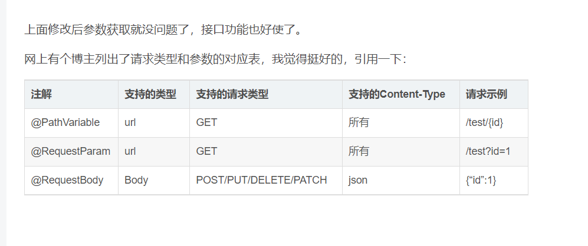

# 接收请求

**@RequestMapping：**@RequestMapping(“/path”)表示该控制器处理所有“/path”的UR L请求。

**@RequestParam：** 用在方法的参数前面。

@RequestParam

String a =request.getParameter(“a”)。

**@PathVariable:** 路径变量。如

GetMapping设置多个路径

​    @GetMapping(value = {"/", "/main"})

## @PostMapping

@PostMapping是@RequestMapping(method = RequestMethod.POST)缩写的组合注解，用于将 HTTP 的post 请求映射到特定处理程序的方法注解。

一般情况下我们开发可能都是用@RequestMapping,当然这样写的话也有弊端，笼统的全用@RequestMapping, 不便于其他人对代码的阅读和理解！

### 1.Object

前端传递参数如果是一个object的话,如{id:'1',name:'2222'},即json格式

后端参数接收的话，需要使用@RequestBody,requestBody里面放置的是一个实体类

```java
@PostMapping(value = "/generatedData")    
public Result<?> generatedData(@RequestBody ApplyObject applyObject){

}
```

### 2.拼接字符串

前端传递的参数如果是一个拼接的带?的字符串的话：如 xxx/generatedData?id=1&name=222

 后端的参数接收就需要使用 @RequestParam("id") String id,@RequestParam 加上问号后面对应的字段名称

```java
@PostMapping(value = "/generatedData")
public Result<?> generatedData( @RequestParam("id") String id, @RequestParam("name") String name) throws Exception {
   
    }
```

### 3.如果拼接的字符串是一个对象

前端传递的参数如果是一个拼接的带?的字符串的话：如 xxx/generatedData?id=1&name=222

```java
@PostMapping(value = "/generatedData")
public Result<?> generatedData(User user) throws Exception {
   
    }
```


## @GetMapping

@GetMapping是@RequestMapping(method = RequestMethod.GET)缩写的组合注解，用于将 HTTP 的get 请求映射到特定处理程序的方法注解。

### 1.Object

前端传递参数如果是一个object的话,如{id:'1',name:'2222'}

后端参数接收的话，里面放置的是一个实体类

```java
		@GetMapping(value = "/generatedData")
    public Result<?> generatedData(ApplyObject applyObject) throws Exception {
       
    }
```

### 2.拼接字符串

前端传递的参数如果是一个拼接的带?的字符串的话：如 xxx/generatedData?id=1&name=222

后端的参数接收就需要使用 也是使用@RequestParam("id") String id   @RequestParam 加上问号后面对应的字段名称

```java
		@GetMapping(value = "/generatedData")
    public Result<?> generatedData( @RequestParam("id") String id, @RequestParam("name") String name) throws Exception {
   
    }
```

### 3.路径

前端传递的参数如果是一个拼接的带?的字符串的话：如 xxx/generatedData?/id=1/name=222

后端参数接收的话，需要使用@PathVariable String id  

```java
@GetMapping(value = "/generatedData/{id}/{name}")    
public Result<?> generatedData(@PathVariable("id") String id, @PathVariable("id") String name) throws Exception {          }


```

## 4.请求类型和参数的对应表




## 5.各种请求类型

```txt
 * get 路径 /doOrder/热干面/add/油条/aaa
 
 * get传递一个参数 /doOrder?food=热干面
 
 * get传递多个参数 /doOrder?food=热干面&price=10
 
 * post传递一个对象
 
 * post传递一个对象+一个基本参数
```

### 1.路径

```java
@GetMapping("testUrl/{name}/and/{age}")
    public String testUrl(@PathVariable("name") String name, @PathVariable("age") Integer age) {
        System.out.println(name + ":" + age);
        return "ok";
    }
```

### 2.get传递一个参数

```java
/**
     * @RequestParam(required = false)
     * 默认一定要传,不穿就会报错,设为false就可以不传,还可以设置默认值
     * @param name
     * @return
     */
    @GetMapping("oneParam")
    public String oneParam(@RequestParam(required = false, defaultValue = "unknown user") String name) {
        System.out.println(name);
        return "ok";
    }
```

### 3.get传递多个参数

```java
@GetMapping("twoParam")
    public String twoParam(@RequestParam(required = false) String name, @RequestParam(required = false) Integer age) {
        System.out.println(name);
        System.out.println(age);
        return "ok";
    }
```

### 4.post传递一个对象

```java
@PostMapping("oneObj")
    public String oneObj(@RequestBody Order order) {
        System.out.println(order);
        return "ok";
    }
```

### 5.post传递一个对象+一个基本参数

```java
@PostMapping("oneObjOneParam")
    public String oneObjOneParam(@RequestBody Order order,@RequestParam("name") String name) {
        System.out.println(name);
        System.out.println(order);
        return "ok";
    }
```


# 发请求

url:请求地址

String.class: 返回类型

```
restTemplate.getForEntity(url, String.class);
```

user传递的数据

```
restTemplate.postForObject(url, user, String.class);
```

## RestTemplate

```java
package com.powernode;

import com.powernode.domain.User;
import org.junit.jupiter.api.Test;
import org.springframework.boot.test.context.SpringBootTest;
import org.springframework.http.ResponseEntity;
import org.springframework.util.LinkedMultiValueMap;
import org.springframework.web.client.RestTemplate;

@SpringBootTest
class ApplicationTests {


    @Test
    void contextLoads() {
        // 在java代码中去发送一个请求 请求一个页面
        RestTemplate restTemplate = new RestTemplate();
        // 如果你访问的一个页面 会返回html代码
        String url = "https://www.baidu.com";
        String result = restTemplate.getForObject(url, String.class);
        System.out.println(result);
    }


    @Test
    void testGet() {
        RestTemplate restTemplate = new RestTemplate();
        String url = "http://localhost:8080/testGet?name=cxs";
//        String result = restTemplate.getForObject(url, String.class);
        ResponseEntity<String> responseEntity = restTemplate.getForEntity(url, String.class);
        // http:// 协议 (规范 接头暗号)
        // 请求头 请求参数 .. 响应头 响应状态码 报文 ....
        System.out.println(responseEntity);
    }


    @Test
    void testPost1(){
        RestTemplate restTemplate = new RestTemplate();
        String url = "http://localhost:8080/testPost1";
        User user = new User("leige",22,10000D);
        // 发送post 而且是json参数 因为web里面默认使用jackson 他会把你的对象转成json字符串
        String result = restTemplate.postForObject(url, user, String.class);
        System.out.println(result);
    }


    @Test
    void testPost2(){
        RestTemplate restTemplate = new RestTemplate();
        String url = "http://localhost:8080/testPost2";
        // 构建表单参数
        LinkedMultiValueMap<String, Object> map = new LinkedMultiValueMap<>();
        map.add("name","tangge");
        map.add("age",26);
        map.add("price",8000D);

        String result = restTemplate.postForObject(url, map, String.class);
        System.out.println(result);


    }
}

```


### 1.getForObject

返回具体内容

```java
        // 如果你访问的一个页面 会返回html代码
        String url = "https://www.baidu.com";
        String result = restTemplate.getForObject(url, String.class);
        System.out.println(result);
```


### 2.getForEntity

```java
    @Test
    void testGet() {
        RestTemplate restTemplate = new RestTemplate();
        String url = "http://localhost:8080/testGet?name=cxs";
//        String result = restTemplate.getForObject(url, String.class);
        ResponseEntity<String> responseEntity = restTemplate.getForEntity(url, String.class);
        // http:// 协议 (规范 接头暗号)
        // 请求头 请求参数 .. 响应头 响应状态码 报文 ....
        System.out.println(responseEntity);
    }
```

返回响应信息,及其内容


### 3.postForObject

表单请求,会将发送的数据转换成json格式

```java
    @Test
    void testPost1(){
        RestTemplate restTemplate = new RestTemplate();
        String url = "http://localhost:8080/testPost1";
        User user = new User("leige",22,10000D);
        // 发送post 而且是json参数 因为web里面默认使用jackson 他会把你的对象转成json字符串
        String result = restTemplate.postForObject(url, user, String.class);
        System.out.println(result);
    }
```

也可以构建表单参数

```java
    @Test
    void testPost2(){
        RestTemplate restTemplate = new RestTemplate();
        String url = "http://localhost:8080/testPost2";
        // 构建表单参数
        LinkedMultiValueMap<String, Object> map = new LinkedMultiValueMap<>();
        map.add("name","tangge");
        map.add("age",26);
        map.add("price",8000D);

        String result = restTemplate.postForObject(url, map, String.class);
        System.out.println(result);
```


