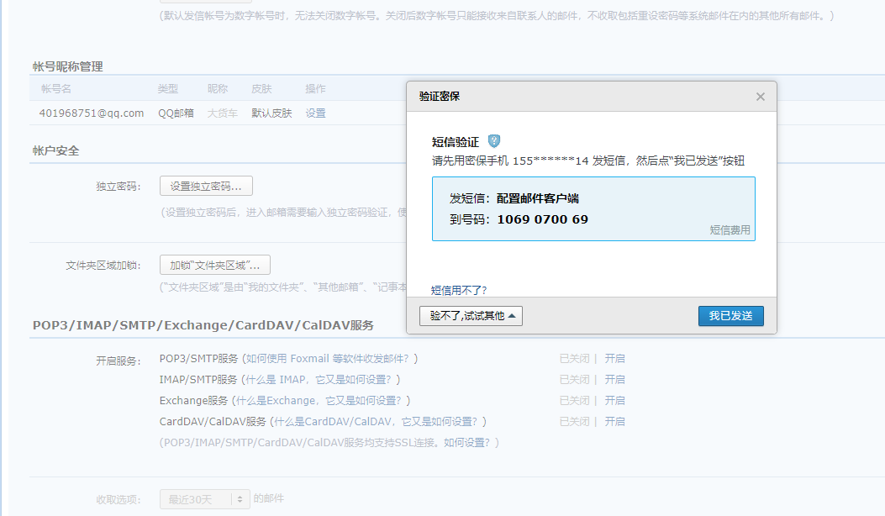
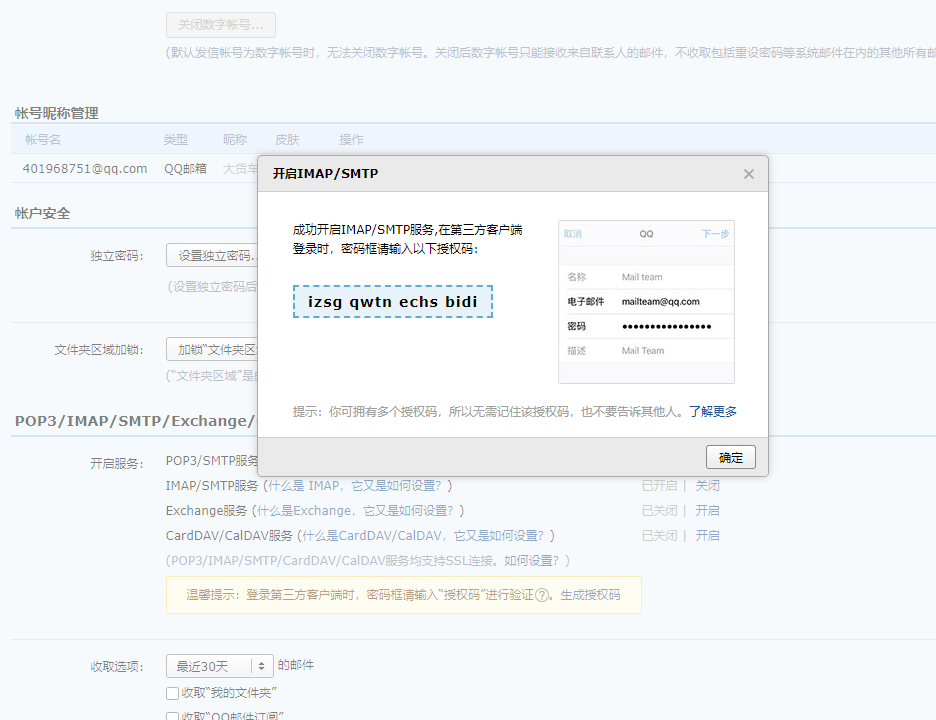
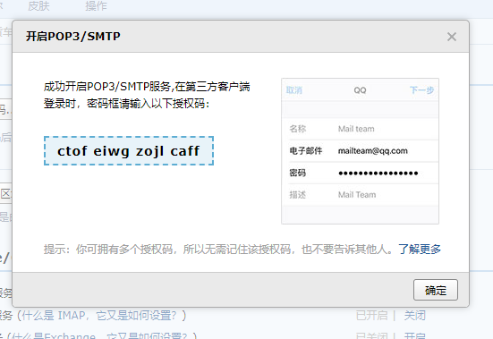

# 邮箱

## 1.引入依赖

```xml
        <!--    邮件   -->
        <dependency>
            <groupId>org.springframework.boot</groupId>
            <artifactId>spring-boot-starter-mail</artifactId>
        </dependency>
```

## 2.登录自己的邮箱

开启邮件客户端服务




开启成功后:




获取授权码: **izsg****qwtn****echs****bidi**

```txt
izsgqwtnechsbidi
```



```txt
ctofeiwgzojlcaff
```

**ctof****eiwg****zojl****caff**

## 3.配置参数

```yaml
spring:  
  # 邮件配置
  mail:
    # smtp服务主机QQ: smtp.qq.com
    host: smtp.qq.com
    # 服务协议
    protocol: smtp
    # 编码集
    default-encoding: UTF-8
    # 允许测试连接
    test-connection: true
    # 设置发件人
    username: 401968751@qq.com
    # 授权码 smtp
    password: izsgqwtnechsbidi
```

## 4.编写邮箱对象

即邮件发送对象,内容,是一个实体类

```java
package com.example.backstage.vo;

import io.swagger.annotations.ApiModel;
import io.swagger.annotations.ApiModelProperty;
import lombok.Data;

import java.io.Serializable;

/**
 * @author HuaRunSheng
 * @date 2022/11/9 14:44
 * @description :
 */
@Data
@ApiModel(value = "邮件发送内容")
public class MailVo implements Serializable {
    @ApiModelProperty(value = "是否是HTML格式")
    private boolean html;
    @ApiModelProperty(value = "接收人,可以有多个")
    private String[] receivers;
    @ApiModelProperty(value = "邮件主题")
    private String subject;
    @ApiModelProperty(value = "邮件内容")
    private String[] content;

}

```


## 5.编写邮件发送测试类

```java
package com.example.backstage.util;

import com.example.backstage.vo.MailVo;
import lombok.extern.slf4j.Slf4j;
import org.springframework.beans.factory.annotation.Value;
import org.springframework.mail.SimpleMailMessage;
import org.springframework.mail.javamail.JavaMailSender;
import org.springframework.mail.javamail.MimeMessageHelper;
import org.springframework.stereotype.Component;

import javax.annotation.Resource;
import javax.mail.internet.MimeMessage;
import java.util.Arrays;

/**
 * @author HuaRunSheng
 * @date 2022/11/9 14:49
 * @description :
 */
@Slf4j
@Component
public class MailUtils {
    @Resource
    private JavaMailSender mailSender;
    @Value("${spring.mail.username}")
    private String from;

    /**
     * 发送邮件
     * @param mail: 发送邮件的内容对象
     * @return
     */
    public String sendMail(MailVo mail) {
        try {
            //Html格式,如果有图片或视频
            if (mail.isHtml()) {
                // 构建文件对象 ,以大文件上传,内容最大为10G
                MimeMessage mimeMessage = mailSender.createMimeMessage();
                // 设置是否支持多文件
                MimeMessageHelper messageHelper = new MimeMessageHelper(mimeMessage, true);
                // 收件人
                messageHelper.setTo(mail.getReceivers());
                //    发件人
                messageHelper.setFrom(from);
                messageHelper.setSubject(mail.getSubject());
                messageHelper.setText(mail.getContent(), true);
                mailSender.send(mimeMessage);
                log.info("邮件发送成功! 收件人---{}----", Arrays.asList(mail.getReceivers()));

            } else {
                //    纯文本 格式,可以直接发送
                //    创建邮件对象
                SimpleMailMessage mailMessage = new SimpleMailMessage();
                //    发件人
                mailMessage.setFrom(from);
                // 收件人
                mailMessage.setTo(mail.getReceivers());
                //    邮件主题
                mailMessage.setSubject(mail.getSubject());
                //    邮件内容
                mailMessage.setText(mail.getContent());
                // 发送邮件
                mailSender.send(mailMessage);
                log.info("邮件发送成功! 收件人---{}----", Arrays.asList(mail.getReceivers()));

            }
            return "邮件发送成功";
        } catch (Exception e) {
            log.error("邮件发送失败-->{}", e.getMessage());
            return "邮件发送失败";
        }
    }

}

```

## 6.测试

```java
    @Resource
    private MailUtils mailUtils;
    @Test
    void mailText(){
        // 纯文本邮件
        MailVo mailVo=new MailVo();
        mailVo.setHtml(false);
        mailVo.setReceivers(new String[]{"1253088506@qq.com"});
        mailVo.setSubject("个人运动管理平台");
        mailVo.setContent("邮件发送测试");
        System.out.println(mailUtils.sendMail(mailVo));

    }
    @Test
    void mailHtml(){
        // 内容为Html格式
        MailVo mail=new MailVo();
        mail.setHtml(true);
        mail.setReceivers(new String[]{"1253088506@qq.com"});
        mail.setSubject("个人运动管理平台");
        mail.setContent("<a href='https://www.bilibili.com' style='color: red'> 邮件发送测试 </a>");
        System.out.println(mailUtils.sendMail(mail));
    }
```


