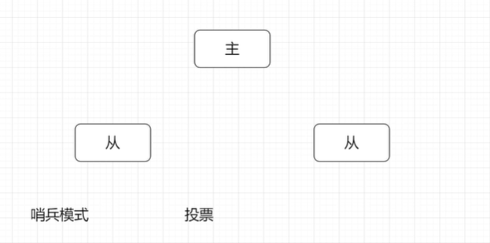
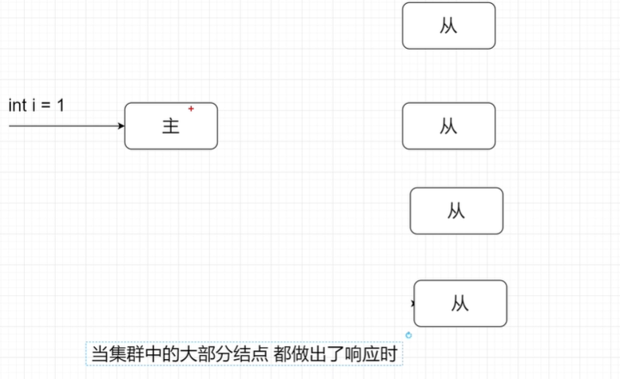
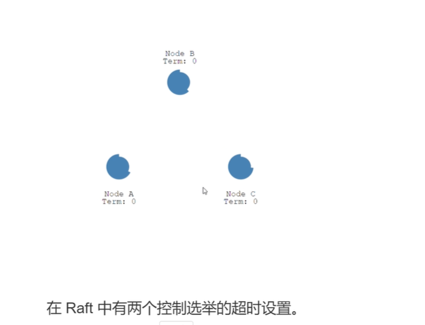
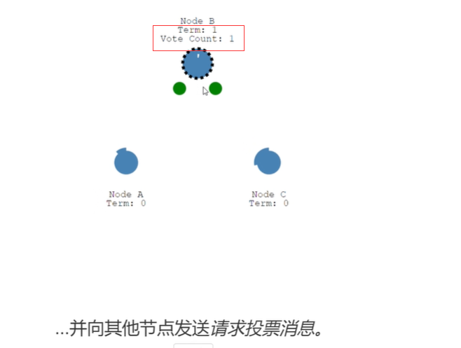

# 集群的深入理解

## 1.去中心化模式

### 1.概念

通过一个算法,可以将数据转发给其他机器进行同步,更高可用.

## 2.主从模式

### 1.概念

主机作为主要的服务器(如: 做比较重要的事--写),从机作为读的服务器

### 2.主机如何选择

### 3.数据怎么同步

使用分布式数据一致性协议,用的比较多的是Paxos和raft

zookeeper: paxos

nacos: raft

eureka: 没有分布式数据一致性机制,节点都是相同的(去中心化模式)

#### 1.raft 分布式共识协议

##### 1.选取主机

## 3.中心化集群

### 1.概念

就是一个nginx 托管 N个tomcat

