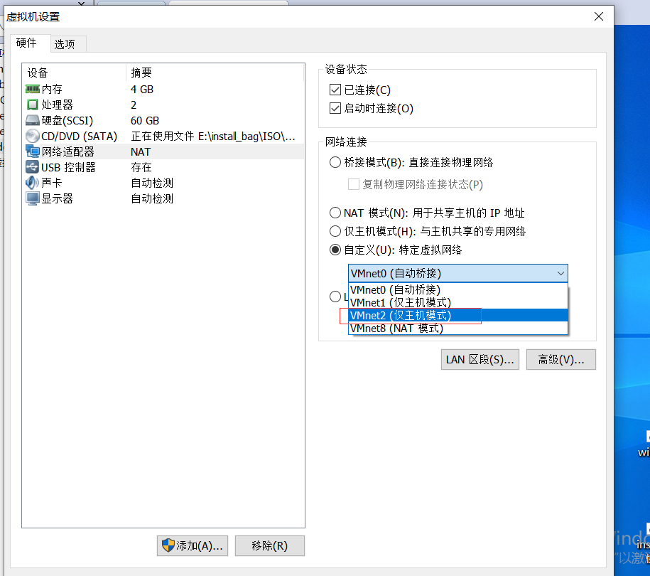

视频:

https://www.bilibili.com/video/BV1KJ411h7NH?p=3&spm_id_from=pageDriver&vd_source=32131508025bddf2cd86c3bbf5b572cb


# 1.安装

## 1.Linux:

https://blog.csdn.net/weixin_57263771/article/details/128269842#t0

### 1.下载配置文件

https://wwr.lanzoui.com/iXKBBu3uoda

这个shell只是方便环境配置，会自动帮你创建账号、文件夹、权限、环境变量。

执行下面的命令:

```Linux
chmod 777 oraclePreInstallCheck.sh
./oraclePreInstallCheck.sh
```

执行第二条命令后,输入y,会下载所需要的包


一些设置:


检查库有没有安装全:

```txt
rpm -q binutils compat-libstdc++ elfutils-libelf elfutils-libelf-devel elfutils-libelf-devel-static gcc gcc-c++ glibc glibc-common glibc-devel glibc-headers kernel-headers ksh libaio libaio-devel libgcc libgomp libstdc++ libstdc++-devel make sysstat unixODBC unixODBC-devel bc
```

这里缺少了bc


可以根据教程找,也可以百度:

yum -y install bc


### 2.安装Oracle

#### 1.下载

下载链接：https://download.oracle.com/otn/linux/oracle11g/xe/oracle-xe-11.2.0-1.0.x86_64.rpm.zip

#### 2.解压

unzip oracle-xe-11.2.0-1.0.x86_64.rpm.zip

解压后的文件目录

```txt
[root@centos8-1 ~]# tree

├── Disk1
│   ├── oracle-xe-11.2.0-1.0.x86_64.rpm
│   ├── response
│   │   └── xe.rsp
│   └── upgrade
│       └── gen_inst.sql
```

#### 3.安装

进入到Disk目录下:

rpm -ivh oracle-xe-11.2.0-1.0.x86_64.rpm

就会安装:

swag分区内存不足,要配置分区


#### 4.配置分区

https://blog.csdn.net/zxy144/article/details/112545350


```txt
查看内存使用的状态:
free -h
创建一个分区文件（bs每块的大小，count文件有多少块，这里的swap就是2G）
dd if=/dev/zero of=/opt/swap bs=1M count=12048
将/opt/swap文件设置为swap分区文件
mkswap /opt/swap
建议进行swap文件的权限修改（改不改都可以）
chmod 600 /opt/swap 
激活swap，启动分区交换文件
swapon /opt/swap
```

### 3.安装后进行配置：

密码设置未123456

#### 1.配置

https://www.cnblogs.com/ranke110/p/15233143.html

/etc/init.d/oracle-xe configure

#### 2.配置变量

vim /etc/profile

文件尾加入以下配置

```export ORACLE_BASE=/u01/app/oracle
PATH=$PATH:$HOME/bin
export ORACLE_HOME=$ORACLE_BASE/product/11.2.0/xe
export ORACLE_SID=XE                                     #这里特别注意，XE一定要大写，与tnsnames.ora文
件内容一致，否则在使用oracle时会报ORA-01034的错误
export PATH=$PATH:$ORACLE_HOME/bin
```

按i编辑,esc退出编辑,:w保存,:q退出,:q!强制退出

保存后执行：

source /etc/profile

#### 3.设置数据库名

cd  /u01/app/oracle/product/11.2.0/xe/dbs/

cp init.ora initXE.ora

vim initXE.ora

```txt
db_name='ORCL'  #这个需要改成XE或者自己的实例名
```

#### 4.sqlplus命令无效

https://blog.csdn.net/u013373006/article/details/107679692

“sqlplus: error while loading shared libraries: libnsl.so.1: cannot open shared object file: No such file or directory“

出现这个错误的可能情况非常多，例如，环境变量配置有问题，缺少依赖包等等。这里前面的环境变量配置正常，排查依赖的库是否有问题，发现libnsl.so.1找不到。

```
ldd 安装Oracle的目录
ldd /u01/app/oracle/product/11.2.0/xe/bin/sqlplus
```

发现:

```
linux-vdso.so.1 (0x00007ffd0b7a5000)
        libsqlplus.so => /usr/lib/oracle/11.2/client64/lib/libsqlplus.so (0x00007f927b563000)
        libclntsh.so.11.1 => /usr/lib/oracle/11.2/client64/lib/libclntsh.so.11.1 (0x00007f9278bb3000)
        libnnz11.so => /usr/lib/oracle/11.2/client64/lib/libnnz11.so (0x00007f92787e6000)
        libdl.so.2 => /lib64/libdl.so.2 (0x00007f92785e2000)
        libm.so.6 => /lib64/libm.so.6 (0x00007f9278260000)
        libpthread.so.0 => /lib64/libpthread.so.0 (0x00007f9278040000)
        libnsl.so.1 => not found
        libc.so.6 => /lib64/libc.so.6 (0x00007f9277c7e000)
        libnsl.so.1 => not found
        libnsl.so.1 => not found
        libaio.so.1 => /lib64/libaio.so.1 (0x00007f9277a7b000)
        /lib64/ld-linux-x86-64.so.2 (0x00007f927b522000)
```

根据下面命令判断依赖的libnsl包没有安装。

        libnsl.so.1 => not found
        libnsl.so.1 => not found

安装缺少的依赖:

```txt
# yum list installed | grep libnsl
# yum list | grep   libnsl
# yum install libnsl.x86_64
```

再测试就可以了.


#### 5.sqlplus: command not found

```txt
[root@VM-4-9-centos bin]# sqlplus
bash: sqlplus: command not found
[root@VM-4-9-centos bin]# sqlplus /nolog
bash: sqlplus: command not found
```


将Oracle安装目录下的sqlplus文件,复制到系统的bin文件夹下

#### 6.ORACLE_HOME报错

https://blog.csdn.net/weixin_29765215/article/details/116343849

可能是/etc/profile文件没设置好,可以这样设置


#### 7.SP2-0667: Message file sp1<lang>.msb not found


原因

```txt
没有找到Oracle的路径,可能是/etc/profile没有生效
```

解决方案:

```txt
重启Oracle
su - oracle
刷新路径文件
source /etc/prifile
启动数据库
sqlplus "/as sysdba"
开启
startup
```


#### 8.ORA-01261: Parameter db_recovery_file_dest 未找到


可能是Oracle目录缺少db_recovery_file_dest 文件夹


新建一个并把权限设置为777


还有就是初始化文件,里的目录用路径代替


#### 9.ORA-00845: MEMORY_TARGET not supported on this system

https://www.yisu.com/zixun/31141.html

MEMORY_TARGET 过大,如果保证可用空间大于memory_max_target，则数据库正常启动。设置为2G即可

命令:

```txt
转到root账户
sudo su root
查看空间
df -h
设置/dev/shm为2G
mount -o remount,size=2G /dev/shm
再次查看
df -h
```

#### 10.ORA-09925: Unable to create audit trail file

https://www.cnblogs.com/vmsysjack/p/12383581.html

已经有一个进程了,先要关闭它

命令:

```cmd
ps -elf | grep smon
kill -9 2013809
sqlplus / as sysdba
```


## 2.虚拟机 Windows 10

### 1.增加虚拟网卡


地址最后面不能为1,改为5

### 2.将虚拟机与网卡绑定





将虚拟机的ip地址固定下来


# 2.使用

## 1.使用DataGrip连接Oracle


## 2.如果中文乱码


select userenv('language') from dual

SIMPLIFIED CHINESE_CHINA.ZHS16GBK

将结果存入环境变量,


## 3.表设计


## 4.创建表空间

```sql
create tablespace waterboss
datafile 'G:\Document\DataBase\oracle\water.dbf'
size 10m
autoextend on
next 10m
```

```txt
建立一个waterboss的表空间
create tablespace waterboss
存储这个表空间的位置为water.dbf的文件,可以与表空间名字不一样
datafile 'G:\Document\DataBase\oracle\water.dbf'
表空间的初始大小为10m
size 10m
自动扩容
autoextend on
一次扩容为10m
next 10m
```


## 5.创建用户

```sql
-- 创建用户
create user wateruser
-- 设置密码
identified by 123456
-- 绑定表空间
default tablespace waterboss
-- 赋予最高权限
grant dba to wateruser
```

没有赋予权限的话,是不能登录的/

登录wateruser


## 6.数据类型

### 1.字符串类型

1. **CHAR**: 定长字符串，会用空格填充来达到其最大长度。
1. **NCHAR**: 一个包含UNICODE格式数据的定长字符串。
1. **VARCHAR2:**变长字符串，与CHAR类型不同，它不会使用空格填充至最大长度。
1. **NVARCHAR2:**一个包含UNICODE格式数据的变长字符串

### 2.数字类型

1. **NUMBER**:NUMBER(P,S)是最常见的数字类型

   P 是Precison的英文缩写，即精度缩写，表示有效数字的位数，最多不能超过38个有效数字。

   S是Scale的英文缩写，可以使用的范围为-84~127。Scale为正数时，表示从小数点到最低有效数字的位数，它为负数时，表示从最大有效数字到小数点的位数。

1. **INTEGER**:INTEGER是NUMBER的子类型，它等同于NUMBER（38,0），用来存储整数。若插入、更新的数值有小数，则会被四舍五入。

1.  **FLOAT**: FLOAT类型也是NUMBER的子类型。

   Float(n)，数n指示位的精度，可以存储的值的数目。n值的范围可以从 1 到 126。

### 3.日期类型

1. **DATE**: DATE是最常用的数据类型，日期数据类型存储日期和时间信息。

   Oracle 存储以下信息： 世纪、 年、 月、 日期、 小时、 分钟和秒。一般占用7个字节的存储空间。

1. **TIMESTAMP**: TIMESTAMP是一个7字节或12字节的定宽日期/时间数据类型，是DATE类型的扩展类型。它与DATE数据类型不同，因为TIMESTAMP可以包含小数秒，带小数秒的TIMESTAMP在小数点右边最多可以保留9位

### 4,**LOB**类型

内置的LOB数据类型包括BLOB、CLOB、NCLOB、BFILE（外部存储）的大型化和非结构化数据，如文本、图像、视频、空间数据存储。

1. **CLOB**: CLOB存储单字节和多字节字符数据。支持固定宽度和可变宽度的字符集。
1. **NCLOB**: NCLOB存储UNICODE类型的数据，支持固定宽度和可变宽度的字符集，
1. **BLOB**: BLOB存储非结构化的二进制数据大对象，它可以被认为是没有字符集语义的比特流，一般是图像、声音、视频等文件。
1. **BFILE**: 二进制文件，存储在数据库外的系统文件，只读的，数据库会将该文件当二进制文件处理。

### 5.**RAW & LONG RAW**

1. **RAW**: 用于存储二进制或字符类型数据，变长二进制数据类型，这说明采用这种数据类型存储的数据不会发生字符集转换。
1. **LONG RAW**: LONG RAW类型，能存储2GB的原始二进制数据（不用进行字符集转换的数据）。建议使用BLOB来代替它。

### 6.**ROWID & UROWID类型**

1. **ROWID**: ROWID是一种特殊的列类型，称之为伪列（pseudocolumn）。ROWID伪列在SQL SELECT语句中可以像普通列那样被访问。
1. **UROWID**: UROWID，它用于表，是行主键的一个表示，基于主键生成。UROWID与ROWID的区别就是UROWID可以表示各种ROWID，使用较安全。一般是索引组织表在使用UROWID。


## 7.创建表

最好把用户名也加上

```sql
create table wateruser.t_owners(
       id number primary key,
       name varchar2(30),
       address_id number,
       house_number varchar2(30),
       water_meter varchar2(30),
       add_date date,
       owner_type_id number
);
```

也可以用图形化界面建表:


效果图:


## 8.添加注释

```sql
--添加表注释
COMMENT ON TABLE wateruser.t_owners IS '业主表';
--添加字段注释：
COMMENT ON COLUMN wateruser.t_owners.id IS '编号';
COMMENT ON COLUMN wateruser.t_owners.name IS '姓名';
COMMENT ON COLUMN wateruser.t_owners.address_id IS '地址id';
COMMENT ON COLUMN wateruser.t_owners.house_number IS '门牌号';
COMMENT ON COLUMN wateruser.t_owners.water_meter IS '水表编号';
COMMENT ON COLUMN wateruser.t_owners.add_date IS '登记日期';
COMMENT ON COLUMN wateruser.t_owners.owner_type_id IS '业主类型id';
```

## 9.增加字段

```sql
-- 增加字段
-- alter table 表名称 add (列明1 类型,列明2 类型, ...)
alter table wateruser.t_owners add (test number);
```


## 10.修改字段

```sql
-- 修改字段类型
-- alter table 表名 modify(字段名 需要更改的类型);
alter table wateruser.t_owners modify(test integer);
-- 修改字段名
-- alter table 表名 rename column 原来的字段名 to 需要更改的字段名;
alter table wateruser.t_owners rename column test to test_rename;

```


## 11.删除

```sql
-- 删除字段
alter table wateruser.t_owners drop column test_rename;
--删除表
drop table wateruser.t_owners;
```


## 12.数据操作

### 1 插入数据

INSERT INTO 表名(列名列表) VALUES(值列表);

当对表中所有的列进行赋值，那么列名列表可以省略，小括号也随之省略

如: insert into 表明 values(值1, 值2, 值3,...)

必须对表中的非空字段进行赋值具有默认值的字段可以不提供值，此时列名列表中的相应的列名也要省略。

```sql
-- 插入语句
insert into wateruser.t_owners (id, name) values(1, 'tom');
select * from  wateruser.t_owners;
insert into wateruser.t_owners values (2, 'lily',1, '1-1', '123456',sysdate,1);
```

### 2 修改数据（更新数据）

UPDATE 表名 SET 字段=值 WHERE 字段=值

更新多列数据

```sql
UPDATE 表名 SET PRICE=PRICE*0.8, NAME=‘值’  WHERE 字段=值
```

用默认值修改数据

```sql
UPDATE EMP SET JOB=DEFAULT WHERE ENAME=‘SCOTT’
```

**注意:**
**ORACLE中日期列不能直接插入字符串，需使用日期函数转换 TO_DATE(数 据,’YYYY-MM-DD’)**

### 3 删除数据

删除符合条件数据

```sql
DELETE FROM EMP WHERE  ENAME= ‘SMITH’
```

删除所有表EMP 所有数据

```sql
DELETE FROM EMP
```

截断表

```sql
TRUNCATE TABLE EMP;
```

**注意:**
**当使用DELETE语句删除表数据时，不会释放表所占用的空间，如果用户确定要删除表的所有数据，那么使用截断表更快，并释放表段所占用的空间，注意，DELETE语句可回滚数据，截断表不可回滚数据**

### 4 查询数据

#### 4.1 使用select 关键字

```sql
SELECT   列名 FROM 表名;

SELECT * FROM 表名 WHERE 字段>数值;
SELECT * FROM 表名 WHERE  PRICE>50;

--显示工资在2000到2500工资
	SELECT * FROM 表名 WHERE 字段>=2000 AND 字段<=2500;
	
 	SELECT * FROM 表明 WHERE 字段 BETWEEN 2000 AND 2500；

```

#### 4.2 模糊查询

**模糊查询 使用关键 like**

```txt
      %：表示任意0到多个字符  ；
 	  _ : 表示任意单个字符
```

```sql
--如何显示首字母为S的员工姓名及工资
    SELECT EANAME, SAL FROM 表名 WHERE  EANAME LIKE 'S%' ;

--如何显示第三个字母为O的所有员工姓名及工资
	 SELECT EANAME, SAL FROM 表名 WHERE  EANAME LIKE '_ _O%';

```

#### 4.3 对查询数据排序

**使用 order by 关键字**

```sql
ASC:正序
DESC:倒序
格式：
select emame,sal from emp where sal is not null order by sal desc;
```

#### 4.4 分组查询

**使用关键字group by**

```sql
查询每个部门员工的数量
select  deptno, count(*) 数量 from emp group by deptno;
```

#### 4.5 Having 查询

**having 查询是对分组之后的结果进行查询**

```sql
查询平均工资大于两千的部门及部门人数
SELECT  DEPTNO,COUNT(*) 数量  FROM  EMP GROUP BY  DEPTNO HAVING AVG(SAL)>2000
```

## 13.数据库导入导出

### 1.导出

```sql
exp wateruser/123456 file=G:\Document\DataBase\oracle\1.dmp full=y
exp wateruser/123456 file=G:\Document\DataBase\oracle\1.dmp table=t_owners,owner_type
```

1. wateruser: 所属的账号

1. 123456: 密码

1. file=G:\Document\DataBase\oracle\1.sql

   导出的路径

1. full=y: 全部导出

1. table=t_owners,owner_type :按表导出


### 2.导入

```sql
imp wateruser/123456 file=G:\Document\DataBase\oracle\1.sql full=y
imp wateruser/123456 file=G:\Document\DataBase\oracle\1.sql table=t_owners,owner_type
```


# 3.spring 导入

## 1.导入依赖

https://blog.csdn.net/weixin_45767596/article/details/122091544

### 1.找到jar包

D:/app/ppx/product/11.2.0/dbhome_1/jdbc/lib/ojdbc6.jar


### 2.打开cmd

执行,jar路径和版本号11.2.0.1.0是自己设置的:

```txt
mvn install:install-file -Dfile=/D:/app/ppx/product/11.2.0/dbhome_1/jdbc/lib/ojdbc6.jar -DgroupId=com.oracle -DartifactId=ojdbc6 -Dversion=11.2.0.1.0 -Dpackaging=jar -DgeneratePom=true
```


### 3.使用依赖

```xml
        <!--oracle-->
        <dependency>
            <groupId>com.oracle</groupId>
            <artifactId>ojdbc6</artifactId>
            <version>11.2.0.1.0</version>
        </dependency>
				<!-- Mybatis -->
        <dependency>
            <groupId>org.mybatis.spring.boot</groupId>
            <artifactId>mybatis-spring-boot-starter</artifactId>
            <version>2.2.2</version>
        </dependency>
        <!-- 与数据库操作相关依赖 -->
        <dependency>
            <groupId>org.springframework.boot</groupId>
            <artifactId>spring-boot-starter-jdbc</artifactId>
        </dependency>
```

## 2.配置Oracle


```yaml
spring:
  datasource:
    driver-class-name: oracle.jdbc.driver.OracleDriver
    url: jdbc:oracle:thin:@localhost:1521:orcl
#    url: jdbc:oracle:thin:@192.168.221.205:1521:orcl
    username: wateruser
    password: 123456
mybatis:
  mapper-locations: classpath:com/example/demo/mapper/xml/*.xml
  type-aliases-package: com.example.demo.entity
  configuration:
    map-underscore-to-camel-case: true
    log-impl: org.apache.ibatis.logging.stdout.StdOutImpl    
```

## 3.增加静态资源解析

```xml
        <!--静态资源解析-->
        <resources>
            <resource>
                <directory>src/main/java</directory>
                <includes>
                    <include>**/*.xml</include>
                </includes>
            </resource>
        </resources>
```


## 4.新建mapper及entiry


## 5.简单测试

```java
package com.example.demo.mapper;

import com.example.demo.entiry.Owner;
import org.apache.ibatis.annotations.Mapper;
import org.apache.ibatis.annotations.Select;

import java.util.List;

/**
 * @author HuaRunSheng
 * @date 2023/3/3 18:23
 * @description :
 */
@Mapper
public interface OwnerMapper {
    @Select("select count(*) from t_owners")
    Integer getCount();
}

```


## 6.编写xml

```xml
<?xml version="1.0" encoding="UTF-8" ?>
<!DOCTYPE mapper  PUBLIC "-//mybatis.org//DTD Mapper 3.0//EN"
        "http://mybatis.org/dtd/mybatis-3-mapper.dtd">
<mapper namespace="com.example.demo.mapper.OwnerMapper">
    <select id="findAll" resultType="com.example.demo.entity.Owner">
        select * from t_owners
    </select>
</mapper>
```


# 4.单行函数

## 1.求字符串长度

```sql
select length("hhhd") from dual
select length(name) from wateruser.t_owners where id=1;
```

hhhd的长度为4,返回4, dual为伪表

id为1用户的名字长度


## 2.求子字符串

```sql
select substr('abcd',2,2) from dual
```

从第2位开始截取字符abcd,并截取两位.

## 3.字符串拼接

```sql
select concat('abc', 'd') from dual
select 'abd'||'d' from dual
```

拼接'abc'和'd',结果'abcd',与||效果一样


## 4.数字转字符串

```sql
select to_char(100) from dual
select 100||'' from dual
```

## 5.字符串转日期

```sql
select to_date('2016-03-11', 'yyyy-mm-dd') from dual
```

格式: 'yyyy-mm-dd'

## 6.日期转字符串

```sql
select to_char(sysdate, 'yyyy-mm-dd') from dual
select '时间为:'||to_char(sysdate, 'yyyy-mm-dd') from dual
select to_char(sysdate, 'yyyy-mm-dd hh:mi:ss') from dual
```

## 7.字符串转数字

```sql
select to_number('100') from dual
select '100'+0 from dual
```

## 8.空值处理

```sql
select nul(name, 'tom') from t_owners where id=1
```

如果id为1的用户,name为空,就赋值为tom


# 5.复杂查找

## 1.分组查找

group by,统计各地区的水费总和.

```sql
select sum(money) from T_ACCOUNT where year='2012' group by AREAID
```


## 2.子查询

```sql
select sum(money) from T_ACCOUNT where year='2012' group by AREAID
```

在此基础上,结果中加入地区

```sql
select (select name from T_AREA where id=AREAID) 区域, sum(money) 水费2012年 from T_ACCOUNT where year='2012' group by AREAID;
```


## 3.条件查询

case when 条件 then true结果 else false结果 end

统计2012年分区每个月的水费:

```sql
select (select name from T_AREA where id=AREAID) 区域,
       sum(case when month='01' then money else 0 end) 水费2012年1月,
       sum(case when month='02' then money else 0 end) 水费2012年1月,
       sum(case when month='03' then money else 0 end) 水费2012年1月,
       sum(case when month='04' then money else 0 end) 水费2012年1月,
       sum(case when month='05' then money else 0 end) 水费2012年1月,
       sum(case when month='06' then money else 0 end) 水费2012年1月,
       sum(case when month='07' then money else 0 end) 水费2012年1月,
       sum(case when month='08' then money else 0 end) 水费2012年1月,
       sum(case when month='09' then money else 0 end) 水费2012年1月,
       sum(case when month='10' then money else 0 end) 水费2012年1月,
       sum(case when month='11' then money else 0 end) 水费2012年1月,
       sum(case when month='12' then money else 0 end) 水费2012年1月
from T_ACCOUNT where year='2012' group by AREAID;
```


```sql
-- 按季度统计水费
select (select name from T_AREA where id=AREAID) 区域,
       sum(case when month>='01' and month<='03' then money else 0 end) 水费2012年1季度,
       sum(case when month>='04' and month<='06' then money else 0 end) 水费2012年2季度,
       sum(case when month>='07' and month<='09' then money else 0 end) 水费2012年3季度,
       sum(case when month>='10' and month<='12' then money else 0 end) 水费2012年4季度
from T_ACCOUNT where year='2012' group by AREAID;
```


# 6.排序

按列名升序

order by 列明 

按列名降序

order by 列明 desc

```sql
-- 排序,按usenum列降序排列
select  * from T_ACCOUNT order by usenum desc;
```


# 7.排名

## 1.值相同,排名相同,序号跳跃

按A列(升序)进行排名

rank() over(order by A列名)

按A列(降序)进行排名

rank() over(order by A列名 desc)

```sql
-- 排名,按usenum列降序排名,值相同,排名相同,序号跳跃
select rank() over ( order by usenum desc ) 排名,  t.* from T_ACCOUNT t;
```

注意,*要与usenum区别开,所以将表写成t,结果写成t.*


## 2.值相同,排名相同,序号连续

```sql
-- .值相同,排名相同,序号连续
select dense_rank() over ( order by usenum desc ) 排名,  t.* from T_ACCOUNT t;
```


## 3.序号连续,不管值相不相同

```sql
-- 序号连续,不管值相不相同
select row_number() over ( order by usenum desc ) 排名,  t.* from T_ACCOUNT t;
```


## 4.根据排名实现分页

如:让排序结果作为数据集

```sql
(select row_number() over ( order by usenum desc ) 排名,  t.* from T_ACCOUNT t)
```

在外面嵌套一个查询,如查询第11至20名:

```sql
select * from (select row_number() over ( order by usenum desc ) 排名,  t.* from T_ACCOUNT t) where 排名>=11 and 排名<=20;
```


# 8.集合运算

## 1.三种运算


## 2.并集 union

union all

union

```sql
-- 并集 union all 包括重复数据
select * from T_OWNERS where ID>5
union all
select * from T_OWNERS where ID<7;
```


```sql
-- 并集 union ,去掉重复数据
select * from T_OWNERS where ID>5
union
select * from T_OWNERS where ID<7;
```


## 3.交集 intersect

```sql
-- 交集 intersect(保留交叉部分)
select * from T_OWNERS where ID>5
intersect
select * from T_OWNERS where ID<7;
```


## 4.差集 minus

```sql
-- 差集 minus 去掉交叉部分(以第一个查找结果作为数据集,去掉与第二个结果中重合的部分)
-- 如,第一个结果为6,7,8,9,10,第二个结果为6,5,4,3,2,1,以第一个结果为准,去掉 与第二个结果重复部分6,剩余7,8,9,10
select * from T_OWNERS where ID>5
minus
select * from T_OWNERS where ID<7;
```


## 5.应用 用差集实现分页

```sql
-- 用差集实现分页
select ROWNUM, t.* from T_ACCOUNT t where ROWNUM <=20
minus
select ROWNUM, t.* from T_ACCOUNT t where ROWNUM <=10
```


# 9.视图

## 1.什么是视图

视图就是将查询语句封装成一个方法,供需要时调用


## 2.创建或修改视图

### 1.语法:

```sql
create [or replace] [force] view view_name as subquery [with check option] [with read only]
```

- [or replace] : 若所创建的视图已经存在,Oracle自动重建该视图.

- [force]: 不管基表是否存在Oracle都会自动创建该视图.

- view_name : 该视图的名字,相当于方法名

- subquery : 查询语句

- [with check option]: 插入或修改的数据行必须满足视图定义的约束.

- [with read only] : 只读,不允许修改.


### 2.案例

#### 1.简单查询

先编写subquery (查询语句):

```sql
-- 先编写查询语句,确认无误
select * from T_OWNERS where OWNERTYPEID=1;
```

```sql
-- 再编写创建视图语句
create or replace view test_view as (select * from T_OWNERS where OWNERTYPEID=1);
```


使用

```sql
-- 使用,视图只是作为一个结果集
select * from test_view;
-- 在视图集上再次查找
select * from test_view where ADDRESSID=1
```


修改视图里面的数据:

```sql
-- 修改视图里面的数据
update test_view set NAME='xiao bing' where ID=1;
commit;
```


#### 2.聚合查询

```sql
-- 聚合查询
    select year, month, sum(MONEY) money from T_ACCOUNT
group by year,MONTH
order by  year, MONTH;
-- 创建视图
create view view_accountsum as
    select year, month, sum(MONEY) money from T_ACCOUNT
group by year,MONTH
order by  year, MONTH;
-- 使用
select * from view_accountsum;
```


## 3.删除视图

## 1.语法

```sql
drop view view_name
```

# 10.物化视图

## 1.区别

物化视图和视图的区别就是:

视图只是将语句封装起来,每次调用都会运行封装的查询语句.

物化视图是将查询出的来的结果集封装成一个表,就不用再次去数据库中查询这个结果,相当于mybatis中的缓存.


## 2.创建物化视图语法

```sql
create meterialized view view_name [build immediate | build deferred] refresh [fast|complete|force] [on [commit | demand] | start with (start_time) next (next_time)] as subquery
```

- build immediate :是在创建物化视图的时候就生成数据,默认
- build deferred : 在创建视图时不生成数据,以后根据需要再生成
- refresh : 刷新,指当基表发生dml操作后,物化视图采取何种方式与基表进行同步.[fast|complete|force],默认强制(force)
- fast : 增量更新,根据增删改查日志,更新视图里面的表
- complete : 完全更新,当表发生改变时,重新查询封装的语句,并进行覆盖.
- force : 自动选择,在fast和complete中自动选择,遵循能fast就fast
- on commit : 在基表做提交操作时刷新物化视图.自动刷新
- on demand: 手动刷新.


## 3.手动刷新

### 1.创建手动刷新的物化视图

```sql
-- 创建手动刷新视图
select ad.id, ad.name, ar.NAME arname from T_ADDRESS ad, T_AREA ar where ad.AREAID=ar.ID;
create materialized view mv_address as
    select ad.id, ad.name, ar.NAME arname from T_ADDRESS ad, T_AREA ar where ad.AREAID=ar.ID;

```


### 2.插入数据,重新查询

```sql
-- 向基表中插入数据
insert into T_ADDRESS values(8,'西湖区',2,2);
commit;
select * from mv_address;
```

结果并没有查询的数据,说明提交到基表的数据并没有更新到物化视图中.


### 3.刷新物化视图

```sql
-- 刷新物化视图
begin
    DBMS_MVIEW.REFRESH('mv_address', 'C');
end;
select * from mv_address;
```


## 4.自动刷新

refresh on commit

```sql
-- 自动刷新
create materialized view mv_address_auto refresh on commit as
    select ad.id, ad.name, ar.NAME arname from T_ADDRESS ad, T_AREA ar where ad.AREAID=ar.ID;

```


## 4.删除物化视图

删除物化视图的同时也会将创建的表也删掉.

```sql
-- 删除物化视图
drop materialized view view_address;
```


# 11.序列

由于Oracle没有自增,所以实现自动id需要借助其他方法.

序列就是其中一种.

```sql
-- 序列
-- 创建简单序列
create sequence seq_test;
-- 查询序列的下一个值
select seq_test.nextval from dual;
-- 查询序列的当前值
select seq_test.currval from dual;
```


insert插入值的时候可以使用.

## 2.复杂序列

```sql
create sequence seq_name [incrementy by num] [start with num] [{maxvalue num | nomaxvalue}] [{minvalue num | nominvalue}] [{cycle|nocycle}] [{cache num|nocache}]
```

- [incrementy by num]: 按num值递增,num可以为负数,负数就是递减.

- [start with num]: 按num的值作为初始值,递增默认是minvalue,递减默认是maxvalue

- [{maxvalue num | nomaxvalue}]: 最大值

- [{minvalue num | nominvalue}]: 最小值

- [{cycle|nocycle}]: 循环,默认不循环

- [{cache num|nocache}]:分配并存入到内存中,默认缓存,num是缓存数量,默认10

### 1.有最大值的非循环序列

```sql
create sequence set_test maxvalue 20;
```

### 2.有最大值,每次增加10,初始值为10

```sql
create sequence seq_test increment by 10 start with 10 maxvalue 100;
```

### 3.循环

```sql
create sequence seq_test increment by 10 start with 10 minvalue=10 maxvalue 210 cycle;

```

## 4.修改序列

alter ......

## 5.删除序列

drop ......


# 12.索引

## 1.什么是索引

**将表看作一本书，索引就是目录，没有目录你就要一页一页翻，有了目录，根据目录中标记的页码（ROWID）去指定页中寻找你想要的内容即可**

索引是需要占用空间的,也可以理解为一种特殊的数据.类似于一颗树,二树的节点存储的就是欸条记录的物理地址(ROWID),也就是伪列.

普通索引允许被索引的数据列包含重复的值。

查询到指定结果后肯定要继续查，直到查找到第一个不满足条件的才会停止。


## 2.普通索引

### 1.语法

```sql
create index 索引名称 on 表名(列名)
```

### 2.实例

```sql
-- 索引,根据name列建立索引,以后将name作为查找条件时就会走索引的方式
create index index_owner_name on T_OWNERS(NAME);
select * from T_OWNERS where name='刘华';

```


## 3.唯一索引

### 1.唯一索引定义

唯一索引除了可以提高查询速度，还能做到列属性唯一，可以用作幂等性保证，唯一性约束等。

主键是一种约束，和索引本质上是不同的，但是oracle中创建主键后会自动生成一个  唯一索引。删除主键时也会把同名的索引删除。 

但是唯一索引不一定是主键。  主键和唯一索引的区别：主键列一定不允许空值，但是唯一索引列可以。

如果是唯一索引，查到第一个满足的就不会继续查的。

### 2.创建语句

```sql
oracle : 
   
   创建唯一索引：
   create unique index 索引名称 on 表名(列字段);

   普通索引：
   单索引
   create index 索引名称 on table(列字段);
   
   删除索引
   drop index 索引名称;
 
   复合索引
   create index 索引名称  ON 表名(字段1,字段2);

   查询某张表中所有索引
   select * from ALL_INDEXS where table_name = 表名;

   查询某张表加了索引的列
   select * from ALL_IND_COLUMN where table_name = 表名;

   索引优缺点:
   优点 : 加快查询速度
   缺点 : 更新,要把索引也进行更新

```


### 3.实例

```sql
-- 创建唯一索引,不能有重复数据
create unique index index_owners_meter on T_OWNERS(WATERMETER);
```


### 4.复合索引

当查找表时,经常将几个列作为条件

```sql
create index 索引名称  ON 表名(字段1,字段2);
-- 复合索引,只建一棵树
create index index_owners_ah on T_OWNERS(ADDRESSID, HOUSENUMBER);
```


## 5.反向键索引

### 1.应用场景

当某个字段的值为连续增长的值,如果构建标准索引,会形成歪脖子树.这样会增加查询的层数,性能会下降.建立反向键索引,可以使索引的值变得不规律,从而使索引树能够均匀分布.


### 2.语法

```sql
create index 索引名称 on 表名(列名) reverse;
```


## 6.位图索引

### 1.使用场景

位图索引适合创建在低基数数列上,位图索引不直接存储ROWID,而是存储字节到ROWID的映射.(不是树结构了,而是图结构,给数据分组,每个组一个位图)

优点: 减少响应时间,节省空间占用.

缺点: 只能用于低基数列,且查找时只能用等于号,不能按范围查询


### 2.语法

```sql
create bitmap index 索引名称 on 表明(列名);
```


# 13.PL/SQL

## 1.概念

PL/SQL(Procedure Language/SQL) 是Oracle对sql语言的过程化扩展,即sql语句与编程相结合.更方便处理表.

基本语法结构

```plsql
[declare --声明变量]
 begin
 -- 代码逻辑
 [exception -- 异常处理]  
  end;
```

## 2.变量

### 1.语法

```plsql
1.声明变量名语法
变量名 类型(长度);
2.变量赋值语法
变量名:=变量值;
```

### 2.变量声明与赋值


```plsql
declare
    -- 价格,精度为10,有效数字为2
    v_price number(10,2);
    -- 水费字数
    v_usenum number;
    -- 水吨数
    v_usenum2 number(10, 2);
    -- 水费
    v_money number(10, 2);
begin
    v_price:=2.45;
    v_usenum:=9213;
    v_usenum2:=round(v_usenum/1000,2);
    v_money:=v_price*v_usenum2;
    -- 打印到控制台
    DBMS_OUTPUT.PUT_LINE('金额: ' || v_money);
end;
```

需要打开DMBS_OUTPUT才能显示结果.


### 3.查询语句赋值

语法:

select 结果1, 结果2, 结果3 into 变量名1,变量名2,变量名3 from 表名 where 条件;

```plsql
select USENUM into v_usenum from T_ACCOUNT
    where YEAR='2012' and MONTH='01' and OWNERUUID=1;
```

```plsql
declare
    -- 价格,精度为10,有效数字为2
    v_price number(10,2);
    -- 水费字数
    v_usenum number;
    -- 水吨数
    v_usenum2 number(10, 2);
    -- 水费
    v_money number(10, 2);
    -- 上月水表数
    v_num0 number;
    -- 本月水表数
    v_num1 number;
begin
    v_price:=2.45;
    -- 将查询到的usenum赋值给v_usenum
    select USENUM, NUM0, NUM1 into v_usenum, v_num0, v_num1 from T_ACCOUNT
    where YEAR='2012' and MONTH='01' and OWNERUUID=1;
    DBMS_OUTPUT.PUT_LINE('水费字数: ' || v_usenum);
    v_usenum2:=round(v_usenum/1000,2);
    v_money:=v_price*v_usenum2;
    DBMS_OUTPUT.PUT_LINE('金额: ' || v_money);
end;
```


### 3.属性类型

#### 1.应用型

当不确定变量的类型时,通过表.列的类型来声明变量.

变量名 表名.列名%type

```plsql
    -- 上月水表数
    v_num0 t_account.NUM0%type;
    -- 本月水表数
    v_num1 t_account.NUM1%type;
```

#### 2.记录型

类似于Java中的实体类,用于接收表中所有的列

变量名 表明%rowtype

```plsql
declare
    -- 价格,精度为10,有效数字为2
    v_price number(10,2);
--     -- 水费字数
--     v_usenum t_account.usenum%type;
    -- 水吨数
    v_usenum2 number(10, 2);
    -- 水费
    v_money number(10, 2);
--     -- 上月水表数
--     v_num0 t_account.NUM0%type;
--     -- 本月水表数
--     v_num1 t_account.NUM1%type;
    -- 将t_account表中所有的列都取出
    v_account t_account%rowtype;
begin
    v_price:=2.45;
    -- 将查询到的usenum赋值给v_usenum
--     select USENUM, NUM0, NUM1 into v_usenum, v_num0, v_num1 from T_ACCOUNT
    select * into v_account from T_ACCOUNT
    where YEAR='2012' and MONTH='01' and OWNERUUID=1;
    DBMS_OUTPUT.PUT_LINE('水费字数: ' || v_account.USENUM);
    v_usenum2:=round(v_account.USENUM/1000,2);
    v_money:=v_price*v_usenum2;
    DBMS_OUTPUT.PUT_LINE('金额: ' || v_money);
end;
```


## 3.异常

### 1.NO_DATA_FOUND

使用select into 未返回行

如,必须有返回

```plsql
    select * into v_account from T_ACCOUNT
    where YEAR='2012' and MONTH='01' and OWNERUUID=1;
```


### 2.TOO_MANY_ROWS

执行select into 时,结果超过一行

返回行不能超过1行:

```plsql
    select * into v_account from T_ACCOUNT
    where YEAR='2012' and MONTH='01' and OWNERUUID=1;
```

## 4.条件判断

语法

if 条件 then 语句; end if;

if 条件 then 语句; else 语句; end if;

if 条件 then 语句; elsif 条件 then 语句; else 语句; end if;

注意,语句后要加分号;

实例:

```sql
declare
    -- 价格,精度为10,有效数字为2
    v_price1 number(10,2);
    v_price2 number(10,2);
    v_price3 number(10,2);
--     -- 水费字数
--     v_usenum t_account.usenum%type;
    -- 水吨数
    v_usenum2 number(10, 2);
    -- 水费
    v_money number(10, 2);
--     -- 上月水表数
--     v_num0 t_account.NUM0%type;
--     -- 本月水表数
--     v_num1 t_account.NUM1%type;
    -- 将t_account表中所有的列都取出
    v_account t_account%rowtype;
begin
    v_price1:=2.45;-- 5吨以下
    v_price2:=3.45;-- 5-10吨
    v_price3:=4.45;-- 超过10吨
    -- 将查询到的usenum赋值给v_usenum
--     select USENUM, NUM0, NUM1 into v_usenum, v_num0, v_num1 from T_ACCOUNT
    select * into v_account from T_ACCOUNT
    where YEAR='2012' and MONTH='01' and OWNERUUID=1;
    DBMS_OUTPUT.PUT_LINE('水费字数: ' || v_account.USENUM);
    v_usenum2:=round(v_account.USENUM/1000,2);
--     v_money:=v_price1*v_usenum2;
    if v_usenum2<=5
        then v_money:=v_price1*v_usenum2;
    elsif v_usenum2>5 and v_usenum2<=10
        then v_money:=v_price1*5+(v_usenum2-5)*v_price2;
    else
        v_money:=v_price1*5+v_price2*5+(v_usenum2-10)*v_price3;
    end if;
    DBMS_OUTPUT.PUT_LINE('金额: ' || v_money);

-- exception
--     when no_date_found then:
--         DBMS_OUTPUT.PUT_LINE('没有找到掺乎数据');
end;
```


## 5.循环

### 1.无条件循环

会一直循环下去,要用exit语句才会退出循环.

```plsql
loop
	循环语句;
end loop;
```

案例:

```plsql
-- 1.无条件循环  范例:输出从1开始的100个数
declare
    num number:=1;
begin
    loop
        DBMS_OUTPUT.PUT_LINE(num);
        num:=num+1;
        exit when num>100;
    end loop;
end;
```


### 2.条件循环

```plsql
while 条件
loop
	语句;
end loop;
```

案例:

```plsql
-- 2.条件循环,从1输出到100
declare
    num number:=1;
begin
    DBMS_OUTPUT.PUT_LINE('条件循环,从1输出到100');
    while num<101
    loop
        DBMS_OUTPUT.PUT_LINE(num);
        num:=num+1;
    end loop;
end;

```


### 3.for循环

```plsql
for 变量 in 起始值..终止值
loop
	语句;
end loop;
```

案例:

```plsql
-- 3.for循环,从1输出到100
begin
    DBMS_OUTPUT.PUT_LINE('for循环,从1输出到100');
    for num in 1..100
    loop
        DBMS_OUTPUT.PUT_LINE(num);
    end loop;
end;
```


## 6.游标

### 1.定义

游标是系统未用户开设的一个数据缓冲区,存放SQL语句的执行结果.可以把游标理解为PL/SQL中的结果.

简单说,就是一个队列,里面存入的是表中查询出的结果.每次取出一条数据,弥补select into赋值变量时只能查询一条数据的不足.


### 2.语法

在声明区声明游标,语法如下:

```plsql
cursor 游标名称 is SQL语句;
```

使用游标语法:

```plsql
open 游标名称;
loop
	fetch 游标名称 into 变量;
		语句;
	exit when 游标名称%notfound;
end loop;
close 游标名称;
```

### 3.实例

需求:打印业主类型为1的价格表.

```plsql
declare
    price_table t_pricetable%rowtype;-- 价格行对象
    -- 定义游标
    cursor cur_pricetable is select * from t_pricetable where OWNERTYPEID=1;
begin
    open cur_pricetable;
    loop
        fetch cur_pricetable into price_table;
        exit when cur_pricetable%notfound;
        DBMS_OUTPUT.PUT_LINE('价格: '||price_table.price
                                 ||'吨位: '||price_table.MINNUM||
                             '到'||price_table.MAXNUM);
    end loop;
    close cur_pricetable;
end;
```


### 4.带参数的游标

```plsql
    cursor cur_pricetable is select * from t_pricetable where OWNERTYPEID=1;
```

缺点where OWNERTYPEID=1;这个参数要预设,所以需要用到带参数的游标.

语法

```plsql
cursor 游标名称(参数名 类型) is SQL语句 把条件写成参数名;
open 游标名称(参数);
loop
	fetch 游标名称 into 变量;
		语句;
	exit when 游标名称%notfound;
end loop;
close 游标名称;
```


案例:

```plsql
declare
    price_table t_pricetable%rowtype;-- 价格行对象
    -- 定义游标
    cursor cur_pricetable(ownerId number) is select * from t_pricetable where OWNERTYPEID=ownerId;
begin
    open cur_pricetable(1);
    loop
        fetch cur_pricetable into price_table;
        exit when cur_pricetable%notfound;
        DBMS_OUTPUT.PUT_LINE('价格: '||price_table.price
                                 ||'吨位: '||price_table.MINNUM||
                             '到'||price_table.MAXNUM);
    end loop;
    close cur_pricetable;
end;
```


### 5.for循环游标

可以省略参数,open游标操作,赋值操作,退出操作,关闭游标操作

```plsql
declare
    -- 定义游标
    cursor cur_pricetable(ownerId number) is select * from t_pricetable where OWNERTYPEID=ownerId;
begin
    for price_table in cur_pricetable(1)
    loop
        DBMS_OUTPUT.PUT_LINE('价格: '||price_table.price
                                 ||'吨位: '||price_table.MINNUM||
                             '到'||price_table.MAXNUM);
    end loop;
end;
```


# 14.存储函数

## 1.概念

就是自己创建方法,创建了以后可以直接用.


## 2.语法结构

```sql
create [or replace] function 
函数名称(参数名称 参数类型, ... ...)
return 结果变量数据类型
is
	变量声明部分;
begin
	逻辑部分;
	return 结果变量;
[exception 异常处理]
end;
```


## 3.案例

```sql
-- 创建函数
create or replace function get_address(v_id number)
return varchar2
is
v_name varchar(30);
begin
--     查询地址表
    select NAME into v_name from T_ADDRESS where ID=v_id;
    return v_name;
end;
-- 使用
select get_address(3) from dual;
select id,name,get_address(ADDRESSID) from T_OWNERS;
```


# 15.触发器

## 1.定义

基于某张表,当插入,修改,删除时会触发,执行内置的语句.


## 2.触发器类型

前置触发器:

即在插入,删除,修改前进行处理.

后置触发器:

即在插入,删除,修改后进行处理.


## 3.触发器语法

```sql
create [or replace] trigger 触发器名
before|after 
[delete]
[[or] insert] 
[[or] update [of 列名]]
on 表名 [for each row] [when(条件)]
declare
	......
begin
	plsql语句;
end;
```

- [for each row]: 行级触发

  例,t_owners表中有100条数据.当执行 delete from t_owners;

  行级: 会执行100次触发器中的语句.

  语句型: 因为delete from t_owners;只是一个语句,所以只执行一次.默认是语句型

- [when(条件)]:  默认是真,不为真时不触发

传过来的值(只能用在行级触发器):

:old 表示原来的值,用于update和delete

:new 表示要插入或更新的值,用于insert和update

如,当想看当前插入数据的名字时 :new.name


## 4.前置触发器

### 1.案例

需求: 当用户输入本月累计水表数后,自动计算出本月使用数

```sql
create or replace trigger tri_account_updatenum1
--     当更新T_ACCOUNT.num1时
    before update of num1
    on T_ACCOUNT
--     行级,更新一条触发一次
    for each row
declare
begin
    -- usenum是上个月的表数减去这个月的
    :new.usenum:=:new.num1-:new.num0;
end;
```


## 5.后置触发器

### 1.案例

创建日志表,记录业主名称修改前和修改后的名称

```sql

-- 后置触发器
-- 先建立一个日志表,记录业主名称修改前和修改后的名称
create table t_owners_log(
    updatetime date,
    ownerid number,
    oldname varchar2(30),
    newname varchar2(30)
);
-- 编写触发器,name改变时触发
create or replace trigger tri_owners_log
    after
    update of name
    on T_OWNERS
    for each row
declare
begin
    --向日志表插入记录;值来源于t_owners表
    insert into t_owners_log
    values (sysdate, :new.id, :old.name, :new.name);
    end;

update T_OWNERS set NAME='tom' where ID=1;
commit;
select * from t_owners_log;

```


