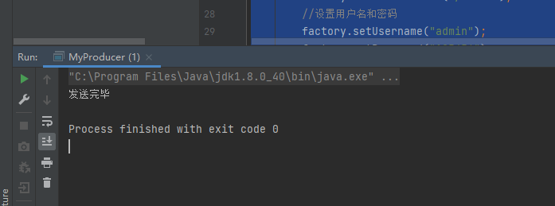
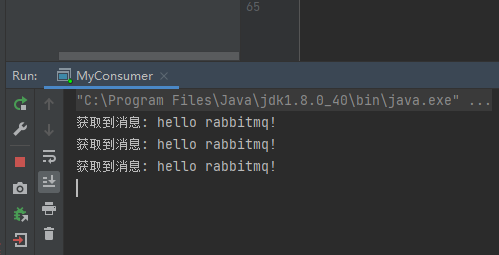
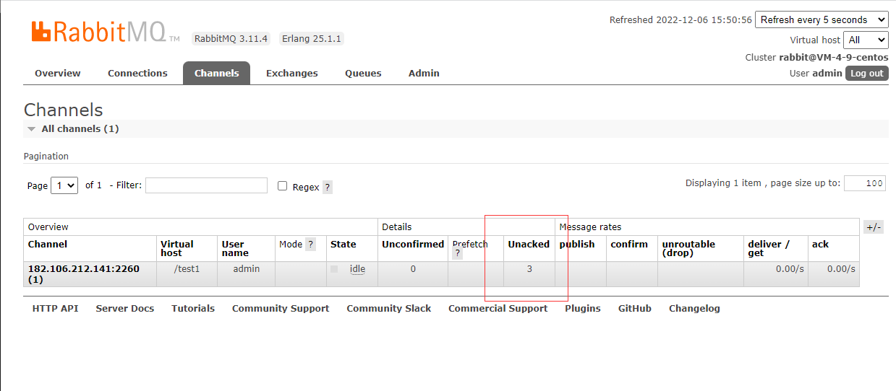
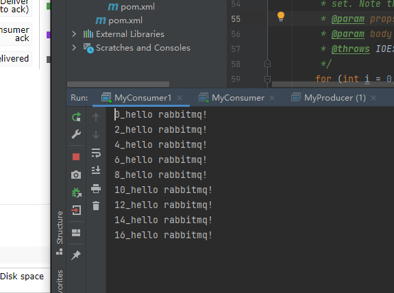
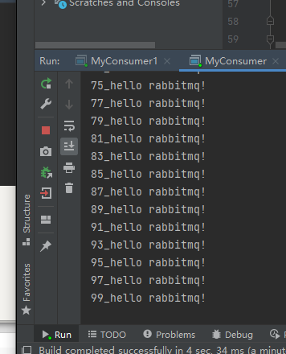
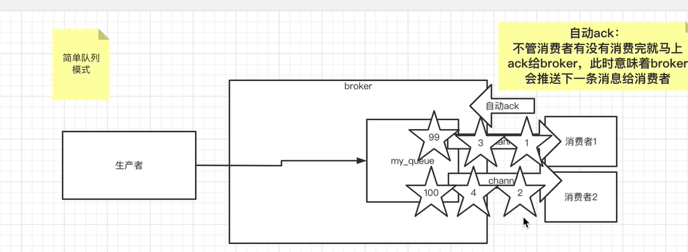
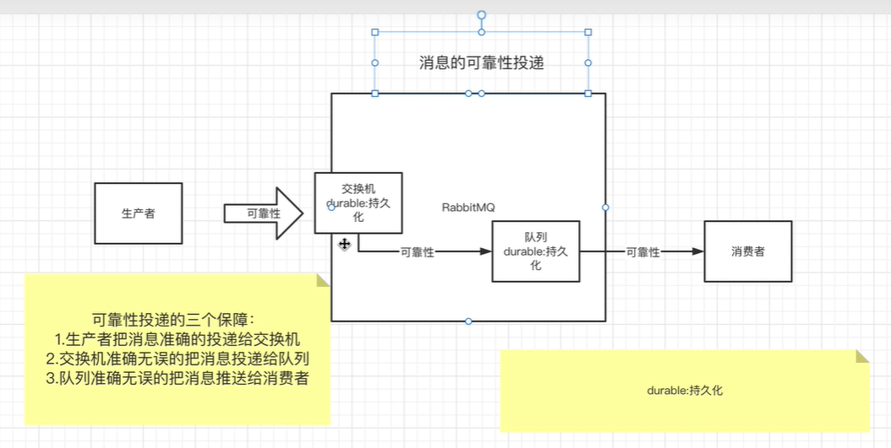
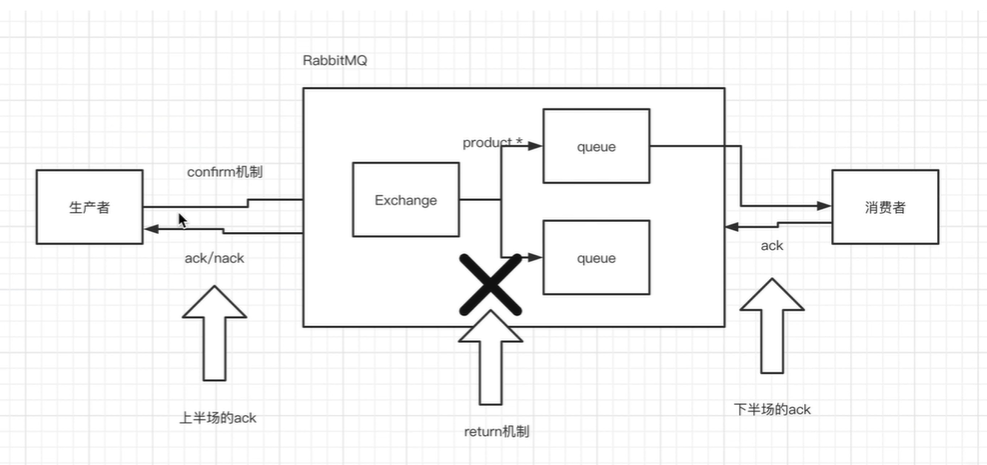
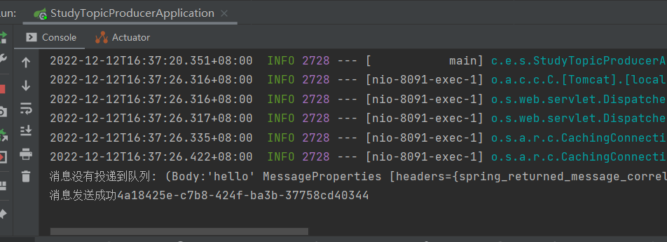

# 什么是消息队列

## 1.**消息队列的优点：**

（1）解耦：将系统按照不同的业务功能拆分出来，消息生产者只管把消息发布到 MQ 中而不用管谁来取，消息消费者只管从 MQ 中取消息而不管是谁发布的。消息生产者和消费者都不知道对方的存在；

（2）异步：主流程只需要完成业务的核心功能；对于业务非核心功能，将消息放入到消息队列之中进行异步处理，减少请求的等待，提高系统的总体性能；

（3）削峰/限流：将所有请求都写到消息队列中，消费服务器按照自身能够处理的请求数从队列中拿到请求，防止请求并发过高将系统搞崩溃；

## **2、消息队列的缺点：**

（1）系统的可用性降低：系统引用的外部依赖越多，越容易挂掉，如果MQ 服务器挂掉，那么可能会导致整套系统崩溃。

（2）系统复杂度提高：加入消息队列之后，需要保证消息没有重复消费、如何处理消息丢失的情况、如何保证消息传递的有序性等问题；

（3）数据一致性问题：A 系统处理完了直接返回成功了，使用者都以为你这个请求就成功了；但是问题是，要是 BCD 三个系统那里，BD 两个系统写库成功了，结果 C 系统写库失败了，就会导致数据不一致了

# RabbitMQ的构造：

RabbitMQ 是 AMQP 协议的一个开源实现，所以其内部实际上也是 AMQP 中的基本概念：


- （1）生产者Publisher：生产消息，就是投递消息的一方。消息一般包含两个部分：消息体（payload）和标签（Label）
- （2）消费者Consumer：消费消息，也就是接收消息的一方。消费者连接到RabbitMQ服务器，并订阅到队列上。消费消息时只消费消息体，丢弃标签。
- （3）Broker服务节点：表示消息队列服务器实体。一般情况下一个Broker可以看做一个RabbitMQ服务器。
- （4）Queue：消息队列，用来存放消息。一个消息可投入一个或多个队列，多个消费者可以订阅同一队列，这时队列中的消息会被平摊（轮询）给多个消费者进行处理。
- （5）Exchange：交换器，接受生产者发送的消息，根据路由键将消息路由到绑定的队列上。
- （6）Routing Key： 路由关键字，用于指定这个消息的路由规则，需要与交换器类型和绑定键(Binding Key)联合使用才能最终生效。
- （7）Binding：绑定，通过绑定将交换器和队列关联起来，一般会指定一个BindingKey，通过BindingKey，交换器就知道将消息路由给哪个队列了。
- （8）Connection ：网络连接，比如一个TCP连接，用于连接到具体broker
- （9）Channel： 信道，AMQP 命令都是在信道中进行的，不管是发布消息、订阅队列还是接收消息，这些动作都是通过信道完成。因为建立和销毁 TCP 都是非常昂贵的开销，所以引入了信道的概念，以复用一条 TCP 连接，一个TCP连接可以用多个信道。客户端可以建立多个channel，每个channel表示一个会话任务。
- （10）Message：消息，由消息头和消息体组成。消息体是不透明的，而消息头则由一系列的可选属性组成，这些属性包括routing-key（路由键）、priority（相对于其他消息的优先权）、delivery-mode（指出该消息可能需要持久性存储）等。
- （11）Virtual host：虚拟主机，用于逻辑隔离，表示一批独立的交换器、消息队列和相关对象。一个Virtual host可以有若干个Exchange和Queue，同一个Virtual host不能有同名的Exchange或Queue。最重要的是，其拥有独立的权限系统，可以做到 vhost 范围的用户控制。当然，从 RabbitMQ 的全局角度，vhost 可以作为不同权限隔离的手段


# Exchange交换器的类型：

Exchange分发消息时根据类型的不同分发策略有区别，目前共四种类型：direct、fanout、topic、headers

（1）direct：消息中的路由键（RoutingKey）如果和 Bingding 中的 bindingKey 完全匹配，交换器就将消息发到对应的队列中。是基于完全匹配、单播的模式。

（2）fanout：把所有发送到fanout交换器的消息路由到所有绑定该交换器的队列中，fanout 类型转发消息是最快的。

（3）topic：通过模式匹配的方式对消息进行路由，将路由键和某个模式进行匹配，此时队列需要绑定到一个模式上。

```txt
匹配规则：
① RoutingKey 和 BindingKey 为一个 点号 '.' 分隔的字符串。 比如: java.xiaoka.show
② BindingKey可使用 * 和 # 用于做模糊匹配：*匹配一个单词，#匹配多个或者0个单词
```

（4）headers：不依赖于路由键进行匹配，是根据发送消息内容中的headers属性进行匹配，除此之外 headers 交换器和 direct 交换器完全一致，但性能差很多，目前几乎用不到了

# 生产者消息的过程：

- （1）Producer 先连接到 Broker，建立连接 Connection，开启一个信道 channel
- （2）Producer 声明一个交换器并设置好相关属性
- （3）Producer 声明一个队列并设置好相关属性
- （4）Producer 通过绑定键将交换器和队列绑定起来
- （5）Producer 发送消息到 Broker，其中包含路由键、交换器等信息
- （6）交换器根据接收到的路由键查找匹配的队列
- （7）如果找到，将消息存入对应的队列，如果没有找到，会根据生产者的配置丢弃或者退回给生产者。
- （8）关闭信道


# 消费者接收消息过程：

- （1）Producer 先连接到 Broker，建立连接 Connection，开启一个信道 channel
- （2）向 Broker 请求消费相应队列中消息，可能会设置响应的回调函数。
- （3）等待 Broker 回应并投递相应队列中的消息，接收消息。
- （4）消费者确认收到的消息，ack。
- （5）RabbitMQ从队列中删除已经确定的消息。
- （6）关闭信道


# 如何保证消息不被重复消费？

正常情况下，消费者在消费消息后，会给消息队列发送一个确认，消息队列接收后就知道消息已经被成功消费了，然后就从队列中删除该消息，也就不会将该消息再发送给其他消费者了。不同消息队列发出的确认消息形式不同，RabbitMQ是通过发送一个ACK确认消息。但是因为网络故障，消费者发出的确认并没有传到消息队列，导致消息队列不知道该消息已经被消费，然后就再次消息发送给了其他消费者，从而造成重复消费的情况。

重复消费问题的解决思路是：保证消息的唯一性，即使多次传输，也不让消息的多次消费带来影响，也就是保证消息等幂性；幂等性指一个操作执行任意多次所产生的影响均与一次执行的影响相同。具体解决方案如下：

（1）改造业务逻辑，使得在重复消费时也不影响最终的结果。例如对SQL语句： update t1 set money = 150 where id = 1 and money = 100; 做了个前置条件判断，即 money = 100 的情况下才会做更新，更通用的是做个 version 即版本号控制，对比消息中的版本号和数据库中的版本号。

（2）基于数据库的的唯一主键进行约束。消费完消息之后，到数据库中做一个 insert 操作，如果出现重复消费的情况，就会导致主键冲突，避免数据库出现脏数据。

（3）通过记录关键的key，当重复消息过来时，先判断下这个key是否已经被处理过了，如果没处理再进行下一步。


# **如何保证消息不丢失，进行可靠性传输？**

对于消息的可靠性传输，每种MQ都要从三个角度来分析：生产者丢数据、消息队列丢数据、消费者丢数据。以RabbitMQ为例：

## **1、生产者丢数据：**

RabbitMQ提供事务机制（transaction）和确认机制（confirm）两种模式来确保生产者不丢消息。

### （1）事务机制：

​    发送消息前，开启事务（channel.txSelect()），然后发送消息，如果发送过程中出现什么异常，事务就会回滚（channel.txRollback()），如果发送成功则提交事务（channel.txCommit()）

​    该方式的缺点是生产者发送消息会同步阻塞等待发送结果是成功还是失败，导致生产者发送消息的吞吐量降下降。

```java
    // 开启事务
    channel.txSelect
    try {
        // 发送消息
    } catch(Exception e){
        // 回滚事务
        channel.txRollback;
        //再次重试发送这条消息
        ....
    }      
    //提交事务
    channel.txCommit;
```

### （2）确认机制：

生产环境常用的是confirm模式。生产者将信道 channel 设置成 confirm 模式，一旦 channel 进入 confirm 模式，所有在该信道上发布的消息都将会被指派一个唯一的ID，一旦消息被投递到所有匹配的队列之后，rabbitMQ就会发送一个确认给生产者（包含消息的唯一ID），这样生产者就知道消息已经正确到达目的队列了。如果rabbitMQ没能处理该消息，也会发送一个Nack消息给你，这时就可以进行重试操作。

​    Confirm模式最大的好处在于它是异步的，一旦发布消息，生产者就可以在等信道返回确认的同时继续发送下一条消息，当消息最终得到确认之后，生产者便可以通过回调方法来处理该确认消息。


## **2、消息队列丢数据：**

 处理消息队列丢数据的情况，一般是开启持久化磁盘。持久化配置可以和生产者的 confirm 机制配合使用，在消息持久化磁盘后，再给生产者发送一个Ack信号。这样的话，如果消息持久化磁盘之前，即使 RabbitMQ 挂掉了，生产者也会因为收不到Ack信号而再次重发消息。

```txt
持久化设置如下（必须同时设置以下 2 个配置）：

（1）创建queue的时候，将queue的持久化标志durable在设置为true，代表是一个持久的队列，这样就可以保证 rabbitmq 持久化 queue 的元数据，但是不会持久化queue里的数据；
（2）发送消息的时候将 deliveryMode 设置为 2，将消息设置为持久化的，此时 RabbitMQ 就会将消息持久化到磁盘上去。
```

这样设置以后，RabbitMQ 就算挂了，重启后也能恢复数据。在消息还没有持久化到硬盘时，可能服务已经死掉，这种情况可以通过引入镜像队列，但也不能保证消息百分百不丢失（整个集群都挂掉）


## **3、消费者丢数据：**


消费者丢数据一般是因为采用了自动确认消息模式。该模式下，虽然消息还在处理中，但是消费中者会自动发送一个确认，通知 RabbitMQ 已经收到消息了，这时 RabbitMQ 就会立即将消息删除。这种情况下，如果消费者出现异常而未能处理消息，那就会丢失该消息。

​    解决方案就是采用手动确认消息，设置 autoAck = False，等到消息被真正消费之后，再手动发送一个确认信号，即使中途消息没处理完，但是服务器宕机了，那 RabbitMQ 就收不到发的ack，然后 RabbitMQ 就会将这条消息重新分配给其他的消费者去处理。

​    但是 RabbitMQ 并没有使用超时机制，RabbitMQ 仅通过与消费者的连接来确认是否需要重新发送消息，也就是说，只要连接不中断，RabbitMQ 会给消费者足够长的时间来处理消息。另外，采用手动确认消息的方式，我们也需要考虑一下几种特殊情况：

- 如果消费者接收到消息，在确认之前断开了连接或取消订阅，RabbitMQ 会认为消息没有被消费，然后重新分发给下一个订阅的消费者，所以存在消息重复消费的隐患
- 如果消费者接收到消息却没有确认消息，连接也未断开，则RabbitMQ认为该消费者繁忙，将不会给该消费者分发更多的消息


# 如何保证消息的有序性？

针对保证消息有序性的问题，解决方法就是保证生产者入队的顺序是有序的，出队后的顺序消费则交给消费者去保证。

（1）方法一：拆分queue，使得一个queue只对应一个消费者。由于MQ一般都能保证内部队列是先进先出的，所以把需要保持先后顺序的一组消息使用某种算法都分配到同一个消息队列中。然后只用一个消费者单线程去消费该队列，这样就能保证消费者是按照顺序进行消费的了。但是消费者的吞吐量会出现瓶颈。如果多个消费者同时消费一个队列，还是可能会出现顺序错乱的情况，这就相当于是多线程消费了


（2）方法二：对于多线程的消费同一个队列的情况，可以使用重试机制：比如有一个微博业务场景的操作，发微博、写评论、删除微博，这三个异步操作。如果一个消费者先执行了写评论的操作，但是这时微博都还没发，写评论一定是失败的，等一段时间。等另一个消费者，先执行发微博的操作后，再执行，就可以成功。


# 如何处理消息堆积情况?

场景题：几千万条数据在MQ里积压了七八个小时。

**9.1、出现该问题的原因：**

消息堆积往往是生产者的生产速度与消费者的消费速度不匹配导致的。有可能就是消费者消费能力弱，渐渐地消息就积压了，也有可能是因为消息消费失败反复复重试造成的，也有可能是消费端出了问题，导致不消费了或者消费极其慢。比如，消费端每次消费之后要写mysql，结果mysql挂了，消费端hang住了不动了，或者消费者本地依赖的一个东西挂了，导致消费者挂了。

所以如果是 bug 则处理 bug；如果是因为本身消费能力较弱，则优化消费逻辑，比如优化前是一条一条消息消费处理的，那么就可以批量处理进行优化。

**9.2、临时扩容，快速处理积压的消息：**

（1）先修复 consumer 的问题，确保其恢复消费速度，然后将现有的 consumer 都停掉；

（2）临时创建原先 N 倍数量的 queue ，然后写一个临时分发数据的消费者程序，将该程序部署上去消费队列中积压的数据，消费之后不做任何耗时处理，直接均匀轮询写入临时建立好的 N 倍数量的 queue 中；

（3）接着，临时征用 N 倍的机器来部署 consumer，每个 consumer 消费一个临时 queue 的数据

（4）等快速消费完积压数据之后，恢复原先部署架构 ，重新用原先的 consumer 机器消费消息。

这种做法相当于临时将 queue 资源和 consumer 资源扩大 N 倍，以正常 N 倍速度消费。

**9.3、恢复队列中丢失的数据：**

如果使用的是 rabbitMQ，并且设置了过期时间，消息在 queue 里积压超过一定的时间会被 rabbitmq 清理掉，导致数据丢失。这种情况下，实际上队列中没有什么消息挤压，而是丢了大量的消息。所以就不能说增加 consumer 消费积压的数据了，这种情况可以采取 “批量重导” 的方案来进行解决。在流量低峰期，写一个程序，手动去查询丢失的那部分数据，然后将消息重新发送到mq里面，把丢失的数据重新补回来。

**9.4、MQ长时间未处理导致MQ写满的情况如何处理：**

如果消息积压在MQ里，并且长时间都没处理掉，导致MQ都快写满了，这种情况肯定是临时扩容方案执行太慢，这种时候只好采用 “丢弃+批量重导” 的方式来解决了。首先，临时写个程序，连接到mq里面消费数据，消费一个丢弃一个，快速消费掉积压的消息，降低MQ的压力，然后在流量低峰期时去手动查询重导丢失的这部分数据。


# MQ安装及其使用


## 安装

https://blog.csdn.net/limingqiang007/article/details/126486368


开机自启动:https://blog.csdn.net/weixin_42166515/article/details/125529010


按i编辑,esc退出编辑,:wq保存


## 使用

因为是centos8,开启命令与centos不同

开启:systemctl start rabbitmq-server

停止:systemctl stop rabbitmq-server

重启:systemctl restart rabbitmq-server

状态:systemctl status rabbitmq-server.service

查看进程:ps -ef | grep rabbitmq

查看占用的端口:

```txt
lsof -i | grep rabbit
# 或者
netstat -tunlp | grep rabbitmq
```

启用网页管理:

```txt
rabbitmq-plugins enable rabbitmq_management
```

## 3.问题

### 1.外网访问不了

内网能访问,外网访问不了,大概率是服务器的防火墙问题

关闭防火墙

https://blog.csdn.net/qq_33468857/article/details/124588889

*Centos8关闭防火墙*

systemctl status firewalld.service（查看防火墙状态）

active表示当前防火墙处于开启状态 inactive表示关闭状态

systemctl stop firewalld.service （关闭防火墙）

systemctl start firewalld.service （开启防火墙）

systemctl disable firewalld.service （禁止防火墙自启动）

systemctl enable firewalld.service （防火墙随系统开启启动）


开启端口

https://blog.csdn.net/weixin_42362496/article/details/103383501

1.使用命令 firewall-cmd --state查看防火墙状态。得到结果是running或者not running

2.在running 状态下，向firewall 添加需要开放的端口
命令为 firewall-cmd --permanent --zone=public --add-port=8080/tcp //永久的添加该端口。去掉–permanent则表示临时。

4.firewall-cmd --reload //加载配置，使得修改有效。

5.使用命令 firewall-cmd --permanent --zone=public --list-ports //查看开启的端口，出现8080/tcp这开启正确

6.再次使用外部浏览器访问，这出现tomcat的欢迎界面。


# MQ学习代码

## 0.新建项目

新建空白module -- rabbitmq,并删掉src文件夹

在rabbitmq下面在新建一个module-- mode1-helloworld,为模式1


在mode1-helloworld下面再新建一个module-- producer,为简单队列模式的生产者


## 1.六种模式

https://rabbitmq.com/getstarted.html


## 2.Hello World模式-简单队列模式

https://rabbitmq.com/tutorials/tutorial-one-java.html

![(P) -> [|||] -> (C)](https://rabbitmq.com/img/tutorials/python-one.png)


### 1.引入依赖

```xml
        <dependency>
            <groupId>com.rabbitmq</groupId>
            <artifactId>amqp-client</artifactId>
            <version>5.10.0</version>
        </dependency>
```

### 2.编写生产者


```java
package producer;

import com.rabbitmq.client.Channel;
import com.rabbitmq.client.Connection;
import com.rabbitmq.client.ConnectionFactory;

import java.io.IOException;
import java.nio.charset.StandardCharsets;
import java.util.concurrent.TimeoutException;

/**
 * @author HuaRunSheng
 * @date 2022/12/6 14:22
 * @description :hello world队列模式(简单队列模式的生产者)
 */
public class MyProducer {
    public static  final String QUEUE_NAME="my_queue";
    public static void main(String[] args) throws IOException, TimeoutException {

        //1.获取连接工厂
        ConnectionFactory factory = new ConnectionFactory();
        //设置服务器ip地址
        factory.setHost("1.15.155.85");
        //设置端口号
        factory.setPort(5672);
        //设置虚拟机
        factory.setVirtualHost("/test1");
        //设置用户名和密码
        factory.setUsername("admin");
        factory.setPassword("123456");

        //2.从连接工厂获得连接对象
        Connection connection = factory.newConnection();
        //3.获得Channel,用于之后的发送消息的对象
        Channel channel = connection.createChannel();
        //4.声明队列(如果队列不存在则创建队列,如果队列存在则使用队列)
        /**
         * queue: 队列的成名 the name of the queue
         * durable: 是否持久化,即存储到硬盘 true if we are declaring a durable queue
         * exclusive: 是否独占: 是否只给当前客户端来使用
         * autoDelete: 是否自动删除
         * arguments: 用于描述队列的其他数据
         */
        channel.queueDeclare(QUEUE_NAME, false, false, false, null);
        //5.发送消息
        StringBuilder message=new StringBuilder("hello rabbitmq!");
        //6.发送消息
        /**
         * Publish a message.
         * @param exchange-交换机,HelloWorld模式交换机为空字符串"",不能是null the exchange to publish the message to
         * @param routingKey:路由键 当exchange是空的时候,此时routingkey==队列的名称 the routing key
         * @param mandatory 强制的 true if the 'mandatory' flag is to be set
         * @param immediate true if the 'immediate' flag is to be
         * set. Note that the RabbitMQ server does not support this flag.
         * @param props other properties for the message - routing headers etc
         * @param body the message body
         * @throws IOException if an error is encountered
         */
        channel.basicPublish("", QUEUE_NAME,null,message.toString().getBytes(StandardCharsets.UTF_8));
        System.out.println("发送完毕");
        //7.断开连接
        channel.close();
        connection.close();

    }
}

```

发送了三次:




由图可知,共有三条消息为消费


### 3.编写消费者


```java
package com.qf.consumer;

import com.rabbitmq.client.*;

import java.io.IOException;
import java.util.concurrent.TimeoutException;

/**
 * @author HuaRunSheng
 * @date 2022/12/6 15:29
 * @description :简单工厂模式消费者
 */
public class MyConsumer {
    public static  final String QUEUE_NAME="my_queue";

    public static void main(String[] args) throws IOException, TimeoutException {
        //1.获取连接工厂
        ConnectionFactory factory = new ConnectionFactory();
        //设置服务器ip地址
        factory.setHost("1.15.155.85");
        //设置端口号
        factory.setPort(5672);
        //设置虚拟机
        factory.setVirtualHost("/test1");
        //设置用户名和密码
        factory.setUsername("admin");
        factory.setPassword("123456");

        //2.从连接工厂获得连接对象
        Connection connection = factory.newConnection();
        //3.获得Channel
        Channel channel=connection.createChannel();
        //4.创建一个Consumer对象,指明具体处理消息的程序
        Consumer consumer = new DefaultConsumer(channel){
            //具体处理消息

            /**
             * @param consumerTag the <i>consumer tag</i> associated with the consumer
             * @param envelope packaging data for the message
             * @param properties content header data for the message
             * @param body:消息本体 the message body (opaque, client-specific byte array)
             * @throws IOException
             */
            @Override
            public void handleDelivery(String consumerTag,
                                       Envelope envelope,
                                       AMQP.BasicProperties properties,
                                       byte[] body) throws IOException {
                System.out.println("获取到消息: " + new String(body));
            }
        };


        /*5.设置消费者监听某个队列
         * @param queue:指定监听的队列 the name of the queue
         * @param autoAck:是否自动签收,默认不签收 true if the server should consider messages
         * acknowledged once delivered; false if the server should expect
         * explicit acknowledgements
         * @param consumer:消费者处理方法 
         */
        
        channel.basicConsume(QUEUE_NAME, consumer);
    }
}

```

消费者可以不关闭,有消息时消费,没有消息时等待

消费者处理消息的方法要重写

```java
 //4.创建一个Consumer对象,指明具体处理消息的程序
        Consumer consumer = new DefaultConsumer(channel){
            //具体处理消息

            /**
             * @param consumerTag the <i>consumer tag</i> associated with the consumer
             * @param envelope packaging data for the message
             * @param properties content header data for the message
             * @param body:消息本体 the message body (opaque, client-specific byte array)
             * @throws IOException
             */
            @Override
            public void handleDelivery(String consumerTag,
                                       Envelope envelope,
                                       AMQP.BasicProperties properties,
                                       byte[] body) throws IOException {
                System.out.println("获取到消息: " + new String(body));
            }
        };
```

消费者不自动签收消息,如这里消息都处理完了




但是还有三个消息未签收,未签收的消息可以再次处理




开启自动签收:

```java
channel.basicConsume(QUEUE_NAME, true, consumer);
```


也可以用表达式方式进行消费

```java
        //方式二, 用表达式方式
        DeliverCallback deliverCallback=((consumerTag, message) -> {
            //处理消息内容
            System.out.println(new String(message.getBody()));
        });
        channel.basicConsume(QUEUE_NAME, true, deliverCallback,consumerTag -> {});
```

### 4.简单队列模式的问题

当多个消费者消费同⼀个队列时。这个时候rabbitmq的公平调度机制就开启了，于是，⽆论消费者的消费能⼒如何，每个消费者都能公平均分到相同数量的消息，⽽不能出现能者多劳的情况。  

如图:consumer1还在慢慢消费,而consumer已经消费完了







因为简单队列模式采用自动签收,一有消息送过来就签收,即使没处理完,采用先签收再处理方式




## 3.工作者模式

即能者多劳模式,将自动签收改为手动签收即可

消费者代码

```java
      
        //声明一次只接受一条消息
        channel.basicQos(1);//方式二, 用表达式方式
        DeliverCallback deliverCallback=((consumerTag, message) -> {
            try {
                Thread.sleep(300);
            } catch (InterruptedException e) {
                e.printStackTrace();
            }
            //处理消息内容
            System.out.println(new String(message.getBody()));
            //手动ack,消息的ID:message.getEnvelope().getDeliveryTag(),是否要批量签收,一次处理多条消息可以设置未true
            channel.basicAck(message.getEnvelope().getDeliveryTag(), false);
        });
        //不自动签收
        channel.basicConsume(QUEUE_NAME, false, deliverCallback,consumerTag -> {});
```


```java
package mode2_work.consumer;

import com.rabbitmq.client.Channel;
import com.rabbitmq.client.Connection;
import com.rabbitmq.client.ConnectionFactory;
import com.rabbitmq.client.DeliverCallback;

import java.io.IOException;
import java.util.concurrent.TimeoutException;

/**
 * @author HuaRunSheng
 * @date 2022/12/6 20:02
 * @description :
 */
public class WorkConsumer {
    public static  final String QUEUE_NAME="my_work_queue";

    public static void main(String[] args) throws IOException, TimeoutException {
        //1.获取连接工厂
        ConnectionFactory factory = new ConnectionFactory();
        //设置服务器ip地址
        factory.setHost("1.15.155.85");
        //设置端口号
        factory.setPort(5672);
        //设置虚拟机
        factory.setVirtualHost("/test1");
        //设置用户名和密码
        factory.setUsername("admin");
        factory.setPassword("123456");

        //2.从连接工厂获得连接对象
        Connection connection = factory.newConnection();
        //3.获得Channel
        Channel channel=connection.createChannel();
        //声明一次只接受一条消息
        channel.basicQos(1);


        //方式二, 用表达式方式
        DeliverCallback deliverCallback=((consumerTag, message) -> {
            try {
                Thread.sleep(300);
            } catch (InterruptedException e) {
                e.printStackTrace();
            }
            //处理消息内容
            System.out.println(new String(message.getBody()));
            //手动ack,消息的ID:message.getEnvelope().getDeliveryTag(),是否要批量签收,一次处理多条消息可以设置未true
            channel.basicAck(message.getEnvelope().getDeliveryTag(), false);
        });
        //不自动签收
        channel.basicConsume(QUEUE_NAME, false, deliverCallback,consumerTag -> {});
    }
}

```


## 4.发布订阅者模式

对于之前的队列模式，是没有办法解决⼀条消息同时被多个消费者消费。于是使⽤发布订阅模式来实现。  

即只要订阅了某个交换机,就能接收到交换机里的所有消息.相当与订报纸一样,而且队列名称唯一,如果多个程序使用同一个队列名,会按简单队列处理.所以**要想每个程序都收到所有消息,队列名要一样**

创建交换机时,交换机类型设置为fanout模式


## 5.路由模式

在发布订阅者模式上增加了routingkey,指定消费者订阅

交换机的类型为direct

生产者

```java
package mode4_routing;

import com.rabbitmq.client.Channel;
import com.rabbitmq.client.Connection;
import util.RabbitUtil;

import java.io.IOException;
import java.nio.charset.StandardCharsets;
import java.util.concurrent.TimeoutException;

/**
 * @author HuaRunSheng
 * @date 2022/12/8 11:02
 * @description :路由模式的生产者
 * 交换机为direct
 * 且有路由
 */
public class MyProducer {
    private static final String EXCHANGE_NAME="my_route_exchange";
    private static final String ROUTING_KEY="apple";
    public static void main(String[] args) throws IOException, TimeoutException {
        //1.获得connection和channel
        Connection connection = RabbitUtil.getConnection();
        Channel channel = connection.createChannel();
        // 声明交换机为路由模式
        channel.exchangeDeclare(EXCHANGE_NAME, "direct");
        for (int i=0;i<10;i++) {
            //3.发送消息
            String message = "apple_message";
            channel.basicPublish(EXCHANGE_NAME, ROUTING_KEY, null, message.getBytes(StandardCharsets.UTF_8));
        }

        //关闭连接
        channel.close();
        connection.close();
    }
}

```


消费者0:

```java
package mode4_routing;

import com.rabbitmq.client.*;
import util.RabbitUtil;

import java.io.IOException;
import java.nio.charset.StandardCharsets;
import java.util.concurrent.TimeoutException;

/**
 * @author HuaRunSheng
 * @date 2022/12/8 13:10
 * @description :
 */
public class MyConsumer {
    private static final String EXCHANGE_NAME="my_route_exchange";
    private static final String ROUTING_KEY="apple";
    private static final String QUEUE_NAME="route_queue0";
    public static void main(String[] args) throws IOException, TimeoutException {
        //1.获得connection和channel
        Connection connection = RabbitUtil.getConnection();
        Channel channel = connection.createChannel();
        // 声明交换机为路由模式,与生产者一样
        channel.exchangeDeclare(EXCHANGE_NAME, "direct");
        //声明队列
        channel.queueBind(QUEUE_NAME, EXCHANGE_NAME, ROUTING_KEY);
        //创建消费者
        Consumer consumer=new DefaultConsumer(channel){
            @Override
            public void handleDelivery(String consumerTag, Envelope envelope, AMQP.BasicProperties properties, byte[] body) throws IOException {
                System.out.println("consumer0: "+new String(body));
            }
        };
        //6.消费者监听队列
        channel.basicConsume(QUEUE_NAME, consumer);


    }
}

```


消费者1:

```java
package mode4_routing;

import com.rabbitmq.client.*;
import util.RabbitUtil;

import java.io.IOException;
import java.util.concurrent.TimeoutException;

/**
 * @author HuaRunSheng
 * @date 2022/12/8 13:20
 * @description :
 */
public class MyConsumer1 {
    private static final String EXCHANGE_NAME="my_route_exchange";
    // 路由决定了能否订阅到消息,生产者指定路由为apple
    private static final String ROUTING_KEY="orange";
    private static final String QUEUE_NAME="route_queue1";
    public static void main(String[] args) throws IOException, TimeoutException {
        //1.获得connection和channel
        Connection connection = RabbitUtil.getConnection();
        Channel channel = connection.createChannel();
        // 声明交换机为路由模式,与生产者一样
        channel.exchangeDeclare(EXCHANGE_NAME, "direct");
        //声明队列
        channel.queueBind(QUEUE_NAME, EXCHANGE_NAME, ROUTING_KEY);
        //创建消费者
        Consumer consumer=new DefaultConsumer(channel){
            @Override
            public void handleDelivery(String consumerTag, Envelope envelope, AMQP.BasicProperties properties, byte[] body) throws IOException {
                System.out.println("consumer1: "+new String(body));
            }
        };
        //6.消费者监听队列
        channel.basicConsume(QUEUE_NAME, consumer);


    }
}

```

## 6.topic模式

在路由的模式上,增加了正则匹配路由

在routing模式的基础上，对routing-key使⽤了通配符，提⾼了匹配的范围，增加了可玩性。  

```txt
- *.orange.*
- *.*.rabbit 只⽀持单层级
- lazy.# 可以⽀持多层级的routing-key
```

绑定关系中如果使⽤了product.* ,那么在发送消息时：

```txt
product ok
product.add ok
product.del ok
product.add.one 不ok  
```

绑定关系中如果使⽤了product.#,那么在发送消息时：

```txt
product ok
product.add ok
product.add.one ok  
```


 注意:routekey避免使用user.xx,会使匹配无效

F:\Java\rabbitmq\src\main\java\mode5_topic

producer代码:

```java
package mode5_topic;

import com.rabbitmq.client.Channel;
import com.rabbitmq.client.Connection;
import util.RabbitUtil;

import java.io.IOException;
import java.nio.charset.StandardCharsets;
import java.util.concurrent.TimeoutException;

/**
 * @author HuaRunSheng
 * @date 2022/12/8 13:38
 * @description :
 */
public class MyProducer {
    //定义交换机名称
    private static final String EXCHANGE_NAME="topic_exchange1";
    //ROUTING_KEYS不能是user.... 尽量不免user作为开头
    private static final String[] ROUTING_KEYS={"product.add", "product.add.tom", "product.delete", "product.delete.tom"};

    public static void main(String[] args) throws IOException, TimeoutException {
        Connection connection = RabbitUtil.getConnection();
        Channel channel = connection.createChannel();
        //1.声明交换机
        channel.exchangeDeclare(EXCHANGE_NAME, "topic", true);
        for (int i = 0; i < 10; i++) {
            String message="test"+i+"_"+ROUTING_KEYS[i%4];
            //2.发送消息
            channel.basicPublish(EXCHANGE_NAME, ROUTING_KEYS[i%4], null, message.getBytes(StandardCharsets.UTF_8));
        }
        //3.关闭连接
        channel.close();
        connection.close();
    }
    
}

```

consumer 消费者:

```java
package mode5_topic;

import com.rabbitmq.client.*;
import util.RabbitUtil;

import java.io.IOException;
import java.util.concurrent.TimeoutException;

/**
 * @author HuaRunSheng
 * @date 2022/12/8 13:38
 * @description :
 */
public class MyConsumer {
    //定义交换机名称
    private static final String EXCHANGE_NAME="topic_exchange1";
    //定义交换机名称
    private static final String QUEUE_NAME="topic_queue";
    //定义user路由
    private static final String ROUTING_USER="product.#";
    //定义add和delete路由
    private static final String ROUTING_ADD_and_DELETE="product.*";
    //定义add.xxx路由
    private static final String ROUTING_ADD_XX="product.add.*";

    public static void main(String[] args) throws IOException, TimeoutException {
        Connection connection = RabbitUtil.getConnection();
        Channel channel = connection.createChannel();
        //声明交换机
        channel.exchangeDeclare(EXCHANGE_NAME, "topic", true);
        //1.声明队列
        channel.queueDeclare(QUEUE_NAME, false, false,false, null);
        //2.绑定队列
        //user.#: 所有user...的路由都能匹配
        //channel.queueBind(QUEUE_NAME, EXCHANGE_NAME, ROUTING_USER);
        //只能匹配user.add或user.delete
        //channel.queueBind(QUEUE_NAME, EXCHANGE_NAME, ROUTING_ADD_and_DELETE);
        //匹配user.add.xxx
        channel.queueBind(QUEUE_NAME, EXCHANGE_NAME, ROUTING_ADD_XX);
        //2.创建消费者
        Consumer consumer= new DefaultConsumer(channel){
            @Override
            public void handleDelivery(String consumerTag, Envelope envelope, AMQP.BasicProperties properties, byte[] body) throws IOException {
                System.out.println("consumer:"+new String(body));
            }
        };
        channel.basicConsume(QUEUE_NAME, true, consumer);
    }
}

```


## 7.手动ack

F:\Java\rabbitmq\src\main\java\acknack\MyConsumer1.java

没有ack,消息就还在队列里


```java
package acknack;

import com.rabbitmq.client.*;
import util.RabbitUtil;

import java.io.IOException;

/**
 * topic的消费者
 * @author Thor
 * @公众号 Java架构栈
 */
public class MyConsumer1 {
    //交换机的名称
    private static String EXCHANGE_NAME = "my_topic_exchange";
    //队列的名称
    private static String QUEUE_NAME = "my_topic_queue_1";

    public static void main(String[] args) throws Exception {
        Connection connection = RabbitUtil.getConnection();
        Channel channel = connection.createChannel();
        //声明交换机
        channel.exchangeDeclare(EXCHANGE_NAME,"topic",true);
        //声明队列
        channel.queueDeclare(QUEUE_NAME,false,false,false,null);
        //绑定
        channel.queueBind(QUEUE_NAME,EXCHANGE_NAME,"product.#");
        //创建消费者
        Consumer consumer = new DefaultConsumer(channel){
            @Override
            public void handleDelivery(String consumerTag, Envelope envelope, AMQP.BasicProperties properties, byte[] body) throws IOException {
                System.out.println("product.# 消费者："+new String(body));
                //手动ack
                //channel.basicAck(envelope.getDeliveryTag(),false);
                //nack
//                channel.basicNack(envelope.getDeliveryTag(),false,false);
                channel.basicReject(envelope.getDeliveryTag(), false);
            }

        };
        //让消费者监听队列
        channel.basicConsume(QUEUE_NAME,false,consumer);

    }

}

```


# SpringBoot代码

F:\Java\tools\MQ\RabbitMQ\qianfen\study

## 1.引入依赖

新建spring boot项目时,在消息那一栏,有自带的依赖可以选

```xml
				<dependency>
            <groupId>org.springframework.boot</groupId>
            <artifactId>spring-boot-starter-amqp</artifactId>
        </dependency>
        <dependency>
            <groupId>org.springframework.amqp</groupId>
            <artifactId>spring-rabbit-test</artifactId>
            <scope>test</scope>
        </dependency>
```


## 2.配置rabbitmq

```yaml
spring:
  rabbitmq:
    host: 1.15.155.85
    port: 5672
    username: admin
    password: 123456
    virtual-host: /test1
    # 关闭自动ack,设置成手动ack
    listener:
      simple:
        acknowledge-mode: manual
```

其中,如果是自动ack可以选择不写,如果手动ack就得加上


## 3.编写配置类

注意消费者和生产者的交换机要一致

### topic

topic 生产者配置类:

```java
package com.example.study_topic_producer.config;

import org.springframework.amqp.core.Queue;
import org.springframework.amqp.core.TopicExchange;
import org.springframework.context.annotation.Bean;
import org.springframework.context.annotation.Configuration;

/**
 * @author HuaRunSheng
 * @date 2022/12/8 20:15
 * @description :
 */
@Configuration
public class MyRabbitConfig {
    //topic模式: 交换机
    private static final String EXCHANGE_NAME="exchange_boot_topic";
    //声明交换机
    @Bean
    public TopicExchange exchange(){
        return new TopicExchange(EXCHANGE_NAME, true, false);
    }
}

```

topic 消费者配置类:

```java
package com.example.study_topic.config;

import org.springframework.amqp.core.Binding;
import org.springframework.amqp.core.BindingBuilder;
import org.springframework.amqp.core.Queue;
import org.springframework.amqp.core.TopicExchange;
import org.springframework.context.annotation.Bean;
import org.springframework.context.annotation.Configuration;

/**
 * @author HuaRunSheng
 * @date 2022/12/8 20:02
 * @description :
 */
@Configuration
public class MyRabbitConfig {
    //topic模式: 队列, 交换机, 绑定关系
    private static final String QUEUE_NAME="queue_boot_topic";
    private static final String EXCHANGE_NAME="exchange_boot_topic";
    //声明队列
    @Bean
    public Queue queue(){
        return new Queue(QUEUE_NAME, true, false,false);
    }
    //声明交换机
    @Bean
    public TopicExchange exchange(){
        return new TopicExchange(EXCHANGE_NAME, true, false);
    }
    //声明绑定关系,routingKey为producer.*
    @Bean
    public Binding queueBinding(Queue queue, TopicExchange exchange){
        return BindingBuilder.bind(queue).to(exchange).with("producer.*");
    }
}

```

### route

route消费者配置类:

把TopicExchange交换机换成DirectExchange

绑定时,路由为空即可return BindingBuilder.bind(queue).to(exchange).with("");


### fanout

消费者配置类

```java
package com.example.study_221208.config;

import org.springframework.amqp.core.Binding;
import org.springframework.amqp.core.BindingBuilder;
import org.springframework.amqp.core.FanoutExchange;
import org.springframework.amqp.core.Queue;
import org.springframework.context.annotation.Bean;
import org.springframework.context.annotation.Configuration;

/**
 * @author HuaRunSheng
 * @date 2022/12/8 19:07
 * @description :
 */
@Configuration
public class MyRabbitConfig {
    private static String EXCHANGE_NAME = "exchange_boot_221208";
    private static String QUEUE_NAME = "queue_boot_fanout";

    /**
     * 返回一个发布订阅者模式的交换机
     * @return
     */
    @Bean
    public FanoutExchange exchange(){
        return new FanoutExchange(EXCHANGE_NAME, true, false);
    }

    /**
     * 声明队列
     * @return
     */
    @Bean
    public Queue queue(){
        return new Queue(QUEUE_NAME, true, false, false);
    }

    /**
     * 声明绑定关系
     * @param queue
     * @param exchange
     * @return
     */
    @Bean
    public Binding queueBinding(Queue queue, FanoutExchange exchange){
        return BindingBuilder.bind(queue).to(exchange);
    }
}

```

生产者配置类

```java
package com.example.study_221208_producer.config;

import org.springframework.amqp.core.FanoutExchange;
import org.springframework.context.annotation.Bean;
import org.springframework.context.annotation.Configuration;

/**
 * @author HuaRunSheng
 * @date 2022/12/8 19:44
 * @description : 发送消息代码在测试那
 */
@Configuration
public class MyRabbitConfig {
    private static String EXCHANGE_NAME = "exchange_boot_221208";
    /**
     * 返回一个发布订阅者模式的交换机
     * @return
     */
    @Bean
    public FanoutExchange exchange(){
        return new FanoutExchange(EXCHANGE_NAME, true, false);
    }
}

```

## 4.发送消息

如topic下发送消息,如果fanout下就不需要路由

```
@Resource
private RabbitTemplate rabbitTemplate;
@Test
void contextLoads() {
    String message="topic message!!";
    rabbitTemplate.convertAndSend("exchange_boot_topic", "producer.add", message);
}
```

## 5.接收消息

自动ack

```java
package com.example.study_topic;

import org.springframework.amqp.core.Message;
import org.springframework.amqp.rabbit.annotation.RabbitListener;
import org.springframework.stereotype.Component;

/**
 * @author HuaRunSheng
 * @date 2022/12/8 20:11
 * @description :
 */
@Component
public class MyConsumer {
    @RabbitListener(queues="queue_boot_topic")
    public void process(Message message){
        byte[] body = message.getBody();
        System.out.println("接收到消息: "+new String(body));
    }
}

```


手动ack

```java
package com.example.study_topic;

import com.rabbitmq.client.Channel;
import org.springframework.amqp.core.Message;
import org.springframework.amqp.rabbit.annotation.RabbitListener;
import org.springframework.stereotype.Component;

import java.io.IOException;

/**
 * @author HuaRunSheng
 * @date 2022/12/8 20:11
 * @description :
 */
@Component
public class MyConsumer {
    @RabbitListener(queues="queue_boot_topic")
    public void process(Message message, Channel channel) throws IOException {
        byte[] body = message.getBody();
        System.out.println("接收到消息: "+new String(body));
        // 手动ack
        channel.basicAck(message.getMessageProperties().getDeliveryTag(), false);
    }
}

```

# 消息投递的可靠性


## 1.三个保障







## 2.conform机制


发送消息后,返回状态是否成功

```java
package confirm;


import com.rabbitmq.client.*;
import util.RabbitUtil;

import java.io.IOException;
import java.nio.charset.StandardCharsets;
import java.util.concurrent.TimeoutException;

/**
 * Confirm机制,发送确认机制
 * @author Thor
 * @公众号 Java架构栈
 */
public class MyProducer {

    //定义交换机的名称
    private static String EXCHANGE_NAME = "my_topic_exchange";

    public static void main(String[] args) throws Exception {
        Connection connection = RabbitUtil.getConnection();
        Channel channel = connection.createChannel();
        channel.exchangeDeclare(EXCHANGE_NAME,"topic",true);
        //开启confirm机制
        channel.confirmSelect();
        //设置confirm的监听器
        channel.addConfirmListener(new ConfirmListener() {
            //当消息被broker签收了，会回调此方法
            @Override
            public void handleAck(long deliveryTag, boolean multiple) throws IOException {
                System.out.println("消息已经成功投递");
            }
            //当消息没有被broker签收了，会回调此方法
            @Override
            public void handleNack(long deliveryTag, boolean multiple) throws IOException {
                //开启重试机制，重试达到阈值 则人工介入。
                System.out.println("消息投递失败");
            }
        });
        //设置return机制
        channel.addReturnListener(new ReturnListener() {
            @Override
            public void handleReturn(int replyCode, String replyText, String exchange, String routingKey, AMQP.BasicProperties properties, byte[] body) throws IOException {
                //当消息没有到达队列会调用此方法
                System.out.println("消息没有到达队列");
            }
        });

        String message = "hello confirm message";
        //如果要开启return，则mandatory必须设置成true
        channel.basicPublish(EXCHANGE_NAME,"add",true,null,message.getBytes(StandardCharsets.UTF_8));


    }
}

```


### SpringBoot代码

#### 步骤⼀：修改⽣产者的配置  

```yaml
spring:
  rabbitmq:
    publisher-confirm-type: correlated
```

publisher-confirm-type:有三种配置：  

- simple:简单的执⾏ack的判断；在发布消息成功后使⽤rabbitTemplate调⽤
  waitForConfirms或waitForConfirmsOrDie⽅法等待broker节点返回发送结果，根
  据返回结果来判断下⼀步的逻辑。但是要注意的是当waitForConfirmsOrDie⽅法
  如果返回false则会关闭channel。
- correlated: 执⾏ack的时候还会携带数据（消息的元数据） ;
- none: 禁⽤发布确认模式， 默认的  

#### 步骤⼆：编写⼀个ConfirmCallback的实现类（监听器），并注⼊到R  

F:\Java\tools\MQ\RabbitMQ\qianfen\study\topic\study_topic_producer\src\main\java\com\example\study_topic_producer\confirm\RabbitConfirmConfig.java

```java
package com.example.study_topic_producer.confirm;

import jakarta.annotation.PostConstruct;
import jakarta.annotation.Resource;
import org.springframework.amqp.rabbit.connection.CorrelationData;
import org.springframework.amqp.rabbit.core.RabbitTemplate;
import org.springframework.stereotype.Component;

/**
 * @author HuaRunSheng
 * @date 2022/12/8 23:12
 * @description :
 */
@Component
public class RabbitConfirmConfig implements RabbitTemplate.ConfirmCallback {
    @Resource
    private RabbitTemplate rabbitTemplate;

    @PostConstruct
    public void init(){
        // 注入当前监听器到RabbitTemplate
        rabbitTemplate.setConfirmCallback(this);
    }
    @Override
    public void confirm(CorrelationData correlationData, boolean b, String s) {
        // b返回成功与否标志
        if (b){
            System.out.println("消息发送成功"+correlationData.getId());
        }else{
            System.out.println("消息发送失败"+correlationData.getId());
        }
    }
}

```


#### 步骤三: 发送消息

```java
package com.example.study_topic_producer.service.impl;

import com.example.study_topic_producer.service.ProducerService;
import jakarta.annotation.Resource;
import org.springframework.amqp.rabbit.connection.CorrelationData;
import org.springframework.amqp.rabbit.core.RabbitTemplate;
import org.springframework.stereotype.Service;

import java.util.UUID;

/**
 * @author HuaRunSheng
 * @date 2022/12/8 23:26
 * @description :
 */
@Service
public class ProducerServiceImpl implements ProducerService {
    @Resource
    private RabbitTemplate rabbitTemplate;
    @Override
    public String sendMessage(String message) {
        // confirm回馈的数据
        CorrelationData correlationData=new CorrelationData();
        correlationData.setId(UUID.randomUUID().toString());
        rabbitTemplate.convertAndSend("exchange_boot_topic", "producer.add", message, correlationData);
        return "success";
    }
}
```


## 3.return机制

### 1.Spring Boot中使用

#### 1.1修改配置文件

```xml
server:
  port: 8091
spring:
  rabbitmq:
    host: 1.15.155.85
    port: 5672
    username: admin
    password: 123456
    virtual-host: /test1
    # 关闭自动ack,设置成手动ack
    listener:
      simple:
        acknowledge-mode: manual
    # correlated:返回ack时能带其他数据, simple:简单执行ack判断
    publisher-confirm-type: correlated
    # 开启return机制
    publisher-returns: true
```

#### 1.2 在监听类中实现RabbitTemplate.ReturnCallable接口

F:\Java\tools\MQ\RabbitMQ\qianfen\study\topic\study_topic_producer\src\main\java\com\example\study_topic_producer\confirm\RabbitConfirmConfig.java

```java
package com.example.study_topic_producer.confirm;

import jakarta.annotation.PostConstruct;
import jakarta.annotation.Resource;
import org.springframework.amqp.core.Message;
import org.springframework.amqp.core.ReturnedMessage;
import org.springframework.amqp.rabbit.connection.CorrelationData;
import org.springframework.amqp.rabbit.core.RabbitTemplate;
import org.springframework.stereotype.Component;

/**
 * @author HuaRunSheng
 * @date 2022/12/8 23:12
 * @description :
 */
@Component
public class RabbitConfirmConfig implements RabbitTemplate.ConfirmCallback, RabbitTemplate.ReturnsCallback {
    @Resource
    private RabbitTemplate rabbitTemplate;

    @PostConstruct
    public void init(){
        // 注入当前监听器到RabbitTemplate
        rabbitTemplate.setConfirmCallback(this);
        rabbitTemplate.setReturnsCallback(this);
    }
    @Override
    public void confirm(CorrelationData correlationData, boolean b, String s) {
        // b返回成功与否标志
        if (b){
            System.out.println("消息发送成功"+correlationData.getId());
        }else{
            System.out.println("消息发送失败"+correlationData.getId());
        }
    }


    @Override
    public void returnedMessage(ReturnedMessage returnedMessage) {
        Message message = returnedMessage.getMessage();
        //String exchange = returnedMessage.getExchange();
        //String routingKey = returnedMessage.getRoutingKey();
        //int replyCode = returnedMessage.getReplyCode();
        System.out.println("消息没有投递到队列: "+message.toString());
    }
}

```


#### 1.3 测试

将routingKey设置成未使用过的Key,就会收不到消息


测试接口:http://localhost:8091/test

结果





# 高级特性

## 1.发送Map对象,设置消息持久化

交换机,队列持久化并不代表消息持久化.

消息持久化要设置.deliveryMode(2) //消息是否支持持久化：1不支持，2支持

生产者:

```java
package properties;

import com.rabbitmq.client.AMQP;
import com.rabbitmq.client.Channel;
import com.rabbitmq.client.Connection;
import util.RabbitUtil;

import java.nio.charset.StandardCharsets;
import java.util.HashMap;
import java.util.Map;
import java.util.UUID;

/**
 * topic的生产者
 * @author Thor
 * @公众号 Java架构栈
 */
public class MyProducer {

    //定义交换机的名称
    private static String EXCHANGE_NAME = "my_topic_exchange";

    public static void main(String[] args) throws Exception {
        Connection connection = RabbitUtil.getConnection();
        Channel channel = connection.createChannel();
        //1.声明交换机
        channel.exchangeDeclare(EXCHANGE_NAME,"topic",true);

        //创建消息的元数据
        Map<String,Object> map = new HashMap<>();
        map.put("name","zhangsan");
        map.put("age",20);
        AMQP.BasicProperties properties = new AMQP.BasicProperties().builder()
                .deliveryMode(2) //消息是否支持持久化：1不支持，2支持
                .messageId(UUID.randomUUID().toString()) //定义消息的业务id
                .expiration("10000") //定义消息的过期时间,10s
                .headers(map)
                .build();


        //2.发送消息
        channel.basicPublish(EXCHANGE_NAME,"product.add.one",properties,"hello topic".getBytes(StandardCharsets.UTF_8));
        System.out.println("消息已发送");
        //3.关闭连接
        channel.close();
        connection.close();

    }
}

```

消费者:

```java
package properties;

import com.rabbitmq.client.*;
import util.RabbitUtil;

import java.io.IOException;
import java.util.Map;

/**
 * topic的消费者
 * @author Thor
 * @公众号 Java架构栈
 */
public class MyConsumer1 {
    //交换机的名称
    private static String EXCHANGE_NAME = "my_topic_exchange";
    //队列的名称
    private static String QUEUE_NAME = "my_topic_queue_1";

    public static void main(String[] args) throws Exception {
        Connection connection = RabbitUtil.getConnection();
        Channel channel = connection.createChannel();
        //声明交换机
        channel.exchangeDeclare(EXCHANGE_NAME,"topic",true);
        //声明队列
        channel.queueDeclare(QUEUE_NAME,false,false,false,null);
        //绑定
        channel.queueBind(QUEUE_NAME,EXCHANGE_NAME,"product.#");
        //创建消费者
        Consumer consumer = new DefaultConsumer(channel){
            @Override
            public void handleDelivery(String consumerTag, Envelope envelope, AMQP.BasicProperties properties, byte[] body) throws IOException {
                System.out.println("product.# 消费者："+new String(body));
                Map<String, Object> map = properties.getHeaders();
                System.out.println(map.get("name"));
                System.out.println(properties.getMessageId());
                //手动ack
                channel.basicAck(envelope.getDeliveryTag(),false);
                //nack
//                channel.basicNack(envelope.getDeliveryTag(),false,false);
            }

        };
        //让消费者监听队列
        channel.basicConsume(QUEUE_NAME,false,consumer);

    }

}
```

## 2.防止重复消费消息

发消息时,带上UUid

```
package com.example.study_topic_producer.service.impl;

import com.example.study_topic_producer.service.ProducerService;
import jakarta.annotation.Resource;
import org.springframework.amqp.rabbit.connection.CorrelationData;
import org.springframework.amqp.rabbit.core.RabbitTemplate;
import org.springframework.stereotype.Service;

import java.util.UUID;

/**
 * @author HuaRunSheng
 * @date 2022/12/8 23:26
 * @description :
 */
@Service
public class ProducerServiceImpl implements ProducerService {
    @Resource
    private RabbitTemplate rabbitTemplate;
    @Override
    public String sendMessage(String message) {
        // confirm回馈的数据
        CorrelationData correlationData=new CorrelationData();
        correlationData.setId(UUID.randomUUID().toString());
        rabbitTemplate.convertAndSend("exchange_boot_topic", "producer.add", message, correlationData);
        return "success";
    }
}
```

接收消息时,将Id取出,并判断是否消费过

```java
package com.example.study_topic;

import com.rabbitmq.client.Channel;
import org.springframework.amqp.core.Message;
import org.springframework.amqp.rabbit.annotation.RabbitListener;
import org.springframework.stereotype.Component;

import java.io.IOException;

/**
 * @author HuaRunSheng
 * @date 2022/12/8 20:11
 * @description :
 */
@Component
public class MyConsumer {
    //自动ack
    //@RabbitListener(queues="queue_boot_topic")
    //public void process(Message message){
    //    byte[] body = message.getBody();
    //    System.out.println("接收到消息: "+new String(body));
    //}
    @RabbitListener(queues="queue_boot_topic")
    public void process(Message message, Channel channel) throws IOException {
        byte[] body = message.getBody();
        String returnId = message.getMessageProperties().getHeader("spring_returned_message_correlation");
        // 可以将returnId储存到redis中,防止没有签收再次消费
        System.out.println("接收到消息: "+new String(body));
        // (Body:'hello' MessageProperties [headers={spring_listener_return_correlation=177da92c-82e0-450d-b12e-f5b3db8baaf2, spring_returned_message_correlation=39d625dd-39e0-4ded-b2c4-8f15735a670a}, contentType=text/plain, contentEncoding=UTF-8, contentLength=0, receivedDeliveryMode=PERSISTENT, priority=0, redelivered=false, receivedExchange=exchange_boot_topic, receivedRoutingKey=producer.add, deliveryTag=1, consumerTag=amq.ctag-FVudSOMCTZK5AI2KmnJzvw, consumerQueue=queue_boot_topic])
        System.out.println(message.toString());
        // 手动ack,要签收消息的id,是否批量签收
        channel.basicAck(message.getMessageProperties().getDeliveryTag(), false);
    }
}

```


spring_listener_return_correlation:该属性是⽤来确定消息被退回时调⽤哪个监
听器

spring_returned_message_correlation：该属性是指退回待确认消息的唯⼀标识  


## 3.死信队列

#### 1.介绍

死信队列 ，让⼀条消息，在满⾜⼀定的条件下，成为死信，会被发送到另⼀个交换
机上，再被消费。 这个过程就是死信队列的作⽤。

死信队列就可以做出“延迟”队列的效果。⽐如，在订单超时未⽀付 ，将订单状态改
成“已取消”，这个操作就可以使⽤死信队列来完成。设置消息的超时时间，当消息
超时则消息成为死信，于是通过监听死信队列的消费者来做取消订单的动作。  


### 2.成为死信队列的条件

消息被拒签，并且没有重回队列，消息将成为死信。(消费者设置)

消息过期了，消息将成为死信。(生产者设置)

队列⻓度有限，存不下消息了，存不下的消息将会成为死信。 (消费者设置)


### 3.代码

生产者代码:

```java
package dix;

import com.rabbitmq.client.AMQP;
import com.rabbitmq.client.Channel;
import com.rabbitmq.client.Connection;
import util.RabbitUtil;

import java.io.IOException;
import java.nio.charset.StandardCharsets;
import java.util.UUID;
import java.util.concurrent.TimeoutException;

/**
 * @author HuaRunSheng
 * @date 2022/12/12 20:11
 * @description :死信队列
 */
public class MyProducer {
    //交换机的名称
    private static String NORMAL_EXCHANGE_NAME = "dix_normal_exchange";
    private static String NormalExchangeType = "topic";
    private static String NormalRoutingKey = "dix_normal";
    public static void main(String[] args) throws IOException, TimeoutException {
        Connection connection = RabbitUtil.getConnection();
        Channel channel = connection.createChannel();
        channel.exchangeDeclare(NORMAL_EXCHANGE_NAME, NormalExchangeType, true, false, null);
        String orderId= UUID.randomUUID().toString();
        AMQP.BasicProperties properties=new AMQP.BasicProperties().builder()
                .deliveryMode(2)
                .expiration("10000")
                .messageId(orderId)
                .build();
        String message="订单对象";
        channel.basicPublish(NORMAL_EXCHANGE_NAME, NormalRoutingKey, properties, message.getBytes(StandardCharsets.UTF_8));
        System.out.println("消息已发送");
        channel.close();
        connection.close();
    }
}

```

消费者代码:

```java
package dix;

import com.rabbitmq.client.*;
import util.RabbitUtil;

import java.io.IOException;
import java.util.HashMap;
import java.util.Map;
import java.util.concurrent.TimeoutException;

/**
 * @author HuaRunSheng
 * @date 2022/12/12 20:25
 * @description :
 */
public class MyConsumer {
    //正常交换机
    private static String NORMAL_EXCHANGE_NAME = "dix_normal_exchange";
    private static String ExchangeType = "topic";

    private static String NormalQueue = "dix_normal_queue";
    private static String RoutingKey = "dix_normal";

    //死信交换机
    private static String Dlx_EXCHANGE_NAME = "dix_death_exchange";
    private static String DlxQueue = "dix_death_queue";
    public static void main(String[] args) throws IOException, TimeoutException {
        Connection connection = RabbitUtil.getConnection();
        Channel channel = connection.createChannel();

        //声明正常交换机,绑定两个交换机
        channel.exchangeDeclare(NORMAL_EXCHANGE_NAME, ExchangeType, true, false, null);
        Map<String, Object> queueArgs=new HashMap<>();
        // 死信队列
        queueArgs.put("x-dead-letter-exchange", Dlx_EXCHANGE_NAME);
        // 最大消息长度
        queueArgs.put("x-max-length", 4);
        channel.queueDeclare(NormalQueue, true, false, false, queueArgs);
        channel.queueBind(NormalQueue, NORMAL_EXCHANGE_NAME, RoutingKey);

        // 创建死信队列
        channel.exchangeDeclare(Dlx_EXCHANGE_NAME, ExchangeType, true, false, null);
        channel.queueDeclare(DlxQueue, true, false, false, null);
        //#代表任何routekey都可以
        channel.queueBind(DlxQueue, Dlx_EXCHANGE_NAME, "#");

        //创建一个消费死信队列的消费者
        //Consumer consumer=new DefaultConsumer(channel){
        //    @Override
        //    public void handleDelivery(String consumerTag, Envelope envelope, AMQP.BasicProperties properties, byte[] body) throws IOException {
        //        // 处理消息
        //        String messageId = properties.getMessageId();
        //        System.out.println("当前订单 "+messageId +" , 已取消. ");
        //        // 签收
        //        channel.basicAck(envelope.getDeliveryTag(), false);
        //    }
        //};
        //// 消费死信队列
        //channel.basicConsume(DlxQueue, false, consumer);

        //拒签消息,让消息成为死信
        Consumer consumer1=new DefaultConsumer(channel){
            @Override
            public void handleDelivery(String consumerTag, Envelope envelope, AMQP.BasicProperties properties, byte[] body) throws IOException {
                //拒签消息
                channel.basicReject(envelope.getDeliveryTag(), false);
            }
        };
        channel.basicConsume(NormalQueue, false, consumer1);
    }
}

```


 
