## 1.选中要上传的文件夹

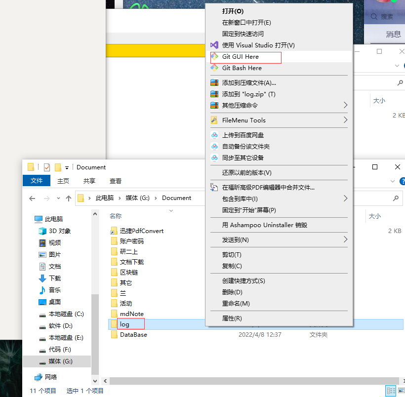

## 2.新建一个Repository

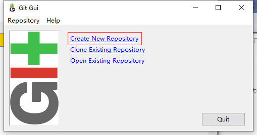

新建完成后,显示

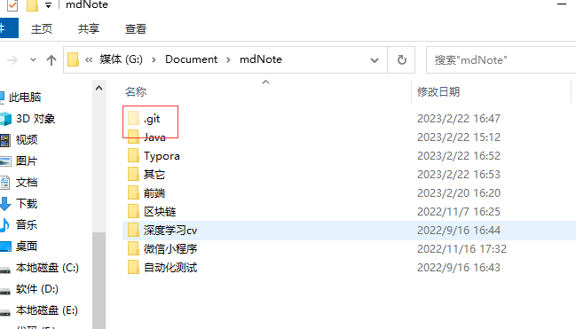

## 3.在GitHub上新建一个库

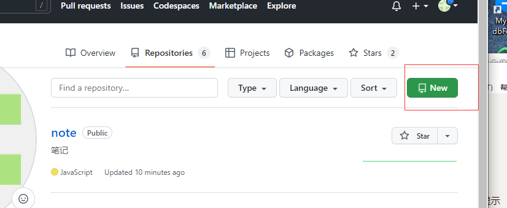

注意,要是public的

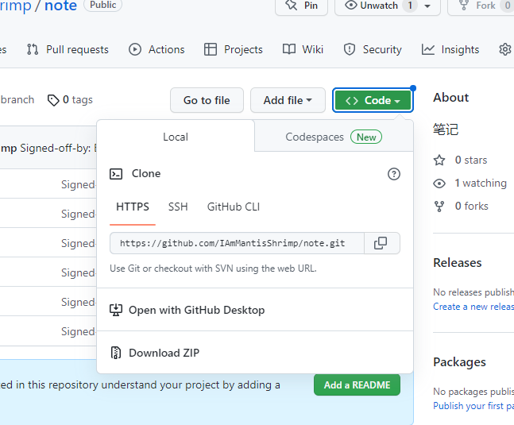

复制到库的链接

https://github.com/IAmMantisShrimp/note.git

## 4.在git中新建一个连接

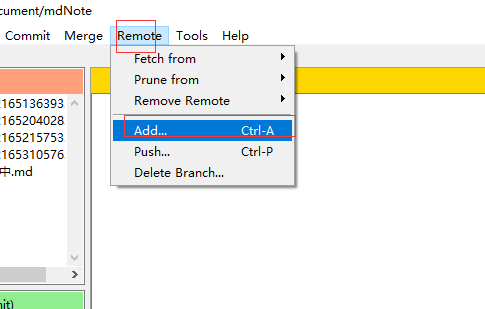

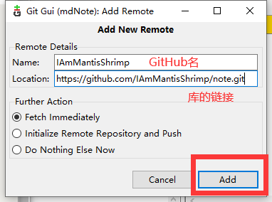

连接成功后关闭

## 5.上传

选取到需要上传的文件,进行标记

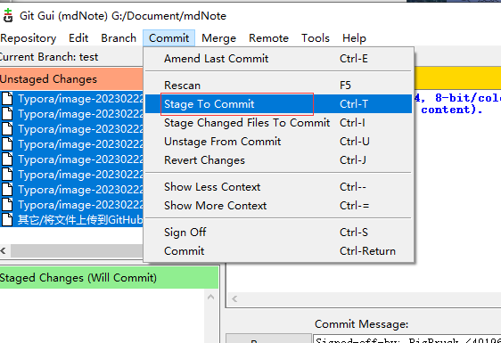

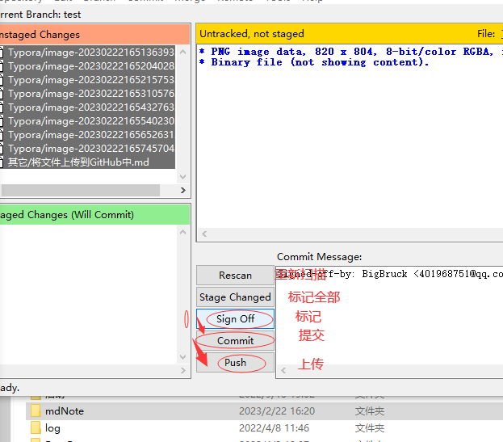

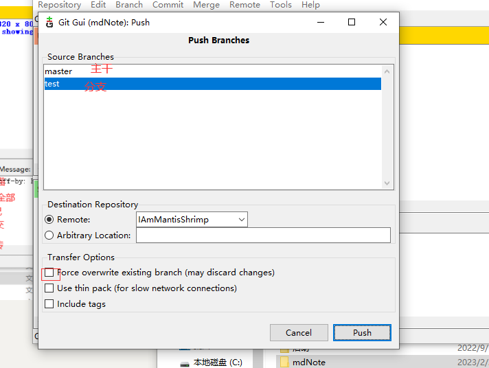

等待上传

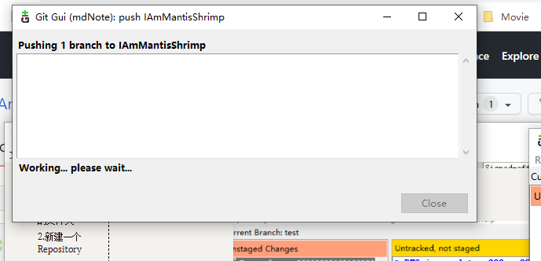

## 6.将不需要上传的文件删除

### 1.选取到不要上传的文件

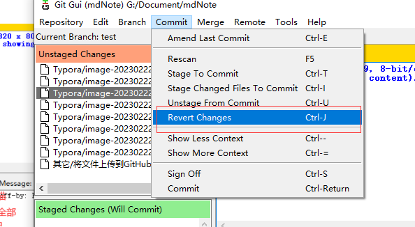

### 2.选择删除文件

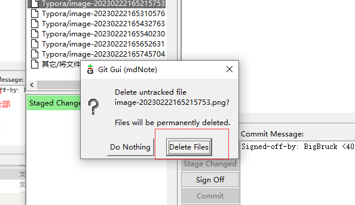

## 7.上传失败

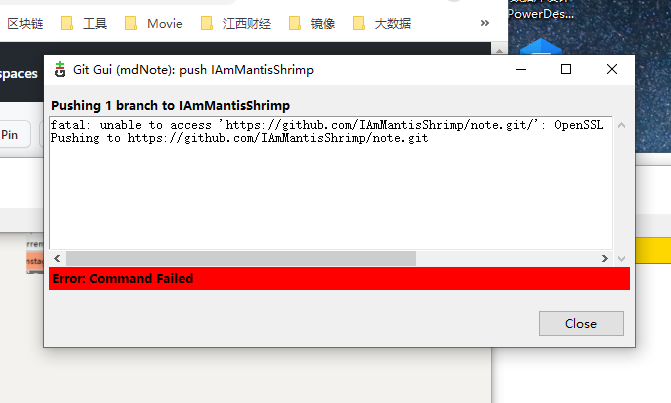

https://blog.csdn.net/bblood307/article/details/120307064

先关闭git

右击空白处

输入:git config --global http.sslVerify false

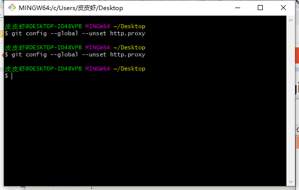

然后再重新上传