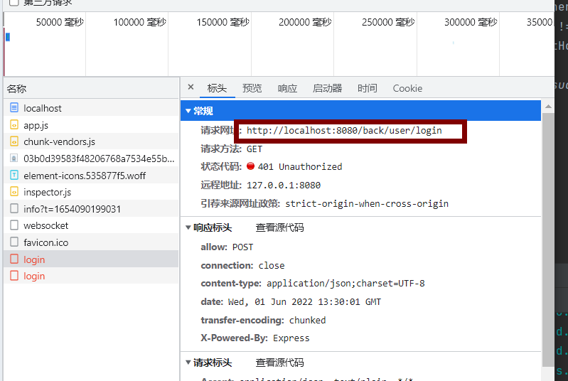
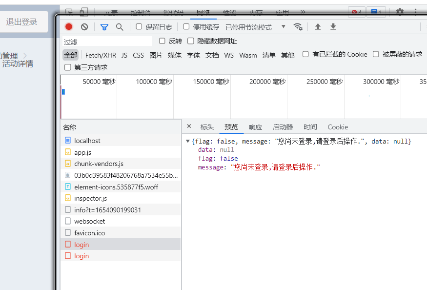
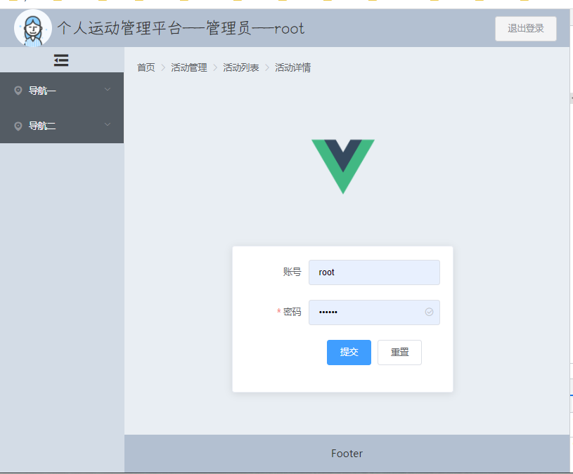
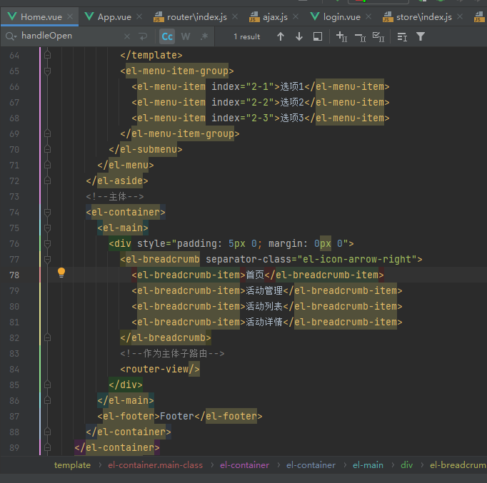

# Vue学习

## 1.基础

### 1.1 template标签

问题描述:有诺干个元素同生共死

解决:

```html
<!--方式一:代码复用,缺点也明显,代码冗余-->
<div id="box">
  <div v-if="isCreated">aaaa</div>
  <div v-if="isCreated">bbbb</div>
  <div v-if="isCreated">cccc</div>
</div>
  <script>
    var app=new Vue({
      el:"#box",
      data:{
        isCreated:true,
      }
    })
  </script>
```

```html
<!--方式二:加一层,缺点:破坏布局结构-->
<div id="box">
  <div v-if="isCreated">
    <div>aaaa</div>
    <div>bbbb</div>
    <div>cccc</div>
  </div>
</div>
```


```html
<!--方式三:使用template标签(vue自带),不影响布局-->
<div id="box">
  <template v-if="isCreated">
    <div>aaaa</div>
    <div>bbbb</div>
    <div>cccc</div>
  </template>
</div>
```


## 2.@input事件

问题描述: 在输入框输入信息,再根据信息筛选列表.

|  |      |
| :----------------------------------------------------------: | ---- |
|                                                              |      |

```javascript
<script>
  let app=new Vue({
    el:"#box",
    data:{
      listArr:["aaa","bbb","ccc","ddd"],
      listTemp:["aaa","bbb","ccc","ddd"],
      myText:"",

    },
    methods:{
      handleInput(){
        console.log("input " + this.myText)
        //使用数组的filter方法,将符合的元素过滤出来
        //注意:这里包含方法是includes
        var newList=this.listTemp.filter(item=> item.includes(this.myText))
        this.listArr=newList
        // console.log(newList)
      }
    }
  })

</script>
```

优化如下:↓

## 3.函数表达式

问题描述: 在输入框输入信息,再根据信息筛选列表.

```
<div id="box">
  <!--input:内容改变时触发-->
  <input type="text"  v-model="myText"/>
  <ul>
    <li v-for="item in handleList()" :key="item">
      {{item}}
    </li>
  </ul>
</div>
<script>
  let app=new Vue({
    el:"#box",
    data:{
      listArr:["aaa","bbb","ccc","ddd"],
      myText:"",

    },
    methods:{
      //随着myText改变,handleList引用了myText所以也会被拦截并再次执行
      handleList(){
        return this.listArr.filter(item=> item.includes(this.myText))
      }
    }
  })

</script>
```


## 4.事件冒泡原则

可以用.stop或self屏蔽冒泡

## 5. evt 获取事件对象

```
<div id="box">
  {{count}}
  <!--可以传参-->
  <button @click="handleAdd1()">add-1</button>
  <!--不传参,得到一个默认对象,事件对象evt-->
  <button @click="handleAdd2">add-2</button>
  <!--可以传参,也能获取事件对象evt,$event必须为第一个参数-->
  <button @click="handleAdd2($event)">add-3</button>
  <ul @click="handleUl()">
    <li @click="handleLi()">
      hello
    </li>
  </ul>
</div>
<script>
  let app=new Vue({
    el:"#box",
    data:{
      count:1,
    },
    methods:{
      handleAdd1(){
        this.count++
      },
      //无小括号,会传个evt值,可以获取当前标签名
      handleAdd2(evt){
        this.count++
        console.log(evt.target)//<button>add-2</button>
      },
      handleAdd3(evt){
        console.log(evt.target)//<button>add-2</button>
      }
    }
  })

</script>
```

## 6.复选框记录值

```
<div>
  <h1>兴趣爱好</h1>
  <!--每个复选框都设一个变量太麻烦,
      因此这里用一个数组和value来存储已经勾选的复选框,
  -->
  <input type="checkbox" v-model="checkBoxList" value="vue"/> vue
  <input type="checkbox" v-model="checkBoxList" value="react"> react
  <input type="checkbox" v-model="checkBoxList" value="java"> java
  {{checkBoxList}}
</div>
```


## 7. lazy修饰符

有些双向绑定情形不需要每输入一个字符就响应一次,而是希望失去焦点或触发其它事件时响应.可以使用v-model.lazy来绑定标签

## 8. number修饰成数字类型

v-model.number

```
{{myText}}
<p>实时改变</p>
<input type="text" v-model="myText"><br>
<p>失去焦点改变</p>
<input type="text" v-model.lazy="myText"><br>
<p>获取数字部分</p>
<input type="text" v-model.number="myText"><br>
 <p>去首位空格</p>
<input type="text" v-model.trim="myText"><br>
```


## 9.动态绑定组件

当有多个组件选择性显示时,可以用

<component is=""></component>标签.

如:

```
自定义组件child
<child></child>
自定义组件parent
<parent></parent>
此时,绑定的是child组件
<component is="child"></component>

也可以用变量动态绑定,改变which值就可以选择使用哪个组件
<component :is="which"></component>
```

## 10.前端请求外部url跨域问题

### 1.前端解决

先安装axios,   npm install --save axios


F:\JavaWeb\Vue\SutdyModule\m1_test\src\components\AxiosGetUrl.vue

如果直接请求外部网址:

```
axios.get("https://ditu.amap.com/service/regeo?longitude=121.04925573429551&latitude=31.315590522490712").then(res=>{
  console.log(res.data)
})
```

会出现跨域问题:


解决:代理转发


#### 1.拆分url

将url拆分成域名和请求路径:

域名:https://ditu.amap.com

请求路径:/service/regeo?longitude=121.04925573429551&latitude=31.315590522490712

#### 2.更改url为路径:

```
//axios请求外部url需要跨域
//  解决:在vue.confit.js中配置反向代理,让后端服务器发请求
axios.get("/service/regeo?longitude=121.04925573429551&latitude=31.315590522490712").then(res=>{
  console.log(res.data)
})
```

#### 3.配置代理

注意要配置在vue.config.js中,如果没有这个文件就新建,配置好后也不用导入到其他文件中

```
//  配置反向代理
devServer:{
  proxy:{
    //凡是/service开头的请求,代理到target域名地址下
    '/service':{
      target:"https://ditu.amap.com",
      changeOrigin:true
    }
  }
  }
```


```javascript
const { defineConfig } = require('@vue/cli-service')
module.exports = defineConfig({
  transpileDependencies: true,
  lintOnSave: false,

  //  配置反向代理
  devServer:{
    proxy:{
      //方式一:  凡是/service开头的请求,代理到target域名地址下
      // '/service':{
      //   target:"https://ditu.amap.com",
      //   changeOrigin:true
      // }

      //方式二:可以将开头部分去除掉
      "/tianqi":{
        target:"https://ditu.amap.com",
        changeOrigin:true,
        pathRewrite:{
          //要替换数据(支持正则表达式) : 替换为数据
          "^/tianqi":""
        //  ^ 为以什么开头,替换成空字符串
        }
      }
    }
  }
})

```


### 2.后端解决

加一个配置类即可:

```java
import org.springframework.context.annotation.Configuration;
import org.springframework.web.servlet.config.annotation.CorsRegistry;
import org.springframework.web.servlet.config.annotation.WebMvcConfigurer;

/**
 * @description: 前端跨域问题处理
 * @author: HuaRunSheng
 * @date: 2022/5/16 11:31
 */
@Configuration
public class WebConfig implements WebMvcConfigurer {
    @Override
    public void addCorsMappings(CorsRegistry registry) {
        registry
                //允许访问的路径
                .addMapping("/**")
                //配置请求来源
                .allowedOrigins("http://localhost:8080")
                //允许跨域访问的方法
                .allowedMethods("GET","POST","DELETE","PUT","OPTION")
                //是否允许请求头
                .allowCredentials(true)
                //最大响应时间
                .maxAge(3600);
    }
}

```


### 4.重启项目

## 11.路由

https://blog.csdn.net/begefefsef/article/details/123304297

### 1.新建两个vue组件

### 2.新建一个router.js

代码如下:

```vue
// history模式
import {
    createRouter,
    createWebHashHistory,
} from 'vue-router'

import Home from '../pages/Home.vue'
import About from '../pages/About.vue'

const routes = [
// 路由的默认路径
    {
        path:'/',
        redirect:"/home"
    },
    {
        path: '/home',
        component: Home
    },
    {
        path: '/about',
        component: About
    },
]

// 创建路由对象
const router = createRouter({
    history: createWebHashHistory(),
    routes
})
export default router;

```

### 3.将router.js导入到main.js中

```
import { createApp } from 'vue'
import App from './App.vue'
import router from './router.js'

createApp(App).use(router).mount('#app')
```

### 4.在App.vue中加入路由组件

```vue
<template>
  <div>
    <router-link to="/home">home</router-link>
    <router-link to="/about">about</router-link>
    <keep-alive>
      <router-view></router-view>
    </keep-alive>
  </div>
</template>

<script>
export default {
  name: "App",
  components: {},
};
</script>

<style>
</style>

```

router-link
上面有提到过router-link，下面我们来简单介绍一下他的使用
router-link事实上有很多属性可以配置：

 to属性：是一个字符串，或者是一个对象
		replace属性：设置 replace 属性的话，当点击时，会调用 router.replace()，而不是 					router.push()；
		active-class属性：设置激活a元素后应用的class，默认是router-link-active
		exact-active-class属性：链接精准激活时，应用于渲染的 <a> 的 class，默认是router-link-					exact-active；

路由懒加载
如果我们能把不同路由对应的组件分割成不同的代码块，然后当路由被访问的时候才加载对应组件，这样就会
更加高效；

这里可以使用webpack的分包知识，而Vue Router默认就支持动态来导入组件

这是因为component可以传入一个组件，也可以接收一个函数，该函数 需要放回一个Promise；

而import函数就是返回一个Promise；

```javascript
const routes = [{undefined
path: ‘/’,
redirect: “/home”
},
{undefined
path: ‘/home’,
component: () => import(’…/pages/Home.vue’)
},
{undefined
path: ‘/about’,
component: () => import(’…/pages/About.vue’)
},
]
```

### 4.动态路由

:名字

```
{
  //动态路由,必须是/films/detail/***才能跳转
  path: '/films/detail/:myId',
  component: () => import('./router/films/FilmDetail.vue')
},
```

### 5.激活样式

首先在route.js中创建自定义样式:

```
// 创建路由对象
const router = createRouter({
  // mode: 'history',
  history: createWebHashHistory(),
  routes,
  //自定义激活样式
  linkActiveClass: 'hrsActive'
})
```

在template中使用自定义的样式

```
<router-link to="/films" custom v-slot="{navigate,isActive}">
  <li @click="navigate" :class="isActive?'hrsActive':''">
    影院
  </li>
</router-link>

<router-link to="/center" custom v-slot="{navigate,isActive}">
  <li @click="navigate" :class="isActive?'hrsActive':''">
    用户中心
  </li>
</router-link>
```

最后在style中设置激活样式

```
<style scoped>
/*设置当前选中的背景色*/
.router-link-active,
.hrsActive {
  color: red;
  /*font-weight: 800;*/
  /*font-style: italic;*/
  /*font-size: 80px;*/
  /*text-decoration: underline;*/
  background-color: green;
}

</style>
```


## 12.路径跳转

### 1.可以使用路由

```
<router-link to="/films/detail">
  {{data}}
</router-link>
```

### 2.事件触发

```
methods:{
      //编程式导航
        //1.旧写法,需要加#号,高亮要自己设置
      // location.href="#/films/detail"
        //2.新写法
      // 跳转到登录页面
      // this.$router.replace("/login");
      this.$router.push("/films/detail")
      //3.通过命名路径跳转
      this.$router.push({
        // 路由别名
        name:"fileDetail",
        params:{
          id:id,
        }
      })
}
```

## 13.获取当前页面的url

### 1.获取完整路径

location.href

http://localhost:8080/#/films/detail/11111

### 2.获取局部路径(当前路由)

```
this.$route
```


如:url=http://localhost:8080/#/films/detail/11111

this.$route.params	为 11111

this.$route.path 为 /films/detail/11111


## 14,url拦截

### 1.全局拦截

```
router.beforeEach((to,from,next)=>{
  // to:请求路径信息
  console.log('to: ',to)
  // from,原来的路径信息
  console.log('from: ',from);
  // next:放行
  if (true){
    next()
  }else {
    //
    // 也可以指向某一个url
    next('/login')
  }
})
```


### 2.使用指定义字段作为条件

在路径中加入meta对象,并自定义属性

```
{
  path: '/center',
  component: center,// 自定义属性
  meta:{
    isHrsRequired:true,
  }

},
```

使用:

先在login中存储一个token:

```vue
methods:{
  LoginIn(){
    setTimeout(()=>{
      // 存储session
      localStorage.setItem("token","后端返回的数据")
      // 返回到上一个页面
      // this.$router.back()
      this.$router.push("/center")
    })
  }
}
```

在router.js中配置拦截

```
router.beforeEach((to,from,next)=>{
  // to:请求路径信息
  console.log('to: ',to)
  // from,原来的路径信息
  console.log('from: ',from);
  // next:放行

  if(to.meta.isHrsRequired){
    // 如果本地有isHrsRequired属性
    // if (to.fullPath === "/films/now"){
    //   next()
    // }else {
    //   //
    //   // 也可以指向某一个url
    //   next('/login')
    // }
    next()
    if (localStorage.getItem("token")){
      // 判断本地是否存储了token(相当于session)
      next()
    }else{
      next("/login")
    }
  }
})
```


### 3.局部拦截

和全局拦截一样,但是拦截方法卸载路径中

```
const routes = [
// 路由的默认路径
  {
    // name:给路由起别名
    name: "default",
    path:'/',
    redirect:"/films",
    beforeEnter:((to,from,next)=>{
      
    })
  }]

```

只有在此路径下,这个拦截配置才生效


### 4.某个页面拦截

拦截配置写在某个页面上,

```
beforeRouteEnter(to,from,next) {... ...}
```


## 15.返回到上一个页面

### 1.使用next()

原来页面:http://localhost:8080/#/films/now

跳转页面:http://localhost:8080/#/login?redirect=/films/now

将上一个页面的路径(/films/now)通过参数传入到跳转的url中

使用:

在跳转时,在next()加入query,

```
router.beforeEach((to,from,next)=>{
  // to:请求路径信息
  console.log('to: ',to)
  // from,原来的路径信息
  console.log('from: ',from)
  // next:放行
  if(to.meta.isHrsRequired){

    if (localStorage.getItem("token")){
      // 判断本地是否存储了token(相当于session)
      next()
    }else{
      console.log("未登录")
      // next("/login")
      next({
        path:"/login",
        // 将当前的url传如入到query中,处理完可以再转回来
        query:{redirect: to.fullPath}
      })
    }
  }else{
    next()
  }
})
```

在跳转到的页面中,将query打印出来

```
console.log(this.$route.query)
```


可以使用this.$route.query.redirect取出上一个页面路径

```
// 跳转到上一个页面
this.$router.push(this.$route.query.redirect)
```


### 2.使用this.$router.back()


## 16.fontsize计算


```

```

```javascript
<script>
  //fontsize 计算
  document.documentElement.style.fontSize=document.documentElement.clientWidth/750*100+'px'
</script>
```

## 17.操作数组

```
    var FilmsList=[]
    axios.get("/mmaizuo.json").then(res=>{
      // console.log(res.data.data.films)
      FilmsList=res.data.data.films

      //将字符串转数字
      var filmId=parseInt(this.$route.params.id)
      //打印数组
      console.log("this.FilmsList: ",FilmsList)
      //获取对象类型
      console.log("typeof",typeof (this.$route.params))
      //打印字符长度
      console.log("arr length:",FilmsList.length)
      // 遍历数组
      for (var index=0; index < FilmsList.length; index++){
        console.log("filmId: ",FilmsList[index].filmId)
        if (FilmsList[index].filmId == filmId){
          console.log("找到了,哈哈哈 ")
        }
      }
    })
```

## 18.动态设置字符大小

导入包

npm install postcss-pxtorem --save-dev

在package.json中加入这段

```
"postcss": {
  "plugins": {
    "autoprefixer": {
      "postcss-pxtorem": {
        "rootValue": 37.5,
        "propList": ["*"]
      }
    }
  }
}
```

### 1.新建一个rem.js文件

```
function setRem() {
  let htmlWidth = document.documentElement.clientWidth || document.body.clientWidth

  let htmlDom = document.querySelector("html")
  // 最大为18px
  let fontSize=htmlWidth/35 > 18 ? 18:htmlWidth/35
  htmlDom.style.fontSize = fontSize + "px"
}
setRem()
window.onresize = function () {
  setRem()
}
```

### 2.导入到main.js中

```
import { createApp } from 'vue'
import App from './App.vue'
import router from './router.js'
import "./rem.js"
createApp(App).use(router).mount('#app')

```


## 19.给标签绑定一个样式

### 1.首先新建一个style

```
 .film .film-detail .voerflow {
  overflow: hidden;
}
```

### 2.将style用:class绑定到标签中

初始化值:

```
data(){
  return{
    FilmId:"",
    FilmObj:{},
    isHidden:true,

  }
```

绑定到标签中

```
<div class="film-synopsis grey-text hidde" style="height: 39px;"
:class="isHidden?'voerflow':''">
  {{FilmObj.synopsis}}
</div>
```

注意:class是绑定,并未在class中,只有条件成立才加入class,且:class绑定的样式不能与class中的同名

如此时class="film-synopsis grey-text hidde",则:class="hidden会变得无效"

### 3.触发条件

```
<div class="toggle"></div>
</div>
```

@click="HiddenHandle"

```
methods:{
  HiddenHandle(){
    console.log("HiddenHandle:",this.isHidden)
    this.isHidden=!this.isHidden
  }
},
```


## 20.Element组件使用

官网:https://element.eleme.cn/

简单使用:https://blog.csdn.net/weixin_53068161/article/details/116543302

### 1.安装

Vue3:https://element-plus.org/zh-CN/guide/installation.html#%E4%BD%BF%E7%94%A8%E5%8C%85%E7%AE%A1%E7%90%86%E5%99%A8

npm install element-plus


Vue2:https://element.eleme.cn/#/zh-CN/component/installation

npm i element-ui -S

在main.js中引入

```JavaScript
import ElementUI from 'element-ui';
import 'element-ui/lib/theme-chalk/index.css';
new Vue({

  ElementUI,
  render: (h) => h(App),
}).$mount("#app");


```


## 21.创建Vue2项目

### 1.在终端中输入:vue create 名称

注意名称不可用大写英文,如:

vue create m2_vue2_test


### 2.根据自己的需求,选择vue2


### 3. 启动项目

先进入创建项目的目录: cd xxx

然后执行如下命令，启动vue项目

```bash
npm run serve
```

### 4.导入为module


找到需要导入的模块:


一直next即可


## 22.ts TypeScript环境支持

```
<script lang="ts" setup>
```

 @vue/cli-plugin-typescript

需要安装ts插件

## 23.封装数组

```
const item = {
  date: '2016-05-02',
  name: 'Tom',
  address: 'No. 189, Grove St, Los Angeles',
}
const tableData = ref(Array.from({ length: 20 }).fill(item))
```

构造一个长度为20的对象数组


## 24.vue3 使用element-puls中icon ，不使用ts

https://blog.csdn.net/m0_59962049/article/details/123386506

使用前- 安装element-plus 的icon

### 选择一个你喜欢的包管理器

#### NPM
$ npm install @element-plus/icons-vue
#### Yarn
$ yarn add @element-plus/icons-vue
#### pnpm
$ pnpm install @element-plus/icons-vue

### 1.main.js

```
import { createApp } from 'vue'
import App from './App.vue'
import ElementPlus from 'element-plus';
import 'element-plus/dist/index.css';
import elementIcon from "./plugins/svgicon";//实现element-puls icon的办法
import installElementPlus from "./plugins/element";//实现element-puls icon的办法


createApp(App).use(ElementPlus)
  .use(installElementPlus)
  .use(elementIcon)
  .mount('#app')
```

## 25.移动端模板 vant

vant官网:https://vant-contrib.gitee.io/vant/#/zh-CN

配置教程:https://blog.csdn.net/q4717529/article/details/118516228

### 1.安装组件库

```cmd
 安装命令 npm install vant@next --save 
 (因为使用的是vue3.x 所以要安装vant的针对vue3的版本vant@next)

```

### 2.安装postcss

```cmd
vant的进阶使用 通过 npm install postcss postcss-pxtorem --save-dev
(用来将px尺寸转化为rem尺寸) 配置rem的根元素字体大小 安装lib-flexiable 
安装命令 npm i amfe-flexible --save 注意 这里会报错 postCss 需要8的版本
所以这里建议对postcss-pxtorem进行降级
降级命令 npm install postcss-pxtorem@5.1.1 --save

```

### 3.在main.js中引入vant组件库


```JavaScript
  import vant from 'vant'
  createApp(App).use(vant).$mount('#app)

```

### 4.新建一个[postcss](https://so.csdn.net/so/search?q=postcss&spm=1001.2101.3001.7020).config.js


在项目根目录中新建一个[postcss](https://so.csdn.net/so/search?q=postcss&spm=1001.2101.3001.7020).config.js 

```JavaScript
// postcss.config.js
module.exports = {
    plugins: {
        // postcss-pxtorem 插件的版本需要 >= 5.0.0
        'postcss-pxtorem': {
            rootValue({ file }) { // 判断是否是vant的文件 如果是就使用 37.5为根节点字体大小
            // 否则使用75 因为vant使用的设计标准为375 但是市场现在的主流设置尺寸是750
                return file.indexOf('vant') !== -1 ? 37.5 : 75;
            },
            // 配置哪些文件中的尺寸需要转化为rem *表示所有的都要转化
            propList: ['*'],
        },
    },
};

```


示例代码:

```vue
<template>
  <div class="search">
    <van-search
      v-model="value"
      shape="round"
      background="#4fc08d"
      placeholder="请输入搜索关键词"
    />
  </div>
  <!-- 不指定单位，默认使用 px -->
  <van-icon name="chat-o" size="40" />
  <!-- 指定使用 rem 单位 -->
  <van-icon name="chat-o" size="3rem" />
  <p>hello font</p>
</template>

<script>
export default {
  data() {
    return {
      value: "",
    };
  },
};
</script>

<style>
body{
  width: 1750px;
}
</style>

```


## 26.反射机制

[反射机制](https://so.csdn.net/so/search?q=反射机制&spm=1001.2101.3001.7020)指的是程序在运行时能够获取自身的信息。例如一个对象能够在运行时知道自己有哪些方法和属性。

在JS里也有和Java反射机制类似的特性 for in，它除了用作循环，还可以体现出反射的思想。

### 1、for in用于循环

```JavaScript
var arr=[{key:'key1'},{key:'key2'}];
for(var i in arr){
    console.log(arr[i].key)
}

```

### 2、for in用于反射

```JavaScript
for(var p in obj){
      if(typeof(obj[p]=="function"){
             obj[p]();
      }else{
             alert(obj[p]);
      }
}
```

在vue中使用也一样:

```vue
    rowHandleEdit(index, row){
      for (const rowKey in row) {
        console.log("rowKey",rowKey)
        if(typeof(row[rowKey])!="function"){
          console.log("row[rowKey]: ",row[rowKey])
        }
      }
      console.log("编辑:index=",index,", row=", row);
    },
```

对象row遍历出来得rowKey是对象得字段名,而row[rowKey]则是对应得值:


```vue
rowHandleEdit(index, row){
      this.dataInitialize();
      this.isEditInput=true;
      var rIndex=0;
      for (const rowKey in row) {
        if(typeof(row[rowKey])!="function"){
          var searchTimes=0;
          for (let i = rIndex; i < this.FieldsList.length; i++) {
            // row中的rowKey字段和FieldsList[i].prop的属性相等时,说明是同一个字段
            if (rowKey==this.FieldsList[i].prop){
              // 将row[rowKey]中的值,赋给输入框
              this.inputArr[i]=row[rowKey];
              break;
            }
            // 防止FieldsList和row字段位置不一致,就是最不保险得方法,确保全部循环一遍
            if (i >= this.FieldsList.length-1){
              if (searchTimes<this.FieldsList.length){
                i=0;
              }
            }
            // 当查找次数超过FieldsList字段得总数时,退出
            if (searchTimes>=this.FieldsList.length)
              break;
            searchTimes++;
          }
          rIndex=rIndex+1;
        }
      }
    },
```

## 27.发送post请求

```
axios({
  method: "post",
  url: fieldUrl,
  data: obj,
  transformRequest: [function (data) {
    return Qs.stringify(data) //使用Qs将请求参数序列化
  }],
  headers: {
    'Content-Type': 'application/x-www-form-urlencoded' //必须设置传输方式
  }
}).then((res) => {
  console.log(res.data)
  if (res.data.state=="success"){
    alert("新增成功");
  }else {
    alert("新增失败");
  })
```

后端接收时:

## 28.ul 绑定多个值

当绑定的值个数不确定时:v-model="inputArr[index]" 

```
<el-input v-for="(field,index) in FieldsList" v-model="inputArr[index]"  :style="'width: '+(parseInt(field.width)+50)+'px'" :placeholder="field.label" :key="field.prop"
          type="textarea" :rows="defaultRow" :autosize="autoSize" :auto-complete="'on'">
  {{inputArr[index]}}
</el-input>
```

```
input_0:"",
input_1:"",
input_2:"",
input_3:"",
input_4:"",
input_5:"",
input_6:"",
input_7:"",
inputArr:[],
```

```
this.inputArr=[this.input_0,this.input_1,this.input_2,this.input_3,this.input_4,this.input_5,this.input_6,this.input_7];
```

## 29.使用vue ui创建项目

在cmd窗口中输入vue ui回车


然后根据步骤,手动创建项目


## 30.配置全局axios

### 1.局部只用axios

首先引入axios,再使用axios.get

```vue
<script>
  import axios from 'axios';
  export default {
    name: "App",
    computed:{},
    methods:{
      test(){
        axios.get("/test").then((res)=>{
          console.log(res);
        }).catch(err=>{
          console.log(err)
        });
      }
    }
  }
</script>
```


### 2.全局使用

在src文件夹下新建一个utils/axios.js文件

```
import Vue from "vue";
import axios from "axios";

const ajax=axios.create({
    //
    baseURL:"http://localhost:9090"
});
// 挂载后,全局可以用$ajax对象
Vue.prototype.$ajax=ajax;
```

引入到main.js中

```
import "@/utils/ajax";
```

就可以直接使用

```vue
      this.$ajax.get("/test").then(res=>{
        console.log("res:",res);
      }).catch(err=>{
        console.log("err:",err)
      });
```

## 31.axios拦截器

```vue
          this.$ajax({
            method: "post",
            url: "/back/user/login",
            data: this.form,
          }).then((res) => {// 从这里开始被拦截
            console.log(res);
          });
```

如果拦截器没有返回值, console.log(res);则拿不到任何值.


```JavaScript
import Vue from "vue";
import axios from "axios";
import { Message } from "element-ui";
import store from "@/store/index"
const ajax = axios.create({
  //
  // baseURL:"http://localhost:9090"
});
// ajax拦截器,请求
ajax.interceptors.request.use(res=>{
  console.log("请求信息: ", res);
  // 这里判断localStorage里面是否存在token，如果有则在请求头里面设置
  if (store.state.token != "") {
    // res.headers.Authorization = getLocalStorage("jwtToken");
    console.log(store.state.token);
   // 设置token认证 res.headers.Authorization=store.state.token;
  }
  // 放行,不让下面的方法拿不到参数
  return res;
});
// ajax拦截器,响应
ajax.interceptors.response.use((res) => {
  console.log(res.data);
  if (res.data.flag) {
    Message({
      message: res.data.message,
      type: "success",
    });
  } else {
    Message.error(res.data.message);
  }
  // 放行,不让下面的方法拿不到参数
  return res;
});
// 挂载后,全局可以用$ajax对象
Vue.prototype.$ajax = ajax;

```

## 32.vuex保存session

### 1.先在store/index.js中配置

```JavaScript
import Vue from "vue";
import Vuex from "vuex";

Vue.use(Vuex);

export default new Vuex.Store({
  state: {
    // 字段,相当与vue中的data
    token: sessionStorage.getItem("token"),
  },
  mutations: {
    // 保存方法
    setToken(state, data) {
      state.token = data;
      console.log("vuex中的token: ", data);
      sessionStorage.setItem("token", data);
    },
  },
  actions: {},
  modules: {},
});

```

### 2.在有需要处使用

```vue
          this.$ajax({
            method: "post",
            url: "/back/user/login",
            data: this.form,
          }).then((res) => {
            // 从这里开始被拦截
            let token = res.data.data.token;
            let tokenHead = res.data.data.tokenHead;
			// 使用vuex
            this.$store.commit("setToken", tokenHead + token);
          });
```


## 33.配置了代理转发,还是报错

https://segmentfault.com/q/1010000022482431

很可能是后端问题:

如,请求地址虽然显示前端,但后端可能已经收到了请求,只不过是被后端拦截了.




查看响应:




配置白名单即可.


## 33.嵌套页面

如图,在一个vue里面嵌套另一个vue




### 方式一:

F:\Java\PracticeProject\20220515个人运动管理平台\code\vue_sport\src\views\Home.vue

在一个vue文件用<router-view/>里引入其他的vue:

```vue
<template>
  <div id="app">
    <router-link to="/home"></router-link>
    <keep-alive>
      <router-view></router-view>
    </keep-alive>
  </div>
</template>
```

### 


## 34.页面作为标签

### 1.新建两个页面

UserSet.vue,UserPass.vue

### 2.注册到另一个页面

组件作为标签也可以小写,也可以用驼峰写法

#### 2.1 注册

```vue
import UserSet from '@/components/user/UserSet.vue';
import UserPass from '@/components/user/UserPass.vue';
```

### 2.2 使用

```vue
          <UserPass />  //这里是组件
          <UserSet /> //这里是组件
```

也可以用驼峰

```vue
          <user-pass />  //这里是组件
          <user-set /> //这里是组件
```

### 3.实例 

不使用路由实现切换,实现切换.

```vue
<template>
  <div class="wrapper">
    <div class="wrapper_content">
      <div class="tab_title">
        <ul>
          <li @click="tab=0" :class="{tab_active:tab==0}">
            资料设置
          </li>
          <li @click="tab=1" :class="{tab_active:tab==1}">
            修改密码
          </li>
        </ul>
      </div>
      <div class="content">
        <div class="tab_content" v-if="tab==0">
          <UserSet /> //这里是组件
        </div>
        <div class="tab_content" v-else-if="tab==1">
          <UserPass />  //这里是组件
        </div>
      </div>
    </div>
  </div>
</template>
<script>
import UserSet from '@/components/user/UserSet.vue';
import UserPass from '@/components/user/UserPass.vue';
export default {
  data() {
    return {
      tab: 0 //默认选中第一个tab
    };
  },
  components: { UserSet, UserPass }
};
</script>
<style scoped>
.wrapper {
  width: 100%;
  height: 100%;
  background-color: white;
  background-position: center;
  display: flex;
  justify-content: center;
  margin-left: 10px;
  margin-top: 10px;
  border-radius: 5px;
  padding: 30px;
  box-shadow: -2px 0px 3px 0px rgba(118, 118, 118, 0.2);
}
 
.wrapper_content {
  width: 1236px;
  height: 100%;
  display: flex;
  justify-content: flex-start;
}
 
.tab_title {
  width: 261px;
  height: 100%;
}
 
.tab_title>ul {
  margin: 0;
  padding: 0;
  list-style: none;
  margin: 0 auto;
 
  width: 200px;
  height: 100px;
  display: flex;
  flex-direction: column;
}
 
.tab_title>ul>li {
  flex-grow: 1;
  width: 100%;
  text-align: center;
  height: 50px;
  line-height: 50px;
  display: flex;
  font-size: 14px;
  justify-content: center;
}
 
.tab_title>ul>li:hover {
  cursor: pointer;
}
 
.tab_title .tab_active {
  cursor: pointer;
  background: linear-gradient(to right top, #F0F6FF, #F0F6FF);
  color: #333333;
  border: 0;
}
 
.content {
  margin-left: 1px;
  width: 976px;
  height: 100%;
}
 
.tab_content {
  width: 100%;
  height: 100%;
}
</style>
```

# 静态文件链接


用base目录来做前缀,

当没有指定前缀时,默认是```/```, --> 访问public/hello.jpg --> href="/hello.jpg"

当指定前缀为```publicPath: '/onduty'```, --> 访问public/hello.jpg --> href="/onduty/hello.jpg"

vue页面要获取publicPath

```
publicPath: process.env.BASE_URL,
```

如这里,publicPath = /onduty/

超链接:

```
:href="this.publicPath+'static/exampleFile/水利厅2023年五一节假期值班情况表0501 .docx'"
```


