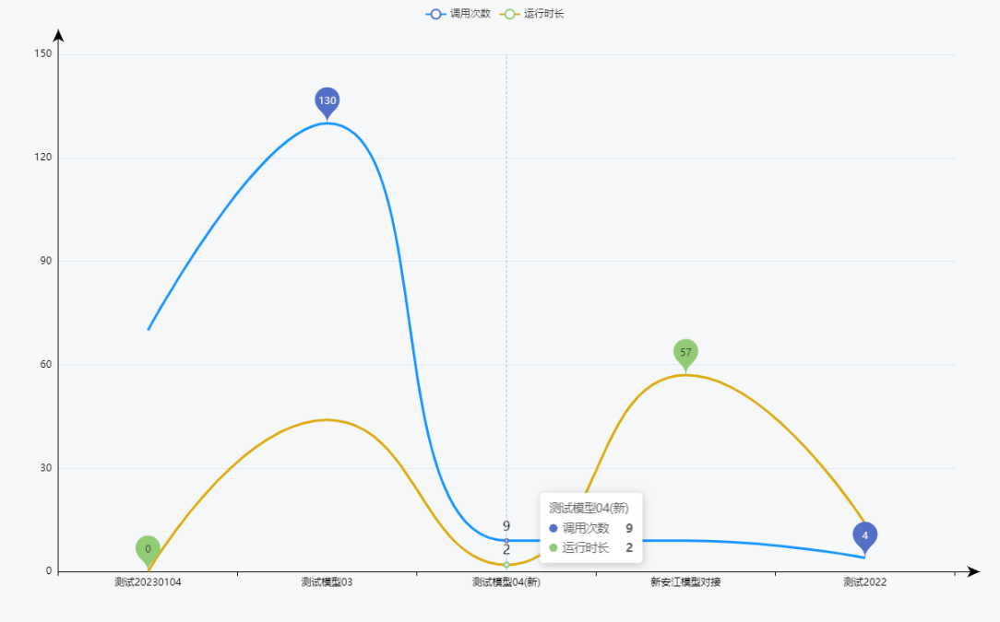

# **echarts组件：**

官网:https://echarts.apache.org/zh/option.html#series-bar.markPoint.symbolKeepAspect

https://blog.csdn.net/weixin_42028153/article/details/119783738

使用chart时,尽量不要用if else标签,不然有时候Element.getElementById会找不到

# 1.去除小圆点

https://blog.csdn.net/qq_43552688/article/details/124820791

```
//两条折线就有三种series，可以更改type以改变是否为折线
series: [{
  name: "实测",
  type: "line",
  data: this.adata,
  smooth: true,
  showSymbol: false,
},{
  name: "预测",
  type: "line",
  data: this.bdata,
  smooth: true,
  showSymbol: false,
},
```

series: [{symbol: "none"}]

设置series下的symbol为none可以直接去除小圆点，并且鼠标放到曲线上也不显示

series: [{showSymbol: false}]

设置series下的showSymbol为false是去掉小圆点，但是鼠标放到曲线上会显示

下面是二者对比：

蓝色曲线使用symbol设置，绿色曲线使用showSymbol设置


# 3.几条折线

```
//两条折线就有三种series，可以更改type以改变是否为折线
series: [{
  name: "实测",
  type: "line",
  data: this.adata,
  smooth: true,
  showSymbol: false,
},{
  name: "预测",
  type: "line",
  data: this.bdata,
  smooth: true,
  showSymbol: false,
},
]
```

在series中,是个数组,一个数组是一条

# 4.标题

```
legend: {
  data: (this.adata.length <=0) ? ["预测"]:["实测","预测"],//图例
  // bottom: "43px"
},
```


# 5.显示数据

```
//鼠标靠近点时，显示悬浮的数据
tooltip: {
  trigger: "axis",
  axisPointer : {            // 坐标轴指示器，坐标轴触发有效
    type : 'line'        // 默认为直线，可选为：'line' | 'shadow'
  },
},
```


# 起点

  boundaryGap: true,

```
xAxis: {//横坐标
  name: "",
  type: "category",
  boundaryGap: true, //xAxis中的boundaryGap属性，设置为false代表是零刻度开始，设置为true代表离零刻度间隔一段距离
  data: this.mainChartDate.modelNames,
  axisLine: {
    show: true,
    symbol:['none', 'arrow'],    //加箭头处
    symbolOffset: 30,            //使箭头偏移
    lineStyle: {
      color: "black",         //设置y轴及其字体的颜色
      shadowOffsetX:30,      //利用阴影进行反向延长
      shadowColor: 'black',   //设置阴影的颜色
    },
  },
```


# x及y轴箭头

```vue
xAxis: {//横坐标
          name: "",
          type: "category",
          boundaryGap: true, //xAxis中的boundaryGap属性，设置为false代表是零刻度开始，设置为true代表离零刻度间隔一段距离
          data: this.mainChartDate.modelNames,
          axisLine: {
            show: true,
            symbol:['none', 'arrow'],    //加箭头处
            symbolOffset: 30,            //使箭头偏移
            lineStyle: {
              color: "black",         //设置y轴及其字体的颜色
              shadowOffsetX:30,      //利用阴影进行反向延长
              shadowColor: 'black',   //设置阴影的颜色
            },
          },
          // data: this.xdata

        },
        yAxis: [{
          name: "",
          type: "value",
          axisLine: {
            show: true,
            symbol:['none', 'arrow'],    //加箭头处
            symbolOffset: 30,            //使箭头偏移
            lineStyle: {
              color: "black",         //设置y轴及其字体的颜色
              shadowOffsetY:-30,      //利用阴影进行反向延长
              shadowColor: 'black',   //设置阴影的颜色
            },
          },
        }],
```





## 2.双Y轴

就是在y轴上写两个数组

```
yAxis: [{
  name: "",
  type: "value",
  axisLine: {
    show: true,
    symbol:['none', 'arrow'],    //加箭头处
    symbolOffset: 30,            //使箭头偏移
    lineStyle: {
      color: "black",         //设置y轴及其字体的颜色
      shadowOffsetY:-30,      //利用阴影进行反向延长
      shadowColor: 'black',   //设置阴影的颜色
    },
  },
},{
  name: "",
  type: "value",
  axisLine: {
    show: true,
    symbol:['none', 'arrow'],    //加箭头处
    symbolOffset: 30,            //使箭头偏移
    lineStyle: {
      color: "black",         //设置y轴的颜色
      shadowOffsetY:-30,      //利用阴影进行反向延长
      shadowColor: 'black',   //设置阴影的颜色
    },
  },
}],
```


# 极值/最大值


在series中,markPoint

```vue
series: [{
  name: "调用次数",
  type: "line",
  data: this.mainChartDate.callNums,
  smooth: true,
  // 隐藏折点
  showSymbol: false,
  // 线条格式
  lineStyle: {
    color: '#1791FF',
    width: 3
  },
  itemStyle: {    //拐点显示值
    normal: {
      label: {
        show: true,  //开启显示
        position: 'top',  //在上方显示
        textStyle: {  //数值样式
          color: 'black',
          fontSize: 16
        }
      }
    }
  },
  markPoint:{
    data:[
      {type:'max',name:'最大值'},
      {type:'min',name:'最小值'}
    ]
  },
},{
  name: "运行时长",
  type: "line",
  data: this.mainChartDate.runTimeDates,
  smooth: true,
  showSymbol: false,
  lineStyle: {
    color: '#d9aa10',
    width: 3
  },
  itemStyle: {    //拐点显示值
    normal: {
      label: {
        show: true,  //开启显示
        position: 'top',  //在上方显示
        textStyle: {  //数值样式
          color: 'black',
          fontSize: 16
        }
      }
    }
  },
  markPoint:{
    data:[
      {type:'max',name:'最大值'},
      {type:'min',name:'最小值'}
    ]
  },
},
]
```


# 线的宽度


找series中的linestyle中

```vue
  lineStyle: {
    color: '#1791FF',
    width: 3
  },
```


```
series: [{
  name: "调用次数",
  type: "line",
  data: this.mainChartDate.callNums,
  smooth: true,
  // 隐藏折点
  showSymbol: false,
  // 线条格式
  lineStyle: {
    color: '#1791FF',
    width: 3
  },
```

# 曲线图

```js
this.charts.setOption({
  title: {
    text: ""
  },
  //鼠标靠近点时，显示悬浮的数据
  tooltip: {
    trigger: "axis",
    axisPointer : {            // 坐标轴指示器，坐标轴触发有效
      type : 'line'        // 默认为直线，可选为：'line' | 'shadow'
    },
  },
  legend: {
    data: ["调用次数","运行时长"],//图例
    // bottom: "43px"
  },
  grid: {
    left: "6%",
    right: "6%",
    bottom: "3%",
    containLabel: true
  },

  toolbox: {
    feature: {
      //会有个下载按钮
      // saveAsImage: {}
    }
  },
  xAxis: {//横坐标
    name: "",
    type: "category",
    boundaryGap: true, //xAxis中的boundaryGap属性，设置为false代表是零刻度开始，设置为true代表离零刻度间隔一段距离
    data: this.mainChartDate.modelNames,
    axisLine: {
      show: true,
      symbol:['none', 'arrow'],    //加箭头处
      symbolOffset: 30,            //使箭头偏移
      lineStyle: {
        color: "black",         //设置y轴及其字体的颜色
        shadowOffsetX:30,      //利用阴影进行反向延长
        shadowColor: 'black',   //设置阴影的颜色
      },
    },
    // data: this.xdata

  },
  yAxis: [{
    name: "",
    type: "value",
    axisLine: {
      show: true,
      symbol:['none', 'arrow'],    //加箭头处
      symbolOffset: 30,            //使箭头偏移
      lineStyle: {
        color: "black",         //设置y轴及其字体的颜色
        shadowOffsetY:-30,      //利用阴影进行反向延长
        shadowColor: 'black',   //设置阴影的颜色
      },
    },
  }],
  //两条折线就有三种series，可以更改type以改变是否为折线
  series: [{
    name: "调用次数",
    type: "line",
    data: this.mainChartDate.callNums,
    smooth: true,
    // 隐藏折点
    showSymbol: false,
    // 线条格式
    lineStyle: {
      color: '#1791FF',
      width: 3
    },
    itemStyle: {    //拐点显示值
      normal: {
        label: {
          show: true,  //开启显示
          position: 'top',  //在上方显示
          textStyle: {  //数值样式
            color: 'black',
            fontSize: 16
          }
        }
      }
    },
    markPoint:{
      data:[
        {type:'max',name:'最大值'},
        {type:'min',name:'最小值'}
      ]
    },
  },{
    name: "运行时长",
    type: "line",
    data: this.mainChartDate.runTimeDates,
    smooth: true,
    showSymbol: false,
    lineStyle: {
      color: '#d9aa10',
      width: 3
    },
    itemStyle: {    //拐点显示值
      normal: {
        label: {
          show: true,  //开启显示
          position: 'top',  //在上方显示
          textStyle: {  //数值样式
            color: 'black',
            fontSize: 16
          }
        }
      }
    },
    markPoint:{
      data:[
        {type:'max',name:'最大值'},
        {type:'min',name:'最小值'}
      ]
    },
  },
  ]
})
```

# 柱形图

```
opiton: {
 yAxis: {
  type: 'category',
  data: [],
  axisTick: {
   show: false,
  },
  axisLabel: {
   textStyle: {
    color: "#000000",
           fontSize: 15,
   }
  }

 },
 xAxis: {
  type: 'value',
  show: false,
 },
 grid: {
  top: "0%",
  left: "20%",
  right: "10%",
  bottom: "10%"
 },
 title: {
  show: null, // 是否显示title
  text: '暂无数据',
  left: 'center',
  textStyle: {
   color: 'black',
   fontSize: 14,
   fontWeight: 400
  }
 },
 series: [
  {
   data: [],
   type: 'bar',
   color: '#49e7f3',
   barWidth: 15,
   itemStyle: { // 主要部分
    normal: {
     label: {
      show: true,
               fontSize: 13,
      formatter: '{c}s',  // 显示数值
      position: 'right' // 数值在柱体右侧
     },
     barBorderRadius: 10 // 让柱形上下变成圆角
    }
   }
  }

 ]
},
```


# 饼图

```
const pieOption = {
  tooltip: {},
  legend: {
    icon: 'rect',
    itemWidth: 20,  // 设置宽度
    itemHeight: 20, // 设置高度
    itemGap: 4, // 设置间距
    left: 'right',
    y: 'center',  //图例上下居中
    orient: 'vertical',
    data: this.mainChartDate.modelNames,
    textStyle: {
      fontSize: 13,
      // color: "#333",
      padding: [0, 0, 0, -8], // 修改文字和图标距离
    },
  },
  dataset: {
    source: [
      this.mainChartDate.modelNames,
      this.mainChartDate.callNums
    ]
  },
  series: [
    {
      name: '模型调用次数',
      type: 'pie',
      center: ['35%','50%'],  //圆心横坐标、纵坐标
      radius: '75%',
      seriesLayoutBy: 'row',
      encode: {
        value: 1,
        itemName: 0,        //数据项名称，在legend中展示
      },
      label: {
        show: false
      }
    }
  ]

};
```

说明文字的格式:

```js
legend: {
    icon: 'rect',
    itemWidth: 20,  // 设置宽度
    itemHeight: 20, // 设置高度
    itemGap: 4, // 设置间距
    left: 'right',
    y: 'center',  //图例上下居中
    orient: 'vertical',
    data: this.mainChartDate.modelNames,
    textStyle: {
      fontSize: 13,
      // color: "#333",
      padding: [0, 0, 0, -8], // 修改文字和图标距离
    },
  },
```

series的lable

```
label: {
  align: 'left',
  show: true,
  position: 'inner',
  color:'#fff',
  fontSize: '13',
  formatter: '{c}'+arrMemo[1][0],
  fontWeight:'bold',
},
```

  formatter: '{c}'+'G',

{b}表示标题,{c}表示值,{d}表示占比

# 鼠标悬停显示内容设置：

默认是显示x轴（名称）,y轴（数值）的内容，可自定义显示格式和内容

```js
// 默认
tooltip : {
            trigger: 'axis'
            },
// 自定义formatter函数
tooltip: {
            formatter:function(a){  
                return (a['seriesName'] +'</br>'+a['name']+'：'+a['value']); 
            }
        },
```

## 默认样式

```
tooltip: {
  trigger: "axis",
  axisPointer : {            // 坐标轴指示器，坐标轴触发有效
    type : 'shadow'        // 默认为直线，可选为：'line' | 'shadow'
  },

},
```


## 自定义

```
return (a['seriesName'] +'</br>'+a['name']+'：'+a['value']);
```


```
tooltip: {
  formatter:function(a){
    return (a['name']+'：'+a['value'] + '%');
  },
},
```


# 刻度,网格线,轴

```
yAxis: [
  {
    min:0, //y轴的最小值
    max:100, //y轴最大值
    boundaryGap: false,
    // y轴
    axisLine: {
      show: false,
    },
    // y轴刻度
    axisTick: {
      show: false,
    },
    // 网格线
    splitLine:{
      show: true,
      lineStyle: {
        color: 'rgb(183,187,187)'
      }
    }
  },
],
```


# 刻度最大值和最小值

```
yAxis: [
  {
    min:0, //y轴的最小值
    max:100, //y轴最大值
    boundaryGap: false,
    // y轴
    axisLine: {
      show: false,
    },
    // y轴刻度
    axisTick: {
      show: false,
    },
    // 网格线
    splitLine:{
      show: true,
      lineStyle: {
        color: 'rgb(183,187,187)'
      }
    }
  },
],
```

    min:0, //y轴的最小值
    max:100, //y轴最大值

# 标题属性

```txt
title: {
  show: true,    // 是否显示标题组件,（true/false）
  text: '',   // 主标题文本，支持使用\n换行
  textAlign:'auto',    //整体水平对齐（包括text和subtext）
  textVerticalAlign:'auto',//整体的垂直对齐（包括text和subtext）
  padding:0,    // 标题内边距 写法如[5,10]||[ 5,6, 7, 8] ,
  left:'auto',    // title组件离容器左侧距离，写法如'5'||'5%'
  right:'auto',    //'title组件离容器右侧距离
  top:'auto',    // title组件离容器上侧距离
  bottom:'auto',    // title组件离容器下侧距离
  borderColor: '',     // 标题边框颜色
  borderWidth: 1,    // 边框宽度（默认单位px）
  textStyle: {    // 标题样式
    color: '',    //字体颜色
    fontStyle: '',    //字体风格
    fontSize: 14,    //字体大小
    fontWeight: 400,    //字体粗细
    fontFamily: '',    //文字字体
    lineHeight: ''    //字体行高
    align:'center',//文字水平对齐方式（left/right）
    verticalAlign:'middle',//文字垂直对齐方式（top/bottom）
  },
  subtext: '',    // 副标题
  subtextStyle: {    // 副标题样式
    color: '#ccc', 
    fontStyle:'normal',
    fontWeight:'normal',
    fontFamily:'sans-serif',
    fontSize:18,
    lineHeight:18,
    }
}

```

# 拐点值

在series中的itemStyle

```
itemStyle: {    //拐点显示值
  normal: {
    label: {
      show: false,  //开启显示
      position: 'top',  //在上方显示
      textStyle: {  //数值样式
        color: 'black',
        fontSize: 16
      }
    }
  }
},
```


# 图标位置grid

值可以是数字,也可以是百分比

数字的话单位默认是px

```
grid: {
  left: "6%",
  top: "6%",
  right: "6%",
  bottom: "3%",
  containLabel: true
},
```

```js
grid: {
  left: "60",
  right: "60",
  bottom: "30",
  containLabel: true
},
```


# 图表自动调整大小

```
const chartDom = document.getElementById(id);
let myChart = echarts.init(chartDom);
const chartObserver = new ResizeObserver(() => {
  myChart.resize();
});
chartObserver.observe(chartDom);

myChart.setOption(option);
```

这样,拉伸浏览器大小,图表就会跟着变化

