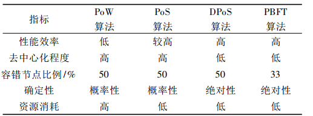

[TOC]


# idea

G:\Document\区块链\20220508师兄\区块链技术综述_张亮.pdf

G:\Document\区块链\20220530\基于改进PBFT算法的区块链溯源系统设计与实现_杨绿林.caj


## 方向:

- 地址:

  https://www.zhihu.com/question/320484169/answer/1254554269
  
  https://www.zhihu.com/question/470508063/answer/2172366928

1. 内容:

   1. 在区块链的应用，比如区块链在医疗领域或者区块链在教育领域，这些方面不会牵扯到太多区块链的技术，医疗领域因为疫情也比较火。

   2. 具体来说，就是我们在看论文的过程中，去找到一些稍微不错的框架，比如一些idea或者一些系统设计等等，然后去到医疗、教育行业、电力行业，套进去，这些相对的技术难度没有那么高，而且这方面的论文比较容易读懂，思路也容易理解。
   2. 在一些溯源方面论文也比较容易出成果，比如在果园、农地等场景，把区块链的性质套进去，框架不变，只是换了一层场景的皮，没有太多的技术量，很多硕博论文都是这么出的，最后再多一些字符定义，公式添加。

   

   看论文:

   - ### *区块链与云计算拍卖系统的结合*

   - 当我解读完整个系统之后，师兄提问：**这篇论文是否是第一个提出这个拍卖系统的?**如果

     

     是的话，我们可以选择在上面进行改进，想想有什么比较好的思路；而如果不是的话，我们可以去看看最开始提出这个系统模型的论文，我们可以借鉴作者对于原始论文的改进思路.

   - 当我开始讲一些论文的数学公式的时候，师兄提问：**这些公式是否是作者的自创，它是属于作者自身的推论，还是原本就存在只是被作者换了一些符号而已?**这个点在看论文的时候要注意到，以及很多比较关键的数学符号，要认真看它的意思，理解清楚它的范围。

   - 在读这类顶会的论文时，**如果它的实验步骤比较好或者结果容易看懂，这个时候我们要做好记录，学一下它的实验设计.**同时，区块链很多实验的结果，更加注重的是整体的趋势，而不是单个点的精确位置呈现。

   - **看这些比较好的论文时，要学会关注它论文结构的呈现，怎么一步步给出说明，怎么对一个系统进行呈现与安全性分析等等，要学会留意，以后可以照着他们的论文结构去呈现自己的论文。**

   - 

   - ### *区块链与众包系统结合*

   - 当我提出众包系统的时候，因为众包系统与传统的很多模型有类似的地方，所谓众包就是在某个平台上，甲方给出钱和待解决的问题，乙方由大量的个体组成，谁能给出解决方案，谁就能得到甲方的钱，平台会进行相应的抽成，有点类似古时候贴皇榜，能做到就揭皇榜。

   - 在我提出这个系统中，师兄提到：这种类似的模型在很多场合都会看到，比如[云计算](https://www.zhihu.com/search?q=云计算&search_source=Entity&hybrid_search_source=Entity&hybrid_search_extra={"sourceType"%3A"answer"%2C"sourceId"%3A1975135240})，或者一些有中心化的第三方，都是这种场景，**这个时候我们要重点关注的就是它是怎么跟区块链进行结合的，区块链在这种问题上提供的是一个怎样的角色。**

   - 如果觉得这个模型比较好，具备可迁移性的话，可以去寻找其他场景看能否进行结合。找的过程中，**最重要的点是找到一个可对比的对象，因为有了对比，才能知道这个模型的效果好不好，没有对比，就没有实验结果的比较，论文也没办法发出来。**

   - 最后，在这两篇论文中，我们可以关注两个系统中的攻击方式，对于每种攻击方式，两个作者都是根据什么方法去解决的，这是我们可以了解总结下来的。
   
   
   
   

## 应用场景

- 电商

- 百度搜索:
  - 问题解决:去广告,可信度,有效性,刷单的处理,不诚实节点个人隐私保护
  - 使用:去中心化,共识机制
  - 实现:做个插件或做个系统
  - 重点: 对共识算法改进,如:置信度加权投票算法
  
  

## 知识储备

### 1. 数据存储

```txt
		目前区块链的发展性是怎么样的，他的回答是目前区块链还没有很好的落地应用，其实它很多技术都是数据库的，它的本质是个分布式数据库，很多区块链面临的问题其实是数据库留下来的问题。因此想要在这些技术上去突破，其实难度会比较大一些。而如果在最火的领域去发的，虽然我们的工作量是比较小的，但是它的创新性跟新颖性比较高，这方面会比较吸引论文的审核者。
```

1.1 使用开源的第三方数据库(条件限制,可以用mysql):

​	存放在第三方的数据库,平台需要访问时需要授权.访问有记录,记录在区块链中.

​	存储用户的信息

​	G:\Document\区块链\师兄\基于区块链的个人隐私保护机制_章宁.pdf

1.2 使用p2p 网络,存储在全网节点中


### 2. 区块链系统

2.1. 区块链系统如Gcoin:

​	存储数据数据和用户行为记录(替换p2p),不可篡改

​	G:\Document\区块链\师兄\基于区块链的个人隐私保护机制_章宁.pdf

2.2. IPFS(分布式系统) 技术

```
星际文件系统 IPFS[42]是一个面向全球的、点对点的分布式文件系统，任何节点都没有特权。IPFS 的存储方式很特别。若通过 IPFS 存储一个知识，IPFS 会将知识分解成若干份，然后又将这分解完的每一份复制成若干份,分发存储到遍布全球的若干个有 IPFS 节点的电脑里。
```


### 3. 智能合约:

- G:\Document\区块链\20220508师兄\区块链技术综述_张亮.pdf

- 智能合约是一套以数字形式定义的承诺， 包括合约参与方可以在其上执行这些承诺的协议  ,区块链上的智能合约是一段沙盒环境中的可执行程序， 与传统程序不同， 智能合约更强调事务， 智能合约本身也是一项事务产生的程序  .区块链可以实时监控整个智能合约的状态， 当某一新的事务满足一定条件时触发合约对应的条款执行， 新的事务经过共识后， 该事务的输入输出和合同内的状态变化均记录在区块链上。  


- G:\Document\区块链\汇报\基于区块链的物品交易系统设计与实现_张鑫.caj

-  用户认证和访问控制,上链及读取链上信息


- 客户端:

  以太坊客户端是能够与其他以太坊客户端进行通信，能够传递各种交易信息以及	智能合约的节点。Geth 是目前主流的客户端，这里我们选择 Geth 客户端进行安装。通过官网可以进行下载。

- 开发: 

  选择 Remix 进行开发，Remix 是一个基于 Web 浏览器的 IDE，

- 链码服务 :

  智能合约在 Fabric 中被称为链码，通常运行在 Docker 容器中，支持 Java、Go、Node.js 等多种语言。它的主要功能是处理网络的业务逻辑。通过调用链码，可以对区块链数据进行新增、查找、修改等操作。

  


### 4. 共识机制:

- 想法:

  **共识机制与档案管理结合: 记录其其信用和作恶行为**

- 出处:

  ```txt
  G:\Document\区块链\共识机制\基于拜占庭容错的区块链共识机制研究_付瑶瑶.caj
  ```

- 作用

  ```txt
  对不诚实节点,j
  帮助不同主体建立相互信任的关系。在网络中存在故障或不可信节点的情况下，共识机制仍可保障区块链网络中的交易按照预期的方式执行，为网络中的各个参与节点提供确认交易的机制，确保各个节点最终结果的一致性，避免某些节点的数据与最终账本的数据不一样的情况发生。
  ```

- PoW 工作量证明机制:

  ```txt
  PoW 算法具有完全去中心化的优点。节点获得记账权的方式是通过求解出系统给出的工作量证明问题。
  ```

- PoS 权益证明机制 :

  ```txt
  Hash(block_ header) ≤target ×coinage 
  coinage= 币的个数×币的剩余使用时间
  其中，target 与 PoW 机制中一致，与全网难度成反比，用来控制出块速度的。节点寻找随机数的速度与它们拥有的币龄成正比，一旦节点手中的币做了交易，币龄即被销毁，因此币龄不能被重复使用。
  ```

- DPoS 授权股份证明机制:

  ```txt
  针对PoS机制可能会囤积代币，造成币龄累积现象，从而支配记账权。
  DPoS 机制是一种基于投票选举的共识算法，主要思想是通过投票选出若干个代理人节点，由这些代理人节点负责打包区块并进行区块的验证。
  DPoS 机制将节点分为两种角色：投票者和见证人（也称为区块生产者 BP）。任何拥有代币的节点都可以成为投票者，通过投票选择区块生产者，见证人就是投票者选出的代理人，负责区块的生产、验证和提交。
  DPoS 算法分为两部分：选举见证人节点和共识过程。
  DPoS 机制中成功生产区块的见证人节点才会获得代币奖励，一些新节点为了当选为见证人节点开始进行贿选、刷票等行为，不能保证选取的节点是可靠的。
  ```

- 对DPoS改进:
  - C-DPoS:	

    ​	路径:
  
    ```txt
    G:\Document\区块链\有用\基于区块链的知识共享关键技术研究_黄郑正.caj
    ```

    ```txt
    对于区块链共识机制中节点可能出现恶意行为导致知识共享系统出现风险
    的问题，设计了引入信任的 C-DPoS（Credit of Delegated Proof of Stake）共识算法，增加了节点作恶后的惩罚机制，以降低节点作恶的概率。
    该算法引入了信任值与节点惩罚机制，以解决区块链系统中恶意节点破坏区块链网络稳定性的问题。
    ```

    
  
  - RM-DPoS（Reward Mechanism Delegated Proof of Stake）

    ​	路径:

    ```txt
    G:\Document\区块链\共识机制\基于拜占庭容错的区块链共识机制研究_付瑶瑶.caj
    ```

    ```txt
    针对 DPoS 机制中存在的节点投票不积极和无法及时识别恶意节点的情况提出了基于奖励机制的 DPoS 算法 RM-DPoS（Reward Mechanism Delegated Proof of Stake）--- 该算法通过设置新的奖励分配方案激发节点的投票积极性，在奖励分配方案中，通过在基于沙普利值的收益分配算法中加入时间因素并限制节点的投票次数，不仅可以使节点得到的收益更加合理，而且可以改善系统中节点之间贫富不均的情况。为了让选民将票投给加可靠的节点，本文建立了针对区块链系统中节点的信任度评价模型，通过该模型能有效识别系统中的恶意节点，降低恶意节点成为见证人节点的概率。
    ```
  
  - DG-DPoS（Dynamic Group Delegated Proof of Stake）

    ​	路径:
  
    ```txt
    G:\Document\区块链\共识机制\基于拜占庭容错的区块链共识机制研究_付瑶瑶.caj
    ```
  
    ```txt
    针对 DPoS 机制中代币数量多的节点影响见证人节点选举结果和不能及时处理出现的节点故障问题提出了基于动态分组的 DPoS 算法 DG-DPoS（Dynamic Group Delegated Proof of Stake）--- 该算法首先根据节点的位置对节点进行动态分组，之后在每个分组内进行见证人节点的选举过程，一定程度上降低了持币量多的节点对选举结果的影响程度。同时，该算法在整个流程中采用了 RM-DPoS 算法中提出的奖励分配方案和节点信任度评价模型保证了见证人节点的可靠性。
    ```
    

- BFT  :

  ```txt
  当拜占庭节点不超过总节点数的 1 /3 时， 拜占庭将军问题才能解决。原始的BFT 算法分为口头协议和书面协议。在口头协议中， 节点之间需要将接收到的“命令”相互传输， 最终根据得到的各个节点的信息确定最终结果。
  ```

  - PBFT : 实用拜占庭容错  

    预准备， 准备， 提交。该算法可以较快达到最终结果， 但是 PBFT 不适用于大规模的公链场景， 因为节点越多， 通信时间越长， 共识成本较高， 所以 PBFT 适用于节点较少的联盟链或者私链，   

  - 

    **常用共识算法性能对比结果**  



- 展望:

  ​		燃烧证明( PoB) 、行动证明( PoA) 均将PoW 和 PoS 结合， 同时解决 PoW 资源消耗问题和PoS 安全风险问题。AlgoＲand［14］ 采用密码抽签技术和 BA * 拜占庭容错协议完成共识  

### 5.多链和侧链  

- 多链是使一个区块链平台具有多条并行的链，使互不相关的交易实现分片存储和并发执行 .多链是使一个区块链平台具有多条并行的链，使互不相关的交易实现分片存储和并发执行   .
- 侧链是为解决数字资产在不同区块链之间转移的问题而提出的一种技术。
  侧链可以是一个独立的区块链， 有自己按需定制的账本、共识机制、交易类型、脚本和合约等。侧链的核心原理在于能够冻结一条链上的资产， 然后在另一条链上产生。  


### 6.跨链技术  

区块链的热潮下出现了众多的区块链平台， 跨链技术是指将孤立的区块链平台互联互通， 使得数字资产能够在链间无障碍流通， 其价值巨大。  

现在区块链是大势所趋，但是各厂商，个团队的区块链产品并不兼容，以后区块链在各行业应用之后，必然会形成相互隔离的区块链网络，因此，需要跨链来作为连接各个区块链网络孤岛的桥梁。

### 5. 区块链+日志系统=>隐私保护

G:\Document\区块链\20220508师兄\基于区块链的跨域数据共享审计方案研究_王灿.caj

将日志数据和日志完整性证明记录到区块链系统中.

William [14]等人提出了一个名为 Logchain 的区块链的日志存储系统。

### 6. 环境

G:\Document\区块链\汇报\基于区块链的物品交易系统设计与实现_张鑫.caj

```txt
IPFS 的安装需要对官网下载系统对应的安装文件，以本系统开发环境 windows为例，解压之后进入 DOS 命令行找到解压路径运行 ipfs  init 命令，在对应目录会产生.ipfs 文件夹。
```


### 7. 高效数据追溯:

LineageChain 解决方案

### 8. 数据修改过程中的冲突问题:

G:\Document\区块链\20220508师兄\基于区块链的跨域数据共享审计方案研究_王灿.caj

数据共享新机制 SecShare

应用场景:高等教育信用和评分系统,档案存储

访问数据用户的任何认证信息和操作行为信息都会被记录在区块链上，不得篡改和抵赖。

### 9. 私钥管理

G:\Document\区块链\20220508师兄\区块链技术综述_张亮.pdf

```
另外， 文献［19］ 提出基于 LPN 的抗擦除攻击认证协议， 用于构建移动端可信钱包。文献［20］ 比7计 算 机 工 程 2019 年 5 月 15 日
了 6 种比特币的私钥管理方式: 本地存储方式， 密码保护方式， 离线方式， 离线可计算方式， 自主生成密钥方式和托管方式， 并对这 6 种私钥管理方式做了详细分析和对比， 认为这些方法同样存在各种问题。

曾艾婧， 文捷， 刘百祥． 基于 LPN 的抗擦除攻击认证协
议［J］ ． 计算机工程， 2019， 45( 1) : 122-128
```

### 10. **默克尔树**

```txt
优点：
	第一，适用于快速验证大量数据。对于每一个数据块，都可以利用默克尔树的认证路径来验证其完整性。当根节点已知的时候，若要验证指定数据块的完整性，只需通过默克尔树的认证路径信息，就可以恢复出根节点的值。将该值与默克尔树的根节点比较，若相等则证明数据块没有被篡改。
	第二，通过默克尔树可以快速定位修改。在发现默克尔树中某一节点被修改之后，从该节点往上至根节点路径上相应节点的内容也会发生改变。根据这一特性，可以快速定位到被修改的节点。在区块链中，每一笔交易都会生成一个哈希值，不同哈希值继续往上进行哈希运算，最终生成某一区块的唯一默克尔根。该根记录了区块的所有交易信息，并被存放到区块头中。通过默克尔树的树形数据结构，可以保证区块数据的不可篡改。	
```

## 11. 身份认证技术 

1. 身份认证技术

   ```txt
   身份认证技术是安全技术的重要组成部分，它的主要功能就是认证用户的身份，避免非法用户入侵系统，对资源执行诸如篡改、窃取等恶意操作。身份认证的主要流程是：若当前系统访问者提供的身份信息与已有合法用户的身份信息匹配，则认为当前访问者身份合法，并允许其进行相应的访问操作，否则拒绝访问。
   ```

1. FIDO UAF 协议

   ```txt
   UAF 协议全称通用在线快捷身份认证协议。该协议适用于移动终端设备认证，通过指纹、语音、人脸等生物特征识别方式，实现了安全便捷的在线身份认证方法。
   
   ```

   

# 搜索引擎

## 1. 区块链下的搜索引擎可行吗？

```
https://www.528btc.com/ask/158744215244022.html
理论上是可行的，要知道区块链的特质可以起到决定性的作用，比如不可篡改、可溯源、私密性、以及共识等相关特质。

传统搜索引擎会收集用户信息、阅读习惯、以及感兴趣的各方面信息等，有的时候我们在用自己熟悉的搜索引擎搜索自己想要了解的知识时，排在前几位的都是一些竞价排名的产品与信息。说白了，就是谁给搜索引擎钱，搜索引擎就会将其信息排名优化，默认排在前列。大多数搜索引擎虽然免费，但本质上是一边收集着用户的信息，一边收着广告费。

如果运营区块链来研发搜索引擎的话，就可以杜绝此现象，因为区块链的去中心化可以减少人为干预排名，又因为其私密性的特质，我们在搜索引擎上的一切操作和浏览习惯会被加密成区块，直接打通商家与用户之间阻碍，将信息公开、使用权交还给用户。

换言说，目前区块链从理论上是可以应用到搜索引擎上，但应用了区块链技术的搜索引擎对开发商、维护商又有什么好处呢？要知道商人、公司都是以盈利为目的的。虽然区块链技术落地到搜索引擎上会一定程度上保护用户的隐私、节约投放广告主的费用，但中间的搜索引擎服务商没有得到任何好处，那么这个搜索引擎还有必要存在么？这个区块链项目还有必要落地么？

最终的结果就是，区块链可以与搜索引擎结合，但结合之后还是要保证中间方（引擎维护、研发方）的利益，之后才有可能落地。不然这个区块链就是炒上了天，不能给参与者带来实质上的利益它还有必要存在么？
```

## 2. 搜索引擎

Khipu（奇普）搜索引擎:

https://www.chinaz.com/news/mt/2019/0618/1024758.shtml

## 3.功能

用户认证后,参与搜索词条的投票,词条入链,词条存储

## 4.个人的信息和搜索记录:

存放在第三方的数据库,平台需要访问时需要授权.访问有记录,记录在区块链中.


# 可更改区块链

G:\Document\区块链\20220905变色龙\可更改区块链技术研究_李佩丽.caj

```txt
埃森哲公司申请了可编辑区块链专利．其主要用到变色龙哈希函数这一工具，哈希函数的陷门由一个用户或多个用户共同掌管，从而将修改区块的权限交给一方或多方．因此，他们的方案需预先选定一个更改者，或由多个更改者进行交互完成更改．本文针对联里链，设计了新的变色龙哈希函数，使得在满足修改触发条件的情况下，联盟链中的每个用户都有修改历史记录的权利．我们提出了多方共同决策的区块链更改方法，区块链的更改不依赖于一方，也不需要多方交互完成更改，只需要随机选出一个用户即可完成更改，因此整个过程的交互次数较少

```

## 变色龙哈希

```txt
哈希函数简单来讲就是能将任意长度的输入转换成一个固定长度的输出，这个固定长度的输出称为原消息的散列值或哈希值．通过原始输入消息可以很容易地计算出其哈希值，通过输出（哈希值）很难还原出原始输入．理想的哈希函数针对不同的输入产生不同的输出．
```

**如果两个不同的消息产生了相同的哈希值，则称发生了碰撞．**与传统哈希函数不同，**变色龙哈希函数可以人为设下一个陷门，掌握了陷门就能轻松找到碰撞．**对于没有陷门的用户而言，变色龙哈希函数依然满足抗碰撞性．

### 定义１ 变色龙哈希组成

1. Setup: 输入安全性参数λ，输出公共参数pp
1. KeyGen(pp): 输入公共参数pp，输出公私钥对（ＨＫ，ＣＫ），ＨＫ为公钥，ＣＫ为私钥又称为陷门
1. Hash（ＨＫ，ｍ，ｒ)：输入公钥ＨＫ，消息ｍ和随机数ｒ，输出变色龙哈希值ＣＨ；
1. Forge(CK,m,r,m′): 输入私钥ＣＫ，消息ｍ，随机数ｒ，消息ｍ＇，输出另一个随机数r′，满足CH=Hash(HK,m,r)=Hash(HK,m′,r′)

## 可验证秘密分享

Ｓｈａｍｉｒ和Ｂｌａｋｌｅｙ于１９７９年分别独立地提出秘密分享的概念，并给出了门限秘密分享方案．

用户将需共享的秘密分成若干秘密份额也称子密钥、碎片，并安全地分发给
若干参与者掌管，同时规定哪些参与者合作可以恢复该秘密．

可验证秘密分享考虑到基本秘密共享方案中秘密分发者与参与者可能是不诚实的，它在基本秘密共享方案的基础上，增加一些公开承诺和验证算法，来检测试图伪造秘密份额的用户，包括秘密分发者和参与者.

**一个（t,n）可验证秘密分享方案需要满足两个要求：**

1. 可验证性：在收到一份秘密份额后，用户能够测试它是否是一个有效的份额．如果一个份额有效，则存在一个唯一的秘密作为秘密重构算法的输出，秘密重构算法作用在任意t个有效份额上．
1. 不可预测性：对于多项式时间算法，输入t-1个秘密份额，不能获得任何有关秘密的信息．


