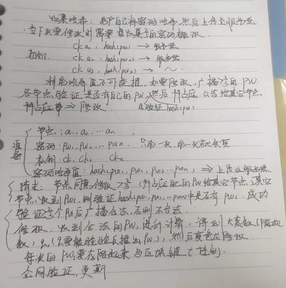
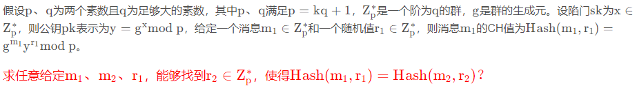

# 基础知识

1.变色龙去中心化

2.通过变色龙删除不需要的数据,==>轻量级


可变更区块链优化想法:



## 可编辑区块链方案

-    		这个方案就是让节点还是通过共识投票来决定区块信息可不可以修改，在实现的时候也比较便捷，因为共识过程就照一贯的机制来就好。唯一需要改变的是在区块结构中扩展了一个merkle树用来存储old state，这个root值用来做验证，矿工在自己挖出的下个区块中包含编辑请求的hash，就被认为是给编辑请求投赞成票了。

  ​		不足: 虽说任何人都可以来提出编辑请求，但是执行区块编辑的人需不需要是这个区块的主人呢？不然要怎么签名？而区块信息的改变必然引起区块hash的改变，这个区块后面做的验证是不是也无效了呢？

  

- 

  这个论文涉及到的密码学方法是变色龙哈希，在构成merkle树的时候留出一些余地，让不同的交易A、B向上产生分支节点H（A||B）时因为有了变色龙哈希的加持，能够得到相等的结果，这样拿着密钥的人就可以把装着旧交易的区块A，更换成装有新交易的区块B，还能保证hash不发生改变。

  

  **不足:**
  
  1. 缺乏内容验证, 算法修改数据时并不验证内容的正确性, 而仅通过变色龙哈希确保哈希链路的完整性, 因而掌握陷门的恶意用户可以任意篡改链上数据;   
  1. 中心化太严重,陷门只掌握在少数人手上
  1. 再次是存在陷门密钥曝光问题,验证者可以通过哈希碰撞推断出陷门密钥 (难度大)


```txt
https://blog.csdn.net/A33280000f/article/details/120685811?ops_request_misc=%257B%2522request%255Fid%2522%253A%2522166461111416782412563205%2522%252C%2522scm%2522%253A%252220140713.130102334..%2522%257D&request_id=166461111416782412563205&biz_id=0&utm_medium=distribute.pc_search_result.none-task-blog-2~all~sobaiduend~default-1-120685811-null-null.142^v51^control,201^v3^control_1&utm_term=%E5%8F%98%E8%89%B2%E9%BE%99%E5%93%88%E5%B8%8C&spm=1018.2226.3001.4187
```

## 一、哈希函数

哈希函数H a s h ( )是密码学中经常用到的一个函数（记住它并不是加密技术，独立于[非对称加密](https://so.csdn.net/so/search?q=非对称加密&spm=1001.2101.3001.7020)和对称加密之外的函数），任意大小的输入消息m mm经过哈希函数H ( ) 映射成一个固定长度的输出值h，通常称h为哈希值或哈希摘要，即h=H(m)

具有三个特别重要的性质：

1. **单向性**：从输入到输出的计算过程较为容易，而由输出值推出输入值是不可能的（计算上几乎不可能实现）
1. **抗碰撞性**：任意给定消息m，寻找m ′ ( m ′ ≠ m ) ，使得H ( m ′ ) = H ( m ) 在计算上是不可能的；
1. **高灵敏性**：输入若发生非常非常微小的变化（甚至加个标点符号或空格)，则输出值会发生巨大的变化（至少一半长的比特位变化）。

一句话概括哈希函数：将任意长度、类型或大小的字符串输入到哈希函数中，输出固定长度的字符串。

## 二、变色龙哈希函数

可以理解为变色龙哈希函数的某种情况下知道输出可以推出输入。

### **1.定义**：

任何人可以通过给定的公钥p k进行变色龙哈希后，拥有s k的用户可以广义地找到哈希碰撞，即使得C h _ H a s h ( m ′ ) = C h _ H a s h ( m ) 。

### 2.变色龙哈希函数4个主要的算法：

#### 2.1密钥生成算法

​	Ch_Gen (1 ^λ^ ) = ( pk , sk )，给定一个安全常数λ ，输出变色龙哈希的公钥pk 和私钥sk（陷门）


#### 2.2 哈希生成算法

Ch_Hash(pk,m,r)=(h,p)：输入公钥pk、随机数r和任意消息m，生成哈希值h和随机数p；


#### 2.3 哈希验证算法

***Ch_Ver(pk,m,(h,p))***：输入公钥pk、任意消息m和哈希值h、随机数p，若(h,p)是正确的哈希值，则输出1，否则输出0；


#### 2.4 哈希碰撞算法

**Ch_Cld(sk,m,m′,(h,p))**：输入私钥s k（陷门）、消息m、新消息m′和哈希值h、随机数p，输出新随机数r′，使得Ch_Ver(pk,m,(h,p))=Ch_Ver(pk,m′,(h,r′))=1。


## 三、变色龙哈希的安全需求

1. **抗碰撞性**：在没有陷门s k sksk的情况下，输入消息m1、随机数r1和消息m2，求满足Hash(m1,r1)=Hash(m2,r2)的整数r2是几乎不可能的。
1. **陷门碰撞**：在输入陷门sk后，对于任意的m1、r1，给定消息m2，可以计算出r2，满足Hash(m1,r1)=Hash(m2,r2)
1. **语义安全**：对于任意消息m1,m2，他们的Hash(m1,r1)和Hash(m2,r2)的概率分布在计算上是不可区分的。

## 四、变色龙哈希函数的构造



 群的生成元是指群的一个基本的元素集合，基于这个元素集合的组合运算可以生成所有其它的元素。

例1. 比如说循环群，元素集合{1}就是它的一个生成元集合。基于元素1，就可以生成所有其它元素，比如说，2=(1+1)%6, 3=(1+1+1)%6,0=(1+1+1+1+1+1)%6,等等。

这里g指的是群中的一个数..


## 五、应用实例

在将变色龙哈希应用至可编辑区块链时仅需对将构造交易头部哈希转变为变色龙哈希即可。当对之前某个区块进行修改时，构造新型𝑟′、𝑠′使得原有区块头哈希值保持不变但区块内容发生改变。


