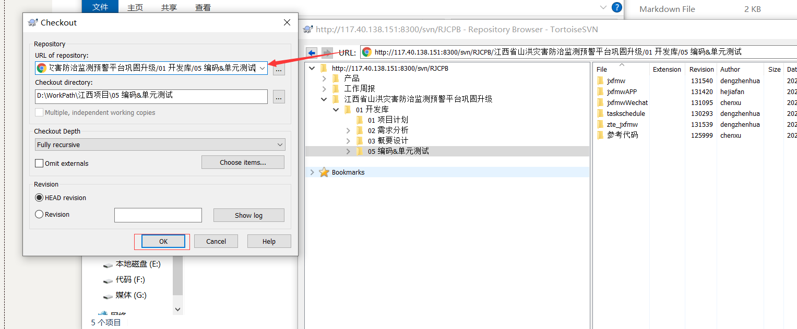

```txt
IP：10.81.66.103
MASK：255.255.255.0
网关：10.81.66.254
DNS：202.101.224.69

Svn地址：http://117.40.138.151:8300/svn/RJCPB
用户名：huarunsheng
密码：N5syiZRkBA

工时系统地址：http://pas.ztsco.com.cn/pas/system/layout/main.jsp
用户名：huarunsheng
密码：N5syiZRkBA
```

# 1.安装工具

路径:

D:\WorkPath\工具\TortoiseSVN-1.9.4.27285-x64-svn-1.9.4.msi

安装完右键会有个TortoiseSVN


## 2.进入项目

右击:


```txt
Svn地址：http://117.40.138.151:8300/svn/RJCPB
用户名：huarunsheng
密码：N5syiZRkBA
```


# 3.找到项目


# 4.根据项目目录建文件夹


# 5.下载资源

右击文件夹,


将路径复制到地址栏即可,然后等待下载成功




