# 1.安装工作任务平台

## 1.安装包地址

安装包:

D:\WorkPath\工具\TDClientSideInstallation.exe

资源压缩包:

D:\WorkPath\工具\Mercury Interactive.rar

## 2.安装

按默认安装D:\WorkPath\工具\TDClientSideInstallation.exe这个就行,安装完之后找到安装目录

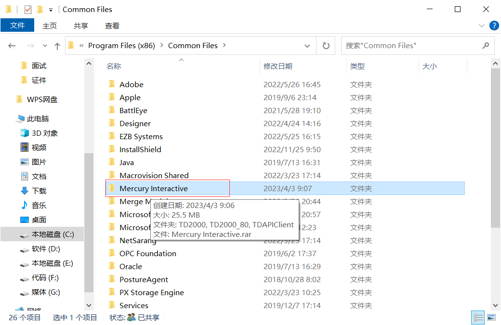

将资源文件复制到该目录下,并解压

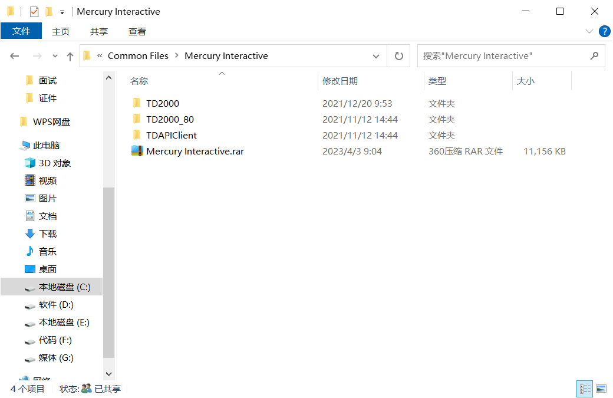

重复的文件就替换,选择全部替换.

最后,将应用程序入口,放入到桌面

C:\Program Files (x86)\Common Files\Mercury Interactive\TD2000

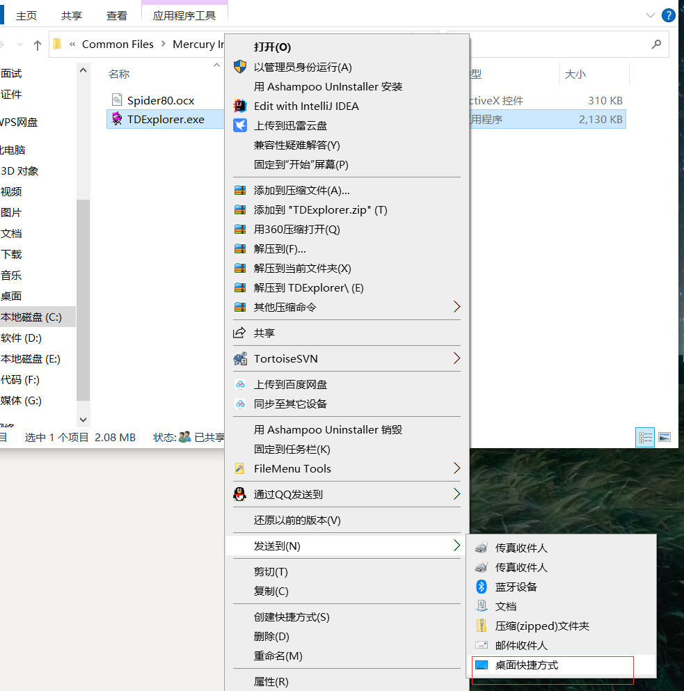

# 2.使用

任务地址:http://117.40.138.151:8073/tdbin

用户名:huarunsheng

无密码

## 1.打开

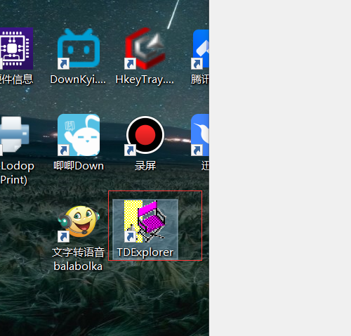

## 2.登录

任务地址:http://117.40.138.151:8073/tdbin

用户名:huarunsheng

无密码,密码为空

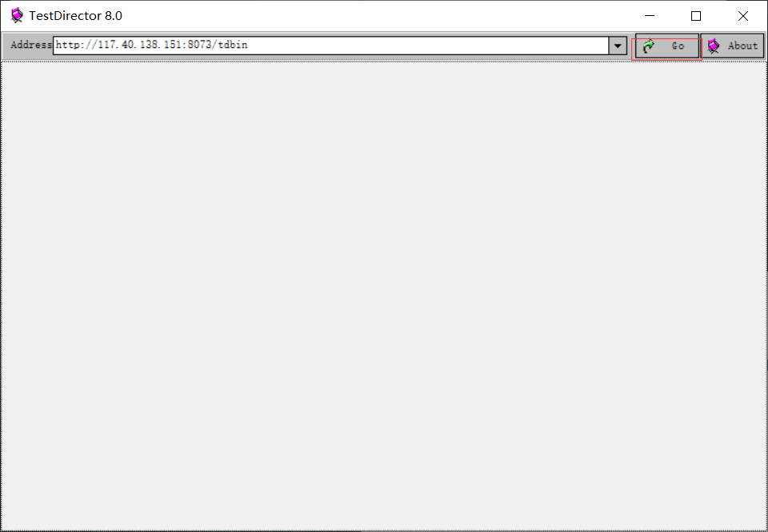

选择项目:

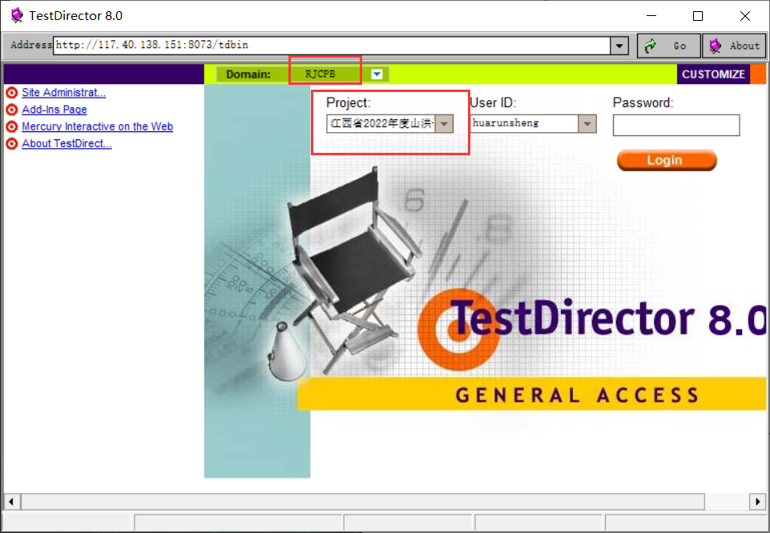

剩下的就是工作内容

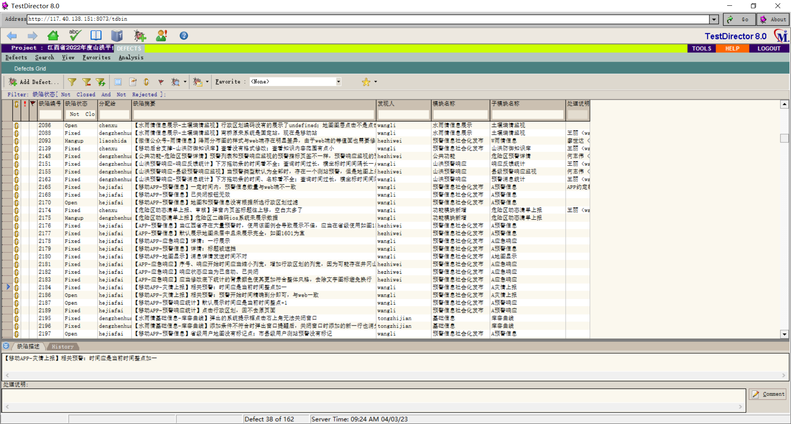

# 3.基本信息

## 1.缺陷状态

就是任务当前的状态:

1. open: 未修复
1. close:已修复
1. rejected: 已拒绝

closed和rejected不用管

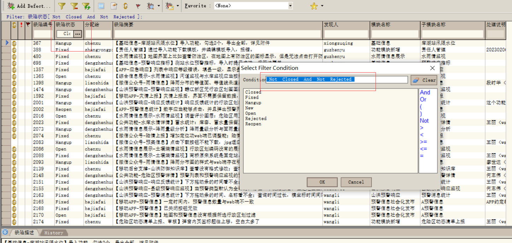

## 2.分配给

就是分配任务给谁

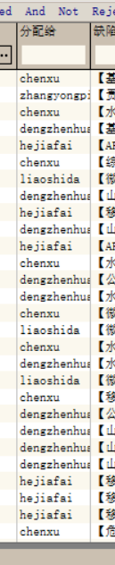

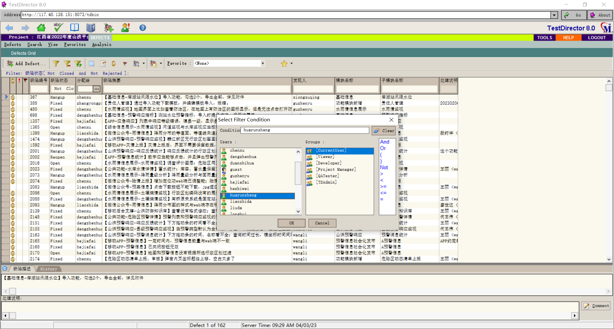

## 3.缺陷摘要

就是bug的详细描述

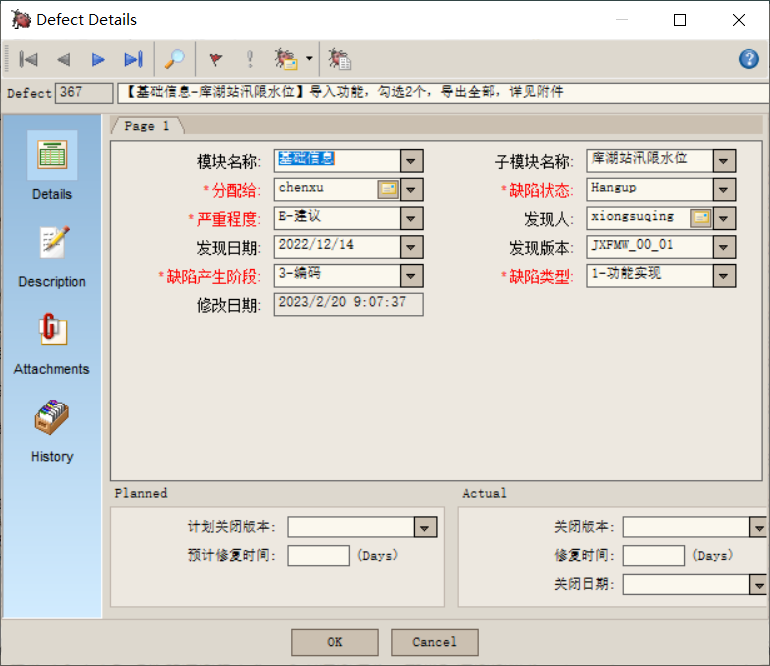

附件可直接双击查看

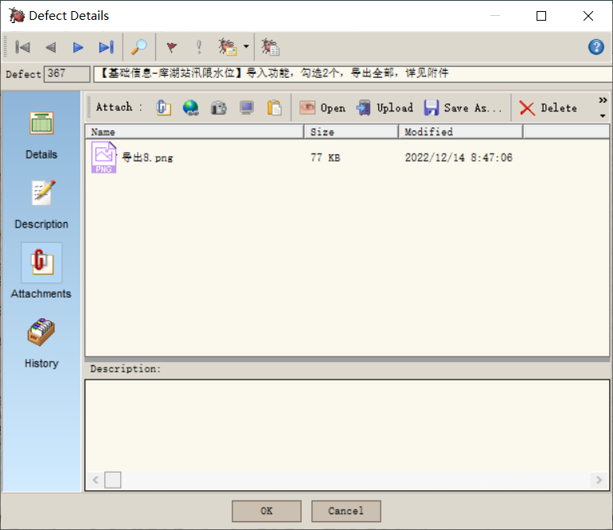

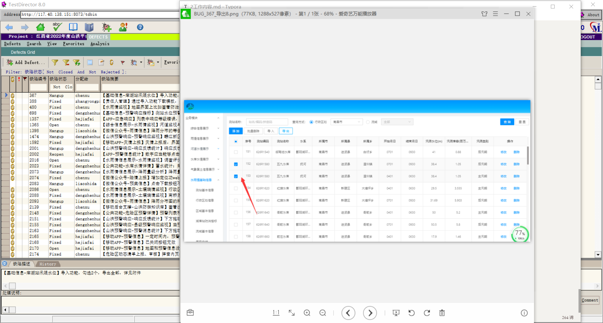

