# 1.bdss描述

将底层的代码实现自动化,让程序员只关注业务代码.

# 2.bdss数据库

## 1.连接

## 2.结构

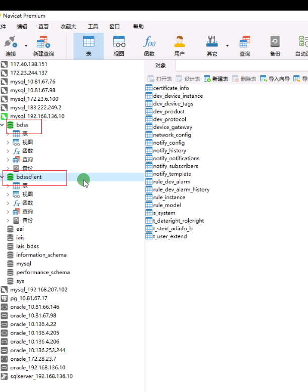

## 3.关系

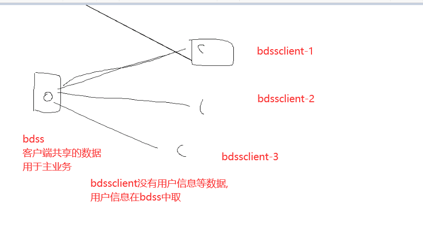

### 1.bdss

完成主业务,所有客户端都共享的数据

### 2.bdssclient

模板程序,每个项目都要改的数据

如共享的服务,如数据库,则使用bdss中的.如查询代码在bdss中执行

# 3.bdss项目结构

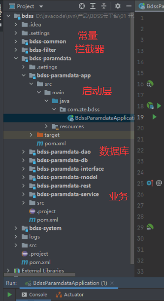

# 4.bass-paramdata-app模块

## 1.模块描述

由于使用如reids,rabbitmq,mybatis等第三方技术,会导致项目过于臃肿.部署项目时占用大量资源,也不好维护,所以就自己整合一些技术.

将一些配置放入到Java VM中(原因:如果放入到yaml文件中,会导致部署项目之后,想要修改就比较麻烦)

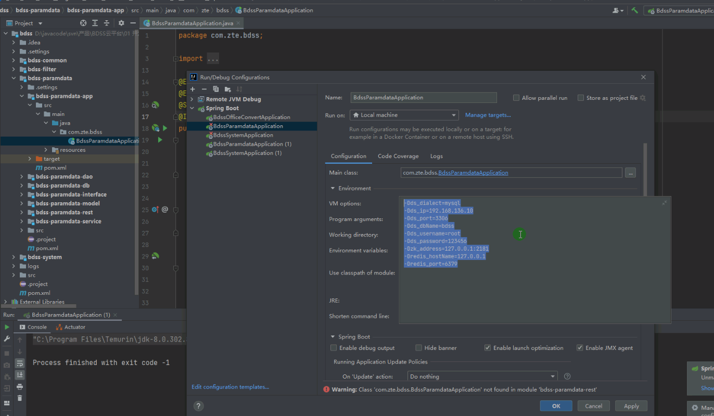

## 2.管理界面

运行前端和后端:

然后输入地址

### 1.数据源

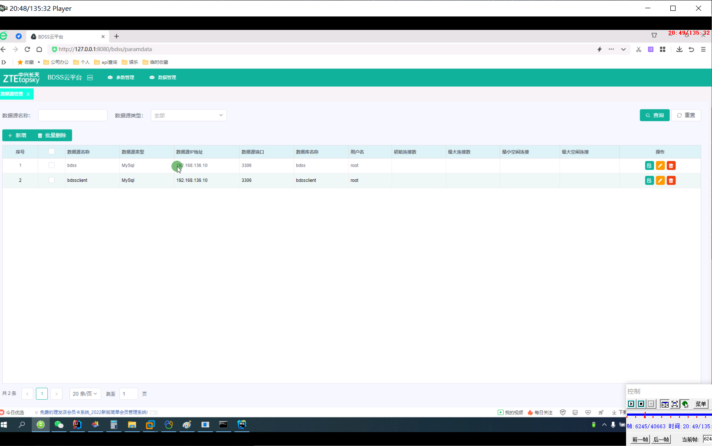

### 2.参数管理

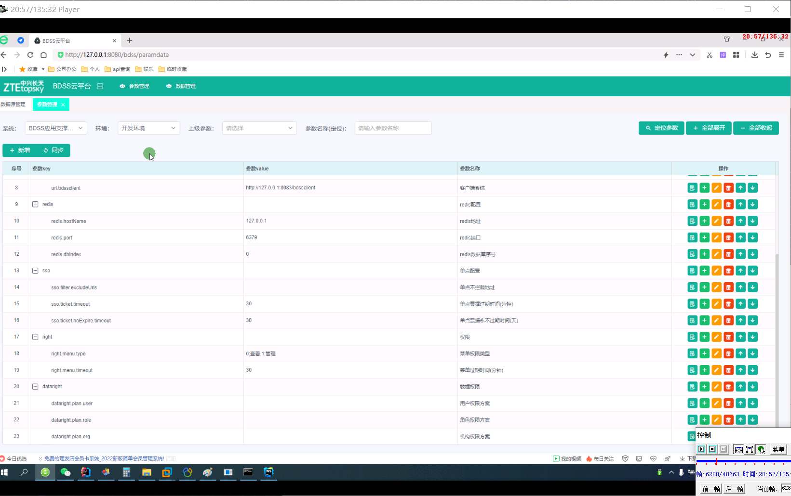

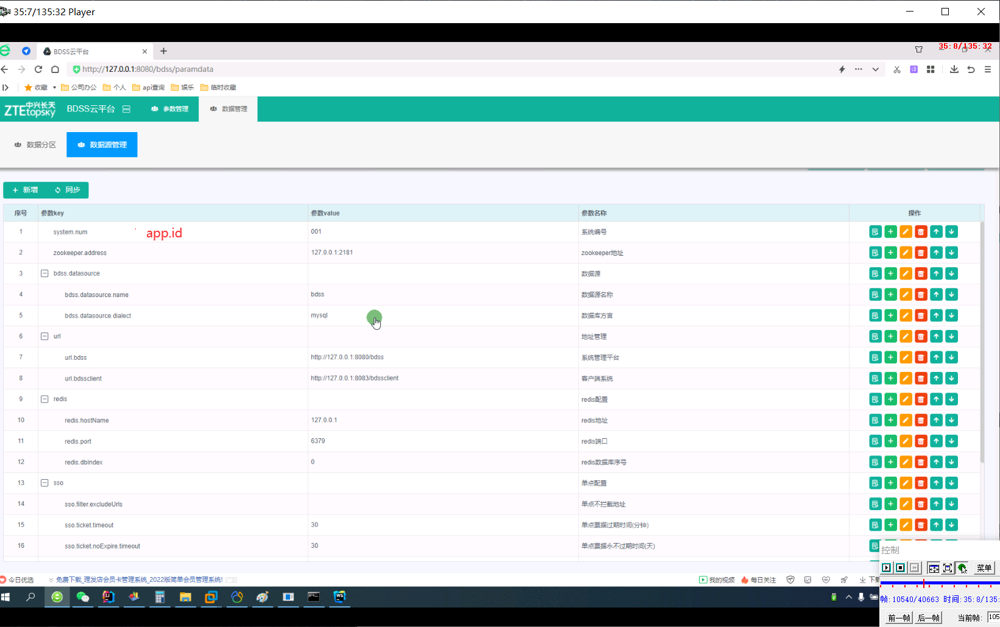

### 3.同步配置

新增需要的配置,然后点同步

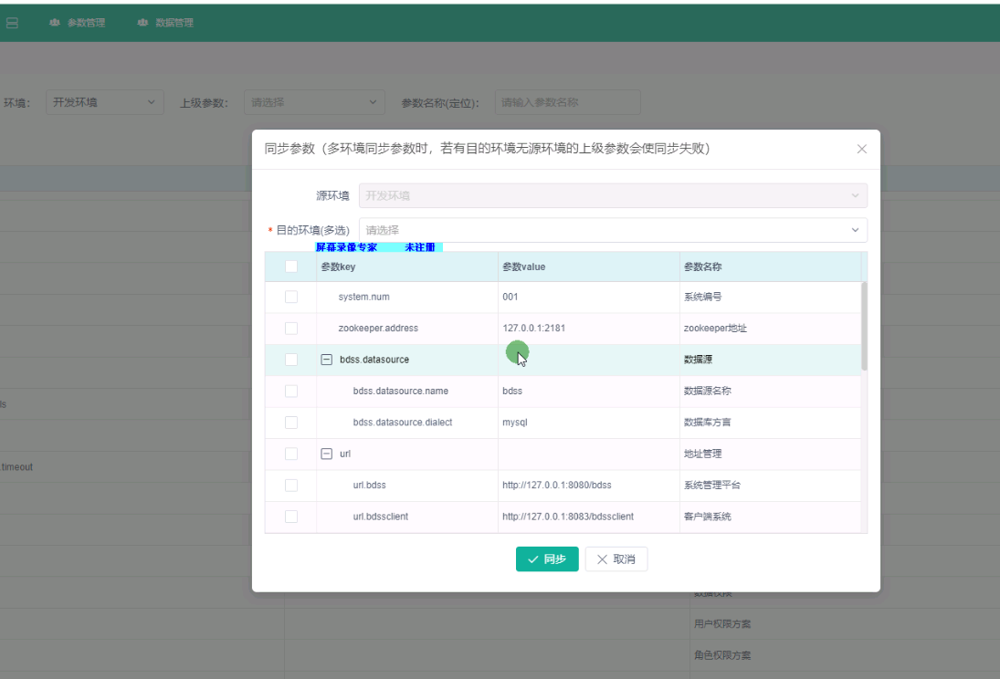

# 5.bdss-system-app

## 1.模块描述

系统开发一般在这里写,它会取指定端口中获取配置信息,然后同步到模块中.

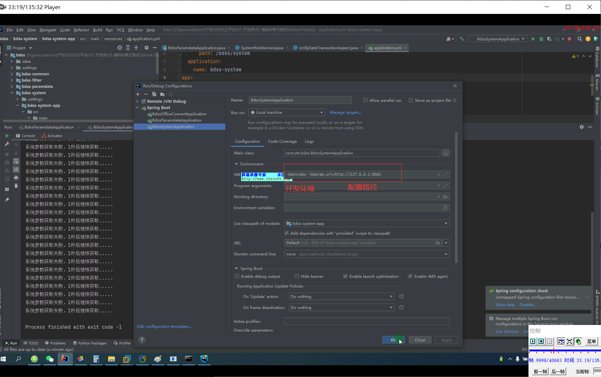

## 2.配置

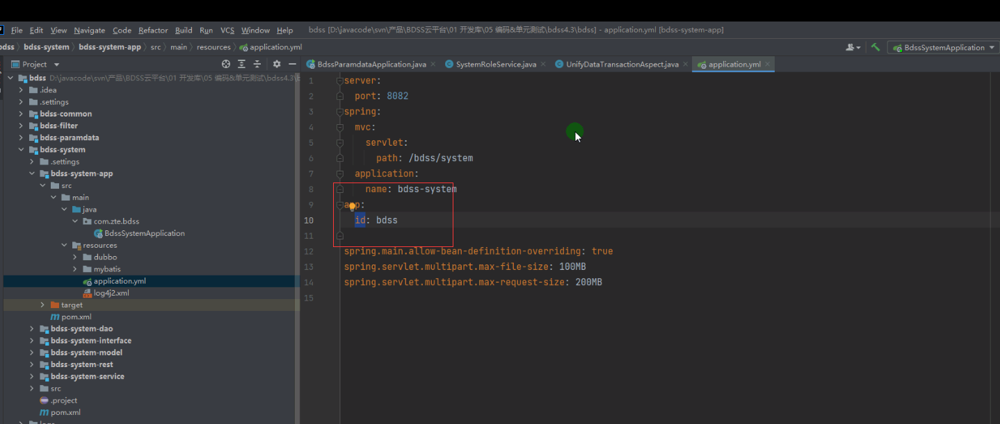

app.id 系统编号,用于取系统的参数

# 6.bdss界面

如bdss云平台,只是其中有个项目

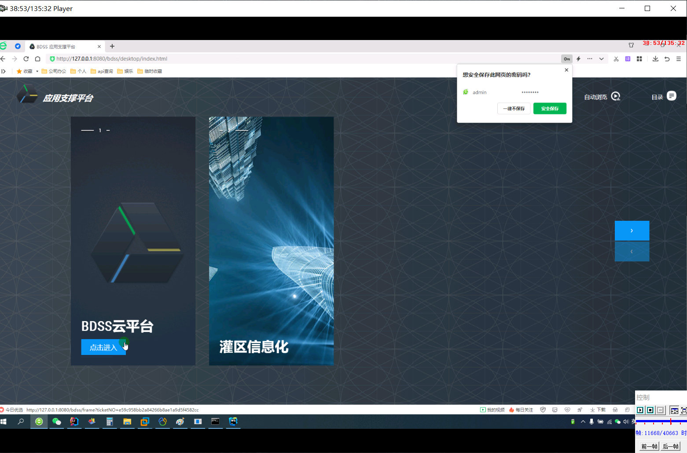

进入到主页面,默认是系统管理模块

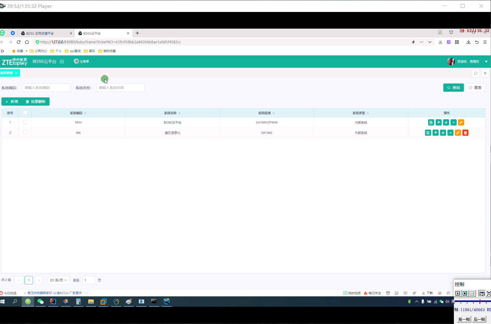

## 1.主菜单页面

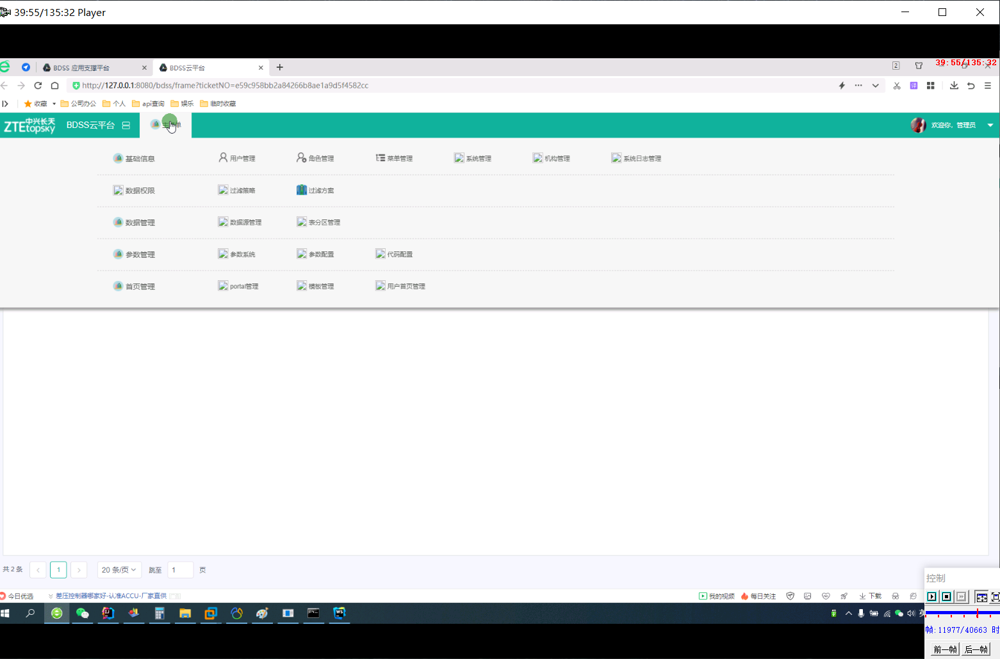

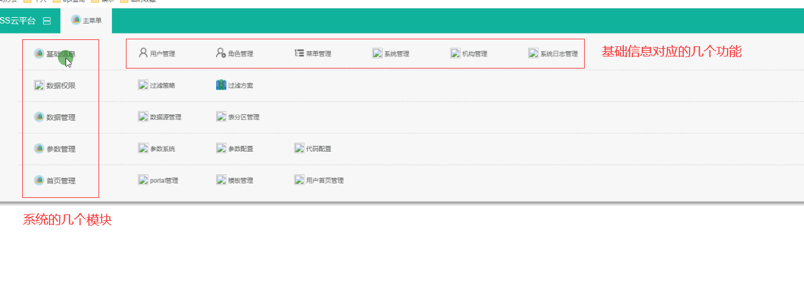

## 2.角色管理

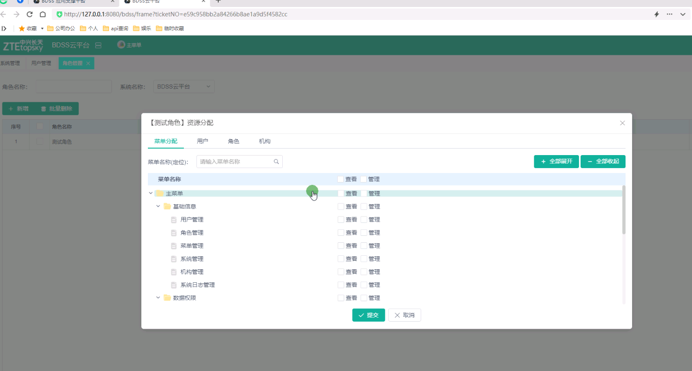

一个角色可以分配多个菜单

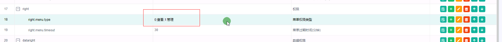

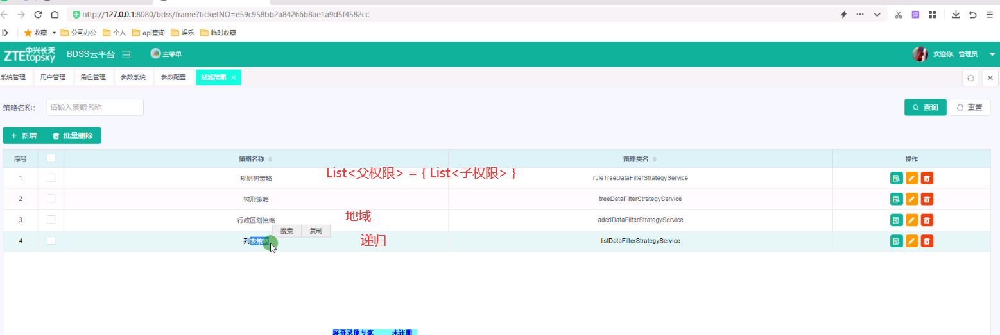

### 3.过滤方案

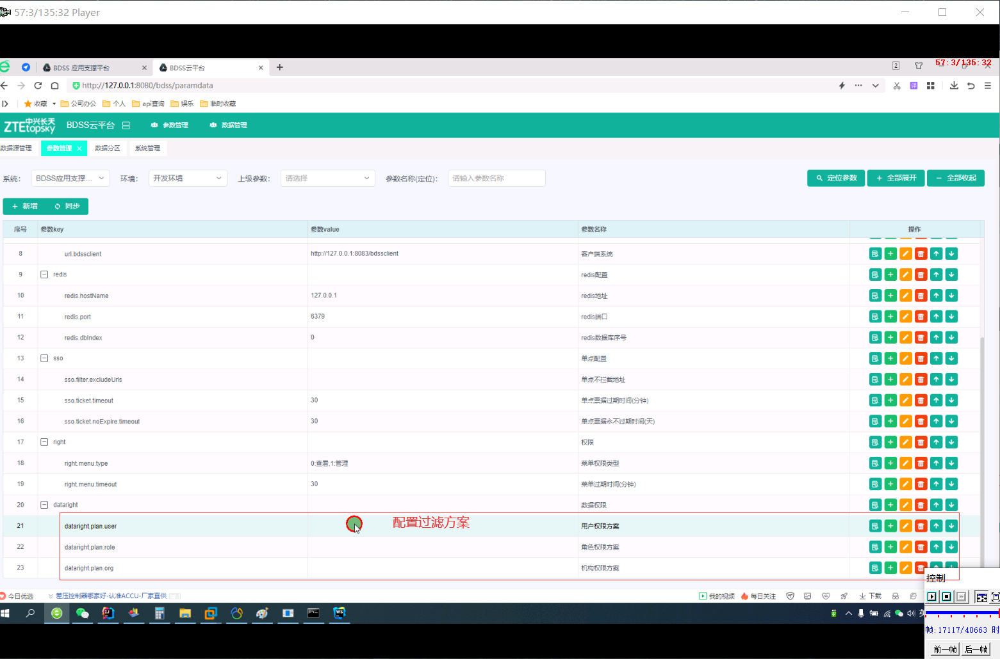

# 7.代码生成器

## 1.powerdesiger

设计数据库,生成数据库语句.

## 2.autocode工具

生成dao层,controller层,server层,model(entry)层,生成视图层代码

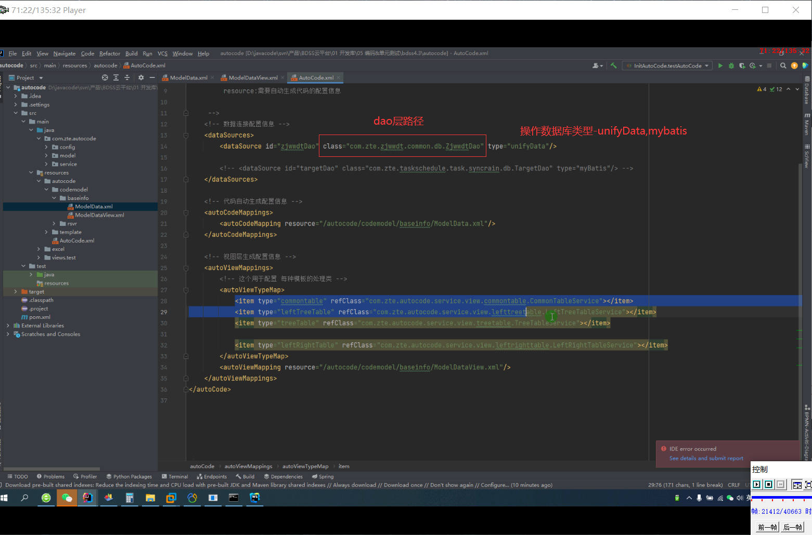

