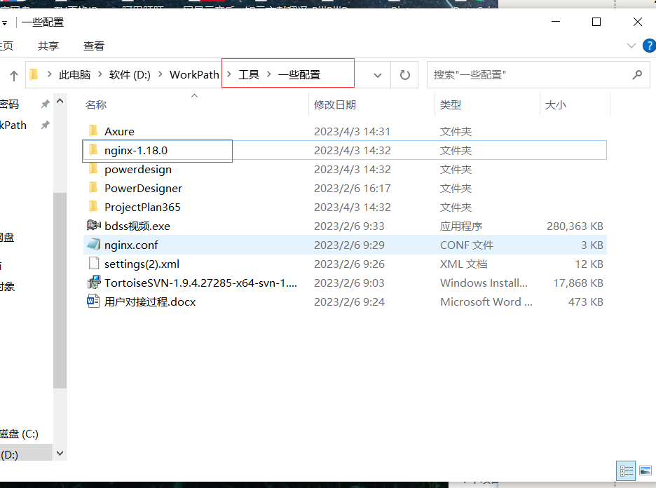
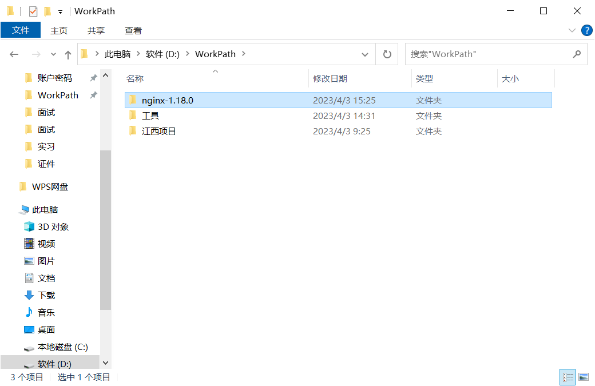
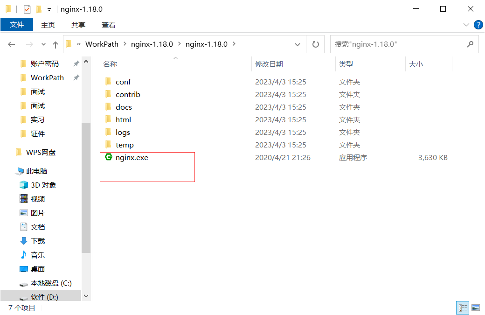
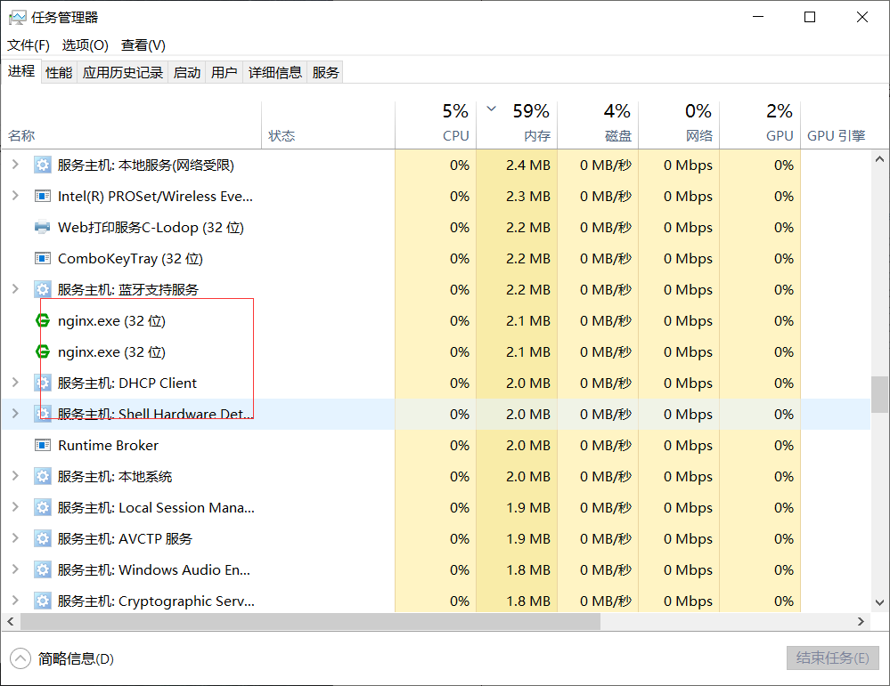
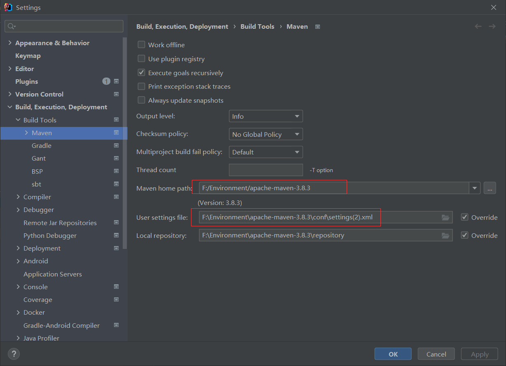
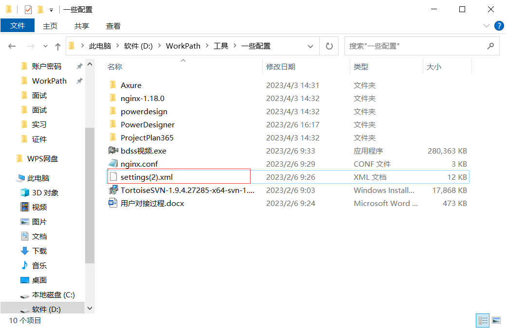
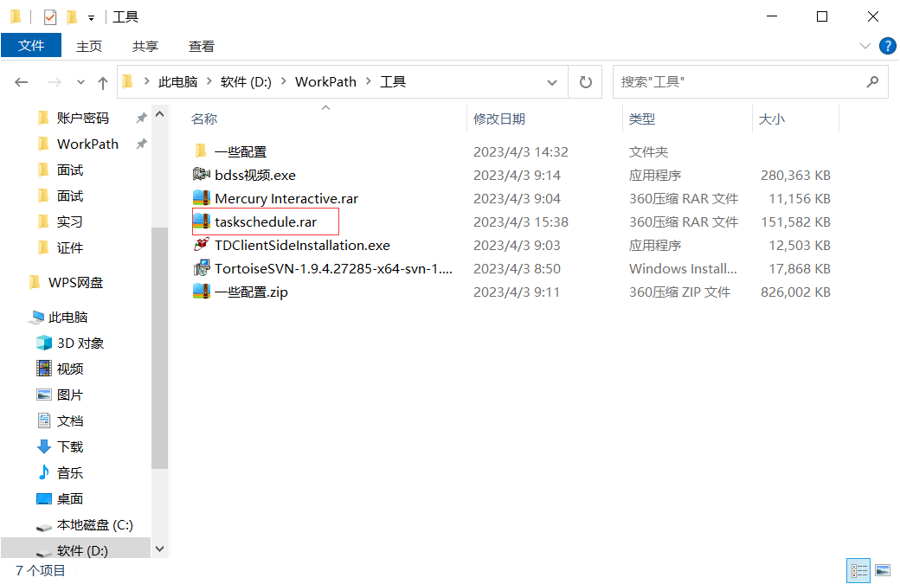
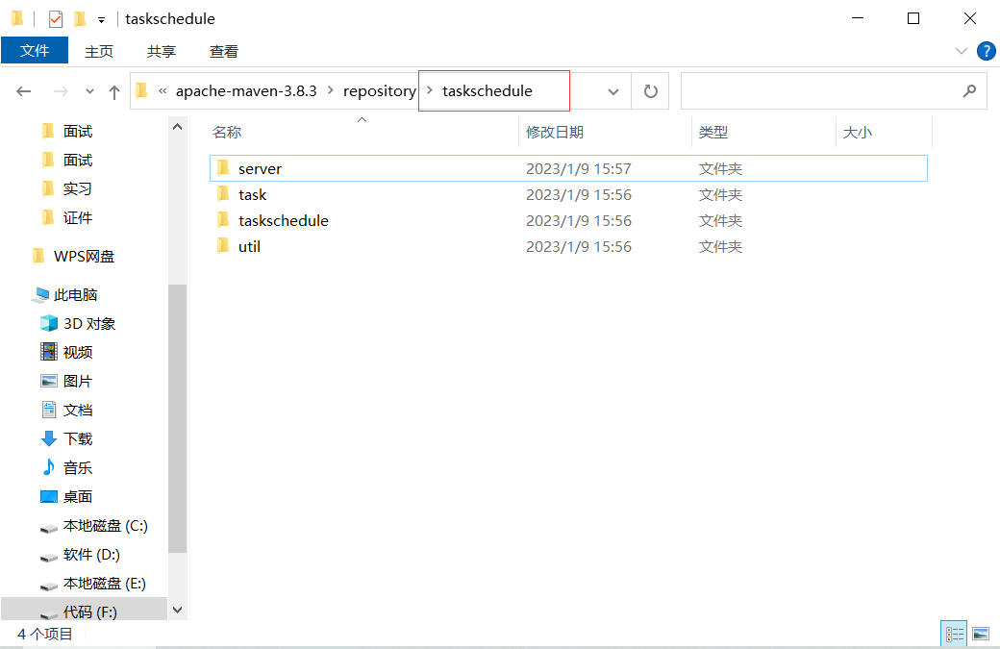
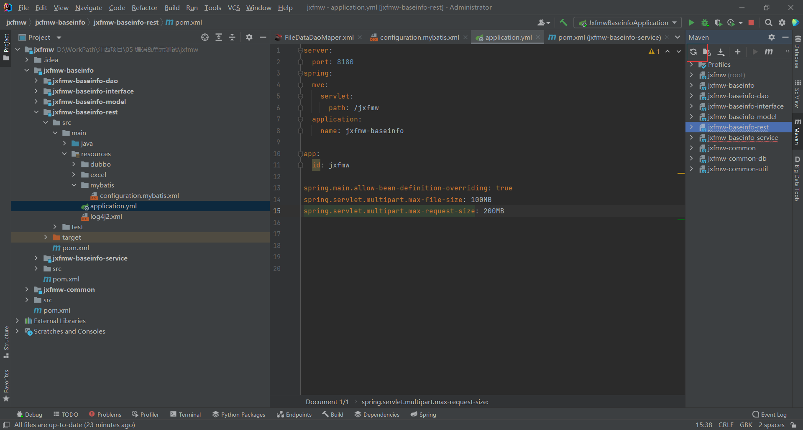

# 1.运行nginx

## 1.注意

nginx目录不能有中文,否则启动失败.

## 2.将nginx放置到纯英文目录下

## 3.双击nginx.exe

双击后,会一闪,去任务栏管理器中查看是否启动成功.

# 2.运行后端项目

-Denv=dev -Dparam_url=http://10.81.67.124:8080

## 1.下载项目

G:\Document\mdNote\实习\1下载项目资源.md

最好放入到英文路径

项目地址:D:\WorkPath\江西项目\05 编码&单元测试\jxfmw

## 2.用idea打开项目

## 3.导入bdss依赖配置

### 1.查看maven仓库

### 2.使用公司的setting

D:\WorkPath\工具\一些配置\settings(2).xml

将setting配置文件复制到maven中,然后给项目配置

F:\Environment\apache-maven-3.8.3\conf\settings(2).xml

文件路径.

## 3.任务调度库

将D:\WorkPath\工具\taskschedule.rar,解压到maven仓库中

## 4.刷新maven即可

