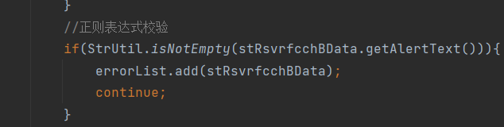
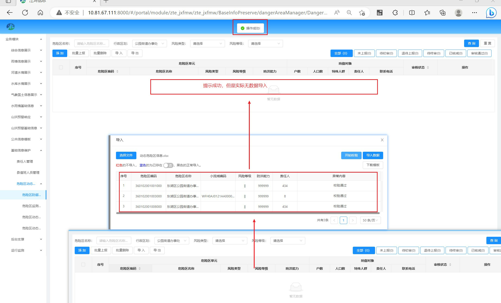
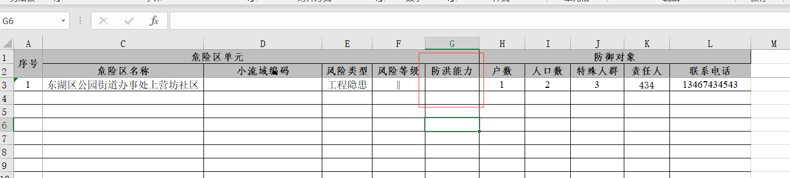
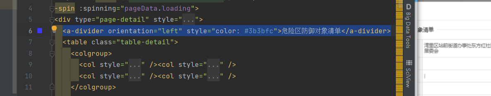
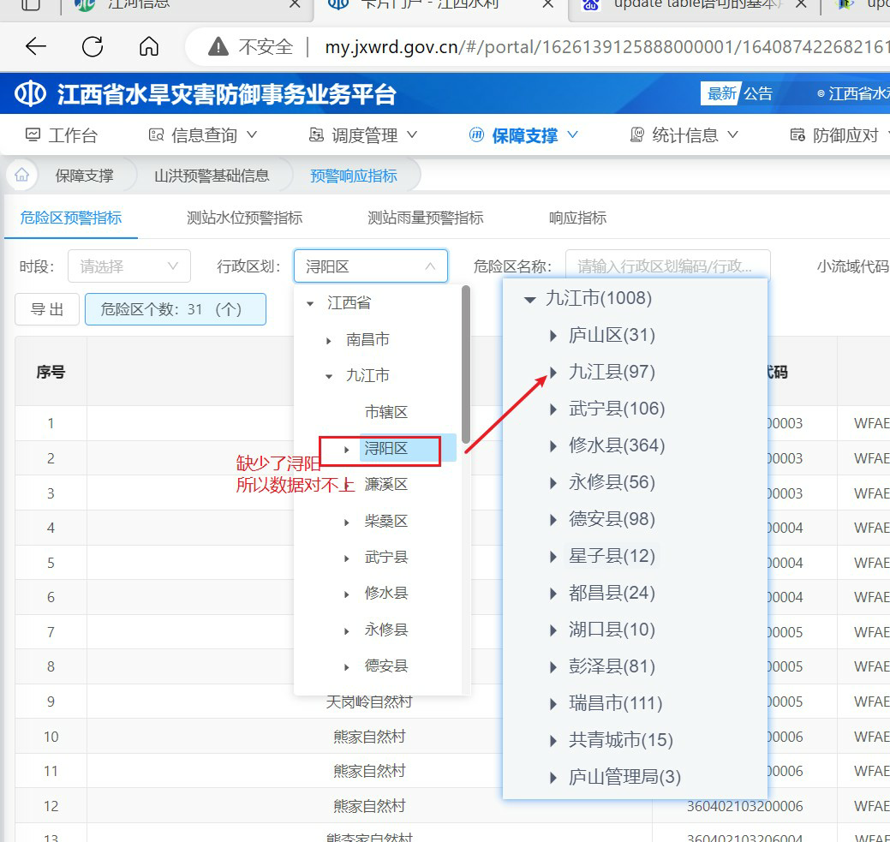
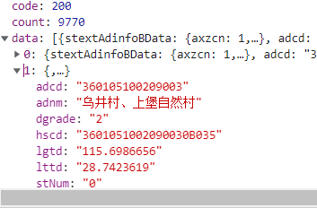

# 1.连接到公司的数据库

http://10.81.67.97:8080/bdss/paramdata

进入到数据源管理


然后里面就会有具体的连接信息


然后连接数据库


# 1.查看bug

查看自己的任务,然后下载附件,查找问题


# 2.查找前端代码

## 1.根据描述信息

,查找前端的代码所在位置.

1. 【库湖站防洪指标】导入Excel，测站某列的值不符合导入要求，检测界面会出现两条一样的测站信息

描述中的标题是-**库湖站防洪指标**-,是一个子页面,去前端路由里面找到该页面.


## 2.按两下shift,或ctrl+f

输入**库湖站防洪指标** 如果找不到,可能是名字不一样,删减一下查找字符


### 3.找到前端页面

根据父component和子component找到前端所在页面.


# 3.操作一遍


## 1.由于bug是导入问题

首先导入附件中的excel


点击开始校验,

## 2.查看后端请求


# 4.查看后端代码

根据请求,找到后端所在位置

请求网址: 

http://127.0.0.1:8180/jxfmw/api/baseinfo/stRsvrfcchBData/validateImportStRsvrfcchBData.rest

查找:validateImportStRsvrfcchBData


# 4.分析代码


```java
	@RequestMapping("validateImportStRsvrfcchBData.rest")
	public ResponseEntity<String> validateImportStRsvrfcchBData(final BaseinfoConditionData conData,final HttpServletRequest request) throws Exception{
		return ProcessUtil.restForJson(jsonObject -> {
			//设置当前操作人
			conData.setOperUser(SSOUtil.getUsername(request));
			try{
				Map<String, List<StRsvrfcchBData>> parsedMap = stRsvrfcchBDataService.validateImportStRsvrfcchBData(conData);
				if(CollUtil.isEmpty(parsedMap)){
					throw StatusCodeExceptionFactory.createStatusCodeException(StatusCodeConstantData.PUB_PARAM_ERROR,"无数据或解析失败！");
				}
				//得到验证结果list（错误的数据，通过的数据（新增，更新））
				List<StRsvrfcchBData> allList = parsedMap.get(CommonConstantData.ALL_LIST);
				if(CollUtil.isEmpty(allList)){
					throw StatusCodeExceptionFactory.createStatusCodeException(StatusCodeConstantData.PUB_PARAM_ERROR,"无数据！");
				}
				//将数据存入到redis中
				SessionRedisUtil.setSession(redisTemplate, SSOUtil.getTicket(request), "SESSION_DATA_StRsvrfcchBData", parsedMap);
			}catch (Exception e) {
				throw StatusCodeExceptionFactory.createStatusCodeException(StatusCodeConstantData.PUB_PARAM_ERROR,ExceptionUtil.getMessage(e));
			}
		});
	}
```


# 5.分析具体方法

找到大致问题所在,就进入到具体代码中. ctrl+B


转到接口后,再进入到实现类


进入到校验代码:ctrl+单击

```Java

    /**
	 * 校验导入的库(湖)站防洪指标信息数据 返回检验结果，包括错误数据，待插入数据，待更新数据等
	 * @param errorList 校验错误的集合
	 * @param updateList 需要更新的集合
	 * @param insertList 需要插入的集合
	 * @param stRsvrfcchBDataList 导入的库(湖)站防洪指标信息集合
	 * @param operUser 操作用户
	 */
	private void validateImportStRsvrfcchBData(List<StRsvrfcchBData> errorList,
			List<StRsvrfcchBData> updateList,
			List<StRsvrfcchBData> insertList,
			List<StRsvrfcchBData> stRsvrfcchBDataList,
			String operUser){
		//TODO (这里默认加载所有数据，这里需要根据实际情况，进行加载，改完需要将TODO去除) 从数据库中加载已存在的库(湖)站防洪指标信息,用于判断已存在的信息
		//遍历stRsvrfcchBDataList对应的测站和对应的防洪指标数据
		StringBuilder stcdStr = new StringBuilder();
		for (StRsvrfcchBData stRsvrfcchBData : stRsvrfcchBDataList) {
			//正则表达式校验
			/*if(StrUtil.isNotEmpty(stRsvrfcchBData.getAlertText())){
				errorList.add(stRsvrfcchBData);
				continue;
			}*/
			stcdStr.append(stRsvrfcchBData.getStcd()+",");
		}
		Set<String> existRsvrcchSet = new HashSet<>();
		Set<String> existStcdSet = new HashSet<>();
		if (stcdStr.length()>0){
			stcdStr=stcdStr.deleteCharAt(stcdStr.length()-1);
			BaseinfoConditionData rsvrCchConData = new BaseinfoConditionData();
			rsvrCchConData.setStcd(stcdStr.toString());
			List<StRsvrfcchBData> existStRsvrfcchBDataList = stRsvrfcchBDataDao.queryStRsvrfcchBDataList(rsvrCchConData);
			List<StStbprpBData> stcdList = stStbprpBDataDao.queryStStbprpBDataList(rsvrCchConData);

			if (existStRsvrfcchBDataList!=null&&existStRsvrfcchBDataList.size()>0){
				for (StRsvrfcchBData stRsvrfcchBData : existStRsvrfcchBDataList) {
					existRsvrcchSet.add(stRsvrfcchBData.getStcd());
				}
			}
			if (stcdList!=null&&stcdList.size()>0){
				for (StStbprpBData stStbprpBData : stcdList) {
					existStcdSet.add(stStbprpBData.getStcd());
				}
			}
		}
		//申明excel本身数据重复记录map
		Set<String> duplicateSet = new HashSet<>();

		//遍历导入的库(湖)站防洪指标信息集合
		for(StRsvrfcchBData stRsvrfcchBData:stRsvrfcchBDataList){
			//数据重复校验
			if(!duplicateSet.contains(stRsvrfcchBData.getStcd())){
				duplicateSet.add(stRsvrfcchBData.getStcd());
			}else{
				stRsvrfcchBData.setAlertText("数据重复");
				errorList.add(stRsvrfcchBData);
				continue;
			}
			//正则表达式校验
			if(StrUtil.isNotEmpty(stRsvrfcchBData.getAlertText())){
				errorList.add(stRsvrfcchBData);
				continue;
			}
			//TODO 在这里加入其它业务级校验
			if(!existStcdSet.contains(stRsvrfcchBData.getStcd())){
				stRsvrfcchBData.setAlertText("测站不存在");
				errorList.add(stRsvrfcchBData);
				continue;
			}

			//已存在校验
			if(existRsvrcchSet.contains(stRsvrfcchBData.getStcd())){
				//修改
				stRsvrfcchBData.setAlertText("已存在");
				updateList.add(stRsvrfcchBData);
				continue;
			}
			//修改
			stRsvrfcchBData.setAlertText("校验通过");
			insertList.add(stRsvrfcchBData);
		}
	}
}
```

发现正则表达验证errlist添加了两次




修改代码,再测试,直到成功

# 6.提交代码

修改bug成功后,就把任务设置为fixed


最后将代码提交


# 7.工作

## 1.【库湖站汛限水位】导出的Excel列头和提供的标准模板列头不一致


```txt
http://127.0.0.1:8180/jxfmw/api/baseinfo/stRsvrfsrBData/exportStRsvrfsrBDataList.rest?stcd=&adcd=360000000000000&bscd=&orderBy=stcd%20asc&authToken=cx1&authAdcd=&r=0.1512961237808943
http://127.0.0.1:8180/jxfmw/api/baseinfo/stRsvrfsrBData/exportStRsvrfsrBDataList.rest?stcd=&adcd=360000000000000&bscd=&orderBy=stcd%20asc&authToken=cx1&authAdcd=&r=0.07288489963386735
```

修改文件:

```txt
D:\WorkPath\江西项目\05 编码&单元测试\jxfmw\jxfmw-baseinfo\jxfmw-baseinfo-rest\src\main\java\com\zte\jxfmw\baseinfo\rest\StRsvrfsrBDataRest.java
```

```txt
模板:
http://127.0.0.1:8180/jxfmw/api/baseinfo/stRsvrfsrBData/downStRsvrfsrBDataExcelModel.rest?authToken=cx1&authAdcd=&r=0.9312817313529427
```

```txt
获取【库湖站汛限水位】数据:
http://127.0.0.1:8180/jxfmw/api/baseinfo/stStbprpBData/queryStcdDataPager.rest
```


```java
模板:
ExcelUtil.model2Excel(outStream, "StRsvrfsrBDataImport", "库（湖）站汛限水位信息", null);
ExcelUtil.model2Excel(outStream, "StRsvrfsrBData", "库（湖）站汛限水位信息", stRsvrfsrBDataList);
```

## 2.排序

排序可以在dao层写,也可以在xml文件中写,尽量在dao层中做

如:


如果在xml层,要这样写


```
<![CDATA[ order by STATUS,TM desc ]]>
```

前面不需要写别名,可以写表名.


## 4.导出的excel与模板不一致

### 1.bug描述

【预警响应指标-测站雨量预警指标】导出的Excel列头与提供的模板列头不一致

导入检测界面的列头与模板一致，建议以模板的列头为准修改导出Excel的列头


### 2.查找

未修改文件:

D:\WorkPath\江西项目\bug修改\5.表头不一致\RainWarnRuleBDataService.java

导出excel数据:

```txt
http://127.0.0.1:8180/jxfmw/api/rmtes/warn/rainWarnRuleBData/exportRainWarnRuleBDataList.rest?adcd=360100000000000&stcdOrStnm=&query=true&authToken=cx1&authAdcd=&r=0.2972419853174275
```

下载模板:

```txt
http://127.0.0.1:8180/jxfmw/api/rmtes/warn/rainWarnRuleBData/downRainWarnRuleBDataExcelModel.rest?authToken=cx1&authAdcd=&r=0.21639640020088735
```

根据exportRainWarnRuleBDataList找到rest层,再找到service层


注意,修改列


```
columnParam = new ColumnParam();columnParam.setStyle("width:24px;"); columnParam.getHeader().setContent("行政区划代码(*)"); columnParam.setProperty("ADCD"); columnParam.getHeader().setCell(0); columnParam.getHeader().setRow(0); columnParam.setStart(0); columnParamList.add(columnParam);
		columnParam = new ColumnParam();columnParam.setStyle("width:24px;"); columnParam.getHeader().setContent("行政区划名称"); columnParam.setProperty("ADNM"); columnParam.getHeader().setCell(1); columnParam.getHeader().setRow(0); columnParam.setStart(0); columnParamList.add(columnParam);
		columnParam = new ColumnParam();columnParam.setStyle("width:24px;"); columnParam.getHeader().setContent("测站数量"); columnParam.setProperty("COUNTS"); columnParam.getHeader().setCell(2); columnParam.getHeader().setRow(0); columnParam.setStart(0); columnParamList.add(columnParam);

```


后面也有列,对所有的列先后移一位.


## 5.【危险区动态管理-危险区防御对象清单】无法通过导入Excel录入数据




找到导入请求:

```txt
http://127.0.0.1:8180/jxfmw/api/rmtes/warn/dydaInfoBData/importDydaInfoBData.rest
```

错误:

```txt
: java.sql.BatchUpdateException: ORA-01438: 值大于为此列指定的允许精度 
```

经过排查是防洪能力精度不够,只支持0-99999,可以修改数据库的字段大小.也可以设置校验,校验长度为1-5



校验请求:

```txt
http://127.0.0.1:8180/jxfmw/api/rmtes/warn/dydaInfoBData/validateImportDydaInfoBData.rest
```

找到excel验证所在地:

D:\WorkPath\江西项目\05 编码&单元测试\jxfmw\jxfmw-baseinfo\jxfmw-baseinfo-rest\src\main\resources\excel\excelxml\warn\DydaInfoBDataMapping.xml


D:\WorkPath\江西项目\05 编码&单元测试\jxfmw\jxfmw-baseinfo\jxfmw-baseinfo-rest\src\main\resources\excel\ValidationRule.xml


验证格式为5位数


## 6.前端value长度验证

### 1..找到所在页面

shift+shift 直接在项目中查找


### 2.找到具体位置

根据showEdit找到<danger-area-data-edit,然后ctrl+单击到具体的对话框中


定位到对话框:


根据后端找到具体的字段:


然后修改验证格式

```vue
fca: [
  {validator: this.$verifyUtil.validator('decimal', '5,0,+'), trigger: 'change'}
],
```

表示fca的值,长度最大为5,最小值为0,且为正数


## 7.危险区编号为空

数据:

row: 为这一列的数据

```
this.modalData.data = {
  modalTitle: "修改",
  adcd: row.adcd,
  status: row.status,
};
```


绑定数据有点问题,绑定即可.


## 8.【危险区动态管理-危险区防御对象清单】修改窗口，修改数据后点击确定，数据不会正确更新

```txt
修改:
http://127.0.0.1:8180/jxfmw/api/rmtes/warn/dydaInfoBData/addOrUpdateDydaInfoBData.rest
上报:
http://127.0.0.1:8180/jxfmw/api/rmtes/warn/dydaInfoBData/updateAndBack.rest
查找:
http://127.0.0.1:8180/jxfmw/api/rmtes/warn/dydaInfoBData/queryDydaInfoBDataPager.rest
```

排查得知,adcd没传入:


而MySQL是根据adcd更新的.


所以这里是前端问题

前端没有将adcd传入.


## 9.【移动后台支撑-意见反馈信息】处理：处理意见与附件太紧贴了


```vue
          <a-form-model-item  label="上传附件:">
            <viewer
                class="viewer"
                ref="viewer"
                :images="pics"
                v-if="pics.length != 0"
                style="width: 100%; height: 100%; background-repeat: no-repeat;margin-bottom: 10px;margin-top: 10px"
            >
              <!--  -->
              
            </viewer>
```

margin-bottom: 10px;margin-top: 10px"即可


## 10.【基础信息维护-危险区动态管理】查看面板中表格左上角标题颜色应

shift+shift查找对应字段就行: 危险区防御对象清单





## 11.左上角危险区总个数与山洪灾害洪水风险系统中预警指标成果表的总数不一致

### 两个问题：

1、江西水旱灾害平台的【预警响应指标-危险区预警指标】左上角危险区总个数
与山洪灾害洪水风险系统中预警指标成果表的总数不一致，应该是由于缺少了浔阳区的原因
2、行政区划选择浔阳进行查询，危险区统计处未正确查询出来，显示的还是上一次查询其他行政区的
数量




目前是9763


### 2.问题原因

查询浔阳区时没有反应.


```txt
请求:
http://127.0.0.1:8180/jxfmw/api/rmtes/warn/warnRuleExtData/queryWarnRuleExtDataPager.rest
浔阳区代码:360403000000000

```


```txt
conData.setAdcdLike(AdcdUtil.getAdcdLike(conData.getAdcdLike()));
System.out.println("浔阳区编码:"+conData.getAdcdLike());
浔阳区编码:360403%
```

经过排查,是因为数据库没有浔阳区的数据.返回的是空,但返回空前端应该清除数据


没有清除是因为没有判断有没有返回数据,导致返回为空时也去取数据,导致获取空地址错误,这里加个数组判断即可.

```vue
res.data.data.length > 0
```

## 12.删除问题


前端没有判断数据是否存在,发请求时发不过去.

```txt
http://127.0.0.1:8180/jxfmw/api/rmtes/message/messageSendRData/queryMessageSendRDataPager.rest
```

时间正确的格式


当清除时间后:


可见,字符串为空,要进行一个空值判断


## 13.批量删除没有反应


```txt
批量删除请求
http://127.0.0.1:8180/jxfmw/api/rmtes/message/messageSend/deleteGroup.rest
```

而单个删除有效果:

```txt
http://127.0.0.1:8180/jxfmw/api/rmtes/message/messageSend/deleteGroup.rest

参数:002167748424251100096
```


目前看,应该是批量删除时,获取到的groupNo有问题,获取到的是序号.

可以通过onchange中的checkArr找到列数据,在从中获取no


## 14.超链接颜色



```txt
{
  "stextAdinfoBData": {
    "cnnm": "湾里区",
    "cultiArea": 178.25,
    "landArea": 0,
    "lttd": "28.742362",
    "vtnm": "招贤镇",
    "house": 78,
    "tmnm": "乌井村、上堡自然村",
    "adnm": "乌井村、上堡自然村",
    "prcd": "360000000000000",
    "lgtd": "115.698666",
    "vcnm": "乌井村",
    "ctnm": "南昌市",
    "pstextAdinfoBData": {
      "axzcn": 1,
      "moditime": "2023-04-07 09:50:09",
      "padcd": "360105100000000",
      "cultiArea": 464.72,
      "landArea": 7.6,
      "adcd": "360105100209000",
      "lttd": "28.739656",
      "house": 320,
      "adnm": "乌井村",
      "population": 888,
      "azrcn": 5,
      "household": 320,
      "lgtd": "115.718082",
      "prevtp": "1"
    },
    "moditime": "2023-04-07 09:50:09",
    "cncd": "360105000000000",
    "padcd": "360105100209000",
    "vtcd": "360105100000000",
    "adcd": "360105100209003",
    "tmcd": "360105100209003",
    "population": 218,
    "prnm": "江西省",
    "household": 78,
    "vccd": "360105100209000",
    "prevtp": "1",
    "ctcd": "360100000000000"
  },
  "adcd": "360105100209003",
  "wscd": "WFH0AJ0121A00000-81",
  "lttd": "28.7423619",
  "adnm": "乌井村、上堡自然村",
  "stNum": "0",
  "dgrade": "2",
  "lgtd": "115.6986656",
  "hscd": "3601051002090030B035"
}
```

根据columns定位到表格中.


定位到adnm,将超链接颜色设为黑色


## 15.翻页组件


```vue
正常翻页组件:
        <div style="margin-top: auto; display: flex">
          <a-pagination
            style="margin-left: auto"
            :current="page"
            :pageSize="limit"
            @change="onPagerChange"
            class="pagination"
            :total="total"
            :show-total="(total) => '共有' + total + '条'"
            :page-size.sync="limit"
            :page-size-options="pageSizeOptions"
            show-size-changer
            @showSizeChange="onShowSizeChange"
          />
```


缺少这条

## 16.a-form-model-item


原本:

```vue
<a-descriptions-item lable="标题">
  {{ lookInfo.title }}
</a-descriptions-item>
```

效果:


需要给lable足够的宽度:

```vue
<a-descriptions-item>
  <template v-slot:label>
    <p style="width: 100px; margin: 0; text-align: center">标题</p>
  </template>
  {{ lookInfo.title }}
</a-descriptions-item>
```


## 17.站点显示undefault

站点没查出来

```txt
请求:
http://127.0.0.1:8180/jxfmw/api/rthyinfo/rsvr/stextRsvryevsqSData/queryRsvryevsqSDataList.rest
```


而基本信息能查到站点,直接查的是测站:


```txt
http://127.0.0.1:8180/jxfmw/api/baseinfo/stStbprpBData/queryStStbprpBData.rest
stcd: 62302300
```


condata只有一个数据:stcd=62302300


# 1.结果分析

## 1.查找数据


模型名称:新安江模型对接

调用时间:2022-11-17  -  2022-11-19

## 2.定位到页面


## 3.导出放到输出结果里面


## 4.选项卡


在Frame.vue页面


样式:


```css
  .layout-content {
    width: 100%;
    height: 100%;
    margin: 0;
    border-bottom: none;

    /deep/ .ivu-tabs.layout-tabs > .ivu-tabs-bar {
      padding: 1px;
      background-color: #f1f3f5;
      border: none;
      margin: 0;
      height: 45px;
      .ivu-tabs-tab {
        margin-right: 5px;
        padding: 0 10px 0 10px;
        height: 35px;
        line-height: 35px;
        background-color: rgb(25, 158, 216);
        border: none;
        border-radius: 5px;
        font-family: "思源黑体 CN Regular", "思源黑体 CN";
        font-weight: 400;
        font-style: normal;
        font-size: 13px;
        color: rgb(255, 255, 255);
        text-align: center;
        text-rendering: optimizelegibility;
        font-feature-settings: "kern";
        font-kerning: normal;

        &:hover {
          font-weight: 700;
          width: 100p;
          height: 35px;
          background-color: rgba(25,158,216,0.8);

        }
      }
      .ivu-tabs-nav-container {
        height: 100%;
      }
      .ivu-tabs-tab-active {
        height: 40px;
        line-height: 40px;
        background-color: rgb(25, 158, 216);
        font-weight: 600;
        color: #ffffff;

        .ivu-tabs-close {
          color: #ffffff;
        }
      }
    }
  }
```

```css
height: 45px; -- 选项卡div的高度
.ivu-tabs-tab -- 未选中的选项卡样式
.ivu-tabs-tab-active -- 选中的选项卡样式
.ivu-tabs-nav-container -- 默认是32,需要修改未100%
```

## 5.下划线设为黑色

ResultAnalysisList.vue


在这个页面中改border-color即可

```vue
<!-- 查询区域 -->
      <Form
        :model="insLearnMDataSearch"
        inline
        label-position="right"
        class="search-panel"
        ref="insLearnMDataFormSearch"
      >
        <FormItem prop="modelNo">
          <div class="input-div">
            <span class="input-div-span">模型名称</span>
            <Select
              v-model="insLearnMDataSearch.modelNo"
              @on-change="getModelNameOnSearch"
              :label-in-value="true"
            >
              <Option
                v-for="item in modelMData"
                :value="item.no"
                :key="item.no"
                >{{ item.name }}</Option
              >
            </Select>
          </div>
        </FormItem>

        <FormItem prop="verNo">
          <div class="input-div">
            <span class="input-div-span">模型版本</span>
            <Select
              v-model="insLearnMDataSearch.verNo"
              clearable
              @on-change="insLearnMDataOnSearch"
            >
              <Option
                v-for="item in modelVerIdList"
                :value="item.no"
                :key="item.no"
              >
                {{ item.verId }}
              </Option>
            </Select>
          </div>
        </FormItem>

        <FormItem prop="modelInsMDataName">
          <div class="input-div">
            <span class="input-div-span">模拟名称</span>
            <Input
              type="text"
              placeholder="请输入"
              v-model="insLearnMDataSearch.modelInsMDataName"
              @keydown.native.enter.prevent
              @on-change="insLearnMDataOnSearch"
              clearable
            ></Input>
          </div>
        </FormItem>

        <FormItem prop="btmDateRange">
          <div class="input-div input-div-data">
            <span class="input-div-span">调用时间</span>
            <DatePicker
              type="daterange"
              v-model="insLearnMDataSearch.btmDateRange"
              @on-change="insLearnMDataOnSearch"
              :editable="false"
              clearable
              placement="bottom-end"
              placeholder="请选择"
            ></DatePicker>
          </div>
        </FormItem>

        <FormItem class="search-panel-btn">
          <Button
            type="primary"
            @click="insLearnMDataOnSearch"
            custom-icon="iconfont icon-fangdajing"
            >查询</Button
          >
          <Button
            @click="insLearnMDataOnReset"
            custom-icon="iconfont icon-zhongzhi1"
            >重置</Button
          >
        </FormItem>
      </Form>
```


## 6.标题


```vue
<div class="result-left-header" style="flex: 0 0 auto">
  <span class="result-sign-span"> ꟾ 𐑦 </span>
  <span class="result-title-span">输出结果</span>
  <hr style="border-top-width: 3px; border-top-color: #0e62b9; border-top-style: solid;">
</div>
```


```css
.result-left-header {
  line-height: 40px;
  height: 40px;
  width: 100%;
  margin-bottom: 10px;
}
.result-title-span {
  margin-left: 5px;
  font-size: 20px;
  font-weight: 400;
  color: #3188e3;
}
.result-sign-span {
  margin-left: 10px;
  font-size: 25px;
  font-weight: 700;
  color: #0e62b9;
}
```

特殊符号:https://www.zfuhao.com/p/125564


## 7.调整表格列宽度


```vue
        columns: [
          { type: "index", title: "序号", width: 35, align: "center" },

          {
            title: "模拟名称",
            key: "modelInsMData.name",
            slot: "modelInsMData.name",
            minWidth: 80,
            width: 85,
            align: "center",
          },
          {
            title: "模型版本",
            key: "modelVerMData.verId",
            slot: "modelVerMData.verId",
            minWidth: 50,
            width: 60,
            align: "center",
          }, //

          {
            title: "调用时间",
            key: "callTm",
            slot: "callTm",
            minWidth: 100,
            width: 110,
            align: "center",
          },
          {
            title: "文件名称",
            key: "fileList",
            slot: "fileList",
            minWidth: 150,
            align: "center",
          },
        ],
      },
```

## 8.更换图标

### 1.找到图标所在地


### 2.打开html文件,查找图标


### 3.选择font-class


并赋值图标名称,不要.

### 4.放到需要的地方


```
custom-icon="iconfont icon-yuansu"
```


## 9.画echart

找到图标:


x轴的数据,需要转换成日+时

2012-11-20 00:00:00 ==> 20日0时


```vue
// 2012-11-20 00:00:00 ==> 20日0时
const xDate=[];
this.xdata.forEach(item =>{
  let xTime='';
  const myDate=new Date(item);
  console.log("myDate:", myDate);
  xTime = xTime + myDate.getDay()+'日';
  xTime = xTime + myDate.getHours()+'时';
  xDate.push(xTime);
})
```


# 2.实例管控

modelInsMDataList.vue


由于使用打下拉选择框是自己写的,不好改,所以要改和其他不一样的


# 3.上传发布

https://www.jianshu.com/p/f6085087e950

```
uploadIssueList
```

需要换成一个table

iview隐藏表头

```
:show-header="false"
```

```vue
<Table
                    ref="uploadIssueDataTable"
                    stripe
                    border
                    :show-header="false"
                    size="small"
                    :height="uploadIssueDataTable.height"
                    :columns="uploadIssueDataTable.columns"
                    :data="item.modelVerList"
                    :loading="uploadIssueDataTable.loading"
                    style="font-size: 12px"
                >
                  <template slot-scope="{ row }" slot="verId">
                    <span class="table-text" :title="_.get(row, 'verId', '')">{{ _.get(row, 'verId', '') }}</span>
                  </template>
                  <template slot-scope="{ row }" slot="runType">
                    <span class="table-text" :title="_.get(row, 'runType', '')">{{_.get(row, 'runType', '') == '1' ? "标准模型" : "第三方模型"}}</span>
                  </template>
                  <template slot-scope="{ row }" slot="createTime">
                    <span class="table-text" :title="_.get(row, 'createTime', '')">{{ _.get(row, 'createTime', '') }}</span>
                  </template>
                  <template slot-scope="{ row }" slot="vstatus">
                    <span class="table-text" :title="_.get(row, 'vstatus', '')">{{ _.get(row, 'vstatus', '')  == '1' ? "已发布" : "未发布"}}</span>
                  </template>
                  <template slot-scope="{ row, index }" slot="action">
                    <div style="text-align: center">
                      <Button style="margin-right: 5px" type="info" @click="uploadIssueToolAction('modelVerMDataParamConfig',row)">参数配置</Button>
                      <Button  size="small" style="margin-right: 5px" type="warning" @click="uploadIssueToolAction('verEdit',row)">修改</Button>
                      <Button   size="small" style="margin-right: 5px" v-if="row.vstatus == '0'" type="success"  @click="uploadIssueToolAction('statusControl',row)">发布</Button>
                      <Button   size="small" style="margin-right: 5px" v-if="row.vstatus == '1'" type="success" @click="uploadIssueToolAction('statusControl',row)">取消</Button>
                      <Button size="small" type="error" @click="uploadIssueToolAction('delete',row)">删除</Button>
                    </div>
                  </template>
                </Table>
```

```vue
      uploadIssueDataTable: {
        //表格对象
        loading: false,
        height: 0,
        columns: [
          { type: 'index', title: '序号', width: 160, align: 'center' },
          { title: '模型版本', key: 'verId', slot: 'verId', minWidth: 100, align: 'center' },
          { title: '模型类型', key: 'runType', slot: 'runType', minWidth: 100, align: 'center' },
          { title: '创建时间', key: 'createTime', slot: 'createTime', minWidth: 100, align: 'center' },
          { title: '发布状态', key: 'vstatus', slot: 'vstatus', minWidth: 120, align: 'center' },
          { title: '操作', slot: 'action', width: 300, align: 'center' },
        ],
      },
```


```css
//内容行
.modal_content{
  margin: 0;
  display: inline-block;
  line-height: 35px;
  height: 35px;
  width: 86%;
}
.modal_action{
  margin: 0;
  display: inline-block;
  height: 35px;
  width: 23%;
}
.modal_action_new{
  margin: 0;
  display: inline-block;
  height: 30px;
  width: 14%;
}
```

# 4.参数配置

```
paramDeployList
```


表格边框高亮:

```
,fixed: 'right'
```

边框:

```
 :border="false" 
```

斑马纹[#](https://www.iviewui.com/view-ui-plus/component/form/table#stripe)

设置属性 `stripe` ，表格会间隔显示不同颜色，用于区分不同行数据。

```
 <Table stripe :columns="columns" :data="data"></Table>
```


```vue
        <div :id="'id' + 'basis' + 'box' + index"
             class="columnsForCol-span" :title="_.get(row, 'id', '')">
          <span class="postpone-span">{{pTypeArray[paramTable.data[index]['ptype']-1].label}}</span>
        </div>

        <div class="columnsForCol">
          <Button type="error" @click="deleteParam(row)">删除</Button>
        </div>
```

```css
.columnsForCol-span{
  height: 100%;
  width: 100%;
  text-align: center;
  padding-top: 12px;
}
.postpone-span{
  font-size: 13px;
  margin-left: 5px;
}
```


# 5.接口验证

https://blog.csdn.net/weixin_61945023/article/details/125909278

根据文件名称获取后缀名:

```
// 后缀获取
let suffix = '';
suffix = fileName.substr(fileName.lastIndexOf('.') + 1, fileName.length)
```

img标签动态绑定不能用字符串问题:

需要把图片地址放入data区中,并用require包裹

```
require("../../../assets/images/home/file.png")
```

也可以用数组

```vue
<template>
  <div>
    <div v-for="item in imgList" :key="item.id">
      
    </div>
  </div>
</template>
<script>
export default {
  name: "component3",
  data() {
    return {
      imgList: [
        { id: 1, src: require("../static/play.png") },
        { id: 2, src: require("../static/play.png") },
        { id: 3, src: require("../static/play.png") },
      ],
    };
  },
};
</script>
<style  scoped>
</style>
```


## 下划线HR

```
<hr style="height:1px;border:none;border-top:3px solid #4681de;" />
```

厚度是:border-top:3px来控制的

solid是实心

```vue
<!--支持使用Html中的英语单词颜色表示-->
<hr style="height:6px;border:none;border-top:8px dotted red;" />
<hr style="height:6px;border:none;border-top:8px dotted blue;" />
<hr style="height:6px;border:none;border-top:8px dotted yellow;" />
<hr style="height:6px;border:none;border-top:8px dotted orange;" />
<!--支持使用Html中的进制颜色表示-->
<hr style="height:6px;border:none;border-top:8px dashed #FFAAEA;" />
<hr style="height:6px;border:none;border-top:8px solid #FFAAEA;" />
<hr style="height:6px;border:none;border-top:8px double #FFAAEA;" />
<hr style="height:6px;border:none;border-top:8px ridge #FFAAEA;" />
<hr style="height:6px;border:none;border-top:8px groove #FFAAEA;" />
```

效果


## div变斜

如倾斜25°

```
transform: skewX(-25deg);
```


