# 组成:

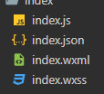

index.js: js文件,用于方法,变量...

index.json: 使用插件的地方

index.wxml: html文件

index.wxss: 样式文件


# 1.下载

...

# 2.新建

注意:AppId: wx33c58e91dc356845

https://mp.weixin.qq.com/wxamp/devprofile/get_profile?token=19824149&lang=zh_CN

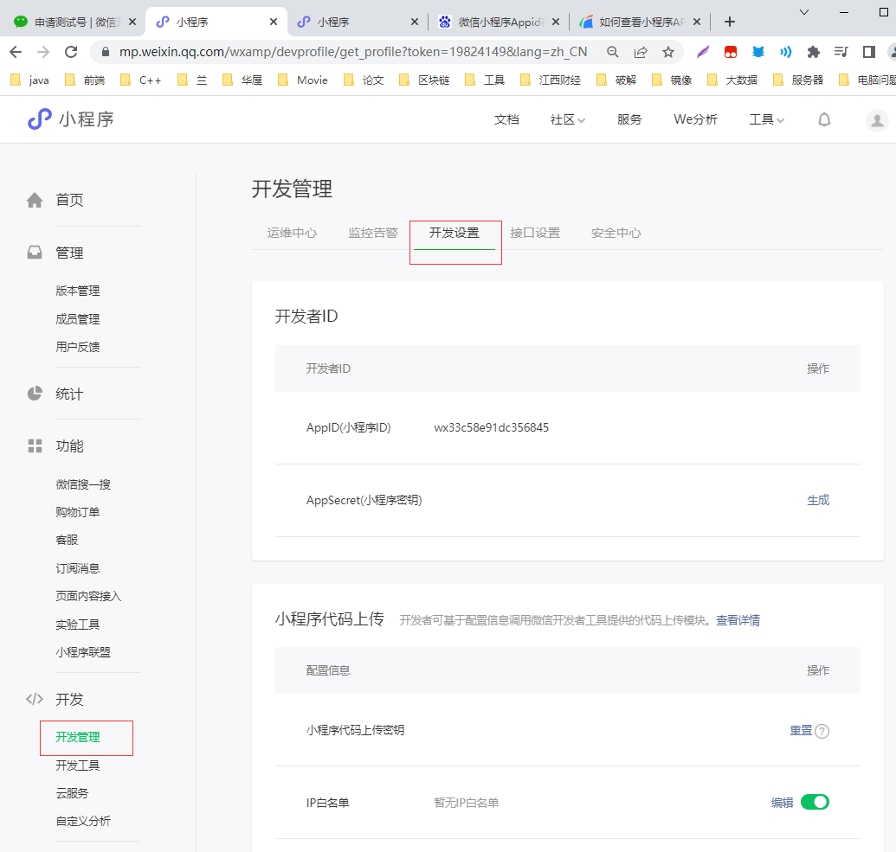


新建后的项目:

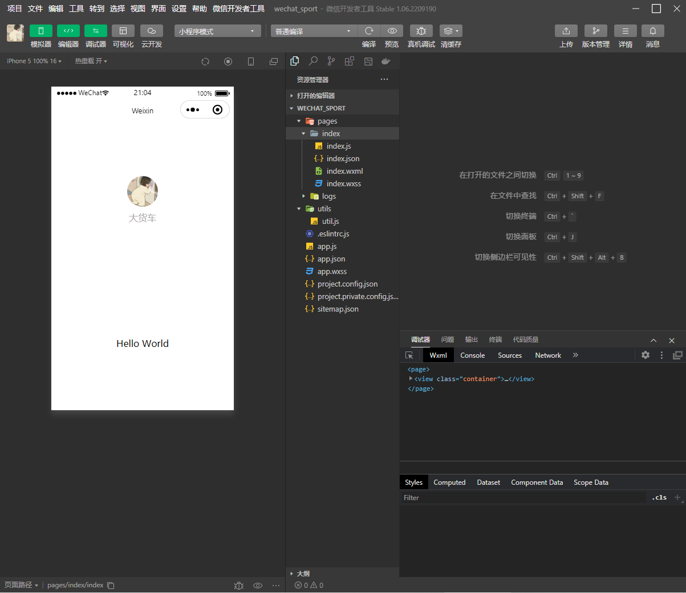


# 3.登录功能

## 1.设置不校验域名

这个功能是编译时异常,本地的接口验证不通过

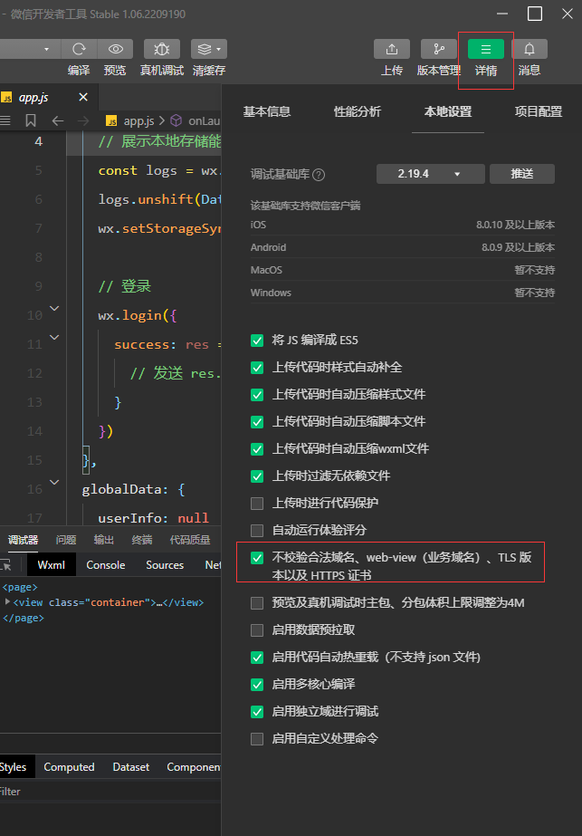


## 2.定位到app.js

### 1.测试: http://localhost:9090/test/hello

```vue
 // 登录
    wx.login({
      success: res => {
        // 发送 res.code 到后台换取 openId, sessionKey, unionId
        if(res.code){
          // 放弃网络请求
          wx.request({
            url: 'http://localhost:9090/test/hello',
            success: (res) => {
              console.log("请求成功: ", res);
            },
            fail: (err) => {
              console.log('接口请求失败: ', err);
            }
          })
        }
        
      }
    })
  },
```


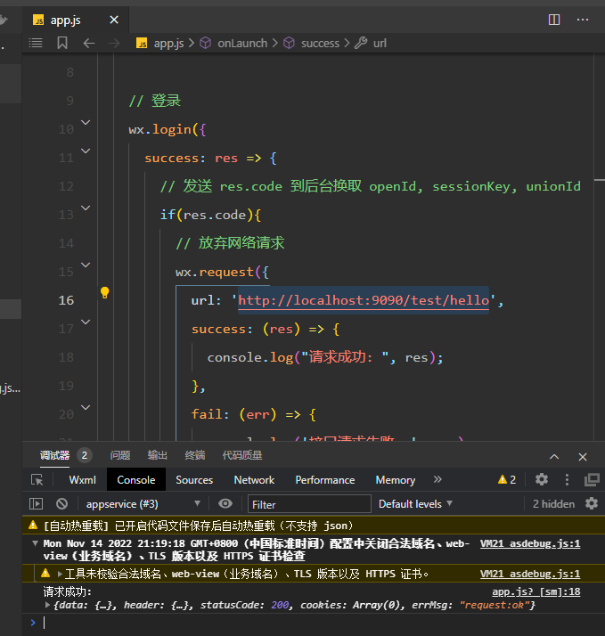


### 2.测试接口

后端没有定义这个接口,且接口未设置白名单:

接口: url: 'http://localhost:9090/mini/login',

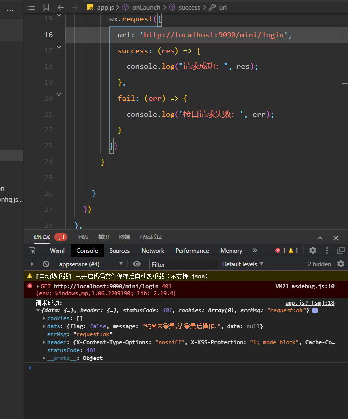

https://developers.weixin.qq.com/miniprogram/dev/OpenApiDoc/user-login/code2Session.html

## 3.后端接收到小程序登录信息

https://www.zhangshengrong.com/p/x7XRMleGNz/

后端回调:

登录凭证校验。通过 wx.login 接口获得临时登录凭证 code 后传到开发者服务器调用此接口完成登录流程。更多使用方法详见[小程序登录。](https://developers.weixin.qq.com/miniprogram/dev/framework/open-ability/login.html)

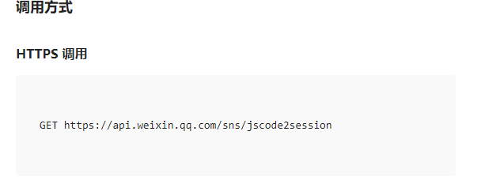

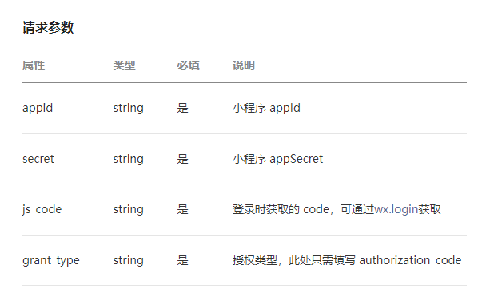

此时要用到httpclient工具类

```xml
        <!--  Http请求工具类  -->
        <dependency>
            <groupId>org.apache.httpcomponents</groupId>
            <artifactId>httpclient</artifactId>
            <version>4.5.13</version>
        </dependency>
```

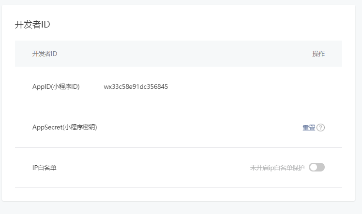

```txt
appid:
wx33c58e91dc356845
小程序密钥:
a342b4b503d2dff11c13da3ad191896a
```

拼接Url:

```java
    public static String getUrl(String code, String appid, String secret) {
        // https://mp.weixin.qq.com/wxopen/devprofile?action=get_profile&token=164113089&lang=zh_CN
        //GET https://api.weixin.qq.com/sns/jscode2session?appid=APPID&secret=SECRET&js_code=JSCODE&grant_type=authorization_code
        String requestUrl = "https://api.weixin.qq.com/sns/jscode2session?";
        return requestUrl + "appid=" + appid
                        + "&secret=" + secret
                        + "&js_code=" + code
                        + "&grant_type=authorization_code";
    }
```

登录方法:

```java
@GetMapping("/login")
    public Result login(String code){
        //System.out.println("code: " + code);
        if (StringUtils.isEmpty(code)){
            return Result.fail("登录失败, 请联系管理员");
        }
        String url = GenerateLoginUrl.getUrl(code, appid, secret);
        String resultString;
        CloseableHttpResponse response = HttpClientUtil.doGet(url);
        // 判断返回状态是否为200
        if (response.getStatusLine().getStatusCode() == 200) {
            try {
                resultString = EntityUtils.toString(response.getEntity(), "UTF-8");
                JSONObject jsonObject = JSON.parseObject(resultString);
                String openid = jsonObject.getString("openid");
                System.out.println("openid: "+ openid);
                // 根据openid判断是否为新用户
                Result result = sysUserService.miniLogin(openid);
                return result;
            } catch (IOException e) {
                e.printStackTrace();
            }finally {
                try {
                    if (response != null) {
                        response.close();
                    }
                } catch (IOException e) {
                    e.printStackTrace();
                }
            }
        }
        return Result.fail("登录失败");
    }
```


## 4.前端处理接收数据

```vue
    // 登录
    wx.login({
      success: res => {
        // 发送 res.code 到后台换取 openId, sessionKey, unionId
        if (res.code) {
          // 发送网络请求
          wx.request({
            url: 'http://localhost:9090/mini/login',
            data: {
              code: res.code
            },
            success: (res) => {
              console.log("请求成功: ", res);
              const {flag, data, message} = res.data;
              if(flag){
                wx.setStorageSync('token', `${data.tokenHead} ${data.token}`);
                wx.setStorageSync('userInfo', data.userInfo);
              }else{
                // 提示信息
                return wx.showToast({
                  title: message,
                  icon: "error",
                  // 提示时间 2000毫秒，2s
                  duration: 2000
                })
              }
              
            },
            fail: (err) => {
              console.log('接口请求失败: ', err);
            }
          })
        }

      }
    })
```

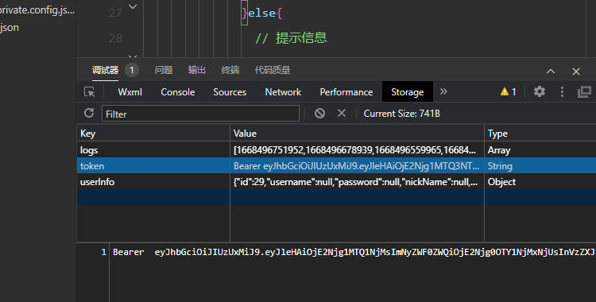


# 4.获取用户信息

## 1.官方文档:

https://developers.weixin.qq.com/miniprogram/dev/api/open-api/user-info/wx.getUserProfile.html

步骤:

调用wx.getUserProfile(Object object) --> 用户点击同意,微信返回userInfo

userInfo包括:

| 属性             | 描述                   |
| ---------------- | :--------------------- |
| string avatarUrl | 用户头像图片的 URL     |
| string nickName  | 用户昵称               |
| number gender    | 用户性别(不再返回)     |
| string country   | 用户所在国家(不再返回) |
|                  |                        |
|                  |                        |

开始页面信息:

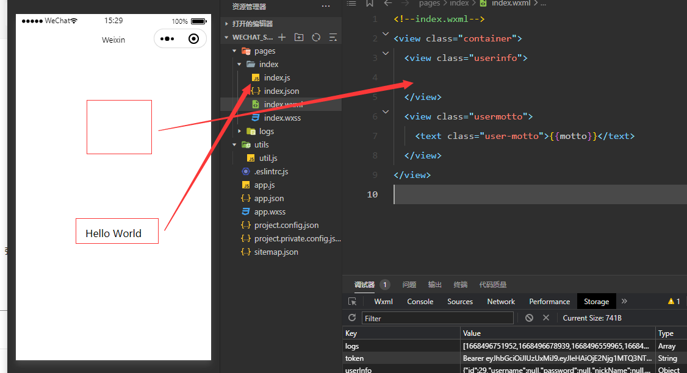


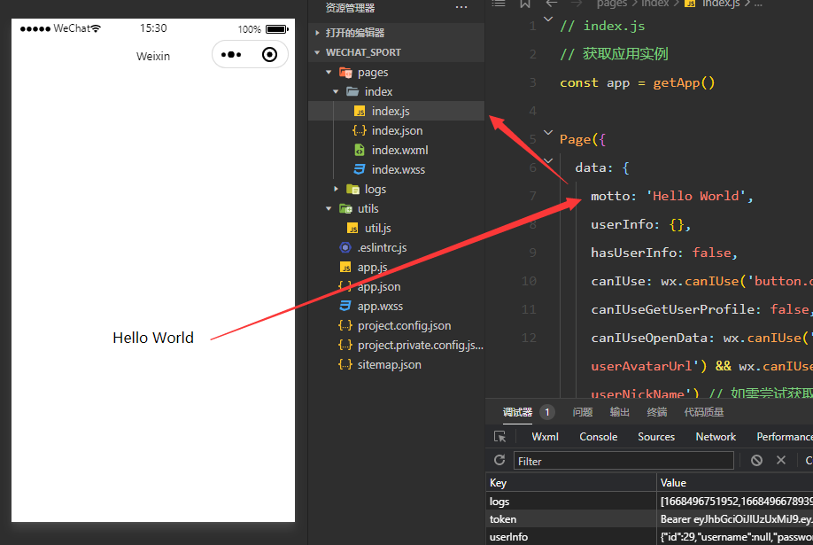


## 2.修改

```vue
    <button type="primary"
    bindtap="getInfo">登录</button>
```


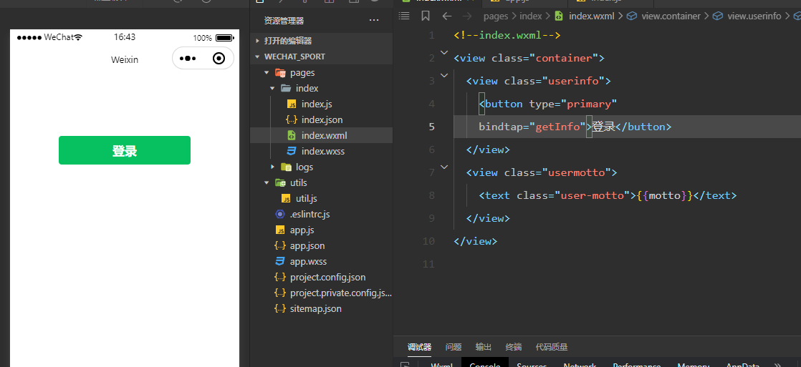

index.js

```js
getInfo(){
    wx.getUserProfile({
      desc: '用于完善会员资料',
      success: (res)=>{
        console.log(res);
        let {avatarUrl, gender, nickName}=res.userInfo;
        const user=wx.getStorageSync('userInfo');
        console.log(`openId: ${user.openId}`);
        wx.request({
          url: 'http://localhost:9090/mini/update/info',
          method: 'POST',
          header: {
            'Authorization': wx.getStorageSync('token')
          },
          data: {
            nickName: nickName,
            sex: gender,
            avatar: avatarUrl,
            openId: user.openId
          },
          success: (res)=>{
            console.log(`res: ${res}`);
          },
          fail: (err)=>{
            console.log(`err: ${err}`);
          }
        })
      }
    })
  }
```

## 5.后端处理

```java

    @PostMapping("/update/info")
    public Result updateInfo(@RequestBody SysUser user){
        System.out.println("user: "+user);
        sysUserService.updateByOpenId(user);
        return Result.success("更新用户信息成功!");
    }
```


# 5.使用Vant

官网: http://vant-contrib.gitee.io/vant-weapp/#/switch

引入:https://blog.csdn.net/xiaohaizi15/article/details/108969893

用@vant方式:https://blog.csdn.net/Fanqie_KK/article/details/124867663

注意使用npm i @vant/weapp -S --production的方式导入vant,就可以用@符号

## 1.初始化

### 1.查看

首先查看目录结构中有没有一个package.json的文件,有则删除

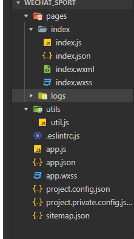

### 2.npm init

在终端输入npm init 一路回车

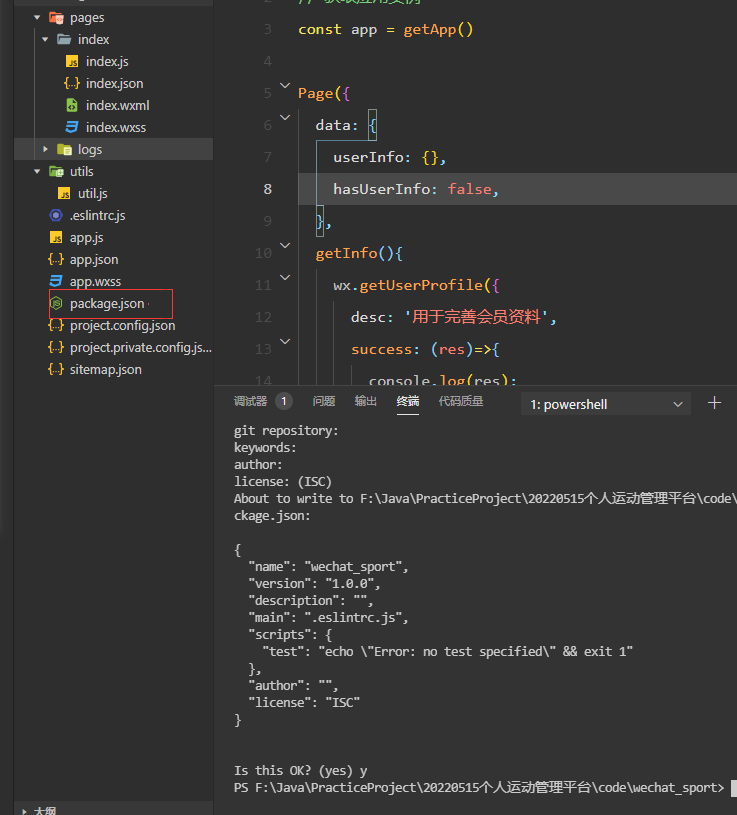

## 3.运行安装命令

先用淘宝镜像:

npm install -g cnpm --registry=https://registry.npm.taobao.org

cnpm i vant-weapp -S --production

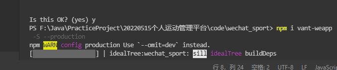

## 4.构建

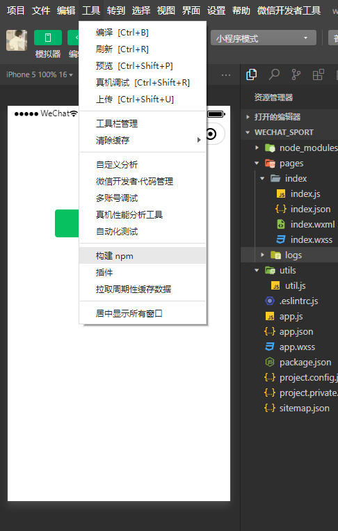

构建完成,会生成一个mini...

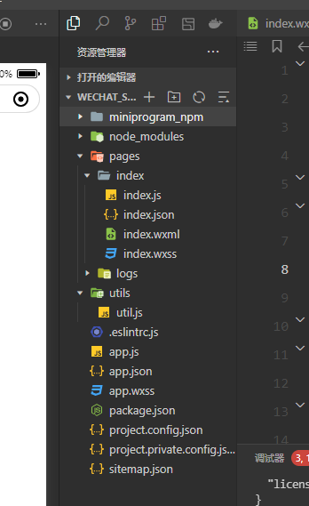


如果有这个,也打开

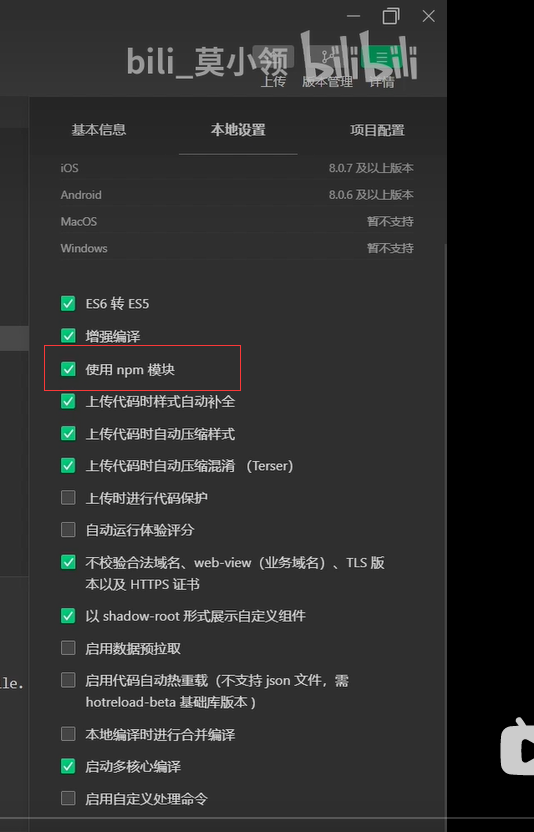


## 5.使用:

### 1.json

定位到要使用的页面的json文件,如果要使用button

```json
{
  "usingComponents": {
    "van-button": "/miniprogram_npm/vant-weapp/button/index"
  }
}
```

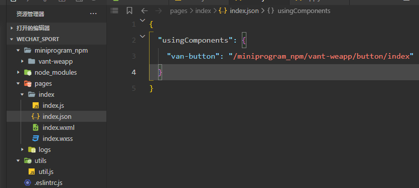


### 2.wxml

使用

```html
    <van-button type="primart"
    bindtap="getInfo">登录</van-button>
```


### 3.如果显示有问题

https://blog.csdn.net/qq_44793507/article/details/127715720

不生效

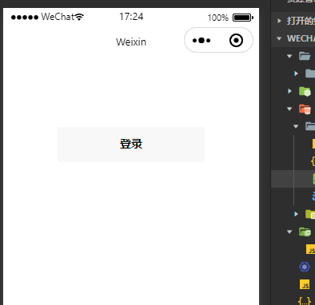

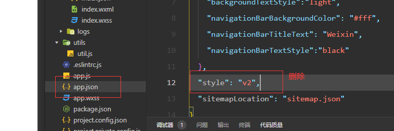

### 6.效果

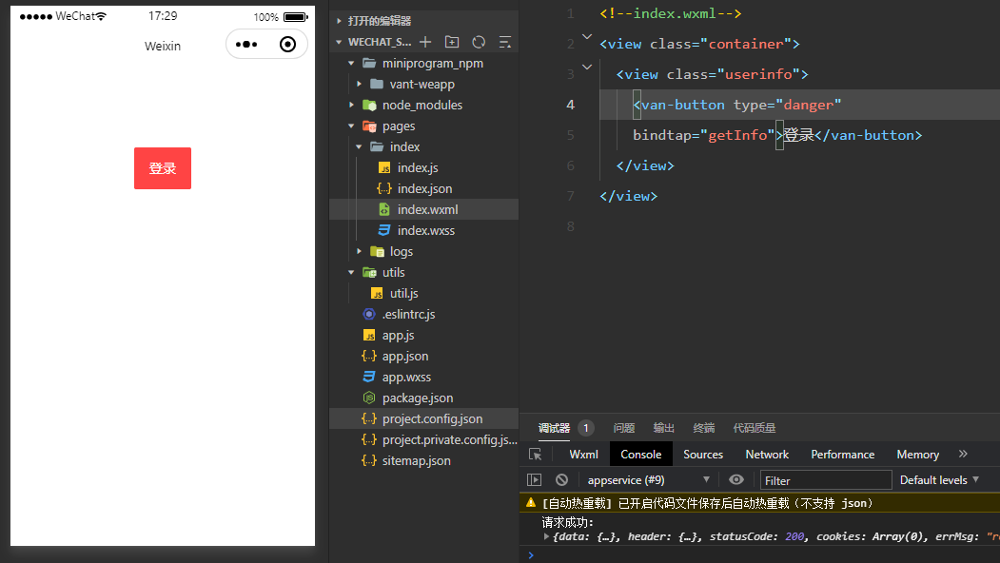


# 6.首页底部

vant官网:

https://vant-contrib.gitee.io/vant-weapp/#/tabbar

博客实例教程:

https://blog.csdn.net/Utopia_Zq/article/details/111028339

## 1.创建custom-tab-bar文件夹

在page下创建custom-tab-bar文件夹,名字不能变,并创建以下文件。

```txt
custom-tab-bar/index.js
custom-tab-bar/index.json
custom-tab-bar/index.wxml
custom-tab-bar/index.wxss
```

注意,与page文件夹同级,不然会不显示:

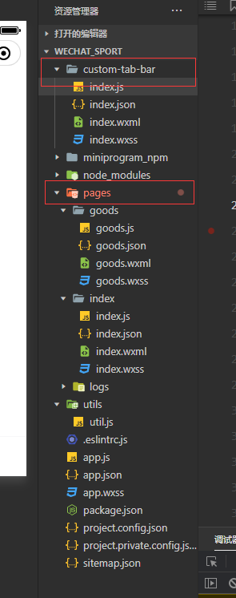


## 2.引入

```html
<van-tabbar active="{{ active }}" wx:if="{{ show }}" bind:change="onChange">
    <van-tabbar-item 
        wx:for="{{ list }}" 
        wx:key="index" 
        icon="{{item.icon}}">{{item.text}}</van-tabbar-item>
</van-tabbar>
```

index.json

```json

{
    "component": true,
    "usingComponents": {
        "van-tabbar": "@vant/weapp/tabbar/index",
        "van-tabbar-item": "@vant/weapp/tabbar-item/index"
    }
}
```

index.js

```js
Component({
    data: {
        active: 0,
        show: true,
        list: [
            {
                pagePath: "/pages/index/index",
                text: "资讯",
                icon: 'smile',
            },
            {
                pagePath: "/pages/logs/logs",
                text: "商品",
                icon: 'shopping-cart'
            },
        ]
    },
    methods: {
        /**
         * 用户点击导航栏触发
         * @param {*} event 
         */
        onChange(event) {
            // event.detail 的值为当前选中项的索引
            console.log("event.detail: ", event.detail);
            this.setData({
                active: event.detail,
            });
            //页面切换
            wx.switchTab({
                url: this.data.list[event.detail].pagePath,
            });
        },

        init() {
            let token = wx.getStorageSync('token');
            if (!token) {
                this.setData({
                    show: false
                });
            } else {
                this.setData({
                    show: true
                });
            }
            const page = getCurrentPages().pop();
            this.setData({
        　      active: this.data.list.findIndex(item => item.pagePath === `/${page.route}`)
            });
        }
    }
});
```


app.json

```json
  "tabBar": {
    "custom": true,
		"color": "#000000",
		"selectedColor": "#000000",
		"backgroundColor": "#000000",
		"list": [
			{
                "pagePath": "pages/index/index",
                "text": "资讯"
            },
            {
                "pagePath": "pages/logs/logs",
                "text": "商品"
            }
		]
	}
```

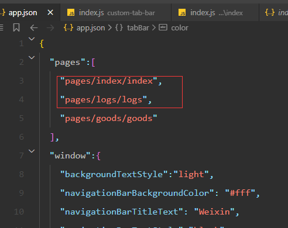


使用到的page,要引入


## 3.更新索引

https://blog.csdn.net/qq_41297837/article/details/108284726

如果未更新索引,会延迟显示

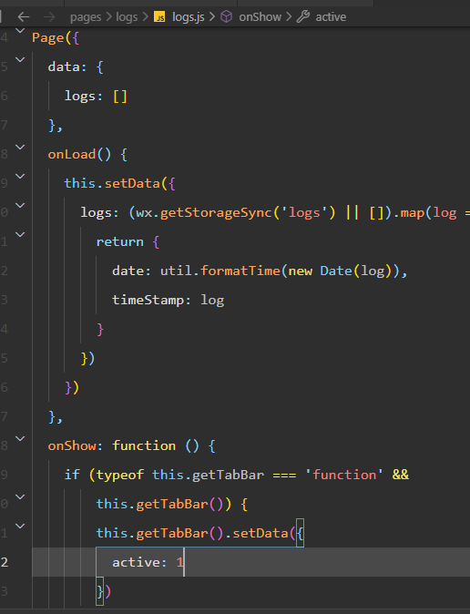


# 7.页面跳转


# 8.全局变量

定义(在app.js中):

```js
  globalData: {
    userInfo: null,
    url: 'http://localhost:9090',
    token: null,
    runData: [],
    qiNiuInmage: "",
  }
```

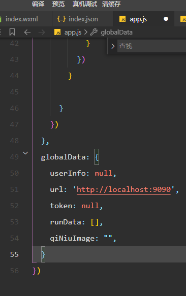


使用:

app.globalData.url


# 100.Bug

微信登录的用户没有用户名,这一步会报错

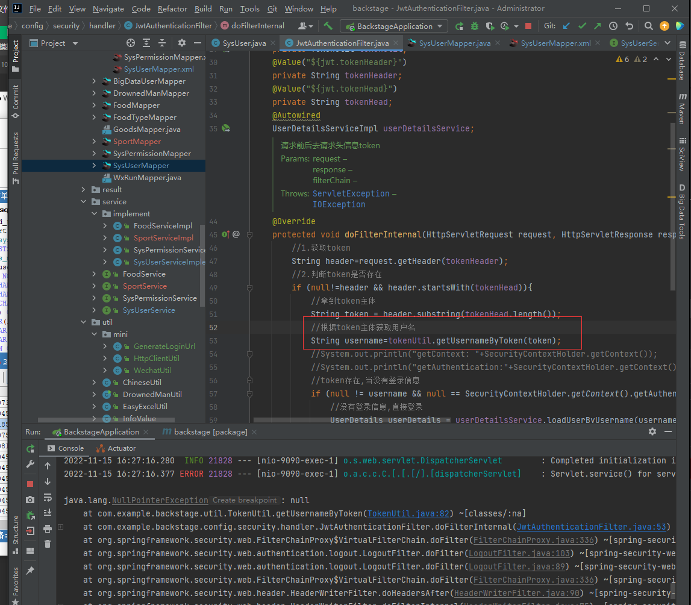